## Introduction

Since the bubbling part of the Web3-learning stream features more about tooling than writing code, many aspiring web3 developers often are exposed to boilerplate code where most of the things happening are abstracted. Picking the right choice of tools and knowing how to use them effectively will give you a better experience as a web3 developer and increase your efficiency. This is one of the goals of Celo as a platform.

## Prerequisites

This tutorial exposes you to Hardhat (basic setup and configuration) as one of the many tools you need to successfully deploy smart programs on Celo. You need to be familiar with the following:

- Prior knowledge of Javascript programming language.
- Familiar with using the command line.
- Foundational programming know-how.

If you need some headstarts, there are a couple of tutorials on **[Javascript](https://developer.mozilla.org/en-US/docs/Web/JavaScript)** documentation that prepare your way.

## Requirements

To get started, you will need to have the following technologies installed to make the journey smooth:

- Code Editor. To follow along with me, I recommend that you install Visual Studio Code.
- Nodejs version 12.0.1 or later . With Nodejs, you have access to Node Package Manager - NPM or Yarn .
- Download and install Git bash, and a tutorial to help you get started.

_Please note that this tutorial will not cover smart contracts or frontend code._

## Basic Hardhat Configuration

**What is Hardhat?**

As defined on the official website, _Hardhat is a development environment for Ethereum software. It consists of different components for editing, compiling, debugging and deploying your smart contracts and dApps, all of which work together to create a complete development environment._

Basically, Hardhat was built to target blockchain platforms that are compatible with Ethereum Virtual Machine - EVM, of which Celo happens to be one. Its flexibility of use and extendability makes it one of a kind. Hardhat potentially allows the installation of plugins, and it can even be configured to use other competitive tools, such as the Truffle framework. Let’s do a basic Hardhat installation and set up; to automate connection to Celo networks. As a reminder, you should have the aforementioned prerequisites set up before attempting this section.

Open up a git bash terminal and the system terminal side by side. We don’t need two command lines, but I want to show you a common challenge most web3 developers often encounter and a simple hack that saves you the headache.

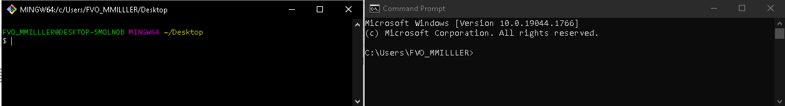

Make a new directory in the "git bash" terminal for this tutorial. And name it _**celo-hardhat-example**_ .

Run:

```bash
mkdir celo-hardhat-example && cd celo-hardhat-example
```

These simple commands create a new project folder with the name tag **“celo-hardhat-example”** and navigate into it. As one of the git bash features, it allows nesting commands by using the `&&` operator.

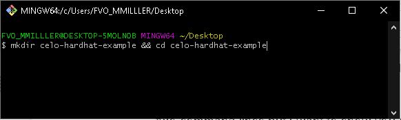

Still in the project directory, run: "yarn add hardhat" or "npm install hardhat", whichever package manager you prefer. Be sure to have an internet connection as the command downloads hardhat set-up scripts in the project’s root directory. You may experience delays with Git bash as sometimes it takes longer to install hardhat successfully. If this is the case, switch to using the system’s command prompt or that of VSCode but split the commands instead by removing the `“&&”` operator. After that, run:

```bash
npm install --save-dev hardhat
```

Here, we are installing the Hardhat setup script as a dependency. When the installation is complete, we will create an instance of a hardhat boilerplate project. To do this, run:

```bash
npx hardhat
```

This command initializes a new instance of the Hardhat development environment.
`Note`: If you run `'npx hardhat'` using Bash CLI, you get a weird error like this.

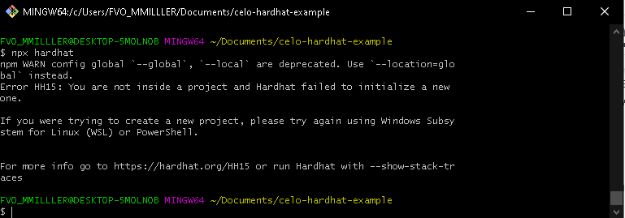

This is a known compatibility issue with Git bash to create an instance of hardhat. To solve it, simply navigate to the project’s folder in a new terminal other than Git bash (one you opened earlier), run the same command in the command prompt or VSCode terminal, and “Viola” works fine.

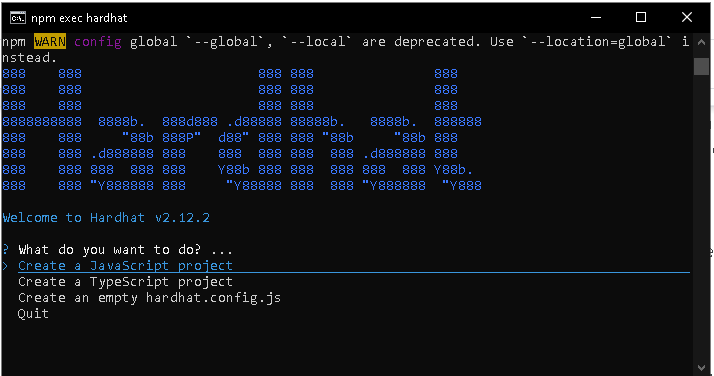

A warm display showing installation success and a dialogue section will pop up in the terminal asking for your preferences. Select Javascript as the preferred language (for this tutorial) by clicking “Enter” on your keyboard. Next, you will be asked to install nomiclabs tools. There are a couple of dependencies/packages we need for our project. They’re compressed in “@nomicfoundation/hardhat-toolbox” so you do not have to download them separately such as “@nomiclabs/hardhat-waffle”, “@etherproject” plus a few others. Watch out for it in the terminal. Copy-paste it back to the terminal and run it. In a few minutes, the installation should be complete. Open the boilerplate code from the current CLI. Run "code ." (i.e code space dot).

```bash
npm install --save-dev "hardhat@^2.12.2" "@nomicfoundation/hardhat-toolbox@^2.0.0"
```

If all goes well, Your project folder/file structure should look like this:

- Celo-hardhat-example (Project/root directory)
- contracts (folder)
- scripts (folder)
- test (folder)
- .gitIgnore (file)
- hardhat.config.js (file)
- package.json (file)
- README.md (file)

Let’s examine the structure and how we can configure it to make the best use of them.

**contracts**:

This folder contains smart contract files written in solidity. When you invoke hardhat to compile your contracts i.e, "npx hardhat compile", The instruction is passed to the default solidity compiler - “solc” to execute compilation instruction on every file with ".sol" extension inside the contacts folder. In other words, contracts are an array of solidity files. You can override the compiler version by explicitly defining the version of "solc" that will be used to compile all of the solidity files by explicitly speecifying a preferred list of "solc" versions in the "hardhatconfig.js". Don't worry much about this. I will show you as we progress.

As a good practice, you could separate concerns among the different ".sol" files by filtering them into groups.

_Example_: Under the contract folder, you could have:

- contracts
- interfaces
- libraries
- utilities

Let’s take a look at the example contract (Lock.sol) under the contracts folder. The contract is written for example purposes. So you should not try to deploy to production. The first thing we want to do is compile the contract.

```bash
npx hardhat compile
```

An artifact folder is created that contains the compile contracts from which we can fetch the contract’s JSONInterface i.e ABI and other information.

**scripts**:

This folder contains Javascript files used for special tasks such as deployments. “scripts/deploy.js” is a deployment file that fetches and deploy compiled contracts from the artifacts that were generated when _npx hardhat compile_ was run. To actively run any ".js" file under the scripts, for example, “deploy.js”, use the command in the format:

```bash
npx hardhat run scripts/deploy.js
```

If you have files other than "deploy.js" and want to specifically point to it, you only need to substitute “deploy.js” for it.

Let’s try to deploy our **_Lock.sol_** contract to the Celo testnet. We will use the same command except for additional arguments to show we want to deploy to a specific network.

```bash
npx hardhat run scripts/deploy.js –network alfajores
```

The above command starts by invoking node package manager - **_npm_**, which goes into the `node_modules` (a folder containing all of the dependencies we need to run the program successfully), looks for hardhat, checks for **“run”** in its command list, invoke it on **“deploy.js”** file and instruct hardhat to deploy the outcome of the file to the selected network **“alfajores”** which is Celo testnet.

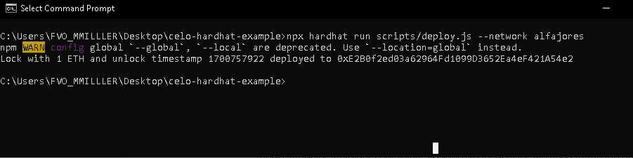

`Note`: Hardhat will always perform a new compilation instruction if changes to previously compiled contract (s) exist. This is done using the cache file that will be generated soon as hardhat command is invoked.
To deploy to Celo mainnet, we point the command to Celo as in:

```bash
npx hardhat run scripts/deploy.js –network celo
```

Alternatively, you may need to first deploy your contracts locally before sending it to a live network. This enables you to test extensively, debug and catch potential errors ahead of time. Hardhat provides you with two hardhat-based network options:

An In-memory instance of Hardhat Network created by default on start-up. When you run “npx hardhat deploy” without using the `“--network”` flag, the in-memory network is used.

The second option is a standalone hardhat network, that allows external clients, such as web3 wallets e.g. Metamask, to connect to it. To use this option, you have to run it as a node.

```bash
npx hardhat node
```

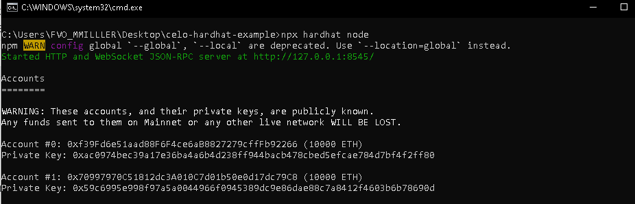

It uses a JSON RPC Websocket server that runs on port `http://127.0.0.1:8545`. A set of pre-funded accounts is generated, and you can connect external clients like Metamask. In the following tutorial, we will learn how to do that. To deploy to the server, run:

```bash
npx hardhat run scripts/deploy.js --network localhost
```

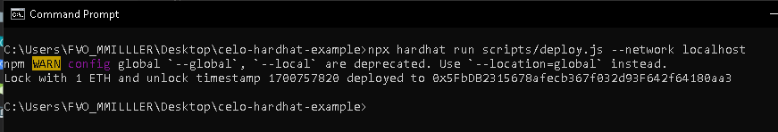

**test**:

As the name implies, the test holds all of the test files we have written for our smart programs. To run test files, we invoke the command:

```bash
npx hardhat test
```

To run a specific test file, use: `npx hardhat test/somefileName.js` where _‘somefileName’_ is the name of the target file.

**hardhat.config.js**:

This is the heart of hardhat which connect and serve every other part. From smart contract compilation to deployment to testing, Hardhat manages the processes by injecting some variables globally via the `hardhat.config.js`. It allows us to define however we want to interact with our DApp. Let’s set up our configuration to use either Celo testnet or mainnet each time we run designated commands.

The network parameters we will use are defined in **[Celo’s documentation](https://docs.celo.org/network)**.

Hardhat config file is a module that exports a JSON object with which hardhat exposes an object called `networks` - a JSON object that contains network information. Since we could connect to Celo’s testnet or mainnet, let’s populate the network field. Copy the following and replace the `module.exports`:

```bash
  /** @type import('hardhat/config').HardhatUserConfig */
module.exports = {
  solidity: "0.8.17",
  networks: {
    localhost: {
      url: "http://127.0.0.1:8545",
      accounts: {
        mnemonic: DEVCHAIN_MNEMONIC,
      },
    },
    alfajores: {
      url: "https://alfajores-forno.celo-testnet.org",
      accounts: [`${process.env.PRIVATE_KEY}`],
      chainId: 44787,
    },
    celo: {
      url: "https://forno.celo.org",
      accounts: [`${process.env.PRIVATE_KEY}`],
      chainId: 42220,
    },
  solidity: {
    version: "0.8.9",
    settings: {
      optimizer: {
        enabled: true,
        runs: 200
      },
     }
  },

```

From the image, we defined just after the network parameter a configuration for the solidity compiler. Let’s understand what this means.

- version: Defines the compiler version that should be used for compiling solidity files.

- settings/optimizer/enabled: If enabled, it optimizes our contract by pruning unnecessary and unused code to reduce contract size. If the contract size exceeds a certain range, their deployment may be rejected by the target network.

**.gitignore**:

Some folders are too big to commit to the repository. An example of such is the “node_modules” that houses all of our dependencies. Another example is the `.env` that holds sentitive information such as the environment variables we do not wish to commit to source control.

**package.json**:

This serves as the heart of most projects that use node js. It records the functional attributes of a project that npm uses to install dependencies, run scripts, and identify the entry point of our application.

**README.md**:

Use this file to describe your project : how to run and test it.

## Common Mistakes Or Errors You Might likely Encounter

**Invalid account Error**

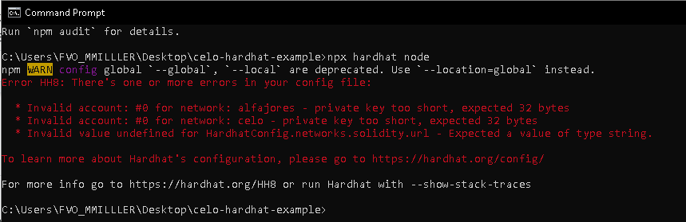

Most errors like this are triggered as a result of one or more issues in the “hardhat.config.js”. The message complains of an invalid account because hardhat could not find any private key from which to generate an account and send a transaction. If you have defined something like `“process.env.PRIVATE_KEY”` under the `“account”` field in the network object, you will need to provide where to find this variable. Such variables are sensitive and should be kept private as much as possible. Often, we use a `.env` file to manage it. Create a **.env** file in the project directory, and add the private key

_Solution_

This should keep the error away.

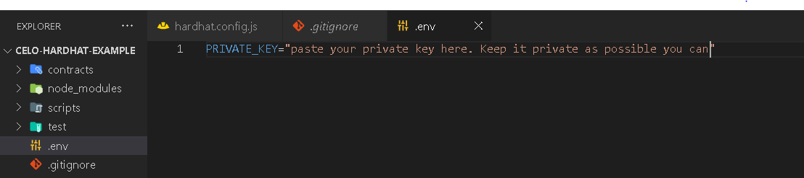

**Invalid value undefined for HardhatConfig.networks.solidity.url**

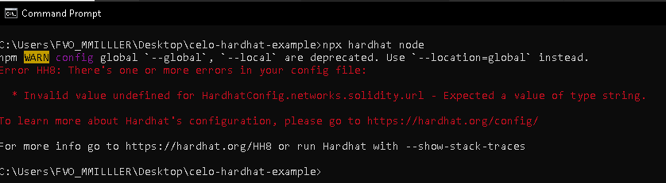

This error is prompted when you add a solidity object as part of network field object. The terminating curly brace for the networks was after the solidity object. From the image below, the terminating curly brace was omitted and hardhat sees _“solidity”_ as part of the network hence it expects that you include a URL which is an expected format for network objects.

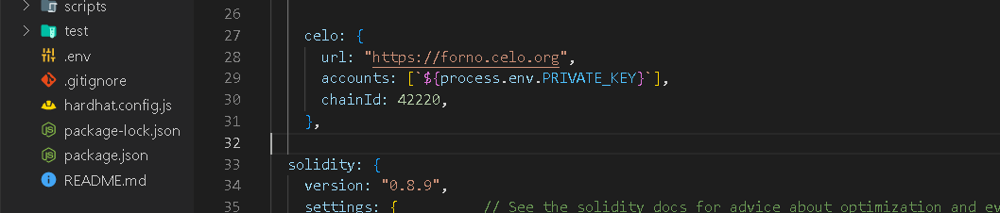

_Solution_

Simply terminate the network object before defining a solidity object. Add closing curly brace between the network object and the solidity object.

**Connection timeout**

When you are not connected to the network or your network is bad, you get errors like below. All you need is ensure you are connected to the internet when trying to deploy to the testnet or mainnet.

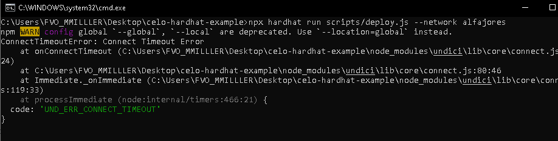

## Conclusion

We have learned:

- How to start a new hardhat project.
- How each of the files and folders work, their uses and how to configure them to match our needs.
- We have also gained an understanding of how things work under the hood.
- And lastly, we learned about few errors or mistakes that might likely arise during development.


## What next?

I hope that you will try this on your own. Create a new project. Try it several times and you will get used to it. As soon as you understand how things work, you will increase in speed and knowledge of web3 development.

This is foundational knowledge you need to work with hardhat as a Celo developer. In my next tutorial, I will show you more advanced interesting stuff you can do while developing DApps on Celo.


**Isaac Jesse** , aka _Bobelr_ is a smart contract/Web3 developer. He has been in the field since 2018, worked as an ambassador with several projects like Algorand and so on as content producer. He has also contributed to Web3 projects as a developer.

## References
- [Hardhat](https://hardhat.org/)
- [Celo developer resources](https://docs.celo.org/developer/)
