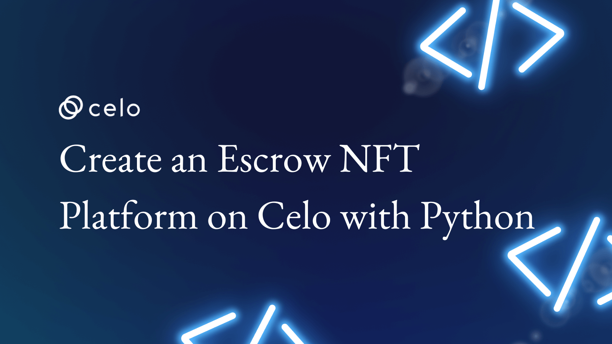
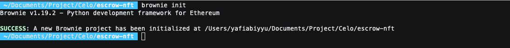
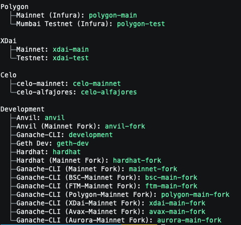
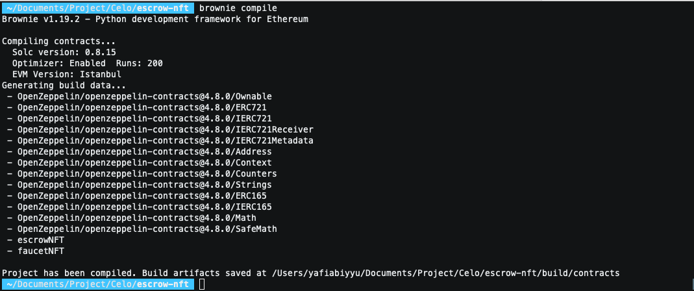
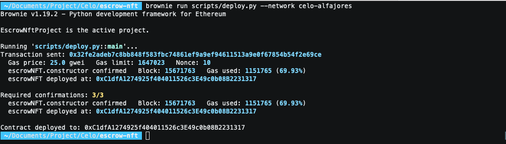
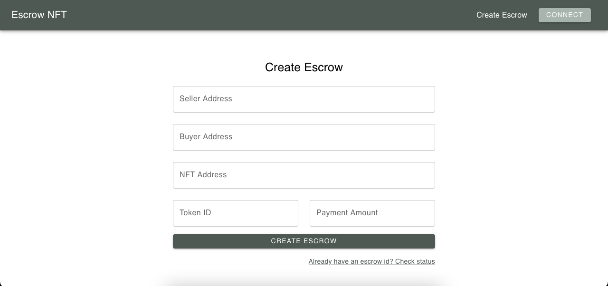

## Introduction​

In this tutorial, we will be creating an escrow NFT platform on the Celo network using Eth-Brownie Python. Escrow is a financial arrangement where a third party holds and regulates the transfer of funds or assets between two other parties. In this case, the third party is the smart contract. The two parties are the buyer and the seller. The escrow NFT platform will work like this, the seller will lock NFT in smart contract and the buyer will be able to buy the NFT by paying the price set by the seller. The smart contract will hold the NFT until the buyer pays the price. If the buyer pays the price, the NFT will be transferred to the buyer. If the buyer fails to pay the price, the NFT will be returned to the seller. In this tutorial, we will be using the Celo network, but the same concept can be applied to other evm-compatible blockchain networks.

## Prerequisites

These tutorials assume that you have some basic knowledge of solidity and python.

## Requirements

- [Python3](https://www.python.org/downloads/release/python-368/) or greater
- [NodeJs](https://nodejs.org/en/) >= v14.0.0 and npm >= 6.12.0 (For Ganache)
- [Ganache](https://www.trufflesuite.com/ganache) (For local blockchain)
- [eth-brownie](https://eth-brownie.readthedocs.io/en/stable/install.html) (For interacting with the blockchain)
- [python-dotenv](https://pypi.org/project/python-dotenv/) (For loading environment variables from .env file)

This is a list of what we’ll cover 🗒

- ✅ **Step 1:** Project setup
- ✅ **Step 2:** Write project code
- ✅ **Step 3:** Configure deployment settings
- ✅ **Step 4:** Deploy your Contract
- ✅ **Step 5:** Integration with frontend

## **Step 1:** Project setup

First, we will create a new directory for our project. Open your terminal and run the following command to create a new directory called `escrow-nft` and change directory to it.

```bash
mkdir escrow-nft && cd escrow-nft
```

next, we will install eth-brownie, python-dotenv, and ganache-cli. Run the following command to install them.

```bash
# Install eth-brownie and python-dotenv
pip3 install eth-brownie python-dotenv

# Install ganache
npm install -g ganache
```

Now, after installing all the required packages, we need to initialize our project. Run the following command to initialize our project.

```bash
brownie init
```

Here's what a successful initialization looks like:


Next, after initializing our project, we will create two files, `brownie-config.yaml` and `.env` in root directory.
`brownie-config.yaml` is a configuration file for brownie. It contains the default settings for our project. We will use this file to configure our project settings. `.env` is a file that contains environment variables. We will use this file to store our mnemonic phrase. We will use this mnemonic phrase to deploy our contract to the Celo network.

`brownie-config.yaml` file

```yaml
reports:
    exclude_contracts:
        - SafeMath
depedencies:
    - OpenZeppelin/openzeppelin-contracts@4.8.0
compiler:
    solc:
        version: 0.8.15
        optimizer:
            enabled: true
            runs: 200
        remappings:
            - "@openzeppelin=OpenZeppelin/openzeppelin-contracts@4.8.0"
networks:
    default: celo-alfajores
console:
    show_colors: true
    color_style: monokai
    auto_suggest: true
    completions: true
    editing_mode: emacs
dotenv: .env
wallets:
    from_mnemonic: ${MNEMONIC}
```

`.env` file

```text
MNEMONIC="your mnemonic phrase"
```

if you want to read more about brownie-config.yaml file, you can read it [here](https://eth-brownie.readthedocs.io/en/stable/config.html).

lastly for this step, we will add Celo network to our brownie project. Run the following command to add Celo network to our brownie project.

```bash
brownie networks add Celo celo-mainnet host=https://forno.celo.org chainid=42220 explorer=https://explorer.celo.org

brownie networks add Celo celo-alfajores host=https://alfajores-forno.celo-testnet.org chainid=44787 explorer=https://alfajores-blockscout.celo-testnet.org
```

You can check if the network has been added by running the following command.

```bash
brownie networks list
```

result if the network has been added successfully.



You can see that we have added two networks, celo-mainnet and celo-alfajores to our brownie network list.

## **Step 2:** Write project code

In this step, we will write the code for our smart contract. Create a new file called `escrowNFT.sol` in the contracts directory. This is where we will write our smart contract code. Here is an look at what our smart contract code will look like.

```solidity
// SPDX-License-Identifier: MIT
pragma solidity 0.8.15;

import "@openzeppelin/contracts/access/Ownable.sol";
import "@openzeppelin/contracts/token/ERC721/IERC721.sol";
import "@openzeppelin/contracts/utils/math/SafeMath.sol";

contract escrowNFT is Ownable {
    using SafeMath for uint256;

    // Declare state variables
    uint256 public fee;
    uint256 private escrowDigit = 16;
    uint256 private modulus = 10**escrowDigit;

    enum Status {
        Pending,
        Accepted,
        Rejected,
        Cancelled
    }

    struct Escrow {
        uint256 tokenId;
        uint256 paymentAmount;
        uint256 deadline;
        address tokenAddress;
        address buyerAddress;
        address sellerAddress;
        Status status;
    }

    mapping(uint256 => Escrow) public escrow;

    event NewEscrow(
        uint256 txId,
        uint256 tokenId,
        uint256 paymentAmount,
        address tokenAddress
    );

    event CancleEscrow(
        uint256 txId,
        uint256 tokenId,
        uint256 paymentAmount,
        address tokenAddress
    );

    event PayEscrow(
        uint256 txId,
        uint256 timestamp,
        uint256 tokenId,
        uint256 paymentAmount
    );

    event RejectEscrow(
        uint256 txId,
        uint256 tokenId,
        uint256 paymentAmount,
        address tokenAddress
    );


    modifier onlySeller(uint256 _txId) {
        require(
            msg.sender == escrow[_txId].sellerAddress,
            "Only seller can call this function"
        );
        _;
    }

    modifier onlyBuyer(uint256 _txId) {
        require(msg.sender == escrow[_txId].buyerAddress, "Only buyer can call this function");
        _;
    }

    constructor(uint256 _fee) {
        fee = _fee;
    }

    function updateFee(uint256 _fee) external onlyOwner {
        fee = _fee;
    }

    function claimFee() external onlyOwner {
        (bool status, ) = payable(msg.sender).call{value: address(this).balance}("");
        require(status, "Transfer failed");
    }

    function generateTxId(
        address _sellerAddress,
        address _buyerAddress,
        address _nftAddress,
        bytes memory _secret
    ) external view returns (uint256 txId) {
        txId =
            uint256(
                keccak256(
                    abi.encodePacked(
                        _sellerAddress,
                        _buyerAddress,
                        _nftAddress,
                        _secret
                    )
                )
            ) %
            modulus;
    }

    function createEscrow(
        uint256 _txId,
        uint256 _tokenId,
        uint256 _paymentAmount,
        address _tokenAddress,
        address _buyerAddress
    ) external {
        require(_paymentAmount > 0, "Payment amount must be greater than 0");
        require(_tokenAddress != address(0), "Token address cannot be 0x0");
        require(_buyerAddress != address(0), "Buyer address cannot be 0x0");
        IERC721 nft = IERC721(_tokenAddress);
        nft.transferFrom(msg.sender, address(this), _tokenId);
        escrow[_txId] = Escrow(
            _tokenId,
            _paymentAmount,
            block.timestamp + 1 days,
            _tokenAddress,
            _buyerAddress,
            msg.sender,
            Status.Pending
        );
        emit NewEscrow(_txId, _tokenId, _paymentAmount, _tokenAddress);
    }

    function cancleEscrow(uint256 _txId) external onlySeller(_txId) {
        require(
            block.timestamp > escrow[_txId].deadline,
            "Deadline not reached"
        );
        require(
            escrow[_txId].status == Status.Pending,
            "Escrow is not in pending status"
        );
        IERC721 nft = IERC721(escrow[_txId].tokenAddress);
        escrow[_txId].status = Status.Cancelled;
        nft.transferFrom(address(this), msg.sender, escrow[_txId].tokenId);
        emit CancleEscrow(
            _txId,
            escrow[_txId].tokenId,
            escrow[_txId].paymentAmount,
            escrow[_txId].tokenAddress
        );
    }

    function payEscrow(uint256 _txId) external payable onlyBuyer(_txId) {
        require(block.timestamp < escrow[_txId].deadline, "Deadline reached");
        require(
            escrow[_txId].status == Status.Pending,
            "Escrow is not in pending status"
        );
        IERC721 nft = IERC721(escrow[_txId].tokenAddress);
        uint256 amountAfterFee = _calculateFee(msg.value);
        escrow[_txId].status = Status.Accepted;
        (bool status, ) = payable(escrow[_txId].sellerAddress).call{value: amountAfterFee}("");
        require(status, "Transfer failed");
        nft.transferFrom(address(this), msg.sender, escrow[_txId].tokenId);
        emit PayEscrow(
            _txId,
            block.timestamp,
            escrow[_txId].tokenId,
            escrow[_txId].paymentAmount
        );
    }

    function rejectEscrow(uint256 _txId) external onlyBuyer(_txId) {
        require(block.timestamp < escrow[_txId].deadline, "Deadline reached");
        require(
            escrow[_txId].status == Status.Pending,
            "Escrow is not in pending status"
        );
        IERC721 nft = IERC721(escrow[_txId].tokenAddress);
        escrow[_txId].status = Status.Rejected;
        nft.transferFrom(address(this), escrow[_txId].sellerAddress, escrow[_txId].tokenId);
        emit RejectEscrow(
            _txId,
            escrow[_txId].tokenId,
            escrow[_txId].paymentAmount,
            escrow[_txId].tokenAddress);
    }
    
    function _calculateFee(uint256 _paymentAmount) private view returns(uint256 amountAfterFee) {
        uint256 feeAmount = _paymentAmount.mul(fee).div(100);
        amountAfterFee = _paymentAmount.sub(feeAmount);
    }
}
```

Let us analyze the code line by line.

```solidity
// SPDX-License-Identifier: MIT
pragma solidity 0.8.15;
```

First line, we declare the SPDX license identifier of the relevant license for the contract. The second line, we declare the solidity version we are using.

```solidity
import "@openzeppelin/contracts/access/Ownable.sol";
import "@openzeppelin/contracts/token/ERC721/IERC721.sol";
import "@openzeppelin/contracts/utils/math/SafeMath.sol";
```

We'll be using OpenZeppelin contracts for our project. Ownable contract will be used to make sure only the owner of the contract can call certain functions. IERC721 is the interface for ERC721 tokens. SafeMath is a library that provides mathematical functions and prevents integer overflow.

```solidity
uint256 public fee;
uint256 private escrowDigit = 16;
uint256 private modulus = 10**escrowDigit;
```

The `fee` variable will be used to store the fee percentage. The `escrowDigit` variable will be used to generate a unique transaction ID. The `modulus` variable will be used to generate a unique transaction ID.

```solidity
enum Status {
        Pending,
        Accepted,
        Rejected,
        Cancelled
    }
```

Enum `Status` will be used to store the status of the escrow.

```solidity
struct Escrow {
        uint256 tokenId;
        uint256 paymentAmount;
        uint256 deadline;
        address tokenAddress;
        address buyerAddress;
        address sellerAddress;
        Status status;
    }
```

`Escrow` struct will be used to store the details of the escrow.

```solidity
mapping(uint256 => Escrow) public escrow;
```

The `escrow` mapping will be used to map the transaction ID to the Escrow struct.

```solidity
event NewEscrow(
    uint256 txId,
    uint256 tokenId,
    uint256 paymentAmount,
    address tokenAddress
);

event CancleEscrow(
    uint256 txId,
    uint256 tokenId,
    uint256 paymentAmount,
    address tokenAddress
);

event PayEscrow(
    uint256 txId,
    uint256 timestamp,
    uint256 tokenId,
    uint256 paymentAmount
);

event RejectEscrow(
    uint256 txId,
    uint256 tokenId,
    uint256 paymentAmount,
    address tokenAddress
);
```

These events are emitted when a new escrow is created, an escrow is cancelled, an escrow is paid, and an escrow is rejected.

```solidity
modifier onlySeller(uint256 _txId) {
    require(
        msg.sender == escrow[_txId].sellerAddress,
        "Only seller can call this function"
    );
    _;
}

modifier onlyBuyer(uint256 _txId) {
    require(msg.sender == escrow[_txId].buyerAddress, "Only buyer can call this function");
    _;
}
```

These modifiers are used to make sure only the seller or the buyer can call certain functions.

```solidity
function updateFee(uint256 _fee) external onlyOwner {
    fee = _fee;
}

function claimFee() external onlyOwner {
    (bool status, ) = payable(msg.sender).call{value: address(this).balance}("");
    require(status, "Transfer failed");
}
```

The `updateFee` function is used to update the fee percentage. The `claimFee` function is used to claim the fee collected by the contract.

```solidity
function generateTxId(
    address _sellerAddress,
    address _buyerAddress,
    address _nftAddress,
    bytes memory _secret
) external view returns (uint256 txId) {
    txId =
        uint256(
            keccak256(
                abi.encodePacked(
                    _sellerAddress,
                    _buyerAddress,
                    _nftAddress,
                    _secret
                )
            )
        ) %
        modulus;
}
```

`generateTxId` function is used to generate a unique transaction ID to be used for the escrow. The transaction ID is generated using the seller address, buyer address, NFT address, and the secret. secret parameter is used to make sure the transaction ID is unique for each escrow.

```solidity
function createEscrow(
    uint256 _txId,
    uint256 _tokenId,
    uint256 _paymentAmount,
    address _tokenAddress,
    address _buyerAddress
) external {
    require(_paymentAmount > 0, "Payment amount must be greater than 0");
    require(_tokenAddress != address(0), "Token address cannot be 0x0");
    require(_buyerAddress != address(0), "Buyer address cannot be 0x0");
    IERC721 nft = IERC721(_tokenAddress);
    nft.transferFrom(msg.sender, address(this), _tokenId);
    escrow[_txId] = Escrow(
        _tokenId,
        _paymentAmount,
        block.timestamp + 1 days,
        _tokenAddress,
        _buyerAddress,
        msg.sender,
        Status.Pending
    );
    emit NewEscrow(_txId, _tokenId, _paymentAmount, _tokenAddress);
}
```

`createEscrow` is used to create a new escrow. The function takes the transaction ID, token ID, payment amount, token address, and buyer address as parameters. The function first checks if the payment amount is greater than 0, and check token, buyer address are not 0x0. Then it transfers the NFT from the seller to the contract. Then it creates a new escrow in the `escrow` mapping and emits the `NewEscrow` event.

```solidity
function cancleEscrow(uint256 _txId) external onlySeller(_txId) {
    require(
        block.timestamp > escrow[_txId].deadline,
        "Deadline not reached"
    );
    require(
        escrow[_txId].status == Status.Pending,
        "Escrow is not in pending status"
    );
    IERC721 nft = IERC721(escrow[_txId].tokenAddress);
    escrow[_txId].status = Status.Cancelled;
    nft.transferFrom(address(this), msg.sender, escrow[_txId].tokenId);
    emit CancleEscrow(
        _txId,
        escrow[_txId].tokenId,
        escrow[_txId].paymentAmount,
        escrow[_txId].tokenAddress
    );
}
```

`cancleEscrow` function is used to cancel an escrow. The function takes the transaction ID as a parameter. First, function will check if the deadline is reached and the escrow status is pending. If both conditions are true, the function will transfer the NFT back to the seller and emit the `CancleEscrow` event.

```solidity
function payEscrow(uint256 _txId) external payable onlyBuyer(_txId) {
    require(block.timestamp < escrow[_txId].deadline, "Deadline reached");
    require(
        escrow[_txId].status == Status.Pending,
        "Escrow is not in pending status"
    );
    IERC721 nft = IERC721(escrow[_txId].tokenAddress);
    uint256 amountAfterFee = _calculateFee(msg.value);
    escrow[_txId].status = Status.Accepted;
    (bool status, ) = payable(escrow[_txId].sellerAddress).call{value: amountAfterFee}("");
    require(status, "Transfer failed");
    nft.transferFrom(address(this), msg.sender, escrow[_txId].tokenId);
    emit PayEscrow(
        _txId,
        block.timestamp,
        escrow[_txId].tokenId,
        escrow[_txId].paymentAmount
    );
}
```

`payEscrow` function is used to pay an escrow. The function takes the transaction ID as a parameter. First, function will check if the deadline is not reached and the escrow status is pending and buyer only sends the payment amount equal to the payment amount in the escrow. If all conditions are true, the function will transfer the NFT to the buyer and pay the seller the payment amount minus the fee. Then it emits the `PayEscrow` event.

```solidity
function rejectEscrow(uint256 _txId) external onlyBuyer(_txId) {
    require(block.timestamp < escrow[_txId].deadline, "Deadline reached");
    require(
        escrow[_txId].status == Status.Pending,
        "Escrow is not in pending status"
    );
    IERC721 nft = IERC721(escrow[_txId].tokenAddress);
    escrow[_txId].status = Status.Rejected;
    nft.transferFrom(address(this), escrow[_txId].sellerAddress, escrow[_txId].tokenId);
    emit RejectEscrow(
        _txId,
        escrow[_txId].tokenId,
        escrow[_txId].paymentAmount,
        escrow[_txId].tokenAddress);
}
```

`rejectEscrow` function is used to reject an escrow. The function takes the transaction ID as a parameter. First, function will check if the deadline is not reached and the escrow status is pending. If both conditions are true, the function will transfer the NFT back to the seller and emit the `RejectEscrow` event.

```solidity
function _calculateFee(uint256 _paymentAmount) private view returns(uint256 amountAfterFee) {
    uint256 feeAmount = _paymentAmount.mul(fee).div(100);
    amountAfterFee = _paymentAmount.sub(feeAmount);
}
```

`_calculateFee` private function is used to calculate the fee amount. The function takes the payment amount as a parameter and returns the amount after fee.

## **Step 4:** Deploy your Contract

Now that we have written our smart contract, we need to deploy it to the blockchain. First, we need to compile our smart contract, and then we will deploy it to the blockchain. Use the following command to compile the smart contract.

```bash
brownie compile
```

result if the compilation is successful


Now, we need to deploy our smart contract to the blockchain. First create a new file `scripts/deploy.py` and add the following code to it.

```python
from brownie import accounts, config, escrowNFT

def main():
    # Get the account to use
    account = accounts.from_mnemonic(config["wallets"]["from_mnemonic"])

    # Deploy the contract
    contract = escrowNFT.deploy(2, {"from": account})

    # Wait for the transaction to be mined
    contract.tx.wait(3)

    print("Contract deployed to:", contract.address)
```

`main` function is used to deploy the contract. First, we get the account to use. Then we deploy the contract and wait for the transaction to be mined. Finally, we print the contract address. Now, we need to deploy the contract. Use the following command to deploy the contract.

```bash
# Deploy the contract to the Celo Alfajores testnet
brownie run scripts/main.py --network celo-alfajores

# Deploy the contract to the Celo Mainnet
brownie run scripts/main.py --network celo-mainnet
```

result if the deployment is successful


## **Step 5:** Integration with frontend

Now that we have deployed our smart contract to the blockchain, we need to integrate it with our frontend. You can clone the frontend we have created for this tutorial. Use the following command to clone the frontend.

```bash
# Clone the frontend
git clone https://github.com/yafiabiyyu/CeloSageFE.git

# Go to the frontend directory
cd CeloSageFE

# Install the dependencies
npm install --save
```

After cloning the frontend, we need to update the `src/utils/contract.tsx`, You need to update the contract address and ABI. You can get the contract address from the deployment result and you can get the ABI from the brownie project folder `build/contracts/escrowNFT.json`.

after updating the contract address and ABI, You can run the frontend using the following command.

```bash
npm start
```

result if the frontend is running successfully


## Conclusion

In this tutorial, we have learned how to create an escrow smart contract using Solidity and Brownie. We have also learned how to deploy the smart contract to the Celo blockchain.

## Next Steps

For your next steps, if you a python developer and want to learn how to create a smart contract using python, you can check about vyper. Vyper is a python-based smart contract programming language. You can check the [Vyper documentation](https://vyper.readthedocs.io/en/stable/) to learn more about Vyper.

## About the Author

I am a blockchain and crypto enthusiast. I am also a software engineer. I love to learn new things and share my knowledge with others. You can find me on [GitHub](https://github.com/yafiabiyyu) and [LinkedIn](https://www.linkedin.com/in/abiyyuyafi/).
