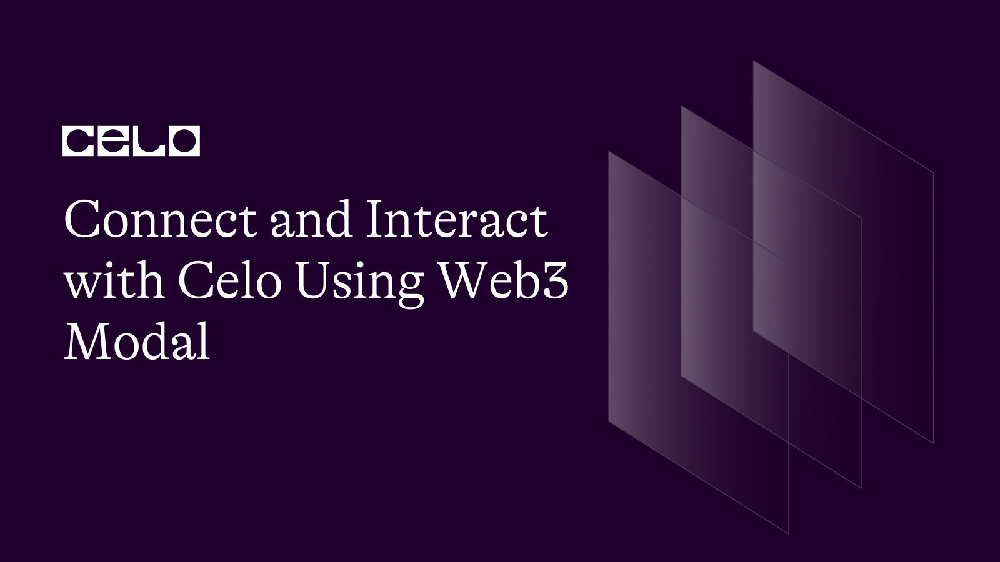

## Introduction

Building a user-centric blockchain-based application requires creating welcome experiences that make your users want to perform an action irrespective of known complexities or ones that may arise in the course of developing your product. There is a couple of libraries or provider that introduce different user experience. Here, you will learn about one of them.

## Prerequisites​

In this tutorial, I will walk you through the standard way of connecting to the Celo blockchain using web3Modal. To follow this tutorial, you need at least intermediate knowledge in the following skills.

- Smart contract development using solidity
- Javascript or Typescript
- Ability to use hardhat for smart contract development. **[Get started with hardhat](https://docs.celo.org/blog/tutorials/getting-started-on-celo-with-hardhat)**.

## Requirements​

Before we proceed, install the following tools:

- An editor. I recommend using VSCode.
- NodeJs version 14 or higher. I use version 18.12.1

**What we are building**

A decentralized exchange where users can swap ERC20 tokens for Celo and ERC20 tokens for another.

The project is split into two parts.

1. Smart contracts
2. Frontend

**Smart contracts**

We will edit the previous contracts used **[here](https://github.com/bobeu/nft-gated-dapp-dexHosting/tree/main/backend/contracts)**, add new features and deploy to Celo testnet - _Alfajores_.

- Create a new project folder.

```bash
mkdir connect-to-celo-using-web3modal
cd connect-to-celo-using-web3modal
```

- Clone the project.

```bash
git clone https://github.com/bobeu/nft-gated-dapp-dexHosting
```

- Navigate to the root directory.

```bash
cd nft-gated-dapp-dexHosting
```

- Install dependencies

```bash
yarn install
```

Let's improve the contract by adjusting so users can swap ERC20 assets for another asset of thesame standard. Currently, users are only able to swap ERC20 assets for Celo coin.

## contracts

The following files will affected by the changes.

- `SwapLab.sol` has the main contract for adding and removing liquidity and swapping Celo's ERC20 token for the $Celo coin.

  - Add a new function named `swapERC20ToERC20`. I
  - t should accept an argument of type 'Contract'. The argument will be an address for token the user wish to swap of type 'Contract'.
  - We must ensure such an address does not leave our contract susceptible to attack. In this case, it must be supported ahead of time.
  - Make the function payable so we can extract exchange fee in celo.
  - Since swapping tokens for another requires interacting with external contracts that we do not control the keys or have direct control over, we will guide against re-entrancy attack using the openzeppelin's `nonReentrant` modifier.
  - Exchange fee is extracted and forwarded to fee receiver.
  - Before the caller can swap `assetA`, they must approve the `SwapLab` contract to spend the swap amount from their wallet in `assetA` contract.
  - `assetA` is expected to be swapped to 'assetB' i.e `pr.pair`, so the owner must have deposited before now by approving `Swaplab` contract.

  > Note : I made it this for tutorial purpose so as to avoid complexities. In production, you'd want to adopt a method that will ensure there's a steady liquidity supply.

```ts
  function swapERC20ToERC20(IERC20 assetA) external payable nonReentrant isSupportedAsset(address(assetA), true) returns(bool) {
    uint fee = swapfee;
    require(msg.value > fee, "Insufficient value");
    uint deposit = IERC20(assetA).allowance(_msgSender(), address(this));
    uint assetAmantissa = 10 ** IERC20Metadata(address(assetA)).decimals();
    Pair memory pr = pairs[address(assetA)];
    require(deposit > 0, "No deposit");
    uint amtToSwapInAssetB = deposit.mul(pr.rateInAssetBOrA).div(assetAmantissa);
    require(IERC20(pr.pair).allowance(pr.owner, address(this)) >= amtToSwapInAssetB, "Not enough allowance");
    Address.sendValue(payable(feeTo), fee);
    bool sent = IERC20(pr.pair).transferFrom(pr.owner, _msgSender(), amtToSwapInAssetB);
    bool sent1 = IERC20(assetA).transferFrom(_msgSender(), pr.owner, deposit);
    require(sent && sent1, "Failed");

    return true;
  }
```

- In the context of this tutorial, Assets 'A' & 'B' are mutually exclusive. We will assign a function to independently set a pair for either of the assets.

  - `_setPair()` allows us to internally set token pair at construction time.
  - `setPair()` allows only accounts with the 'owner' privilege to set a pair.

  - Create storage slots where token pairs are recorded using mapping.

```js
  //> ...
  mapping (address => Pair) public pairs;

  //> ...
  function _setPair(address[] memory assets, uint[] memory rateInAssetBOrA, address tokenOwner) internal {
    require(assets.length == 2 && rateInAssetBOrA.length == assets.length, "Invalid data");
    require(Address.isContract(assets[0]) && Address.isContract(assets[1]), "Address not a contract");
    require(assets[0] != address(0) && assets[1] != address(0), "Zero address spotted");
    _setSupportedAsset(assets, rateInAssetBOrA);
    pairs[assets[0]] = Pair(rateInAssetBOrA[0], assets[1], tokenOwner);
    pairs[assets[1]] = Pair(rateInAssetBOrA[0], assets[0], tokenOwner);
  }

  function setPair(address[] memory assets, uint[] memory rateInAssetBOrA, address tokenOwner) public onlyOwner {
    _setPair(assets, rateInAssetBOrA, tokenOwner);
  }
```

- In a bid to attract more users, we will build an interface so that other smart contracts can interact with ours. Make a new folder called `interfaces`, add a new file - `ISwapLib.sol`, and add the following code.

```bash
mkdir interfaces
cd interfaces
touch ISwapLib.sol
```

```js
  // SPDX-License-Identifier: MIT

  pragma solidity 0.8.17;

  import "@openzeppelin/contracts/token/ERC20/IERC20.sol";

  interface ISwapLab {
    struct Pair {
      uint rateInAssetBOrA;
      address pair;
      address owner;
    }

    function swapERC20ToERC20(IERC20 assetA) external payable returns(bool);
    function swapERC20ForCelo(address asset) external payable returns(bool);

  }
```

The changes we need to make are completed. Let compile, test and deploy.

**Compile**

```bash
npx hardhat compile
```

**Testing**

```bash
npx hardhat test
```

**deploy**

The `hardhatConfig` file has been configured for the Celo testnet.

```bash
yarn deploy
```

Deployment artifacts are saved in the `deployments` folder.

## Frontend

This part uses `NFT` as a secondary authentication system. Firstly, users are routed to the `App` after successful wallet/provider authentication. Thereafter, we check if they already own a membership non-fungible token otherwise we try to mint for them. If this stage is successful, only then can they interact with the Dapp otherwise they remain on the LandingPage.

The previous project uses web3React but our focus is to use web3modal instead.

Exit the current directory into the root folder and install the dependencies:

```bash
cd ..
cd frontend
yarn install
```

The frontend uses web3modal to authenticate users and wagmi to manage the Dapp. For a full tutorial on how to set up wagmi project, please refer to the **[previous tutorial](https://docs.celo.org/blog/tutorials/build-an-nft-gated-dapp-and-deploy-on-decentralized-hosting-service)**.

**Changes**

- `frontend/web3ProviderOptions/index.ts`
  In this file, we configure wagmi client whose return value is parsed to create an instance of an Ethereum client. It is then exported so we can use it to configure the web3modal.

Configuring wagmi client requires that we input the project Id generated from **[walletconnect website](https://cloud.walletconnect.com)**.

```ts
import { useEffect, useState } from "react";
import {
  EthereumClient,
  w3mConnectors,
  w3mProvider,
} from "@web3modal/ethereum";

import type { AppProps } from "next/app";
import { configureChains, createClient } from "wagmi";
import { celoAlfajores } from "wagmi/chains";

// Get projectID at https://cloud.walletconnect.com
export const projectId = process.env.NEXT_PUBLIC_PROJECT_ID;
if (!projectId) {
  throw new Error("ID Error");
}
const chains = [celoAlfajores];

const { provider } = configureChains(chains, [w3mProvider({ projectId })]);
export const wagmiClient = createClient({
  autoConnect: true,
  connectors: w3mConnectors({ version: 1, chains, projectId }),
  provider,
});

export const ethereumClient = new EthereumClient(wagmiClient, chains);
```

- `pages/_app.tsx`
  - Reconfigure the `_app.tsx` to accommodate the use of web3modal.
  - Import 'WagmiConfig' class from `wagmi`.
  - Import 'Web3Modal' from `@web3modal/react`.
  - Import 'ethereumClient', 'projectId', and 'wagmiClient' from `@/web3ProviderOptions` file we previously set up.
  - To avoid 'window undefined error', we use react's `useEffect` hook to ensure the main component is mounted before rendering the whole app.
  - We then wrap the whole app in the 'WagmiConfig' component and parsed the exported wagmi client as an argument.

```ts
import React from "react";
import "@/styles/globals.css";
import Head from "next/head";
import styles from "@/styles/Home.module.css";
import type { AppProps } from "next/app";
import { WagmiConfig } from "wagmi";
import { Web3Modal } from "@web3modal/react";
import { ethereumClient, projectId, wagmiClient } from "@/web3ProviderOptions";

export default function App({ Component, pageProps }: AppProps) {
  const [mounted, setMounted] = React.useState<boolean>(false);
  React.useEffect(() => setMounted(true), []);

  return (
    <React.Fragment>
      <Head>
        <title>SwapLab</title>
        <meta name="description" content="decentralized token swap on Celo" />
        <meta name="viewport" content="width=device-width, initial-scale=1" />
        <link rel="icon" href="/favicon.ico" />
      </Head>
      <main className={styles.main}>
        {mounted ? (
          <WagmiConfig client={wagmiClient}>
            <Component {...pageProps} />
          </WagmiConfig>
        ) : null}
        {/* { mounted && <Component {...pageProps} />} */}
        <Web3Modal
          projectId={String(projectId)}
          ethereumClient={ethereumClient}
        />
      </main>
    </React.Fragment>
  );
}
```

- `components/App/ConnectButton.tsx`

  - Import 'useWeb3Modal' from `@web3modal/react`.
  - Import 'useAccount' and 'useDisconnect' from `wagmi`.

  > Note: As a convention, we will be able to access wagmi hooks until we initialize the wagmi provider which is what we have done in `page/_app.tsx`. It would look like we are basically reusing the previous method by reinventing wagmi, but in this case, we only use web3modal for authenticating the users and wagmi for accessing features that web3modal has not provided such as the `useAccount` and `useDisconnect` hooks. The connection between them was established when we initialized the wagmi client in `web3ProviderOptions/index`.

  - When the 'Connect Wallet' label is clicked, web3modal is invoked. At this point, the modal pops up to ask a user to select among the wallet options. Internally, the wagmi client knows when the user's wallet is connected or not.

```ts
import { useWeb3Modal } from "@web3modal/react";
import { useState } from "react";
import { useAccount, useDisconnect } from "wagmi";
import Button from "@mui/material/Button";
import { Spinner } from "../Spinner";

export default function ConnectButton() {
  const [loading, setLoading] = useState(false);
  const { open } = useWeb3Modal();
  const { isConnected } = useAccount();
  const { disconnect } = useDisconnect();
  const label = isConnected ? "Disconnect" : "Connect Wallet";

  async function openModal() {
    setLoading(true);
    await open();
    setLoading(false);
  }

  function onClick() {
    if (!isConnected) openModal();
    else disconnect();
  }

  return (
    <Button variant="contained" onClick={onClick} disabled={loading}>
      {loading ? <Spinner color="white" /> : label}
    </Button>
  );
}
```

- `pages/index.tsx`

```ts
import React from "react";
import { ethers } from "ethers";
import App from "../components/App";
import Header from "../components/Header";

function toHex(x: number) {
  return ethers.utils.hexlify(x);
}

export default function Home() {
  return (
    <main style={{ background: "#000" }}>
      {" "}
      <Header /> <App />{" "}
    </main>
  );
}
```

- `components/App/index.tsx`

In this file, the only changes we made is the `useAccount` hook we imported from wagmi. Through destructuring, we extract:

- **isConnected**: A boolean flag that says whether the current user's wallet is connected or not.
- **address**: The 32 bytes string representing the user's account address.
- **connector**: An object containing an instance of the currently connected wallet since there can be more than one wallet provider. From the connector, we can extract the provider object by invoking `connector.getProvider()`.
- Repeat the same processes in `components/App/Mint/index.tsx`.

```tsx
import * as React from "react";
import { createTheme, ThemeProvider } from "@mui/material/styles";
import runContractFunc from "../apis";
import { Home } from "./Home";
import { AppProtected } from "./AppProtected";
import { useAccount } from "wagmi";

const theme = createTheme();

export default function App() {
  const [isUser, setAuth] = React.useState(false);
  const { isConnected, address, connector } = useAccount();

  React.useEffect(() => {
    const abortOp = new AbortController();
    if (connector) {
      const getBalance = async () => {
        const provider = connector?.getProvider();
        const result = await runContractFunc({
          functionName: "nftBalance",
          account: address,
          providerOrSigner: provider,
        });
        result.balanceOrAllowance.toNumber() > 0 && setAuth(true);
        console.log("Bal", result.balanceOrAllowance.toNumber());
      };
      getBalance();
    }

    return () => abortOp.abort();
  }, [connector]);

  return (
    <ThemeProvider theme={theme}>
      {isConnected ? <AppProtected /> : <Home />}
    </ThemeProvider>
  );
}
```

- `components/api/getContractdata.ts`

In this file, we export the new asset's `abi` and `address` 'testToken2'.

```ts
import swapLab from "../../../backend/deployments/alfajores/SwapLab.json";
import testToken from "../../../backend/deployments/alfajores/TestToken.json";
import member from "../../../backend/deployments/alfajores/Membership.json";
import testToken2 from "../../../backend/deployments/alfajores/TestToken2.json";

export default function getContractData() {
  return {
    swapAbi: swapLab.abi,
    swapLabAddr: swapLab.address,
    testTokenAbi: testToken.abi,
    test2TokenAbi: testToken2.abi,
    test2Addr: testToken2.address,
    testAddr: testToken.address,
    memberAbi: member.abi,
    memberAddr: member.address,
  };
}
```

- `components/api/index.ts`

The `getBalanceTestToken2` arrow function fetches the user's balance in 'testToken2' contract.

```ts
// >...
const getBalanceTestToken2 = async (
  alc: string | undefined
): Promise<BigNumber> => {
  return await testToken2.balanceOf(alc);
};
// >...
```

Add an additional switch statement that swaps ERC20 tokens for another.

```ts
   case 'swapERC20':
      const txn_s = await swapLab.swapERC20ToERC20(testAddr, {value: value});
      await txn_s?.wait(2).then(async(rec: ContractReceipt) => {
        if(rec) {
          result.data = await getData();
          result.balanceOrAllowance = await getAllowance(swapLabAddr);
          if(cancelLoading) cancelLoading();
        }
      });
    break;
```

- `components/App/AppProtected/index.tsx`

To absorb the new function, we'll add another card component.

```ts
//>...
<Grid item xs={12}>
  <CardComponent
    step=""
    heading="Swap ERC20 for ERC20"
    isButton_1_display={true}
    button_1_start=""
    button_1_name={"Swap"}
    disableButton_1={!isUser}
    handleButton_1_Click={() => handleClick("swapERC20")}
    displayChild={loading}
    displayTextfield={true}
    handleTextfieldChange={handleAmountChange}
    description=""
  >
    <Spinner color={"white"} />
  </CardComponent>
</Grid>
//>...
```

Lastly, in the same file inside the `handleClick` function, let's extend the condition so users can pay a fee for swapping ERC20 assets.

```ts
//>...
if (functionName === "swap" || functionName === "swapERC20")
  val = ethers.utils.parseEther("0.0001");
//>...
```

In the frontend directory, run the command to interact with the Dapp.

```bash
yarn run dev
```

**[Get the complete source code](https://github.com/bobeu/connect-to-celo-using-web3modal)**

## Conclusion​

I'm happy that you complete this tutorial. You're a step away from building your dream Dapp on Celo. So far, we have learned to build a full Dapp using solidity, compile, test, and deployed it to Celo Alfajores. We also build an interface to showcase what we've built. If you're looking for more tutorials relating to Celo, **[here](https://docs.celo.org/blog/tutorials/)** is a place to get started.

## What next?

Are you thinking of launching your own project on the Celo blockchain right now? Kindly visit the **[developers documentation](https://docs.celo.org/tutorials)**.

## About the Author​

**Isaac Jesse** , aka _Bobelr_ is a smart contract/Web3 developer. He has been in the field since 2018, worked as an ambassador with several projects like Algorand and so on as a content producer. He has also contributed to Web3 projects as a developer.

## References​

- [Celo developers resources](https://docs.celo.org/developer/)
- [Source code](https://github.com/bobeu/nft-gated-dapp-dexHosting)
- [Wagmi doc](https://wagmi.sh/)
- [Web3Modal documentation](https://github.com/Web3Modal/web3modal)
