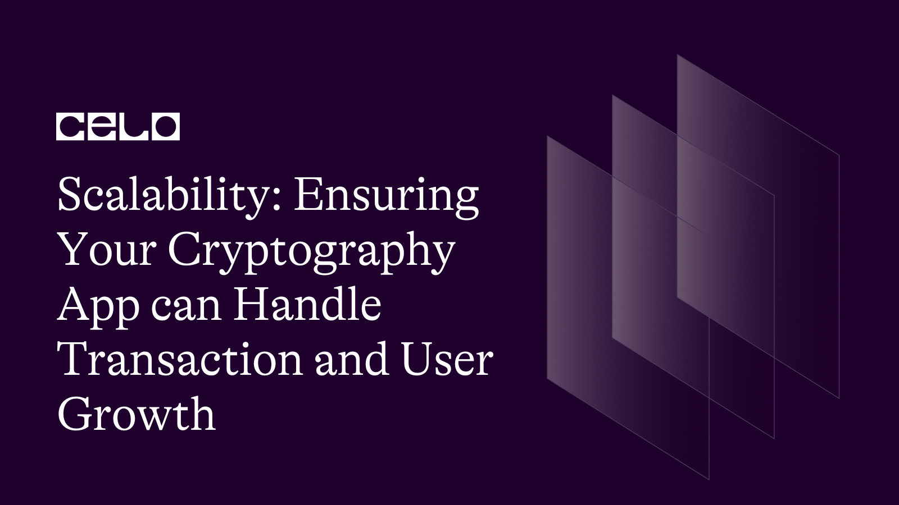

In this tutorial, you’ll learn how to improve key management and security in your messaging platform by implementing asymmetric cryptography. Discover how to generate key pairs, encrypt and decrypt messages, and ensure secure communication between users.

---

## Introduction

Applications for encryption are essential for safeguarding private messages, online banking transactions, and other sensitive data and communications. It is crucial to make sure that these applications can manage large numbers of transactions and users without sacrificing security or performance as their popularity grows. This tutorial examines the fundamentals of scaling cryptographic programs and offers helpful advice to make sure your program can withstand expansion and rising usage.


## Prerequisites

It's crucial to have a fundamental knowledge of cryptography and the tenets of secure communication before starting this tutorial. Also, you must have an appreciable knowledge of creating and deploying apps in cloud settings.

[Here](https://github.com/SasaniEldis/face_recognition.git) is a link to a sample scalable App (face-recognition App) that we'll be creating in this tutorial.

## Requirements

In this tutorial, we'll be using Python and the Flask web framework to build a simple cryptography app. You'll also need to have the following software installed on your computer:

- Python 3.x
- Flask
- SQLite

## Getting Started

Let's start by putting up a fundamental API endpoint that will enable us to encrypt and decrypt messages in a new Flask project.


- Create a new directory for your project first, and open it in your terminal to get started:

 ```bash
mkdir crypto-app
cd crypto-app
```

- Next, create a new virtual environment for your project:

 ```bash
python3 -m venv venv
```

- Activate the virtual environment:

```bash
source venv/bin/activate
```

- Install Flask:

 ```bash
pip install Flask
```

- Now, you need to create a new file called app.py and add the following code:

```python
from flask import Flask, request

app = Flask(__name__)

@app.route('/encrypt', methods=['POST'])
def encrypt():
    plaintext = request.json.get('plaintext')
    key = request.json.get('key')
    # TODO: Implement encryption logic
    return {'ciphertext': 'TODO'}

@app.route('/decrypt', methods=['POST'])
def decrypt():
    ciphertext = request.json.get('ciphertext')
    key = request.json.get('key')
    # TODO: Implement decryption logic
    return {'plaintext': 'TODO'}

if __name__ == '__main__':
    app.run()
```

This code sets up a new Flask app with two endpoints: /encrypt and /decrypt. Each endpoint expects a POST request with a JSON payload containing a plaintext message and a secret key and returns the encrypted or decrypted message.


- Test your app by running it and sending a test request using curl. 
- In a new terminal window, activate your virtual environment and start the Flask app:
- In another terminal window, send a test request to the /encrypt endpoint:

```bash 
curl -X POST -H "Content-Type: application/json" -d '{"plaintext":"Hello, world!","key":"my-secret-key"}' http://localhost:5000/encrypt
```


- You should see a response containing a ciphertext value:

```json
{"ciphertext": "TODO"}
```

### Ensuring Scalability

Now that we have a basic app up and running, let's explore some key principles for ensuring that our app can handle a large volume of transactions and users without sacrificing performance or security.

### Use Asymmetric Cryptography for Key Management

In our current implementation, we're using a symmetric key to encrypt and decrypt messages. While this approach is simple and efficient, it can become a bottleneck as the number of users and messages increases.

To improve scalability, we can use asymmetric cryptography for key management. With asymmetric cryptography, each user has a public and private key pair. The public key can be used to encrypt messages that only the user with the corresponding private key can decrypt. This approach allows for more efficient key management and eliminates the need for a shared secret.

To make this happen, use the following steps:

- Step 1: Generate Public and Private Key Pairs for Users

First, we need to generate a public and private key pair for each user. We can use the Web Crypto API to generate these key pairs.

```js
async function generateKeyPair() {
  const keyPair = await window.crypto.subtle.generateKey(
    {
      name: 'RSA-OAEP',
      modulusLength: 2048,
      publicExponent: new Uint8Array([1, 0, 1]),
      hash: {name: 'SHA-256'}
    },
    true,
    ['encrypt', 'decrypt']
  );

  const publicKey = await window.crypto.subtle.exportKey(
    'spki',
    keyPair.publicKey
  );

  const privateKey = await window.crypto.subtle.exportKey(
    'pkcs8',
    keyPair.privateKey
  );

  return { publicKey, privateKey };
}
```

This function generates a key pair using the RSA-OAEP algorithm with a modulus length of 2048 bits, a public exponent of 65537, and the SHA-256 hash function. It returns the public and private key as ArrayBuffer objects.

We can use this function to generate a key pair for each user and store the public key in the database. We should keep the private key secure on the user's device and never expose it to the server.

- Step 2: Encrypt Messages with Public Keys

Now that we have a public key for each user, we can use it to encrypt messages that only the user with the corresponding private key can decrypt.

```js
async function encryptMessage(message, publicKey) {
  const key = await window.crypto.subtle.importKey(
    'spki',
    publicKey,
    {
      name: 'RSA-OAEP',
      hash: {name: 'SHA-256'}
    },
    false,
    ['encrypt']
  );

  const encryptedMessage = await window.crypto.subtle.encrypt(
    {
      name: 'RSA-OAEP'
    },
    key,
    new TextEncoder().encode(message)
  );

  return encryptedMessage;
}
```

This function takes a message and a public key as input and returns the encrypted message as an ArrayBuffer object. It uses the Web Crypto API to import the public key and encrypt the message with the RSA-OAEP algorithm and the SHA-256 hash function.

- Step 3: Decrypt Messages with Private Keys

To decrypt a message, the user needs their private key. We can use the Web Crypto API to decrypt the message.

```js
async function decryptMessage(encryptedMessage, privateKey) {
  const key = await window.crypto.subtle.importKey(
    'pkcs8',
    privateKey,
    {
      name: 'RSA-OAEP',
      hash: {name: 'SHA-256'}
    },
    false,
    ['decrypt']
  );

  const decryptedMessage = await window.crypto.subtle.decrypt(
    {
      name: 'RSA-OAEP'
    },
    key,
    encryptedMessage
  );

  return new TextDecoder().decode(decryptedMessage);
}
```

This function takes an encrypted message and a private key as input and returns the decrypted message as a string. It uses the Web Crypto API to import the private key and decrypt the message with the RSA-OAEP algorithm and the SHA-256 hash function.

- Step 4: Use Asymmetric Cryptography for Key Management

Now that we have the functions to generate key pairs to encrypt and decrypt messages, we can use asymmetric cryptography for key management.

When a user registers on our platform, we generate a key pair for them and store the public key in the database. When the user wants to send a message to another user, they fetch the recipient's public key from the database and use it to encrypt the message. The recipient can then use their private key to decrypt the message.

Here's how this process would work in more detail:


1. User A wants to send a message to User B.
2. User A fetches User B's public key from the database.
3. User A encrypts the message using User B's public key.
4. User A sends the encrypted message to User B.
5. User B receives the encrypted message.
6. User B uses their private key to decrypt the message.

In this process, the private key is never shared or transmitted, which makes it more secure. Additionally, because each user has their own key pair, there is no need for a shared secret, which simplifies key management.

It's worth noting that while asymmetric cryptography can improve scalability, it can also be slower and more computationally intensive than symmetric cryptography. To address this issue, many systems use a hybrid approach, where symmetric cryptography is used to encrypt the message itself, and asymmetric cryptography is used to encrypt the symmetric key.

By using asymmetric cryptography for key management, we can improve scalability and eliminate the need for a shared secret. While there are some performance trade-offs, these can be mitigated by using a hybrid approach.


## Conclusion

In this tutorial, we covered scalability and how to make sure that when our encryption application expands, it can manage large numbers of users and transactions. We examined the drawbacks of symmetric key encryption and how key management and scalability are enhanced by asymmetric encryption.

We've covered the fundamental ideas behind public key encryption, as well as how it functions and varies from symmetric key encryption. We also went through how to create public and private key pairs using the Web3.js package and how to use them to encrypt and decode communications.

Also, we examined how to use the Web3.js framework to interface with private keys and how to securely store them using hardware wallets.

After completing this tutorial's stages, you should now have a solid understanding of how to use asymmetric cryptography for key management in your cryptography app.


## Next Steps

As you continue to develop your cryptography app, there are several areas you may want to explore further:


- Performance improvement: Asymmetric encryption can be slower and more resource-intensive than symmetric-key encryption. However, it can also enhance key management and scalability. The efficiency of your software can be improved using a variety of methods, including key caching, elliptic curve cryptography, and multithreading.

- Security: Because cryptography is a complicated and rapidly changing topic, it's critical to stay up to date on security vulnerabilities and best practices. You can take measures to strengthen the security of your programs, such as utilizing the most recent encryption methods, carrying out appropriate key management and rotation, and utilizing safe hardware storage options.

- Integration with other technologies: Technologies like blockchains, secure messaging, and identity management are frequently used in conjunction with cryptography.

You might want to look at how your app can integrate with these technologies to provide a more robust and secure solution.


## About the Author

Imole Peter L.

A web3 enthusiast, content writer for web3 brands, visual artist, and a seasoned author (Pen name: [Sasani Eldis](https://www.amazon.com/Imole-Latona/e/B088F4KF7H)). Connect with me on [LinkedIn](https://www.linkedin.com/in/imole-peter-latona)

## References

[Web3.js Documentation](https://web3js.readthedocs.io/)

[Asymmetric Cryptography Explained](https://www.cloudflare.com/learning/ssl/what-is-asymmetric-cryptography/)

[Hardware Wallets for Key Management](https://www.ledger.com/academy/hardware-wallets-for-cryptocurrency)

[Cryptography Best Practices](https://www.cloudflare.com/learning/crypto/cryptography-best-practices/)
