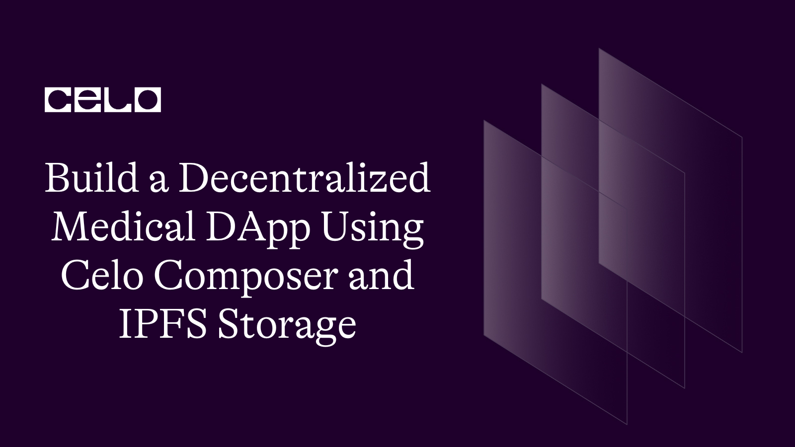
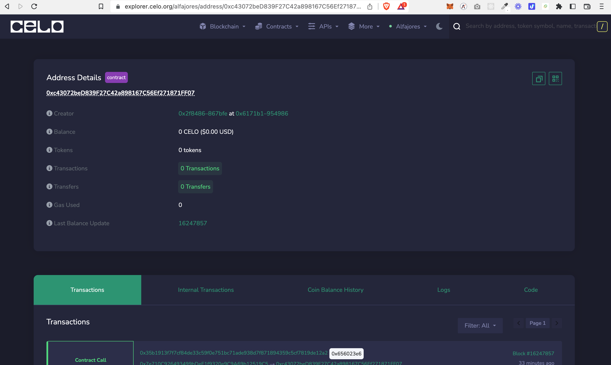
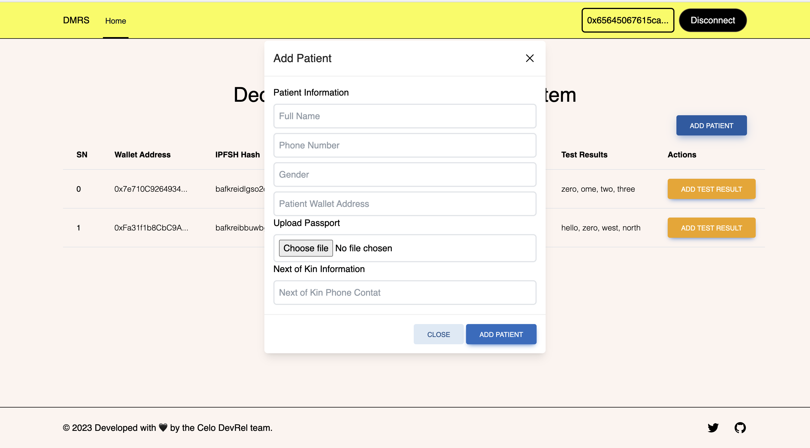
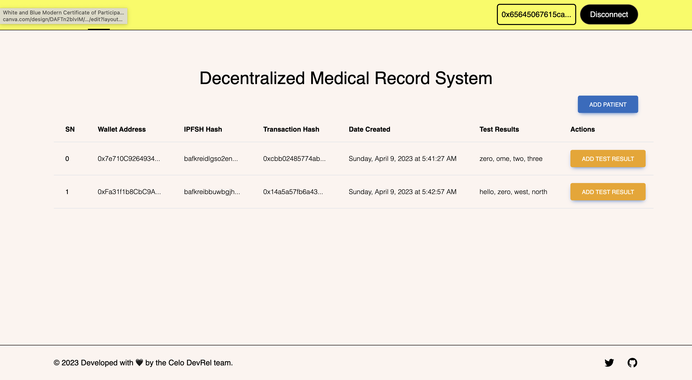
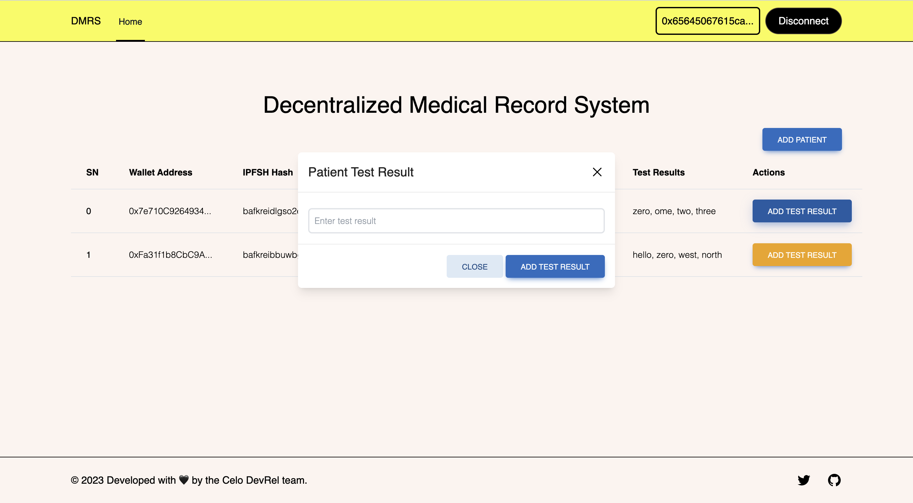
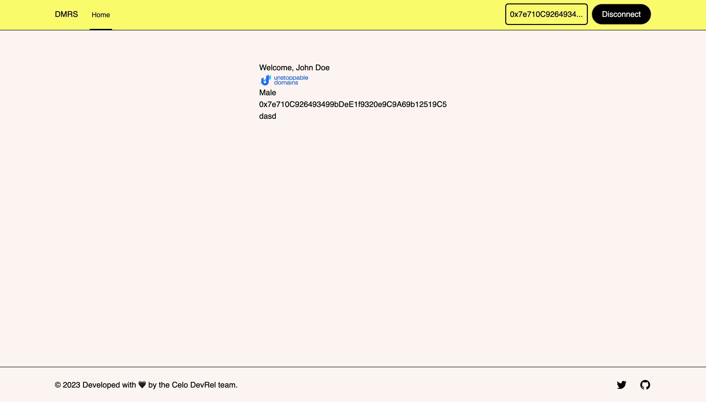

## Introduction​

Decentralized applications (Dapps) are becoming more and more popular, and one of the most promising use cases is in the healthcare industry. In this tutorial, we will be building a decentralized medical DApp using Celo composer, and IPFS storage. We will be using the Medical Record smart contract written in Solidity to store patient data and medical reports.

The DApp will allow the admin or clinical personnel to securely store patients medical records on the Celo blockchain, and clinical admin can add medical reports to the patient's records. We will be using IPFS for decentralized storage of patient records and the IPFS has stored on the blockchain.

We will use Next.js for the frontend, Hardhat for smart contract development and deployment, Celo Composer for blockchain integration, and IPFS for file storage.

## Prerequisites​

To successfully follow along in this tutorial you need basic knowledge of:

- HTML, CSS, React and Next.js
- Blockchain, solidity and hardhat
- Celo Alfajores account
- IPFS Decentralized storage

## Requirements​

To build this DApp we will need the following tools:

- [Vscode](https://code.visualstudio.com/) - But you can use any code editor of your choice
- [Hardhat](https://hardhat.org/) - used to deploy the smart contract
- [Alfajores Testnet Account](https://play.google.com/store/apps/details?id=org.celo.mobile.alfajores&hl=en&gl=US&pli=1) - required to connect to the dApp and make test transactions
- [Node](https://nodejs.org/en/)- an open-source, cross-platform JavaScript runtime environment
- [Celo Composer](https://github.com/celo-org/celo-composer)- starter project with all code needed to build, deploy, and upgrade a dapps on Celo.
- [Celo Wallet Extension](https://chrome.google.com/webstore/detail/celoextensionwallet/kkilomkmpmkbdnfelcpgckmpcaemjcdh?hl=en) / [Metamask](https://metamask.io/) - For interacting with the Celo blockchain
- [Pinta IPFS](https://www.pinata.cloud/) - Decentralized storage

## Let’s Get Started

In this tutorial, we will build a Dapp that allows clinical admin to create and manage the medical records of patients. The Dapp will have the following smart contract features:

Clinical admin can create a new medical record by uploading a file to IPFS and storing its hash on the Celo blockchain
Clinical admin can add medical reports to the existing records
Patients can view their medical records and reports
Only the patient and the contract owner can view the medical records and reports of the patient
Only the admin fetch all clinical record added

We will also be building the frontend for the Dapp. To do this we will be using [Celo Composer.](https://github.com/celo-org/celo-composer) Celo-composer is a starter project with all code needed to build, deploy, and upgrade dapps on Celo. We will be building both the smart contract and frontend using Celo Composer.

### Step 1: Setup the Project

First, let's set up our project. Create a new directory and run the following commands and follow the steps

```bash
npx @celo/celo-composer@latest create
```

Select React, Tailwind css and React-Celo option and then enter your project name. For detail on the steps checkout the Celo Composer github readme page.

Once you have successfully completed the steps do `npm install` or `yarn` to install all required dependencies. Once that is done you are ready to start building.

Now open your newly created project. You will see a packages folder inside the package folder you will see hardhat and react-app folder.

For security reasons in order not to expose your private keys to the public create a new file named `.env` in the root of the hardhat folder add this line of code:

```bash
PRIVATE KEY = <YOUR PRIVATE KEY>
```

At the root of the react-app folder create a .env file and add this line of code:

```bash
NEXT_PUBLIC_PINATA_JWT_TOKEN = <YOUR TOKEN>
```

### Account Setup, Funding and Block Explorer

Before performing any transaction on the Celo Blockchain, you will need to have an account setup. For this tutorial we will be making use of our Celo Testnet account which is the Alfajores network. You can either configure [Celo on Metamask](https://docs.celo.org/blog/tutorials/3-simple-steps-to-connect-your-metamask-wallet-to-celo) or download the [Celo Wallet Extension](https://chrome.google.com/webstore/detail/celoextensionwallet/kkilomkmpmkbdnfelcpgckmpcaemjcdh?hl=en). For further testing of your dApp on mobile you can also install the [Alfajores mobile wallet](https://play.google.com/store/apps/details?id=org.celo.mobile.alfajores&hl=en&gl=US).

Once your account has been created the next thing to do is to fund the account. You can fund your account with test tokens from the [Alfajores Token Faucet Site](https://faucet.celo.org/).

Fig 1-1 Alfajores Token Faucet


And you can use the [Celo Alfajores Block Explorer](https://explorer.celo.org/alfajores) to view the details of a transaction.

Fig 1-2 Alfajores Block Explorer


### Step 2: Write the Smart Contract

Now, let's write the smart contract. The smart contract is written using solidity. Create a new file named MedicalRecord.sol in the contracts directory of the hardhat folder and add the following code:

```solidity
// SPDX-License-Identifier:GPL-3.0

pragma solidity >=0.7.0 <0.9.0;
import "@openzeppelin/contracts/utils/Counters.sol";

contract MedicalRecord {

   using Counters for Counters.Counter;
   Counters.Counter public patientId;

   struct PatientData {
       uint256 id;
       address patientWalletAddress;
       string patientIPFSHash;
       string [] reports;
       bytes32 txHash;
       uint256 dateCreated;
   }

   event LogPatientData(
       uint256 id,
       address patientWalletAddress,
       string patientIPFSHash,
       bytes32 txHash,
       uint256 dateCreated
   );


   struct PatientMedicalReport {
       address patientWalletAddress;
       string testResult;
       bytes32 txHash;
       uint256 dateCreated;
   }


   event LogPatientMedicalReport(
       address patientWalletAddress,
       string testResult,
       bytes32 txHash,
       uint256 dateCreated
   );

   PatientData [] public patients;
   PatientMedicalReport [] public patientReports;

   address public owner;
   mapping(address => bool) public isExist;

   constructor(){
      owner = msg.sender;
   }

   modifier onlyOwner {
       require(msg.sender == owner, "You are not the owner");
       _;
   }

   modifier contractOwnerOrDataOwner(address dataOwner) {
       require(msg.sender == owner || msg.sender == dataOwner, "You are not the owner");
       _;
   }

   function addPatient(
       address _patientWalletAddress,
       string memory _patientIPFSHash

       ) public onlyOwner{
       require(isExist[_patientWalletAddress] != true, "Patient record already exist");
       require(bytes(_patientIPFSHash).length > 0, "IPFS Hash required");
       uint256 _id = patientId.current();
       string[] memory arr;
       bytes32 txHash = blockhash(block.number);
       uint256 dateCreated = block.timestamp;
       patients.push(PatientData(_id,_patientWalletAddress, _patientIPFSHash, arr, txHash, dateCreated));
       patientId.increment();
       isExist[_patientWalletAddress] = true;
       emit LogPatientData(patientCount, _patientWalletAddress, _patientIPFSHash, txHash, dateCreated);
   }

   function addHash(bytes32 hash) public {
       uint256 previousIndex = 1;
       uint256 currentCounter = patientId.current();
       require(currentCounter > 0, "No previous transaction exists");
       PatientData storage pd = patients[currentCounter - previousIndex];
       pd.txHash = hash;
   }

   function getAllpatients() public view onlyOwner returns(PatientData [] memory){
       return patients;
   }

   function getPatientData(uint256 _index, address _patientAddress) public contractOwnerOrDataOwner(_patientAddress)
       view returns(
       uint256 id,
       address patientWalletAddress,
       string memory patientIPFSHash,
       string [] memory testResult,
       bytes32 txHash,
       uint256 dateCreated
       ){
           return (
               patients[_index].id,
               patients[_index].patientWalletAddress,
               patients[_index].patientIPFSHash,
               patients[_index].reports,
               patients[_index].txHash,
               patients[_index].dateCreated
           );
   }

   function addPatientMedicalReport(address _patientWalletAddress, string memory _testResult) public onlyOwner{
       require(bytes(_testResult).length > 0, "Enter a valid test result");
       bool patientExists = false;
       bytes32 txHash = blockhash(block.number);
       uint256 dateCreated = block.timestamp;
       for (uint256 i = 0; i < patients.length; i++) {
       if (patients[i].patientWalletAddress == _patientWalletAddress) {
           patientExists = true;
           patients[i].reports.push(_testResult);
           emit LogPatientMedicalReport(_patientWalletAddress, _testResult, txHash, dateCreated);
           }
       }
       require(patientExists, "Patient record does not exist");
       patientReports.push(PatientMedicalReport(_patientWalletAddress, _testResult, txHash, dateCreated));
   }

    function getPatientTestResults() public onlyOwner view returns(PatientMedicalReport [] memory){
       return patientReports;
   }

   function getPatientReport(uint256 _index, address _patientAddress) public contractOwnerOrDataOwner(_patientAddress) view returns(address patientWalletAddress, string[] memory testResult, bytes32 _txHash, uint256 _dateCreated) {
       return(
           patientReports[_index].patientWalletAddress,
           patients[_index].reports,
           patientReports[_index].txHash,
           patientReports[_index].dateCreated
       );
   }
}
```

Here is a detailed breakdown of what the above smart contract code does;

The first line indicates the license under which the code is distributed.
`// SPDX-License-Identifier: GPL-3.0`

The next line specifies the version of Solidity being used.
`pragma solidity >=0.7.0 <0.9.0;`

The `Counters` library from OpenZeppelin is imported to enable us to generate unique patient IDs.

`import "@openzeppelin/contracts/utils/Counters.sol";`

The `MedicalRecord` contract is defined, which will store medical records of patients.
`contract MedicalRecord {}`

The `Counters` library is used to create a counter to generate unique patient IDs.

```solidity
using Counters for Counters.Counter;
Counters.Counter public patientId;
```

A struct `PatientData` is defined which will store patient data, including the patient ID, the patient's wallet address, the IPFS hash of the patient's medical records, an array of medical reports, the transaction hash and the date created.

```solidity
struct PatientData {
    uint256 id;
    address patientWalletAddress;
    string patientIPFSHash;
    string [] reports;
    bytes32 txHash;
    uint256 dateCreated;
}
```

An event `LogPatientData` is defined which will be triggered when patient data is added.

```solidity
event LogPatientData(
    uint256 id,
    address patientWalletAddress,
    string patientIPFSHash,
    bytes32 txHash,
    uint256 dateCreated
);
```

Another struct `PatientMedicalReport` is defined which will store patient medical reports, including the patient's wallet address, the test result, the transaction hash and the date created.

```solidity
struct PatientMedicalReport {
    address patientWalletAddress;
    string testResult;
    bytes32 txHash;
    uint256 dateCreated;
}
```

An event `LogPatientMedicalReport` is defined which will be triggered when a patient medical report is added.

```solidity
event LogPatientMedicalReport(
    address patientWalletAddress,
    string testResult,
    bytes32 txHash,
    uint256 dateCreated
);
```

Two arrays are created, one for `PatientData` and one for `PatientMedicalReport`.

```solidity
PatientData [] public patients;
PatientMedicalReport [] public patientReports;
```

The contract owner's address is stored in the `owner` variable and a mapping is created to check if a patient exists.

```solidity
address public owner;
mapping(address => bool) public isExist;
```

The contract constructor is defined, which sets the `owner` variable to the address of the contract creator.

```solidity
constructor(){
   owner = msg.sender;
}
```

A modifier `onlyOwner` is defined, which will only allow the contract owner to execute certain functions.

```solidity
modifier onlyOwner {
    require(msg.sender == owner, "You are not the owner");
    _;
}
```

Another modifier `contractOwnerOrDataOwner` is defined, which will allow either the contract owner or the patient whose data is being accessed to execute certain functions.

```solidity
modifier contractOwnerOrDataOwner(address dataOwner) {
    require(msg.sender == owner || msg.sender == dataOwner, "You are not the owner");
    _;
}
```

**addPatient**

```solidity
function addPatient(
       address _patientWalletAddress,
       string memory _patientIPFSHash

       ) public onlyOwner{
       require(isExist[_patientWalletAddress] != true, "Patient record already exist");
       require(bytes(_patientIPFSHash).length > 0, "IPFS Hash required");
       uint256 _id = patientId.current();
       string[] memory arr;
       bytes32 txHash = blockhash(block.number);
       uint256 dateCreated = block.timestamp;
       patients.push(PatientData(_id,_patientWalletAddress, _patientIPFSHash, arr, txHash, dateCreated));
       patientId.increment();
       isExist[_patientWalletAddress] = true;
       emit LogPatientData(patientCount, _patientWalletAddress, _patientIPFSHash, txHash, dateCreated);
   }
```

A function `addPatient` is defined, which allows the contract owner to add patient data. It takes the patient's wallet address and the IPFS hash of the medical records as parameters. It checks if the patient record already exists, and if not, adds the patient data to the patients array and triggers the `LogPatientData`

**addHash**

```solidity
  function addHash(bytes32 hash) public {
       uint256 previousIndex = 1;
       uint256 currentCounter = patientId.current();
       require(currentCounter > 0, "No previous transaction exists");
       PatientData storage pd = patients[currentCounter - previousIndex];
       pd.txHash = hash;
   }
```

This function is used to add a new hash to the patients' data. It takes a hash as input and assigns it to the txHash field of the most recent patient's data.

**getAllpatients**

```solidity
function getAllpatients() public view onlyOwner returns(PatientData [] memory){
       return patients;
   }
```

This function returns an array of all the patients' data stored on the blockchain.

**getPatientData**

```solidity
   function getPatientData(uint256 _index, address _patientAddress) public contractOwnerOrDataOwner(_patientAddress)
       view returns(
       uint256 id,
       address patientWalletAddress,
       string memory patientIPFSHash,
       string [] memory testResult,
       bytes32 txHash,
       uint256 dateCreated
       ){
           return (
               patients[_index].id,
               patients[_index].patientWalletAddress,
               patients[_index].patientIPFSHash,
               	    patients[_index].reports,
               patients[_index].txHash,
               patients[_index].dateCreated
           );
   }
```

This function is used to retrieve a patient's data by their index and address. It returns various fields of the patient's data such as their ID, address, IPFS hash, test results, transaction hash, and date created.

**addPatientMedicalReport**

````solidity
   function addPatientMedicalReport(address _patientWalletAddress, string memory _testResult) public onlyOwner{
       require(bytes(_testResult).length > 0, "Enter a valid test result");
       bool patientExists = false;
       bytes32 txHash = blockhash(block.number);
       uint256 dateCreated = block.timestamp;
       for (uint256 i = 0; i < patients.length; i++) {
       if (patients[i].patientWalletAddress == _patientWalletAddress) {
           patientExists = true;
           patients[i].reports.push(_testResult);
           emit LogPatientMedicalReport(_patientWalletAddress, _testResult, txHash, dateCreated);
           }
       }
       require(patientExists, "Patient record does not exist");
       patientReports.push(PatientMedicalReport(_patientWalletAddress, _testResult, txHash, dateCreated));
   }
	```
This function is used to add a new medical report to a patient's data. It takes a patient's wallet address and a test result as inputs, and then adds the test result to the patient's reports field. Additionally, it creates a new PatientMedicalReport object with the same data and appends it to the patientReports array.


**getPatientTestResults**

```solidity
 function getPatientTestResults() public onlyOwner view returns(PatientMedicalReport [] memory){
       return patientReports;
   }
	```
This function is used to retrieve an array of all the PatientMedicalReport objects stored on the blockchain.

**getPatientReport**

 ```solidity
  function getPatientReport(uint256 _index, address _patientAddress) public contractOwnerOrDataOwner(_patientAddress) view returns(address patientWalletAddress, string[] memory testResult, bytes32 _txHash, uint256 _dateCreated) {
       return(
           patientReports[_index].patientWalletAddress,
           patients[_index].reports,
           patientReports[_index].txHash,
           patientReports[_index].dateCreated
       );
   }
````

This function is used to retrieve a specific PatientMedicalReport object by index and patient address. It returns various fields of the object such as the patient's address, test results, transaction hash, and date created.

## Step 3: Deploy the Contract

Inside the hardhat directory navigate to the `scripts/deploy.tsx` and replace the code with this 👇

```js
// We require the Hardhat Runtime Environment explicitly here. This is optional
// but useful for running the script in a standalone fashion through `node <script>`.
//
// When running the script with `npx hardhat run <script>` you'll find the Hardhat
// Runtime Environment's members available in the global scope.
const hre = require("hardhat");

async function main() {
  // Hardhat always runs the compile task when running scripts with its command
  // line interface.
  //
  // If this script is run directly using `node` you may want to call compile
  // manually to make sure everything is compiled
  // await hre.run('compile');

  // We get the contract to deploy
  const MedicalRecord = await hre.ethers.getContractFactory("MedicalRecord");
  const medicalRecord = await MedicalRecord.deploy();

  const contractAddress = await (await medicalRecord.deployed()).address;
  console.log(`Contract was deployed to ${contractAddress}`);
}

// We recommend this pattern to be able to use async/await everywhere
// and properly handle errors.
main()
  .then(() => process.exit(0))
  .catch((error) => {
    console.error(error);
    process.exit(1);
  });
```

To deploy the contract still on the hardhat directory enter the below command;
`npx hardhat run scripts/deploy.ts –network alfajores`

Once successfully deployed it will return the contract address and a generated ABI code, which we will use later to interact with the contract on the frontend.

You will see the generated json ABI code in the in the `artifacts/contracts/` directory.

### Step 4: Frontend interaction

To interact with the frontend navigate to the `react-app` directory and run this command to start the development server
`npm run dev` will start the localhost server at port 3000.

Celo composer has done the work of setting up a next.js app for us. Currently the next.js app comes with three components: the header, footer and layout and also connection to Celo wallet has also been done. All you need to do is to go to the \_app.tsx file and make modifications to the CeloProvider based on what you need. In this tutorial we will be using it as it is.

For our frontend we will be creating some additional components and helper functions. And for easy creation of modal and alert components we will be making you [tailwind elements](https://tailwind-elements.com/docs/standard/getting-started/quick-start/), check the doc for details on setup guide.

Inside the react-app directory, create an `interact.tsx` file and copy the below code. This code handles all calls to the contract. Each of these contract calls will be used in our component where appropriate.

**interact.tsx**

```js
import MedicalABI from "./Medical.json";
import { CONTRACTADDRESS } from "./utils/Constants";

export function initContract(kit: any) {
  return new kit.connection.web3.eth.Contract(MedicalABI.abi, CONTRACTADDRESS);
}

// Medical Record Contract Calls
export const addPatient = async (
  address: string | null | undefined,
  kit: any,
  patientAddress: string,
  ipfsHash: string
) => {
  try {
    const txHash = await initContract(kit)
      .methods.addPatient(patientAddress, ipfsHash)
      .send({
        from: address,
      });
    console.log(txHash);
    return { sucesss: true, data: txHash.transactionHash };
  } catch (e) {
    console.log(e);
    return { sucesss: false, message: e.message };
  }
};

export const addPatientReport = async (
  address: string | null | undefined,
  kit: any,
  patientAddress: string,
  testResult: string
) => {
  try {
    const txHash = await initContract(kit)
      .methods.addPatientMedicalReport(patientAddress, testResult)
      .send({
        from: address,
      });
    console.log(txHash);
    return {
      sucesss: true,
      data: "https://explorer.celo.org/alfajores/tx/" + txHash.transactionHash,
    };
  } catch (e) {
    console.log(e);
  }
};

export const addHash = async (
  address: string | null | undefined,
  kit: any,
  hash: string | undefined
) => {
  try {
    const txHash = await initContract(kit).methods.addHash(hash).send({
      from: address,
    });
    console.log(txHash);
    return {
      sucesss: true,
      data: "https://explorer.celo.org/alfajores/tx/" + txHash.transactionHash,
    };
  } catch (e) {
    console.log(e);
  }
};

export const getPatientData = async (
  kit: any,
  index: number,
  patientAddress: string
) => {
  try {
    const response = await initContract(kit)
      .methods.getPatientData(index, patientAddress)
      .call();
    console.log(response);
    return response;
  } catch (e) {
    console.log(e);
  }
};

export const getAllpatients = async (kit: any) => {
  try {
    const response = await initContract(kit).methods.getAllpatients().call();
    console.log(response);
    return response;
  } catch (e) {
    console.log(e);
  }
};

export const getPatientTestResults = async (kit: any) => {
  try {
    const response = await initContract(kit)
      .methods.getPatientTestResults()
      .call();
    console.log(response);
    return response;
  } catch (e) {
    console.log(e);
  }
};

export const getPatientReport = async (
  kit: any,
  index: number,
  patientAddress: string
) => {
  try {
    const response = await initContract(kit)
      .methods.getPatientReport(index, patientAddress)
      .call();
    console.log(response);
    return response;
  } catch (e) {
    console.log(e);
  }
};
```

`import MedicalABI from "./Medical.json”` This imports the ABI generated when we deployed the contract. Copy the generated JSON and create a Medical.json file in the root of your react directory.

`import { CONTRACTADDRESS } from "./utils/Constants";` This imports the contract address which we will pass alongside the abi when creating a contract instance.

### Create a file called Constants and paste the code below

```js
const QUERYPRAM = "patients"; // used when quering pinata to get pinned items
const CONTRACTADDRESS = "This should be your contract address";
const JWT = `Bearer ${process.env.NEXT_PUBLIC_PINATA_JWT}`;
const CONTRACTOWNER = "The address that deployed the contract";
export { QUERYPRAM, CONTRACTADDRESS, JWT, CONTRACTOWNER };
```

### Pinata IPFS Code Integrations

To get started using [Pinata](https://www.pinata.cloud/) ensure you set up an account and go to your dashboard click new key this will give you a JWT token which you will use to query the Pinata API.

**Pinata Helper Functions**
Here are helper functions that handle both adding/pinning items to Pinata and also querying the pinata cloud gateway to fetch the pin items.

**PinFiles.tsx**

```js
import { QUERYPRAM } from "@/utils/Constants";
import axios from "axios";
import { JWT } from "@/utils/Constants";

// uploading image and extra metadata
export const pinFilesToPinata = async (image: string | File) => {
  const formData = new FormData();

  formData.append("file", image);

  const options = JSON.stringify({
    cidVersion: 0,
  });
  formData.append("pinataOptions", options);

  try {
    const res = await axios.post(
      "https://api.pinata.cloud/pinning/pinFileToIPFS",
      formData,
      {
        maxBodyLength: Infinity,
        headers: {
          "Content-Type": `multipart/form-data; boundary=${formData._boundary}`,
          Authorization: JWT,
        },
      }
    );
    console.log(res.data.IpfsHash);
    const ipfshHash = res.data.IpfsHash;
    return { isSuccess: true, hash: ipfshHash };
  } catch (error) {
    console.log(error);
    return { isSuccess: false, error: error.message };
  }
};

// Option 2 uploading json file
export const uploadJSONToIPFS = async (
  image: string | undefined,
  fullName: string,
  phoneNumber: string,
  gender: string,
  patientWalletAddress: string,
  kinContact: string
) => {
  let data = JSON.stringify({
    pinataOptions: {
      cidVersion: 1,
    },
    pinataMetadata: {
      name: QUERYPRAM,
      keyvalues: {
        image,
        fullName,
        phoneNumber,
        gender,
        patientWalletAddress,
        kinContact,
      },
    },
    pinataContent: {
      image,
      fullName,
      phoneNumber,
      gender,
      patientWalletAddress,
      kinContact,
    },
  });
  const url = `https://api.pinata.cloud/pinning/pinJSONToIPFS`;
  //making axios POST request to Pinata ⬇️
  return axios
    .post(url, data, {
      headers: {
        "Content-Type": "application/json",
        Authorization: JWT,
      },
    })
    .then(function (response) {
      console.log(response.data.IpfsHash);
      return {
        isSuccess: true,
        pinataURL: response.data.IpfsHash,
      };
    })
    .catch(function (error) {
      console.log(error);
      return {
        isSuccess: false,
        error: error.message,
      };
    });
};
```

**ListPIn.tsx**

```js
import { JWT } from "@/utils/Constants";
import axios from "axios";

export const PatientList = async (queryParams: any) => {
  const url = `https://api.pinata.cloud/data/pinList?metadata[name]=${queryParams}`;

  return axios
    .get(url, {
      headers: {
        Authorization: JWT,
      },
    })
    .then(function (response) {
      // console.log(response)
      const list = response.data.rows;
      console.log(list);
      return list;
    })
    .catch(function (error) {
      console.log(error);
    });
};
```

Here are some of the utility functions we will be using

**formatDateTime.tsx**
This handles formatting of date. Converting our smart contract timestamp to human readable date.

```js
export const formateDateTime = (timestamp: any) => {
  // create a new date object with the timestamp
  const date = new Date(timestamp * 1000);
  // format the date as a string in the desired format
  const formattedDate = date.toLocaleString("en-US", {
    weekday: "long",
    year: "numeric",
    month: "long",
    day: "numeric",
    hour: "numeric",
    minute: "numeric",
    second: "numeric",
  });
  console.log(formattedDate);
  return formattedDate;
};
```

**truncate.tsx**
Use this function for truncating string text or address.

```js
export const truncate = (address: string) => {
  const result = address.substring(0, 15);
  return `${result}...`;
};
```

**TableList.tsx**
This is is the table used in displaying user data.

```js
import React, { useState, useEffect } from 'react'
import { useCelo } from '@celo/react-celo'
import { getAllpatients } from '@/interact'
import UpdateModal from './UpdateModal'
import { PatientList } from '@/Pinata/ListPin'
import { QUERYPRAM } from '@/utils/Constants'
import { truncate } from '@/utils/truncate'
import { formateDateTime } from '@/utils/formatDateTime'

export default function TableList(): JSX.Element {
 const { kit } = useCelo()
 const [patients, setPatients] = useState<any[]>([])
 const [pinnedList, setPinnedList] = useState<any[]>([])
 const [loading, setLoading] = useState<boolean>(false)

 const handlePatients = async () => {
   setLoading(true)
   const employeeList = await getAllpatients(kit)
   setPatients(employeeList)
   setLoading(false)
 }

 const getPinnedItems = async () => {
   const data = await PatientList(QUERYPRAM)
   setPinnedList(data)
 }

 useEffect(() => {
   handlePatients()
   getPinnedItems()
 }, [kit])
 return (
   <div>
         <div>
         {loading ? <div className='text-center text-xl'>Fetching Patient data...</div> :
       <div className="flex flex-col">
         <div className="overflow-x-auto sm:-mx-6 lg:-mx-8">
           <div className="inline-block min-w-full py-2 sm:px-6 lg:px-8">
             <div className="overflow-hidden">
               <table className="min-w-full text-left text-sm font-light">
                 <thead className="border-b font-medium dark:border-neutral-500">
                   <tr>
                     <th scope="col" className="px-6 py-4">SN</th>
                     <th scope="col" className="px-6 py-4">Wallet Address</th>
                     <th scope="col" className="px-6 py-4">IPFSH Hash</th>
                     <th scope="col" className="px-6 py-4">Transaction Hash</th>
                     <th scope="col" className="px-6 py-4">Date Created</th>
                     <th scope="col" className="px-6 py-4">Test Results</th>
                     <th scope="col" className="px-6 py-4">Actions</th>
                   </tr>
                 </thead>
                 <tbody>
                   {patients && patients.map((item, index) => <tr className="border-b dark:border-neutral-500" key={index}>
                     <td className="whitespace-nowrap px-6 py-4 font-medium">{index + 1}</td>
                     <td className="whitespace-nowrap px-6 py-4"><a href={`https://explorer.celo.org/alfajores/address/${item.patientWalletAddress}`}></a> {truncate(item.patientWalletAddress)}</td>
                     <td className="whitespace-nowrap px-6 py-4"> <a href={`https://ipfs.io/ipfs/${item.patientIPFSHash}`}>{truncate(item.patientIPFSHash)}</a></td>
                     <td className="whitespace-nowrap px-6 py-4"><a href={"https://explorer.celo.org/alfajores/tx/" + item.txHash}>{truncate(item.txHash)}</a></td>
                     <td className="whitespace-nowrap px-6 py-4">{ formateDateTime(item.dateCreated)}</td>
                     <td className="whitespace-nowrap px-6 py-4">{item.reports}</td>
                     <td className="whitespace-nowrap px-6 py-4">
                       <button
                         type="button"
                         className="inline-block rounded bg-yellow-500 px-6 pt-2.5 pb-2 text-xs font-medium uppercase leading-normal text-white shadow-[0_4px_9px_-4px_#3b71ca] transition duration-150 ease-in-out hover:bg-primary-600 hover:shadow-[0_8px_9px_-4px_rgba(59,113,202,0.3),0_4px_18px_0_rgba(59,113,202,0.2)] focus:bg-primary-600 focus:shadow-[0_8px_9px_-4px_rgba(59,113,202,0.3),0_4px_18px_0_rgba(59,113,202,0.2)] focus:outline-none focus:ring-0 active:bg-primary-700 active:shadow-[0_8px_9px_-4px_rgba(59,113,202,0.3),0_4px_18px_0_rgba(59,113,202,0.2)]"
                         data-te-toggle="modal"
                         data-te-target="#updateModal"
                         data-te-ripple-init
                         data-te-ripple-color="light">
                         Add Test Result
                       </button>
                     </td>
                     <UpdateModal patientAddress={item.patientWalletAddress} />
                   </tr>)}
                 </tbody>
               </table>
             </div>
           </div>
         </div>
       </div>
     }
     </div>
   </div>
 )
}

```

**PatientModal.tsx**
This is the code for the form modal used in adding patients

Fig: 4-2 Patient Modal


```js
import React, {useCallback, useEffect, useState} from 'react'
import { addPatient, addHash, getAllpatients } from '@/interact'
import { useCelo } from '@celo/react-celo'
import { pinFilesToPinata, uploadJSONToIPFS } from '@/Pinata/PinFiles'
import Alert from './Alert'


export default function PatientModal(): JSX.Element {
    const [fullName, setFullName] = useState<string>('')
    const [phoneNumber, setPhoneNumber] = useState<string>('')
    const [gender, setGender] = useState<string>('')
    const [patientWalletAddress, setPatientWalletAddress] = useState<string>('')
    const [kinContact, setKinContact] = useState<string>('')
    const [image, setSelectedImage] = useState<string | File>('')
    const [successState, setSuccess] = useState<boolean>(false)
    const [message, setMessage] = useState<any>()
    const [dataValue, setData] = useState<string | undefined>('')
    const [loading, setLoading] = useState<boolean>(false)
    const [ipfsHashValue, setIPFSHASH] = useState<string>("")
    const [blockSuccess, setBlockSuccess] = useState<boolean>(false)
    const [blockMessage, setBlockMessage] = useState<any>()
    const [errorMessage, setErrorMessage] = useState<string>("")
    const [updatedPatientList, seUpdatedPatientList] = useState<any[]>([])
  const [showModal, setShowModal] = useState<boolean>(false)

  const { kit, address } = useCelo()


    const handleImageUpload = (e: React.ChangeEvent<HTMLInputElement>) => {
        if (e.target.files != null) {
          setSelectedImage(e.target.files[0]);
          console.log(e.target.files[0])
    }
    }

    const handleFullName = (e: React.FormEvent<HTMLInputElement>) => {
      setFullName(e.currentTarget.value)
    }
   const handlePhoneNumber = (e: React.FormEvent<HTMLInputElement>) => {
      setPhoneNumber(e.currentTarget.value)
   }

   const handleGender = (e: React.FormEvent<HTMLInputElement>) => {
      setGender(e.currentTarget.value)
   }

    const handlePatientWalletAddress = (e: React.FormEvent<HTMLInputElement>) => {
      setPatientWalletAddress(e.currentTarget.value)
    }

    const handleKinContact= (e: React.FormEvent<HTMLInputElement>) => {
      setKinContact(e.currentTarget.value)
    }

  const handleAddPatient = async () => {

    if (!fullName || !phoneNumber || !kinContact || !image || !gender || !patientWalletAddress) {
      setErrorMessage("All Fields are required")
      return;
    }

    setLoading(true)
    setShowModal(true)
    const { hash } = await pinFilesToPinata(image)

    const {isSuccess, error, pinataURL } = await uploadJSONToIPFS(
        hash,
        fullName,
        phoneNumber,
        gender,
        patientWalletAddress,
        kinContact)

    setIPFSHASH(pinataURL)
    setSuccess(isSuccess)
    setMessage(error)

    const { sucesss, data, message} = await addPatient(address, kit, patientWalletAddress, pinataURL)
    setBlockSuccess(sucesss)
    setData(data)
    setBlockMessage(message)

    await addHash(address, kit, data)

    setLoading(false)
    setShowModal(false)
      // window.location.reload()

    // if (document.getElementById('patientModal') != null) {
    //     document.getElementById('patientModal').style.display = 'none'
    // }

  }


  return (

    <div>
      {successState || blockSuccess || blockMessage || message ?
      <div>
      <Alert success={successState} error={message} data={ipfsHashValue} />
      <Alert success={blockSuccess} error={blockMessage} data={dataValue} />
      </div> : null
      }
      <div>
        {showModal ? <div></div> :
      <div
      data-te-modal-init
      className={"fixed top-0 left-0 z-[1055] hidden h-full w-full overflow-y-auto overflow-x-hidden outline-none"}
      id="patientModal"
      tabIndex={0}
      aria-labelledby="exampleModalCenterTitle"
      aria-modal="true"
      role="dialog">
        <div
          data-te-modal-dialog-ref
          className="pointer-events-none relative flex min-h-[calc(100%-1rem)] w-auto translate-y-[-50px] items-center opacity-0 transition-all duration-300 ease-in-out min-[576px]:mx-auto min-[576px]:mt-7 min-[576px]:min-h-[calc(100%-3.5rem)] min-[576px]:max-w-[500px]">
          <div
            className="pointer-events-auto relative flex w-full flex-col rounded-md border-none bg-white bg-clip-padding text-current shadow-lg outline-none dark:bg-neutral-600">
            <div
              className="flex flex-shrink-0 items-center justify-between rounded-t-md border-b-2 border-neutral-100 border-opacity-100 p-4 dark:border-opacity-50">
              <h5
                className="text-xl font-medium leading-normal text-neutral-800 dark:text-neutral-200"
                id="exampleModalScrollableLabel">
                Add Patient
              </h5>
              <button
                type="button"
                className="box-content rounded-none border-none hover:no-underline hover:opacity-75 focus:opacity-100 focus:shadow-none focus:outline-none"
                data-te-modal-dismiss
                aria-label="Close">
                <svg
                  xmlns="http://www.w3.org/2000/svg"
                  fill="none"
                  viewBox="0 0 24 24"
                  stroke-width="1.5"
                  stroke="currentColor"
                  className="h-6 w-6">
                  <path
                    stroke-linecap="round"
                    stroke-linejoin="round"
                    d="M6 18L18 6M6 6l12 12" />
                </svg>
              </button>
            </div>
            <div className="relative p-4">
              <label className='my-2'>Patient Information</label>
              <input type="text" placeholder='Full Name' className='border-2 p-2 mt-2 rounded-md w-full' value={fullName} onChange={handleFullName} />
              <input type="tel" placeholder='Phone Number' className='border-2 p-2 mt-2 rounded-md w-full' value={phoneNumber} onChange={handlePhoneNumber} />
             <input type="text" placeholder='Gender' className='border-2 p-2 mt-2 rounded-md w-full' value={gender} onChange={handleGender}/>
              <input type="text" placeholder='Patient Wallet Address' className='border-2 p-2 mt-2 rounded-md w-full' value={patientWalletAddress} onChange={handlePatientWalletAddress}/>
              <label className='my-2'>Upload Passport</label>
              <input type="file" placeholder='Upload Picture' className='border-2 p-2 mt-2 rounded-md w-full' onChange={handleImageUpload} />

              <label className='my-2'>Next of Kin Information</label>
              <input type="text" placeholder='Next of Kin Phone Contat' className='border-2 p-2 mt-2 rounded-md w-full' value={kinContact} onChange={handleKinContact}/>
              <p className='text-red-500'>{ errorMessage}</p>
            </div>
            <div
              className="flex flex-shrink-0 flex-wrap items-center justify-end rounded-b-md border-t-2 border-neutral-100 border-opacity-100 p-4 dark:border-opacity-50">
              <button
                type="button"
                className="inline-block rounded bg-primary-100 px-6 pt-2.5 pb-2 text-xs font-medium uppercase leading-normal text-primary-700 transition duration-150 ease-in-out hover:bg-primary-accent-100 focus:bg-primary-accent-100 focus:outline-none focus:ring-0 active:bg-primary-accent-200"
                data-te-modal-dismiss
                data-te-ripple-init
                data-te-ripple-color="light">
                Close
              </button>
              <button
                onClick={handleAddPatient}
                type="button"
                className="ml-1 inline-block rounded bg-primary px-6 pt-2.5 pb-2 text-xs font-medium uppercase leading-normal text-white shadow-[0_4px_9px_-4px_#3b71ca] transition duration-150 ease-in-out hover:bg-primary-600 hover:shadow-[0_8px_9px_-4px_rgba(59,113,202,0.3),0_4px_18px_0_rgba(59,113,202,0.2)] focus:bg-primary-600 focus:shadow-[0_8px_9px_-4px_rgba(59,113,202,0.3),0_4px_18px_0_rgba(59,113,202,0.2)] focus:outline-none focus:ring-0 active:bg-primary-700 active:shadow-[0_8px_9px_-4px_rgba(59,113,202,0.3),0_4px_18px_0_rgba(59,113,202,0.2)]"
                data-te-ripple-init
                // data-te-modal-dismiss = {showModal ? false : true}
                data-te-ripple-color="light">
               { loading ? "Loading..." :" Add patient"}
              </button>
            </div>
          </div>
        </div>
          </div>
        }
      </div>
  </div>
  )
}

```

**index.tsx**
Inside you `index.tsx` file paste the below code

Fig:4.1 Landing Page


```js
import React, { useState, useEffect } from "react";
import { getAllpatients } from "@/interact";
import { useCelo } from "@celo/react-celo";
import PatientModal from "@/components/PatientModal";
import TableList from "@/components/TableList";
import { CONTRACTOWNER } from "@/utils/Constants";
import Patient from "@/components/Patient";

export default function Home() {
  const { address } = useCelo();

  return (
    <div>
      <div>
        {!address ? (
          <div>Please connect your wallet</div>
        ) : address !== CONTRACTOWNER ? (
          <Patient />
        ) : (
          <div>
            <h1 className="text-4xl text-center m-4">
              Decentralized Medical Record System
            </h1>
            <div className="flex justify-end ">
              <button
                type="button"
                className="inline-block rounded bg-primary px-6 pt-2.5 pb-2 text-xs font-medium uppercase leading-normal text-white shadow-[0_4px_9px_-4px_#3b71ca] transition duration-150 ease-in-out hover:bg-primary-600 hover:shadow-[0_8px_9px_-4px_rgba(59,113,202,0.3),0_4px_18px_0_rgba(59,113,202,0.2)] focus:bg-primary-600 focus:shadow-[0_8px_9px_-4px_rgba(59,113,202,0.3),0_4px_18px_0_rgba(59,113,202,0.2)] focus:outline-none focus:ring-0 active:bg-primary-700 active:shadow-[0_8px_9px_-4px_rgba(59,113,202,0.3),0_4px_18px_0_rgba(59,113,202,0.2)]"
                data-te-toggle="modal"
                data-te-target="#patientModal"
                data-te-ripple-init
                data-te-ripple-color="light"
              >
                Add Patient
              </button>
            </div>

            <PatientModal />
            <TableList />
          </div>
        )}
      </div>
    </div>
  );
}
```

**UpdateModal.tsx**
This code handles uploading of patient medical test report.

And the UI looks like this 👇
Fig:4.4 Add Test Report Modal


```js
import React, { useState } from "react";
import { addPatientReport } from "@/interact";
import { useCelo } from "@celo/react-celo";

interface Iparam {
  patientAddress: string;
}
export default function UpdateModal(param: Iparam): JSX.Element {
  const [testResult, setTestResult] = useState < string > "";
  const { kit, address } = useCelo();

  const handleTestResult = (e: React.FormEvent<HTMLInputElement>) => {
    setTestResult(e.currentTarget.value);
    console.log(e.currentTarget.value);
  };

  const handlePatientReport = async (patientAddress: string) => {
    if (!testResult) {
      alert("field is required");
      return;
    }
    await addPatientReport(address, kit, patientAddress, testResult);
  };

  return (
    <div>
      <div
        data-te-modal-init
        className="fixed top-0 left-0 z-[1055] hidden h-full w-full overflow-y-auto overflow-x-hidden outline-none"
        id="updateModal"
        tabIndex={-1}
        aria-labelledby="exampleModalCenterTitle"
        aria-modal="true"
        role="dialog"
      >
        <div
          data-te-modal-dialog-ref
          className="pointer-events-none relative flex min-h-[calc(100%-1rem)] w-auto translate-y-[-50px] items-center opacity-0 transition-all duration-300 ease-in-out min-[576px]:mx-auto min-[576px]:mt-7 min-[576px]:min-h-[calc(100%-3.5rem)] min-[576px]:max-w-[500px]"
        >
          <div className="pointer-events-auto relative flex w-full flex-col rounded-md border-none bg-white bg-clip-padding text-current shadow-lg outline-none dark:bg-neutral-600">
            <div className="flex flex-shrink-0 items-center justify-between rounded-t-md border-b-2 border-neutral-100 border-opacity-100 p-4 dark:border-opacity-50">
              <h5
                className="text-xl font-medium leading-normal text-neutral-800 dark:text-neutral-200"
                id="exampleModalScrollableLabel"
              >
                Patient Test Result
              </h5>
              <button
                type="button"
                className="box-content rounded-none border-none hover:no-underline hover:opacity-75 focus:opacity-100 focus:shadow-none focus:outline-none"
                data-te-modal-dismiss
                aria-label="Close"
              >
                <svg
                  xmlns="http://www.w3.org/2000/svg"
                  fill="none"
                  viewBox="0 0 24 24"
                  stroke-width="1.5"
                  stroke="currentColor"
                  className="h-6 w-6"
                >
                  <path
                    stroke-linecap="round"
                    stroke-linejoin="round"
                    d="M6 18L18 6M6 6l12 12"
                  />
                </svg>
              </button>
            </div>
            <div className="relative p-4">
              <input
                type="text"
                placeholder="Enter test result"
                className="border-2 p-2 mt-2 rounded-md w-full"
                value={testResult}
                onChange={handleTestResult}
              />
            </div>
            <div className="flex flex-shrink-0 flex-wrap items-center justify-end rounded-b-md border-t-2 border-neutral-100 border-opacity-100 p-4 dark:border-opacity-50">
              <button
                type="button"
                className="inline-block rounded bg-primary-100 px-6 pt-2.5 pb-2 text-xs font-medium uppercase leading-normal text-primary-700 transition duration-150 ease-in-out hover:bg-primary-accent-100 focus:bg-primary-accent-100 focus:outline-none focus:ring-0 active:bg-primary-accent-200"
                data-te-modal-dismiss
                data-te-ripple-init
                data-te-ripple-color="light"
              >
                Close
              </button>
              <button
                onClick={() => handlePatientReport(param.patientAddress)}
                type="button"
                className="ml-1 inline-block rounded bg-primary px-6 pt-2.5 pb-2 text-xs font-medium uppercase leading-normal text-white shadow-[0_4px_9px_-4px_#3b71ca] transition duration-150 ease-in-out hover:bg-primary-600 hover:shadow-[0_8px_9px_-4px_rgba(59,113,202,0.3),0_4px_18px_0_rgba(59,113,202,0.2)] focus:bg-primary-600 focus:shadow-[0_8px_9px_-4px_rgba(59,113,202,0.3),0_4px_18px_0_rgba(59,113,202,0.2)] focus:outline-none focus:ring-0 active:bg-primary-700 active:shadow-[0_8px_9px_-4px_rgba(59,113,202,0.3),0_4px_18px_0_rgba(59,113,202,0.2)]"
                data-te-ripple-init
                data-te-ripple-color="light"
              >
                Add Test Result
              </button>
            </div>
          </div>
        </div>
      </div>
    </div>
  );
}
```

**patient.tsx**
This is a simple UI code that displays the patient information

Fig:4.5 Patient Component


```js
import React, {useState, useEffect} from 'react'
import axios from 'axios'
import { getAllpatients } from '@/interact';
import { useCelo } from '@celo/react-celo';
import Image from 'next/image';

export default function Patient(): JSX.Element {
 const [data, setData] = useState<any>()
 const [ipfsData, setIpfsData] = useState<any>()
 const [loading, setLoading] = useState<boolean>(false)
 const { kit, address } = useCelo()

 const getPatientInfo = async () => {
   setLoading(true)
   const res = await getAllpatients(kit)
   if (!address) {
       return null
   } else {
         setLoading(false)
       return setData(res && res.find((item: any) => item.patientWalletAddress == address))
   }
 }
 const patientIPFSHash = data && data.patientIPFSHash
  // Fetching data from ipfs
 const fetchPatientData = async () => {
   setLoading(true)
   // "https://gateway.pinata.cloud/ipfs/" +
   // const url2 = "https://ipfs.io/ipfs/bafkreicjmxc2drbgxtoidx6xfatbffyx46oiyo6ktipss6dhdermwtsoze"

   try {
     const response = await axios.get(`https://ipfs.io/ipfs/${data.patientIPFSHash}`)
     console.log("patient", response.data)
     setIpfsData(response.data)
     setLoading(false)
   } catch (error) {
     console.log(error)
     setLoading(false)
   }
 }
 console.log(data)
 console.log(ipfsData)
 useEffect(() => {
   fetchPatientData()
   getPatientInfo()
 }, [kit])
 return (
   <div>
       {
       !data ? <div>No record found for you</div> : loading ? <div>loading...</div> :
         <div>
           <p>{`Welcome, ${ipfsData && ipfsData.fullName}`}</p>
           <Image src={ `https://ipfs.io/ipfs/${ ipfsData &&ipfsData.image}`} alt="photo" width={100} height={ 100} />
             <p>{ipfsData && ipfsData.phoneNumber}</p>
             <p>{ipfsData && ipfsData.gender}</p>
             <p>{ipfsData && ipfsData.patientWalletAddress}</p>
             <p>{ipfsData && ipfsData.kinContact}</p>
         </div>
             }

   </div>
 )
}

```

**Alert.tsx**
This code handles success and failure state in a simple alert

```js
import React from 'react'

interface IParam {
 success: boolean
 error: string,
 data: string,
}
export default function Alert(param: IParam): JSX.Element{
 return (
   <div>
     <div
       className={`mb-3 hidden w-full items-center rounded-lg px-6 py-5 text-base ${param.success ? "bg-green-100 text-green-700" : "text-danger-700 bg-danger-100" }  data-[te-alert-show]:inline-flex`}
       role="alert"
       data-te-alert-init
       data-te-alert-show>
       {/* <strong className="mr-1">Holy guacamole! </strong> You should check in on
       some of those fields below. */}

       {param.success == true ?
         <span className="mr-2">
           <svg
             xmlns="http://www.w3.org/2000/svg"
             viewBox="0 0 24 24"
             fill="currentColor"
             className="h-5 w-5">
             <path
               fill-rule="evenodd"
               d="M2.25 12c0-5.385 4.365-9.75 9.75-9.75s9.75 4.365 9.75 9.75-4.365 9.75-9.75 9.75S2.25 17.385 2.25 12zm13.36-1.814a.75.75 0 10-1.22-.872l-3.236 4.53L9.53 12.22a.75.75 0 00-1.06 1.06l2.25 2.25a.75.75 0 001.14-.094l3.75-5.25z"
               clip-rule="evenodd" />
           </svg>
         </span> :
           <span className="mr-2">
           <svg
             xmlns="http://www.w3.org/2000/svg"
             viewBox="0 0 24 24"
             fill="currentColor"
             className="h-5 w-5">
             <path
               fill-rule="evenodd"
               d="M12 2.25c-5.385 0-9.75 4.365-9.75 9.75s4.365 9.75 9.75 9.75 9.75-4.365 9.75-9.75S17.385 2.25 12 2.25zm-1.72 6.97a.75.75 0 10-1.06 1.06L10.94 12l-1.72 1.72a.75.75 0 101.06 1.06L12 13.06l1.72 1.72a.75.75 0 101.06-1.06L13.06 12l1.72-1.72a.75.75 0 10-1.06-1.06L12 10.94l-1.72-1.72z"
               clip-rule="evenodd" />
           </svg>
         </span>
        }
       {/* {param.success ? param.data : param.error} */}
       {param.success ? <a href={param.data} className="font-bold text-green-800">{param.data}</a>
       : param.error}

       <button
         type="button"
         className="ml-auto box-content rounded-none border-none p-1 text-warning-900 opacity-50 hover:text-warning-900 hover:no-underline hover:opacity-75 focus:opacity-100 focus:shadow-none focus:outline-none"
         data-te-alert-dismiss
         aria-label="Close">
         <span
           className="w-[1em] focus:opacity-100 disabled:pointer-events-none disabled:select-none disabled:opacity-25 [&.disabled]:pointer-events-none [&.disabled]:select-none [&.disabled]:opacity-25">
           <svg
             xmlns="http://www.w3.org/2000/svg"
             viewBox="0 0 24 24"
             fill="currentColor"
             className="h-6 w-6">
             <path
               fill-rule="evenodd"
               d="M5.47 5.47a.75.75 0 011.06 0L12 10.94l5.47-5.47a.75.75 0 111.06 1.06L13.06 12l5.47 5.47a.75.75 0 11-1.06 1.06L12 13.06l-5.47 5.47a.75.75 0 01-1.06-1.06L10.94 12 5.47 6.53a.75.75 0 010-1.06z"
               clip-rule="evenodd" />
           </svg>
         </span>
       </button>
     </div>
   </div>
 )
}
```

## Conclusion​

Congratulations 🎉 on finishing this tutorial! Thank you for taking the time to complete it. In this tutorial, you have learned how to create a full stack Medical Record Dapp using Celo Composer and IPFS Storage.

To have access to the full codebase, here is the link to the project repo on [github](https://github.com/gconnect/Celo-Medical-Dapp).

## About the Author​

Glory Agatevure is a blockchain engineer, technical writer, and co-founder of Africinnovate. You can connect with me on [Linkedin](https://www.linkedin.com/in/glory-agatevure-47a222ab/), [Twitter](https://twitter.com/agatevureglory) and [Github](https://github.com/gconnect/).

## References​

- https://github.com/celo-org/celo-composer
- https://docs.celo.org/pt/blog/tutorials/build-a-full-stack-coffee-dapp-with-celo-composer-and-solidity
