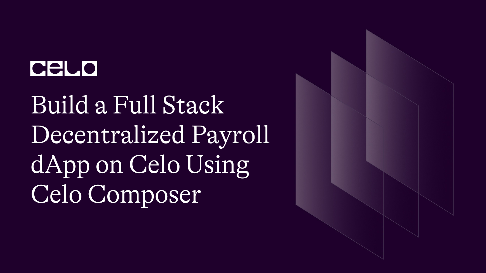
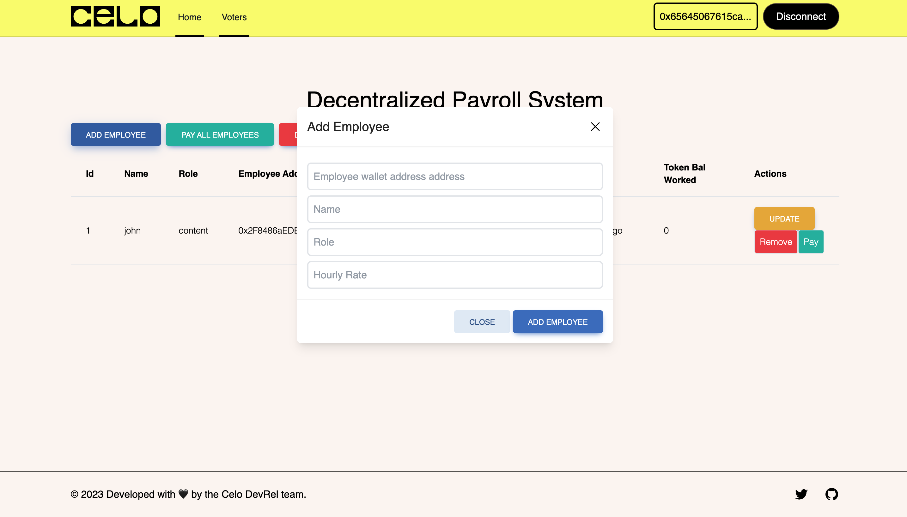
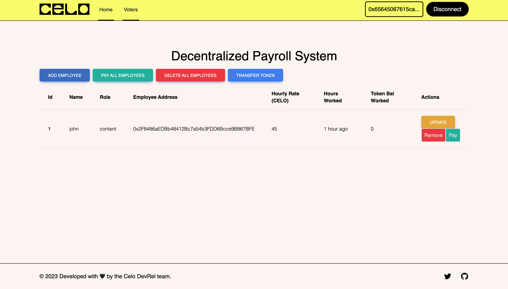
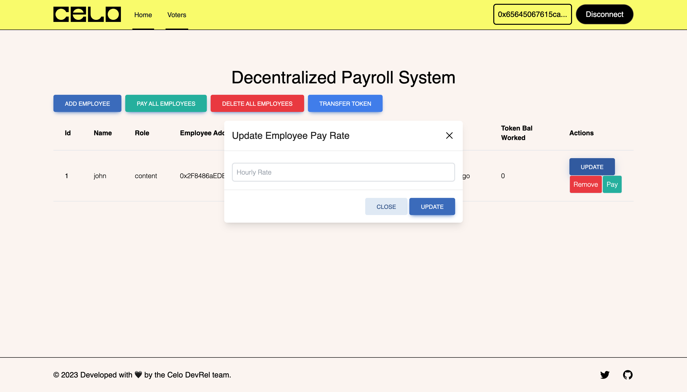
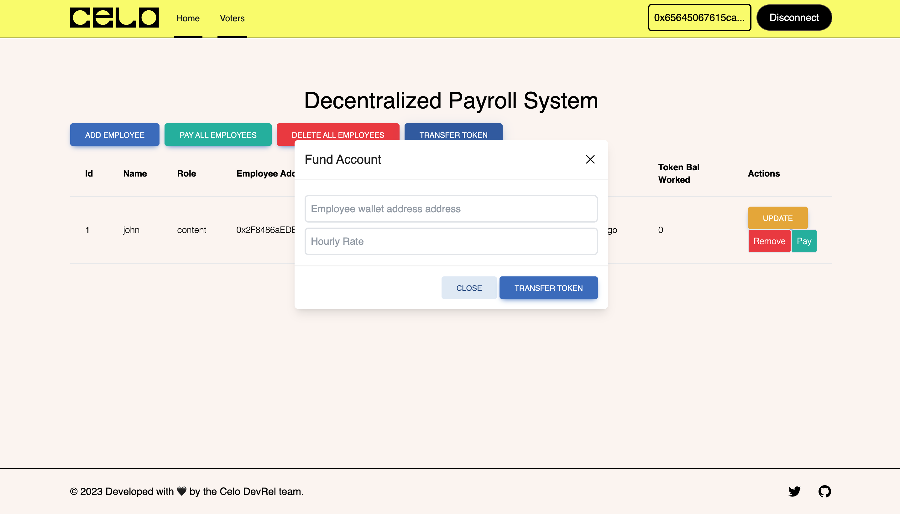

## Introduction​

Decentralized payroll systems have gained immense popularity in recent times due to their transparency and security. In this tutorial, we will walk you through the steps to build a full-stack decentralized payroll dApp using Celo composer, a toolkit for building smart contracts on the Celo blockchain.

The goal of the Payroll Dapp is to help Employers to automate the processing of employees' salaries as at when due securely and in a cost efficient way on the blockchain based on some smart contract conditions. Employees will receive their payment in CELO.

## Prerequisites​

To successfully follow along in this tutorial you need basic knowledge of:

- HTML, CSS, React and Next.js
- Blockchain, solidity and hardhat
- Celo Alfajores account

## Requirements​

To build this DApp we will need the following tools:

- [Vscode](https://code.visualstudio.com/) - But you can use any code editor of your choice
- [Hardhat](https://hardhat.org/) - used to deploy the smart contract
- [Alfajores Testnet Account](https://play.google.com/store/apps/details?id=org.celo.mobile.alfajores&hl=en&gl=US&pli=1) - required to connect to the dApp and make test transactions
- [Node](https://nodejs.org/en/)- an open-source, cross-platform JavaScript runtime environment
- [Celo Composer](https://github.com/celo-org/celo-composer)- starter project with all code needed to build, deploy, and upgrade a dapps on Celo.
- [Celo Wallet Extension](https://chrome.google.com/webstore/detail/celoextensionwallet/kkilomkmpmkbdnfelcpgckmpcaemjcdh?hl=en) / [Metamask](https://metamask.io/) - For interacting with the Celo blockchain

## Let’s Get Started

To understand why we are building the Payroll Smart contract on the blockchain. Here are some of the benefits of building a Payroll dapp on the blockchain over the traditional system.

Building a payroll dApp on the blockchain offers several benefits over traditional payroll systems, including:

- **Security:** Payroll information is sensitive data that needs to be kept confidential and secure. By using blockchain technology, the data can be stored in a decentralized and immutable way, reducing the risk of data breaches and hacks.

- **Transparency:** All payroll transactions can be recorded on the blockchain, creating a transparent and auditable trail of all payments and transactions. This allows for greater accountability and reduces the likelihood of fraud.

- **Efficiency:** Blockchain-based payroll systems can automate many of the payroll processes, including payments and tax calculations. This can save time and reduce errors, improving the efficiency of the payroll system.

- **Cost-effective:** Traditional payroll systems can be expensive to maintain and operate. By using blockchain technology, many of the costs associated with running a payroll system can be reduced, resulting in a more cost-effective solution.

- **Accessible:** With blockchain-based payroll systems, all employees can have access to their payroll information at any time, from anywhere. This can provide greater flexibility and convenience for employees.

Overall, building a payroll dApp on the blockchain can improve the security, transparency, efficiency, and accessibility of the payroll process while reducing costs.

### Step 1: Setup the Project

First, let's set up our project. Create a new directory and run the following commands and follow the steps

`npx @celo/celo-composer@latest create`

Select React, Tailwind css and React-Celo option and then enter your project name. For details on the steps checkout the [Celo Composer](https://github.com/celo-org/celo-composer) github readme page.

Once you have successfully completed the steps do `npm install` or `yarn` to install all required dependencies. Once that is done you are ready to start building.

Now open your newly created project. You will see a packages folder inside the package folder you will see hardhat and react-app folder.

For security reasons in order not to expose your private keys to the public create a new file named `.env` in the root of the hardhat folder add this line of code:

`PRIVATE KEY = <YOUR PRIVATE KEY>`

### Set up a Celo wallet

To get started with building our full-stack Payroll dapp on Celo, we need to set up a Celo wallet. You can use the Celo Wallet app, which is available on both iOS and [Android devices](https://play.google.com/store/apps/details?id=org.celo.mobile.alfajores&hl=en&gl=US&pli=1), or you can use a browser extension such as [Metamask](https://metamask.io/) or [Celo Wallet Extension](https://chrome.google.com/webstore/detail/celoextensionwallet/kkilomkmpmkbdnfelcpgckmpcaemjcdh?hl=en) .
Once you have set up your account visit Celo testnet [faucet](https://faucet.celo.org/) for test tokens. You will need to fund your account to deploy the contract and other smart contract interactions.

### Step 2: Write the Smart Contract

Now, let's write the smart contract. The smart contract is written using solidity. We will be writing two contracts. AfricToken contract and Payroll contract. First let’s create the AfricToken contract;

#### AfricToken Contract

Create a new file named AfricToken.sol in the contracts directory of the hardhat folder and add the following code:

#### Interface IERC20

```solidity
Interface IERC20 {
function name() public view returns (string)
function symbol() public view returns (string)
function decimals() public view returns (uint8)
function totalSupply() public view returns (uint256)
function balanceOf(address _owner) public view returns (uint256 balance)
function transfer(address _to, uint256 _value) public returns (bool success)
function transferFrom(address _from, address _to, uint256 _value) public returns (bool success)
function approve(address _spender, uint256 _value) public returns (bool success)
function allowance(address _owner, address _spender) public view returns (uint256 remaining)
}
event Transfer(address indexed _from, address indexed _to, uint256 _value)
event Approval(address indexed _owner, address indexed _spender, uint256 _value)
```

```solidity
// SPDX-License-Identifier:GPL-3.0

pragma solidity ^0.8.0;
import "@openzeppelin/contracts/token/ERC20/IERC20.sol";

contract AfricToken is IERC20 {

   string public name;
   string public symbol;
   uint8 public decimals;
   uint256 private _totalSupply;

   mapping(address => uint256) private _balances;
   mapping(address => mapping(address => uint256)) private _allowances;

   constructor() {
       _totalSupply = 200000000000000000000000;
       _balances[msg.sender] = _totalSupply;
       name = "AfricToken";
       symbol = "AFT";
       decimals = 18;

       emit Transfer(address(0), msg.sender, _totalSupply);
   }

   function totalSupply() public view override returns (uint256) {
       return _totalSupply;
   }

   function balanceOf(address account) public view override returns (uint256) {
       return _balances[account];
   }

   function transfer(address recipient, uint256 amount) public override returns (bool) {
       require(recipient != address(0), "ERC20: transfer to the zero address");
       require(_balances[msg.sender] >= amount, "ERC20: transfer amount exceeds balance");

       _balances[msg.sender] -= amount;
       _balances[recipient] += amount;

       emit Transfer(msg.sender, recipient, amount);

       return true;
   }

   function allowance(address owner, address spender) public view override returns (uint256) {
       return _allowances[owner][spender];
   }

   function approve(address spender, uint256 amount) public override returns (bool) {
       _allowances[msg.sender][spender] = amount;

       emit Approval(msg.sender, spender, amount);

       return true;
   }

   function transferFrom(address sender, address recipient, uint256 amount) public override returns (bool) {
       require(recipient != address(0), "ERC20: transfer to the zero address");
       require(_balances[sender] >= amount, "ERC20: transfer amount exceeds balance");
       require(_allowances[sender][msg.sender] >= amount, "ERC20: transfer amount exceeds allowance");

       _balances[sender] -= amount;
       _balances[recipient] += amount;
       _allowances[sender][msg.sender] -= amount;

       emit Transfer(sender, recipient, amount);

       return true;
   }
}

```

The AfricToken contract is a solidity smart contract that implements an ERC20 token.

ERC20 is a standard interface for tokens on the Ethereum blockchain. The contract defines functions and variables that allow users to transfer and manage the token.

The contract starts with a `SPDX-License-Identifier` comment that specifies the license under which the code is released. It uses the `GPL-3.0` license.

The `pragma` statement specifies the version of Solidity to use, which is `0.8.0` or higher.

The contract imports the IERC20.sol interface from the OpenZeppelin library. This interface defines the functions and events required by the ERC20 standard.

The contract implements the IERC20 interface, which means it must define the functions and events specified by the interface.

The contract has several variables, including:

- `name:` a string that represents the name of the token.
- `symbol:` a string that represents the symbol of the token.
- `decimals:` an integer that represents the number of decimals used for the token.
- `_totalSupply:` an integer that represents the total supply of the token.
- `_balances:` a mapping that stores the balances of each account.
- `_allowances:` a mapping that stores the allowances of each account.
- `The constructor` function initializes the token with a total supply of 200,000,000 AFT tokens. It sets the name to "AfricToken", the symbol to "AFT", and the number of decimals to 18. It also assigns the entire supply to the contract creator's address and emits a Transfer event to indicate the initial token transfer.

**The contract defines the following functions:**

- `totalSupply()`: returns the total supply of the token.

- `balanceOf(address account)`: returns the balance of the specified account.

- `transfer(address recipient, uint256 amount)`: transfers a specified amount of tokens from the sender's account to the recipient's account. It emits a Transfer event to indicate the token transfer.

- `allowance(address owner, address spender)`: returns the amount of tokens that the spender is allowed to spend on behalf of the owner.

- `approve(address spender, uint256 amount)`: approves the spender to spend a specified amount of tokens on behalf of the caller. It emits an Approval event to indicate the approval.

- `transferFrom(address sender, address recipient, uint256 amount)`: transfers a specified amount of tokens from the sender's account to the recipient's account. The transfer is allowed if the sender has enough balance and if the allowance of the sender to the caller is sufficient. It emits a Transfer event to indicate the token transfer.

### Payroll Contract

The Payroll contract manages the payment of employees in AfricToken cryptocurrency.
The contract has the following functionalities:

- It allows the contract owner to add and remove employees.
- It allows the contract owner to update the salary of an employee.
- It allows the contract owner to get information about an employee or a list of all employees.
- It allows the contract owner to pay all employees at once or pay an individual employee.
- It emits events when an employee is added, updated, or paid.

Create a new file named Payroll.sol in the contracts directory of the hardhat folder and add the following code:

```solidity
//SPDX-License-Identifier:GPL-3.0

pragma solidity >=0.7.0 <0.9.0;
import "@openzeppelin/contracts/token/ERC20/IERC20.sol";
import "@openzeppelin/contracts/utils/Counters.sol";
import "hardhat/console.sol";


contract Payroll {

   using Counters for Counters.Counter;
   Counters.Counter public employeeId;

   struct EmployeeInfo {
       uint256 id;
       address payable employeeWalletAddress;
       string name;
       string role;
       uint256 salary;
       uint256 lastPayday;
       uint256 tokenBal;
   }

  event LogEmployeeInfo(uint256 id, address employeeWalletAddress, string name, string role, uint256 salary, uint256 lastPayday);
  event LogEmployeeUpdate(uint256 _index, uint256 _salary);
  event LogEmployeePayday(uint256 _payout);

   EmployeeInfo[] public employeeList;
   address payable owner;
   IERC20 AfricToken;

   modifier onlyOwner {
       require(msg.sender == owner, "You are not the Payroll Manager");
       _;
   }

   mapping(address => bool) public isExist;

   constructor(address tokenAddress) {
       owner = payable(msg.sender);
       AfricToken = IERC20(tokenAddress);
   }

   function addEmployee(address payable _employeeAddress,  string memory _name,
   string memory _role, uint256 _salary) public onlyOwner {
       require(isExist[_employeeAddress] != true, "Employee already added");
       employeeId.increment();
       uint256 _id = employeeId.current();
       uint256 tokenbal = 0;
       employeeList.push(EmployeeInfo(_id, _employeeAddress, _name, _role, _salary, block.timestamp, tokenbal));
       isExist[_employeeAddress] = true;
       emit LogEmployeeInfo(_id, _employeeAddress, _name, _role, _salary, block.timestamp);
   }

   function removeEmployee(address _employeeAddress) public onlyOwner {
       for (uint i = 0; i < employeeList.length; i++) {
           if (employeeList[i].employeeWalletAddress == _employeeAddress) {
               employeeList[i] = employeeList[employeeList.length - 1];
               employeeList.pop();
               break;
           }
       }
   }

   function removeEmployees() public onlyOwner {
       delete employeeList;
   }

   function getEmployeeInfo(uint256 index) public view onlyOwner returns (
           uint256 id,
           address employeeWalletAddress,
           string memory name,
           string memory role,
           uint256 salary,
           uint256 lastPayday
       ) {
           return(
               employeeList[index].id,
               employeeList[index].employeeWalletAddress,
               employeeList[index].name,
               employeeList[index].role,
               employeeList[index].salary,
               employeeList[index].lastPayday
           );
       }

    function getEmployeeCount() public onlyOwner view returns (uint256) {
        return employeeList.length;
   }

   function getEmployees() public onlyOwner view returns (EmployeeInfo[] memory){
       return employeeList;
   }

   function updateEmployeeSalary(uint256 _index, uint256 _newSalary) public onlyOwner{
       EmployeeInfo storage employee = employeeList[_index];
       employee.salary = _newSalary;
       emit LogEmployeeUpdate(_index, _newSalary);
   }

   // Pay employee salary. Called by the contract owner
   function employeePayDay(uint256 _index) public {
       uint256 currentTime = block.timestamp;
       uint256 duration = currentTime - employeeList[_index].lastPayday;
       uint256 payout = duration * employeeList[_index].salary;
       employeeList[_index].lastPayday = currentTime;
       // send payment to employee
       AfricToken.transfer(payable(employeeList[_index].employeeWalletAddress), AfricToken.balanceOf(address(this)) - payout);
       employeeList[_index].tokenBal = AfricToken.balanceOf(employeeList[_index].employeeWalletAddress) + payout;
        emit LogEmployeePayday(payout);

       // send balance to contract owner
       AfricToken.transfer(payable(msg.sender), AfricToken.balanceOf(address(this)) - payout);
       emit LogEmployeePayday(AfricToken.balanceOf(address(this)) - payout);
   }


    // Function to calculate employee's salary payout and send them their wages
   function payEmployees() public payable onlyOwner{
       require(AfricToken.balanceOf(address(this)) != 0, "You dont have the token");
       // Calculate the sum of all employee salaries and the timestamp of payday
       uint totalSalary = 0;
       uint timestamp = block.timestamp;
       for (uint i = 0; i < employeeList.length; i++) {
           EmployeeInfo storage employee = employeeList[i];
           uint256 duration = timestamp /1000 - employee.lastPayday;
           uint256 hoursSpent = duration/3600;
           uint256 payout = hoursSpent * employee.salary;
           employee.lastPayday = timestamp;
           totalSalary += payout;

           // Send the payout to the employee
           AfricToken.transfer(employee.employeeWalletAddress, AfricToken.balanceOf(address(this)) - payout);
           employee.tokenBal = AfricToken.balanceOf(employee.employeeWalletAddress) + payout;
           emit LogEmployeePayday(payout);

       }

       // Send any remaining balance to the owner
       uint256 tokenBal = AfricToken.balanceOf(address(this)) - totalSalary;
       AfricToken.transfer(msg.sender, tokenBal);
       emit LogEmployeePayday(tokenBal);
   }

}

```

Here is a breakdown on how the above contract works;

`EmployeeInfo[] public employeeList;`

The contract has a state variable `employeeList` which is an array of structs representing the employee information.

```solidity
  struct EmployeeInfo {
       uint256 id;
       address payable employeeWalletAddress;
       string name;
       string role;
       uint256 salary;
       uint256 lastPayday;
       uint256 tokenBal;
   }

```

The `EmployeeInfo` struct has the following fields:
`id` - a unique identifier for the employee.
`employeeWalletAddress` - the Ethereum address of the employee's wallet where the payment will be sent.
`name` - the name of the employee.
`role` - the role of the employee.
`salary` - the employee's salary per hour in AfricToken.
`lastPayday` - the timestamp of the last time the employee was paid.
`tokenBal` - the balance of AfricToken owned by the employee.

```solidity
import "@openzeppelin/contracts/token/ERC20/IERC20.sol";
import "@openzeppelin/contracts/utils/Counters.sol";
import "hardhat/console.sol";
```

The contract uses OpenZeppelin library for importing the IERC20 interface and Counters library for incrementing the employee ID.

The contract also uses the "console.sol" library from the Hardhat framework for debugging purposes.

```solidity
  constructor(address tokenAddress) {
       owner = payable(msg.sender);
       AfricToken = IERC20(tokenAddress);
   }
```

The contract has a constructor that takes the address of the AfricToken contract as an argument and initializes the "owner" variable with the address of the contract deployer.

```solidity
   modifier onlyOwner {
       require(msg.sender == owner, "You are not the Payroll Manager");
       _;
   }
```

The contract has a modifier called `onlyOwner` that restricts the access to certain functions only to the contract owner.

```solidity
 event LogEmployeeInfo(uint256 id, address employeeWalletAddress, string name, string role, uint256 salary, uint256 lastPayday);
  event LogEmployeeUpdate(uint256 _index, uint256 _salary);
  event LogEmployeePayday(uint256 _payout);

```

The contract emits events using the "emit" keyword when certain actions are performed like adding an employee, updating an employee's salary, or paying an employee. These events can be used to track the actions performed on the contract.

**addEmployee**

```solidity
function addEmployee(address payable _employeeAddress,  string memory _name,
   string memory _role, uint256 _salary) public onlyOwner {
       require(isExist[_employeeAddress] != true, "Employee already added");
       employeeId.increment();
       uint256 _id = employeeId.current();
       uint256 tokenbal = 0;
       employeeList.push(EmployeeInfo(_id, _employeeAddress, _name, _role, _salary, block.timestamp, tokenbal));
       isExist[_employeeAddress] = true;
       emit LogEmployeeInfo(_id, _employeeAddress, _name, _role, _salary, block.timestamp);
   }
```

This function is called by the contract owner and adds the employee and also checks if the employee already exists. It pushes the employeeInfo to the employeeList.

**removeEmployee**

```solidity
 function removeEmployee(address _employeeAddress) public onlyOwner {
       for (uint i = 0; i < employeeList.length; i++) {
           if (employeeList[i].employeeWalletAddress == _employeeAddress) {
               employeeList[i] = employeeList[employeeList.length - 1];
               employeeList.pop();
               break;
           }
       }
   }
```

This function takes in one argument the employee wallet address to check if the employee exists in the list and then removes the employee if the wallet address entered matches the one on the list.

**removeEmployees**

```solidity
function removeEmployees() public onlyOwner {
       delete employeeList;
   }
```

This function deletes all the employees on the list.

**getEmployeeInfo**

```solidity
function getEmployeeInfo(uint256 index) public view onlyOwner returns (
           uint256 id,
           address employeeWalletAddress,
           string memory name,
           string memory role,
           uint256 salary,
           uint256 lastPayday
       ) {
           return(
               employeeList[index].id,
               employeeList[index].employeeWalletAddress,
               employeeList[index].name,
               employeeList[index].role,
               employeeList[index].salary,
               employeeList[index].lastPayday
           );
       }
```

This function is called only by the contract owner and it returns the employee info using the index of the employee on the list.

**getEmployeeCount**

```solidity
    function getEmployeeCount() public onlyOwner view returns (uint256) {
        return employeeList.length;
   }
```

This function returns the number of employees in the list.

**getEmployees**

```solidity
  function getEmployees() public onlyOwner view returns (EmployeeInfo[] memory){
       return employeeList;
   }
```

This function returns the list of all employees.

**updateEmployeeSalary**

```solidity
  function updateEmployeeSalary(uint256 _index, uint256 _newSalary) public onlyOwner{
      EmployeeInfo storage employee = employeeList[_index];
      employee.salary = _newSalary;
      emit LogEmployeeUpdate(_index, _newSalary);
  }
```

This function updates the employee salary. This takes in the index of the employee and the new salary. It is called only by the contract owner. And emits an event.

```solidity
 // Pay employee salary. Called by the contract owner
   function employeePayDay(uint256 _index) public {
       uint256 currentTime = block.timestamp;
       uint256 duration = currentTime - employeeList[_index].lastPayday;
       uint256 payout = duration * employeeList[_index].salary;
       employeeList[_index].lastPayday = currentTime;
       // send payment to employee
       AfricToken.transfer(payable(employeeList[_index].employeeWalletAddress), AfricToken.balanceOf(address(this)) - payout);
       employeeList[_index].tokenBal = AfricToken.balanceOf(employeeList[_index].employeeWalletAddress) + payout;
        emit LogEmployeePayday(payout);

       // send balance to contract owner
       AfricToken.transfer(payable(msg.sender), AfricToken.balanceOf(address(this)) - payout);
       emit LogEmployeePayday(AfricToken.balanceOf(address(this)) - payout);
   }
```

This function handles payment to an employee. It calculates the number of hours the employee has worked and multiply it by the employee salary. Salary is paid in AfricToken. It transfers the employee salary and sends the balance in the contract to the contract owner.

**payEmployees**

```solidity
// Function to calculate employee's salary payout and send them their wages
   function payEmployees() public payable onlyOwner{
       require(AfricToken.balanceOf(address(this)) != 0, "You dont have the token");
       // Calculate the sum of all employee salaries and the timestamp of payday
       uint totalSalary = 0;
       uint timestamp = block.timestamp;
       for (uint i = 0; i < employeeList.length; i++) {
           EmployeeInfo storage employee = employeeList[i];
           uint256 duration = timestamp /1000 - employee.lastPayday;
           uint256 hoursSpent = duration/3600;
           uint256 payout = hoursSpent * employee.salary;
           employee.lastPayday = timestamp;
           totalSalary += payout;

           // Send the payout to the employee
           AfricToken.transfer(employee.employeeWalletAddress, AfricToken.balanceOf(address(this)) - payout);
           employee.tokenBal = AfricToken.balanceOf(employee.employeeWalletAddress) + payout;
           emit LogEmployeePayday(payout);

       }

       // Send any remaining balance to the owner
       uint256 tokenBal = AfricToken.balanceOf(address(this)) - totalSalary;
       AfricToken.transfer(msg.sender, tokenBal);
       emit LogEmployeePayday(tokenBal);
   }

```

This function handles payment to employees. It uses the "transfer" function of the AfricToken contract to send payment to employees and the contract owner. It also checks the balance of AfricToken before making any payment. It calculates the number of hours the employee has worked and multiply it by the employee salary. Salary is paid in AfricToken. It transfers the employee salary and sends the balance in the contract to the contract owner.

## Step 3: Deploy the Contract

We will be deploying two contracts. AfricToken Contract and the Payroll Contract. First we will deploy the AfricToken contract and then pass the deployed contract address to the Payroll contract.

### Deploy AfricToken

To deploy the AfricToken navigate to the `script` folder and create a file called token.ts. Copy and paste this code inside the token.ts file

```js
// We require the Hardhat Runtime Environment explicitly here. This is optional
// but useful for running the script in a standalone fashion through `node <script>`.
//
// When running the script with `npx hardhat run <script>` you'll find the Hardhat
// Runtime Environment's members available in the global scope.
const hre = require("hardhat");

async function main() {
  // Hardhat always runs the compile task when running scripts with its command
  // line interface.
  //
  // If this script is run directly using `node` you may want to call compile
  // manually to make sure everything is compiled
  // await hre.run('compile');

  // We get the contract to deploy
  const AfricToken = await hre.ethers.getContractFactory("AfricToken");
  const africToken = await AfricToken.deploy();

  // await coffee.deployed();

  // console.log("Coffee deployed to:", coffee.address);

  const contractAddress = await (await africToken.deployed()).address;
  console.log(`Contract was deployed to ${contractAddress}`);
}

// We recommend this pattern to be able to use async/await everywhere
// and properly handle errors.
main()
  .then(() => process.exit(0))
  .catch((error) => {
    console.error(error);
    process.exit(1);
  });
```

To deploy the contract still on the hardhat directory enter the below command;
`npx hardhat run scripts/token.ts –network alfajores`

Once successfully deployed it will return the contract address and a generated ABI code, which we will use later to interact with the contract on the frontend.

You will see the generated json ABI code in the `artifacts/contracts/` directory.

### Deploy the Payroll Contract

Inside the hardhat directory navigate to the `scripts/deploy.ts` and replace the code with this 👇

```js
// We require the Hardhat Runtime Environment explicitly here. This is optional
// but useful for running the script in a standalone fashion through `node <script>`.
//
// When running the script with `npx hardhat run <script>` you'll find the Hardhat
// Runtime Environment's members available in the global scope.
const hre = require("hardhat");

async function main() {
  // Hardhat always runs the compile task when running scripts with its command
  // line interface.
  //
  // If this script is run directly using `node` you may want to call compile
  // manually to make sure everything is compiled
  // await hre.run('compile');

  // We get the contract to deploy
  const Payroll = await hre.ethers.getContractFactory("Payroll");
  const payroll = await Payroll.deploy(
    "0xdfBF46e557612966b2e55d230376E1a6C8D71297"
  );

  // await coffee.deployed();

  // console.log("Coffee deployed to:", coffee.address);

  const contractAddress = await (await payroll.deployed()).address;
  console.log(`Contract was deployed to ${contractAddress}`);
}

// We recommend this pattern to be able to use async/await everywhere
// and properly handle errors.
main()
  .then(() => process.exit(0))
  .catch((error) => {
    console.error(error);
    process.exit(1);
  });
```

To deploy the contract still on the hardhat directory enter the below command;
`npx hardhat run scripts/deploy.ts –network alfajores`

Once successfully deployed it will return the contract address and a generated ABI code, which we will use later to interact with the contract on the frontend.

You will see the generated json ABI code in the `artifacts/contracts/` directory.

## Step 4: Frontend interaction

To interact with the frontend navigate to the `react-app` directory and run this command to start the development server
`npm run dev` will start the localhost server at port 3000.

Celo composer has done the work of setting up a next.js app for us. Currently the next.js app comes with three components: the header, footer and layout and also connection to Celo wallet has also been done. All you need to do is to go to the \_app.tsx file and make modifications to the CeloProvider based on what you need. In this tutorial we will be using it as it is. We are going to make a little modification to the header.tsx file so that we can display the wallet address of the connected user.

Inside the react-app directory, create an `interact.tsx` file and copy the below code. This code handles all calls to the contract. Each of these contract calls will be used in our component where appropriate. Your `interact.tsx` file should look like this. 👇

**interact.tsx**

```js
import payrollABI from "./Payroll.json"
import tokenABI from "./AfricToken.json"

const payrollAddress = "Place your deployed payroll address here”;
const tokenAddress = "Place your deployed token address here”;
export function initContract(kit: any, abi: any, contractAddress: string) {
 return new kit.connection.web3.eth.Contract(abi, contractAddress)
}

// Payroll Contract Calls
export const addEmployee = async (address: string | null | undefined,
 kit: any, employeeAddress: string, name: string, role: string, salary: string) => {
 try {
   const txHash = await initContract(kit, payrollABI.abi, payrollAddress).methods
     .addEmployee(employeeAddress, name, role, salary).send({
   from: address,
   })
   console.log(txHash)
 } catch (e) {
   console.log(e)
 }
}

export const removeEmployee = async (address: string | null | undefined,
 kit: any, employeeAddress: string) => {
 try {
   const txHash = await initContract(kit, payrollABI.abi, payrollAddress).methods
     .removeEmployee(employeeAddress).send({
   from: address,
   })
   console.log(txHash)
 } catch (e) {
   console.log(e)
 }
}

export const removeEmployees = async (address: string | null | undefined,
 kit: any) => {
 try {
   const txHash = await initContract(kit, payrollABI.abi, payrollAddress).methods
     .removeEmployees().send({
   from: address,
   })
   console.log(txHash)
 } catch (e) {
   console.log(e)
 }
}

export const updateEmployeeSalary = async (address: string | null | undefined,
 kit: any, index: number, newSalary: string) => {
 try {
   const txHash = await initContract(kit, payrollABI.abi, payrollAddress).methods
     .updateEmployeeSalary(index, newSalary).send({
   from: address,
   })
   console.log(txHash)
 } catch (e) {
   console.log(e)
 }
}

export const employeePayDay = async (address: string | null | undefined,
 kit: any, index: number) => {
 try {
   const txHash = await initContract(kit, payrollABI.abi, payrollAddress).methods
     .employeePayDay(index).send({
   from: address,
   })
   console.log(txHash)
 } catch (e) {
   console.log(e)
 }
}

export const payEmployees = async (address: string | null | undefined,
 kit: any) => {
 try {
   const txHash = await initContract(kit, payrollABI.abi, payrollAddress).methods
     .payEmployees().send({
   from: address,
   })
   console.log(txHash)
 } catch (e) {
   console.log(e)
 }
}

export const getEmployee = async (kit: any, employeeAddress: string) => {
 try {
   const employee = await initContract(kit, payrollABI.abi, payrollAddress).methods.getEmployee(employeeAddress).call()
   console.log(employee)
   return employee;
 } catch (e) {
   console.log(e)
 }
}

export const getEmployeeInfo = async (kit: any, index: number) => {
 try {
   const employee = await initContract(kit, payrollABI.abi, payrollAddress).methods.getEmployeeInfo(index).call()
   console.log(employee)
   return employee;
 } catch (e) {
   console.log(e)
 }
}

export const getEmployeeCount = async (kit: any) => {
 try {
   const employeeCount = await initContract(kit, payrollABI.abi, payrollAddress).methods.getEmployeeCount().call()
   console.log(employeeCount)
   return employeeCount;
 } catch (e) {
   console.log(e)
 }
}

export const getEmployees = async (kit: any) => {
 try {
   const employees = await initContract(kit, payrollABI.abi, payrollAddress).methods.getEmployees().call()
   console.log(employees)
   return employees;
 } catch (e) {
   console.log(e)
 }
}

// Token Contract Calls
export const transferToken = async (address: string | null | undefined,
 kit: any, employeeAddress: string, amount: string) => {
 try {
   const txHash = await initContract(kit, tokenABI.abi, tokenAddress).methods
     .transfer(employeeAddress, amount).send({
       from: address,
       value: amount
   })
   console.log(txHash)
 } catch (e) {
   console.log(e)
 }
}

export const getTokenBalance = async (kit: any, account: string) => {
 try {
   const employees = await initContract(kit, payrollABI.abi, payrollAddress).methods.balanceOf(account).call()
   console.log(employees)
   return employees;
 } catch (e) {
   console.log(e)
 }
}
```

This above code exports a set of functions that interact with two Celo smart contracts - "Payroll" and "AfricToken" - using the Celo contractkit library.

Note that the kit parameter in each function is an instance of the CeloKit class from the @celo/contractkit library, which provides access to the web3.js library and other Celo-specific utilities. The address parameter is the address of the account that will be used to interact with the contracts.

Here is a brief explanation of each function:

`initContract`: Initializes a contract instance with a given ABI and contract address.

`addEmployee`: Adds a new employee to the payroll contract.

`removeEmployee`: Removes an employee from the payroll contract.

`removeEmployees`: Removes all employees from the payroll contract.

`updateEmployeeSalary`: Updates an employee's salary in the payroll contract.

`employeePayDay`: Triggers a payment to an employee in the payroll contract.

`payEmployees`: Triggers payments to all employees in the payroll contract.

`getEmployee`: Retrieves the details of a specific employee from the payroll contract.

`getEmployeeInfo`: Retrieves the details of an employee at a given index from the payroll contract.

`getEmployeeCount`: Retrieves the number of employees in the payroll contract.

`getEmployees`: Retrieves an array of all employees in the payroll contract.

`transferToken`: Transfers tokens from the AfricToken contract to a specific address.

`getTokenBalance`: Retrieves the token balance of a specific address from the AfricToken contract.
**EmployeeModal**

This component contains an input field for adding employees. Inside this component the `handleAddEmployee` function calls the addEmployee function from the `interact.tsx` module, passing the necessary parameters to add the employee data to the blockchain. Here is what the UI looks like 👇

**Fig 4-1** EmployeeModal


Here is the code for the above UI.

```js
import React, { useState } from "react";
import { addEmployee } from "@/interact";
import { useCelo } from "@celo/react-celo";

export default function EmployeeModal(): JSX.Element {
  const [employeeName, setEmployeeName] = useState < string > "";
  const [role, setRole] = useState < string > "";
  const [walletAddress, setWalletAddress] = useState < string > "";
  const [hourlyRate, setHourlyRate] = useState < string > "";
  const { kit, address } = useCelo();

  const handleEmployeeName = (e: React.FormEvent<HTMLInputElement>) => {
    setEmployeeName(e.currentTarget.value);
    console.log(e.currentTarget.value);
  };

  const handleEmployeeRole = (e: React.FormEvent<HTMLInputElement>) => {
    setRole(e.currentTarget.value);
    console.log(e.currentTarget.value);
  };

  const handleEmployeeAddress = (e: React.FormEvent<HTMLInputElement>) => {
    setWalletAddress(e.currentTarget.value);
    console.log(e.currentTarget.value);
  };

  const handleHourlyRate = (e: React.FormEvent<HTMLInputElement>) => {
    setHourlyRate(e.currentTarget.value);
    console.log(e.currentTarget.value);
  };

  const handleAddEmployee = async () => {
    await addEmployee(
      address,
      kit,
      walletAddress,
      employeeName,
      role,
      hourlyRate
    );
    window.location.reload();
  };

  return (
    <div>
      <div
        data-te-modal-init
        className="fixed top-0 left-0 z-[1055] hidden h-full w-full overflow-y-auto overflow-x-hidden outline-none"
        id="exampleModalCenter"
        tabIndex={-1}
        aria-labelledby="exampleModalCenterTitle"
        aria-modal="true"
        role="dialog"
      >
        <div
          data-te-modal-dialog-ref
          className="pointer-events-none relative flex min-h-[calc(100%-1rem)] w-auto translate-y-[-50px] items-center opacity-0 transition-all duration-300 ease-in-out min-[576px]:mx-auto min-[576px]:mt-7 min-[576px]:min-h-[calc(100%-3.5rem)] min-[576px]:max-w-[500px]"
        >
          <div className="pointer-events-auto relative flex w-full flex-col rounded-md border-none bg-white bg-clip-padding text-current shadow-lg outline-none dark:bg-neutral-600">
            <div className="flex flex-shrink-0 items-center justify-between rounded-t-md border-b-2 border-neutral-100 border-opacity-100 p-4 dark:border-opacity-50">
              <h5
                className="text-xl font-medium leading-normal text-neutral-800 dark:text-neutral-200"
                id="exampleModalScrollableLabel"
              >
                Add Employee
              </h5>
              <button
                type="button"
                className="box-content rounded-none border-none hover:no-underline hover:opacity-75 focus:opacity-100 focus:shadow-none focus:outline-none"
                data-te-modal-dismiss
                aria-label="Close"
              >
                <svg
                  xmlns="http://www.w3.org/2000/svg"
                  fill="none"
                  viewBox="0 0 24 24"
                  stroke-width="1.5"
                  stroke="currentColor"
                  className="h-6 w-6"
                >
                  <path
                    stroke-linecap="round"
                    stroke-linejoin="round"
                    d="M6 18L18 6M6 6l12 12"
                  />
                </svg>
              </button>
            </div>
            <div className="relative p-4">
              <input
                type="text"
                placeholder="Employee wallet address address"
                className="border-2 p-2 mt-2 rounded-md w-full"
                value={walletAddress}
                onChange={handleEmployeeAddress}
              />
              <input
                type="text"
                placeholder="Name"
                className="border-2 p-2 mt-2 rounded-md w-full"
                value={employeeName}
                onChange={handleEmployeeName}
              />
              <input
                type="text"
                placeholder="Role"
                className="border-2 p-2 mt-2 rounded-md w-full"
                value={role}
                onChange={handleEmployeeRole}
              />
              <input
                type="number"
                placeholder="Hourly Rate"
                className="border-2 p-2 mt-2 rounded-md w-full"
                value={hourlyRate}
                onChange={handleHourlyRate}
              />
            </div>
            <div className="flex flex-shrink-0 flex-wrap items-center justify-end rounded-b-md border-t-2 border-neutral-100 border-opacity-100 p-4 dark:border-opacity-50">
              <button
                type="button"
                className="inline-block rounded bg-primary-100 px-6 pt-2.5 pb-2 text-xs font-medium uppercase leading-normal text-primary-700 transition duration-150 ease-in-out hover:bg-primary-accent-100 focus:bg-primary-accent-100 focus:outline-none focus:ring-0 active:bg-primary-accent-200"
                data-te-modal-dismiss
                data-te-ripple-init
                data-te-ripple-color="light"
              >
                Close
              </button>
              <button
                onClick={handleAddEmployee}
                type="button"
                className="ml-1 inline-block rounded bg-primary px-6 pt-2.5 pb-2 text-xs font-medium uppercase leading-normal text-white shadow-[0_4px_9px_-4px_#3b71ca] transition duration-150 ease-in-out hover:bg-primary-600 hover:shadow-[0_8px_9px_-4px_rgba(59,113,202,0.3),0_4px_18px_0_rgba(59,113,202,0.2)] focus:bg-primary-600 focus:shadow-[0_8px_9px_-4px_rgba(59,113,202,0.3),0_4px_18px_0_rgba(59,113,202,0.2)] focus:outline-none focus:ring-0 active:bg-primary-700 active:shadow-[0_8px_9px_-4px_rgba(59,113,202,0.3),0_4px_18px_0_rgba(59,113,202,0.2)]"
                data-te-ripple-init
                data-te-ripple-color="light"
              >
                Add employee
              </button>
            </div>
          </div>
        </div>
      </div>
    </div>
  );
}
```

**TableList.tsx**
This component handles displaying the employees in a table.

```js
import React,{ useState, useEffect } from 'react'
import { useCelo } from '@celo/react-celo'
import { getEmployees, removeEmployee, employeePayDay } from '@/interact'
import UpdateModal from './UpdateModal'
interface Iparam{
 id: number,
 employeeAddress: string
 name: string,
 role: string,
 payRate: number,
 lastpayday: number,
 tokenBal: number
}

export default function TableList(): JSX.Element {
 const { kit, address } = useCelo()
 const [employees, setEmployees] = useState<any[]>([])

 const handleEmployees = async () => {
   const employeeList = await getEmployees(kit)
   setEmployees(employeeList)
 }

 const handleRemoveEmployee = async (employeeWalletAddress : string) => {
   await removeEmployee(address, kit, employeeWalletAddress)
   window.location.reload()
 }

 const handlePayEmployee = async (index : number) => {
   await employeePayDay(address, kit, index)
   window.location.reload()
 }

 const formateTime = (lastpayday: number) => {
   const hoursAgo = Math.round((Date.now() / 1000 - lastpayday) / 3600);
   return `${hoursAgo} hours ago `
 }

 useEffect(() => {
   handleEmployees()
 }, [kit])

 return (
   <div>
     <div className="flex flex-col">
       <div className="overflow-x-auto sm:-mx-6 lg:-mx-8">
         <div className="inline-block min-w-full py-2 sm:px-6 lg:px-8">
           <div className="overflow-hidden">
             <table className="min-w-full text-left text-sm font-light">
               <thead className="border-b font-medium dark:border-neutral-500">
                 <tr>
                   <th scope="col" className="px-6 py-4">Id</th>
                   <th scope="col" className="px-6 py-4">Name</th>
                   <th scope="col" className="px-6 py-4">Role</th>
                   <th scope="col" className="px-6 py-4">Employee Address</th>
                   <th scope="col" className="px-6 py-4">Hourly Rate (CELO)</th>
                   <th scope="col" className="px-6 py-4">Hours Worked</th>
                   <th scope="col" className="px-6 py-4">Token Bal Worked</th>
                   <th scope="col" className="px-6 py-4">Actions</th>
                 </tr>
               </thead>
               <tbody>
                 {!employees ? <div>Employee not yet added</div> : employees.map((item, index) => <tr className="border-b dark:border-neutral-500" key={index}>
                   <td className="whitespace-nowrap px-6 py-4 font-medium">{item.id}</td>
                   <td className="whitespace-nowrap px-6 py-4">{item.name}</td>
                   <td className="whitespace-nowrap px-6 py-4">{item.role}</td>
                   <td className="whitespace-nowrap px-6 py-4">{item.employeeWalletAddress}</td>
                   <td className="whitespace-nowrap px-6 py-4">{item.salary}</td>
                   <td className="whitespace-nowrap px-6 py-4">{formateTime(item.lastPayday)}</td>
                   <td className="whitespace-nowrap px-6 py-4">{item.tokenBal}</td>
                   <td className="whitespace-nowrap px-6 py-4">
                   <button
                     type="button"
                     className="inline-block rounded bg-yellow-500 px-6 pt-2.5 pb-2 text-xs font-medium uppercase leading-normal text-white shadow-[0_4px_9px_-4px_#3b71ca] transition duration-150 ease-in-out hover:bg-primary-600 hover:shadow-[0_8px_9px_-4px_rgba(59,113,202,0.3),0_4px_18px_0_rgba(59,113,202,0.2)] focus:bg-primary-600 focus:shadow-[0_8px_9px_-4px_rgba(59,113,202,0.3),0_4px_18px_0_rgba(59,113,202,0.2)] focus:outline-none focus:ring-0 active:bg-primary-700 active:shadow-[0_8px_9px_-4px_rgba(59,113,202,0.3),0_4px_18px_0_rgba(59,113,202,0.2)]"
                     data-te-toggle="modal"
                     data-te-target="#updateModal"
                     data-te-ripple-init
                     data-te-ripple-color="light">
                     Update
                     </button>
                     <UpdateModal employeeId={item.id -1} />
                     <button onClick={() => handleRemoveEmployee(item.employeeWalletAddress)} className='bg-red-500 p-2 border rounded text-white'>Remove</button>
                     <button onClick={() =>handlePayEmployee(item.id)} className='bg-teal-500 p-2 border rounded text-white'>Pay</button>
                   </td>
                 </tr>)}
               </tbody>
             </table>
           </div>
         </div>
       </div>
     </div>
   </div>
 )
}
```

**index.tsx**
This is the landing page. It imports the table list and displays the table and other buttons.The add employee button opens up the employee modal. The pay employees button calls the `payEmployees` smart contract function and handles payment of all employees. The delete all employees button, calls the smart contract removeEmployees function which handles removal of all employees. The transfer token button calls the AfricToken smart contract function transfer to fund the Payroll contract account.

Note: The Payroll contract needs to be funded with some of the AfricToken created in other to be able to make payment to employees.

The update button handles updating of the employees salary payrate. And the pay button handles payment of the employee, the remove button remove the employee from the record.

The UI looks like this 👇
**Fig 4-2:** Home Page - index.ts


Here is the code for the above UI.

```js
import React, { useState, useEffect  } from 'react'
import {
  payEmployees,
 getEmployees, removeEmployees
} from '@/interact'
import { useCelo } from '@celo/react-celo';
import EmployeeModal from '@/components/EmployeeModal';
import TableList from '@/components/TableList';
import TransferModal from '@/components/TransferModal';


export default function Home() {

 const { kit, address } = useCelo()
 const [employees, setEmployees] = useState<any[]>([])

 const handleDeleteAll = async () => {
   await removeEmployees(address, kit);
 }

  const handleEmployees = async () => {
   const employeeList = await getEmployees(kit)
   setEmployees(employeeList)
 }

 const handlePayEmployees = async () => {
   await payEmployees(address, kit);
 }

 useEffect(() => {
   handleEmployees()
 }, [])
 return (
   <div>
   {!address ? <div>Please connect your wallet</div> :
       <div>
         <h1 className='text-4xl text-center m-4'>Decentralized Payroll System</h1>
             <div className="flex ">
             <button
               type="button"
               className="inline-block rounded bg-primary px-6 pt-2.5 pb-2 text-xs font-medium uppercase leading-normal text-white shadow-[0_4px_9px_-4px_#3b71ca] transition duration-150 ease-in-out hover:bg-primary-600 hover:shadow-[0_8px_9px_-4px_rgba(59,113,202,0.3),0_4px_18px_0_rgba(59,113,202,0.2)] focus:bg-primary-600 focus:shadow-[0_8px_9px_-4px_rgba(59,113,202,0.3),0_4px_18px_0_rgba(59,113,202,0.2)] focus:outline-none focus:ring-0 active:bg-primary-700 active:shadow-[0_8px_9px_-4px_rgba(59,113,202,0.3),0_4px_18px_0_rgba(59,113,202,0.2)]"
               data-te-toggle="modal"
               data-te-target="#exampleModalCenter"
               data-te-ripple-init
               data-te-ripple-color="light">
               Add Employee
           </button>

           <button
             onClick={handlePayEmployees}
               type="button"
               className="inline-block rounded bg-teal-500 px-6 pt-2.5 pb-2 text-xs mx-2
                font-medium uppercase leading-normal text-white shadow-[0_4px_9px_-4px_#3b71ca] transition duration-150 ease-in-out hover:bg-primary-600 hover:shadow-[0_8px_9px_-4px_rgba(59,113,202,0.3),0_4px_18px_0_rgba(59,113,202,0.2)] focus:bg-primary-600 focus:shadow-[0_8px_9px_-4px_rgba(59,113,202,0.3),0_4px_18px_0_rgba(59,113,202,0.2)] focus:outline-none focus:ring-0 active:bg-primary-700 active:shadow-[0_8px_9px_-4px_rgba(59,113,202,0.3),0_4px_18px_0_rgba(59,113,202,0.2)]"
               data-te-ripple-init
               data-te-ripple-color="light">
               Pay All Employees
           </button>

           <button
               onClick={handleDeleteAll}
               type="button"
               className="inline-block rounded bg-red-500 px-6 pt-2.5 pb-2 text-xs font-medium uppercase leading-normal text-white shadow-[0_4px_9px_-4px_#3b71ca] transition duration-150 ease-in-out hover:bg-primary-600 hover:shadow-[0_8px_9px_-4px_rgba(59,113,202,0.3),0_4px_18px_0_rgba(59,113,202,0.2)] focus:bg-primary-600 focus:shadow-[0_8px_9px_-4px_rgba(59,113,202,0.3),0_4px_18px_0_rgba(59,113,202,0.2)] focus:outline-none focus:ring-0 active:bg-primary-700 active:shadow-[0_8px_9px_-4px_rgba(59,113,202,0.3),0_4px_18px_0_rgba(59,113,202,0.2)]"
               data-te-ripple-init
               data-te-ripple-color="light">
               Delete All Employees
           </button>

            <button
               type="button"
               data-te-toggle="modal"
               data-te-target="#transferModal"
               className="inline-block ml-2 rounded bg-blue-500 px-6 pt-2.5 pb-2 text-xs font-medium uppercase leading-normal text-white shadow-[0_4px_9px_-4px_#3b71ca] transition duration-150 ease-in-out hover:bg-primary-600 hover:shadow-[0_8px_9px_-4px_rgba(59,113,202,0.3),0_4px_18px_0_rgba(59,113,202,0.2)] focus:bg-primary-600 focus:shadow-[0_8px_9px_-4px_rgba(59,113,202,0.3),0_4px_18px_0_rgba(59,113,202,0.2)] focus:outline-none focus:ring-0 active:bg-primary-700 active:shadow-[0_8px_9px_-4px_rgba(59,113,202,0.3),0_4px_18px_0_rgba(59,113,202,0.2)]"
               data-te-ripple-init
               data-te-ripple-color="light">
               Transfer Token
           </button>
           <TransferModal/>
           </div>

         <EmployeeModal />
         <TableList/>
       </div>
   }
   </div>
 )
}

```

**UpdateModal.tsx**
This contains an input field for updating the salary rate of the employee. And the UI looks like this 👇

**Fig 4-4:** Salary Update Modal


Here is the code for the above UI.

```js
import React, { useState } from "react";
import { addEmployee, updateEmployeeSalary } from "@/interact";
import { useCelo } from "@celo/react-celo";

interface Iparam {
  employeeId: number;
}
export default function UpdateModal(param: Iparam): JSX.Element {
  const [hourlyRate, setHourlyRate] = useState < string > "";
  const { kit, address } = useCelo();

  const handleHourlyRate = (e: React.FormEvent<HTMLInputElement>) => {
    setHourlyRate(e.currentTarget.value);
    console.log(e.currentTarget.value);
  };

  const handleSalaryUpdate = async () => {
    await updateEmployeeSalary(address, kit, param.employeeId, hourlyRate);
    window.location.reload();
  };

  return (
    <div>
      <div
        data-te-modal-init
        className="fixed top-0 left-0 z-[1055] hidden h-full w-full overflow-y-auto overflow-x-hidden outline-none"
        id="updateModal"
        tabIndex={-1}
        aria-labelledby="exampleModalCenterTitle"
        aria-modal="true"
        role="dialog"
      >
        <div
          data-te-modal-dialog-ref
          className="pointer-events-none relative flex min-h-[calc(100%-1rem)] w-auto translate-y-[-50px] items-center opacity-0 transition-all duration-300 ease-in-out min-[576px]:mx-auto min-[576px]:mt-7 min-[576px]:min-h-[calc(100%-3.5rem)] min-[576px]:max-w-[500px]"
        >
          <div className="pointer-events-auto relative flex w-full flex-col rounded-md border-none bg-white bg-clip-padding text-current shadow-lg outline-none dark:bg-neutral-600">
            <div className="flex flex-shrink-0 items-center justify-between rounded-t-md border-b-2 border-neutral-100 border-opacity-100 p-4 dark:border-opacity-50">
              <h5
                className="text-xl font-medium leading-normal text-neutral-800 dark:text-neutral-200"
                id="exampleModalScrollableLabel"
              >
                Update Employee Pay Rate
              </h5>
              <button
                type="button"
                className="box-content rounded-none border-none hover:no-underline hover:opacity-75 focus:opacity-100 focus:shadow-none focus:outline-none"
                data-te-modal-dismiss
                aria-label="Close"
              >
                <svg
                  xmlns="http://www.w3.org/2000/svg"
                  fill="none"
                  viewBox="0 0 24 24"
                  stroke-width="1.5"
                  stroke="currentColor"
                  className="h-6 w-6"
                >
                  <path
                    stroke-linecap="round"
                    stroke-linejoin="round"
                    d="M6 18L18 6M6 6l12 12"
                  />
                </svg>
              </button>
            </div>
            <div className="relative p-4">
              <input
                type="number"
                placeholder="Hourly Rate"
                className="border-2 p-2 mt-2 rounded-md w-full"
                value={hourlyRate}
                onChange={handleHourlyRate}
              />
            </div>
            <div className="flex flex-shrink-0 flex-wrap items-center justify-end rounded-b-md border-t-2 border-neutral-100 border-opacity-100 p-4 dark:border-opacity-50">
              <button
                type="button"
                className="inline-block rounded bg-primary-100 px-6 pt-2.5 pb-2 text-xs font-medium uppercase leading-normal text-primary-700 transition duration-150 ease-in-out hover:bg-primary-accent-100 focus:bg-primary-accent-100 focus:outline-none focus:ring-0 active:bg-primary-accent-200"
                data-te-modal-dismiss
                data-te-ripple-init
                data-te-ripple-color="light"
              >
                Close
              </button>
              <button
                onClick={handleSalaryUpdate}
                type="button"
                className="ml-1 inline-block rounded bg-primary px-6 pt-2.5 pb-2 text-xs font-medium uppercase leading-normal text-white shadow-[0_4px_9px_-4px_#3b71ca] transition duration-150 ease-in-out hover:bg-primary-600 hover:shadow-[0_8px_9px_-4px_rgba(59,113,202,0.3),0_4px_18px_0_rgba(59,113,202,0.2)] focus:bg-primary-600 focus:shadow-[0_8px_9px_-4px_rgba(59,113,202,0.3),0_4px_18px_0_rgba(59,113,202,0.2)] focus:outline-none focus:ring-0 active:bg-primary-700 active:shadow-[0_8px_9px_-4px_rgba(59,113,202,0.3),0_4px_18px_0_rgba(59,113,202,0.2)]"
                data-te-ripple-init
                data-te-ripple-color="light"
              >
                Update
              </button>
            </div>
          </div>
        </div>
      </div>
    </div>
  );
}
```

**TransferModal.tsx**
This contains input fields for funding the account of the address entered with the AfricToken. The UI looks like this 👇

**Fig 4-3:** TransferModal


The code below handles the above UI.

```js
import React, { useState } from "react";
import { transferToken } from "@/interact";
import { useCelo } from "@celo/react-celo";

export default function TransferModal(): JSX.Element {
  const [walletAddress, setWalletAddress] = useState < string > "";
  const [amount, setAmount] = useState < string > "";
  const { kit, address } = useCelo();

  const handleAddress = (e: React.FormEvent<HTMLInputElement>) => {
    setWalletAddress(e.currentTarget.value);
    console.log(e.currentTarget.value);
  };

  const handleAmount = (e: React.FormEvent<HTMLInputElement>) => {
    setAmount(e.currentTarget.value);
    console.log(e.currentTarget.value);
  };

  const handleTransfer = async () => {
    await transferToken(address, kit, walletAddress, amount);
    // window.location.reload()
  };

  return (
    <div>
      <div
        data-te-modal-init
        className="fixed top-0 left-0 z-[1055] hidden h-full w-full overflow-y-auto overflow-x-hidden outline-none"
        id="transferModal"
        tabIndex={-1}
        aria-labelledby="exampleModalCenterTitle"
        aria-modal="true"
        role="dialog"
      >
        <div
          data-te-modal-dialog-ref
          className="pointer-events-none relative flex min-h-[calc(100%-1rem)] w-auto translate-y-[-50px] items-center opacity-0 transition-all duration-300 ease-in-out min-[576px]:mx-auto min-[576px]:mt-7 min-[576px]:min-h-[calc(100%-3.5rem)] min-[576px]:max-w-[500px]"
        >
          <div className="pointer-events-auto relative flex w-full flex-col rounded-md border-none bg-white bg-clip-padding text-current shadow-lg outline-none dark:bg-neutral-600">
            <div className="flex flex-shrink-0 items-center justify-between rounded-t-md border-b-2 border-neutral-100 border-opacity-100 p-4 dark:border-opacity-50">
              <h5
                className="text-xl font-medium leading-normal text-neutral-800 dark:text-neutral-200"
                id="exampleModalScrollableLabel"
              >
                Fund Account
              </h5>
              <button
                type="button"
                className="box-content rounded-none border-none hover:no-underline hover:opacity-75 focus:opacity-100 focus:shadow-none focus:outline-none"
                data-te-modal-dismiss
                aria-label="Close"
              >
                <svg
                  xmlns="http://www.w3.org/2000/svg"
                  fill="none"
                  viewBox="0 0 24 24"
                  stroke-width="1.5"
                  stroke="currentColor"
                  className="h-6 w-6"
                >
                  <path
                    stroke-linecap="round"
                    stroke-linejoin="round"
                    d="M6 18L18 6M6 6l12 12"
                  />
                </svg>
              </button>
            </div>
            <div className="relative p-4">
              <input
                type="text"
                placeholder="Employee wallet address address"
                className="border-2 p-2 mt-2 rounded-md w-full"
                value={walletAddress}
                onChange={handleAddress}
              />
              <input
                type="number"
                placeholder="Hourly Rate"
                className="border-2 p-2 mt-2 rounded-md w-full"
                value={amount}
                onChange={handleAmount}
              />
            </div>
            <div className="flex flex-shrink-0 flex-wrap items-center justify-end rounded-b-md border-t-2 border-neutral-100 border-opacity-100 p-4 dark:border-opacity-50">
              <button
                type="button"
                className="inline-block rounded bg-primary-100 px-6 pt-2.5 pb-2 text-xs font-medium uppercase leading-normal text-primary-700 transition duration-150 ease-in-out hover:bg-primary-accent-100 focus:bg-primary-accent-100 focus:outline-none focus:ring-0 active:bg-primary-accent-200"
                data-te-modal-dismiss
                data-te-ripple-init
                data-te-ripple-color="light"
              >
                Close
              </button>
              <button
                onClick={handleTransfer}
                type="button"
                className="ml-1 inline-block rounded bg-primary px-6 pt-2.5 pb-2 text-xs font-medium uppercase leading-normal text-white shadow-[0_4px_9px_-4px_#3b71ca] transition duration-150 ease-in-out hover:bg-primary-600 hover:shadow-[0_8px_9px_-4px_rgba(59,113,202,0.3),0_4px_18px_0_rgba(59,113,202,0.2)] focus:bg-primary-600 focus:shadow-[0_8px_9px_-4px_rgba(59,113,202,0.3),0_4px_18px_0_rgba(59,113,202,0.2)] focus:outline-none focus:ring-0 active:bg-primary-700 active:shadow-[0_8px_9px_-4px_rgba(59,113,202,0.3),0_4px_18px_0_rgba(59,113,202,0.2)]"
                data-te-ripple-init
                data-te-ripple-color="light"
              >
                Transfer Token
              </button>
            </div>
          </div>
        </div>
      </div>
    </div>
  );
}
```

## Conclusion

Congratulations 🎉 on finishing this tutorial! Thank you for taking the time to complete it.

Overall, the "Payroll" contract provides a simple way for an employer to manage the payment of employees using a cryptocurrency like AfricToken with a simple UI to perform these actions.

In this tutorial, you have learned how to Build a Full Stack Decentralized Payroll Dapp on Celo Using Celo Composer.

To have access to the full codebase, here is the link to the project repo on [github](https://github.com/gconnect/Celo-Payroll-Dapp).

## About the Author​

Glory Agatevure is a blockchain engineer, technical writer, and co-founder of Africinnovate. You can connect with me on [Linkedin](https://www.linkedin.com/in/glory-agatevure-47a222ab/), [Twitter](https://twitter.com/agatevureglory) and [Github](https://github.com/gconnect/).

## References​

- https://github.com/celo-org/celo-composer
- https://ethereum.org/en/developers/docs/standards/tokens/erc-20/