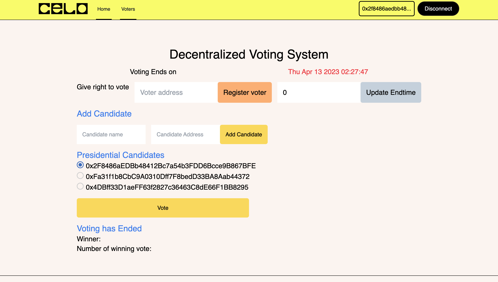
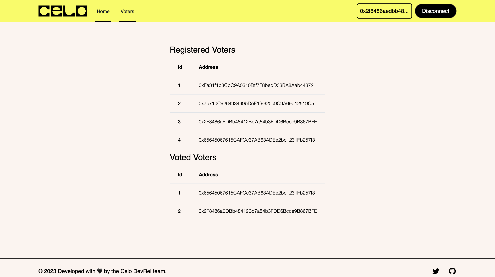

## Introduction​

Decentralized applications, commonly known as dapps, have been gaining momentum in the blockchain community due to their decentralized and transparent nature.

In this tutorial, we will explore how to build a full-stack voting dapp on Celo using Celo Composer and Hardhat. This tutorial is ideal for blockchain developers who have experience in Ethereum, Solidity, and JavaScript and are interested in building decentralized voting applications on Celo.

The goal of the Voting Dapp is to decentralize the traditional voting system to a more transparent system using the Celo Blockchain.

## Prerequisites​

To successfully follow along in this tutorial you need basic knowledge of:

- HTML, CSS, React and Next.js
- Blockchain, solidity and hardhat
- Celo Alfajores account

## Requirements​

To build this DApp we will need the following tools:

- [Vscode](https://code.visualstudio.com/) - But you can use any code editor of your choice
- [Hardhat](https://hardhat.org/) - used to deploy the smart contract
- [Alfajores Testnet Account](https://play.google.com/store/apps/details?id=org.celo.mobile.alfajores&hl=en&gl=US&pli=1) - required to connect to the dApp and make test transactions
- [Node](https://nodejs.org/en/)- an open-source, cross-platform JavaScript runtime environment
- [Celo Composer](https://github.com/celo-org/celo-composer)- starter project with all code needed to build, deploy, and upgrade a dapps on Celo.
- [Celo Wallet Extension](https://chrome.google.com/webstore/detail/celoextensionwallet/kkilomkmpmkbdnfelcpgckmpcaemjcdh?hl=en) / [Metamask](https://metamask.io/) - For interacting with the Celo blockchain

## Let’s Get Started

In this tutorial, we will create a smart contract that can be used to conduct an election. The contract will keep track of the candidates, voters, their votes, and their respective weights. This smart contract can be useful for small-scale elections or in situations where transparency and security are of utmost importance. The code is written in Solidity language and uses the OpenZeppelin Counter library.

The following features will be implemented:

- The Chairperson can register candidates and add eligible voters.
- Each registered voter has a weight of one.
- The Chairperson can start and stop the election.
- Each voter can cast only one vote to a single candidate.
- The votes are stored securely and cannot be modified.
- The Chairperson can view the results of the election.

We will also be building the frontend for the Dapp. To do this we will be using [Celo Composer](https://github.com/celo-org/celo-composer).

celo-composer is a starter project with all code needed to build, deploy, and upgrade a dapps on Celo. We will be building both the smart contract and frontend using Celo Composer.

### Step 1: Setup the Project

First, let's set up our project. Create a new directory and run the following commands and follow the steps

`npx @celo/celo-composer@latest create`

Select React, Tailwind css and React-Celo option and then enter your project name. For detail on the steps checkout the Celo Composer github readme page.

Once you have successfully completed the steps do `npm install` or `yarn` to install all required dependencies. Once that is done you are ready to start building.

Now open your newly created project. You will see a packages folder inside the package folder you will see hardhat and react-app folder.

For security reasons in order not to expose your private keys to the public create a new file named `.env` in the root of the hardhat folder add this line of code:

`PRIVATE KEY = <YOUR PRIVATE KEY>`

### Set up a Celo wallet

To get started with building our full-stack voting dapp on Celo, we need to set up a Celo wallet. You can use the Celo Wallet app, which is available on both iOS and Android devices, or you can use a browser extension such as Metamask or Celo Wallet Extension. Once you have set up your account visit Celo testnet [faucet](https://faucet.celo.org/) for test tokens. You will need to fund your account to deploy the contract and other smart contract interactions.

### Step 2: Write the Smart Contract

Now, let's write the smart contract. The smart contract is written using solidity. Create a new file named Election.sol in the contracts directory of the hardhat folder and add the following code:

```solidity
// SPDX-License-Identifier:GPL-3.0

pragma solidity >=0.7.0 < 0.9.0;

import "@openzeppelin/contracts/utils/Counters.sol";
import "hardhat/console.sol";

contract Election {
   using Counters for Counters.Counter;
   Counters.Counter public candidateId;
   Counters.Counter public votersId;

   // Candidate Data
   struct Candidate {
      uint256 canditateId;
      string name;
      address candidateAddress;
      uint256 voteCount;
   }
   event LogCandidate(
       uint256 canditateId,
       string name,
       address candidateAddress,
       uint256 voteCount
   );
   address[] public candidateAddresses;
   mapping(address => Candidate) public candidates;

   // Voters Data
   struct Voter {
       uint256 voterId;
       bool voted;
       uint256 weight;
       uint256 vote;
       address voterAddress;
       string voterName;
   }
   event LogVoter (
       bool voted,
       uint256 weight,
       uint256 vote,
       address voterAddress
   );

   address[] public votedVoters;
   address[] public votersAddresses;
   mapping(address => Voter) public voters;

   address public chairperson;
   uint256 private votingStartTime = block.timestamp;
   uint256 private votingEndTime;

   modifier onlyOwner {
       require(msg.sender == chairperson, "You are not the chairperson");
       _;
   }

   modifier votingStatus{
       require(block.timestamp >= votingStartTime, "Voting Ongoing");
       require(block.timestamp <= votingEndTime, "Voting has ended");
       _;
   }

   constructor() {
       chairperson =  msg.sender;
       votingEndTime = votingStartTime + 2 hours;
   }

   function addCandidate(string memory _name, address _candidateAddress) public  onlyOwner votingStatus {
       require(candidates[_candidateAddress].candidateAddress == address(0), "candidate already registered");
       require(_candidateAddress != chairperson, "Chairperson cannot be a candidate");

       candidateId.increment();
       uint256 id = candidateId.current();
       Candidate storage candidate = candidates[_candidateAddress];
       candidate.canditateId = id;
       candidate.candidateAddress = _candidateAddress;
       candidate.name = _name;
       candidate.voteCount = 0;
       candidateAddresses.push(_candidateAddress);
       emit LogCandidate(id, _name, _candidateAddress, 0);
   }

   function getCandidates() public view returns (address[] memory){
       return candidateAddresses;
   }

   function getCandidateLength() public view returns (uint256){
       return candidateAddresses.length;
   }

   function getCandidateData(address _candidateAddress) public view returns(uint256, string memory, address, uint256){
       return(
           candidates[_candidateAddress].canditateId,
           candidates[_candidateAddress].name,
           candidates[_candidateAddress].candidateAddress,
           candidates[_candidateAddress].voteCount
       );
   }

   function giveVoterRight(address _voterAddress) public onlyOwner votingStatus{
       votersId.increment();
       uint256 id = votersId.current();
       Voter storage voter = voters[_voterAddress];
       require(voter.weight == 0, "You have already registered");
       voter.voterId = id;
       voter.weight = 1;
       voter.voterAddress = _voterAddress;
       voter.voted = false;
       votersAddresses.push(_voterAddress);
   }

   function vote(address _candidateAddress, uint256 _candidate_id) public votingStatus {
       Voter storage voter = voters[msg.sender];
       require(!voter.voted, "You have already voted");
       require(voter.weight != 0,  "You don't have right to vote");
       require( _candidateAddress == candidates[_candidateAddress].candidateAddress,  "Candidate does not exist");

       voter.voted = true;
       voter.vote = _candidate_id;

       votedVoters.push(msg.sender);

       candidates[_candidateAddress].voteCount += voter.weight;
        emit LogVoter (true, voter.weight, _candidate_id, msg.sender);
   }

   function getVoterLength() public view returns (uint256) {
       return votersAddresses.length;
   }

   function getVoterData(address _voterAddress) public view returns (uint256,bool,uint256,uint256,address,string memory) {
       return(
           voters[_voterAddress].voterId,
           voters[_voterAddress].voted,
           voters[_voterAddress].weight,
           voters[_voterAddress].vote,
           voters[_voterAddress].voterAddress,
           voters[_voterAddress].voterName
       );
   }

   function getVotedVoters() public view returns (address [] memory) {
       return votedVoters;
   }

   function getVoterList() public view returns (address [] memory) {
       return votersAddresses;
   }

    /**
    * @dev Gives ending epoch time of voting
    * @return _endTime When the voting ends
    */
   function getVotingEndTime() public view returns (uint256 _endTime) {
       return votingEndTime;
   }

   /**
    * @dev used to update the voting start & end times
    * @param _startime Start time that needs to be updated
    */
   function updateVotingStartTime(uint256 _startime)
       public
       onlyOwner
   {
       require(votingStartTime >= _startime);
       votingStartTime += _startime;
   }

   /**
    * @dev To extend the end of the voting
    * @param _endTime End time that needs to be updated
    */
   function extendVotingEndTime(uint256 _endTime)
       public
       onlyOwner
   {
       // require(block.timestamp >= votingEndTime, "voting has not ended");
       votingEndTime += _endTime;
   }

   // Get winner address and voterCount
   function getWinner() public onlyOwner view returns (address _winningCandidate, uint256 _voteCount ) {
       require(votingEndTime < block.timestamp, "Please wait for voting to end to see the result");
       uint voteCount = 0;
       address winnerAddress;
       for(uint256 i=0; i<candidateAddresses.length; i++) {
           if(candidates[candidateAddresses[i]].voteCount > voteCount) {
               voteCount = candidates[candidateAddresses[i]].voteCount;
               winnerAddress = candidateAddresses[i];
           }
       }
       return (winnerAddress, voteCount);
   }

}
```

Here is a detailed breakdown of what the above smart contract code does;

The first line indicates the license under which the code is distributed.
`// SPDX-License-Identifier: GPL-3.0`

The next line specifies the version of Solidity being used.
`pragma solidity >=0.7.0 <0.9.0;`

The `Counters` library from OpenZeppelin is imported to enable us to generate unique patient IDs.

`import "@openzeppelin/contracts/utils/Counters.sol";`

The `Election` contract is defined, which will record all votes and declare the winner.
`contract Election {}`

The `Counters` library is used to create a counter to generate unique patient IDs.

We have defined the Election contract and set the using Counters for Counters.Counter to keep track of the candidate and voter IDs.

```solidity
using Counters for Counters.Counter;
Counters.Counter public candidateId;
Counters.Counter public votersId;
```

The candidate and voter data will be stored in a struct. We have defined the Candidate and Voter

```solidity
// Candidate Data
    struct Candidate {
       uint256 canditateId;
       string name;
       address candidateAddress;
       uint256 voteCount;
    }
```

```solidity
// Voters Data
    struct Voter {
        uint256 voterId;
        bool voted;
        uint256 weight;
        uint256 vote;
        address voterAddress;
        string voterName;
    }
```

The Election contract contains the following functions:

**onlyOwner**
This modifier function requires the function caller to be the chairperson of the contract, otherwise the function will revert with an error message.

```solidity
 modifier onlyOwner {
       require(msg.sender == chairperson, "You are not the chairperson");
       _;
   }
```

**votingStatus**
This modifier function checks whether the current time is within the voting period, between votingStartTime and votingEndTime. If the current time is not within this period, the function will revert with an error message.

```solidity
modifier votingStatus{
       require(block.timestamp >= votingStartTime, "Voting Ongoing");
       require(block.timestamp <= votingEndTime, "Voting has ended");
       _;
   }
```

**constructor()**
The constructor function initializes the chairperson variable to the address of the account that deployed the contract and sets the votingEndTime variable to two hours after the votingStartTime variable, which is set to the current block timestamp.

```solidity
 constructor() {
       chairperson =  msg.sender;
       votingEndTime = votingStartTime + 2 hours;
   }
```

**LogCandidate**
This event is emitted whenever a new candidate is added to the candidates mapping. It includes the candidate's ID, name, address, and vote count.

```solidity
 event LogCandidate(
       uint256 canditateId,
       string name,
       address candidateAddress,
       uint256 voteCount
   );
```

**LogVoter**
This event is emitted whenever a voter casts their vote. It includes the boolean value voted indicating whether the voter has already voted, the voter's weight, their vote choice, and their address.

```solidity
   event LogVoter (
       bool voted,
       uint256 weight,
       uint256 vote,
       address voterAddress
   );
```

**addCandidate**
This function adds a new candidate to the candidates mapping. It takes a name parameter as input, and creates a new Candidate struct with the candidate's ID, name, address, and initial vote count set to zero. The function emits a LogCandidate event with the new candidate's information.

```solidity
function addCandidate(string memory _name, address _candidateAddress) public  onlyOwner votingStatus {
       require(candidates[_candidateAddress].candidateAddress == address(0), "candidate already registered");
       require(_candidateAddress != chairperson, "Chairperson cannot be a candidate");

       candidateId.increment();
       uint256 id = candidateId.current();
       Candidate storage candidate = candidates[_candidateAddress];
       candidate.canditateId = id;
       candidate.candidateAddress = _candidateAddress;
       candidate.name = _name;
       candidate.voteCount = 0;
       candidateAddresses.push(_candidateAddress);
       emit LogCandidate(id, _name, _candidateAddress, 0);
   }

```

**vote**
This function allows a voter to cast their vote for a candidate. It takes a candidateAddress parameter as input, which is the address of the candidate the voter is voting for. The function checks that the voter has not already voted, that the current time is within the voting period, and that the specified candidate exists. If these conditions are met, the function increases the candidate's vote count by the voter's weight (which is 1 by default), sets the voter's voted flag to true, and emits a LogVoter event with the voter's information.

```solidity
   function vote(address _candidateAddress, uint256 _candidate_id) public votingStatus {
       Voter storage voter = voters[msg.sender];
       require(!voter.voted, "You have already voted");
       require(voter.weight != 0,  "You don't have right to vote");
       require( _candidateAddress == candidates[_candidateAddress].candidateAddress,  "Candidate does not exist");

       voter.voted = true;
       voter.vote = _candidate_id;

       votedVoters.push(msg.sender);

       candidates[_candidateAddress].voteCount += voter.weight;
        emit LogVoter (true, voter.weight, _candidate_id, msg.sender);
   }

```

**getWinner**
This function returns the address and vote count of the candidate with the most votes.

```solidity
   // Get winner address and voterCount
   function getWinner() public onlyOwner view returns (address _winningCandidate, uint256 _voteCount ) {
       require(votingEndTime < block.timestamp, "Please wait for voting to end to see the result");
       uint voteCount = 0;
       address winnerAddress;
       for(uint256 i=0; i<candidateAddresses.length; i++) {
           if(candidates[candidateAddresses[i]].voteCount > voteCount) {
               voteCount = candidates[candidateAddresses[i]].voteCount;
               winnerAddress = candidateAddresses[i];
           }
       }
       return (winnerAddress, voteCount);
   }

}
```

**getVoterList**
This function returns an array of registered voters.

```solidity
function getVoterList() public view returns (address [] memory) {
       return votersAddresses;
   }

**getVoterLength**
This function returns the number of registered voters
```

```solidity
 function getVoterLength() public view returns (uint256) {
       return votersAddresses.length;
   }

```

**getCandidateLength**
This function returns the number of candidates who have registered.

```solidity
function getCandidateLength() public view returns (uint256){
       return candidateAddresses.length;
   }
```

**getVoterData**
A function that returns the details of a specific voter, given their address.

```solidity
   function getVoterData(address _voterAddress) public view returns (uint256,bool,uint256,uint256,address,string memory) {
       return(
           voters[_voterAddress].voterId,
           voters[_voterAddress].voted,
           voters[_voterAddress].weight,
           voters[_voterAddress].vote,
           voters[_voterAddress].voterAddress,
           voters[_voterAddress].voterName
       );
   }
```

**getCandidateData**
A function that returns the details of a specific candidate, given their address.

```solidity
   function getCandidateData(address _candidateAddress) public view returns(uint256, string memory, address, uint256){
       return(
           candidates[_candidateAddress].canditateId,
           candidates[_candidateAddress].name,
           candidates[_candidateAddress].candidateAddress,
           candidates[_candidateAddress].voteCount
       );
   }

```

**getCandidates**
This function returns an array of addresses of all registered candidates.

```solidity
function getCandidates() public view returns (address[] memory){
       return candidateAddresses;
   }
```

**giveVoterRight**
This function registers a voter which gives them the right to a single vote weight.

```solidity
function giveVoterRight(address _voterAddress) public onlyOwner votingStatus{
       votersId.increment();
       uint256 id = votersId.current();
       Voter storage voter = voters[_voterAddress];
       require(voter.weight == 0, "You have already registered");
       voter.voterId = id;
       voter.weight = 1;
       voter.voterAddress = _voterAddress;
       voter.voted = false;
       votersAddresses.push(_voterAddress);
   }
```

**getVotedVoters**
This function returns the list of registered voters that have cast their vote.

```solidity
function getVotedVoters() public view returns (address [] memory) {
       return votedVoters;
   }
```

**getVotingEndTime**
This function function returns the voting end time.

```solidity
function getVotingEndTime() public view returns (uint256 _endTime) {
       return votingEndTime;
   }
```

**updateVotingStartTime**
This function takes in an argument that allows the owner to update the voting start time.

```solidity
function updateVotingStartTime(uint256 _startime)
       public
       onlyOwner
   {
       require(votingStartTime >= _startime);
       votingStartTime += _startime;
   }
```

**extendVotingEndTime**
This function enables the chairperson to extend the voting period. By setting the votingEndTime to a new value.

```solidity
   function extendVotingEndTime(uint256 _endTime)
       public
       onlyOwner
   {
       // require(block.timestamp >= votingEndTime, "voting has not ended");
       votingEndTime += _endTime;
   }
```

### Step 3: Deploy the Contract

Inside the hardhat directory navigate to the `scripts/deploy.tsx` and replace the code with this 👇

```js
// We require the Hardhat Runtime Environment explicitly here. This is optional
// but useful for running the script in a standalone fashion through `node <script>`.
//
// When running the script with `npx hardhat run <script>` you'll find the Hardhat
// Runtime Environment's members available in the global scope.
const hre = require("hardhat");

async function main() {
  // Hardhat always runs the compile task when running scripts with its command
  // line interface.
  //
  // If this script is run directly using `node` you may want to call compile
  // manually to make sure everything is compiled
  // await hre.run('compile');

  // We get the contract to deploy
  const Election = await hre.ethers.getContractFactory("Election");
  const election = await Election.deploy();

  // await coffee.deployed();

  // console.log("Coffee deployed to:", coffee.address);

  const contractAddress = await (await election.deployed()).address;
  console.log(`Contract was deployed to ${contractAddress}`);
}

// We recommend this pattern to be able to use async/await everywhere
// and properly handle errors.
main()
  .then(() => process.exit(0))
  .catch((error) => {
    console.error(error);
    process.exit(1);
  });
```

To deploy the contract still on the hardhat directory enter the below command;
`npx hardhat run scripts/deploy.ts –network alfajores`

Once successfully deployed it will return the contract address and a generated ABI code, which we will use later to interact with the contract on the frontend.

You will see the generated json ABI code in the `artifacts/contracts/` directory.

## Step 4: Frontend interaction

To interact with the frontend navigate to the `react-app` directory and run this command to start the development server
`npm run dev` will start the localhost server at port 3000.

Celo composer has done the work of setting up a next.js app for us. Currently the next.js app comes with three components: the header, footer and layout and also connection to Celo wallet has also been done. All you need to do is to go to the \_app.tsx file and make modifications to the CeloProvider based on what you need. In this tutorial we will be using it as it is. We are going to make a little modification to the header.tsx file so that we can display the wallet address of the connected user. Your header.tsx file should look like this. 👇

```js
import { Disclosure } from "@headlessui/react";
import { Bars3Icon, XMarkIcon } from "@heroicons/react/24/outline";
import {
   useCelo,
 } from '@celo/react-celo';
import Image from "next/image";
import { useEffect, useState } from "react";
import Link from 'next/link'

export default function Header() {
 const [data, setData] = useState<any>({})

   let [componentInitialized, setComponentInitialized] = useState(false);
   let {
       initialised,
       address,
       kit,
       connect,
       disconnect
   } = useCelo();

   useEffect(() => {
     if (initialised) {
       setComponentInitialized(true);
     }
   }, [initialised, kit]);

   return (
     <Disclosure as="nav" className="bg-prosperity border-b border-black">
       {({ open }) => (
         <>
           <div className="mx-auto max-w-7xl px-2 sm:px-6 lg:px-8">
             <div className="relative flex h-16 justify-between">
               <div className="absolute inset-y-0 left-0 flex items-center sm:hidden">
                 {/* Mobile menu button */}
                 <Disclosure.Button className="inline-flex items-center justify-center rounded-md p-2 text-black focus:outline-none focus:ring-1 focus:ring-inset focus:rounded-none focus:ring-black">
                   <span className="sr-only">Open main menu</span>
                   {open ? (
                     <XMarkIcon className="block h-6 w-6" aria-hidden="true" />
                   ) : (
                     <Bars3Icon className="block h-6 w-6" aria-hidden="true" />
                   )}
                 </Disclosure.Button>
               </div>
               <div className="flex flex-1 items-center justify-center sm:items-stretch sm:justify-start">
                 <div className="flex flex-shrink-0 items-center">
                   <Image className="block h-8 w-auto lg:block" src="/logo.svg" width="24" height="24" alt="Celo Logo" />
                 </div>
                 <div className="hidden sm:ml-6 sm:flex sm:space-x-8">
                   <Link href="/"
                     className="inline-flex items-center border-b-2 border-black px-1 pt-1 text-sm font-medium text-gray-900"
                   >
                     Home
                   </Link>
                 </div>
                  <div className="hidden sm:ml-6 sm:flex sm:space-x-8">
                   <Link href="/voters"
                     className="inline-flex items-center border-b-2 border-black px-1 pt-1 text-sm font-medium text-gray-900"
                   >
                     Voters
                   </Link>
                 </div>
               </div>
               <div className="absolute inset-y-0 right-0 flex items-center pr-2 sm:static sm:inset-auto sm:ml-6 sm:pr-0">
                 {componentInitialized && address ? (
                   <div>
                     <button className="border-2 border-black rounded-md mr-2 p-2">{`${address.substring(0,15)}...`}</button>
                      <button
                     type="button"
                     className="inline-flex content-center place-items-center rounded-full border border-wood bg-black py-2 px-5 text-md font-medium text-snow hover:bg-forest"
                     onClick={disconnect}
                   >Disconnect</button>
                   </div>
                 ) : (
                   <button
                     type="button"
                     className="inline-flex content-center place-items-center rounded-full border border-wood bg-forest py-2 px-5 text-md font-medium text-snow hover:bg-black"
                     onClick={() =>
                       connect().catch((e) => console.log((e as Error).message))
                     }
                   >Connect</button>
                 )}
               </div>
             </div>
           </div>
            <Disclosure.Panel className="sm:hidden">
             <div className="space-y-1 pt-2 pb-4">
               <Disclosure.Button
                 as="a"
                 href="#"
                 className="block border-l-4 border-black py-2 pl-3 pr-4 text-base font-medium text-black"
               >
                 Home
               </Disclosure.Button>
               {/* Add here your custom menu elements */}
             </div>
           </Disclosure.Panel>
         </>
       )}
     </Disclosure>
   )
 }

```

Inside the react-app directory, create an `interact.tsx` file and copy the below code. This code handles all calls to the contract. Each of these contract calls will be used in our component where appropriate. Your `interact.tsx` file should look like this. 👇

**interact.tsx**

```js
import contractABI from "./Election.json";

const contractAddress = "Your contract address here";

export function initContract(kit: any) {
  return new kit.connection.web3.eth.Contract(contractABI.abi, contractAddress);
}

export const addCandidate = async (
  address: string | null | undefined,
  kit: any,
  name: string,
  candidateAddress: string
) => {
  try {
    const txHash = await initContract(kit)
      .methods.addCandidate(name, candidateAddress)
      .send({
        from: address,
      });
    console.log(txHash);
  } catch (e) {
    console.log(e);
  }
};

export const getCandidates = async (kit: any) => {
  try {
    const candidates = await initContract(kit).methods.getCandidates().call();
    console.log(candidates);
    return candidates;
  } catch (e) {
    console.log(e);
  }
};

export const getCandidateLength = async (kit: any) => {
  try {
    const candidates = await initContract(kit)
      .methods.getCandidateLength()
      .call();
    console.log(candidates);
    return candidates;
  } catch (e) {
    console.log(e);
  }
};

export const getCandidateData = async (kit: any, candidateAddress: string) => {
  try {
    const candidate = await initContract(kit)
      .methods.getCandidateLength(candidateAddress)
      .call();
    console.log(candidate);
    return candidate;
  } catch (e) {
    console.log(e);
  }
};

export const giveVoterRight = async (
  address: string | null | undefined,
  votersAddress: string | null | undefined,
  kit: any
) => {
  try {
    const txHash = await initContract(kit)
      .methods.giveVoterRight(votersAddress)
      .send({
        from: address,
      });
    console.log(txHash);
  } catch (e) {
    console.log(e);
  }
};

export const vote = async (
  address: string | null | undefined,
  candidateAddress: string | null | undefined,
  candidateId: number,
  kit: any
) => {
  try {
    const txHash = await initContract(kit)
      .methods.vote(candidateAddress, candidateId)
      .send({
        from: address,
      });
    console.log(txHash);
  } catch (e) {
    console.log(e);
  }
};

export const getVotersLength = async (kit: any, candidateAddress: string) => {
  try {
    const voters = await initContract(kit)
      .methods.getVoterLength(candidateAddress)
      .call();
    console.log(voters);
    return voters;
  } catch (e) {
    console.log(e);
  }
};

export const getVoterData = async (kit: any, voterAddress: string) => {
  try {
    const voter = await initContract(kit)
      .methods.getVoterData(voterAddress)
      .call();
    console.log(voter);
    return voter;
  } catch (e) {
    console.log(e);
  }
};

export const getVotedVoters = async (kit: any) => {
  try {
    const votedVoters = await initContract(kit).methods.getVotedVoters().call();
    console.log(votedVoters);
    return votedVoters;
  } catch (e) {
    console.log(e);
  }
};

export const getVoterList = async (kit: any) => {
  try {
    const voterList = await initContract(kit).methods.getVoterList().call();
    console.log(voterList);
    return voterList;
  } catch (e) {
    console.log(e);
  }
};

export const getVotingEndTime = async (kit: any) => {
  try {
    const endtime = await initContract(kit).methods.getVotingEndTime().call();
    console.log(endtime);
    return endtime;
  } catch (e) {
    console.log(e);
  }
};

export const updateStartTime = async (
  address: string | null | undefined,
  startTime: number,
  kit: any
) => {
  try {
    const txHash = await donationContract(kit)
      .methods.updateVotingStartTime(startTime)
      .send({
        from: address,
      });
    console.log(txHash);
  } catch (e) {
    console.log(e);
  }
};

export const updateEndTime = async (
  address: string | null | undefined,
  endTime: string,
  kit: any
) => {
  try {
    const txHash = await initContract(kit)
      .methods.extendVotingEndTime(endTime)
      .send({
        from: address,
      });
    console.log(txHash);
  } catch (e) {
    console.log(e);
  }
};

export const getWinner = async (kit: any) => {
  try {
    const winner = await initContract(kit).methods.getWinner().call();
    console.log(winner);
    return winner;
  } catch (e) {
    console.log(e);
  }
};
```

The `import contractABI from "./Election.json”` This imports the ABI generated when we deployed the contract. Copy the generated JSON and create a Election.json file in the root of your react-ap directory.

```js
export function initContract(kit: any) {
  return new kit.connection.web3.eth.Contract(contractABI.abi, contractAddress);
}
```

This creates an instance of the contract. Which we will use to make calls to the functions in the contract.

**TableList.tsx**
This displays the list of registered voters and those that have voted.

The UI should look like this 👇
**Fig 4-1** List Component



```js
import React from 'react'

interface Iparam{
 id: number
 voterAddress: string
}

export default function TableList(param: Iparam) : JSX.Element {
 return (
   <div>
     <div className="flex flex-col">
       <div className="overflow-x-auto sm:-mx-6 lg:-mx-8">
         <div className="inline-block min-w-full py-2 sm:px-6 lg:px-8">
           <div className="overflow-hidden">
             <table className="min-w-full text-left text-sm font-light">
               <thead className="border-b font-medium dark:border-neutral-500">
                 <tr>
                   <th scope="col" className="px-6 py-4">Id</th>
                   <th scope="col" className="px-6 py-4">Address</th>
                 </tr>
               </thead>
               <tbody>
                 <tr className="border-b dark:border-neutral-500">
                   <td className="whitespace-nowrap px-6 py-4 font-medium">{param.id}</td>
                   <td className="whitespace-nowrap px-6 py-4">{param.voterAddress}</td>
                 </tr>
               </tbody>
             </table>
           </div>
         </div>
       </div>
     </div>
   </div>
 )
}

```

**index.tsx**

```js
import React, { useState, useEffect, useRef  } from 'react'
import {
 addCandidate, getCandidates, vote, giveVoterRight, getVotingEndTime,
 updateEndTime, getWinner
} from '@/interact'
import { useCelo } from '@celo/react-celo';
import CandidateList from '@/components/CandidateList';


export default function Home() {
 const [candidates, setCandidates] = useState<any[]>([])
 const [endtime, setEndtime] = useState<number>(0)
 const [ended, setEnded] = useState<boolean>(false)
 const [winner, setWinner] = useState<string>('')
 const [update, setUpdate] = useState<string>('0')
 const [candidateName, setCandidateName] = useState<string>('')
 const [candidateAddress, setCandidateAddress] = useState<string>('')
 const [voterAddress, setVoterAddress] = useState<string>('')
 const [candidateId, setCandidateId] = useState<number>(0)
 const [candidateAd, setCandidateAd] = useState<string>('')

 const { kit, address } = useCelo()

 const handleCandidateName = (e: React.FormEvent<HTMLInputElement>) => {
   setCandidateName(e.currentTarget.value)
   console.log(e.currentTarget.value)
 }

  const handleCandidateAddress = (e: React.FormEvent<HTMLInputElement>) => {
   setCandidateAddress(e.currentTarget.value)
   console.log(e.currentTarget.value)
  }
    const handleVoterAddress = (e: React.FormEvent<HTMLInputElement>) => {
   setVoterAddress(e.currentTarget.value)
   console.log(e.currentTarget.value)
 }
  const handleUpdateEndtime = (e: React.FormEvent<HTMLInputElement>) => {
   setUpdate(e.currentTarget.value)
   console.log(e.currentTarget.value)
 }

 const handleEndtimeUpdate = async () => {
   await updateEndTime(address, update, kit)
   setUpdate("")
   window.location.reload()
 }

 const handleEndtime = async () => {
   const end = await getVotingEndTime(kit)
   setEndtime(end)
 }
  const handleWinner = async () => {
   const win = await getWinner(kit)
   setWinner(win)
 }

  const handleCandidates = async () => {
   const candidates = await getCandidates(kit)
   setCandidates(candidates)
 }

 let d = new Date();
 const formatDate = new Date(endtime as number * 1000 + d.getTimezoneOffset() * 60000)
 console.log(formatDate)
 console.log(d.getTime())


  const handleCandidate = (id: number, addr: string) => {
   setCandidateId(id)
    setCandidateAd(addr)
   console.log(id)
   console.log(addr)
   }
 useEffect(() => {
   if (formatDate.getTime() > d.getTime()) {
     console.log("Bidding ongoing")
     setEnded(false)
   } else {
     console.log("bidding ended")
     setEnded(true)
   }
   handleCandidates()
   handleEndtime()
   handleWinner()
 }, [kit])
 console.log(!ended)
 console.log(winner)
 return (
   <div>
   {!address ? <div>Please connect your wallet</div> :
       <div>
     <h1 className='text-4xl text-center m-4'>Decentralized Voting System</h1>
     {ended ? <div>
      <h1>Voting has ended. Click on the Update End time button to extend the Voting period.</h1>
       <input className='p-4 ml-4' type="number" placeholder='Update End Time' value={update} onChange={handleUpdateEndtime} />
       <button className="bg-slate-300 rounded-md p-4 mt-4" onClick={() => handleEndtimeUpdate()}>Update Endtime</button>
     </div> :
       <div>
         <div>
           <div className=' flex text-xl justify-around'>
             <h1 className='mr-4'>{`Voting Ends on `}</h1>
             <h1 className='text-red-500'>{`${formatDate.toString().slice(0, 24)}`}</h1>
           </div>
           <div className=' flex text-xl justify-between'>
             <h1 className='tex-4xl mt-4'>Give right to vote</h1>
             <div>
               <input className='p-4 ml-4' type="text" placeholder='Voter address' value={voterAddress} onChange={handleVoterAddress} />
               <button className="bg-orange-300 rounded-md p-4 mt-4" onClick={() => giveVoterRight(address, voterAddress, kit)}>Register voter</button>
             </div>
             <div>
               <input className='p-4 ml-4' type="number" placeholder='Update End Time' value={update} onChange={handleUpdateEndtime} />
               <button className="bg-slate-300 rounded-md p-4 mt-4" onClick={() => handleEndtimeUpdate()}>Update Endtime</button>
           </div>
           </div>
           <h1 className='text-2xl text-blue-500 mt-4'>Add Candidate</h1>
           <input className='p-4' type="text" placeholder='Candidate name' value={candidateName} onChange={handleCandidateName} />
           <input className='p-4 ml-4' type="text" placeholder='Candidate Address' value={candidateAddress} onChange={handleCandidateAddress} />
           <button className="bg-yellow-300 rounded-md p-4 mt-4" onClick={() => addCandidate(address, kit, candidateName, candidateAddress)}>Add Candidate</button>
         </div>

           <div className='mt-4'>
             <h1 className='text-2xl mt-4 text-blue-500'>Presidential Candidates</h1>
               {!candidates ? <div></div> : candidates.map((item, index) =>  <CandidateList action={() => handleCandidate(index + 1, item)} key={index} candidateAddress={item} id={index + 1} /> )}
               <button className="bg-yellow-300 rounded-md p-4 mt-4 w-2/4" onClick={() => vote(address, candidateAd, candidateId, kit)}>Vote</button>
           </div>

           <div className=" text-xl mt-4">
             <h1 className='text-2xl text-blue-500 mt-4'>Voting has Ended</h1>
             <h1>{`Winner: ${!winner ? '' :winner[0]}`}</h1>
             <h1>{`Number of winning vote: ${!winner ? '' : winner[1] }`}</h1>
         </div>
       </div>}
   </div>
   }
   </div>
 )
}

```

The above code gives us this UI. This displays input field to register voters, update input to extend the voting time,
Input field to give voters right to vote, it also displays the list of registered candidates and the winner when the vote has ended.

**CandidateList.tsx**
This component is used for displaying the candidate on the index or home page.

```js
import React from 'react'

interface Candidate {
 action: () => void
 id: number
 candidateAddress: string
}
export default function CandidateList(param: Candidate): JSX.Element{

 return (
   <div className="flex text-xl">
     <div>
       <div className="mb-[0.125rem] block min-h-[1.5rem] pl-[1.5rem]">
         <input
           className="relative float-left mt-0.5 mr-1 -ml-[1.5rem] h-5 w-5 appearance-none rounded-full border-2 border-solid border-neutral-300 before:pointer-events-none before:absolute before:h-4 before:w-4 before:scale-0 before:rounded-full before:bg-transparent before:opacity-0 before:shadow-[0px_0px_0px_13px_transparent] before:content-[''] after:absolute after:z-[1] after:block after:h-4 after:w-4 after:rounded-full after:content-[''] checked:border-primary checked:before:opacity-[0.16] checked:after:absolute checked:after:left-1/2 checked:after:top-1/2 checked:after:h-[0.625rem] checked:after:w-[0.625rem] checked:after:rounded-full checked:after:border-primary checked:after:bg-primary checked:after:content-[''] checked:after:[transform:translate(-50%,-50%)] hover:cursor-pointer hover:before:opacity-[0.04] hover:before:shadow-[0px_0px_0px_13px_rgba(0,0,0,0.6)] focus:shadow-none focus:transition-[border-color_0.2s] focus:before:scale-100 focus:before:opacity-[0.12] focus:before:shadow-[0px_0px_0px_13px_rgba(0,0,0,0.6)] focus:before:transition-[box-shadow_0.2s,transform_0.2s] checked:focus:border-primary checked:focus:before:scale-100 checked:focus:before:shadow-[0px_0px_0px_13px_#3b71ca] checked:focus:before:transition-[box-shadow_0.2s,transform_0.2s] dark:border-neutral-600 dark:checked:border-primary dark:checked:after:border-primary dark:checked:after:bg-primary dark:checked:focus:border-primary"
           type="radio"
           name="flexRadioDefault"
           onChange={param.action}
         />
         <label
           className="mt-px inline-block pl-[0.15rem] hover:cursor-pointer"
           htmlFor="radioDefault01">
           {param.candidateAddress}
         </label>
       </div>
     </div>
   </div>
 )
}
```

**Voters.tsx**
This Page displays the list of voters both registered and those that have voted.



Here is the code 👇

```js
import React, {useState, useEffect} from 'react'
import { useCelo } from '@celo/react-celo';
import { getVotedVoters, getVoterList } from '@/interact'

export default function Voters(): JSX.Element {
 const { kit, address } = useCelo()
 const [voters, setVoters] = useState<any[]>([])
 const [votedVoters, setVotedVoters] = useState<any[]>([])

 const getVoters = async () => {
   const voterList = await getVoterList(kit)
   setVoters(voterList)
 }
 const handleVotedVoters = async () => {
   const votedList = await getVotedVoters(kit)
   setVotedVoters(votedList)
 }

 useEffect(() => {
   getVoters()
   handleVotedVoters()
 })

 return (
   <div className='flex flex-col'>
     <div>
       <h1 className='text-2xl'>Registered Voters</h1>
       <div className="flex flex-col">
         <div className="overflow-x-auto sm:-mx-6 lg:-mx-8">
           <div className="inline-block min-w-full py-2 sm:px-6 lg:px-8">
             <div className="overflow-hidden">
               <table className="min-w-full text-left text-sm font-light">
                 <thead className="border-b font-medium dark:border-neutral-500">
                   <tr>
                     <th scope="col" className="px-6 py-4">Id</th>
                     <th scope="col" className="px-6 py-4">Address</th>
                   </tr>
                 </thead>
                   <tbody>
                     {!voters ? <div>No registered voters</div> : voters.map((item, index) => <tr key={index} className="border-b dark:border-neutral-500">
                       <td className="whitespace-nowrap px-6 py-4 font-medium">{index + 1}</td>
                     <td className="whitespace-nowrap px-6 py-4">{item}</td>
                   </tr>
                   )}
                 </tbody>
               </table>
             </div>
           </div>
       </div>
     </div>
     </div>
     <div>
       <h1 className='text-2xl'>Voted Voters</h1>
       <div className="flex flex-col">
         <div className="overflow-x-auto sm:-mx-6 lg:-mx-8">
           <div className="inline-block min-w-full py-2 sm:px-6 lg:px-8">
             <div className="overflow-hidden">
               <table className="min-w-full text-left text-sm font-light">
                 <thead className="border-b font-medium dark:border-neutral-500">
                   <tr>
                     <th scope="col" className="px-6 py-4">Id</th>
                     <th scope="col" className="px-6 py-4">Address</th>
                   </tr>
                 </thead>
                   <tbody>
                     {!votedVoters ? <div>Please go and vote</div> :votedVoters.map((item, index) => <tr key={index} className="border-b dark:border-neutral-500">
                       <td className="whitespace-nowrap px-6 py-4 font-medium">{index + 1}</td>
                     <td className="whitespace-nowrap px-6 py-4">{item}</td>
                   </tr>
                   )}
                 </tbody>
               </table>
             </div>
           </div>
           </div>
       </div>
     </div>
   </div>
 )
}
```

## Conclusion​

Congratulations 🎉 on finishing this tutorial! Thank you for taking the time to complete it. In this tutorial, you have learned how to create a full stack Voting dApp using Celo Composer and Solidity.

To have access to the full codebase, here is the link to the project repo on [github](https://github.com/gconnect/Celo-VotingDapp).

## About the Author​

Glory Agatevure is a blockchain engineer, technical writer, and co-founder of Africinnovate. You can connect with me on [Linkedin](https://www.linkedin.com/in/glory-agatevure-47a222ab/), [Twitter](https://twitter.com/agatevureglory) and [Github](https://github.com/gconnect/).

## References​

- https://github.com/celo-org/celo-composer
