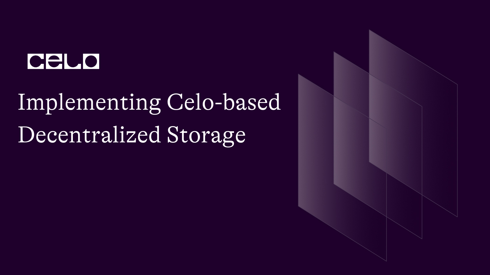

## Introduction

Decentralized storage is a crucial component of the modern Web3 ecosystem.
In today's world, data storage plays a critical role in our lives, as we increasingly rely on digital data. Traditional centralized data storage solutions are vulnerable to various issues such as censorship, data breaches, and central points of failure. Decentralized storage solutions like IPFS (InterPlanetary File System) have emerged as an alternative to overcome these issues. IPFS is a peer-to-peer protocol designed to make the web faster, safer, and more open. It allows for secure, censorship-resistant data storage by distributing the data across multiple nodes in the network.
Celo is a mobile-first blockchain platform with a mission to increase financial inclusion and provide access to financial services for everyone. In this tutorial, we will explore how to integrate IPFS with the Celo blockchain to implement a decentralized storage solution. By combining Celo's smart contract capabilities with IPFS, we can create a secure, scalable, and censorship-resistant file storage application.
We will guide you through the process of implementing a Celo-based decentralized storage solution using Solidity, JavaScript, React, Celo SDK, and IPFS. You will learn how to create a smart contract to manage file metadata and access control, build a frontend to interact with the smart contract and IPFS, and store files securely and efficiently.

## Prerequisites

Before proceeding, ensure that you are familiar with the following concepts:

- Basic understanding of Celo blockchain and smart contracts
- Solidity programming language
- JavaScript and React web development
- IPFS and decentralized storage

## Requirements

Before starting, make sure you have the following tools available:

- [Node.js 12.0.1+](https://nodejs.org/)
- [Celo CLI](https://docs.celo.org/getting-started/overview)
- [Metamask extension](https://metamask.io/)
- A Celo Faucet Account
  To get a Celo test account, you can follow these steps:
  1. Visit the Celo Faucet [here](https://celo.org/developers/faucet)
  2. Click on "Connect Celo Extension Wallet" and follow the prompts to connect your Celo Extension Wallet.
  3. After connecting your wallet, you will see your account address.
  4. Click "Request Funds" to receive test tokens (cGLD and cUSD) on the Alfajores testnet. The faucet will send test tokens to your account.
  5. Make sure your Celo Extension Wallet is set to the Alfajores Testnet.

Now you can use this test account in the tutorial. Ensure that you're interacting with the Alfajores Testnet when working on your project.

### Setting up the Project

1. Create a new directory for the project and navigate to it in your terminal:

   ```bash
    mkdir celo-decentralized-storage
    cd celo-decentralized-storage
   ```

2. Initialize a new Node.js project:

```bash
npm init-y
```

3. Install dependencies

```bash
npm install --save @truffle/hdwallet-provider @celo/contractkit dotenv
```

4. Initialize a new Truffle project:

   ```bash
   truffle init
   ```

### Creating the Smart Contract

1. Create a new directory called `contracts` in the project root and create a new file called `FileStorage.sol` inside it:


    ```bash
    mkdir contracts
    touch contracts/FileStorage.sol
    ```

The complete smart contract for the Celo-based decentralized storage application should include the following functionalities:

1. Store file metadata with an IPFS hash, owner's address, and access control settings.
2. Add a function to upload a new file and store the metadata.
3. Add a function to retrieve file metadata.
4. Implement access control by allowing the file owner to grant or revoke access to specific addresses.
5. Emit events to notify the frontend when a file is added or access permissions change.

Add the following code to `FileStorage.sol`:

```solidity
// SPDX-License-Identifier: MIT
pragma solidity ^0.8.0;

contract FileStorage {
    struct File {
        string ipfsHash;
        address owner;
        bool isPublic;
        mapping(address => bool) authorizedUsers;
    }

    mapping(bytes32 => File) private files;

    event FileAdded(bytes32 indexed fileId, string ipfsHash, address indexed owner, bool isPublic);
    event FileAccessGranted(bytes32 indexed fileId, address indexed user);
    event FileAccessRevoked(bytes32 indexed fileId, address indexed user);

    function addFile(string memory ipfsHash, bool isPublic) public {
        bytes32 fileId = keccak256(abi.encodePacked(ipfsHash));
        require(files[fileId].owner == address(0), "File already exists");

        files[fileId].ipfsHash = ipfsHash;
        files[fileId].owner = msg.sender;
        files[fileId].isPublic = isPublic;

        emit FileAdded(fileId, ipfsHash, msg.sender, isPublic);
    }

    function getFile(string memory ipfsHash) public view returns (string memory, bool) {
        bytes32 fileId = keccak256(abi.encodePacked(ipfsHash));
        File storage file = files[fileId];
        require(file.owner != address(0), "File does not exist");
        require(file.isPublic || file.owner == msg.sender || file.authorizedUsers[msg.sender], "Access denied");

        return (file.ipfsHash, file.isPublic);
    }

    function grantAccess(string memory ipfsHash, address user) public {
        bytes32 fileId = keccak256(abi.encodePacked(ipfsHash));
        File storage file = files[fileId];
        require(file.owner == msg.sender, "Only the file owner can grant access");

        file.authorizedUsers[user] = true;
        emit FileAccessGranted(fileId, user);
    }

    function revokeAccess(string memory ipfsHash, address user) public {
        bytes32 fileId = keccak256(abi.encodePacked(ipfsHash));
        File storage file = files[fileId];
        require(file.owner == msg.sender, "Only the file owner can revoke access");

        file.authorizedUsers[user] = false;
        emit FileAccessRevoked(fileId, user);
    }
}
```

The FileStorage smart contract defines a File struct that stores the IPFS hash, the owner's address, a flag indicating whether the file is public or private, and a mapping of authorized users. We use a mapping to associate each file with a unique ID (generated by hashing the IPFS hash). The contract has several functions:

1. `addFile`: This function adds a new file to the storage by storing its metadata, including the IPFS hash, the owner's address, and its access level (public or private). It emits a FileAdded event with the file's details.
2. `getFile`: This function retrieves a file's information based on the provided IPFS hash. It checks if the file exists and if the caller has access to it before returning the file's IPFS hash and its access level.
3. `grantAccess`: This function allows the file owner to grant access to a specific address for a private file. It updates the authorized users mapping for the file and emits a FileAccessGranted event.
4. `revokeAccess`: This function allows the file owner to revoke access for a specific address that was previously granted access to a private file. It updates the authorized users mapping for the file and emits a FileAccessRevoked event.

These functions enable the contract to store, manage access, and retrieve files in the decentralized storage application.

### Compiling and Deploying the Smart Contract to the Celo Test Network

1. Create a new file `migrations/2_deploy_file_storage.js` and add the following code:


    ```javascript
    const FileStorage = artifacts.require("FileStorage");

    module.exports = function (deployer) {
      deployer.deploy(FileStorage);
    };
    ```

2. Update the `truffle-config.js` file to include the Celo-Alfajores network configuration:

````javascript
 const ContractKit = require("@celo/contractkit");
 const Web3 = require("web3");

 const web3 = new Web3("https://alfajores-forno.celo-testnet.org");
 const kit = ContractKit.newKitFromWeb3(web3);

 // Add your private key and account address
 const privateKey = "your_private_key";
 const accountAddress = "your_account_address";

 kit.addAccount(privateKey);

 module.exports = {
   networks: {
     development: { host: "127.0.0.1", port: 7545, network_id: "*" },
     alfajores: {
       provider: kit.connection.web3.currentProvider,
       network_id: 44787,
       from: accountAddress,
       gas: 6721975,
       gasPrice: 20000000000,
     },
   },
   compilers: {
     solc: {
       version: "0.8.0",
     },
   },
 };
 ```


3. Compile the smart contract

Run the following command to compile the smart contract:

```bash
truffle compile
````


4. Deploy the smart contract to the Celo network

Run the following command to deploy the `FileStorage` smart contract to the Celo network:

```bash
truffle migrate --network alfajores
```


After the deployment is successful, you will see the smart contract address in the console output.
Take note of the deployed smart contract address, as we will need it later.

## Setting up Infura for IPFS Integration

Before we dive into the code, it's essential to set up an Infura account and create a project. Infura is a popular service that provides access to Ethereum and IPFS networks without having to set up and maintain your own infrastructure. We'll be using Infura to interact with the IPFS network in this tutorial.

Follow these steps to create an Infura account and obtain your API key and API secret:

1. Sign up for an Infura account: Head over to Infura's website and click on "Get Started For Free" to sign up for a new account. You can create an account using your email address or sign up with your Google, GitHub, or Twitter account.
2. Create a new project: After signing in to your account, you'll be directed to the Infura Dashboard. Click on "Create New Project" to start a new project.
3. Enter project details: Give your project a name and select the "Ethereum and IPFS" option to enable both Ethereum and IPFS services. Click on "Create" to finalize the project.
4. Obtain your API key and API secret: You will now be taken to the project's settings page. In the "Keys" section, you'll find your `API_KEY` and `API_KEY_SECRET`. You'll need these for your application to interact with the IPFS network.

## Creating the Frontend

1. Install React and other required dependencies:

   ```bash
    npx create-react-app frontend
    cd frontend
    npm install ethers ipfs-http-client
    npm install @ethersproject/providers
   ```

2) Replace the contents of `src/App.js` with the following code:
     
    `javascript import React, { useState } from 'react'; import { Contract } from 'ethers'; import { Web3Provider } from '@ethersproject/providers'; import { create as ipfsClient } from 'ipfs-http-client'; import FileStorage from "./FileStorage.json"; import { Buffer } from 'buffer'; import './App.css'; // Replace with the deployed smart contract address, API KEY & API KEY SECRET const CONTRACT_ADDRESS = '0x...'; const API_KEY = 'YOUR_API_KEY'; const API_KEY_SECRET = 'YOUR_API_KEY_SECRET'; function App() { const [ipfs, setIpfs] = useState(null); const [provider, setProvider] = useState(null); const [fileStorage, setFileStorage] = useState(null); const [buffer, setBuffer] = useState(null); const [isPublic, setIsPublic] = useState(true); // Initialize IPFS and connect to the smart contract React.useEffect(() => { const init = async () => { setIpfs( ipfsClient({ host: 'ipfs.infura.io', port: 5001, protocol: 'https', headers: { authorization: 'Basic ' + Buffer.from(API_KEY + ':' + API_KEY_SECRET).toString('base64'), }, }) ); if (window.ethereum) { const newProvider = new Web3Provider(window.ethereum); setProvider(newProvider); const signer = newProvider.getSigner(); const newFileStorage = new Contract(CONTRACT_ADDRESS, FileStorage.abi, signer); setFileStorage(newFileStorage); } }; init(); }, []); // Capture file input const captureFile = (event) => { event.preventDefault(); const file = event.target.files[0]; const reader = new FileReader(); reader.onloadend = () => { setBuffer(Buffer.from(reader.result)); }; reader.readAsArrayBuffer(file); }; // Upload file to IPFS and add it to the smart contract const uploadFile = async () => { if (!buffer || !fileStorage) return; try { const result = await ipfs.add(buffer); const ipfsHash = result.path; await fileStorage.addFile(ipfsHash, isPublic); console.log('File added:', ipfsHash); } catch (error) { console.error(error); } }; return ( <div className="App"> <h1>Celo-based Decentralized Storage</h1> <input type="file" onChange={captureFile} /> <label> <input type="checkbox" checked={isPublic} onChange={() => setIsPublic(!isPublic)} /> Public </label> <button onClick={uploadFile}>Upload</button> </div> ); } export default App:`
   This frontend application allows users to select a file, specify whether it should be public or private, and upload it to IPFS. After uploading the file to IPFS, the application adds the file to the smart contract on the Celo network.

## Testing the Application

1. Start the React development server:

   ```bash
    cd frontend
    npm start
   ```

2. Open your browser and navigate to `http://localhost:3000`. You should see the frontend application.


3. Connect MetaMask to the Alfajores testnet by following these instructions.
4. Select a file, specify whether it's public or private, and click the `Upload` button. The file will be uploaded to IPFS, and the application will add it to the smart contract on the Celo network.


5. Click on upload.


6. Confirm the transaction on the Metamask pop-up window.


7.Your file has now been uploaded and the IPFS hash is generated.


We can verify if a file has been successfully added to the smart contract by entering the IPFS hash in the provided input field and clicking the "Verify" button. The file data will be logged in the console if the file is found.

## Enhancing the User Interface

To create a more advanced user interface with features like file management, file previews, and file sharing, you can incorporate a UI library such as Material-UI and additional components for handling different file types. The following steps outline how to incorporate these enhancements:

1. Install Material-UI:

   ```bash
    cd frontend
    npm install @material-ui/core
   ```

2) In the `src/App.js` file, import Material-UI components and styles, and update the JSX to use Material-UI components:

````javascript
 import React, { useState } from 'react';
 // ... (other imports)
 import { Container, Grid, Paper, Typography, Button, TextField, makeStyles } from '@material-ui/core';

 const useStyles = makeStyles((theme) => ({
   root: {
     flexGrow: 1,
   },
   paper: {
     padding: theme.spacing(2),
     textAlign: 'center',
     color: theme.palette.text.secondary,
   },
 }));

 function App() {
   const classes = useStyles();

   // ... (previous useState hooks and functions)

   return (
     <Container>
       <Typography variant="h4" component="h1">Celo-based Decentralized Storage</Typography>
       <Grid container spacing={3}>
         <Grid item xs={12} sm={6}>
           <Paper className={classes.paper}>
             {/* Add the file upload form here */}
           </Paper>
         </Grid>
         <Grid item xs={12} sm={6}>
           <Paper className={classes.paper}>
             {/* Add the grant access form here */}
           </Paper>
         </Grid>
       </Grid>
     </Container>
   );
 }

 export default App;
 ```


3. To handle file previews, you can use a library like react-file-viewer to display previews of different file types. Install the package:

 ```bash
 cd frontend
 npm install react-file-viewer
 ```


4. In the `src/App.js` file, import the `FileViewer` component and use it to display a preview of the selected file:

```javascript
 import React, { useState } from 'react';
 // ... (other imports)
 import FileViewer from 'react-file-viewer';

 // ... (previous code)

 function App() {
   // ... (previous useState hooks, functions, and return statement)

   return (
     // ... (previous JSX)

     <div>
       <h2>File Preview</h2>
       {selectedFile && (
         <FileViewer
           fileType={selectedFile.type.split('/')[1]}
           filePath={URL.createObjectURL(selectedFile)}
         />
       )}
     </div>
   );
 }

 export default App;
 ```

By following these steps, you'll have implemented access control, file management, file previews, and file sharing in your Celo-based decentralized storage application.


This is what your App.js file should look like after making the updates:

```javascript
 import React, { useState } from 'react';
 import { Contract } from 'ethers';
 import { Web3Provider } from '@ethersproject/providers';
 import { create as ipfsClient } from 'ipfs-http-client';
 import FileStorage from './FileStorage.json';
 import { Buffer } from 'buffer';
 import { Container, Grid, Paper, Typography, Button, TextField, Checkbox, FormControlLabel, makeStyles } from '@material-ui/core';
 import FileViewer from 'react-file-viewer';
 import './App.css';

 const CONTRACT_ADDRESS = '0x...';
 const API_KEY = 'YOUR_API_KEY';
 const API_KEY_SECRET = 'YOUR_API_KEY_SECRET';

 const useStyles = makeStyles((theme) => ({
   root: {
     flexGrow: 1,
   },
   paper: {
     padding: theme.spacing(2),
     textAlign: 'center',
     color: theme.palette.text.secondary,
   },
 }));

 function App() {
   const classes = useStyles();
   const [ipfs, setIpfs] = useState(null);
   const [provider, setProvider] = useState(null);
   const [fileStorage, setFileStorage] = useState(null);
   const [buffer, setBuffer] = useState(null);
   const [isPublic, setIsPublic] = useState(true);
   const [fileHash, setFileHash] = useState('');
   const [selectedFile, setSelectedFile] = useState(null);

   // Initialize IPFS and connect to the smart contract
   React.useEffect(() => {
     const init = async () => {
       setIpfs(
         ipfsClient({
           host: 'ipfs.infura.io',
           port: 5001,
           protocol: 'https',
           headers: {
             authorization: 'Basic ' + Buffer.from(API_KEY + ':' + API_KEY_SECRET).toString('base64'),
           },
         })
       );

       if (window.ethereum) {
         const newProvider = new Web3Provider(window.ethereum);
         setProvider(newProvider);

         const signer = newProvider.getSigner();
         const newFileStorage = new Contract(CONTRACT_ADDRESS, FileStorage.abi, signer);

         setFileStorage(newFileStorage);
       }
     };

     init();
   }, []);

   // Capture file input
   const captureFile = (event) => {
     event.preventDefault();

     const file = event.target.files[0];
     if (!file) {
       console.error("No file selected");
       return;
     }

     const reader = new FileReader();

     reader.onloadend = () => {
       setBuffer(Buffer.from(reader.result));
     };

     setSelectedFile(file);
     reader.readAsArrayBuffer(file);
   };

   // Upload file to IPFS and add it to the smart contract
   const uploadFile = async () => {
     if (!buffer || !fileStorage) return;

     try {
       const file = new Blob([buffer], { type: "application/octet-stream" });
       const response = await ipfs.add(file, { pin: true });

       const { path } = response;

       await fileStorage.addFile(path, isPublic);
       console.log("File added:", path);
       setFileHash(path); // Update the state with the IPFS hash
     } catch (error) {
       console.error("Error:", error);
     }
   };

     // Verify file in the smart contract using getFile function
     const verifyFile = async () => {
       if (!fileStorage || !fileHash) return;

       try {
         const fileData = await fileStorage.getFile(fileHash);
         console.log("File data from smart contract:", fileData);
       } catch (error) {
         console.error("Error:", error);
       }
     };

     return (
       <Container>
         <Typography variant="h4" component="h1">Celo-based Decentralized Storage</Typography>
         <Grid container spacing={3}>
           <Grid item xs={12} sm={6}>
             <Paper className={classes.paper}>
               <input type="file" onChange={captureFile} />
               <FormControlLabel
                 control={
                   <Checkbox
                     checked={isPublic}
                     onChange={() => setIsPublic(!isPublic)}
                   />
                 }
                 label="Public"
               />
               <Button variant="contained" color="primary" onClick={uploadFile}>Upload</Button>
               {fileHash && <p>IPFS Hash: {fileHash}</p>} {/* Display the IPFS hash */}
             </Paper>
           </Grid>
           <Grid item xs={12} sm={6}>
             <Paper className={classes.paper}>
               <h2>Verify File</h2>
               <TextField
                 type="text"
                 placeholder="Enter IPFS hash"
                 value={fileHash}
                 onChange={(e) => setFileHash(e.target.value)}
               />
               <Button variant="contained" color="primary" onClick={verifyFile}>Verify</Button>
             </Paper>
           </Grid>
         </Grid>
         <div>
           <h2>File Preview</h2>
           {selectedFile && (
             <FileViewer
               fileType={selectedFile.type.split('/')[1]}
               filePath={URL.createObjectURL(selectedFile)}
             />
           )}
         </div>
       </Container>
     );
   }

   export default App;
````

With this update, the App.js file now uses Material-UI components for the layout, providing a more sophisticated look. The file upload form and the grant access form are placed side by side using Material-UI Grid components. Additionally, the FileViewer component is included to display a preview of the selected file, allowing users to view their files directly in the application.


## Conclusion

In this tutorial, you've successfully built a Celo-based decentralized storage application. You learned how to integrate decentralized storage solutions like IPFS, create a smart contract to manage file access control, and develop a user-friendly front-end using React and Material-UI. You also implemented advanced features such as file management, file previews, and file sharing.
This application serves as a solid foundation for exploring the possibilities of decentralized storage in the context of the Celo blockchain. You now have a deeper understanding of the potential that blockchain technology holds for secure, censorship-resistant data storage and sharing. Well done on completing this sophisticated tutorial!

## Next Steps

Congratulations on completing this tutorial! You've built a Celo-based decentralized storage application with access control, file management, file previews, and file sharing.
Now that you have a solid foundation, consider exploring the following topics to further enhance your application:

1. Improve the user experience: Refine the user interface and add features like user authentication, file organization using folders, and search functionality to quickly locate files.
2. Implement a token-based economy: Integrate a custom ERC-20 token or an existing stablecoin like Celo Dollar (cUSD) to incentivize users to share their storage or pay for premium features.
3. Deploy to a production environment: Deploy your smart contract to the Celo mainnet and your frontend to a hosting service like Vercel, Netlify, or AWS for a real-world use case.
4. Integrate with other decentralized storage solutions: Explore other decentralized storage options like Swarm or Storj, and learn how to incorporate them into your application for additional redundancy and security.

Keep learning and building, and don't forget to share your progress with the community!

## About the Author

Oluwalana is a blockchain developer and technical writer, experienced in creating decentralized applications on Ethereum and Celo platforms. With a passion for knowledge-sharing, Oluwalana has authored various tutorials and articles on blockchain and other emerging technologies. Follow me on Twitter for insights on blockchain and emerging tech. For professional inquiries, kindly connect witth me on LinkedIn and explore my work on GitHub.

## References

This tutorial was created using various resources and documents to provide an in-depth understanding of Celo-based decentralized storage. The following sources were referenced and are worth exploring for further knowledge:

- [Tutorial Code Repo](https://github.com/lanacreates/Implementing-Celo-based-Decentralized-Storage)
- [Celo Official Documentation](https://docs.celo.org/)
- [IPFS Official Documentation](https://docs.ipfs.io/)
- [Solidity Official Documentation](https://soliditylang.org/)
- [React Official Documentation](https://reactjs.org/docs/getting-started.html)
- [Material-UI Official Documentation](https://mui.com/getting-started/usage/)
- [Ethers.js Official Documentation](https://docs.ethers.io/v5/)
- [React-file-viewer](https://www.npmjs.com/package/react-file-viewer)
