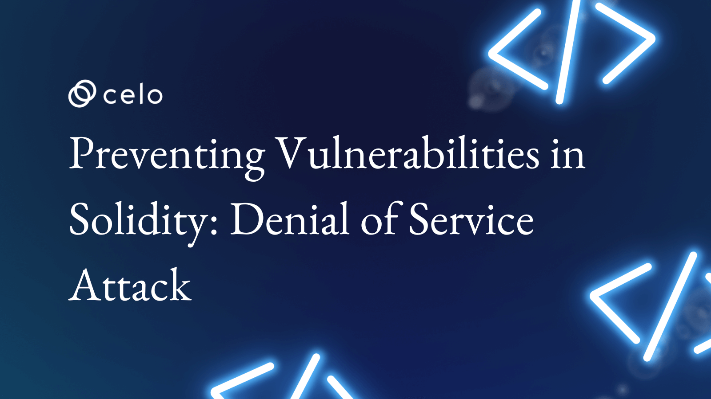

## Introduction

The Denial of Service attack in Solidity is a comprehensive attack. Fundamentally speaking, it is an attack capable of preventing a contract from operating for a short period and in some cases, permanently. Essentially, the hacker tries to manipulate the contract to become unavailable to other users.

There are many ways that a hacker can achieve this but for this article, let us explore just one of these ways. We will see how Denial of Service (DoS) works when a contract does not accept Ether. We will also look at preventive measures to ensure our contracts don’t fall victim to this attack.

## Explanation and Code Demo

In this code demo, we have a contract called  `KingOfEther`. This contract determines who the current king is by assigning the king's title to whoever sends it the most `Ether`.  We use the popular [King of The Ether](https://www.kingoftheether.com/) ideology.

```solidity
contract KingOfEther {
    address public king;
    uint public balance;
 
    function claimThrone() external payable {
        require(msg.value > balance, "Need to pay more to become the king");
 
        (bool sent, ) = king.call{value: balance}("");
        require(sent, "Failed to send Ether");
 
        balance = msg.value;
        king = msg.sender;
    }
}
```

In the above code, we store the address of the current king in a state variable, called `king`. We also store the current balance in a state variable called `balance`.  

```solidity
//king state variable
address public king;
 
//balance state variable
uint public balance;
```

Below these variables, we have a function called `claimThrone`.  Essentially, this function is used to assign a new king. In the function, we can see that it requires the value of the `Ether` being sent to be more than what the current balance in the contract is.

```solidity
//requires value of Ether to be greater than current balance
require(msg.value > balance, "Need to pay more to become the king");
```

The function also sends back whatever was in the previous balance back to whoever was the former king. In an actual sense, the function requires that the balance be sent back before any other operation can be performed.

```solidity
//send the balance back to the former king if msg.value > balance is true
(bool sent, ) = king.call{value: balance}("");
require(sent, "Failed to send Ether");
```

Once the above operation has been performed, the balance is set to the value of the `Ether` sent by the `msg.sender`, and `msg.sender` becomes the new king.

```solidity
balance = msg.value;
king = msg.sender;
```

This is a simple contract, and any contract that sends it the most amount of `Ether` becomes the new king. Let us look at a simple real-life explanation to buttress the point further:

- A man called James wants to become the king in this contract.
- He sends 1 Ether, and since there was no previous king, James becomes the king of the contract.
- If Bob decides that he wants to become the new king, he needs to send more than 1 Ether.
- Bob understands this and sends 2 Ether.
- Since the initial balance was 1 Ether, it is smaller than what Bob sent in.
- The contract sees this and immediately sends 1 Ether back to James(the amount James sent in) and then makes Bob the new king.
- The balance in the contract then becomes 2 Ether which was sent in by Bob.
- If Dawn decides that she wants to take the position of king, she has to go through the same process.

## Attacking Contract With DoS

Now that we seem to better understand what the contract does,  how can a **Denial of Service** attack be performed on this contract? Let us assume that Dawn does not just want the position of the king, but she wants to keep it forever.

To achieve this, she has to prevent the `KingOfEther` contract from accepting Ether from anybody who tries to take the throne from her. She has to deny the `KingOfEther` contract the ability to execute all its functions.

Programmatically speaking, Dawn has to render just two lines of code useless. Look at these lines below.

```solidity
(bool sent, ) = king.call{value: balance}("");
require(sent, "Failed to send Ether");
```

After a closer look at the two lines of code, we can see that the first line makes use of the `Call` interface to send back the balance to whoever the previous king was. Dawn knows this, and she also knows that the new king is set only after the above operation has been successful. So when Dawn wants to claim the throne, she has to ensure that the above lines of code fail. How does she plan to do this? Let us look at the code she writes to claim the throne.

```solidity
contract Dawn {
 
    function attack(KingOfEther kingOfEther) public payable {
        kingOfEther.claimThrone{value: msg.value}();
    }
}
```

Dawn writes her contract and declares a function called `attack()`. This function takes in a single value which is the address of the `KingOfEther` contract. Since it needs to send `Ether` to the `claimThrone()` function in other to claim the throne, Dawn declares it as `payable`.

When the `attack()` function is called, it sends `Ether` to the `KingOfEther` contract. For this attack to work, Dawn has to make sure that she sends an amount higher than what the previous king sent.

Let us walk through what will happen with this contract in play:

- Dawn decides that she wants the throne from Bob.
- She sends 4 Ether to the `KingOfEther` contract with her contract, `Dawn`.
- The `KingOfEther` contract assigns the throne to her.
- Bob tries to take back the throne for himself.
- Bob send 10 Ether to the `KingOfEther` contract.
- Bob gets denied the chance to become king again.

What could have happened? Bob sent enough Ether for him to become the new king, but he isn’t. Could Dawn have done something that we overlooked when going through her code? That’s right, she did!

If we look properly, we will observe that the `claimThrone()` function uses the `call` interface when sending the balance back to whoever the dethroned king was.

```solidity
(bool sent, ) = king.call{value: balance}("");
require(sent, "Failed to send Ether");
```

Dawn knows this, and so when she created her contract, she failed to include a fallback function. This means that when Bob sent 10 Ether, the `claimThrone()` function made a call to `Dawn.attack()`, and since there was no fallback function to handle this, the `Dawn` contract failed to accept Ether, and the operation to send Ether failed. Remember that the new king is only set after the operation to send Ether has been successful. Since the operation failed, a new king can never be set. This means that Dawn will remain king forever.

By doing this, Dawn has rendered the `KingOfEther` contract useless to anyone who will try to use it again. She did this simply by refusing to accept Ether.

## Preventive Measures Against Denial of Service Attack

So far, we have demonstrated how harmful the DoS attack can be. We have also seen how relatively easy it can be to perform the attack.  We need to know how to prevent this attack from affecting our contract.  Before fully grasping this, we should look at the ******pull-over-push****** design mechanism in Solidity.

### Pull-Over-Push

In Solidity, the `pull-over-push` mechanism/design is a way to prevent risks associated with sending/transferring Ether from a contract to the user(s). This design intends to push the risks associated with transferring Ether from the contract to the user. In the `pull-over-push` design, three participants are involved. They are:

- The initiator of the transfer i.e., the owner of the contract.
- The smart contract
- The receiver of the funds being transferred.

The `pull-over-push` design makes use of `mapping`. In this design, the user is made to withdraw (pull) a certain amount that would have been sent (push) to him under another circumstance. If there is any inaccuracy or security risk, it will have no impact on other transactions. For an extensive explanation of `pull-over-push`, visit [here](https://fravoll.github.io/solidity-patterns/pull_over_push.html)

### Prevent Dawn From Taking Control Of The Contract

Now that we understand the `pull-over-push` design let us see how we can use it to secure our `KingOfEther` contract. The simple strategy is to modify our contract to require a dethroned king to withdraw ether from the contract (pull) instead of having the contract send the ether to the dethroned king (push).

Since we’ll be modifying our code for dethroned kings to withdraw ether, we need to track how much has been sent. To do this, we create a `mapping` from `address` to `uint` and call it `balances`.

```solidity
address public king;
uint public balance;
//keeping track of how much is being sent
mapping(address => uint) public balances;
```

Next, we should remove the code that sends the ether. This is the code that Dawn was able to render useless. We will replace it with another code.

```solidity
//remove this code
(bool sent, ) = king.call{value: balance}("");
require(sent, "Failed to send Ether");
 
//replace with this
balances[king] += balance;
```

With this change, we are simply saying that instead of having the contract, `KingOfEther`, send the balance to the dethroned king, the dethroned king will be able to withdraw the amount stored in `balances[king]` plus the amount we were initially going to send, i.e. `balance`.

After this, we will create a function called `withdraw()`. With this function, once a king becomes dethroned, he/she can call the `withdraw()` function and withdraw the money sent to the contract.

```solidity
    function withdraw() public {
        require(msg.sender != king, "Current king cannot withdraw");
 
        uint amount = balances[msg.sender];
        balances[msg.sender] = 0;
 
        (bool sent, ) = msg.sender.call{value: amount}("");
        require(sent, "Failed to send Ether");
    }
 
```

The `withdraw()` function requires that the current king will be unable to withdraw. Then the function stores the amount of ether that the `msg.sender` can withdraw in a variable called `amount`. Then we will set the amount that `msg.sender` can withdraw to zero.

```solidity
        
//the king cannot withdraw from the balance
require(msg.sender != king, "Current king cannot withdraw");
 
//amount variable
uint amount = balances[msg.sender];
 
//set amount that can be withdrawn to zero
balances[msg.sender] = 0;
```

After this, we will send the ether to `msg.sender`.

```solidity
        (bool sent, ) = msg.sender.call{value: amount}("");
        require(sent, "Failed to send Ether");
```

****NOTE:****The reason why we have `balances[msg.sender] = 0;` before we send the ether is to prevent another attack called ****reentrancy****.

Looking closely, the code we added to send the ether is also prone to a Denial of Service attack. However, we don’t have to worry about it at this point because the attack will only affect whoever the sender is i.e., the attacker. This means that everyone else can decide to claim the throne, but no one will be able to keep it forever.

View the full code, modified to prevent DoS below:

```solidity
contract KingOfEther {
    address public king;
    uint public balance;
    mapping(address => uint) public balances;
 
    function claimThrone() external payable {
        require(msg.value > balance, "Need to pay more to become the king");
 
        balances[king] += balance;
 
        balance = msg.value;
        king = msg.sender;
    }
 
    function withdraw() public {
        require(msg.sender != king, "Current king cannot withdraw");
 
        uint amount = balances[msg.sender];
        balances[msg.sender] = 0;
 
        (bool sent, ) = msg.sender.call{value: amount}("");
        require(sent, "Failed to send Ether");
    }
}
```

## Conclusion

In this article, we have successfully seen how a Denial of Service attack can come into play by refusing to accept ether. We have also covered the Pull-Over-Push design. Lastly, we have seen how to protect our contracts from getting attacked by this malicious attack.

## Author

[Oyeniyi Abiola Peace](https://twitter.com/_iamoracle) is a seasoned software and blockchain developer. With a degree in Telecommunication Science from the University of Ilorin and over five years experience in JavaScript, Python, PHP, and Solidity, he is no stranger to the tech industry. Peace currently works as the CTO at DFMLab and is a Community Moderator at Celo Blockchain. When he's not coding or teaching, he loves to read and spend time with family and friends.
