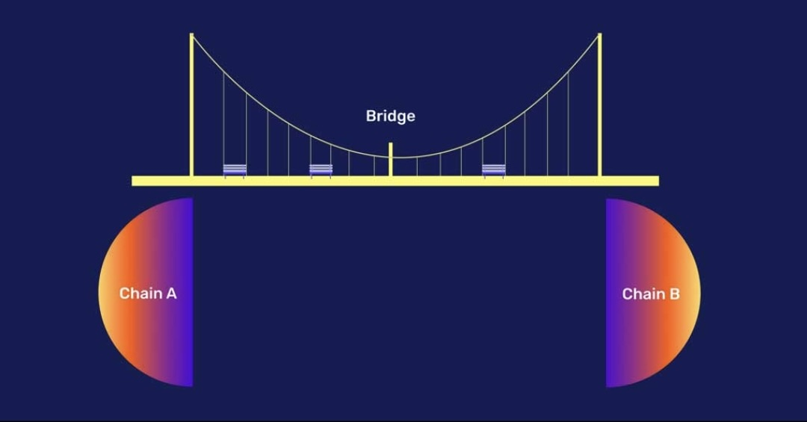
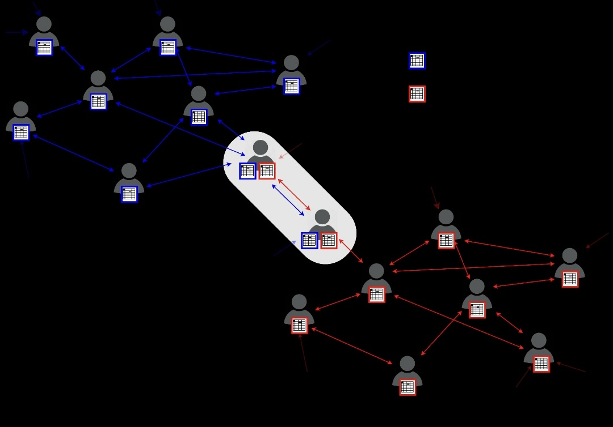

## Introduction

As blockchain technology continues to gain widespread adoption, interoperability solutions have become increasingly important. This article will delve into Celo's interoperability solutions, including bridges and cross-chain transactions, and how they are revolutionizing the blockchain industry.

In this article, we will provide a comprehensive breakdown of Celo's interoperability solutions, including how they work, how they enable seamless communication between different blockchains, and how they are being used in the blockchain industry. Case studies and examples of Celo's interoperability solutions in action will be discussed, as well as potential benefits and challenges of implementing these solutions. We will also explore Celo's partnerships and collaborations with other organizations in the blockchain industry to advance interoperability solutions.

## Overview

Blockchain technology has been widely embraced in recent years as new applications are developed and integrated into numerous industries. Due to the interoperability problem brought on by the emergence of numerous blockchain networks, communication between these networks is difficult. As a result of this issue, interoperability solutions that permit seamless communication between various blockchains are now required. Celo's interoperability solutions rely on some key components like bridges and cross-chain transactions and we will be discussing them further in this article.

## What are Bridges?

Bridges are protocols that enable the transfer of assets between two different blockchains. It acts as an intermediary facilitating the transfer of assets between Celo and other blockchains such as Ethereum, Bitcoin, and other major networks. Bridges are essential for interoperability, which is crucial for the growth of decentralized finance (DeFi) and the overall blockchain ecosystem.



Celo uses a few different types of bridges to connect with other blockchains, each with its unique features and benefits. Here are some prominent bridges in Celo:

- Moola Market Bridge:

The Moola Market Bridge is another decentralized bridge that connects Celo to Ethereum. It is a non-custodial liquidity protocol that is democratizing access to yield and credit. Depositors earn compound interest which is paid for by borrowers who take over-collateralized loans, delegated loans, or flash loans. It enables the transfer of assets between the two blockchains and provides users with access to liquidity pools on both networks. The Moola Market Bridge is optimized for DeFi use cases and offers low fees and fast transaction times.

- Celo-Ethereum Bridge:

The Celo-Ethereum Bridge is a centralized bridge that connects Celo to Ethereum. It enables the transfer of assets between the two blockchains and is currently used for the transfer of CELO, Celo Dollars (cUSD), and Celo Euro (cEUR) tokens. The Celo-Ethereum Bridge is operated by the Celo Foundation, providing users with a reliable and secure way to move assets between the two networks.

## What are Cross-Chain Transactions?

Cross-chain transactions are transactions that involve the direct transfer of assets between two different blockchains. This frequently occurs by utilizing interoperability protocols, such as atomic swaps or sidechains, which allow assets to be exchanged between other networks while keeping their fundamental properties.



Cross-chain transactions enable the transfer of assets between Celo and other blockchains such as Ethereum, Bitcoin, and other major networks. Celo provides several different ways to enable cross-chain transactions, each with its unique features and benefits. Here are some methods for cross-chain transactions in Celo:

- Atomic Swaps:

Atomic swaps are a trustless mechanism for enabling cross-chain transactions. Celo supports atomic swaps through its integration with the THORChain network, which enables the exchange of assets between Celo and other networks such as Bitcoin and Ethereum without needing to rely on a centralized intermediary. Atomic swaps are a powerful tool for enabling secure and trustless cross-chain transactions.

- Optics

Optics is a decentralized interoperability protocol designed to enable cross-chain communication between different blockchain networks. It allows for the seamless transfer of assets between different networks while retaining their underlying characteristics, such as security and functionality. It sees an attestation of some data and accepts it as valid after a timer elapses. While the timer is running, honest participants have a chance to respond to the attestation and/or submit fraud proofs.

## How do they Work?

Bridges and cross-chain transactions are particularly useful in the decentralized finance (DeFi) space, where multiple blockchain networks are used to execute financial transactions. Celo supports several bridges that allow users to exchange assets between the Celo network and other blockchain networks, such as Ethereum. Bridges are designed to be fast, secure, and efficient, with minimal transaction fees and low latency, enabling users to access a wider range of applications and services across different blockchain networks while retaining the benefits of the Celo network, such as fast finality and low transaction fees.

A user would normally utilize a bridge contract to lock up their assets on one network and receive comparable assets on the other network in order to use Optics for cross-chain transactions. The Proof of Stake (PoS) consensus process used in optics is designed to be quick, secure, and efficient with low gas costs and latency. This allows for quick finality and ensures the security of asset transactions. The protocol also has a decentralized governance structure that enables users to take part in protocol decision-making. For users all across the world, Celo is building a more interconnected and accessible financial ecosystem with its interoperability solutions.

Here is a code example for a bridge contract that enables users to transfer tokens between Ethereum and Celo

```solidity
//SPDX-License-Identifier: MIT
pragma solidity ^0.8.0;
// Import the necessary ERC20 interfaces for token interaction
import "@openzeppelin/contracts/token/ERC20/IERC20.sol";

contract TokenBridgingContract {
    // Address of the Ethereum token contract
    address public ethereumToken;
   
// Address of the Celo token contract
    address public celoToken;
    
    // Mapping to track token balances on Ethereum
    mapping(address => uint256) public ethereumBalances;
    
    // Event emitted when tokens are bridged from Ethereum to Celo
    event TokensBridged(address indexed user, uint256 amount);
    
    constructor(address _ethereumToken, address _celoToken) {
        ethereumToken = _ethereumToken;
        celoToken = _celoToken;
    }
    
    // Deposit tokens on Ethereum and initiate the bridging process
    function depositTokens(uint256 amount) external {
        // Transfer the tokens from the user to the contract
        IERC20(ethereumToken).transferFrom(msg.sender, address(this), amount);
        
        // Lock the deposited tokens
        ethereumBalances[msg.sender] += amount;
        
        // Emit an event to notify the bridging process
        emit TokensBridged(msg.sender, amount);
    }
    
    // Bridge tokens from Ethereum to Celo
    function bridgeTokens() external {
        // Retrieve the token balance of the user on Ethereum
        uint256 amount = ethereumBalances[msg.sender];
        
        // Ensure the user has deposited some tokens
        require(amount > 0, "No tokens to bridge");
        
        // Transfer the tokens to the Celo token contract
        IERC20(celoToken).transfer(msg.sender, amount);
        
        // Update the token balance on Ethereum
        ethereumBalances[msg.sender] = 0;
    }
}
```

The `TokenBridgingContract` imports the ERC20 interface from the OpenZeppelin library to facilitate token interaction. 

The addresses of the Ethereum and Celo token contracts are represented by `ethereumToken` and `celoToken` variables.

The mapping called `ethereumBalances` associates addresses with token balances on the Ethereum network.

When tokens are successfully bridged from Ethereum to Celo, an event called `TokensBridged` is declared and emitted. This event includes the user's address and the amount of tokens that were bridged.

The constructor function accepts two addresses, `_ethereumToken` and `_celoToken`, and assigns them to the variables ethereumToken and celoToken respectively.

The `depositTokens` function enables users to deposit tokens on the Ethereum network. It transfers tokens from the user's address to the contract, locks the deposited tokens within the contract by adding them to the user's balance in the ethereumBalances mapping, and emits the TokensBridged event to notify the bridging process.

The `bridgeTokens` function facilitates the bridging of tokens from Ethereum to Celo for the user making the call. It retrieves the token balance of the user on Ethereum, ensures that the user has deposited some tokens, transfers those tokens to the user's address on the Celo network using the Celo token contract, and updates the token balance on Ethereum to zero.


## Conclusion

Celo's interoperability solutions are helping to bridge the gap between different blockchain networks, enabling seamless communication and the transfer of assets and data between them. They are being used in various applications across the blockchain industry, including DeFi, supply chain management, identity verification, and gaming. By enabling cross-chain transactions, Celo is helping to create a more inclusive financial system that is accessible to people all around the world.In this tutorial, you have learnt how to set up your environment, write a crowdfunding contract, connect your wallet and deploy your crowdfunding contract.

## Next Steps

Please check the [Repo](https://github.com/Kyrian212/bridge) and also [Celo Documentation](docs.celo.org) to learn more.

## Author

Kyrian Chigozie is a Technical Writer with a passion for web3 technology. Connect with me on [Twitter](https://twitter.com/Kyrian_M) or [Github](https://github.com/Kyrian212).

## Reference

- [Celo Docs](https://docs.celo.org/)
- [Moola Market](https://moola.market/)
- [Optics](https://optics.app/)
- [Optics Docs](https://docs.celo.org/protocol/bridge/optics)
