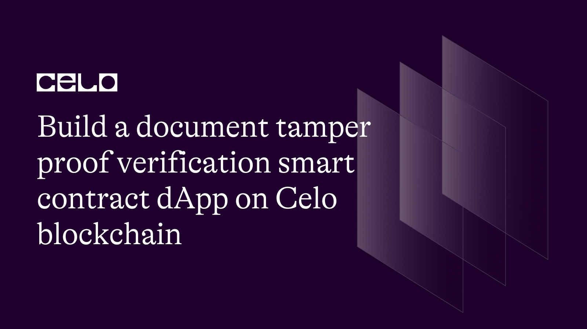

## Introduction

In this tutorial, we'll guide you through the process of building a document tamper-proof verification smart contract on the Celo blockchain.

We'll be using Solidity to develop the smart contract, React to create the front-end interface, and ethers JS to connect the front-end to the Celo blockchain. By the end of this tutorial, you'll have a fully functional dApp that allows users to verify the authenticity of their documents in a decentralized and tamper-proof manner.

## Prerequisites

1. Solidity: You should have a basic understanding of Solidity, the programming language used for writing smart contracts on the Celo blockchain.

2. React: You should have a basic understanding of React, a popular JavaScript library for building user interfaces. You should be familiar with components, state, props, and lifecycle methods.

3. Hardhat: You should have a basic understanding of Hardhat, a development environment for building, testing, and deploying smart contracts on the Celo blockchain. You should be familiar with Hardhat's project structure, configuration, and testing features.

# Requirements

1. Node.js: You will need Node.js to install on your machine to run the necessary tools and libraries for our application. You can download the latest version of Node.js from the official website [here](https://nodejs.org/en/download/)
2. Hardhat: We will be using Hardhat as our development environment for building, testing, and deploying smart contracts on the Celo blockchain.
3. React: We will be using React to build the front end of our application. You can create a new React project using the following command: `npx create-react-app my-app`
4. MetaMask Wallet Extension: You will need to install the MetaMask Wallet Extension for your browser to interact with the Celo blockchain. You can find the extension for Chrome, Firefox, and Brave browsers [here](https://metamask.io/)

## Setting up the project

We will set up our project by cloning a starter code template from GitHub and installing the necessary dependencies.

I have separated backend side of the project from the front end, and put them in two separate github repos.

 We'll start with the backend.

 To get started, open your terminal and run the following command to clone the starter code template for our project from GitHub.

```bash
git clone https://github.com/JovanMwesigwa/tamper-proof-dapp-starter-template-solidity.git
```

This will create a new folder called `tamper-proof` in your current directory, which contains the starter code template for our project.

Once you've cloned the repository, navigate to the `tamper-proof` folder in your terminal and install the necessary dependencies for our project by running the following command:

```bash
npm install
```

Or

```bash
yarn
```

This command will install all the required dependencies specified in the package.json file.

After the dependencies have been installed successfully, you're all set to start building the project.

The smart contract code will be written inside the `/Contracts/TamperProof.sol` that comes with the starter template.

To get started with our smart contract,  we'll need to specify the version of Solidity we want to use.

We'll use version `0.8.9` by adding the following line at the beginning of our code:

```solidity
pragma solidity ^0.8.9;
```

At the top of our contract, we add an error function called `TamperProof__NotAuthorized()`:

```solidity
error TamperProof__NotAuthorized();
```

This error will throw an error if someone tries to access our dApp without authorization as we'll see later.

Next, we'll define our smart contract by creating a new contract called `TamperProof`:

```solidity
contract TamperProof {
}
```

Inside the contract We define a private mapping called `s_document`. This mapping will store the hash of a document along with a unique identifier.

We'll use a `uint256` as the identifier since it can handle large numbers, making it suitable for storing the hash.

```solidity
mapping(uint256 => Document) private s_document;
```

Next, we define a private address variable called `i_admin`. This variable will store the address of the administrator of the dApp, which we'll use to ensure that only authorized users can upload documents.

```solidity
address private i_admin;
```

We also define a private `uint256` variable called `s_count`. This variable will store the total number of documents uploaded to the dApp, which we'll use to generate unique identifiers for new documents.

```solidity
uint256 private s_count;
```

Finally, we define a constructor function for the `TamperProof` contract. The constructor function is executed when the smart contract is deployed to the Celo blockchain.

In our constructor function, we set the address of the contract deployer as the administrator and set the document count to zero.

```solidity
constructor() {
    i_admin = msg.sender;
    s_count = 0;
}
```

On deployment, we use the `msg.sender` keyword to get the address of the account that deploys the contract, which will be set as the `i_admin` variable.

Defining the `Document` struct:

Now that we have defined some variables and a constructor for our `TamperProof` contract, let's define the `Document` struct.

This struct will store the metadata of a document, including its title, author, creator, producer, date created, and length.

```solidity
struct Document {
    uint256 id;
    string title;
    string author;
    string creator;
    string producer;
    string dateCreated;
    uint256 docLength;
}
```

Here, we use the `struct` keyword to define a new struct called `Document`. Inside the struct, we define seven variables:

1. `id`: This variable will store the unique identifier of the document.
2. `title`: This variable will store the title of the document.
3. `author`: This variable will store the name of the author of the document.
4. `creator`: This variable will store the name of the person or organization that created the document.
5. `producer`: This variable will store the name of the software used to produce the document.
6. `dateCreated`: This variable will store the date and time the document was created.
7. `docLength`: This variable will store the length of the document in bytes.

We'll use this struct to store the metadata of uploaded documents in our dApp.

We a need a function that will allow us to add a new document to our smart contract. This function will take in the metadata of a document as arguments and store them in the `s_document` mapping.

```solidity
function addDocument(
    string memory _title,
    string memory _author,
    string memory _creator,
    string memory _producer,
    string memory _dateCreated,
    uint256 _docLength
) public {
    // Verify that only the admin is adding a document
    if (i_admin != msg.sender) {
        revert TamperProof__NotAuthorized();
    }

    Document memory newDoc = Document(
        s_count,
        _title,
        _author,
        _creator,
        _producer,
        _dateCreated,
        _docLength
    );

    s_document[s_count] = newDoc;

    s_count += 1;
}
```

Here, we define the `addDocument` function, which takes in all the necessary arguments.

Before the document is added to the contract, need to verify that only the `i_admin` address is adding a document. If the address of the caller is not the admin, the function will revert.

Next, we create a new `Document` struct called `newDoc` and initialize it with the metadata provided as arguments. We also assign the unique `id` of the document as the current value of `s_count`.

Finally, we store the `newDoc` struct in the `s_document` mapping at the key `s_count`, increment the value of `s_count` by one, and the document has been successfully added to our smart contract.

The `approveDocument()` function is a read-only function that verifies whether the document stored at a particular ID matches the provided document information.

The function takes in the document information as parameters, and then it retrieves the document from the `s_document` mapping based on the provided `_id`.

As shown below:

```solidity
function approveDocument(
        uint256 _id,
        string memory _title,
        string memory _author,
        string memory _creator,
        string memory _producer,
        string memory _dateCreated,
        uint256 _docLength
    ) public view returns (bool) {
        Document storage document = s_document[_id];

        bool trueTitle = keccak256(abi.encodePacked(_title)) ==
            keccak256(abi.encodePacked(document.title));
        bool trueAuthor = keccak256(abi.encodePacked(_author)) ==
            keccak256(abi.encodePacked(document.author));
        bool trueCreator = keccak256(abi.encodePacked(_creator)) ==
            keccak256(abi.encodePacked(document.creator));
        bool trueProducer = keccak256(abi.encodePacked(_producer)) ==
            keccak256(abi.encodePacked(document.producer));
        bool trueDateCreated = keccak256(abi.encodePacked(_dateCreated)) ==
            keccak256(abi.encodePacked(document.dateCreated));
        bool trueDocLength = _docLength == document.docLength;

        bool isValid = (trueTitle &&
            trueAuthor &&
            trueCreator &&
            trueAuthor &&
            trueProducer &&
            trueDateCreated &&
            trueDocLength);

        return isValid;
    }
```

The function compares each piece of the document information with the corresponding value stored in the retrieved document, using the `keccak256` hashing function to compare the strings. If all pieces of the document information match the stored values, the function returns `true`. Otherwise, it returns `false`.

This function is useful for verifying whether a document has been tampered with or not. If the stored hash of the document matches the hash of the original document, and the document information provided by the user matches the information stored in the smart contract, then it can be concluded that the document has not been modified since it was first uploaded.

In addition to the functions we've already discussed, we have three view functions that allow us to retrieve data from the contract without modifying it.

The `getDocument()` function takes in a document ID as a parameter and returns the `Document` struct associated with that ID.

The `getAdmin()` function simply returns the address of the admin who deployed the smart contract.

Finally, the `getCount()` function returns the total count of documents stored in the contract.

### Configuring the hardhat script file

The hardhat script file is used to deploy and interact with the smart contract.

In this script, we define three networks: `hardhat`, `localhost`, and `alfajores`.

Both the hardhat and local networks are the default used for local testing.

Finally, the alfajores network is used to deploy the smart contract on the Alfajores testnet. This is where we'll deploy our contract. Each network configuration includes a chainId, which is a unique identifier for each blockchain network.

Next, we define the Solidity compiler versions that we want to use. In this script, we specify four different versions of the Solidity compiler, ranging from version `0.6.6` to version `0.8.18`. By including multiple compiler versions, we can compile our smart contracts with different versions of Solidity and ensure that our contracts will work on different networks.

The `paths` section specifies the directory where Hardhat stores the compiled contracts, artifacts, and other data. These will be very important to use when interacting with the front end later. By setting this path, hardhat will automatically look for the artifacts in this route.

We also define a named account in this script, `deployer`, which is used to deploy the smart contract. By defining a named account, we can easily refer to it in our deployment scripts.

Finally, the `etherscan` section is used to configure Etherscan API keys for different networks. We provide an API key for the `alfajores` network, which allows us to verify our deployed contract on the Etherscan block explorer.

### Obtaining env keys

To configure and get the environment variables for the `hardhat.config.js` file, you need to create a `.env` file in the root directory of the project. The `.env` file should contain the required environment variables.

As shown below:

```js
ALFAJORES_API_KEY=<ALAFAJORES API KEY>
ALFAJORES_URL=https://celo-alfajores.infura.io/v3/<INFURA RPC KEY>
PRIVATE_KEY=<WALLET PRIVATE KEY FROM METAMASK>
```

1. `ALFAJORES_API_KEY`: This is the API key for the Alfajores network provided by Celscan. You can get an API key by creating an account on Celoscan [here](https://celoscan.io/login) and going to the API section of your account.
2. `ALFAJORES_URL`: This is the URL for the Aljajores network. To get this URL, create an account with Infura [here](https://app.infura.io)
3. `PRIVATE_KEY`: This is the private key for the account that will be used to deploy the contract. This can be found in your MetaMask wallet.

Overall, this script file is used to configure the various settings of the Hardhat framework and is crucial for developing, testing, and deploying smart contracts using Hardhat.

### Deploy script

Now that our hardhat configuration is complete, we can now write a deploy script for the contract.

Inside `/deploy` create a file called `01-tamperproof.deploy.js`. This will define the main deploy script for the contract with the code below:

```js
const { ethers, network } = require('hardhat')
const { verifyContract } = require('../utils/verifyContract')

module.exports = async ({ getNamedAccounts, deployments }) => {
  const { deployer } = await getNamedAccounts()

  const chainId = network.config.chainId

  const { deploy, log } = deployments

  const args = []
  const waitConfirmations = 1

  // Only verify the contract when we are deploying on celo test net
  const tx = await deploy('TamperProof', {
    from: deployer,
    args: args,
    waitConfirmations: waitConfirmations,
    log: true,
  })
  log('TamperProof contract deployed --------------')

  if (chainId != 31337) {
    log('Verifying the contract on celoscan...')
    await verifyContract(tx.address, args)
  }
}

module.exports.tags = ['all', 'deploy']
```

The asynchronous function takes in two parameters: `getNamedAccounts` and `deployments`. `getNamedAccounts` is a function that retrieves the addresses of pre-configured accounts in the Hardhat config file.

In this script, we are only interested in the `deployer` account, which is the account that will deploy the contract. We retrieve it by calling `await getNamedAccounts()`.

We then retrieve the `chainId` from the `network.config` object, which tells us which network we are deploying to.

We use the `deploy` function provided by the `deployments` plugin to deploy the contract. We pass in the name of the contract, `TamperProof`, and an empty array for the constructor arguments, as our `TamperProof` contract does not require any constructor arguments. We also specify the `from` parameter as the `deployer` account retrieved earlier. We set `waitConfirmations` to 1 so that we only proceed with the deployment once the transaction has been confirmed by at least one node on the network. We also set `log` to `true` so that deployment progress is displayed in the console.

Finally, we check if the `chainId` is not equal to `31337` (i.e. we are deploying on a Celo network, not the local Hardhat network), and if so, we call the `verifyContract` function to verify the contract on the Celo blockchain.

Lastly, we define a line exports an array of tags for this script, which can be used to run this script and any others with a particular tag by using the `--tags` flag in the command line. In this case, we have tagged this script with `all` and `deploy`, so running `npx hardhat deploy --tags deploy` will execute this script.

### Unit testing

Before we deploy the contract to Celo block chain, we need to first write some units to verify that the contract is doing what we want it to exactly do.

Inside the `/test` folder, create a new file called `TamperProof.test.js`.

This is where we'll write all the necessary unit tests.

To write the tests, we'll be using the Chai assertion library and Hardhat development environment, as shown in the code below:

```js
const { expect } = require('chai')
const { ethers } = require('hardhat')
const {
  DOCUMENT_INFO,
  INVALID_DOCUMENT_INFO,
} = require('../helper-hardhat-config')

describe('TamperProof', function () {
  async function deployTamperProof() {
    const signers = await ethers.getSigners()

    const account1 = await signers[0].getAddress()
    const account2 = await signers[1].getAddress()

    const Contract = await ethers.getContractFactory('TamperProof', signers[0])
    const tamperProofContract = await Contract.deploy()

    await tamperProofContract.deployed()

    contract = tamperProofContract
    contractAddress = tamperProofContract.address

    return { contract, contractAddress, account1, account2 }
  }
}
```

The code provided above sets up the initial structure for our unit tests. We import the `expect` function from the Chai assertion library, as well as the `ethers` and `hardhat` libraries.

We then define a `describe` block that contains our tests.

Inside the block, we define an `async` function called `deployTamperProof`, which deploys the TamperProof contract and returns some useful variables.

To test all the functionality in the `Constructor`, we have a `describe` block called `Constructor`, which contains two tests. The first test checks if the admin address set in the contract's constructor is the same as the address of the first signer. The second test checks if the `s_count` variable is set to 0 during contract deployment.

As shown below:

```js
describe('Constructor', function () {
    it('Should add the admin to the contract', async function () {
      const { contract, contractAddress, account1, account2 } =
        await deployTamperProof()

      const owner = await contract.getAdmin()

      expect(owner.toString()).to.equal(account1)
    })

    it('Should increase count to the contract', async function () {
      const { contract, contractAddress, account1, account2 } =
        await deployTamperProof()

      const count = await contract.getCount()

      expect(count.toString()).to.equal('0')
    })
  })
```

The first line of each test is an asynchronous function call to the `deployTamperProof` function, which returns an object containing the deployed contract instance, its address, and two signer accounts.

Inside each test, we then use the contract instance to call the relevant functions and use the `expect` function from the `chai` library to verify that the actual result matches the expected result.

In the first test, we call the `getAdmin` function and compare its return value to the first account's address using the `toString` method.

To run the first test in the constructor, open your terminal and type;

```bash
npx hardhat test --grep "Should add the admin to the contract"
```

We use the `--grep "<ENTER IN THE TEST TOPIC>"`

Output:


As you can see our first test passes properly. This means that after deployment, we're very certain that the admin and count are initiallized accordingly.

A failed test will be properly described by chai as shown below:


By writing these unit tests, we can ensure that the basic functionality of our TamperProof contract is working as intended.

Here's the full test script for the smart contract:

```js
const { expect } = require('chai')
const { ethers } = require('hardhat')
const { DOCUMENT_INFO, INVALID_DOCUMENT_INFO } = require('../hardhat-config')

describe('TamperProof', function () {
  async function deployTamperProof() {
    const signers = await ethers.getSigners()

    const account1 = await signers[0].getAddress()
    const account2 = await signers[1].getAddress()

    const Contract = await ethers.getContractFactory('TamperProof', signers[0])
    const tamperProofContract = await Contract.deploy()

    await tamperProofContract.deployed()

    contract = tamperProofContract
    contractAddress = tamperProofContract.address

    return { contract, contractAddress, account1, account2 }
  }

  describe('Constructor', function () {
    it('Should add the admin to the contract', async function () {
      const { contract, contractAddress, account1, account2 } =
        await deployTamperProof()

      const owner = await contract.getAdmin()

      expect(owner.toString()).to.equal(account1)
    })

    it('Should increase count to the contract', async function () {
      const { contract, contractAddress, account1, account2 } =
        await deployTamperProof()

      const count = await contract.getCount()

      expect(count.toString()).to.equal('0')
    })
  })

  describe('AddDocument', function () {
    it('Should successfully add a new document', async function () {
      const { contract, contractAddress, account1, account2 } =
        await deployTamperProof()

      await contract.addDocument(
        DOCUMENT_INFO.title,
        DOCUMENT_INFO.author,
        DOCUMENT_INFO.creator,
        DOCUMENT_INFO.producer,
        DOCUMENT_INFO.creationDate,
        DOCUMENT_INFO.docLength
      )

      const count = await contract.getCount()

      expect(count.toString()).to.equal('1')
    })
  })

  describe('ApproveDocument', function () {
    it('Should successfully approve the document', async function () {
      const { contract, contractAddress, account1, account2 } =
        await deployTamperProof()

      await contract.addDocument(
        DOCUMENT_INFO.title,
        DOCUMENT_INFO.author,
        DOCUMENT_INFO.creator,
        DOCUMENT_INFO.producer,
        DOCUMENT_INFO.creationDate,
        DOCUMENT_INFO.docLength
      )

      const document = await contract.getDocument(0)

      const validate = await contract.approveDocument(
        document.id.toString(),
        DOCUMENT_INFO.title,
        DOCUMENT_INFO.author,
        DOCUMENT_INFO.creator,
        DOCUMENT_INFO.producer,
        DOCUMENT_INFO.creationDate,
        DOCUMENT_INFO.docLength
      )

      expect(validate).to.be.true
    })

    it('Should fail to approve the document', async function () {
      const { contract, contractAddress, account1, account2 } =
        await deployTamperProof()

      await contract.addDocument(
        DOCUMENT_INFO.title,
        DOCUMENT_INFO.author,
        DOCUMENT_INFO.creator,
        DOCUMENT_INFO.producer,
        DOCUMENT_INFO.creationDate,
        DOCUMENT_INFO.docLength
      )

      const document = await contract.getDocument(0)

      const validate = await contract.approveDocument(
        document.id.toString(),
        INVALID_DOCUMENT_INFO.title,
        INVALID_DOCUMENT_INFO.author,
        INVALID_DOCUMENT_INFO.creator,
        INVALID_DOCUMENT_INFO.producer,
        INVALID_DOCUMENT_INFO.creationDate,
        INVALID_DOCUMENT_INFO.docLength
      )

      expect(validate).to.be.false
    })
  })
})
```

To run the test script, open your terminal and type;

```bash
npx hardhat test
```

Output:


### Deploying the contract

Using the defined deploy script, we can now deploy the contract from the terminal.

In your terminal type:

```bash
npx hardhat deploy --network alfajores
```

This will automatically push the contract to Celo Alfajore's network using all the predefined environment variables in the `hardhat.config.js` file.

Output:


The contract was successfully deployed and verified on the alfajores network, at this address [0x1e5bA742b78b0E888BdF9f30E76F0623bA9C2137](https://alfajores.celoscan.io/address/0x1e5bA742b78b0E888BdF9f30E76F0623bA9C2137) with the code full verified.

### Building the frontend

Now that the contract is successfully deployed, we can set up the front end to interact with the deployed contract.

Navigate to the `/client` folder in your project and install all the necessary dependencies for the frontend using by typing:

```bash
npm install
```

Or you can clone the code from github as shown below

```bash
git clone https://github.com/JovanMwesigwa/tamper-proof-dapp-ui.git
```

We need to notify the front where to find the contract's address and the admin's address.
This can be found in the `/constants` folder.

```js
import abi from '../backend/contracts/TamperProof.sol/TamperProof.json'

export const CONTRACT_ADDRESS = ""
export const ADMIN_ADDRESS = ""
export const ABI = abi.abi
```

Replace `CONTRACT_ADDRESS` with your deployed contract address and `ADMIN_ADDRESS` with your deployer's address.

Now that the basic configuration is done, we can now run the front end.

In your terminal type:

```bash
yarn run dev
```

Output:


The UI consists of the following of web3 connect button, upload file, encode file and verify button.

### Building the frontend

The main logic of the front end happens in the `Home.jsx` file. Inside, we declared various state variables to keep track of what's happening in the UI. As shown below:

First, we'll declare the state variables that we'll be using in our component:

```js
  const [account, setAccount] = useState(null)

  const [contract, setContract] = useState(null)

  const [documentInfo, setDocumentInfo] = useState({})

  const [selectedFile, setSelectedFile] = useState(null)
  const [loading, setLoading] = useState(false)
  const [error, setError] = useState(null)

  const [encoded, setEncoded] = useState(false)

  const [isAuthentic, setIsAuthentic] = useState(null)
```

1. `account` will hold the user's account address.
2. `contract` will hold the instance of our smart contract.
3. `documentInfo` will hold the information about the document that the user uploaded.
4. `selectedFile` will hold the file that the user selects to upload.
5. `loading` will be a boolean value that indicates whether the application is currently loading.
6. `error` will hold any error message that may occur during the application's execution.
7. `encoded` will be a boolean value that indicates whether the document has been encoded.
8. `isAuthentic` will be a boolean value that indicates whether the document is authentic or not.

We'll use these state variables to manage the UI of our application.

Next, we define a `useEffect` hook to connect our frontend to the Celo blockchain network, as shown below;

```js
  useEffect(() => {
    async function init() {
      // Connect to celo network
      const provider = new ethers.providers.Web3Provider(window.ethereum)

      // create a signer
      const signer = provider.getSigner()

      // Create a contract instance
      const contract = new ethers.Contract(CONTRACT_ADDRESS, ABI, signer)

      setContract(contract)
    }

    init()
  }, [])
```

Inside the `init` function, we create a new instance of the `Web3Provider` class from the `ethers.providers` package, passing in the `window.ethereum` object as an argument. This object represents the current Ethereum provider, which in our case is Metamask.

We then create a signer using the `getSigner` method of the provider object. A signer is an object that can be used to sign transactions and messages with a private key. In our case, we need a signer to sign the transactions that we will be sending to the smart contract.

Finally, we create a new instance of the `Contract` class from the `ethers` package, passing in the contract address, ABI, and signer as arguments. This creates a JavaScript object that represents our smart contract on the Celo network, which we can use to call its functions and read its state.

We then use the `setContract` function to store this contract instance in the `contract` state variable. The empty dependency array (`[]`) passed as the second argument to `useEffect` ensures that this initialization code runs only once when the component mounts.

We have a function called `uploadDocument` that sends a transaction to the smart contract by calling the `addDocument` function with the necessary document information as arguments.

```js
  const uploadDocument = async () => {
    const tx = await contract.addDocument(
      documentInfo.title,
      documentInfo.author,
      documentInfo.creator,
      documentInfo.producer,
      documentInfo.dateCreated,
      documentInfo.docLength
    )
  }
```

This function uses the `contract` object that we initialized earlier using the contract's address and ABI, which allows us to interact with the smart contract.

The `addDocument` function is called with the document information stored in the `documentInfo` state variable. Once the transaction is sent to the network, it will be confirmed by the blockchain and stored in the contract's state.

Next, we define a `verifyDocument` function, that is called when the user clicks the "Verify document" button in the UI. It sets the `loading` state to `true`, indicating that the verification process has started, as shown in the code below;

```js
  const verifyDocument = async () => {
    setLoading(true)
    const tx = await contract.approveDocument(
      '0',
      documentInfo.title,
      documentInfo.author,
      documentInfo.creator,
      documentInfo.producer,
      documentInfo.dateCreated,
      documentInfo.docLength
    )

    setIsAuthentic(tx)

    setLoading(false)
  }
```

The function then calls the `approveDocument` function on the `contract` instance we created earlier, passing in the necessary document information as arguments. This function checks if the document is authentic by comparing it to the previously added document with the same ID.

The result of the transaction is stored in the `tx` variable, and is used to update the `isAuthentic` state, indicating whether the document is authentic or not. Finally, the `loading` state is set back to `false`, indicating that the verification process is complete.

## Testing the UI

Now that the UI logic is fully done, we can test its functionality.

To keep this simple, I have already added two accounts to the contract beforehand so that we can focus on testing out the functionality.

Make sure you add an admin and other address to the contract before you proceed with testing the functionality.

Let's start by depositing some CELO into the contract. To do this, we need to connect the buyer's wallet account to MetaMask.

Switch the MetaMask account to the admin's account and press the connect button.

Output:


When you connect as an admin, the UI conditionally renders that `Upload` button to only show when you're an admin.

Currently, the contract does not have any documents added.

We'll use the admin account to add a document that will later use to approve other documents to.

I have prepared two pdf files that we'll use in this expirement. One has slight changes to make it different therefore invalid to the other document. As shown below;

Original document:


Altered document:


The last document has had some modifications made to it as shown in the highlight.

Now that we have all the documents ready, we can now upload the original document to the contract as shown below:

Output:


This will require you to approve the transaction, since we're writing to the blockchain.

Approve the transaction your wallet as shown below:


Once the transaction is verified onchain, we can approve that the document data was successfully added to the contract.

Using the onchain document data,we can now verify the authenticity of any against it.

Lets start with the invalid document. We expect the contract to disapprove this document with an invalid response.

To do this, we can switch to any account in your wallet, and upload the invalid document to the dApp as shown below;

Output:


Once the document has been picked, we can press the "Encode File" button to extract it's data and press the "Verify document".

This will call the "Approve document" function on the smart contract, while passing in the required data to verify.

Output:


The approve function will return a "False" value because the length of the document was modified with the on chain document, and will show a "Document is invalid" ui to the user.

Finally, we can follow the same logic to test for the original document by selecting the same document in the UI.

Output:


Once the dcoument metadata matches with the onchain document, the "Approve" function in the contract responds with a "True" value.

# Conclusion

Building a document tamper-proof verification dApp on the Celo blockchain is a powerful demonstration of the potential of decentralized technology. By combining the security and transparency of the Celo blockchain with the programming capabilities of Solidity and React, you have created a tamper-proof system for verifying document authenticity.

# Next steps

Now that you have completed this tutorial , there are several next steps you can take to expand your knowledge and continue exploring this exciting technology.

1. Explore other use cases: The Celo blockchain is versatile and can be used to build a wide range of decentralized applications. Try exploring other use cases and building more complex dApps.

2. Learn more about smart contracts: Smart contracts are a powerful tool for building decentralized applications. Consider diving deeper into Solidity and learning more about how to create sophisticated smart contracts.

3. Join the Celo community: Join the Celo community to stay up to date with the latest developments and connect with other developers working on the platform. You can join the Celo Discord, follow Celo on Twitter, or attend Celo events.

4. Experiment with other front-end frameworks: While we used React in this tutorial, there are many other front-end frameworks that can be used to build decentralized applications on Celo. Consider experimenting with different frameworks to find the one that works best for you.

By taking these next steps, you'll be well on your way to becoming a proficient Celo blockchain developer and building even more powerful decentralized applications.

## About the Author

Created by Jovan Mwesigwa B, Blockchain, Solidity developer

Reach out:

- Twitter: [@unreal_joova](http://twitter.com/unreal_joova)
- Github: [JovanMwesigwa](https://github.com/JovanMwesigwa)
- Linkedin: [JovanMwesigwa](https://www.linkedin.com/in/jovan-mwesigwa/)

## References

- [Hardhat](https://hardhat.org/hardhat-runner/docs/getting-started) | Hardhat Docs
- [Project code](https://github.com/JovanMwesigwa/tamper-proof-dapp-starter-template-solidity) | Github
- [Frontend Code](https://github.com/JovanMwesigwa/tamper-proof-dapp-ui) | Frontend template
- [Infura](https://app.infura.io/login) | Infura RPC Provider
- [Celo faucet](https://faucet.celo.org/alfajores) | Celo test funds
