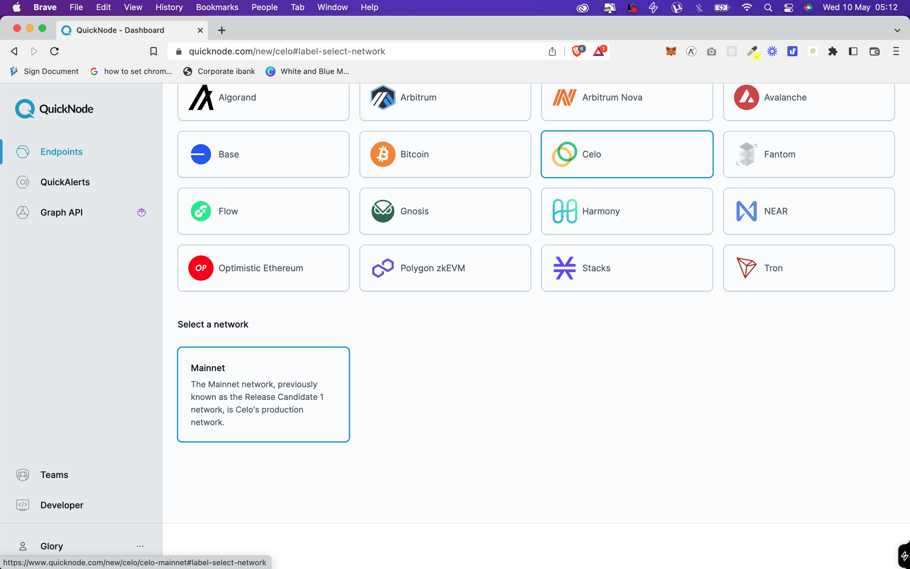
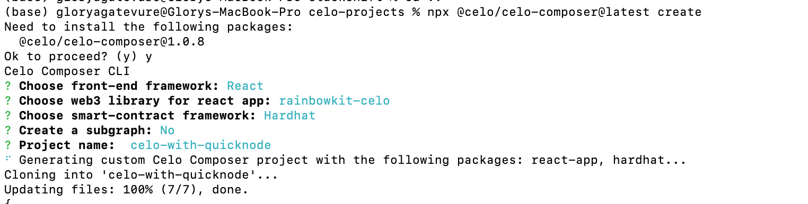

## Introduction​

In this tutorial, we will walk you through the process of building, deploying, hosting, and interacting with a Celo contract using QuickNode.

QuickNode is a cloud-based service that provides users with a fast and reliable infrastructure for hosting and accessing DApps on the blockchain network.

## Prerequisites​

To successfully follow along in this tutorial you need basic knowledge of:

- HTML, CSS, React and Next.js
- Blockchain, solidity and hardhat
- Celo Valora account

## Requirements​

To build this DApp we will need the following tools:

- [Vscode](https://code.visualstudio.com/) - But you can use any code editor of your choice
- [Hardhat](https://hardhat.org/) - used to deploy the smart contract
- [Valora App](https://valoraapp.com/) - required to connect to the dApp and sign transactions
- [Node](https://nodejs.org/en/)- an open-source, cross-platform JavaScript runtime environment
- [Celo Composer](https://github.com/celo-org/celo-composer)- starter project with all code needed to build, deploy, and upgrade a dapps on Celo.
- [Celo Wallet Extension](https://chrome.google.com/webstore/detail/celoextensionwallet/kkilomkmpmkbdnfelcpgckmpcaemjcdh?hl=en) / [Metamask](https://metamask.io/) - For interacting with the Celo blockchain
- [QuickNode Endpoint API](https://docs.quicknode.com/docs/welcome/)

## Let’s Get Started

We will start by writing a simple smart contract with Solidity, and then move on to setting up a development environment and deploying the contract on Celo blockchain.
We will then show you how to interact with your contract using QuickNode's API, and finally, we will walk you through the process of hosting your contract on QuickNode's infrastructure and explore some of the powerful features of QuickNode.
By the end of this tutorial, you'll have a solid understanding of how to build and deploy Celo contracts using QuickNode, and how to interact with them using its powerful API. So, let's get started and take the first step towards building your own Celo DApp with QuickNode RPC!

## QuickNode and It’s Powerful API Features

QuickNode is a blockchain infrastructure provider that offers powerful API features for developers. Here are some of the key features provided by QuickNode's API:

- **High-Performance Nodes:** QuickNode provides high-performance nodes that are optimized for fast and reliable blockchain interactions. These nodes ensure low-latency and high-throughput communication with the blockchain networks.

- **API Endpoints:** QuickNode offers a comprehensive set of API endpoints that allow developers to interact with the blockchain networks. These endpoints support various functionalities, including querying blockchain data, sending transactions, subscribing to events, and accessing historical data.

- **Websockets and Real-Time Updates:** QuickNode supports WebSocket connections, enabling real-time updates from the blockchain networks. Developers can subscribe to specific events or topics and receive instant notifications when those events occur on the blockchain.

- **Custom JSON-RPC Methods:** QuickNode allows developers to define and execute custom JSON-RPC methods. This feature enables you to create custom queries or execute specific functions on the blockchain network that are not available through standard APIs.

- **Historical Data and Analytics:** QuickNode provides access to extensive historical blockchain data, allowing developers to analyze past transactions, blocks, and other relevant information. This data can be leveraged for various purposes, including building analytics platforms, auditing smart contracts, or conducting research.

- **Scalability and Reliability:** QuickNode's infrastructure is designed to scale and handle high-demand applications. With redundant nodes and load-balancing mechanisms, QuickNode ensures high availability and reliability of the API services.
- **Developer-Friendly Documentation and Support:** QuickNode provides comprehensive documentation and guides to help developers integrate with their API services seamlessly. They also offer support channels to assist developers with any questions or issues they may encounter during development.

These powerful API features offered by QuickNode make it easier for developers to build and interact with blockchain applications by providing reliable infrastructure and efficient data access to various blockchain networks.

### Creating a QuickNode Endpoint​

You'll need an API endpoint to communicate with the Celo blockchain. To get started using QuickNode Sign up for a free account [here](https://www.quicknode.com/?utm_source=internal&utm_campaign=guides).

Once signed in, click the Create an endpoint button


**Fig 0-1** Select the Celo


**Fig 0-2** Select the Celo mainnet chain


**Fig 0-3** Select the free plan


**Fig 0-4** Finally, click Create


ℹ️ **NOTE**
Keep in mind at the time of this writing, QuickNode only supports Celo Mainnet.

Keep the HTTP Provider URL above handy as you'll need it later. In the next section, we'll write and deploy our smart contract. We will need the QuickNode endpoint when deploying the contract and also interacting with the frontend with wagmi to store and retrieve number from the blockchain.

## What is Celo Composer

[Celo-composer](https://github.com/celo-org/celo-composer) is a starter project with all code needed to build, deploy, and upgrade dapps on Celo.

### Step 1: Setup the Project

First, let's set up our project. Create a new directory and run the following commands and follow the steps

`npx @celo/celo-composer@latest create`

Select React, Tailwind CSS and Rinbowkit option and then enter your project name. For details on the steps checkout the [Celo Composer](https://github.com/celo-org/celo-composer) github readme page.

**Fig 1-0:** Celo Composer Setup


Once you have successfully completed the steps do `npm install` or `yarn` to install all required dependencies. Once that is done you are ready to start building.

Now open your newly created project. You will see a packages folder inside the package folder you will see hardhat and react-app folder.

For security reasons in order not to expose your private keys to the public create a new file named `.env` in the root of the hardhat folder add this line of code:

`PRIVATE KEY = <YOUR PRIVATE KEY>`
`QUICKNODE_API_KEY = <YOUR QUICKNODE API KEY>`

Navigate to the react-app directory and create a `.env` file. This will be used for saving the QuickNode API key.

`NEXT_PUBLIC_QUICKNODE_API_KEY= <YOUR QUICKNODE API KEY>`

### Set up a Celo Account

To get started building a simple Storage Dapp you will need to fund your account, We need to set up a Celo Account. You can use the Celo Mobile Valora Wallet app, which is available on both iOS and Android devices, or you can use a browser extension such as Metamask or Celo Wallet Extension.

Once you have set up your account visit any of the exchanges like Binance and buy some Celo and transfer it to your wallet. You will need to fund your account to deploy the contract and perform other smart contract interactions.

### Step 2: Write the Smart Contract

Now, let's write the smart contract. The smart contract is written using solidity. Create a new file named **Storage.sol** in the contracts directory of the hardhat folder and add the following code:

```solidity
// SPDX-License-Identifier: MIT
pragma solidity ^0.8.17;


/**
* @title Storage
* @dev Store & retrieve value in a variable
*/
contract Storage {
   event newNumber(uint256 number, address sender);


   uint256 private number = 1;


   /**
    * @dev Store value in variable
    * @param num value to store
    */
   function store(uint256 num) external {
       number = num;
       emit newNumber(num, msg.sender);
   }


   /**
    * @dev Return value
    * @return value of 'number'
    */
   function retrieve() public view returns (uint256) {
       return number;
   }
}


```

The above code is a simple smart contract called "Storage" that allows storing and retrieving a single number. Here's a breakdown of the contract:

- The contract has an event called `newNumber` that emits the updated number along with the address of the sender.
- The contract has a private variable `number` initialized to 1.
- The `store` function allows storing a new number by accepting a parameter num and updating the number variable with the new value. It emits the newNumber event to notify listeners about the updated number.
- The `retrieve` function is a public view function that returns the current value of the number variable.

### Step 3: Deploy the Contract

Inside the `hardhat.config.js` file replace the defaultNetwork value with

`const defaultNetwork = "celo";`
Still inside the hardhat.config.js modify the celo object. The code should look like this

```js
celo: {
           url: `https://withered-white-mound.celo-mainnet.discover.quiknode.pro/${QUICKNODE_API_KEY}/`,
           accounts: [process.env.PRIVATE_KEY],
           chainId: 42220,
       },

```

Inside the hardhat directory navigate to the `scripts/script.js` and replace the code with this 👇

```js
const hre = require("hardhat");

async function main() {
  // Hardhat always runs the compile task when running scripts with its command
  // line interface.
  //
  // If this script is run directly using `node` you may want to call compile
  // manually to make sure everything is compiled
  // await hre.run('compile');

  // We get the contract to deploy
  const Storage = await hre.ethers.getContractFactory("Storage");
  const storage = await Storage.deploy();

  await storage.deployed();

  console.log("Storage deployed to:", storage.address);
}

// We recommend this pattern to be able to use async/await everywhere
// and properly handle errors.
main()
  .then(() => process.exit(0))
  .catch((error) => {
    console.error(error);
    process.exit(1);
  });
```

To deploy the contract still on the hardhat directory enter the below command;
`npx hardhat run scripts/deploy.ts –network celo`

ℹ️ **NOTE**
If your account is not funded and you try to deploy the contract you will encounter an insufficient fund error like this.


We will be deploying the contract to Celo Mainnet. We are using the Mainnet for this tutorial because QuickNode only supports the Mainnet.

Once successfully deployed it will return the contract address and a generated ABI code, which we will use later to interact with the contract on the frontend.

You will see the generated json ABI code in the `artifacts/contracts/` directory. The ABI looks like this 👇

```json
{
  "abi": [
    {
      "anonymous": false,
      "inputs": [
        {
          "indexed": false,
          "internalType": "uint256",
          "name": "number",
          "type": "uint256"
        },
        {
          "indexed": false,
          "internalType": "address",
          "name": "sender",
          "type": "address"
        }
      ],
      "name": "newNumber",
      "type": "event"
    },
    {
      "inputs": [],
      "name": "retrieve",
      "outputs": [
        {
          "internalType": "uint256",
          "name": "",
          "type": "uint256"
        }
      ],
      "stateMutability": "view",
      "type": "function"
    },
    {
      "inputs": [
        {
          "internalType": "uint256",
          "name": "num",
          "type": "uint256"
        }
      ],
      "name": "store",
      "outputs": [],
      "stateMutability": "nonpayable",
      "type": "function"
    }
  ]
}
```

### Step 4: Frontend interaction

For this tutorial we will be creating a simple UI. To interact with the frontend navigate to the `react-app` directory and run this command to start the development server
`npm run dev` this will start the localhost server at port 3000.

ℹ️ **NOTE**
Copy the generated Storage.json abi code from the artifact folder and create a new file at the root of the react-app directory named `Storage.json` and paste the code there.

We will be making some changes to the `_app.tsx` and `index.tsx` file.

```js
[
  jsonRpcProvider({
    rpc: () => ({
      http: `https://withered-white-mound.celo-mainnet.discover.quiknode.pro/NEXT_PUBLIC_QUICKNODE_API_KEY/`,
    }),
    priority: 0,
  }),
  publicProvider({ priority: 1 }),
];
```

The above code snippet andles QuickNode JSON RPC Provider configuration with Wagmi.

Here is the full code on `_app.tsx`. Replace the code in `_app.tsx` with this 👇

```js
import "../styles/globals.css";
import "@rainbow-me/rainbowkit/styles.css";
import type { AppProps } from "next/app";
import {
  connectorsForWallets,
  RainbowKitProvider,
} from "@rainbow-me/rainbowkit";
import {
  metaMaskWallet,
  omniWallet,
  walletConnectWallet,
} from "@rainbow-me/rainbowkit/wallets";
import { configureChains, createClient, WagmiConfig } from "wagmi";
import { jsonRpcProvider } from "wagmi/providers/jsonRpc";
import { publicProvider } from "wagmi/providers/public";

// Import known recommended wallets
import { Valora, CeloWallet, CeloDance } from "@celo/rainbowkit-celo/wallets";

// Import CELO chain information
import { Alfajores, Celo } from "@celo/rainbowkit-celo/chains";

import Layout from "../components/Layout";

const { chains, provider } = configureChains(
  [Alfajores, Celo],
  [
    jsonRpcProvider({
      rpc: () => ({
        http: `https://withered-white-mound.celo-mainnet.discover.quiknode.pro/${NEXT_PUBLIC_QUICKNODE_API_KEY}/`,
      }),
      priority: 0,
    }),
    publicProvider({ priority: 1 }),
  ]
);

const connectors = connectorsForWallets([
  {
    groupName: "Recommended with CELO",
    wallets: [
      Valora({ chains }),
      CeloWallet({ chains }),
      CeloDance({ chains }),
      metaMaskWallet({ chains }),
      omniWallet({ chains }),
      walletConnectWallet({ chains }),
    ],
  },
]);

const wagmiClient = createClient({
  autoConnect: true,
  connectors,
  provider,
});

function App({ Component, pageProps }: AppProps) {
  return (
    <WagmiConfig client={wagmiClient}>
      <RainbowKitProvider chains={chains} coolMode={true}>
        <Layout>
          <Component {...pageProps} />
        </Layout>
      </RainbowKitProvider>
    </WagmiConfig>
  );
}

export default App;
```

ℹ️ NOTE: Ensure you add your QuickNode API key in your environment variable.

The landing page for the UI will look like this. A simple UI that accept input of numbers and a tag to view the retrieved number. And displays the transaction hash once the transacion is successful.


Replace the code in `index.js` with this 👇

```js
import React, { FormEvent, useCallback, useEffect, useState } from "react";
import {
  useContractRead,
  useContractWrite,
  usePrepareContractWrite,
  useWaitForTransaction,
} from "wagmi";
import contractAbi from "../Storage.json";
import { useAccount } from "wagmi";

export default function Home() {
  const [update, setUpdate] = useState < string > "";
  const { address } = useAccount();
  const [loading, setLoading] = useState < boolean > false;
  const [number, setNumber] = useState < number > 0;
  const contractAddress = "0xa2d9D757B1459173f2A98BdF9548043F51c8eF5F";

  const handleUpdate = (e: FormEvent<HTMLInputElement>) => {
    setUpdate(e.currentTarget.value);
  };
  // Config store
  const { config } = usePrepareContractWrite({
    address: contractAddress,
    abi: contractAbi.abi,
    functionName: "store",
    args: [update],
  });

  // handle store state
  const { data, write } = useContractWrite(config);
  const { isLoading, isSuccess } = useWaitForTransaction({
    hash: data?.hash,
  });
  // Get retrieve status
  const retrieve: any = useContractRead({
    address: contractAddress,
    abi: contractAbi.abi,
    functionName: "retrieve",
    chainId: 42220,
  });
  const updateNumber = async () => {
    if (!update) {
      return alert("Field required");
    }
    if (!address) return alert("Please connect your wallet");
    setLoading(true);
    setUpdate(" ");
    write?.();
    setLoading(false);
    fetchNumber();
  };

  const fetchNumber = useCallback(() => {
    setLoading(true);
    setNumber(parseInt(retrieve.data._hex, 16));
    setLoading(false);
  }, [retrieve]);

  useEffect(() => {
    fetchNumber();
  }, [fetchNumber, retrieve]);

  return (
    <div>
      <div className="h1 text-2xl text-center font-bold">
        SIMPLE STORAGE DAPP WITH QUICKNODE
      </div>

      <p className="text-center text-2xl">{loading ? "loading..." : number}</p>
      <input
        className="border w-full p-2 my-4"
        type="number"
        placeholder="Update number"
        value={update}
        onChange={handleUpdate}
      />
      <button onClick={updateNumber} className="bg-yellow-300 p-2 w-full">
        {isLoading ? "Loading..." : "Update Number"}
      </button>
      {isSuccess ? (
        <a
          className="text-blue-500 my-4 text-lg"
          href={`https://explorer.celo.org/mainnet/tx/${data?.hash}`}
        >
          https://explorer.celo.org/mainnet/tx/${data?.hash}
        </a>
      ) : null}
    </div>
  );
}
```

The above code uses the wagmi `useContractWrite` hook to send value to the blockchain and the `useContractRead` hook to read from the blockchain. And some state management with a simple UI styled with Tailwind.

Once the transaction is succesful. You can view the details of the transaction on the explorer.

**Fig 4-1** Transaction Detail


**Fig 4-2** Contract Transaction History


## Step 5: Outstanding Features of QuickNode

Now let's take a look at some of the screenshots from our QuickNode dashboard. The dashboard shows the analytical statistics of all transactions connected to the RPC endpoint.

**Fig 5-1** QuickNode Dashboard


**Fig 5-2** Method by Origin


**Fig 5-3** Method Calls


**Fig 5-4** Method Response


## Other Unique Features of QuickNode

With the QuickNode Infrastructure. You can integrate **QuickAlerts** to get realtime notifications on the activities of your dApp. QuickNode also provide **Graph API** that you can use to fetch realtime custom data.

## Conclusion​

Congratulations 🎉 on finishing this tutorial! Thank you for taking the time to complete it. In this tutorial, you have learnt how to Build a Simple DApp using Celo composer and QuickNode API Endpoint. Here is the link to the project repo on [github](https://github.com/gconnect/sage-QuickNode-Setup).

## Net Steps

As a next step, apply what you have learnt in this tutorial and explore the other powerful features of QuickNode, like the QuickAlerts and QuickNode Graph API in your dApp.

## About the Author​

Glory Agatevure is a blockchain engineer, technical writer, and co-founder of Africinnovate. You can connect with me on [Linkedin](https://www.linkedin.com/in/glory-agatevure-47a222ab/), [Twitter](https://twitter.com/agatevureglory) and Github.

## References​

- [Celo Composer](https://github.com/celo-org/celo-composer)
- [QuickNode Docs](https://docs.quicknode.com/docs/welcome/)
- [React Frontend with Wagmi and QuickNode RPCt](https://www.quicknode.com/guides/ethereum-development/dapps/building-dapps-with-wagmi/)
