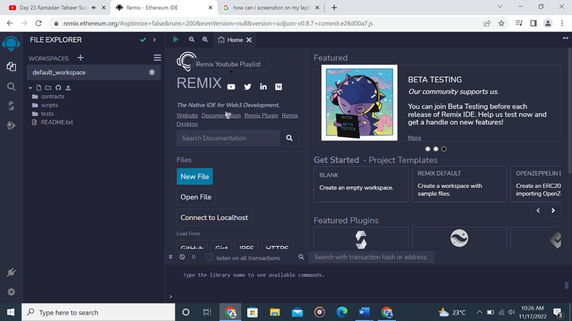
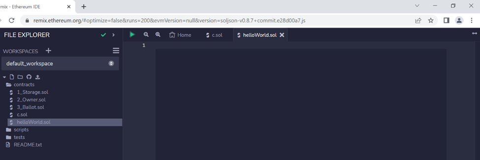
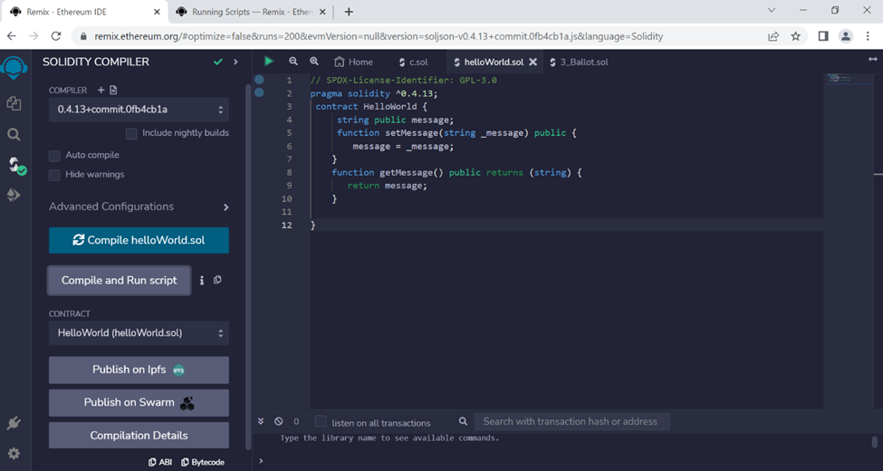

## Introduction

Remix is one of the online programs that can be used to write and deploy the Solidity Smart contract on the Ethereum Blockchain. It is a powerful tool that can also be used to debug and prevent errors in the Solidity contracts. In this article, I’ll show you how to use Remix for writing and deploying, debugging Solidity smart contracts, and how to enter some Solidity commands. This tutorial assumes you are familiar with the basics of blockchain, the Ethereum platform, and programming languages like JavaScript, Python, and C++. If you're ready to start coding, then let's get started!

## Background

Solidity is a contract-oriented programming high-level language for writing and deploying Smart Contracts on the Ethereum blockchain. It was designed to make it as user-friendly as possible by Gavin Wood—the co-founder of Ethereum.

## The Course Outline

Below is a list of what we’ll cover

💡 Types of Solidity Contracts

💡 Step by step of writing and running a Solidity Smart Contract on Remix

💡 Step by Step on Debugging Smart contract using Remix Debugger

💡 A glossary of some Solidity commands and how to run them

## Introduction to Remix IDE

To write and deploy a Solidity smart contract on Remix is a simple and interesting task if only the appropriate procedures are taken. Let’s take a practical step by writing and running a simple, smart contract as follows;

1. Go to [https://remix.ethereum.org/](https://remix.ethereum.org/).
2. A browser window will open displaying the Remix web-based development environment as below.



3) In the left column of the Remix window, expand the Solidity folder and then click on the Contracts folder.


4 In the right column of the Remix window, click on the New file button.



5. In the Name text box, enter HelloWorld. The name should end with .sol and not .tx



# HelloWorld Program in Solidity

The code below is a simple hello world code in Solidity Code.

```solidity
// SPDX-License-Identifier: MIT
pragma solidity ^0.4.13;

contract HelloWorld {
 string public message;
 function setMessage(string _message) public { message = _message; }
 function getMessage() public view returns (string) { return message; }
}
```

# What is Pragma in Solidity?

Pragma solidity is a compiler directive that tells the compiler which version of Solidity you are using so that you can identify any errors more quickly. In the example contract, we are using version 0.4.13. Some other versions are; 0.4.18; 0.5.0; 0.5.2; 0.5.4


# What is SPDX-License-Identifier?

The SPDX-License-Identifier (SPDX) is an open-source standard for communicating a software license and its associated metadata. SPDX allows developers, organizations, and legal teams to easily identify the exact license that applies to any given piece of software. SPDX eliminates the ambiguity in determining which licenses are most applicable to a project. SPDX reduces the risks and costly time associated with software license compliance. The Linux Foundation maintains SPDX. Some of the more common ones include:

💡 Apache 2.0: This identifier is used for software released under the Apache 2.0 license.

💡 GPLv2: This identifier is used for software released under the GNU General Public License, Version 2.

💡 MIT: This identifier is used for software released under the MIT license.

# Saving and Running Solidity Code in Remix

1. You should save the code for the HelloWorld contract using ctrl + s in the Remix window.
2. Click on the Run button in the upper-right corner of the Remix window to compile and run the HelloWorld contract. Ensure the Solidity compiler version correlates with the version of your Solidity.
3. And finally, deploy and run the HelloWorld contract.
4. The results of compiling and deploying the HelloWorld contract will be displayed in a log window at the bottom of the Remix window.
5. In the log window, you will see the following message: "Contract compiled successfully."

# **Steps by Steps on Debugging Smart contract using Remix Debugger**

If there are any errors in your code, they will be highlighted in red. If, for example, you typed

```solidity
{function add(uint x, uint y) returns (uint) { //returns x + y}}
```

This code will not work. You can use Remix debugger to correct the errors and recompile your contract until it looks like this:

```solidity
contract Example {
 function add(uint x, uint y) returns (uint) {
  //returns x + yl
 }
}
```

Here is how you can use Remix debugger to correct such errors and others.

- First, select the contract you want to debug from the Remix Editor.
- Next, select Debug from the menu. The Debugger will open in a new window.
- The Debugger has three main sections: Control Panel, Console, and Contract View.
- The Control Panel lets you control the execution of the contract.
- The Console displays the output of the contract.
- The Contract View shows the contract's source code and highlights any errors.
- Select the function that you want to debug.

```solidity
function add(uint x, uint y) returns (uint) {
 //returns x + y
 return x + y;
}
```

In the "Arguments" field, you will need to enter the input values for the function that you are debugging. If, for example, our Input value: is 5

The value 5 is input into the function add() , resulting in a value of 10 being output.

- To start debugging, click on the green arrow in the Control Panel.
- You can view the values of variables by hovering over them with your mouse.
- The contract will start executing, and the Debugger will start monitoring it.
- If an error occurs, the Debugger will highlight it in the Contract View and display the stack trace in the Console.
- You can then use the Console to investigate and fix the error.

# Solidity Language Features

## Contract

A contract is a collection of code (functionality) and data that resides on the blockchain. These contracts are written in Solidity, then compiled into bytecode, and later deployed to the network. And when a network is deployed, its code is executed by all nodes on the network.

Solidity declares a contract by specifying the contract keyword, followed by the contract's name and parameter list. Parameters can be of any type, including structs and arrays.

Here's an example of a Solidity contract declaration:

```solidity
//SPDX-license-Identifier: GPL-3.0
pragma solidity^0.4.13

contract MyContract {
 // everything else inside this block 😁😁
}
```

## Functions

Functions are the basic building blocks of contracts. A function has the following form:

```solidity
function name(argument_1, argument_2, ...) {
 // Body of the function
}
```

```solidity
function multiply(uint a, uint b) returns (uint c) {
 c = a * b;return c;
}
```

# **Data types**

There are six data types: uint, int, bool, string, address, and bytes32.

## Unsigned Integer (uint)

The unsigned integer (uint) is used to store unsigned integers (positive numbers) in solidity. The memory allocation of this data type can be tweaked by changing the number after it (in order of 8, 16, 24, …, 256) e.g., uint256 can store numbers from 0 - 2 ^ 256 - 1 while uint8 ranges from 0 to 2^8 -1. The type uint is an alias of uint256; It has a range that makes it suitable for representing values like token balances, exchange rates, and other numerical data.

```solidity
contract MyContract {
 uint256 public someNumber;

 function change() public {
  someNumber = 5;
 }
}
```

### Signed Integer (int)

The signed integer (int) can be used to store signed integers (negative and positive numbers) in solidity. Just like the uint, memory allocation of this data type can be tweaked by changing the number after it (in order of 8, 16, 24, …, 256) e.g., uint256 can store numbers from 2 ^ 255 - 2 ^ 255. The type int is an alias of int256.

```solidity
contract MyContract {
 int256 public someNumber;

 function change() {
  someNumber = -5;
 }
}
```

### Boolean (bool)

The boolean data type can be used to store either a true or false value. Booleans can be used in conditional statements, such as if statements. For example, the following code will only execute the second statement if the boolean is true:

```jsx
if (bool) {
  // Statements to execute if bool is true.
} else {
  // Statements to execute if bool is false.
}
```

Another example:

```solidity
contract Bool {
 bool public value;

 function setValue(bool newValue) {
  value = newValue;
 }

 function getValue() constant returns (bool) {
  return value;
 }
}
```

### String

A string is simply a series of characters enclosed in quotation marks.

```solidity
string sample = "this is a sample string";
```

### Address

An address is a 20-byte hexadecimal number that represents a participant on the Ethereum blockchain. The Address is generated by Remix like this:

```solidity
address myAddress = 0xA870daB9b7c72C3d9a7b728Ae6Bf1f359D5F2773; //
```

## Modifiers

Modifiers are a powerful tool in Solidity that allow you to control who can call a function and when they can call it. You can use a modifier, for example, to ensure that a function can only be called by the contract owner.

```solidity
pragma solidity ^0.5.0;

contract Abstract {
 function foo() public returns (uint256) {} // Abstract method
 function bar() public view returns (uint256) { // Abstract method with a defined body
  return 5;
 }
}
```

## Variable scoping

In Solidity, variables are scoped to the block in which they are declared. This means that a variable declared in one block can only be accessed by code in that block and its descendants. Let’s look at the contract that follows:

```solidity
pragma solidity ^0.4.24;

contract Test {
 uint public a = 1;
 function setA(uint x) public {
  a = x
 };

 function getA() public view returns (uint) {
  return a;
 }
}
```

## Contract naming conventions

To avoid collisions between different contracts on the blockchain, it is best practice to namespace your contracts using PascalCase. For example, HelloWorld would be a good name for a contract written by you. It is, however, also a common practice to prefix contracts with an organization or individual's name (e.g., MyCompanyContract).

## Inheritance

Inheritance is a key concept in object-oriented programming that allows you to create new classes that inherit the properties and methods of existing classes. This powerful tool can be used to create contracts that are more modular and easier to maintain.

You can create new contracts that share the same code and functionality by inheriting from an existing contract. This can save time and effort when writing and testing contracts. Additionally, it can help create a more organized and predictable codebase.

The existing contract is called the parent contract, and the new contract is called the child contract.

The child contract can access all members of the parent contract, including public and private members. It can also modify any members of the parent contract that it wants to.

To create a child contract, you need to specify the name of the parent contract in the constructor function:

```solidity
constructor(address _parent) public {
 require(_parent != 0x0);
 // prevent accidental creation of child contracts
}
```

When you create a child contract, Remix will automatically generate a set of function stubs for you. These function stubs allow the child contract to communicate with the parent contract.

The following code example shows how to use inheritance in Solidity:

```solidity
contract Parent {
 string name;
 // a basic data type
 function setName(string _name) {
  // a function that modifies data member
  name = _name;
  // sets name member to _name value
 }
}

contract Child is Parent {
 // declares Child as a sub-contract of Parent
 function getName() returns (string) {
  // returns string value stored in name member in Parent Contract
  return name;
  // returns name member from Parent Contract
 }
 // other functions defined here...
}
```

## Abstract Contracts

Abstract contracts are templates for contracts that can be inherited by other contracts. They allow you to define the interface for a contract without providing any implementation details. This is useful for creating libraries or reusable components.

```solidity
pragma solidity ^0.5.0;

contract Abstract {
 function foo() public returns (uint256) {} // Abstract method

 function bar() public view returns (uint256) { // Abstract method with a defined body
  return 5;
 }
}
```

# Libraries

Libraries are reusable components that can be used by multiple contracts. They provide a way to encapsulate functionality and avoid duplication of code. Libraries can also be versioned, allowing you to upgrade contracts without redeploying them.

To use a library in Solidity, you first need to import it. You can do this by adding the following line to your contract. You can then use the functions and variables defined in the library in your contract.

```solidity
library Token {
 function transfer(address to, uint amount) returns (bool success) {
  // Check that the sender has enough funds
  // Send the tokens to the given address
  // Return success or failure
 }
}
```

# Interfaces

An interface is a special type of contract that can be implemented by other contracts. It defines a set of methods that must be implemented by any contract that wants to implement it. This allows you to verify that a contract implements the required methods without inspecting the code itself.

Interfaces can be used to verify that a contract implements the required methods without having to inspect the code itself. To implement an interface, a contract must specify the name of the interface and the keyword "implements".

Interfaces are like abstract contracts but only provide an interface, not an implementation. This is useful for defining standards that other contracts can adhere to. For example, you could create an interface for a token contract that defines how tokens should be created, transferred, and destroyed.

For example, suppose you have the following code:

```solidity
contract A {
 function foo() public {};
}

contract B is A {
 function bar() public {}
}

// contract B can be seen as an interface that defines two functions, foo and bar. Contract C can then be defined as follows:contract C is B { function baz() public {} }
```

This will make C inherit both the foo and bar functions from contract B. The baz function will then override the bar function.

# Structs

Structs are data types that allow you to group related data. They are similar to objects in other programming languages but are immutable—meaning they cannot be changed after they have been created. Structs are often used to represent complex data types such as addresses or balances.

```solidity
struct Instructor {
 uint age;
 uint first_name;
 uint last_name;
}
```

## Enums

Enums are data types that define a set of named values. They can be used to create more expressive code and improve readability. Enums are often used to represent states or status codes. For example:

```solidity
enum DaysOfTheWeek {
 Sunday,
 Monday,
 Tuesday,
 Wednesday,
 Thursday,
 Friday,
 Saturday
}

contract DaysOfTheWeek {
 function toDays() public returns(uint) {
  return DaysOfTheWeek.Tuesday;
 }
}
```

## Events

Events are a way of logging information about contract activity so it can be easily accessed and queried later. Events can be used for debugging purposes or for tracking the progress of a contract's execution. Run Event command like this:

```solidity
event LogTask(address indexed sender, uint256 timestamp, string data);
```

## Loops

Loops commands are used to repeat a set of statements, often for a fixed number of times or until a condition is met. The most commonly used looping commands are for and while.

The for loop is used to repeat a set of statements a fixed number of times. The syntax for the for loop is as follows:

```solidity
for(initialization; condition; increment) {
 // Statements
}
```

The initialization expression sets the initial value of the loop counter. The condition expression checks whether the loop counter has reached the desired value. If it has not, the loop continues to execute the statements in the block body. The increment expression increments (or decrements) the loop counter by a given amount.

```solidity
while(condition) {
 // Statements
}
```

If the condition evaluates to true, the statements in the block body will be executed. If it evaluates to false, the loop will terminate.

## Conditional Statement

Solidity supports conditional statements, which allow you to execute certain code depending on the state of a variable. The most common conditional statement is the if-else statement, which looks like this:

```solidity
if (condition) {
 // Code to be executed if condition is true
} else {
 // Code to be executed if condition is false
}
```

# About the Author

Oyeniyi Abiola Peace (@iamoracle) is a blockchain software and full-stack developer with over five years of experience in JavaScript, Python, PHP, and Solidity. He is currently the CTO of DFMLab and a DevRel Community Moderator at the Celo Blockchain. When not building or teaching about blockchain, he enjoys reading and spending time with loved ones. You can check my blog at [iamoracle.hashnode.dev](iamoracle.hashnode.dev).
