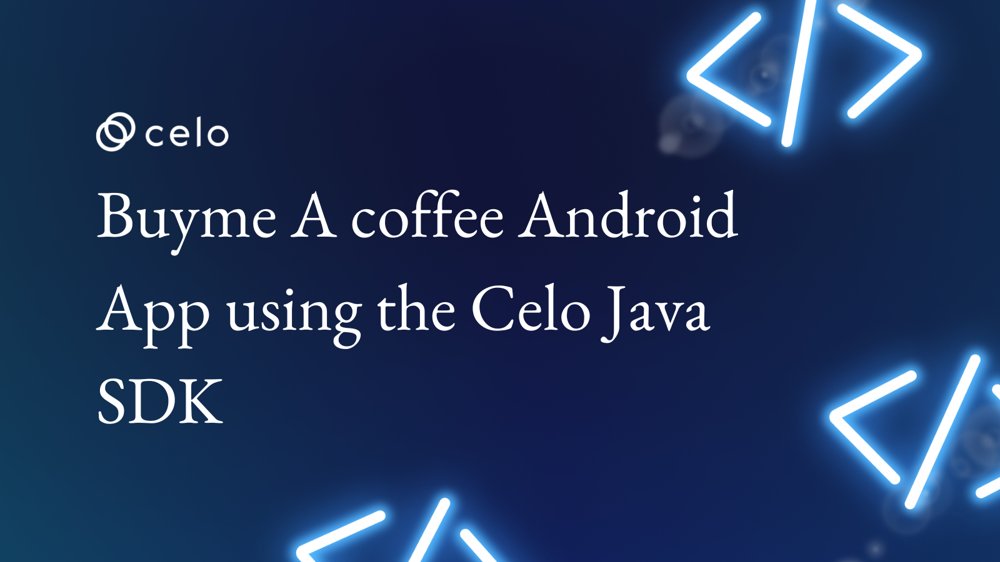

## Introduction​

This tutorial will show you how to create a simple Android app that allows users to make payments using the Celo Java SDK. The app, called "Buy Me A Coffee", will allow users to make a donation to any one of their choice using their Celo account. We will walk you through the process of setting up the Celo Java SDK and integrating it into your app, so you can start accepting payments in no time. By the end of this tutorial, you will have a working Android app that allows users to make payments using the Celo network.

He is a quick look at what we will build in this tutorial.

**Fig: 0-1** dApp UI

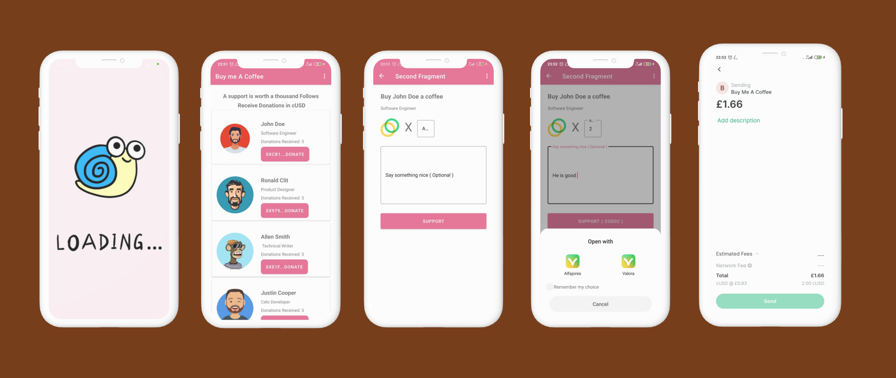

## Prerequisites​

To successfully follow this tutorial, you will need basic knowledge of blockchain technology and Android development.

- You will need to create five generated accounts using the celocli. To set this up, this guide will be helpful.

- To test the functionality of the Celo Java SDK you will need to have some test tokens. This can be gotten from the faucet.

## Requirements​

- Alfajores  Testnet Account - required to connect to the dApp and make test transactions.
- Android Studio - required to build an app that runs on an emulator or a physical android phone. To run the completed code, the minimum version of Android Studio 5.0 or newer and
- Java SDK version 11 or higher

## Workspace Setup and Configuration in Android Studio

To get started, your Android Studio should be up and running. Add all necessary dependencies to your app/build.gradle file. To start using the Celo Java SDK, here are the dependencies you would need.

```java
implementation 'io.github.gconnect:celo-sdk-java:0.0.2'
implementation 'org.web3j:core:5.0.0'
implementation 'de.hdodenhof:circleimageview:3.1.0'
```

[Celo Java SDK](https://central.sonatype.dev/artifact/io.github.gconnect/celo-sdk-java/0.0.2) - is a Java library for working with the Celo Blockchain, Contractkit and Celo Core Contracts.

[Web3j](https://docs.web3j.io/4.8.7/) is a highly modular, reactive, type-safe Java and Android library for working with Smart Contracts and integrating with clients (nodes) on the Ethereum network:

[Circleimageview](https://docs.web3j.io/4.8.7/) library is used for making an image circular.

## Create an Android project

Start up Android Studio and create a new Project. Select basic activity.

**Fig 1- 0:** Create New Project
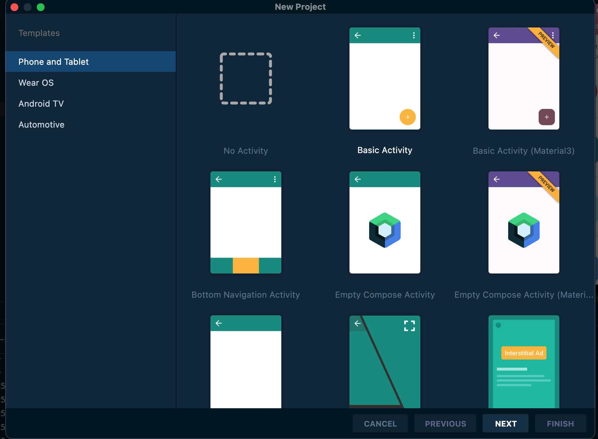

**Fig 1-1:** Create New Basic Activity
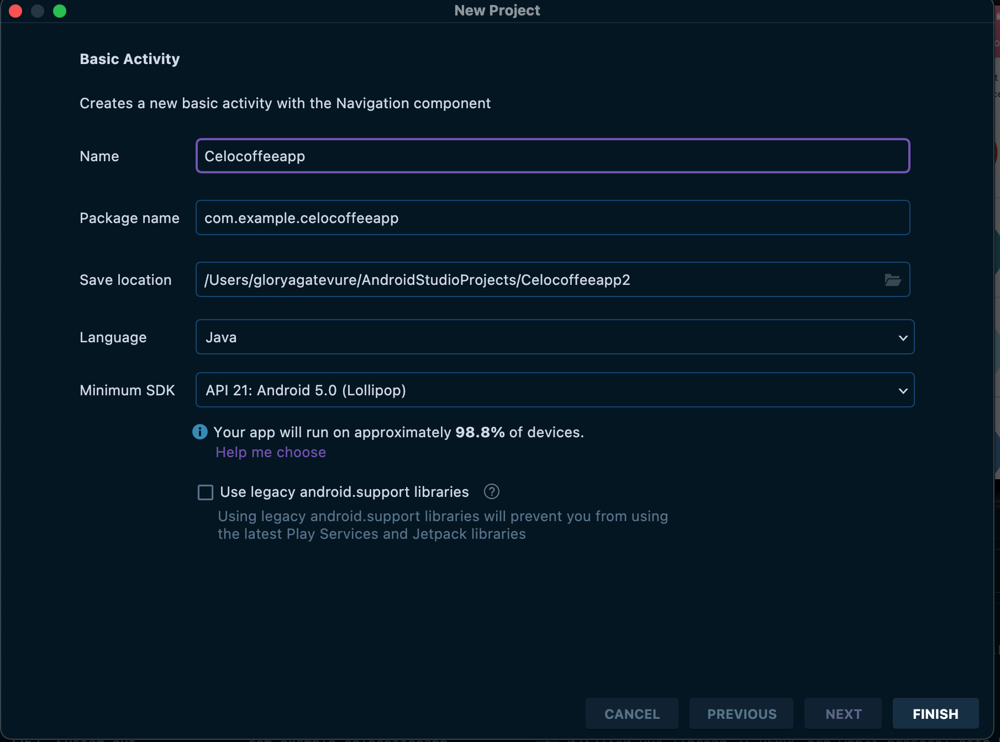

**Note:** Constant.java file holds the constants for the app.

## Account Creation

Celo provides us with several options to create an account. These include downloading the mobile wallet (Valora or Alfajores), and using Ganache and Celo CLI. For development purposes, any of these options will be good to easily create or generate Celo accounts. For this tutorial, we will use the Celo CLI to generate 5 Celo Testnet accounts. For more details on account creation, you can check the Celo Developer Doc for [Testnet Wallet Setup](https://docs.celo.org/developer/setup/wallet).

To set up the Celo CLI on your machine, follow this [guide](https://docs.celo.org/blog/tutorials/celo-cli-a-practical-guide-to-energize-your-celo-toolkit#introduction-to-the-celo-cli). After successful setup, from your terminal, run this command to create a new account.

`celocli account:new`

## Funding an Account

To fund your Celo Testnet account, copy the address of the wallet or from your generated account after running the above command. Simply go to the faucet and paste the address to get it funded. If you need more funds, paste your address in the input field and check the captcha and click on the get started button. That should get your account funded immediately.

**Fig 1-3:** Celo Faucet
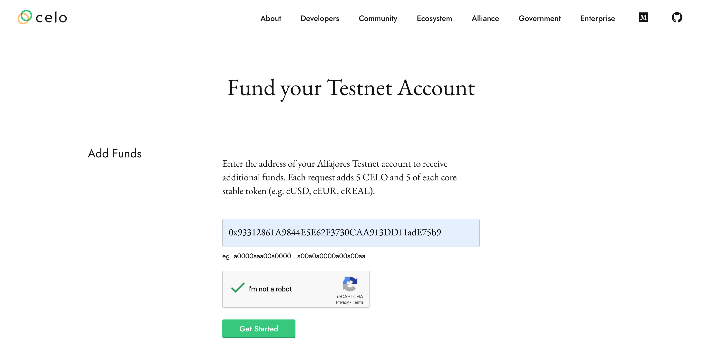

## Checking Account Balance

There are several ways to check your account balance. You can use the Celocli command, the Celo Java SDK or simply enter your account address in the Alfajores Celo Scan explorer.

Using the Celocli run this command to check account balance

`celocli account:balance 0x93312861A9844E5E62F3730CAA913DD11adE75b9`

Output should look like this 👇

**Fig 2-1:** Celocli Output
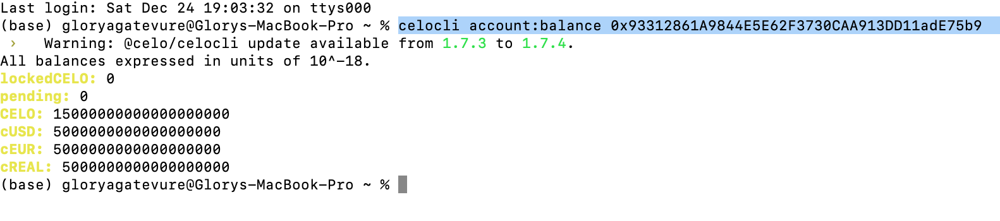

Checking balance using the [Alfajores Celo Scan explorer](https://alfajores.celoscan.io/address/0x93312861A9844E5E62F3730CAA913DD11adE75b9) output should look like this 👇

**Fig 2-2:** Alfajores Celo Scan explorer.
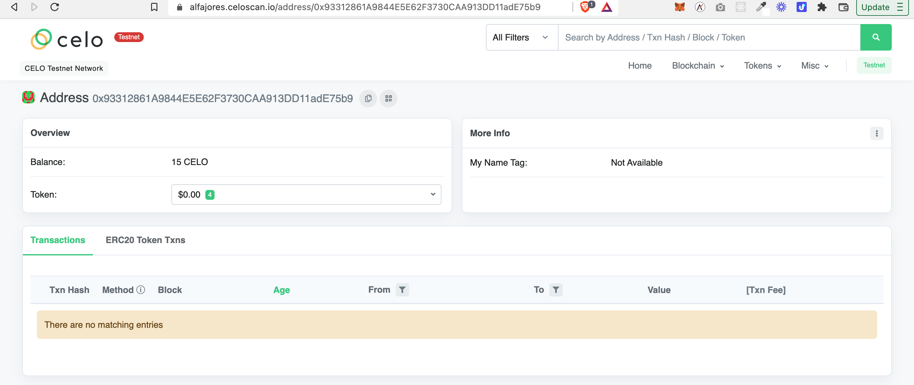

Checking balance using using the Celo Java-SDK required code snippet should look like this.👇

```java
ContractKit contractKit = ContractKit.build(new HttpService("https://alfajores-forno.celo-testnet.org"));
Web3j web3j = Web3j.build(new HttpService(ContractKit.ALFAJORES_TESTNET));

ContractKitOptions config = new ContractKitOptions.Builder()
       .setFeeCurrency(CeloContract.StableToken)
       .setGasPrice(BigInteger.valueOf(21_000))
       .build();
contractKit = new ContractKit(web3j, config);

// Multiple accounts can be added to the kit wallet. The first added account will be used by default.
contractKit.addAccount(Constant.somePrivateKey);

// To change default account to sign transactions
contractKit.setDefaultAccount(Constant.publicKey);

AccountBalance balance = contractKit.getTotalBalance(Constant.myAddress);
System.out.println("cUSD balance " + balance.cUSD);
System.out.println("Celo balance " + balance.CELO);
```

The above code snippet can be found in the FirstFragment.java file in the complete code of the  project repository.

**Note:**
This code should not be run on the main UI thread otherwise, the app will scratch. This is so because the above code requires making network calls.  To keep things simple, we are running the above code in a runnable thread.

The output will look like this 👇
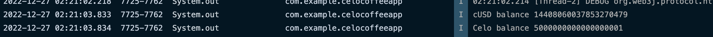

## Manifest.xml

Inside your manifest.xml file add network permission and network state. This will prevent the app from crashing. And it also notifies the app that internet connection is required.

```java
<uses-permission android:name="android.permission.INTERNET"/>
<uses-permission android:name="android.permission.ACCESS_NETWORK_STATE"/>
```

## Data Model, Data Source, Constant and Recyclerview Adapter

### Data Model

The **BeneficiaryModel.java** file handles the data model popularly called pojo. This defines the initial data object.

```java
package com.example.celocoffeeapp;

import android.os.Parcel;
import android.os.Parcelable;

public class BeneficiaryModel implements Parcelable {
   private int imgId;
   private String name;
   private String description;
   private String walletAddress;

   public BeneficiaryModel(int imgId, String name, String description,
                            String walletAddress) {
       this.imgId = imgId;
       this.name = name;
       this.description = description;
       this.walletAddress = walletAddress;
   }

   protected BeneficiaryModel(Parcel in) {
       imgId = in.readInt();
       name = in.readString();
       description = in.readString();
       walletAddress = in.readString();
   }

   public static final Creator<BeneficiaryModel> CREATOR = new Creator<BeneficiaryModel>() {
       @Override
       public BeneficiaryModel createFromParcel(Parcel in) {
           return new BeneficiaryModel(in);
       }

       @Override
       public BeneficiaryModel[] newArray(int size) {
           return new BeneficiaryModel[size];
       }
   };

   public String getDescription() {
       return description;
   }
   public void setDescription(String description) {
       this.description = description;
   }
   public int getImgId() {
       return imgId;
   }
   public void setImgId(int imgId) {
       this.imgId = imgId;
   }

   public String getName() {
       return name;
   }

   public void setName(String name) {
       this.name = name;
   }

   public String getWalletAddress() {
       return walletAddress;
   }

   public void setWalletAddress(String walletAddress) {
       this.walletAddress = walletAddress;
   }

   @Override
   public int describeContents() {
       return 0;
   }

   @Override
   public void writeToParcel(Parcel dest, int flags) {
       dest.writeInt(imgId);
       dest.writeString(name);
       dest.writeString(description);
       dest.writeString(walletAddress);
   }
}
```

## Constant

This handles constants and can be found in **constant.java** file.

```java
package com.example.celocoffeeapp;

public class Constant {
   static final String address1 = "0xCB1b7902253a02ac7F977d470681F518AcA362Fa";
   static final String address2 = "0x9799a1530Fc0f0A8FD4Ce036e8B0D99d22Ef9d5a";
   static final String address3 = "0xE1f35f42b09482C30e114C16b9F54d2033d79980";
   static final String address4 = "0x70E7249F304062cACc03A018f574B5C3d0b43466";
   static final String address5 = "0x2f3d7F1804c6A4A8dC8Df271848aA94240F9cdD5";
   static final String myAddress = "0xCb1fe4ABF5E3218f749095D4E950f39264F0485d";
   static final String somePrivateKey = "4dcc51d372e5a8303ddace99a625ecce8b7fcee4e6a88cbab4acc8f5fb39fea9";
   static final String publicKey = "03cbc12902c23a2287365d15a3a2f102f1e2ed5b8712dd0a7b44f797336bd7b50e";
   static final String someAddress = "0x93312861A9844E5E62F3730CAA913DD11adE75b9";
}
```

## Data Source

This is the local data source, used to populate the data in the recyclerview. The data source can be found in the **DataSource.java** file.

```java
package com.example.celocoffeeapp;

public class DataSource {
 public static BeneficiaryModel[] myListData = new BeneficiaryModel[] {
           new BeneficiaryModel(
                   R.drawable.img1,
                   "John Doe",
                   "Software Engineer",
                   Constant.address1
          ),
           new BeneficiaryModel(
                   R.drawable.img2,
                   "Ronald Clit",
                   "Product Designer",
                   Constant.address2
           ),
           new BeneficiaryModel(
                   R.drawable.img3,
                   "Allen Smith",
                   " Technical Writer",
                   Constant.address3
           ),
           new BeneficiaryModel(
                   R.drawable.img4,
                   "Justin Cooper",
                   "Celo Developer",
                   Constant.address4
           ),

           new BeneficiaryModel(
                   R.drawable.img5,
                   "Jane Doe",
                   "Dev Rel",
                   Constant.address5
           ),
   };
}
```

## Recyclerview Adapter

This handles the populating of the list. The Recyclerview adapter can be found in the **BeneficiaryAdapter.java** file.

```java
package com.example.celocoffeeapp;

import android.annotation.SuppressLint;
import android.content.Context;
import android.view.LayoutInflater;
import android.view.View;
import android.view.ViewGroup;
import android.widget.Button;
import android.widget.ImageView;
import android.widget.TextView;
import android.widget.Toast;

import androidx.constraintlayout.widget.ConstraintLayout;
import androidx.recyclerview.widget.RecyclerView;


public class BeneficiaryAdapter extends RecyclerView.Adapter<BeneficiaryAdapter.ViewHolder>{
   private BeneficiaryModel[] listdata;
   private Context context;
   private ItemClickListener itemClickListener;

   public BeneficiaryAdapter(ItemClickListener clicklistener, Context context, BeneficiaryModel[] listdata) {
       this.listdata = listdata;
       this.context = context;
       this.itemClickListener = clicklistener;
   }

   @Override
   public ViewHolder onCreateViewHolder(ViewGroup parent, int viewType) {
       LayoutInflater layoutInflater = LayoutInflater.from(parent.getContext());
       View listItem = layoutInflater.inflate(R.layout.beneficiary_list_item, parent, false);
       ViewHolder viewHolder = new ViewHolder(listItem);
       return viewHolder;
   }

   @Override
   public void onBindViewHolder(ViewHolder holder, @SuppressLint("RecyclerView") int position) {
       final BeneficiaryModel myListData = listdata[position];
       holder.imageView.setImageResource(listdata[position].getImgId());
       holder.name.setText(listdata[position].getName());
       holder.description.setText(listdata[position].getDescription());
holder.donation_received.setText(String.valueOf(String.format("Donations Received: %s", BeneficiaryAccountBalance.balance(position, listdata))));

       holder.button.setText(String.format(listdata[position].getWalletAddress().substring(0, 5) + "..."  + "%s" , "Donate"));
       holder.button.setOnClickListener(new View.OnClickListener() {
           @Override
           public void onClick(View view) {
               Toast.makeText(view.getContext(), "click on item: " + myListData.getName(), Toast.LENGTH_LONG).show();
               itemClickListener.onItemClicked(myListData);
           }
       });
   }

   @Override
   public int getItemCount() {
       return listdata.length;
   }

   public static class ViewHolder extends RecyclerView.ViewHolder {
       public ImageView imageView;
       public TextView name, description, donation_received;
       public Button button;
       public ConstraintLayout constraintLayout;

       public ViewHolder(View itemView) {
           super(itemView);
           this.imageView = (ImageView) itemView.findViewById(R.id.profile_image);
           this.name = (TextView) itemView.findViewById(R.id.name);
           this.description = (TextView) itemView.findViewById(R.id.description);
           this.donation_received = (TextView) itemView.findViewById(R.id.donations_received);
           this.button = (Button) itemView.findViewById(R.id.donateBtn);
           constraintLayout = (ConstraintLayout) itemView.findViewById(R.id.constraint);

       }
   }

   public interface ItemClickListener {
       public void onItemClicked(BeneficiaryModel listData);
   }
}
```

## Custom Method For Getting the Account Balance of Each of the Creators in the List

This method requires connecting to the Celo Afajores Testnet Network. To get the account balance for each of the recipients in the recyclerview. This can be found in the **BeneficiaryAccountBalance.java** file.

```java
package com.example.celocoffeeapp;

import org.celo.contractkit.CeloContract;
import org.celo.contractkit.ContractKit;
import org.celo.contractkit.ContractKitOptions;
import org.web3j.protocol.Web3j;
import org.web3j.protocol.http.HttpService;
import org.web3j.utils.Convert;

import java.math.BigDecimal;
import java.math.BigInteger;
import java.util.concurrent.Callable;
import java.util.concurrent.ExecutionException;
import java.util.concurrent.ExecutorService;
import java.util.concurrent.Executors;
import java.util.concurrent.Future;

public class BeneficiaryAccountBalance {
   public static BigDecimal balance(int position, BeneficiaryModel[] listdata) {
       ExecutorService executor = Executors.newSingleThreadExecutor();
       final BigInteger[] donationReceived = {BigInteger.valueOf(0)};

       Future<Long> result = executor.submit(new Callable<Long>() {
           @Override
           public Long call() throws Exception {
               // getting the balance of each of the address

               String listAddress = listdata[position].getWalletAddress();
               ContractKit contractKit = ContractKit.build(new HttpService("https://alfajores-forno.celo-testnet.org"));
               Web3j web3j = Web3j.build(new HttpService(ContractKit.ALFAJORES_TESTNET));
               ContractKitOptions config = new ContractKitOptions.Builder()
                       .setFeeCurrency(CeloContract.GoldToken)
                       .setGasPrice(BigInteger.valueOf(21_000))
                       .build();
               contractKit = new ContractKit(web3j, config);
               org.celo.contractkit.AccountBalance balance = null;
               try {
                   balance = contractKit.getTotalBalance(listAddress);
               } catch (Exception e) {
                   e.printStackTrace();
               }
               System.out.println("cUSD balance " + balance.cUSD);
               donationReceived[0] = balance.cUSD;
               return donationReceived[0].longValue();
           }
       });
       while (!result.isDone()) {
           try {
//                System.out.println("Waiting for the Future to complete ...");
               Long returnValue = result.get();
           } catch (InterruptedException e) {
               e.printStackTrace();
           } catch (ExecutionException e) {
               e.printStackTrace();
           }
       }

       return Convert.fromWei(donationReceived[0].toString(), Convert.Unit.ETHER);
   }
}
```

## FirstFragment.java

In the FirstFragment.java file, inside the onViewCreated add the below code snippet. This will populate the local datasource in the recyclerview.

```java
BeneficiaryModel[] myListData =  DataSource.myListData;

BeneficiaryAdapter adapter = new BeneficiaryAdapter(this,getContext(), myListData);
binding.recyclerview.setHasFixedSize(true);
binding.recyclerview.setLayoutManager(new LinearLayoutManager(getContext()));
binding.recyclerview.setAdapter(adapter);


binding.swipe.setOnRefreshListener(new SwipeRefreshLayout.OnRefreshListener() {
    @Override
    public void onRefresh() {
        binding.recyclerview.setHasFixedSize(true);
        binding.recyclerview.setLayoutManager(new LinearLayoutManager(getContext()));
        binding.recyclerview.setAdapter(adapter);
        binding.swipe.setRefreshing(false);

    }
```

Implement the ItemOnclickListener interface to the FirstFragment.java file. This will implement the onItemClicked method. Add the below code. This will enable clicking to the detail page.

```java
Bundle bundle = new Bundle();
bundle.putParcelable("data", listData);
System.out.println(listData);
NavHostFragment.findNavController(FirstFragment.this)
       .navigate(R.id.action_FirstFragment_to_SecondFragment, bundle );
```

## SecondFragment.java - Make Payment

Your detail page code snippet should look like this. This fragment handles the detail page of each of the creators/beneficiaries. This also handles payment using deeplink making interactions with the Valora or Alfajores wallet.

```java
package com.example.celocoffeeapp;

import static android.content.ContentValues.TAG;

import android.content.Intent;
import android.net.Uri;
import android.os.Bundle;
import android.text.Editable;
import android.text.TextWatcher;
import android.util.Log;
import android.view.LayoutInflater;
import android.view.View;
import android.view.ViewGroup;
import android.widget.Toast;

import androidx.annotation.NonNull;
import androidx.fragment.app.Fragment;

import com.example.celocoffeeapp.databinding.FragmentSecondBinding;

import java.util.Objects;

public class SecondFragment extends Fragment {

   private FragmentSecondBinding binding;
   private BeneficiaryModel model;
   String inputAmount;
   String inputComment;

   @Override
   public View onCreateView(
           LayoutInflater inflater, ViewGroup container,
           Bundle savedInstanceState
   ) {

       binding = FragmentSecondBinding.inflate(inflater, container, false);

       assert getArguments() != null;
       model = getArguments().getParcelable("data");
       String s = "Buy %s a coffee";
       binding.textviewName.setText(String.format(s, model.getName()));
       binding.textviewDescription.setText(model.getDescription());
       inputAmount = Objects.requireNonNull(binding.amountInput.getText()).toString().trim();
       inputComment = Objects.requireNonNull(binding.commentInput.getText()).toString().trim();

       binding.amountInput.addTextChangedListener(new TextWatcher() {
           public void afterTextChanged(Editable s) {
               // you can call or do what you want with your EditText here
               // yourEditText...
           }

           public void beforeTextChanged(CharSequence s, int start, int count, int after) {
           }

           public void onTextChanged(CharSequence s, int start, int before, int count) {
               System.out.println("text" + s);
               binding.buttonSecond.setText(new StringBuilder().append("Support ").append("( cUSD").append(s).toString() + " )");
               inputAmount = s.toString();
           }
       });


       binding.buttonSecond.setOnClickListener(new View.OnClickListener() {
           @Override
           public void onClick(View view) {
               if (inputAmount.isEmpty()) {
                   binding.amountLayout.setError("Field required!");
                   return;
               } else {
                   makePaymentWithCeloWallet();
               }
           }
       });
       return binding.getRoot();

   }

   public void onViewCreated(@NonNull View view, Bundle savedInstanceState) {
       super.onViewCreated(view, savedInstanceState);

   }

   @Override
   public void onDestroyView() {
       super.onDestroyView();
       binding = null;
   }

   public void makePaymentWithCeloWallet() {
       Thread thread = new Thread(new Runnable() {
           @Override
           public void run() {
               try {
                   String walletAddress = model.getWalletAddress();
                   String url = "celo://wallet/pay?address=" + walletAddress + "&displayName=Buy%20Me%20A%20Coffee&amount=" + inputAmount + "&comment=" + inputComment + "&token=cUSD&currencyCode=USD";
                   final Intent intent = new Intent(Intent.ACTION_VIEW);
                   intent.setData(Uri.parse(url));
                   startActivity(intent);
               } catch (Exception e) {
                   Log.i(TAG, "run: " + e);

                   getActivity().runOnUiThread(new Runnable() {
                       @Override
                       public void run() {
                           Toast.makeText(getContext(), "Valora app not installed, please install...", Toast.LENGTH_SHORT).show();
                       }
                   });
               }
           }
       });
       thread.start();
   }
}
```

**Fig: 3-1** Payment UI
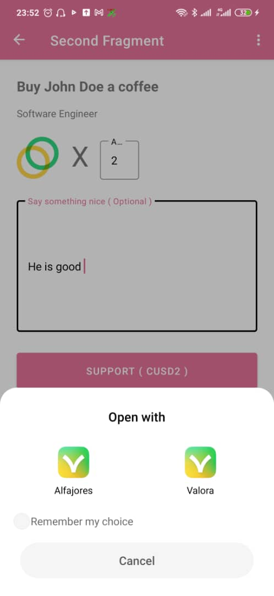
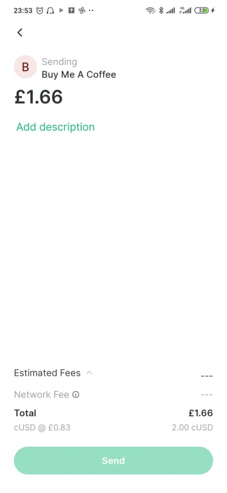

## Android Views

This consists of the XML files which handles the UIs.

Beneficiary List Item
The **beneficiary_list_item.xml** file is used in the BeneficiaryAdapter to display the List items. The UI looks like this 👇

**Fig 3-2** List Page
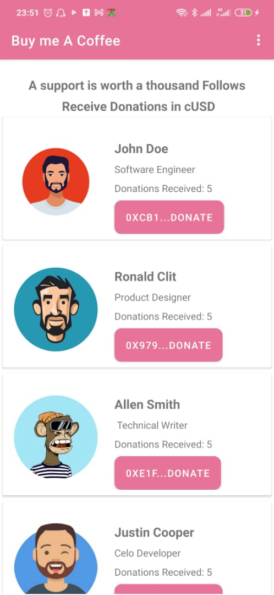

```java
<?xml version="1.0" encoding="utf-8"?>
<androidx.cardview.widget.CardView
   xmlns:android="http://schemas.android.com/apk/res/android"
   android:layout_width="match_parent"
   android:layout_height="wrap_content"
   android:layout_margin="4dp"
   >

   <androidx.constraintlayout.widget.ConstraintLayout
       android:layout_width="match_parent"
       android:layout_height="wrap_content"
       android:id="@+id/constraint"
       android:padding="8dp"
       xmlns:app="http://schemas.android.com/apk/res-auto">

       <de.hdodenhof.circleimageview.CircleImageView
           android:id="@+id/profile_image"
           android:layout_width="120dp"
           android:layout_height="120dp"
           android:layout_marginLeft="8dp"
           android:layout_marginTop="24dp"
           app:layout_constraintLeft_toLeftOf="parent"
           app:layout_constraintTop_toTopOf="parent"/>

       <TextView
           android:id="@+id/name"
           android:layout_width="wrap_content"
           android:layout_height="wrap_content"
           app:layout_constraintTop_toTopOf="parent"
           app:layout_constraintLeft_toRightOf="@id/profile_image"
           android:layout_marginLeft="24dp"
           android:layout_marginTop="24dp"
           android:textSize="18sp"
           android:textStyle="bold"
           />

       <TextView
           android:id="@+id/description"
           android:layout_width="wrap_content"
           android:layout_height="wrap_content"
           app:layout_constraintTop_toBottomOf="@id/name"
           app:layout_constraintLeft_toLeftOf="@id/name"
           android:layout_marginTop="8dp"

           />

       <TextView
           android:id="@+id/donations_received"
           android:layout_width="wrap_content"
           android:layout_height="wrap_content"
           android:layout_marginTop="8dp"
           app:layout_constraintTop_toBottomOf="@id/description"
           app:layout_constraintLeft_toLeftOf="@id/description"
           />

       <com.google.android.material.button.MaterialButton
           android:id="@+id/donateBtn"
           android:layout_width="wrap_content"
           android:layout_height="wrap_content"
           android:text="Donate"
           app:cornerRadius="16dp"
           android:textColor="@color/white"
           android:layout_marginTop="8dp"
           app:layout_constraintTop_toBottomOf="@id/donations_received"
           app:layout_constraintLeft_toLeftOf="@id/donations_received"
           android:background="@drawable/button"
           android:paddingLeft="16dp"
           android:paddingRight="16dp"
           />
   </androidx.constraintlayout.widget.ConstraintLayout>
</androidx.cardview.widget.CardView>
```

fragment_first.xml

```java
<?xml version="1.0" encoding="utf-8"?>
<androidx.constraintlayout.widget.ConstraintLayout
   xmlns:android="http://schemas.android.com/apk/res/android"
   xmlns:app="http://schemas.android.com/apk/res-auto"
   xmlns:tools="http://schemas.android.com/tools"
   android:layout_width="match_parent"
   android:layout_height="match_parent"
   tools:context=".FirstFragment">

   <TextView
       android:id="@+id/textview_first"
       android:layout_width="wrap_content"
       android:layout_height="wrap_content"
       android:text="@string/hello_first_fragment"
       android:textSize="18sp"
       android:textStyle="bold"
       android:lineHeight="30sp"
       android:letterSpacing="0.01"
       android:layout_marginTop="24dp"
       android:textAlignment="center"
       app:layout_constraintTop_toTopOf="parent"
       app:layout_constraintEnd_toEndOf="parent"
       app:layout_constraintStart_toStartOf="parent"
      />
<androidx.swiperefreshlayout.widget.SwipeRefreshLayout
   android:id="@+id/swipe"
   android:layout_width="wrap_content"
   android:layout_height="wrap_content"
   app:layout_constraintEnd_toEndOf="parent"
   app:layout_constraintStart_toStartOf="parent"
   app:layout_constraintTop_toBottomOf="@id/textview_first"
   >

   <androidx.recyclerview.widget.RecyclerView
       android:id="@+id/recyclerview"
       android:layout_width="match_parent"
       android:layout_height="match_parent"
       android:layout_marginTop="60dp"
       tools:listitem="@layout/beneficiary_list_item"
       app:layout_constraintEnd_toEndOf="parent"
       app:layout_constraintStart_toStartOf="parent"
       app:layout_constraintTop_toBottomOf="@id/swipe"
       android:paddingBottom="80dp"
       />

</androidx.swiperefreshlayout.widget.SwipeRefreshLayout>

</androidx.constraintlayout.widget.ConstraintLayout>
```

fragment_second.xml
This is the detail fragment. And the UI looks like this

**Fig 3-3** Detail Page
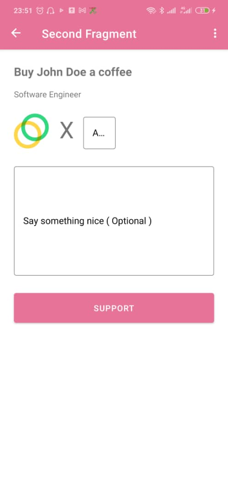

```java
<?xml version="1.0" encoding="utf-8"?>
<androidx.constraintlayout.widget.ConstraintLayout xmlns:android="http://schemas.android.com/apk/res/android"
   xmlns:app="http://schemas.android.com/apk/res-auto"
   xmlns:tools="http://schemas.android.com/tools"
   android:layout_width="match_parent"
   android:layout_height="match_parent"
   tools:context=".SecondFragment">

   <TextView
       android:id="@+id/textview_name"
       android:layout_width="wrap_content"
       android:layout_height="wrap_content"
       android:text="@string/buycoffee"
       android:layout_margin="24dp"
       android:textSize="20sp"
       android:textStyle="bold"
       app:layout_constraintLeft_toLeftOf="parent"
       app:layout_constraintTop_toTopOf="parent" />

   <TextView
       android:id="@+id/textview_description"
       android:layout_width="wrap_content"
       android:layout_height="wrap_content"
       android:text="description"
       android:layout_marginTop="16dp"
       app:layout_constraintLeft_toLeftOf="@id/textview_name"
       app:layout_constraintTop_toBottomOf="@id/textview_name" />

   <androidx.appcompat.widget.AppCompatImageView
       android:id="@+id/textview_icon"
       android:layout_width="60dp"
       android:layout_height="60dp"
       android:src="@drawable/img"
       app:layout_constraintLeft_toLeftOf="@id/textview_description"
       app:layout_constraintTop_toBottomOf="@id/textview_description"
       android:layout_marginTop="24dp"
       />

   <TextView
       android:id="@+id/textview_x"
       android:layout_width="wrap_content"
       android:layout_height="wrap_content"
       android:text="X"
       android:textSize="40sp"
       android:layout_marginTop="24dp"
       android:layout_marginLeft="18dp"
       app:layout_constraintLeft_toRightOf="@id/textview_icon"
       app:layout_constraintTop_toBottomOf="@id/textview_description" />

   <com.google.android.material.textfield.TextInputLayout
       android:id="@+id/amount_layout"
       android:layout_width="wrap_content"
       android:layout_height="wrap_content"
       android:layout_marginLeft="16dp"
       android:layout_marginTop="24dp"
       style="@style/MyTextInputLayout"
       app:layout_constraintLeft_toRightOf="@id/textview_x"
       app:layout_constraintTop_toBottomOf="@id/textview_description"
       >
       <com.google.android.material.textfield.TextInputEditText
           android:id="@+id/amount_input"
           android:hint="Amount"
           android:textColor="@color/black"
           android:inputType="numberDecimal"
           android:layout_width="wrap_content"
           android:layout_height="wrap_content"
          />
   </com.google.android.material.textfield.TextInputLayout>

   <com.google.android.material.textfield.TextInputLayout
       android:id="@+id/comment_layout"
       android:layout_width="match_parent"
       android:layout_height="wrap_content"
       android:layout_margin="24dp"
       style="@style/MyTextInputLayout"
       app:layout_constraintLeft_toLeftOf="@id/textview_icon"
       app:layout_constraintTop_toBottomOf="@id/amount_layout"
       >
       <com.google.android.material.textfield.TextInputEditText
           android:id="@+id/comment_input"
           android:layout_width="match_parent"
           android:layout_height="wrap_content"
           android:inputType="textMultiLine"
           android:lines="8"
           android:textColor="@color/black"
           android:maxLines="10"
           android:scrollbars="vertical"
           android:hint="Say something nice ( Optional )"
           />
   </com.google.android.material.textfield.TextInputLayout>
   <Button
       android:id="@+id/button_second"
       android:layout_width="match_parent"
       android:layout_height="wrap_content"
       android:text="@string/support"
       android:layout_margin="24dp"
       android:padding="16dp"
       app:layout_constraintEnd_toEndOf="parent"
       app:layout_constraintStart_toStartOf="parent"
       app:layout_constraintTop_toBottomOf="@id/comment_layout" />

   <ProgressBar
       android:id="@+id/progress"
       android:layout_width="wrap_content"
       android:layout_height="wrap_content"
       app:layout_constraintEnd_toEndOf="parent"
       app:layout_constraintStart_toStartOf="parent"
       app:layout_constraintBottom_toBottomOf="parent"
       app:layout_constraintTop_toTopOf="parent"
       android:visibility="gone"
       />
</androidx.constraintlayout.widget.ConstraintLayout>
```

## Interacting and Logging Output of the Celo Java SDK Contract Kit

The below code snippet can be found in **FirstFragment.java** file. To test the functionalities of the code, we will be logging and displaying the output in a screenshot.

```java
// deploy contract
                   GoldToken deployedGoldenToken = null;
                   try {
                       deployedGoldenToken = contractKit.contracts.getGoldToken().deploy().send();
                   } catch (Exception e) {
                       e.printStackTrace();
                   }
//
//                    // Get transaction receipt
                   TransactionReceipt receipt = null;
                   if (android.os.Build.VERSION.SDK_INT >= android.os.Build.VERSION_CODES.N)
                       receipt = Objects.requireNonNull(deployedGoldenToken).getTransactionReceipt().get();
                   if (receipt != null) {
                       String hash = receipt.getTransactionHash();
                       System.out.println("hash " + hash);
                   }

                   //Buying celo with cusd
                   ExchangeWrapper exchange = contractKit.contracts.getExchange();
                   StableTokenWrapper stableToken = contractKit.contracts.getStableToken();
                   GoldTokenWrapper goldToken = contractKit.contracts.getGoldToken();
                   System.out.println( "gold token" + goldToken);

                   BigInteger cUsdBalance = stableToken.balanceOf(Constant.myAddress).send();
                   System.out.println( "cUsdBalance " + cUsdBalance);

                   TransactionReceipt approveTx = stableToken.approve(exchange.getContractAddress(), cUsdBalance).send();
                   String approveTxHash = approveTx.getTransactionHash();
                   System.out.println( "Approve stabletoken Hash" + approveTxHash);

                   BigInteger goldAmount = exchange.quoteUsdSell(cUsdBalance).send();
                   System.out.println("goldAmount" + goldAmount);

TransactionReceipt sellTx = exchange.sellDollar(cUsdBalance, goldAmount).send();
String sellTxHash = sellTx.getTransactionHash();
System.out.println( "Exchange Hash" + sellTxHash);

//                    Interacting with CELO & cUSD
                   GoldTokenWrapper goldtoken = contractKit.contracts.getGoldToken();
                   BigInteger goldBalance = goldtoken.balanceOf(Constant.myAddress);
                   System.out.println( "goldBalance " + Convert.fromWei(goldBalance.toString(), Convert.Unit.ETHER));

//                    Send GoldToken fund
                   BigInteger oneGold = Convert.toWei(BigDecimal.ONE, Convert.Unit.ETHER).toBigInteger();
                   TransactionReceipt tx = goldtoken.transfer(Constant.someAddress, oneGold).send();
                   String hash = tx.getTransactionHash();
                   System.out.println( "trans hash " + hash);

                   // Contract Addresses
                   String goldTokenAddress = contractKit.contracts.addressFor(CeloContract.GoldToken);
                   System.out.println("goldAddress " + goldTokenAddress);


                   CeloRawTransaction tx1 = CeloRawTransaction.createCeloTransaction(
                           BigInteger.ZERO,
                           GAS_PRICE,
                           GAS_LIMIT,
                           Constant.someAddress,
                           BigInteger.ONE,
                           contractKit.contracts.addressFor(CeloContract.StableToken),
                           null,
                           null
                   );
                   EthSendTransaction receipt1 = contractKit.sendTransaction(tx1, Constant.myAddress);
                   System.out.print( "reeipt1 " + (receipt1 != null ? receipt1.getTransactionHash() : null));
                   Log.i(TAG, "receipt1 " + gson.toJson(receipt1, EthSendTransaction.class ));
```

**Fig 3-4** Output
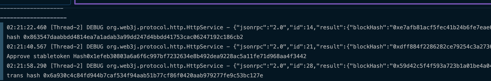

## Conclusion​

 Congratulations on finishing this tutorial! Thank you for taking the time to complete it. In this tutorial, you have learned how to create an Android dApp from scratch using the Celo SDk-Java and how to handle deep linking to connect to the Valora or Alfajores wallet to make payments.

To have access to the full codebase, here is the link to the project repo on [github](https://github.com/gconnect/Buyme-A-Coffee-Celo-Dapp).

## About the Author​

Glory Agatevure is a blockchain engineer, technical writer, and co-founder of Africinnovate. You can connect with me on [Linkedin](https://www.linkedin.com/in/glory-agatevure-47a222ab/), [Twitter](https://twitter.com/agatevureglory) and [Github](https://github.com/gconnect/).

## References​

- <https://docs.celo.org/developer/walkthrough/hello-contract-remote-node>
- <https://docs.celo.org/blog/tutorials/celo-cli-a-practical-guide-to-energize-your-celo-toolkit#introduction-to-the-celo-cli>
- <https://docs.celo.org/developer/setup/wallet>
- <https://github.com/valora-inc/wallet/blob/main/docs/deeplinks.md>
- <https://github.com/blaize-tech/celo-sdk-java>
