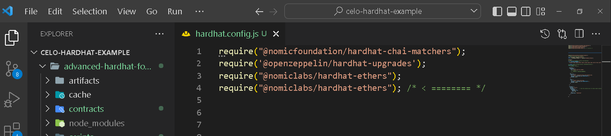
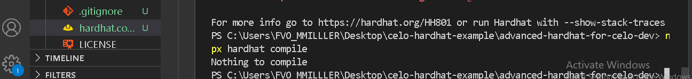
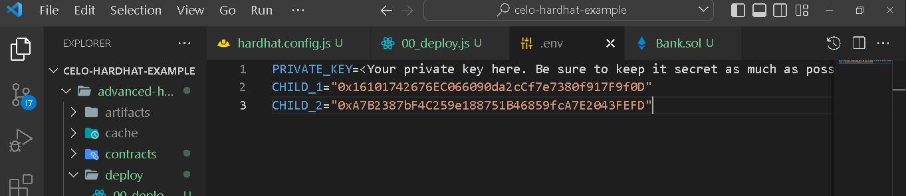
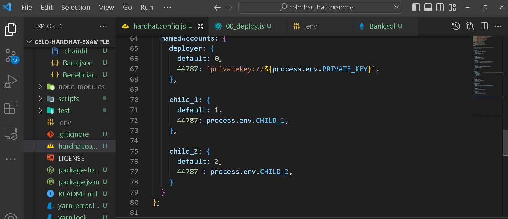
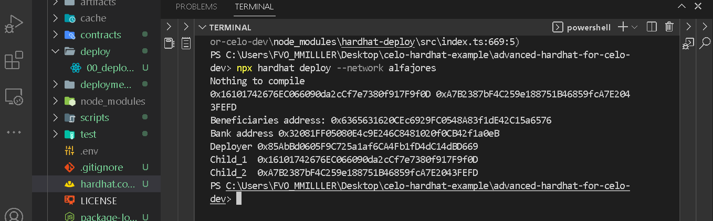
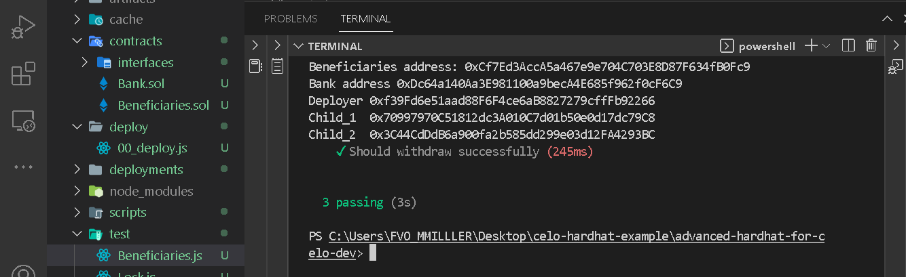
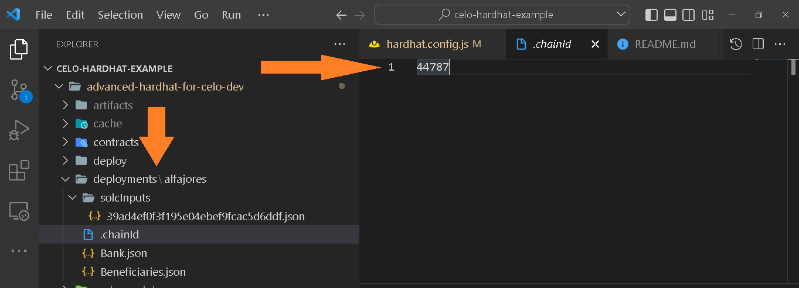

## Introduction

As a web3 developer, you know you move up the ladder when your productivity speed increases. Being productive is not only measured in how fast you can deliver but in conjunction with how secure and usable your application is, which largely depends on how well you are familiar with using sophisticated tools. While Celo unpacks and unfolds the web3 mysteries enabling you to focus on logic to build user-centric applications, your part as the developer is knowing how to use these tools to increase your productivity level.

## Prerequisites​

This tutorial focuses on advance practical methods of configuring and using Hardhat. so you should:

- Know how to set up a basic Hardhat project. Please complete the previous example tutorial [here](https://github.com/celo-org/docs/blog/08-12-2022-getting-started-on-celo-with-hardhat) as we’ll also make use of the previous example [here](https://github.com/bobeu/advanced-hardhat-for-celo-dev). Clone the project, and navigate to the project directory.

```bash
git clone https://github.com/bobeu/advanced-hardhat-for-celo-dev.git
cd advanced-hardhat-for-celo-dev
```

## Requirements​

To get started, ensure you have the following tools installed on the machine:

- Code editor. VSCode recommended.
- NodeJs version >=14.0.0.

> Note: I am using Node version "18.12.1"

## Hardhat plugins

Continuing from the last tutorial, we will install a few plugins to improve the deployment of the Lock contract to Celo networks and solidify testing.

An important highlight of Hardhat is the plugins that are external to Hardhat itself. Even though Hardhat comes with some default plugins, you can always override them to use what’s best for your needs. We will discuss some of the external programs - relevant plugins, or the plugins you most likely need. However, this does not include plugins that weren't built before this article was written. During Hardhat installation, If you choose to install the sample project to enable support for waffle tests, “hardhat-waffle” and “hardhat-ethers” are installed alongside “@nomicfoundation/hardhat-toolbox”. As a Celo developer using hardhat, you’ll mostly be running tasks which is a function of the “Hardhat Runner” - a CLI for interacting with Hardhat. Each time you run a Hardhat command from the CLI e.g. “npx hardhat compile”, you’re simply running a task.

Using plugins with Hardhat is one flexibility advantage over Truffle, which simply extends the Hardhat Runtime Environment - HRE . Some of them are in-built, while others are built by the community. Now, let’s examine some of the higher-level libraries rather called _plugins_, and how to integrate and use them.

- @nomicfoundation/hardhat-toolbox
- @nomicfoundation/hardhat-chai-matchers
- @openzeppelin/hardhat-upgrades
- @nomiclabs/hardhat-ethers
- @typechain/hardhat
- Hardhat-deploy
- Hardhat-react

Under the hood, these plugins extend Hardhat functionalities by extending the config file.
Example:

```bash
extendEnvironment((hre) => {
  const Web3 = require("ethers");
  hre.Web3 = Web3;

  hre.web3 = new Web3(hre.network.provider);
});
```

Hardhat lets you add instances of these tools to its environment object by installing and initializing them once in "hardhatconfig.js". Soon as they feature in the Hardhat global variables, they’ll be available for use across every Hardhat component. Firstly, we will install and configure the plugins we need, then we will apply the usage.

> Note: Hardhat components are files/folders within Hardhat context i.e. within the scope of its reach, such as “test” folder.

## @nomicfoundation/hardhat-toolbox

A set of coordinated tools developed and recommended by the hardhat officials that bundles the commonly used packages and plugins. When you initialize a hardhat project, “@nomicfoundation/hardhat-toolbox” will be the default umbrella package that houses other tools such as “@nomiclabs/hardhat-etherscan”, “@nomiclabs/hardhat-ethers” etc. Importing the library alongside the pre-installed tools will only make them redundant.

Even though you can do a lot with this plugin, yet you’re limited to the extent of its scope. When you need to make use of other plugins, it is advisable to remove “@nomicfoundation/hardhat-toolbox” from the configuration before proceeding to avoid dependency conflicts.

```bash
@nomicfoundation/hardhat-chai-matchers
```

This is a Hardhat component that blends Ethereum-specific functionalities with the Chai assertion library to make testing smart contracts more easy, readable, and concise. The recent version of Hardhat comes with “@nomicfoundation/hardhat-toolbox” so you do not need to install it. If you like to set things up independently, please continue with this section.

This plugin depends on other libraries or packages to function as intended. You will install it as a peer/dev dependency along with the peer packages if you’re using an older version of Node.

Peer dependencies

- chai
- @nomiclabs/hardhat-ethers
- ethers

```bash
npm install --save-dev @nomicfoundation/hardhat-chai-matchers chai @nomiclabs/hardhat-ethers ethers
```

Or

```bash
yarn add --dev @nomicfoundation/hardhat-chai-matchers chai @nomiclabs/hardhat-ethers ethers
```

Include it in the Hardhat config file:

```js
require("@nomicfoundation/hardhat-chai-matchers")
```

```typescript
import "@nomicfoundation/hardhat-chai-matchers";
```

## @openzeppelin/hardhat-upgrades

This tool reduces your tasks when writing upgradeable contracts by modifying Hardhat scripts adding new functions that enable you to deploy and manage proxied contracts, so anytime you release a new version of your dApp, you only need a minimal command to update it, and your users can start interacting with the newer version.
If you’re looking for a tutorial on how to write upgradeable contracts, [this blogpost](https://docs.celo.org/blog/tutorials/how-to-create-an-upgradeable-smart-contract-in-celo) might be helpful.

Openzeppelin/hardhat-upgrades depend on etherjs library as peer dependency to function properly. We will install it as a dev dependency. alongside the peer.

```bash
npm install --save-dev @nomiclabs/hardhat-ethers ethers
```

Activate it in "hardhatconfig.js":

```js
require("@nomicfoundation/hardhat-chai-matchers");
require("@openzeppelin/hardhat-upgrades");        /* < ======== */
```

## @nomiclab/hardhat-ethers

This is an official plugin from the Nomic Foundation that wraps the Ethereum library (Etherjs), abstracts the complexities and provides you with a hardhat-configured version for easy interaction with Ethereum-compatible blockchains without creating additional tasks. It depends on the "ether.js" library and works very well with versions from v5.0.0 and above, it adds ethers objects to the Hardhat environment using the same APIs as ether.js .

It adds helpful functionalities to the ethers object which you need to be aware of, such as

- Libraries interface,
- FactoryOptions interface,
- deployContract()
- getContractFactory(),
- getSigners() etc.

The return value of each of the helper functions (_Contracts_ and _ContractFactory_) are by default connected to the first signer returned by the "getSigners()" API.

```bash
npm install --save-dev "@nomiclabs/hardhat-ethers" "ethers@^5.0.0"
```

Include it in the configuration file:

```js
require('@nomicfoundation/hardhat-chai-matchers')
require('@openzeppelin/hardhat-upgrades')
require('@nomiclabs/hardhat-ethers') /* < ======== */
```

## @typechain/hardhat

Of all mentioned plugins, this is the easiest as it adds Typescript support for smart contracts at compile time. It generates Typescript binding you will need in your test and/or frontend if you use Typescript in your project. This might be very helpful if your project features Typescript, but since this tutorial is based on Javascript, we will only jump over it.

```bash
npm install --save-dev typechain "@typechain/hardhat" "@typechain/ethers-v5"
```

## Hardhat-deploy

If you need a more elegant deployment method (aside from using the `scripts/<somefile>` method) that keeps track of all the networks your contracts are deployed to, can also replicate same in your testing environment, “Hardhat-deploy” is the tool you need. In fact, it is one of the plugins I love using. It has interesting features that make your work much easier by adding and modifying existing hardhat tasks. An example task is “deploy”. Before installing hardhat-deploy, if you try to run “npx hardhat deploy”, you get a warning that there is no such task. By adding the tool, the task becomes available.

With this tool, you can write more straightforward tests, assign custom names to addresses to make tracking the address deployed that contract easier, track networks, etc.
Here are some of its features, all for a better developer experience as itemized in the documentation:

- Chain configuration export.
- It enables deterministic deployments across selected networks.
- It enhances library linking at the time of deployment.
- Developers are able to create specific deploy scripts per network.
- Deployment retrying (by saving pending transactions): and you can feel confident when making deployment since you can always recover them.
- It lists deployed contracts’ information i.e. contracts’ addresses and abis. This is useful for web applications.
- It allows you to only deploy what is needed.
- Support for openzeppelin transparent proxies. You are able to make proxy deployments with the ability to upgrade them transparently, only if code changes.

For more of the features, please refer to the [documentation](https://www.npmjs.com/package/hardhat-deploy).

The following command installs "hardhat-deploy" together with peer dependencies - "ethers.js" and “hardhat-ethers” and ensures compatibility:

```bash
npm install --save-dev  @nomiclabs/hardhat-ethers@npm:hardhat-deploy-ethers ethers
```

If you use the above command, in your config file, you will need to write **require("@nomiclabs/hardhat-ethers")** instead of **require("hardhat-deploy-ethers")**



Since we’d already installed “ether” and **“nomiclabs/hardhat-ethers”**, we only need to install **“hardhat-deploy-ethers”**.

```bash
npm install -D hardhat-deploy

```

Or

```bash
yarn add --dev hardhat-deploy

```

Then activate in hardhat file:

```js
require("@nomicfoundation/hardhat-chai-matchers");
require('@openzeppelin/hardhat-upgrades');
require("@nomiclabs/hardhat-ethers");
require("hardhat-deploy"); /* < ======== */
```

## Hardhat-react

A hardhat plugin for react application. When run, it generates react hook components from your smart contract that is hot-loaded into your React application. It could also be helpful where your application uses Typescript, as everything is typed and initialized for you. It automatically hooks into “hardhat-deploy” when you run “npx hardhat node --watch“ and you can alway run it manually with “npx hardhat react” .

It uses the following peer plugins to maximize results:

- hardhat
- hardhat-deploy
- hardhat-deploy-ethers
- hardhat-typechain
- ts-morph
- ts-node
- typescript
- ts-generator
- typechain@4.0.0
- @typechain/ethers-v5

Interestingly, you can install all of the dependencies with just one command.

```bash
npm install --save-dev hardhat hardhat-deploy hardhat-deploy-ethers hardhat-typechain hardhat-typechain ts-morph ts-node typescript ts-generator typechain@4.0.0 @typechain/ethers-v5
```

Yarn

```bash
yarn add --dev hardhat hardhat-deploy hardhat-deploy-ethers hardhat-typechain hardhat-typechain ts-morph ts-node typescript ts-generator typechain@4.0.0 @typechain/ethers-v5
```

Import them to hardhat.

```js
require("@nomicfoundation/hardhat-chai-matchers");
require('@openzeppelin/hardhat-upgrades');
require("@nomiclabs/hardhat-ethers");
require('hardhat-deploy');
require("@nomiclabs/hardhat-ethers");
require("hardhat-deploy-ethers");
require("hardhat-deploy");
require("@symfoni/hardhat-react");
require("hardhat-typechain");
require("@typechain/ethers-v5");

```

Now that we have installed all the tools we need, let’s discuss how we can use them in our Celo application. At the top of your "hardhatconfig.js" file, you should have the following set of imports and configurations.

```js
require("@nomicfoundation/hardhat-toolbox");
require("@nomicfoundation/hardhat-chai-matchers");
require("@openzeppelin/hardhat-upgrades");
require("@nomiclabs/hardhat-ethers");
require("hardhat-deploy");
require("@nomiclabs/hardhat-ethers");
require("hardhat-deploy-ethers");
require("hardhat-deploy");
require("@symfoni/hardhat-react");
require("hardhat-typechain");
require("@typechain/ethers-v5");
const {config} = require("dotenv");
const { extendEnvironment } = require("hardhat/config");

config();

/** @type import("hardhat/config").HardhatUserConfig */
module.exports = {
  networks: {
    localhost: {
      url: "http://127.0.0.1:8545",
    },
    alfajores: {
      url: "https://alfajores-forno.celo-testnet.org",
      accounts: [`${process.env.PRIVATE_KEY}`],
      chainId: 44787,
    },

    celo: {
      url: "https://forno.celo.org",
      accounts: [`${process.env.PRIVATE_KEY}`],
      chainId: 42220,
    },

  },

  solidity: {
    version: "0.8.9",
    settings: {          // See the solidity docs for advice about optimization and evmVersion
      optimizer: {
        enabled: true,
        runs: 200
      },
      evmVersion: "byzantium"
     }
  },

};
```

To make a more advanced deployment and testing, we will leverage some of the tools we have installed.

**Modifying "Lock.sol"**
For this task, we will modify the Lock contract to make it look more advanced with another dependency contract, and use “hardhat-deploy” to deploy the contracts to the “alfajores” network and save the deployment information anywhere we want for later use which is not available to us in the previous deployment method. Secondly, we want the deployment to run only if changes are made to the contracts. In the contract folder, create a new “.sol” file and name it “Beneficiary.sol”.
Make a new folder as “interface”. Add a new file named “Beneficiary.sol”.
Rename “Lock.sol” to “Bank.sol”, then paste the following code to their respective destination.

**Bank.sol**
This is a simple time-lock contract that allows only approved child address to withdraw from the bank. The Bank makes an external gasless call to the “Beneficiaries” contract to verify if the caller is an approved beneficiary. The former depends on the latter.

```solidity
// SPDX-License-Identifier: UNLICENSED
pragma solidity ^0.8.9;

import "./interfaces/IBeneficiary.sol";

contract Bank {
    address public immutable beneficiary;
    event Withdrawal(uint amount, address indexed who);

    constructor(address _beneficiary) payable {
        require(
           _beneficiary != address(0),
            "Beneficiary is zero address"
        );
        beneficiary = _beneficiary;
    }

    function withdraw() external {
        require(IBeneficiary(beneficiary).getApproval(msg.sender), "You're not a beneficiary");

        emit Withdrawal(address(this).balance, msg.sender);

        payable(msg.sender).transfer(address(this).balance);
    }

    function getBalance(address who) external view returns(uint256) {
        return address(who).balance;
    }

}

```

**Beneficiary.sol**
An independent contract that returns whether the queried address is a beneficiary or not. Owner is able to approve or disapprove the beneficiary.

```bash
// SPDX-License-Identifier: UNLICENSED
pragma solidity ^0.8.9;

contract Beneficiaries {
  address payable immutable owner;

  address payable immutable child_1;
  address payable immutable child_2;

  mapping (address => bool) public approval;

  constructor (address _child_1, address _child_2) {
    require(_child_1 != address(0) && _child_2 != address(0), "Children addresses are empty");
    child_1 = _child_2;
    child_2 = _child_2;
  }

  function getApproval(address child) external view returns(bool) {
    return approval[child];
  }

  function approve(address childToApprove, bool _approval) public {
    require(msg.sender == owner, "Caller not owner");
    require(childToApprove == child_1 || childToApprove == child_2, "Child not recognized");
    approval[child] = _approval;
  }

}
```

**IBeneficiary.sol**
path: "interface/IBeneficiary.sol"

```bash
// SPDX-License-Identifier: MIT
pragma solidity ^0.8.9;

interface IBeneficiary {
  function getApproval(address) external view returns(bool);
}
```

> Note: The above contracts are for testing purposes and may contain potential bugs. Do not use in production.

In the project directory, make a new folder called "deploy", navigate into it and create a new file "00_deploy.js". You could as well name it whatever you want as long as it is ".js" extended and inside the "deploy" folder, Hardhat-deploy will find it. Inside this file, we will write a script that executes the task we want.

```bash
mkdir deploy
cd deploy
touch 00_deploy.js

```

Output => **“deploy/00_deploy.js”**


**Run compile:**
Before you compile, comment out these dependencies.

```bash js
// require("@nomicfoundation/hardhat-toolbox");
// require("hardhat-typechain");

```

With **“require("@nomicfoundation/hardhat-toolbox")”** active you may get “_unresolved dependency error_” and may be required to install the following dependencies:

```bash
npm install --save-dev "@nomicfoundation/hardhat-network-helpers@^1.0.0" "@nomicfoundation/hardhat-chai-matchers@^1.0.0" "@nomiclabs/hardhat-ethers@^2.0.0" "@nomiclabs/hardhat-etherscan@^3.0.0" "@types/chai@^4.2.0" "@types/mocha@^9.1.0" "@typechain/ethers-v5@^10.1.0" "@typechain/hardhat@^6.1.2" "chai@^4.2.0" "hardhat-gas-reporter@^1.0.8" "solidity-coverage@^0.8.1" "ts-node@>=8.0.0" "typechain@^8.1.0"
```

If you get a prompt in the terminal to install the above dependencies, install them using Yarn. With Yarn, you do not have to worry about incompatible dependencies. Yarn’s installation is smooth.

```bash
yarn add --dev "@nomicfoundation/hardhat-network-helpers@^1.0.0" "@nomicfoundation/hardhat-chai-matchers@^1.0.0" "@nomiclabs/hardhat-ethers@^2.0.0" "@nomiclabs/hardhat-etherscan@^3.0.0" "@types/chai@^4.2.0" "@types/mocha@^9.1.0" "@typechain/ethers-v5@^10.1.0" "@typechain/hardhat@^6.1.2" "chai@^4.2.0" "hardhat-gas-reporter@^1.0.8" "solidity-coverage@^0.8.1" "ts-node@>=8.0.0" "typechain@^8.1.0"
```

Also, you get the following error if you try to compile while **“@nomicfoundation/hardhat-toolbox”** is imported alongside previous dependencies. This is because we had manually installed some of the dependencies which also exist in the toolbox. Most times you get typechain error.


There is more than one copy of the Typechain plugin all competing for usage hence the naming conflict. To resolve this issue, we simply remove **“@nomicfoundation/hardhat-toolbox”** from the hardhatconfig.js so we can have only the manually installed dependencies.

You will also get an error like this if “hardhat-typechain” is present because it works plainly with Typescript. Since we are not using Typescript we simply remove it.


Now we can compile

```bash
npx hardhat compile
```



**Deploy to Alfajores:**

Remember we had earlier created a file inside the deploy folder - “00_deploy.js”. [Copy/paste this code](https://github.com/bobeu/advanced-hardhat-for-celo-dev)'

```bash
module.exports = async ({ getNamedAccounts, deployments}) => {
  const {deploy} = deployments;
  const {deployer, child_1, child_2} = await getNamedAccounts();

  console.log(child_1, child_2)

  const beneficiaries = await deploy('Beneficiaries', {
    from: deployer,
    gasLimit: 4000000,
    args: [child_1, child_2],
   });

  const bank = await deploy('Bank', {
    from: deployer,
    gasLimit: 4000000,
    value: "1000000000000000000",
    args: [beneficiaries.address],
  });

  console.log("Beneficiaries address:", beneficiaries.address)
  console.log("Bank address", bank.address,)
  console.log("Deployer", deployer)
  console.log("Child_1 ", child_1)
  console.log("Child_2 ", child_2)

};

module.exports.tags = ['Beneficiaries', 'Bank'];

```

The “00_deploy.js” is a module that accepts two parameters from the hardhat environment (hardhatconfig) when invoked:

**deployments** (line 2): This function returns a couple of utility functions, but we only need the "deploy()" so we extract by destructuring.

**getNamedAccount** : A function that returns predefined named accounts from the “hardhatconfig.js”. For our contract, we are required to supply two arguments (a)child_1 (b) child_2 and a deployer address. By default, hardhat generates 10 default accounts with signers that enable us to make transactions without providing private keys or mnemonic phrases. We extracted the first 3 signers by setting the key/value pair in the “hardhatconfig.js” as below.


Line 9: **"deploy()"** function accepts two arguments - Contract name and an optional argument of type object where we specified “from”, “gaslimit” and “args”. The function resolves to an object from which we extracted the address of the deployed contracts. What we just did is a local deployment. Now let’s deploy to a live network, i.e Alfajores (Celo’s testnet).
We will need to make some changes in the config file under the "namedAcccounts" object so we can perform deployment either to “Hardhat” or “Testnet”. However, we will need accounts with signing capability to deploy to Alfajores since the default 10 accounts are meant to be used locally, and an account to sign transaction during testing. To achieve this, one thing we could do is to make a reference to the “env” file. Perhaps we need accounts with private key access. Since public keys are often derived from private keys, we can set the private key in the secret file i.e “.env”, then import it to the point it is needed. We will as well keep the rest two accounts we need as parameters in the same “.env” file. Add "CHILD_1" and "CHILD_2" private keys.



In the “hardhatconfig.js”, modify the “namedAccount” object as shown below. Pay attention to how I configured each of the accounts. The “default” key points to accounts generated by Hardhat. To set accounts for Alfajores, we must use the network’s chainId as the key otherwise we get errors. The same method applies if you are deploying to the Celo mainnet.

Notice I prefixed the value for the deployer under “44787” with “privatekey://”. This is to enable Hardhat to know that we are using a full signer account since the deployer will need to sign transactions while deploying to the live network. Lastly, we loaded the values programmatically using “process.env” .



We can then run:

```bash
npx hardhat deploy --network alfajores
```



You should see the above messages printed to the console. If you get any error, please go over it again to ensure you follow all the steps as itemized.
If you perhaps would need deployment information, paste the following in the “hardhatconfig.js” and make a folder called “deployments”. It should be in the project’s root.

```bash
paths: {
    deploy: "deploy",
    deployments: "deployments",
    imports: "imports"
  },

```

When the deployment is done, “hardhat-deploy” generates the following outputs.


If you check the content of the _.chainId_ file, you’ll see _44787_ which represents the network we just deployed to i.e Alfajores.
The code in your “hardhatconfig.js” file should look like this:

```bash js
require("@nomicfoundation/hardhat-chai-matchers");
require("@openzeppelin/hardhat-upgrades");
require("@nomiclabs/hardhat-ethers");
require("hardhat-deploy");
require("@nomiclabs/hardhat-ethers");
require("hardhat-deploy-ethers");
require("hardhat-deploy");
require("@typechain/ethers-v5");
const {config} = require("dotenv");

config();

/** @type import("hardhat/config").HardhatUserConfig */
module.exports = {

  networks: {
    localhost: {
      url: "http://127.0.0.1:8545",
      live: false,
      saveDeployments: true,
      tags: ["local"]
    },

    hardhat: {
      live: false,
      saveDeployments: true,
      tags: ["test", "local"]
    },

    alfajores: {
      url: "https://alfajores-forno.celo-testnet.org",
      accounts: [`${process.env.PRIVATE_KEY}`],
      chainId: 44787,
    },

    celo: {
      url: "https://forno.celo.org",
      accounts: [`${process.env.PRIVATE_KEY}`],
      chainId: 42220,
    },

  },

  solidity: {
    version: "0.8.9",
    settings: {          // See the solidity docs for advice about optimization and evmVersion
      optimizer: {
        enabled: true,
        runs: 200
      },
     }
  },

  paths: {
    deploy: 'deploy',
    deployments: 'deployments',
    imports: 'imports'
  },

  namedAccounts: {
    deployer: {
      default: 0,
      44787: `privatekey://${process.env.PRIVATE_KEY}`,
    },

    child_1: {
      default: 1,
      44787: process.env.CHILD_1,
    },

    child_2: {
      default: 2,
      44787 : process.env.CHILD_2,
    }
  }
};

```

**Testing**

Testing smart contracts enables us to be sure our solidity code is working as intended. We have 2 contracts to test: “Beneficiaries.sol” and ”Bank.sol”.
Remove the existing “Lock.js” test file. Make a new file under the test folder and name it ”Beneficiaries.js”. We will write a short, concise, simple unit test using the script we wrote in **“deploy/00_deploy.js”**. Since we are testing locally, we will require deployments to be done locally. Here, we are leveraging “hardhat-deploy” and **“hardhat-deploy-ethers”**.

In the new test file, paste the following code:

```bash js
const { expect } = require("chai");
const { BigNumber } = require("bignumber.js");
const {ethers, getNamedAccounts} = require("hardhat");


const toBN = (x) => {
  return new BigNumber(x);
}

describe('Beneficiaries', () => {

  it("Test1: Should confirm child_1 status as false", async function () {
    await deployments.fixture(["Beneficiaries"]);
    const { deployer, child_1 } = await getNamedAccounts();
    const Instance = await ethers.getContract("Beneficiaries", deployer);

    // Note: For approval, it used default account i.e account[0] which is also the deployer
    await Instance.approval(child_1).then((tx) =>
      expect(tx).to.equal(false)
    );
  });

  it("Test2: Should approve child_2", async function () {
    await deployments.fixture(["Beneficiaries"]);
    const { deployer, child_2 } = await getNamedAccounts();
    const Instance = await ethers.getContract("Beneficiaries", deployer);

    // At this point, child_2 is not approved
    await Instance.approval(child_2).then((tx) =>
      expect(tx).to.equal(false)
    );

    // Here the owner approve child_2
    await Instance.approve(child_2, true);

    // And we can verify if child_2 is truly approved.
    await Instance.approval(child_2).then((tx) =>
      expect(tx).to.equal(true)
    );
  });

  it("Test3: Should withdraw successfully", async function () {
    await deployments.fixture(["Beneficiaries", "Bank"]);
    const { deployer, child_1, child_2 } = await getNamedAccounts();
    const Beneficiaries = await ethers.getContract("Beneficiaries", deployer, child_1, child_2);
    const Bank = await ethers.getContract("Bank", deployer);
    const initialBalance = await Bank.getBalance(child_2);
    const bankBalance = await Bank.getBalance(Bank.address);

    expect(initialBalance).to.be.gt(BigNumber(0));

    // Here the owner approve child_2
    await Beneficiaries.approve(child_2, true);
    const signer = await ethers.getSigner(child_2);
    await Bank.connect(signer).withdraw();

    expect(await Bank.getBalance(child_2)).to.be.gt(bankBalance);
    expect(await Bank.getBalance(Bank.address)).to.equal(BigNumber(0));

  });
});

```

The above set of tests cover for **“Beneficiaries.sol”** and “Bank.sol” contracts. Let’s examine the code so you can better understand the structure.
We are using the deployments information from the “00_deploy.js” when we call **“await deployments.fixtures([‘Beneficiaries’])”**, the script is run and it returns deployment information for which of the valid tags we specify. In this case ‘Beneficiaries’. We also have access to the "namedAccount" we used earlier by destructuring the returned values.

```bash
const { deployer, child_1, child_2 } = await getNamedAccounts();
```

Thereafter, we get a single contract object by calling the “getContract” method provided by the plugin.

```bash
const Instance = await ethers.getContract("Beneficiaries", deployer);

```

Notice how we generate a signer for the “child_2” account?

```bash
const signer = await ethers.getSigner(child_2);
```

Since we had set names to reference different accounts in the “hardhatconfig.js” by setting default keys, we get the same set of accounts while “npx hardhat test” is invoked
The default private key/paired accounts generated by Hardhat are not compatible with “signers” of “ethers” library. So we will encounter an error while trying to connect “child_2” to sign the transaction in “Test 3”. To fix this, we’ll use the “ethers” library since we want to make the “Child_2” address compatible with ethers’ signers. “ethers” exposes a method called “getSigner()” that accepts optional string arguments and creates a signing capacity for it. This is exactly what we did to make child_2 ethers-compatible-signer.

```bash
const signer = await ethers.getSigner(child_2);
await Bank.connect(signer).withdraw();

```

We can now run the test.
npx hardhat test



Boom! We made it and our test passed as expected. The complete code for this tutorial can be found here.

**\_Deployments folder**

If you expand the deployment folder, you should have the following structure generated by the plugin.



## Conclusion​

Congratulations on completing this tutorial. What we have learned so far:

- Hardhat plugins
  - What they are.
  - How they work under the hood.
  - How we can manipulate them to achieve desired results.
- Advanced hardhat configuration using plugins with examples.
- Lastly, we learn how to harmonize deployment to write clear and concise tests.

## What next?​

You can go over this tutorial as many times as you can to fully understand all of the concepts we have discussed so far. Practice makes perfect. Make some time to try out new things on your own and you will be able to deploy your own dApp on Celo. If you’re looking for related tutorials, I recommend to browse through _[the Celo blog](https://docs.celo.org/tutorials)_;

## About the Author​

**Isaac Jesse** , aka _Bobelr_ is a smart contract/Web3 developer. He has been in the field since 2018, worked as an ambassador with several projects like Algorand and so on as content producer. He has also contributed to Web3 projects as a developer.

## References​

- [Celo developers resources](https://docs.celo.org/developer/)
- [Hardhat deploy](https://www.npmjs.com/package/hardhat-deploy#3-hardhat-test)
- [Hardhat typechain](https://www.npmjs.com/package/@typechain/hardhat)
- [Hardhat Website](https://hardhat.org)
