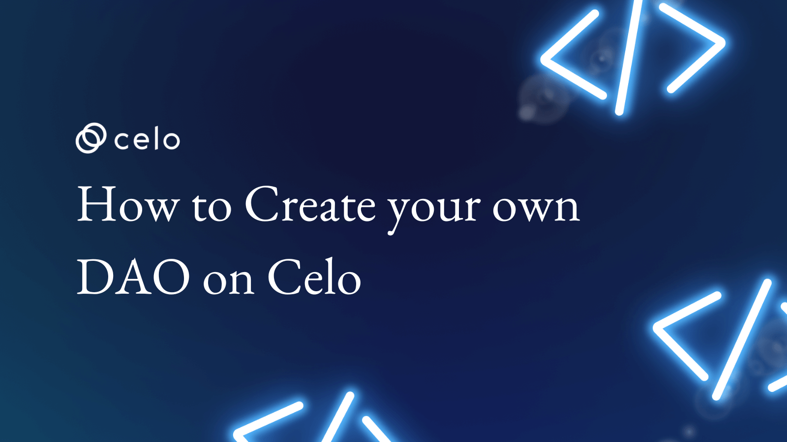
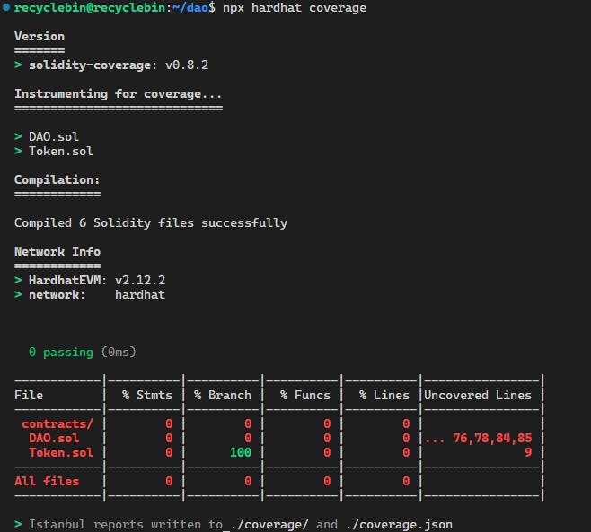
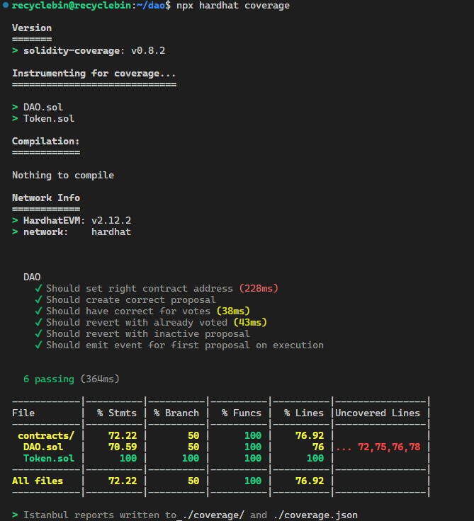

## Introduction​

In this article, we'll cover how to build an on-chain DAO with Hardhat, Solidity, and JavaScript. If you're unaware, many crypto projects are attempting to utilize DAOs (decentralized autonomous organizations) for project governance. The decentralized nature of cryptocurrency makes DAOs a popular governance model in the blockchain industry.

With this one, we're getting right into the code.  The DAO's governance token will be an ERC20 token. This ERC20 token will be used to create and vote on proposals.

## Prerequisites​

You must be familiar with the following to fully understand this tutorial:

- HardHat: Hardhat is an extensible developer tool that helps smart contract developers.
- Solidity: A high-level programming language.
- Javascript: You should be familiar with the language's fundamentals.
- Chai: To test smart contracts, we'll use a javascript testing package.

## Requirements​

To follow along, your computer must have the most recent version of Node.js installed. Ensure Node is at least version 16.0.0 or higher if it is already installed.

## Hardhat Project Setup

Create a folder called DAO and open it in VS Code. Run the following command to set up a new hardhat project in the terminal:

```bash
npx hardhat .
```

Remove all the files from the contracts and test folder once the hardhat setup is complete. Create the following three files: `DAO.sol`, `Token.sol`, and `dao.test.js`. The contracts folder should have the `.sol` files, and the test folder should contain the `.js` file.

We will need to install some dev dependencies so that the hardhat project will work properly. To install those, run the following command in the terminal:

```bash
npm install --save-dev "hardhat@^2.12.2" "@nomicfoundation/hardhat-toolbox@^2.0.0" "solidity-coverage"
```

We will also need to install OpenZeppelin Library as dependency for our project:

```bash
npm install "@openzeppelin/contracts"
```

Let’s see what these can help us with:

- `hardhat`: Hardhat is an extensible developer tool that helps smart contract developers increase productivity by reliably bringing together the tools they want.
- `@nomicfoundation/hardhat-toolbox`: It bundles all the commonly used packages and Hardhat plugins.
- `solidity-coverage`: It is a solidity code coverage plugin for Hardhat.
- `@openzeppelin/contracts`: It is a secure smart contract library for solidity

## Governance Token Smart Contract

Using the ERC20 token standard, we will develop a governance token for our DAO. Open `Token.sol` and insert the following code:

```js
// SPDX-License-Identifier: MIT
pragma solidity ^0.8.17;
 
import "@openzeppelin/contracts/token/ERC20/ERC20.sol";
 
contract Token is ERC20 {
   
    constructor() ERC20("Token", "TOKEN") {
        _mint(msg.sender, 1000000);
    }
 
}
```

Please go [here](https://docs.openzeppelin.com/contracts/4.x/erc20-supply#fixed-supply) to read more about how the above snippet works. We can now go to the smart contract for the DAO.

## DAO Smart Contract

To get things going, we'll construct an empty smart contract called `DAO` in the `DAO.sol` file and import `IERC20.sol` from the openzeppelin library.

```js
// SPDX-License-Identifier: MIT
pragma solidity ^0.8.17;
 
import "@openzeppelin/contracts/token/ERC20/IERC20.sol";
 
contract DAO {
 
}
```

### Constructor Definition

Now that we have a blank smart contract, we can declare a variable inside of it with the name `token` of type `IERC20`.

The next step is creating the smart contract constructor, which takes the token's address as an argument. We keep the token address as a variable because we want our DAO contract to work with any ERC20 token. We will initialize the Token variable inside the constructor by assigning a value using the `IERC20` interface and handing it an argument of the contract address.

```js
contract DAO {
 
    IERC20 public token;
 
    constructor(address _token) {
        token = IERC20(_token);
    }
}
```

### Defining Proposal

The option to propose and vote on proposals will be available to anyone who has a governance token and chooses to participate in the governance process. We must outline the structure of those proposals. A struct will define the format for each proposal we will create named `Proposal`.

```js
    struct Proposal {
        uint256 accept;
        uint256 reject;
        uint256 abstain;
        uint256 deadline;
        bytes32 title;
        mapping(address => bool) voted;
    }
```

> Note: Everything other than functions goes above the constructor, and all the functions go below the constructor. Just a tip on organizing smart contracts

### Storing Created Proposals

We need to store any proposal that is made. By creating a mapping called `proposals`, we will achieve this. The proposal will serve as the value, and the proposal's index, which we will track using the `proposalIndex` variable, will be the key in the mapping.

```js
    uint256 public proposalIndex;
    mapping(uint256 => Proposal) public proposals;
```

### Create Proposal

After putting up everything related to proposals, there is just a function left that allows us to construct proposals. Starting off, let's define the function `createProposal` with visibility as `public`. This function returns the index of the created proposal (type `uint256`) and accepts the title (type `bytes32`) argument.

To access the proposals mapping with the current value of `proposalIndex`, we will first create a variable named `proposal` (with type `Proposal` and data location of `storage`). Then, by setting the value of the title (the function argument) and the current block timestamp plus one day, we will set the `title` and the `deadline` for the proposal we had gotten from the mapping. Finally, add 1 to `proposalIndex`'s value and return the index of the proposal you just created.

```js
    function createProposal(bytes32 _proposal) public returns(uint256) {
        Proposal storage proposal = proposals[proposalIndex];
       
        proposal.title = _proposal;
        proposal.deadline = block.timestamp + 1 days;
 
        proposalIndex++;
 
        return proposalIndex - 1;
    }
```

There is a problem; we only want governance token holders to have access to this service; we don't want anyone else to be able to create proposals. This can be resolved by introducing a modifier called `onlyTokenHolders` that checks to see if the caller's balance of their governance token is greater than zero and rejects the call otherwise. We can check the balance by using the `token` variable's `balanceOf` method.

```js
    modifier onlyTokenHolders() {
        require(
            token.balanceOf(msg.sender) > 0,
            "NOT_A_TOKEN_HOLDER"
        );
        _;
    }
```

This modifier can be added to the `createProposal` function.

```js
function createProposal(bytes32 _proposal) public onlyTokenHolders returns(uint256)
```

### Vote on the Proposal

We've made it possible to propose, and now we can write a function so that token holders can vote on proposals. Only token holders who hadn't already voted before the deadline should be allowed to cast a vote.

The index of the proposal and the type of vote the token holder must cast are the two arguments this function should accept. We must limit the type of vote to just three options with an enum named `Vote`: accept, reject, and abstain.

```js
    enum Vote {
        accept,
        reject,
        abstain
    }
```

We will fetch the proposal with the index supplied as an argument to the `voteOnProposal` function. Then, using the `require` statement, we'll see if the deadline has not passed or if the token holder has not already cast a vote. We shall set the voted flag for that token holder to `true` if all conditions are met. Following that, we will increase the number of votes cast by token holders' balance of governance tokens in accordance with their votes.

```js
    function voteOnProposal(uint256 _index, Vote vote) public onlyTokenHolders {
 
        Proposal storage proposal = proposals[_index];
       
        require(block.timestamp < proposal.deadline, "INACTIVE_PROPOSAL");
        require(proposal.voted[msg.sender] == false, "ALREADY_VOTED");
 
        proposal.voted[msg.sender] = true;
 
        if (vote == Vote.accept) {
            proposal.accept += token.balanceOf(msg.sender);
        } else if (vote == Vote.reject) {
            proposal.reject += token.balanceOf(msg.sender);
        } else {
            proposal.abstain += token.balanceOf(msg.sender);
        }
 
    }
```

### Execute Proposal

When the time has passed, the proposal will be executed by emitting an event. First, let's define the event called the `winner`. This event will take arguments, the proposal's index, its title, and the number of votes it received.

```js
    event winner(uint256 _index, bytes32 proposal, Vote winningVote);
```

We must first determine whether the proposal is active; if it is, we cannot execute it. If not, we'll look at which votes received the most and run the event appropriately.

```js
    function executeProposal(uint256 _index)  public {
 
        Proposal storage proposal = proposals[_index];
 
        require(block.timestamp > proposal.deadline, "ACTIVE_PROPOSAL");
 
        if (proposal.accept >= proposal.reject) {
            if (proposal.accept >= proposal.abstain) {
                emit winner(_index, proposal.title, Vote.accept);
            } else {
                emit winner(_index, proposal.title, Vote.abstain);
            }
        }
        else {
            if (proposal.reject >= proposal.abstain){
                emit winner(_index, proposal.title, Vote.reject);
            } else{
                emit winner(_index, proposal.title, Vote.abstain);
            }
        }
    }
```

## Testing Smart Contract

To test the contract, we're going to a chai and mocha library. To ascertain how many components of the smart contract have been tested, we will also use the hardhat coverage plugin. First, let's configure the hardhat coverage plugin. The only thing left to do is add the following to `hardhat.config.js`, as we have already installed hardhat coverage in the beginning:

```js
require("solidity-coverage");
```

To determine how much of the part has been tested, enter the following command into the terminal:

```bash
npx hardhat coverage
```

This is the intended result:



Write some tests right away. You should feel comfortable running tests with chai and mocha. Some basics are as follows: Tests are created within `it` function and are arranged using `describe`. Please read [this](https://hardhat.org/tutorial/testing-contracts) if you want to learn more about testing.

We'll use the AAA writing format, which stands for Arrange, Action, and Assert. We first create the necessary conditions for the test (arrange), then we perform the activity we are testing (act), and last, we evaluate if we are getting the results we were expecting (assert).

We need to do imports from `chai`, `ethers`, and `@nomicfoundation/hardhat-network-helpers` in the `dao.test.js` file.

```js
const {
  time,
  loadFixture,
} = require("@nomicfoundation/hardhat-network-helpers");
const { expect } = require("chai");
const { ethers } = require("hardhat");
```

Create a `describe` block with the title `DAO` in the `dao.test.js` file. We will put all of our test cases, and fixtures in this `describe` block. `contractFixture`, a fixture we'll make, will deploy the contracts and generate test accounts. We'll also make our first proposal and transfer some tokens to various addresses for testing.

```js
describe("DAO", function () {
 
  async function contractFixture() {
 
    const accounts = await ethers.getSigners();
 
    const TOKEN = await ethers.getContractFactory('Token');
    const token = await TOKEN.deploy();
 
    await token.deployed();
 
    const DAO = await ethers.getContractFactory("DAO");
    const dao = await DAO.deploy(token.address);
 
    await dao.deployed();
 
 
    await token.transfer(accounts[1].address, 13000);
    await token.transfer(accounts[2].address, 32300);
 
    await dao.createProposal(ethers.utils.formatBytes32String("first proposal"))
 
    return { accounts, token, dao };
  }
  // ALL TESTS SHOULD GO BETWEEN START AND END LINE
  // ---------START---------
 
 
  // ---------END---------
})
```

The deployment of contracts will be tested in the first test. To test this, we will see if the DAO contract has our governance token address properly set and if 1 million governance tokens are available.

```js
    it("Should set right contract address", async function () {
      const { token, dao } = await loadFixture(contractFixture);
 
      expect(await dao.token()).to.equal(token.address);
      expect(await token.totalSupply()).to.equal(1000000);
    });
```

Now that we can test proposal-related functions. Let's first see if the proposal is being created correctly. To do this, we'll get the first proposal and then check that all the fields are filled in with the right data.

```js
    it('Should create correct proposal', async function () {
      const { accounts, dao } = await loadFixture(contractFixture);
 
      const proposal = await dao.proposals(0);
     
      expect(proposal.title).to.eq(ethers.utils.formatBytes32String("first proposal"));
      expect(proposal.accept).to.eq(0);
      expect(proposal.reject).to.eq(0);
      expect(proposal.abstain).to.eq(0);
    })
```

We can go ahead and check the voting function. We will load the fixture, make a proposal, and then vote on it to see if the number of votes increases due to our voting.

```js
    it('Should have correct accept votes', async function () {
      const { accounts, dao } = await loadFixture(contractFixture);
 
      await dao.connect(accounts[1]).voteOnProposal(0, 0);
      await dao.connect(accounts[2]).voteOnProposal(0, 0);
 
      const proposal = await dao.proposals(0);
 
      expect(proposal.accept).to.eq(45300);
    })
```

We can check to see if someone is voting twice because it is not permitted. Voting twice should result in an error.

```js
    it('Should revert with already voted', async function () {
      const { accounts, dao } = await loadFixture(contractFixture);
 
      await dao.voteOnProposal(0, 0);
 
      await expect(dao.voteOnProposal(0, 0)).to.be.rejectedWith("ALREADY_VOTED");
    })
```

The contract specifically forbids voting past the deadline, so now is a good time to put that condition to the test. With the help of the `time` module we imported from `@nomicfoundation/hardhat-network-helpers`, we may increase the block timestamp. We will vote after increasing the timestamp, which should result in an error.

```js
    it('Should revert with inactive proposal', async function () {
      const { accounts, dao } = await loadFixture(contractFixture);
 
      await time.increase(time.duration.days(1));
 
      await expect(dao.connect(accounts[1]).voteOnProposal(0, 0)).to.be.revertedWith("INACTIVE_PROPOSAL");
    })
```

We can now go on to the testing `executeProposal` function. The timestamp must be larger than the deadline to run the `executeProposal` function. To test this, we will vote on the proposal, increase the timestamp, and then test to see which event is being emitted.

```js
    it('Should emit event for first proposal on execution with accept vote as winner', async function () {
        const { dao } = await loadFixture(contractFixture);
 
        await dao.voteOnProposal(0, 0);
        await time.increase(time.duration.days(1));
 
        await expect(dao.executeProposal(0)).to.emit(dao, "winner").withArgs(0, ethers.utils.formatBytes32String("first proposal"), 0);
    })
```

We can use the coverage command once more to run all of the tests and see how much of the smart contract we have tested. Output should resemble the following:



## Conclusion

You have successfully learned the following things from this article:

- The on-chain DAO's workings
- Interaction between ERC20 tokens from other contracts
- Using Chai and Mocha to test solidity contracts
- Use of the solidity coverage plugin

## Next Steps​

We have tested the contract, but as you can see, we didn't test it completely. As a next step, apply what you learned in this article and work to reach as close to 100% test coverage as you can.

## About the Author​

Nikhil Bhintade is the author of the article. Nikhil works as a product manager. He enjoys writing about cutting-edge technology and the things he is learning. You can see his most recent work on [GitHub](https://github.com/nikbhintade).

## References​

[Here](https://github.com/nikbhintade/dao-celo) is a reference to a project that was finished with tests that had 100% coverage. To understand more about using Hardhat, you may also refer to [this page](https://hardhat.org/tutorial).
