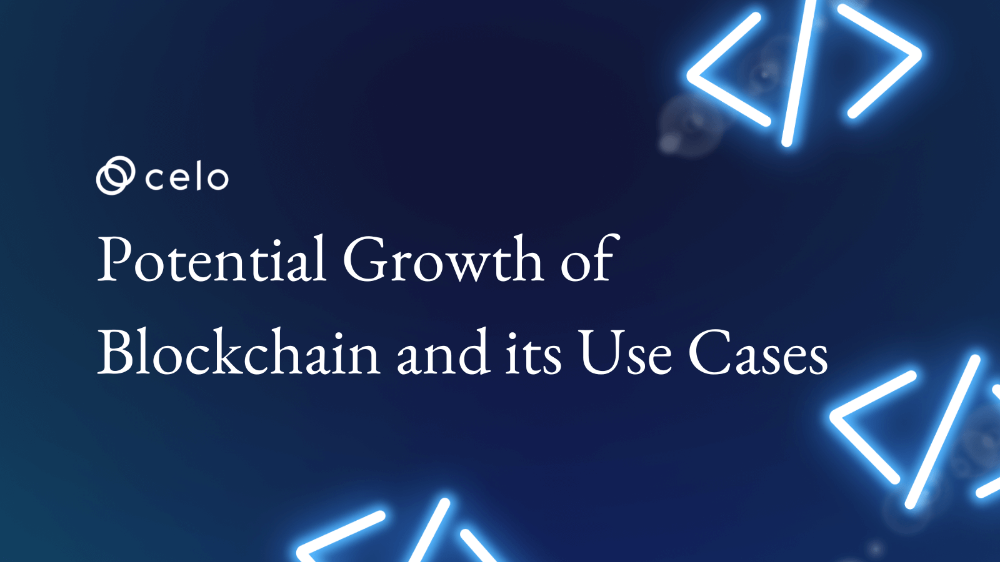

## How Much More Can Blockchain Grow As Regards Use Cases?

What else does blockchain technology have to offer after all the utilities we've seen in the past decade? If you're thinking along these lines, you're not alone. We've seen multiple applications in the years since blockchain technology was introduced. Some of these applications include money transfers, lending, voting, non-fungible tokens, and lots more. In this article, we go over many of the blockchain utilities we've seen and take a peek into what the future holds as it concerns blockchain utilities.

## What is Blockchain?

The blockchain idea was created by a person or group using the pseudonym Satoshi Nakamoto. Blockchain is a digital public distributed ledger technology (DLT) for recording and tracking transactions. This immutable ledger is duplicated and distributed across computers that participate in the network. Blockchain follows the pattern shown below:

- Transactions recorded as a "block" of data
- The data blocks are linked to themselves in sequence, forming a "chain."
- Each new block strengthens the verification of old ones hence forming the "blockchain."

The first blockchain source code was uploaded to SourceForge in 2008, allowing developers worldwide to work on this project. In 2009, its first application was launched as a cryptocurrency known as Bitcoin.

## What Major Blockchain Applications and Use Cases Currently Exist?

Blockchain has been used for more than just payments, which Satoshi Nakamoto originally envisioned. Over the years since publishing the Bitcoin whitepaper, we've witnessed newer use cases. Let's look into current blockchain use cases:

### Money Transfer

The original goal of the blockchain was to create a robust payment system not owned by anyone since Satoshi made Bitcoin a valuable asset that could be held or given away. This is still the most critical use of blockchains, as many blockchain protocols have cryptocurrency assets that support their ecosystems. In the same way, money can be saved in your bank account or physical wallet your digital wallet holds your crypto. It is encrypted and can only be opened with a digital signature. Some examples of cryptocurrencies today are [Bitcoin](https://bitcoin.org/), [Ethereum](https://ethereum.org/en/), [Binance Coin](https://www.binance.com/en), and [Ripple](https://ripple.com/).

### Smart Contracts

Smart contracts were the next generation in the blockchain space, and Ethereum was the first smart contract protocol running on blockchain technology. Nick Szabo first proposed the conceptThe concept was first proposed by Nick Szabo in 1994. As the name implies, smart contracts are computerized contracts that execute themselves once a certain condition is met. They are simply executed and run through a computer network once the agreement between the seller and buyer is confirmed. Smart contracts have opened up new opportunities for blockchain. Smart contract platforms include; Ethereum, Solana, Binance, and Cardano

### Non-Fungible Tokens (NFTs)

Non-fungible tokens are unique tokens on the blockchain that can't be replicated. Since blockchain makes it impossible to make data copies outside the network, NFT is an application of blockchain technology that makes it possible to prove ownership and authenticity through uniqueness. Authenticity can be validated via blockchain in the form of NFTs. Think about personal IDs, real estate assets, tickets, and loads more getting converted to NFTs to make them unique and prove they are authentic. Right now, the most popular NFTs are digital arts, primarily used for profile pictures and held for their values, such as BAYC, Crypto punks, ENS, and others.

### DeFi

Decentralized finance is among the biggest applications of blockchain and is only possible through smart contracts. Smart contracts can be programmed to redistribute digital assets with custom rules. Decentralized finance, to put it simply, takes the important parts of traditional finance while removing the middleman and replacing them with smart contracts in a decentralized environment. DeFi is a non-custodial financial system much different from banks. This means you don't have to rely on a third party to handle transactions. Aave, Chainlink, Uniswap, Ankr, and Compound are great examples of DeFi protocols.

### Decentralized Autonomous Organization

DAOs are organizations built on the blockchain with rules encoded in a computer program. Any centralized government does not influence the organization's decisions. Power is distributed among the token holders, and voting power is based on how many tokens you hold. All the votes cast through DAOs are recorded on the blockchain and are publicly accessible to everyone. DAOs, as you might have guessed, are heavily based on smart contracts. DAOs are simply about bringing decentralized governance to the blockchain. Some top DAOs are; DAO Maker, BitDAO, Uniswap, 0x, Compound, Curve DAO, and Aave.

## Some Big industries Blockchain Might be Disrupting in the Future

Blockchain applications are growing daily, and newer protocols are being developed. Even though many new applications are being developed, many are not game changers. Let's take a deep dive into the big use cases being worked on and how disruptive they can be:

### Media

IP infringement is being fought with the help of metadata digitization of unique content on the blockchain. Enterprise Ethereum will allow artists and creators to store their IP on a time-logged, immutable ledger. The blockchain will also help ensure that artists get more for their talents. Intermediaries such as YouTube, Apple Music, Spotify, and others take a large portion of the gains in the media industries. Blockchain could make this possible if it became necessary to eliminate these intermediaries. Blockchain will use smart contracts to create a more transparent consumption-based system; this can be made possible through the automatic execution of microtransactions between creators and consumers. ConsenSys is a major player in this application. At the moment, the top blockchain use cases in media and advertising are "streamlined royalty payments," "peer-to-peer sales and content distribution," and "usage-based billing models."

### Healthcare

Blockchain in healthcare is applicable in a wide range of ways, including but not limited to: management of the medicine and medical equipment supply chain, easy and secure transfer of patient medical records, and also to help healthcare researchers unlock genetic codes with greater ease. Blockchain's ability to keep records in a transparent, unchangeable, and decentralized ledger makes it a worthy technology for keeping medical data safe and secure. Genomics has great potential to improve human health, and blockchain makes that possibility more feasible. Imagine a marketplace of billions of genetic data points where individuals can encrypt their genetic information and sell it to scientists if they choose. [Nebula Genomics](https://nebula.org/whole-genome-sequencing-dna-test/), [Blockpharma](https://www.blockpharma.com/), [Avaneer Health](https://avaneerhealth.com/), [Medicalchain](https://medicalchain.com/en/), [BurstIQ](https://burstiq.com/), and many others are using blockchain to solve problems in healthcare.

### Supply chain management

One of the biggest challenges the supply chain faces is transparency. Another big challenge is system inefficiencies, which happen when vendors and suppliers cannot connect on who needs what, how, and when. From the big challenges supply chain management faces, it is easy to see how blockchain is a major solution. Blockchain technology allows the tracking of all transaction types more transparently and securely. With the blockchain in use, it will be easy for companies to track a product back to its source. Blockchains can record transactions on a product every time it changes hands. These records are made securely on a permanent, immutable ledger. With a shared blockchain, companies can do the following: track all shipments, synchronize their logistics data and automate payment. [Green Track](https://traceability.livaconnect.com/), [ShipChain](https://www.supplychain247.com/company/shipchain), [Slync](https://www.slync.io/) and [IBM](https://www.ibm.com/blockchain-supply-chain) are among the blockchain protocols currently assisting global supply chains. Some big companies where blockchain is applied to supply chain management are; [FedEx](https://www.fedex.com/content/dam/fedex/us-united-states/Compatible-Solutions/images/2019/Q2/Could_Blockchain_Revolutionize_Parcel_Shipping_V2_50457811.pdf), [DeBeers](https://www.debeersgroup.com/media/company-news/2022/de-beers-group-introduces-worlds-first-blockchain-backed-diamond-source-platform-at-scale), [Walmart](https://one.walmart.com/content/globaltechindia/en_in/Tech-insights/blog/Blockchain-in-the-food-supply-chain.html), and [PepsiCo](https://www.pepsico.com/our-stories/press-release/pepsico-europe-embraces-digital-start-ups-to-unlock-sustainability-solutions-across-the-supply-chain).

### Identity Management

Identity fraud remains a big problem today. [According to AARP](https://www.aarp.org/money/scams-fraud/info-2022/javelin-report.html), in 2021, about 42 million people were hit by identity fraud, losing over \$52 billion. By storing personal IDs such as SSNs, birth certificates, birth dates, and more on the blockchain identity theft may be greatly reduced. This is because storing IDs on the blockchain makes them impossible to counterfeit or reproduce. [Ligero](https://ligero-inc.com/), [Civic](https://www.civic.com/), [Evernym](https://www.evernym.com/), and [Ocular](https://ocular-tech.webflow.io/) are some of the blockchain platforms built for identity security.

### Manufacturing

The manufacturing sector is plagued by serious issues that continue to cause problems for the entire sector. These long-standing issues include the increasing number of players in its supply chain, its growing complexity, and the need to go digital while continuing to improve the system to stay profitable. Blockchain is a technology that can be applied to solve these main problems in the manufacturing sector. Immutability, decentralization, transparency, and smart contracts are major features of the blockchain that make it ideal for improving manufacturing. Some major use cases of blockchain in manufacturing include machine-led maintenance, ensuring the provenance of materials, preventing warranty fraud, simplifying and safeguarding quality check processes, and providing a sustainable supply chain. [Protokol](https://www.protokol.com/services/) and [IBM](https://www.ibm.com/blockchain) are among the blockchain protocols providing solutions to improve manufacturing.

### Insurance

The insurance industry is highly valuable and well-established, but even a big industry like this has many problems, such as fraud, inefficiency, cyberattacks, and human errors. With the application of blockchain technology to insurance, it'll become possible to automate human paperwork processes, secure sensitive data, and track insurance claims. Blockchain's trustless systems and their public ledger will positively impact the insurance industry, like optimizing security, efficiency, and transparency. Some blockchain insurance protocols include [IBM](https://www.ibm.com/us-en/), [Deloitte](http://www.deloitte.com/), [ConsenSys](https://consensys.net/), and [Lemonade](https://www.lemonade.com/).

### Transportation

Transportation is a critical industry that affects our daily lives both directly and indirectly. Global trade, commerce, and tourism are all strongly dependent on transportation. Considering how important this sector is, it is important to make the movement as efficient as possible. To make this possible, you must create and apply systems that can improve product traceability, remove inefficiencies, help cross-border management, and boost trust in the supply chain. Blockchain technology checks all these boxes, making it a perfect system to tackle many of these problems. Blockchain can be used to improve the flow of passengers, the efficiency of documents, the movement of goods across borders, the supply chain for the automotive industry, and to build trust. [Flare](https://flare.xyz/), [IBM](https://www.ibm.com/thought-leadership/institute-business-value/report/blockchain-expedited-delivery), and [Pixelplex](https://pixelplex.io/) are some of the main blockchain protocols changing the transportation industry.

## Some More Areas we can Expect to see Blockchain Shine

Beyond all the key industries and areas mentioned already, there are some other areas blockchain can still be functional

- **Cloud storage** can be employed while eliminating servers to store data on the cloud through blockchain. Storj is an example of a blockchain protocol with low cost and high speed. On [Storj](https://www.storj.io/storj-home), users can share their storage space and earn while they do that.
- **Real Estate** can be improved with blockchain technology. Asset owners can make their assets into NFTs and sell them on a marketplace. Less paperwork is needed in a process like this, and transactions can be handled well via smart contracts.
- [Statistics collection](https://www.storj.io/storj-home) can be made decentralized and transparent using blockchain. Distributed ledger technology can be deployed while storing records and data from population census or voting. Smart contracts can be used to deploy the data live so everyone can see it. A system like this can build more trust and confidence.

## Conclusion

Blockchain technology has been around for over ten years and can still be described as being in its infancy. The core technologies, like the consensus mechanisms, are getting a novel approach. However, this technology will play a significant role in various industries in the coming years. As digitization spreads quickly, people want systems that are open, safe, and not controlled by one person or group. All of this is possible thanks to distributed ledger technology (DLT) in the form of blockchain.
