## Introduction

The backbone of most web3 projects, if not all, is a well thought-out smart contract architecture that handles the sensitive aspect of the application such as financial transactions, health record of patients in a hospital, game logic and so on. Being a Celo developer, it is highly necessary to have a good engineering mindset when writing smart contracts to avoid costly mistakes that can put you at the mercy of the bad actors.

## Prerequisites​

We are going to examine some of the best practices, approaches and good standards for writing smart contracts that are targeted at EVM-compatible networks such as Celo. This tutorial is best suited for anyone with:

- At least foundational knowledge of smart contract development.
- Experience with other programming languages like C++ or Python will be an added advantage.

## Requirements​

We will leverage the following technologies and tools. Be sure to follow the steps accordingly.

- VSCode
- Nodejs >=v14.0.0
- Hadhat.

> Note: We will not cover testing in this tutorial. For testing, please refer to [this tutorial](https://docs.celo.org/blog/tutorials/how-to-write-unit-testing-for-contracts-with-hardhat)

Contents

Some of the smart contract best practices we will discuss are as follows:

- Avoid floating pragma.
- Modular approach.
- Circuit breaker.
- External contract interaction.
- Upgradability.
- Check, effect, interaction.
- Adopt libraries where possible.
- Use Speed breaks where necessary.
- Proper use of assert(), require() and revert() functions.
- Use modifiers properly.
- Integer division.
- Fallback/receive function.
- Explicit labeling of function visibility.
- Use interface type for accepting contract addresses.
- Use standard interface (S).

General consideration

In programming, it is assumed there is no software that is perfect. As a web3 developer, you should try to be ahead of the bad players. That is, finding, identifying and fixing loopholes in your code before others find it. Without further ado, let’s get started.

We will write fresh match-making contracts that connect and manage the processes of marriage between two opposite sexes. It features the following subjects:

- HusbandToBe:  Will have the following properties.
  - Inlaw.
  - Wife
  - Profile: (type struct)

 ```bash
 age
 isMale
 Bank - e.g Cash in bank balance etc
 Property : Owned tangible assets. 
 Religion: What they believe in.
 Nature: Whether they are drunkard or otherwise.
 Status: Type "Enum" showing their status as single or taken or married.
 ```

- WifeToBe: This contract will have similar properties such as:
- Parents: Type address.
- Husband: address (initially set to address(0)
- isReady: Boolean - Whether the woman is ready for marriage or not.
- Acceptance: bytes32.
- Criteria: struct - (Personal preference of the woman about the kind of man she wants).
- Status: Type "Enum" showing her status whether single, taken or married.
- Inlaw: (In this case, the wife’s parents, since in Africa, parents give their daughters to the men).
- Bride price: Type uint256
- Bank: address - Account to receive the bride price.
- Wealth (Husband’s possessions).

Both parties have common attributes such as operating joint accounts together etc.

> Note: This is only for tutorial purposes. It may not necessarily display the exact practice. [Clone this repository](https://github.com/bobeu/advanced-hardhat-for-celo-dev), then navigate to the project folder and install the dependencies.

```bash
git clone https://github.com/bobeu/advanced-hardhat-for-celo-dev.git
cd advanced-hardhat-for-celo-dev
yarn install 
```

After that, navigate into the contracts folder and make a new folder

```bash
cd contracts
mkdir match-making
```

You should have a file structure that looks like this "contracts/match-making".

## Avoid floating pragma

Often, many solidity developers ignorantly or unknowingly declare a list of compiler versions (solc) in contract files using the caret symbol "^" or a range of compiler versions with ">=". Declaring a version like this _"pragma solidity ^0.8.9;"_ tells the compiler to make a decision for you by simply selecting a version starting from 0.8.9 but not including 0.9.0. If there is no version specified in the hardhatconfig, then it defaults to the version that was preinstalled during project setup. If you declare a list or range of versions with a version declared in the config file, the compiler resolves to using a version which is specified in the configuration file. Although external libraries like the openzeppelin’s mostly adopt the float style, that's acceptable since you will mostly inherit them as they serve as base contracts and not the final deployable contracts.

The best practice is to always specify a single compiler version at the top of your contract file. Always lock your pragma to one specific tested compiler version so that your contracts are not deployed using versions that introduce undiscovered bugs.

### Overview of example contracts

Before a marriage takes place, there has to be two parties who are opposite sex expressing love to each other. So create a file under the "match-making" folder named "WifeToBe.sol", then paste the following code.

```bash  "contracts/match-making/WifeToBe.sol"
 pragma solidity 0.8.9;
```

## Modular approach

Sometimes, one may need to write more code than expected. Having code with fewer lines may be easily maintained, but the case is different with lines that run into hundreds to thousands. Breaking your code into smaller modules i.e. sub-contracts makes it easy to detect and fix bugs quickly. Also, modularity improves readability and many more advantages. In our "match-making" contract, each of the subjects will be represented by a standalone deployable contract and they can interact by interfacing with one another. Now, create contract files representing each of the subjects. Since they will have to interact with one another, then it makes sense to have a separate folder for interfaces such as a husband-to-be proposing to a lady of his choice, to the lady, acceptance is optional. Such action should forward a response to the intended party. Populate each of the files with their respective code [here](https://github.com/bobeu/advanced-hardhat-for-celo-dev)

- contracts
  - match-making
    - interfaces
      - Common.sol
      - IHusbandToBe.sol
      - IWifeTobe.sol
      - IParent.sol
    - wealth
      - CashInBank.sol
      - Properties.sol
    - HusbandToBe.sol
    - WifeToBe.sol
    - Parent.sol

Our contract code size is a bit bigger and we have successfully broken them down to implement a modular style.

## Circuit breaker

- This acts as a stopper or a switch that breaks executions.

- In the event a bug is detected in your contract or a potential vulnerability has adversely affected the dApp, you need a way to mitigate or prevent a huge loss from further happening. Halting contract execution may be very effective. Usually, this would be a function that when invoked, would simultaneously prevent execution of other functions.

- The openzeppelin **"Pausable"** module is an example of a circuit breaker. When your contract inherits from it, you will need to activate it by overriding the "_pause()" and "_unpause()" functions so that only authorized accounts e.g the "owner" can call it. In our case, we will need each of the subjects to be able to have some level of control over their respective profiles soon as they subscribed in order to prevent reserved functions from being invoked by anyone. By doing so, we will have a reasonable approval mechanism among the parties that regard and respect each party’s opinion such as the WifeToBe can express her personal feelings even while the parents feel certain things are right for her.

- In Africa, we’ve had countless cases where parents force their daughters to marry men they do not wish to marry. Having such a tamper-proof system as the Celo blockchain to balance, checkmate preferences and respect opinions would go a long way to make the world a better place. We are going to leverage the openzeppelin’s "security" and "access" modules to implement a circuit breaker that pauses the contract when invoked by the authorized account i.e. "owner". Copy/paste the following code at the top of  each standalone deployable contract file.

Your files should look like these:

_HusbandToBe.sol_

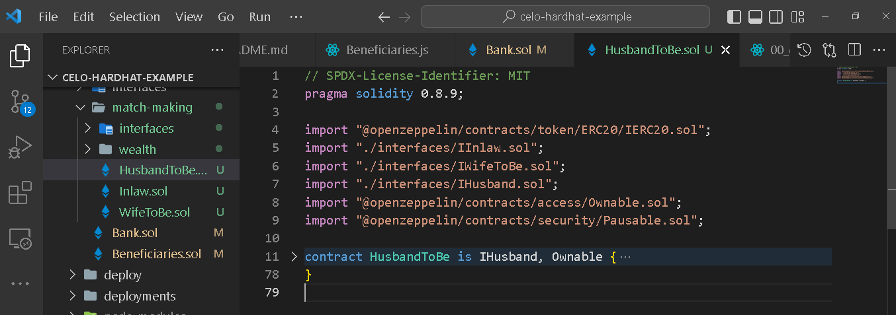

_WifeToBe.sol_

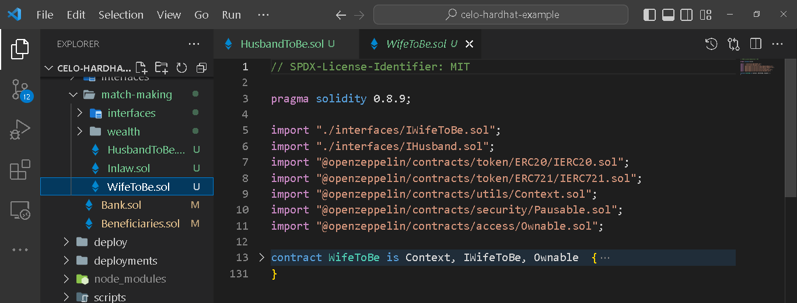

_Inlaw.sol renamed to Parent.sol_

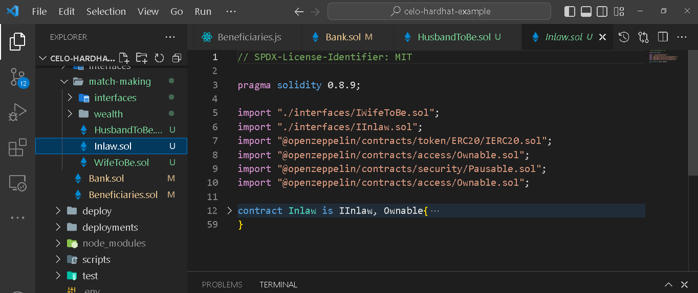

_Bank.sol_

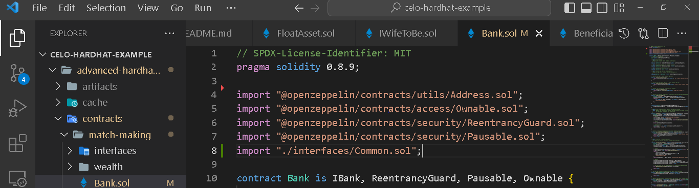

The openzeppelin library makes available for us two internal functions to activate the breaker. They hold so much power that care must be taken who calls them.

- pause()
- unpause()

Paste the following code at the bottom of each of the 4 files.

```bash
   // …. 
   function pause() public onlyOwner {
    _pause();
  }

  function unpause() public onlyOwner {
    _unpause();
  }
```

We have successfully made the functions public and only authorized owner account can call them but at this point, nothing happens when they are invoked. To effect the breaker, we need invoke it on relevant functions. From the "Pausable.sol", there are two utilities that are capable of modifying functions where they are present. In our case, we only need the latter.

- ~~whenPaused~~
- whenNotPaused

In "WifeToBe.sol", invoke the "whenNotPaused" modifier on :

- meetYourWife()
- tryPropose()
- setMarriageStatus()

_Example_:

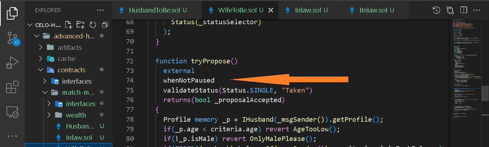

_Parent.sol_

- getMarriageApproval()

When "pause()" is invoked, all functions with the "whenNotPaused" modifier will fail.

## External contract interaction/External call

In solidity, contracts can be configured as standalone or dependent on other contracts. In either context, they can be made to interact with other contracts either in a high-level or low-level way. Each of these methods have their pros and cons, and the modus operandi is always to consider safety first whichever best fits your need.

High level calls are proven to be more secure compared with low-level interactions since much control is not given to the message receiver unlike its counterpart where a call from contract to another could change the flow. It is always advisable to consider a low-level call last unless you know what you’re doing. In our case, we could use low-level interaction since we own the code and can always attest to its genuineness.

A good practice is to always tag or name that contracts we do not trust as "unsafe" when making external call. Another thing to note is that low-level functions :  ".call()", ".staticcall()" and ".delegatecall()" do not throw an exception when the call stack is depleted, instead, they return false. This is very unsafe and so it is mostly discouraged.

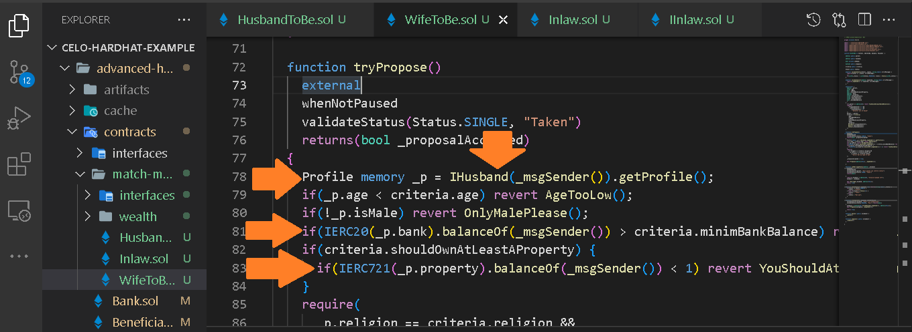

On Line 78, we perform a high-level callback into whoever is calling to read their profile. In this case, we expect that the caller should be a contract of type "HusbandToBe". In our case, the "_msgSender()" is a trusted party so we do not have to worry about malicious code hijacking control flow. The flow terminates as soon as the execution of "getProfile()" completes, and the result is tracked in the "_p" variable (user-defined type from an elementary type ‘struct’). Assume we are using a low-level call, we could something like:

```bash
 bytes memory _calldata = abi.encodeWithSignature("getProfile()");
 (bool done, bytes memory returndata) = _msgSender().call(_calldata);
```

If "_msgSender()" is a bad actor, they could execute malicious code that might cause serious damages to the calling contract. As much as possible, avoid low-level calls especially with in-line assembly except if you know what you’re doing. And if you need to make an external call,
Avoid state changes after the call.
Avoid delegating to code you do not trust.
Below is an example how "delegatecall()" can cause loss of funds and the contract destroyed.

```bash
 contract BadActor {
  function performActionOnMyBehalf() external {
   selfdestruct(0);
  }
 }

 contract Enquirer {
  function getProfile(address proxy) public returns(string memory) {
   // Unsafe call
   proxy.delegatecall(bytes4(keccak256("performActionOnMyBehalf()")))
  }
 }
```

The potential danger here is allowing users to supply an argument to the "getProfile" function. This should be discouraged.

Let’s fix an issue in the WifeToBe.sol contract.

_Before_

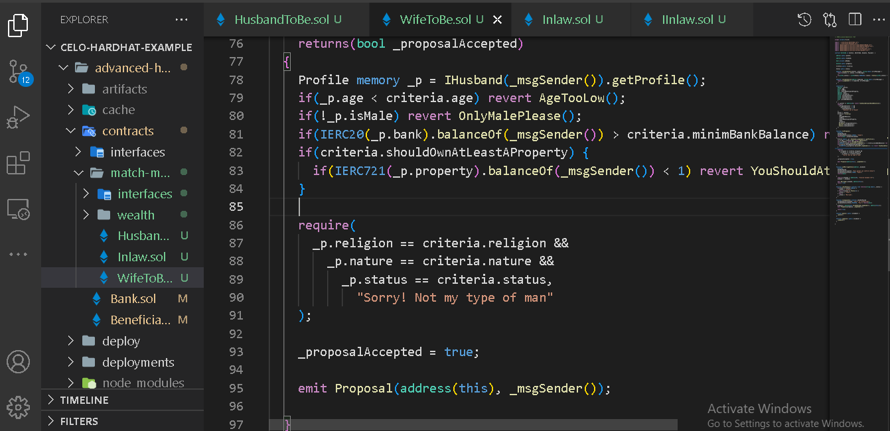

_After_


## Upgradability

Writing 100% secure smart contracts is nearly impossible especially with complex code. The immutability attribute of blockchain is one kind that makes it stand out from other technologies. What if a potential bug that could lead to loss of millions of dollars is detected? Does it mean we will have no way to fix it? Fortunately, overtime, the developer communities have developed strategies to fix issues in contracts through smart contract upgrade which comes at a cost. However, while some upgrade methods do not alter code already deployed to the blockchain but provide subtle ways to deploy several versions of the same software while retaining users’ trust and confidence, others may require a complete software upgrade with a new deployment address each time upgrade is performed. From description, the disadvantages are not far fetched. Smart contract upgrade is a wide topic on its own which is not covered in this tutorial. To learn more, please refer to these link:
[How to create upgradeable smart contract on Celo](https://docs.celo.org/blog/tutorials/how-to-create-an-upgradeable-smart-contract-in-celo)

**Check, effect, interaction**

This largely depends on the design of the code and what it tends to achieve. But the concept of check, effect pattern means you make the necessary check, effect necessary changes to state variable (s) before initiating external call. Example is determining if an user is entitled to receive funds in a contract. Consider the following code:

```bash

1    // SPDX-License-Identifier: MIT
2
3    pragma solidity 0.8.9;
4
5    contract Reward {
6       mapping(address=>uint256) public rewardBalances;
7
8       function claimReward() external returns(bool) {
9         uint bal = rewardBalances[msg.sender]; 
10        require(bal > 0, "No reward");
11       (bool s, ) = msg.sender.call{value: bal}("");
12       require(s, "Failed");
13       rewardBalances[msg.sender] -= bal;
14      }
15     }
16
17
18    contract BadActor {
19      Reward reward;
20      uint receiveCounter;
21
22      constructor (address rewardContract) {
23        reward = rewardContract;
24      }
25
26      receive() external payable {
27        receiveCounter ++;
28        drainBalance();
29      }
30
31      function drainBalance() public {
32        reward.claimReward();
33      }
34   }
```

The essence of the "claimReward" function is to send a reward to the caller if they have balances registered in their favor. Unfortunately, the bad actor is one of the beneficiaries who had submitted a contract address as sole beneficiary for the reward.

In the bad actor’s contract, he had written a function called "drainBalance" which calls back into "Reward.claimReward()" even before line 12 is reached.
Here is how the flow goes:

- The attacker  invokes "drainBalance()" which then calls "Reward.claimReward()".
- Reward extracts the caller’s balance, checks if the balance is greater than the minimum withdrawal amount.
- It sends payment to the BadActor by calling the "receive()" function which then invokes "drainBalance" again. The circle is restarted while waiting for line 11 to finish execution. The balance of the Bad actor contract in "Reward" will always remain the same while it withdraws the same amount over and over until the balance in the Reward contract is completely drained.

An effective solution is using the check, effect, interaction pattern or the "@openzeppelin/contracts/security/ReentrancyGuard.sol" module.

```bash
1    // SPDX-License-Identifier: MIT
2
3    pragma solidity 0.8.9;
4
5    contract Reward {
6     mapping(address=>uint256) public rewardBalances;
7
8     function claimReward() external returns(bool) {
9       // check
9          uint bal = rewardBalances[msg.sender]; 
10        require(bal > 0, "No reward");
11
12      // effect
13      rewardBalances[msg.sender] -= bal;
14
15      // interaction
16      (bool s, ) = msg.sender.call{value: bal}("");
17      require(s, "Failed");
18      
19     }
20    }
```

In "Bank.sol", we implement this pattern.
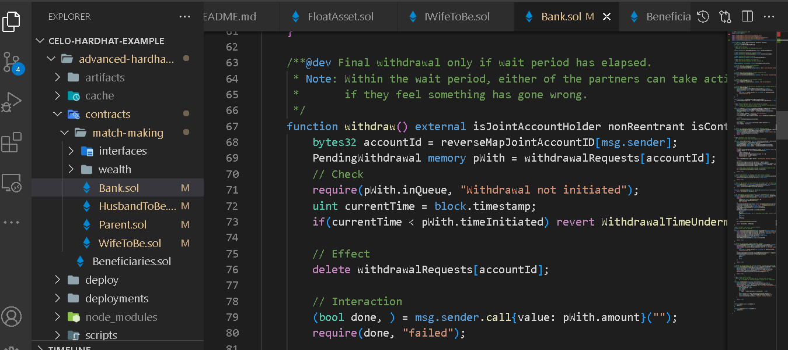

## Adopt libraries where possible

While writing your own code is encouraged, it's a good practice leveraging battle-tested code such as the openzeppelin library. Even at that, merely inheriting from the library is not enough, you should have full understanding of any of the contract modules you are using as base contract. From the image below, we import a few modules from the openzeppelin library.


### Use speed break where necessary

Using method (s) that delays action for a set period of time before execution is finalized can be very helpful. It is useful in situations where the unplanned happens so there is enough time to react and/or recover loss (es) that should have occurred. For example where a substantial amount of funds is involved, you could set a waiting period of say 14 days before withdrawal is effected so there is room for action to be taken in event of an authorized action being performed.  Below on line 73, we implemented a speed break.


## Proper use of assert(), require() and revert()

Use "assert()" function only for internal conditional test and check invariants such as comparing the balance in a contract after a transaction has been effected. So this means that a properly effected transaction should never reach the assert code. The "assert()" statement should never be used to validate input.

The "require()" function should be used to validate conditions that must evaluate to true such as checking inputs from users. For example, if you’re expecting users to supply a number between 1 and 255, you should either use the "require" function or an "if" statement with "revert" function.
Lines 101, 102 and many other places show how we implement "require()" and "revert()".

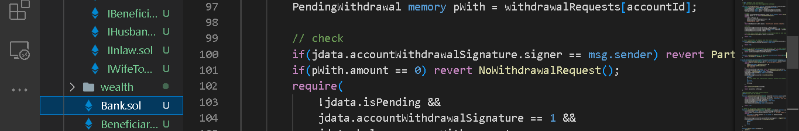

## Use modifiers properly

Modifiers work similar to functions except that they don’t have visibility and the code inside modifiers are checked and executed before proceeding to the function body. Be careful when making an external call inside a modifier as it can lead to reentrancy attack. A proper use of modifier is to make it run a condition check that should have been duplicated in many places but where you have one conditional check, you should use either "require()" or "revert()" statement. The essence of this is to make your code more readable and avoid redundancy.

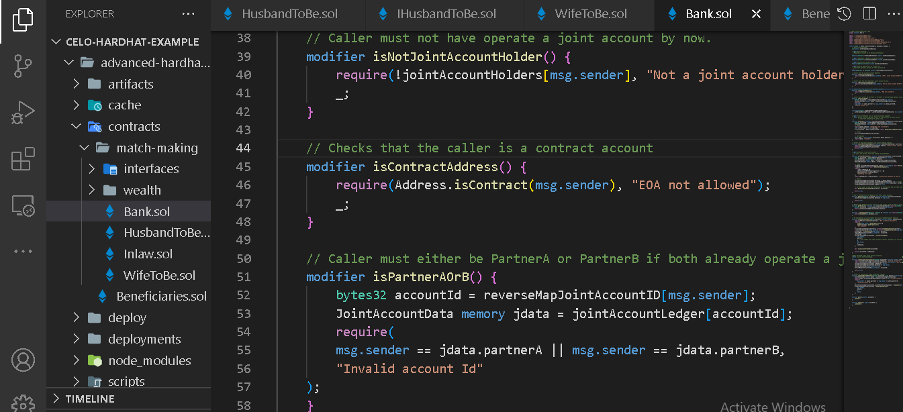

"isPartnerAOrB"** function modifier contains code used in almost all the functions, so it makes a lot of sense to have them in a modifier and simply reference them by a variable "isPartnerAOrB".

## Integer division

Solidity does not provide a proper way to account for remainder when making integer division e.g "x = 9 / 4". All integer divisions always round down to the nearest integer and the remainder is lost. This is not ideal especially when dealing with payment split or computation that has to do with funds. If you need to achieve precision, you should consider using a multiplier but be mindful that any number you use as a multiplier must be accounted for in the future when dealing with the result. Alternatively, you could switch to using percentage if you can quantify the denominator in percentage. Use a multiplier to avoid rounding to zero.

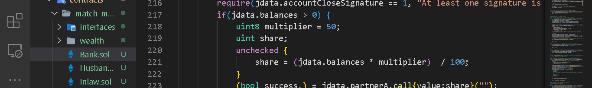

## Fallback/receive function

In solidity, fallback function as the name implies is similar to an escape function which is reserved for an event where the smart contract is called with an empty data or a function that does not exist in the contract is invoked. Fallback is used in version of solidity before 0.6.x  in the following scenarios:
Ether is sent to a contract with no data.
Data is sent to a contract but no match for function in the data.

Sending ether to a contract without data via ".transfer()" or ".send()" triggers the contract’s fallback function. To receive ether, fallback must be payable. The syntax is often written as:

```bash
 fallback () external payable { }
```

Fallback function also serves a good use case in implementing upgradable contracts.

_Example:_

```bash
 pragma solidity 0. 5.4;
 
 contract DelegateToProxy {
  // contract address where the logic resides
  address internal implemetationAddress;
  
  function ( ) external payable {
   // Retrieve the implementation address
   address impl = implemetationAddress;
   
   assembly {
    calldatacopy(0, 0, calldatasize( ))
    let result := delegatecall(gas( ), impl, 0, calldatasize( ), 0, 0)
    returndatacopy(0, 0, returndatasize( ))

    Switch result
    case 0 { revert(0, returndatasize( )) }
    default { return(0, returndatasize( )) }
   }
  } 
 }
```

> Warning! This is for example purpose, do not use in production

From version 0.6.x an improvement was released that splitted the fallback function into two separate functions:

- fallback() external payable { }
- receive external payable { }

Using payable with "fallback()" is now optional, and the function is used when no other function in the contract matches the call data. It always receives data and it is declared without the "function" keyword. If you intend to only use the fallback function for logging received Ether, you should always check if the call contains any data or not.

```bash
 // …
 fallback() external payable  { 
  require(msg.data.length = = 0, "");
  emit DepositConfirmed(msg.sender); 
 }
```

The receive function should be used where call data is empty and any value is sent via ".send()" or ".transfer()". A contract cannot have more than one "receive" function, and it is declared without the "function" keyword with its visibility marked as "external".

In our contracts, we also implement the receive function. As an exercise, try to implement a fallback function in each of the contracts that ensures a call to it does not include any data.

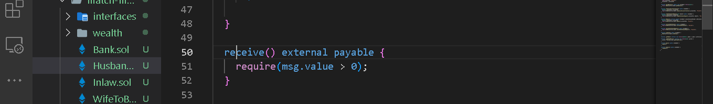

## Explicit labeling of function visibility

You should always endeavor to explicitly label function visibility including state variables.

Different Kinds of visibility in solidity are :

- external
- public
- internal
- private

## Facts about visibility in solidity

- You cannot label state variables as private.

- Explicit labeling corrects assumptions about who can call certain functions or access state variables.

- Functions in the interface are always labeled "external".

- Functions or variables marked as public can be accessed by anyone.

- External functions cannot be called in internal functions.

- Private variables and functions are not visible to other contracts but only contracts where they’re defined.

- External functions may be more efficient when they receive large arrays of data.

- Internal functions and state variables are only available internally without "this" keyword.

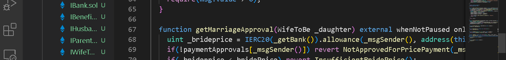

## Use interface type for accepting contract addresses

When accepting a contract addresses arguments to functions, it is advisable to use the interface type rather than accepting an address type so as to enable the compiler guarantee type safety throughout the input lifecycle.

_Example:_

```bash
 contract Somecontract {
  string openLetter = "LETTER";

   function verify(string memory letter) external returns(bool) {
   return letter = = openLetter;
  }
 }

 contract Verifier {
  function checkCorrectness(Somecontract addr, string  memory _letter) public 
  {
   addr.verify(_letter);
  }
 }
```

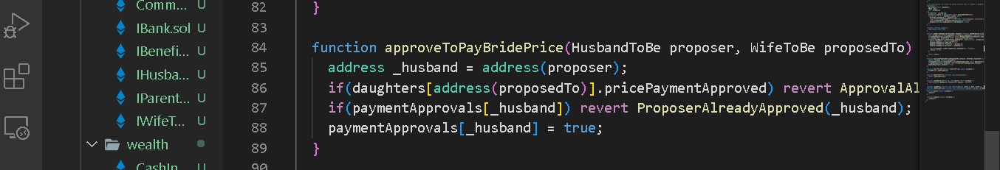

On line 84 we accept input of type contract for the proposer and proposedTo arguments.

## Use standard interface (S)

If you’re creating token (s) for your project, ensure they follow acceptable and stable token standard by implementing corresponding token interface such as [EIP20](https://github.com/ethereum/EIPs/blob/master/EIPS/eip-20.md) or ERC20, [EIP721](https://github.com/ethereum/EIPs/blob/master/EIPS/eip-721.md)

_Example:_

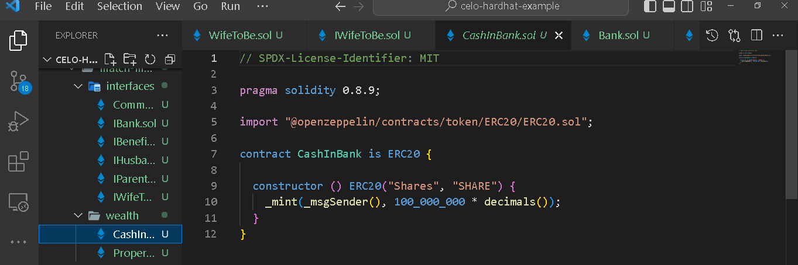

In the code above, we create a new ERC20 compatible token by inheriting the openzeppelin ERC20 module which already has the interface implemented.

Let’s compile the code. Run :

```bash
 npx hardhat compile
```

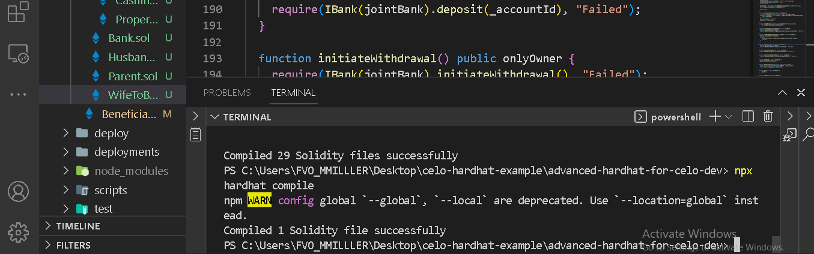

Deploy locally.

```bash
 npx hardhat run scripts/deploy.js
```

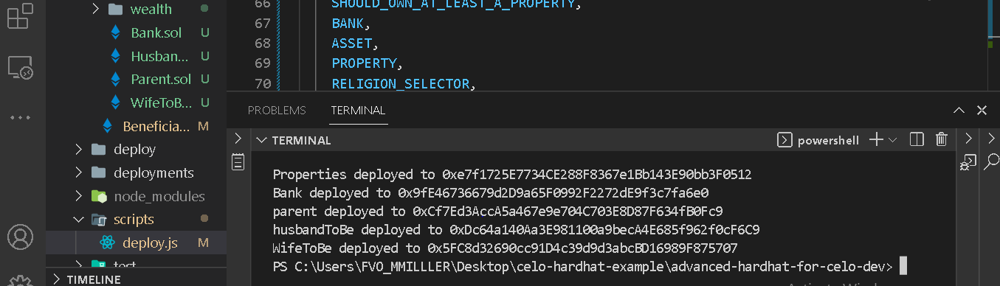

Deploying to Celo’s testnet (Alfajores)

```bash
 npx hardhat run scripts/deploy.js – testnet alfajores
```

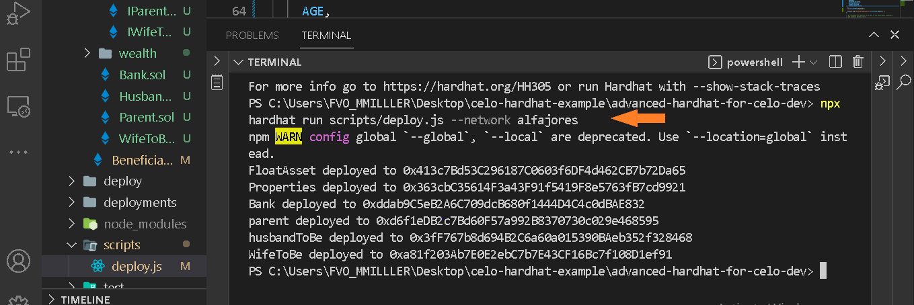

## Conclusion​

We learned some of the best ways to write smart contracts even though there are a couple of them we might not have talked about but you’ll mostly need the ones we discussed.

## Next Steps​

The example we adopted in this tutorial is a real-world case. It can be extended to make meaningful project. As an exercise, practice what you have learned by improving the contracts. Firstly, deploy locally, then to Celo testnet. Share your deployment details with us on [Celo’s discord server](https://discord.gg/celo). Happy reading.

## About the Author​

Isaac Jesse, aka Bobelr is a smart contract/Web3 developer. He has been in the field since 2018, worked as an ambassador with several projects like Algorand and so on. He has also contributed to Web3 projects.

## References​

[Complete tutorial source code](https://github.com/bobeu/advanced-hardhat-for-celo-dev)
