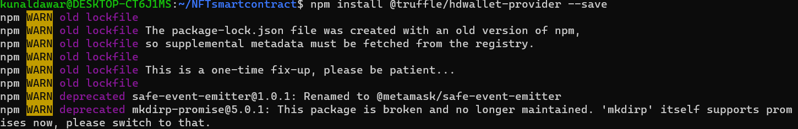
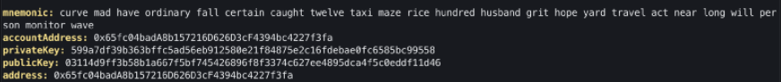
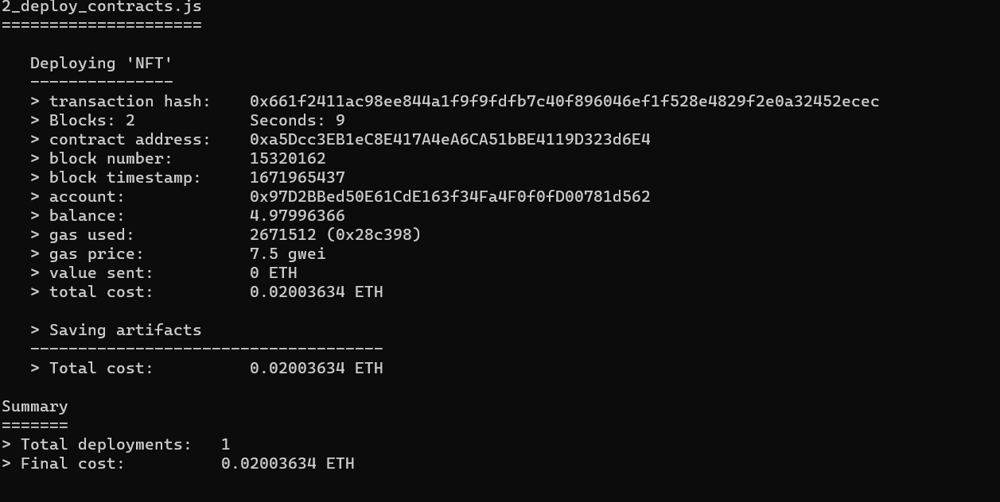
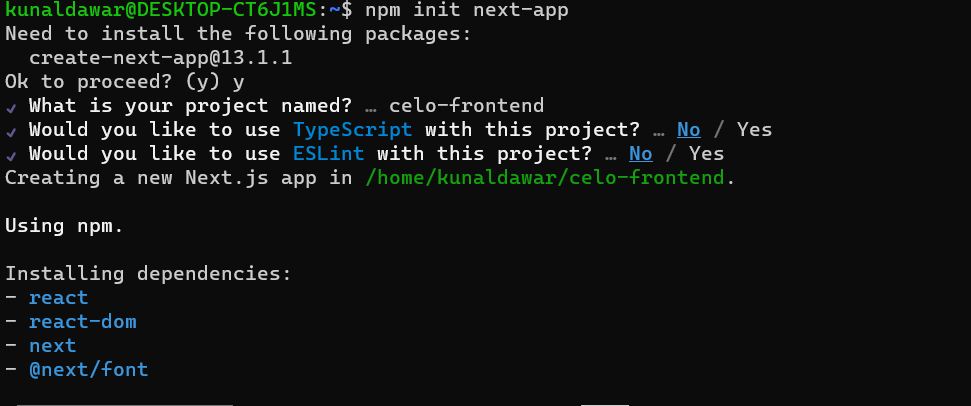
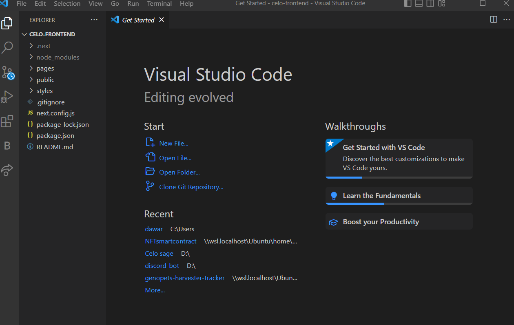
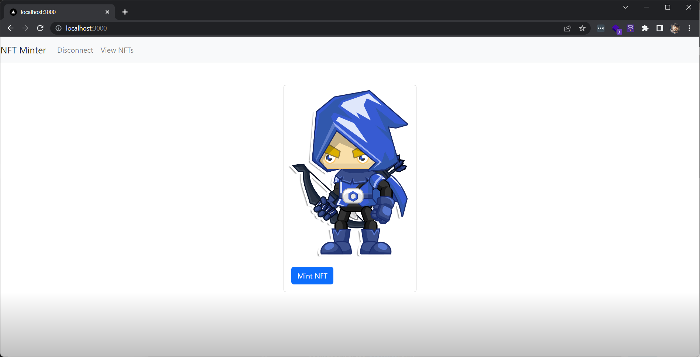

## 🌱 Introduction

Welcome Developers, to the Step-by-Step Guide to Deploying your First Full-Stack Dapp on Celo! In this guide, we will walk you through the process of building and deploying a full-stack decentralized application (Dapp) on the Celo platform.

Celo is a decentralized platform that enables fast, secure, and scalable transactions on a global scale. It is built on top of the Ethereum blockchain and is designed to be easily accessible to developers and users alike.

Whether you are a seasoned blockchain developer or just getting started, this guide will provide the knowledge and tools you need to build and deploy your own Dapp on Celo.

So let's get started!

## 🗈 Prerequisites

- A computer with an internet connection. You will need a computer with a stable internet connection to follow along with this guide.

- Basic knowledge of programming. While we will provide step-by-step instructions, it will be helpful to have some basic knowledge of programming languages such as JavaScript and Solidity.

- Node.js and npm installed. You will need to have Node.js and npm (the package manager for Node.js) installed on your computer. You can check if you have them installed by running the following commands in your terminal:

```bash
node -v
npm -v
```

- A code editor. You will need a code editor to write and edit your code. Some popular options include Visual Studio Code and Atom.
- A Metamask account. You will need a Metamask account to interact with the Celo blockchain from your web browser. If you don't already have one, you can create one by installing the Metamask extension for Chrome or Firefox.

## ⚠️ Requirements

- Truffle: a development environment, testing framework, and asset pipeline for Ethereum
- Node.js: a JavaScript runtime that allows you to run JavaScript on the command line
- Yarn: a package manager for JavaScript
- next: Next.js is a framework for building server-rendered or statically-exported React applications.
- CeloCli - The celocli lets you interact with the Celo Protocol smart contracts.

## What are NFTs?

Non-fungible tokens (NFTs) are digital assets that represent ownership of a unique item or concept. They are stored on a blockchain and cannot be exchanged for something else of equal value, like traditional currencies. NFTs are often used to represent digital art, collectibles, and other unique items and are bought and sold in online marketplaces. Their value is determined by their rarity and perceived value to collectors. NFTs provide a way to prove ownership and authenticity of digital assets and allow for the creation of scarcity in the digital world, which can increase the value of certain items. They are created using smart contracts on a blockchain platform, such as Ethereum, and are often represented as ERC-721 tokens.

**_ Let's start building the future together! _**

## Steps to set up the truffle project and its configs

1. Install Node.js by following the instructions on the [official website](https://nodejs.org/en/download/).

2. Install Yarn by running the following command:

```bash
npm install -g yarn
```

3. Install Truffle by running the following command:

```bash
yarn global add truffle
```

4. Install HDWalletProvider by running the following command:

```bash
npm install @truffle/hdwallet-provider --save

```



5. Install Celo Command Line Interface also install dotenv

```bash
npm install -g @celo/celocli
npm install dotenv
// dotenv will help us to load .env file as environment variables

```

6. Create a new Truffle project by running the following command:

```bash
mkdir NFTsmartcontract
cd NFTsmartcontract
truffle init
```

:::tip
Learn more: If you are new to Truffle check out the [Truffle docs](https://www.trufflesuite.com/docs).
:::

This will create a new directory with the following structure:

```text
NFTsmartcontract/
├── contracts/
│ └── Migrations.sol
├── migrations/
│ └── 1_initial_migration.js
├── test/
├── truffle-config.js
└── truffle.js
```

7. Navigate to the `truffle-config.js` file in your project directory and Replace the following configuration for the Celo testnet:

```js
const HDWalletProvider = require("@truffle/hdwallet-provider");
require("dotenv").config();
module.exports = {
  contracts_directory: "./contracts",
  contracts_build_directory: "./truffle_abis",
  migrations_directory: "./migrations",
  networks: {
    local: {
      host: "127.0.0.1",
      port: 7545,
      network_id: "*",
    },
    alfajores: {
      provider: function () {
        return new HDWalletProvider(
          process.env.PRIVATE_KEY,
          "https://alfajores-forno.celo-testnet.org"
        );
      },
      network_id: 44787,
      gas: 20000000, //make sure this gas allocation isn't over 20M, which is the max
    },
    celo: {
      provider: function () {
        return new HDWalletProvider(
          process.env.PRIVATE_KEY,
          "https://forno.celo.org"
        );
      },
      network_id: 42220,
      gas: 20000000, //make sure this gas allocation isn't over 20M, which is the max
    },
  },
  mocha: {
    // timeout: 100000
  },
  compilers: {
    solc: {
      version: "0.8.9", // Fetch exact version from solc-bin (default: truffle's version)
      docker: false, // Use "0.5.1" you've installed locally with docker (default: false)
      settings: {
        // See the solidity docs for advice about optimization and evmVersion
        optimizer: {
          enabled: false,
          runs: 200,
        },
        evmVersion: "istanbul",
      },
    },
  },
};
```

8. Create A Celo Account using Celo Cli

```bash
celocli account:new
```



9. Create a .env File in the root directory and add `PRIVATE_KEY` that we got from Celocli Command or You can use `PRIVATE_KEY` from Metamask.

```text
PRIVATE_KEY="62dda1a6a6ee2dasdasdsadasdassdas1e2200095661a1b1e9dsadsdsdsadasasd"
```

10. Create `.gitignore` file

It is important to hide your mnemonic and other important files while developing applications. When using Git or GitHub, you can populate a `.gitignore` file with the code below to ensure you don’t accidentally publish these files.

```text
# dependencies
/node_modules

# Mac users
.DS_Store

#hidden files
.env
```

**_ Now we are done with setting up truffle _**

## Steps for creating ERC721 Contract and Truffle Migration File

1. Create a `NFT.sol` file in `contracts/` folder.

2. Add the following code to it.

```solidity
// SPDX-License-Identifier: MIT
pragma solidity ^0.8.9;

import "@openzeppelin/contracts/token/ERC721/ERC721.sol";
import "@openzeppelin/contracts/token/ERC721/extensions/ERC721URIStorage.sol";
import "@openzeppelin/contracts/access/Ownable.sol";
import "@openzeppelin/contracts/utils/Counters.sol";

contract NFT is ERC721, ERC721URIStorage, Ownable {
    using Counters for Counters.Counter;

    Counters.Counter private _tokenIdCounter;
    constructor() ERC721("NFTexample", "CELO") {}

    function safeMint(string memory uri) public {
        uint256 tokenId = _tokenIdCounter.current();
        _tokenIdCounter.increment();
        _safeMint(msg.sender, tokenId);
        _setTokenURI(tokenId, uri);
    }

    // The following functions are overrides required by Solidity.

    function _burn(uint256 tokenId) internal override(ERC721, ERC721URIStorage) {
        super._burn(tokenId);
    }

    function tokenURI(uint256 tokenId)
        public
        view
        override(ERC721, ERC721URIStorage)
        returns (string memory)
    {
        return super.tokenURI(tokenId);
    }
}
```

:::tip
Use the [OpenZeppelin Wizard](https://wizard.openzeppelin.com/) to easily create, deploy, and interact with smart contracts using the OpenZeppelin library.
:::

3. Install openzeppelin Library by running this command in the root folder.

```bash
npm install @openzeppelin/contracts
```

4. Create a 2_deploy_contracts.js File in the migrations folder and follow the code.

```js
const NFT = artifacts.require("NFT");
module.exports = function(deployer) {
  deployer.deploy(NFT);
};
```

**_ Now we are done creating NFT.sol And its Migration Config, next we gonna deploy it on Celo testnet Blockchain _**

## Steps to deploy Smart Contract

1. We need Faucet For deploying smart contracts on Celo Blockchain. Use [Celo Testnet Faucet](https://faucet.celo.org) to get faucet money input your address which we got from celocli.

2. Now we Gonna Compile the Smart Contract and Check if there are any problems with it.

```
truffle compile
```

3. After successful Compilation We Now gonna deploy it on Celo Testnet

```
//Truffle migrate compiles AND migrates your contract. In the future, you can run truffle migrate to complete both steps but run only if you are deploying it on a Local server.

truffle migrate
// use truffle deploy --network network name to deploy on celo testnet
truffle deploy --network alfajores
//We can use other Chain as well by adding them in truffle-config.js

```



4. After We Got our Smart Contract Address we can check it on Celo Blockchain explorer using [Block Explorer](https://explorer.celo.org/alfajores).

**_ ヾ(´⌣`)ノ Hurray we Deployed our First ERC721 Smart Contract Make Sure to Save the Smart Contract Address in a File We Gonna use it in Our Frontend. As For Our Smart Contract we have deployed is [smart contract](https://explorer.celo.org/alfajores/address/0xa5Dcc3EB1eC8E417A4eA6CA51bBE4119D323d6E4) _**

## Frontend using NextJS

### Steps

1. Set up a Next.js project:

Install Next.js and create a new Next.js project by running the following commands:

```bash
npm init next-app
cd next-app
npm run dev
```



2. Install Ethers.js:

Ethers.js is a JavaScript library that allows you to interact with the Ethereum blockchain. To install it, run the following command in your terminal:

```bash
npm install ethers
```

3. Install React-Bootstrap

```bash
npm install react-bootstrap bootstrap
```



4. Now we have installed react-bootstrap we need to add its CSS to the `\_app.js` file.

```bash
import 'bootstrap/dist/css/bootstrap.min.css';

```

5. Now We have our libraries which we gonna use. Now let's edit our `pages/index.js` file

```js
import React from 'react';
import { ethers } from 'ethers';
import contractAbi from "./abi/NFT.json";
import { Button, Card, Container, Nav, Navbar } from 'react-bootstrap';

const contractAddress = '0xa5Dcc3EB1eC8E417A4eA6CA51bBE4119D323d6E4'; // Replace with your contract address
function App() {
  const [walletAddress, setWalletAddress] = React.useState(null);

  const connectToWallet = async () => {
    try {
      await window.ethereum.enable();
      const accounts = await window.ethereum.request({ method: 'eth_requestAccounts' });
      setWalletAddress(accounts[0]);
      console.log('Wallet connected:', walletAddress);
    } catch (error) {
      console.error(error);
    }
  };

  const mintNFT = async () => {
    try {
      const provider = new ethers.providers.Web3Provider(window.ethereum)
      const signer = provider.getSigner();
      const contract = new ethers.Contract(contractAddress, contractAbi.abi, signer);

      // Replace with Your metadata
      const metadata = 'https://ipfs.io/ipfs/QmTvsVaaHTuMNmwXgbfgkrztFEazAPyzmrb4VSS2PbqLjA?filename=the-chainlink-elf.json';

      const result = await contract.safeMint(metadata, { from: walletAddress });
      console.log(result);
    } catch (error) {
      console.error(error);
    }
  };

  const disconnectFromWallet = async () => {
    try {
      await window.ethereum.request({ method: 'eth_requestAccounts', accounts: [] });
      setWalletAddress(null);
      console.log('Wallet disconnected');
    } catch (error) {
      console.error(error);
    }
  };
  React.useEffect(() => {
    const checkWalletConnection = async () => {
      if (window.ethereum.isConnected()) {
        const accounts = await window.ethereum.request({ method: 'eth_requestAccounts' });
        setWalletAddress(accounts[0]);
        console.log('Wallet connected:', walletAddress);
      } else {
        console.log('Wallet not connected');
      }
    };
    checkWalletConnection();
  }, []);
  return (
    <div style={{ backgroundColor: 'white' }}>
      <Navbar bg="light" expand="lg">
        <Navbar.Brand href="/">NFT Minter</Navbar.Brand>
        <Navbar.Toggle aria-controls="basic-navbar-nav" />
        <Navbar.Collapse id="basic-navbar-nav">
          <Nav className="ml-auto">
            { !walletAddress ?
              <Nav.Link href="#" onClick={connectToWallet}>Connect</Nav.Link> :
              <Nav.Link href="#" onClick={disconnectFromWallet}>Disconnect</Nav.Link>
            }
            <Nav.Link href="viewnft">View NFTs</Nav.Link>
          </Nav>
        </Navbar.Collapse>
      </Navbar>
      <Container>
        <Card style={{ width: '18rem' }} className="mx-auto mt-5">
          <Card.Img variant="top" src={`https://ipfs.io/ipfs/QmTgqnhFBMkfT9s8PHKcdXBn1f5bG3Q5hmBaR4U6hoTvb1?filename=Chainlink_Elf.png`}  />
          <Card.Body>
            {walletAddress && (<>
              <Button variant="primary" onClick={mintNFT}>Mint NFT</Button>
              </>
            )}
          </Card.Body>
        </Card>
      </Container>
    </div>
  );
}

export default App;
```

6. We need to copy the Abi Json file from our smart contract folder truffle_abis/NFT.json and Create a new folder in our pages folder named ABI and paste it over there.

7. Now we can run Our Command to Test it out.

```bash
npm run dev
```



**_ ヾ(´⌣`)ノ Hurray We are done with our frontend Mint Function. _**

## Let's Complete Our Tutorial With View NFT

### Steps To Create View NFT's Page

1. Create a new file in pages with the name `viewnft.js`

2. Install `axios` in the project to fetch data from IPFS JSON link.

```bash
npm install axios
```

3. Let's import all the files which we needed

```js
import React from 'react';
import { ethers } from 'ethers';
import contractAbi from "./abi/NFT.json";
import { Button, Card, Container, Nav, Navbar,Row,Col } from 'react-bootstrap';
import axios from 'axios';
```

4. After importing all files we gonna create functions to fetch all user nfts.

```js
async function listTokensOfOwner() {
    const provider = new ethers.providers.Web3Provider(window.ethereum)

    const contract = new ethers.Contract(contractAddress, contractAbi.abi, provider);
    //we are using logs to fetch users nft
    const sentLogs = await contract.queryFilter(
      contract.filters.Transfer(walletAddress, null),
    );
    const receivedLogs = await contract.queryFilter(
      contract.filters.Transfer(null, walletAddress),
    );

    const logs = sentLogs.concat(receivedLogs)
      .sort(
        (a, b) =>
          a.blockNumber - b.blockNumber ||
          a.transactionIndex - b.TransactionIndex,
      );

    const owned = new Set();

    for (const log of logs) {
      const { from, to, tokenId } = log.args;

      if (addressEqual(to, walletAddress)) {
        owned.add(tokenId.toString());
      } else if (addressEqual(from, walletAddress)) {
        owned.delete(tokenId.toString());
      }
    }

    const uri = [];
    for (const own of owned) {
        const tokenuri = await tokenUri(own);
        const response = await axios.get(tokenuri);

        uri.push(response.data)
    }
    setuserNFT(uri);
};
async function tokenUri(id){
  //this function is to fetch tokenUri from smart contract
    const provider = new ethers.providers.Web3Provider(window.ethereum)
    const contract = new ethers.Contract(contractAddress, contractAbi.abi, provider);
    const url =await contract.tokenURI(id);
    return url.toString()
}
function addressEqual(a, b) {
  //this functoin is for checking the address match because sometime metamask and our input wallet addresses are in different Cases.
  return a.toLowerCase() === b.toLowerCase();
}
```

5. Let's look at our Complete `viewnft.js`` How it looks.

```js
import React from 'react';
import { ethers } from 'ethers';
import contractAbi from "./abi/NFT.json";
import { Button, Card, Container, Nav, Navbar,Row,Col } from 'react-bootstrap';
import axios from 'axios';

const contractAddress = '0xa5Dcc3EB1eC8E417A4eA6CA51bBE4119D323d6E4'; // Replace with your contract address
function App() {
  const [walletAddress, setWalletAddress] = React.useState(null);
  const [userNFt,setuserNFT] = React.useState(null);
  const connectToWallet = async () => {
    try {
      await window.ethereum.enable();
      const accounts = await window.ethereum.request({ method: 'eth_requestAccounts' });
      setWalletAddress(accounts[0]);
      console.log('Wallet connected:', walletAddress);
    } catch (error) {
      console.error(error);
    }
  };

  const disconnectFromWallet = async () => {
    try {
      await window.ethereum.request({ method: 'eth_requestAccounts', accounts: [] });
      setWalletAddress(null);
      console.log('Wallet disconnected');
    } catch (error) {
      console.error(error);
    }
  };
  React.useEffect(() => {
    const checkWalletConnection = async () => {
      if (window.ethereum.isConnected()) {
        const accounts = await window.ethereum.request({ method: 'eth_requestAccounts' });
        setWalletAddress(accounts[0]);
        console.log('Wallet connected:', walletAddress);
      } else {
        console.log('Wallet not connected');
      }
    };
    checkWalletConnection();
    if(walletAddress){
        listTokensOfOwner();
    }
  }, [walletAddress]);
  async function listTokensOfOwner() {
    const provider = new ethers.providers.Web3Provider(window.ethereum)

    const contract = new ethers.Contract(contractAddress, contractAbi.abi, provider);

    const sentLogs = await contract.queryFilter(
      contract.filters.Transfer(walletAddress, null),
    );
    const receivedLogs = await contract.queryFilter(
      contract.filters.Transfer(null, walletAddress),
    );

    const logs = sentLogs.concat(receivedLogs)
      .sort(
        (a, b) =>
          a.blockNumber - b.blockNumber ||
          a.transactionIndex - b.TransactionIndex,
      );

    const owned = new Set();

    for (const log of logs) {
      const { from, to, tokenId } = log.args;

      if (addressEqual(to, walletAddress)) {
        owned.add(tokenId.toString());
      } else if (addressEqual(from, walletAddress)) {
        owned.delete(tokenId.toString());
      }
    }

    const uri = [];
    for (const own of owned) {
        const tokenuri = await tokenUri(own);
        const response = await axios.get(tokenuri);

        uri.push(response.data)
    }
    setuserNFT(uri);
};
console.log(userNFt)
async function tokenUri(id){
    const provider = new ethers.providers.Web3Provider(window.ethereum)

    const contract = new ethers.Contract(contractAddress, contractAbi.abi, provider);
    const url =await contract.tokenURI(id);
    return url.toString()
}
function addressEqual(a, b) {
  return a.toLowerCase() === b.toLowerCase();
}
  return (
    <div style={{ backgroundColor: 'white' }}>
      <Navbar bg="light" expand="lg">
        <Navbar.Brand href="/">NFT Minter</Navbar.Brand>
        <Navbar.Toggle aria-controls="basic-navbar-nav" />
        <Navbar.Collapse id="basic-navbar-nav">
          <Nav className="ml-auto">
            {!walletAddress? <><Nav.Link href="#" onClick={connectToWallet}>Connect</Nav.Link></>:
 <><Nav.Link href="#" onClick={disconnectFromWallet}>Disconnect</Nav.Link></>}
            <Nav.Link href="/viewnft">View NFTs</Nav.Link>
          </Nav>
        </Navbar.Collapse>
      </Navbar>
      <Container>
      {walletAddress && (<>

        <Row  xs={1} md={4} className="g-4">
        {userNFt && userNFt.map((item,i)=>{return(
            <Col>
            <Card style={{ width: '18rem' }} className="mx-auto mt-5">
            <Card.Img variant="top" src={item.image}/>
            <Card.Body>
              <Card.Title>{item.name}</Card.Title>
              <Card.Text>
                {item.description}
              </Card.Text>
            </Card.Body>
          </Card></Col>
       ) })}
</Row>
             </>
            )}
      </Container>
    </div>
  );
}

export default App;
```

6. Now we again gonna run `npm run dev` to start our application locally.


**_ 🥳🥳🥳 Congratulations! 🥳🥳🥳 You have successfully deployed your full stack Dapp on the Celo blockchain. _**

# Conclusion

In conclusion, the full stack dApp we have built using Next.js, Ether.js, and a smart contract is a powerful tool for creating decentralized applications. The use of a smart contract on the Ethereum blockchain ensures that our dApp is transparent, secure, and immutable, while the frontend built with Next.js allows for a smooth and intuitive user experience. The combination of these technologies has allowed us to create a truly decentralized application that can be used by anyone, anywhere, at any time. With the potential to revolutionize the way we interact and transact online, the future looks bright for dApps like ours.

# About Author

Hi! My name is Kunal Dawar and I am a Full Stack web2/web3 Developer. I have participated in numerous hackathons and have been fortunate enough to win many of them.

One thing that I am truly passionate about is creating things that are reliable and don't break easily. I believe that creating high-quality products is important not only for the users but also for the overall growth and success of a business.

In my free time, I enjoy learning about new technologies and staying up-to-date with the latest trends in the field. I also love to share my knowledge with others and mentor those who are interested in pursuing a career in web development.
