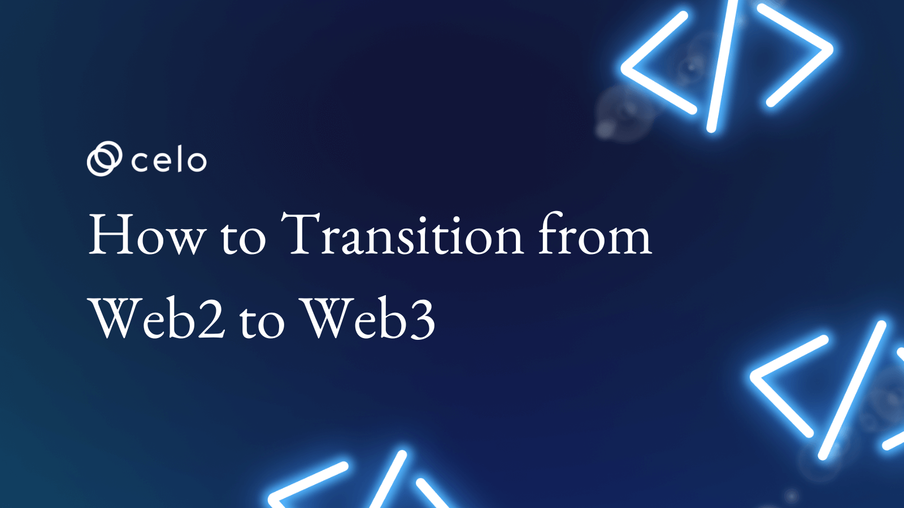
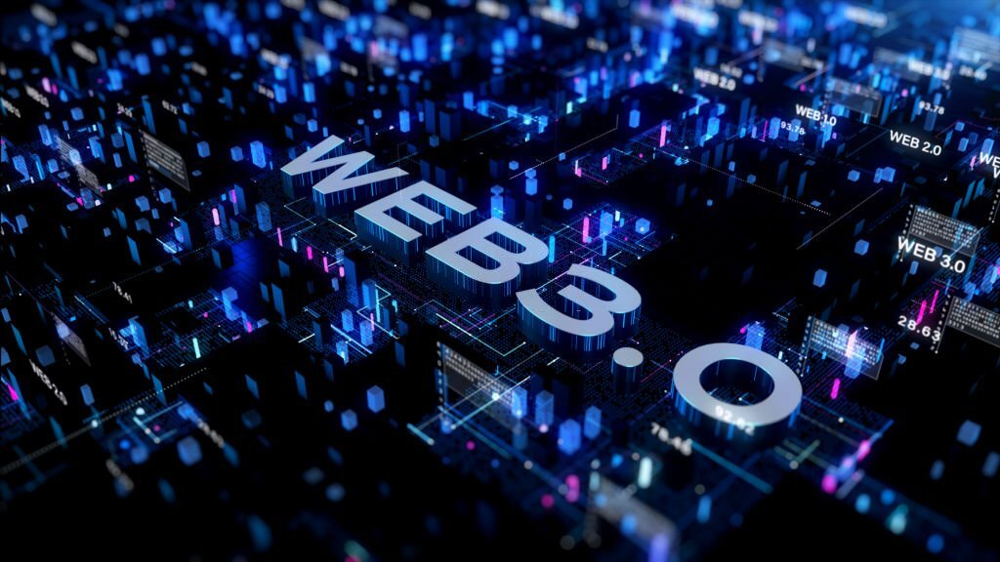
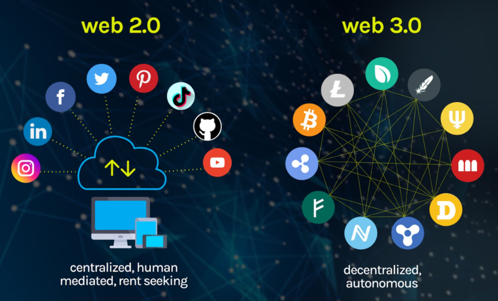
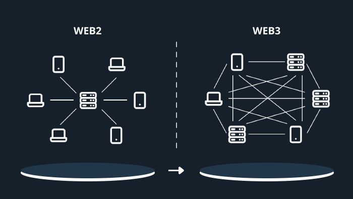

## Introduction

The online world is continuously developing, expanding, fixing bugs, and adding new features to overcome limitations. Some advances, such as the rise of social media, have marked each generation of the Internet since the beginning. There will be a manageable break in continuity as Web2's shortcomings will likely be addressed by Web3 systems.

Web3 is an improved version of the web whose fundamental principles are founded on blockchain and cryptocurrency technologies which aim to return control to its users. It introduces many shifts, including the consolidation of content and digital space ownership into the hands of service providers with vested interests. The users of a Web3 network have complete authority over the network's data, resources, and even social dynamics.

However, the transition from Web2 to Web3 is something that only some are familiar with, as Web3 is still uncharted territory. That is why in this article, we explore the basic concept of what Web3 is, what its defining features are, and how to transition from Web2 to Web3 efficiently.

## How do we Conceptualize Web3?

*Image Source*: [istock](https://www.istockphoto.com/photo/web-3-0-on-futuristic-electronic-board-background-technology-of-decentralized-social-gm1390600542-447505106)

To conceptualize what he saw as an improved version of the web, Ethereum co-founder Gavin Wood came up with Web3. He defined its primary objective as restoring internet governance to its user community rather than private corporations. The Web3 system accomplishes this by utilizing blockchain and cryptocurrency technology to establish a system of ownership.

A comparison between the early and modern stages of the internet shows the striking improvements expected for web3 is explained below:

Web1 was a strictly informational online service, with no room for user participation or interaction. Web2, the version currently in use, is a read-only version of the web in which users can only collaborate and share information. In Web3, in addition to reading and writing, users will be expected to have some ownership over their online content.

In contrast to Web2, where centralized platform providers reap all the rewards, Web3's core goal is to create a decentralized internet that provides new applicability and benefits both developers and users. It is the next iteration of the internet, with the ability to make the internet's benefits available to everyone without requiring the authorization of a central authority.

Everyone will have access to Web3, and there will be a shift in how users conduct their online interactions and financial transactions. For instance, instead of dealing with a third-party intermediary, transactions will be handled directly between peers or between peers and a contracting party. Users will also have a voice in developing a service or product through voting and other forms of governance.

## What are the Core Defining Features of Web3?

*Image Source*: vitalflux

Web3 is defined by a set of technological and blockchain integrations that, when combined, create an upgraded version of the internet. Below are some of those features:

**Decentralization**: This idea is key to Web 3.0 architecture. In Web 2.0, information is typically stored in a single, central location, accessible only via a specific web address, and accessed by computers over the Hypertext Transfer Protocol (HTTP).

Since information will be located on Web 3.0 according to data type, data might be stored in several places at once, making the system decentralized. By doing so, power would shift from centralized institutions to the users. Users will be able to retain ownership of their data, which can be sold via decentralized data networks.

**Trustless & Permissionless**: Web 3.0 will be trustless (allowing members to engage directly without going through a trusted intermediary) and permissionless (anyone can participate without authorization from a governing body). As a result, Web3 will be characterized by decentralized applications (dApps), blockchain operations, and decentralized peer-to-peer networks.

**A Semantic Web**: The Web3 will involve an influx of technology that will lead to improved internet use. Through semantic search and analysis, the Semantic Web will enable web technologies to better generate, exchange, and connect content based on the actual meaning of words, rather than just keywords or numbers.

**The Metaverse**: The evolution to Web3 will also be featured with the acceptance and rise of the metaverse. Many in the IT field envision the metaverse as the next generation of the internet: a unified, social, resilient, and fully three-dimensional online environment where people can have unique and extraordinary experiences unavailable in the real world. That roughly captures the expectations from Web3.

These features show that information and content will become increasingly interconnected and pervasive in Web 3.0, with access provided through a variety of applications and a growing number of commonplace web-enabled devices. The question then becomes not if or when but how one should evolve to catch up with the Web.

## How to Transition from Web2 to Web3

*Image Source*: [leewayhertz](https://www.leewayhertz.com/how-to-migrate-a-web2-application-to-web3/)

The transition from Web2 to Web3 is dependent on the right application of Web3 features for each phase of the transition. To shift seamlessly, you should be aware of the following options.

**Understand Web3**: Aside from understanding the core features of Web3, you must have a basic familiarity with Web3. To transition from one phase to the other, you'll need to understand the limitations of Web3 and find ways to make those limitations potential areas for improvement as defined by the core features.

For a Web3-based digital ecosystem to be successful, it must meet the needs of its users and solve Web2 problems. This necessitates a major shift in perception and operations, along with reconsidering how to adjust the current Web.

Given that not everyone will be required to make the same changes, it is crucial to make the shift smooth and construct a Web3 transition plan that suits your exact situation, and that will meet your future needs. Participating in a decentralized autonomous organization (DAO) can provide valuable insight into the inner workings of Web3.

**Transition Slowly**: Participating in this transition requires reassuring users that they won't notice a significant break in services due to your approach toward transitioning. This should be in addition to developing a user-friendly interface, enhancing the accessibility of Web3 components, and setting up learning methods that will ease users and operators into the new Web.

**Do not Discard Web2**: Every aspect of your online service, from the user interface to the data storage, must be hosted on-chain if a full transition to Web3 is to be realized. Because there is no requirement for outdated facilities, there will be fewer delays and less need for maintenance. This will produce a completely genuine Web3 experience while also dramatically enhancing performance.

However, you should note that an effective transitioning strategy will incorporate both Web2 and Web3 techniques. Moreover, Web3 and the metaverse will primarily alter marketing and communication roles, paving the way for new job titles, which means that transitioning from one to the other has to come from an already established and solid Web2 foundation.

## What to Look out for when Transitioning from Web2 to Web3

Blockchain promises a wide variety of benefits and applications. However, there are still significant obstacles to overcome before this vision of Web3 can become a reality.

**Partial Decentralization**: Many so-called dApps are not fully decentralized since the front-end components of such services run on the cloud. Consequently, users must rely on Web2 infrastructure to access decentralized services, with the blockchain serving as a data transmission and storage gateway. Since the underlying consensus protocol lacks strong decentralization assumptions, blockchain ecosystems that should be intended as decentralized networks lose that distinction.

**Lack of Interoperability**: The persistent need for value transfer between blockchains is just one complication brought on by the rapid expansion of blockchain ecosystems. It is becoming more unlikely that a single blockchain will suit all of society's needs due to the trade-offs involved in decentralization, security, scalability, and prices.

Therefore, each blockchain ecosystem has become an isolated system with limited access. Users and developers of dApps who want to embrace easily and reap the benefits of numerous chains need to be improved by the blockchain's widespread inoperability. For the time being, the only way to gain access to multiple blockchain technologies is to address the interoperability issue.

## Conclusion

For those who understand the potential of the blockchain revolution and realize that Web3 is the way of the future, Web2 can be a challenging place to transition from. Major technology firms from both the Web2 and Web3 spheres are trying to find seamless ways to ease into Web3.

An example is the [Celo](https://celo.org/) blockchain which allows people worldwide to conduct simple cryptocurrency transactions using their mobile phones. It is also essential that any attempt to rethink the Internet and transition from Web2 to Web3 be made with the users in mind rather than centralized corporations to meet its overarching standard of decentralization.

## About the Author

Tomiwa Oladipo is a freelance content writer for the emerging Web3 industry, writing blogs and articles about blockchain, NFTs, DeFi, and cryptocurrencies.
You can connect with me on [LinkedIn](https://www.linkedin.com/in/tomiwa-oladipo-12956416a/).

## References

- [The Transition from Web2 to Web3](https://eblockchainconvention.com/transition-from-web2-to-web3/)
- [5 key features that characterize Web 3.0](https://www.analyticssteps.com/blogs/key-features-characterize-web-3)
- [How to Transition from Web2 to Web3](https://dev.to/danytulumidis/how-to-transition-from-web2-to-web3-1n3g)
- [Introduction to Web3](https://ethereum.org/en/web3/)
- [What Is Web 3.0?](https://coinmarketcap.com/alexandria/article/what-is-web-3-0)  
- [Transitioning from Web2 to Web3 | Analog Insights](https://medium.com/@analogtime/transitioning-from-web2-to-web3-analog-insights-fe305f5a6f1c)
- [The Transition from Web2 to Web3 - More Responsibilities to Users with Significantly More Control](https://www.linkedin.com/pulse/transition-from-web2-web3-more-responsibilities-users-significantly-/)
- [3 STEPS TO TRANSITION YOUR WEB2 BRAND TO WEB3](https://metav.rs/blog/web3-steps-for-web2-brands/)
- [Transitioning from web2 to web3](https://bootcamp.uxdesign.cc/transitioning-from-web2-to-web3-7f9eb38e16f9)
