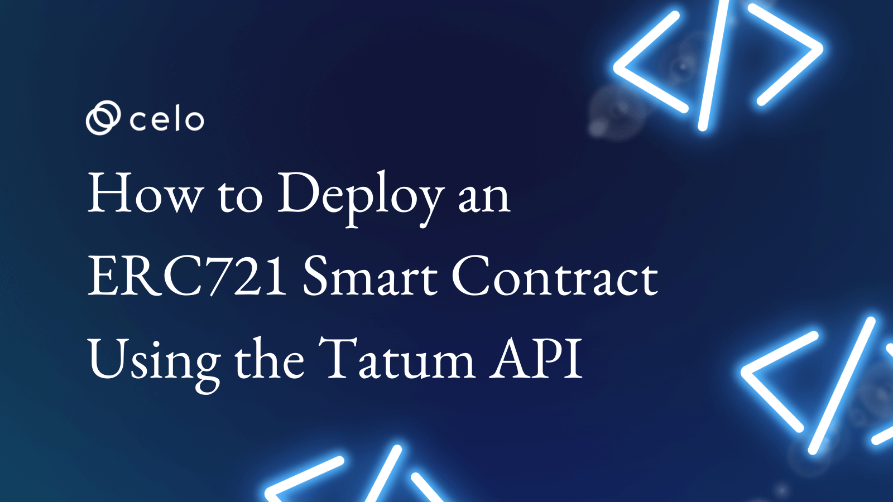

# Introdução

Realizar um deploy de um token **ERC721 em Celo** é fácil e rápido ao utilizar ferramentas de integração como **Tatum**.

Neste video mostraremos como você pode realizar um deploy do smart contract ERC721 na rede **Alfajores (rede de teste)** da Celo, mas também commo criar uma carteira, realizar transações, realizar uma recarga utilizando a **Faucet**.

# Pré-requisitos

Para este tutorial não é necessário conhecimento prévio. As ferramentas utilizadas serão:

- Tatum: [Tatum](https://tatum.io/) é a maneira mais rápida de criar, testar e executar aplicativos blockchain. Eles oferecem APIs e SDKs para você implementar sua ideia usando blockchain
- Faucet: [Faucet](https://faucet.celo.org) é utilizada para adicionar fundos a sua conta de teste na rede Alfajores
- Alfajores: É a rede de teste da Celo que utilizaremos para demonstração a implantação de um contrato inteligente e também realizar transações dos ativos

## Requisitos

- Criar uma conta no Tatum.io
- Utilizar uma ferramenta para consulta de API como Postman

## Tutorial

Confira no video como utilizar Tatum para realizar o deploy e mint de um NFT em Celo.

<iframe width="560" height="315" src="https://www.youtube.com/embed/7GKpSZL6irM" title="YouTube video player" frameborder="0" allow="accelerometer; autoplay; clipboard-write; encrypted-media; gyroscope; picture-in-picture; web-share" allowfullscreen></iframe>

## Conclusão

Parabéns! Você concluiu o tutorial de como realizar chamadas API usando Tatum e o blockchain da Celo 🎉 .

## Próximos passos

Como próximos passos sugiro a você consultar a documentação de API da [Tatum](https://apidoc.tatum.io/) e realizar novas chamadas não contempladas neste tutorial.

Além disso, convido você a ver nosso outro video que explica sobre a API Tatum para realizar deploy ERC20

## Sobre o Autor

Eu sou um empreendedor serial, founder da Guizo Studios e sempre disponível para ajudar o ecossistema Celo.

[LinkedIn](https://www.linkedin.com/in/ewertonlopes/)
