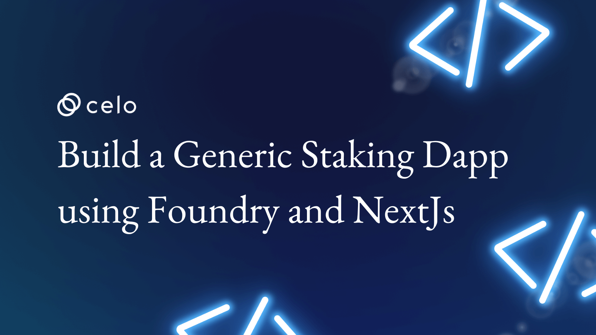

# Introduction

In the past years, Javascript has been very helpful in web3 development such as compiling, testing, deploying and interacting with smart contracts. However, it was argued Hardhat gained significant improvement over Truffle, most especially in testing and deploying smart contracts. While both tools leverage Javascript under the hood, however, a notably new tool called foundry does not rely on Javascript and was said to be more efficient. Let's see if the statement is true by building a generic staking DApp using foundry with a frontend to interact with it. 

# Prerequisites​

Above beginner level, you should know general programming. If you're a Rust developer, you might want to dig deeper into how to things work underneath. Basically, you do not have to worry about this. 

- Know solidity programming.
- You should understand Typescript and/or Javascript, and
- NextJs or ReactJs.

# Requirements​

This tutorial is to guide you on building a staking dApp. It will be in two parts:

- Smart contracts
- Backend/Frontend

**What we will not cover**

- Foundry installation done in this tutorial is targeted at Window Operating System.
We will not cover indexing backend like Subgraph since the frontend will directly interact with the blockchain using etherjs library. We also need the following tools. Be sure to have them installed before you proceed:

- Code editor. VSCode recommended.
- NodeJs version >=14.0.0

> Note: I use Node version "18.12.1"

# Smart Contracts

_Why you should use Foundry as a Celo developer?_

Foundry is an Ethereum Virtual Machine - EVM compatitble development tool with environment for developing EVM-based application. Unlike Hardhat and Truffle or other known tools that depend on Javascript as at when this article was written, Foundry is written in Rust programming language to make your development experience smoother by helping you to compile test-run, deploy smart contracts and interact with the blockchain directly from the command line. Foundry can interact with Celo blockchain using APIs to deploy contract onto Celo.

**Some features of foundry you should know**

- It is written in Rust language.
- Rust is efficient in managing system memory hence good performance.

Foundry is an umbrella name subdivided into the following components 

- Forge
A tool in Foundry for compiling, test and deploy smart contracts. 

- Cast
After deployment, Cast helps you to interact with the deployed contracts.

- Anvil
Like Ganache and Hardhat Node, Anvil is a local testnet Node that mimmicks and fork existing networks so you can deploy contract locally and test before deploying to live network such as testnet or mainnet.

Let's set up our development environment. Firstly, we will install Foundry. To successfully install foundry, since it was written in Rust, we need to have rust installed. It is recommended to install Rust on Windows. Before doing that, first create a repository using your choice of name. I call it "celo-staking-dapp". Clone it to your machine and navigate into the project directory.

- Download Rust from the [official website](https://www.rust-lang.org/tools/install). Your type of operating system will be automatically detected and you're shown the recommended version.

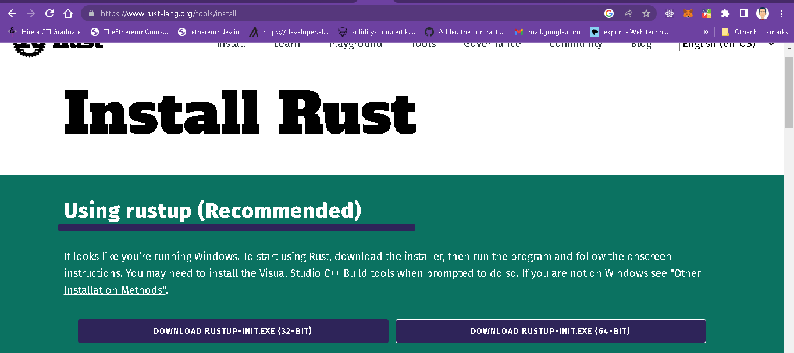

- After Rust is downloaded, run the following command to install the Microsoft C and C++ toolchain.

```bash
rustup default stable-msvc
```
- You can confirm if Rust is installed. Run this command in the terminal.

```bash
cargo --version
```

At this point, If do you not already have VSCode installed, do install it first.

- Next, search for "rust-analyzer" extension from the VSCode extensions menu using the combination keys below or use this [link](https://marketplace.visualstudio.com/items?itemName=matklad.rust-analyzer)

```bash
Ctrl+Shift+X
```

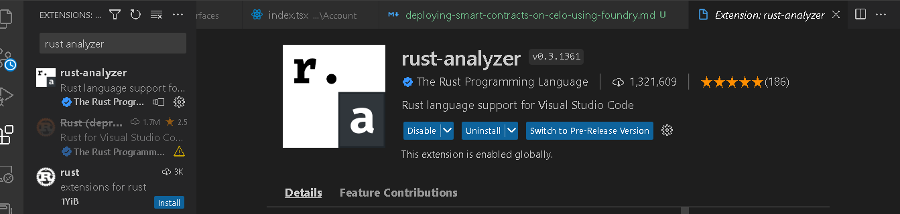

- You may now install foundry. This might take several minutes depending on the strength of your network.

```bash
cargo install --git https://github.com/foundry-rs/foundry foundry-cli anvil --bins --locked
```

- Wait until the process is completed.

If everything is installed correctly, you should see this success feedback.

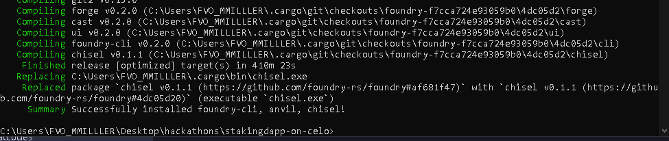

Start a new project by typing "forge init" command in the terminal from the project's folder, followed by the project name.

```bash
forge init foundry-dapp
```

> Note : If you get a weird error as shown in the image below, You may need to commit the changes first before running new commands. Foundry is not happy is you have too many new changes not committed to the repository.

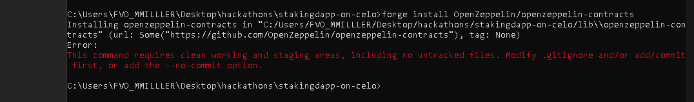

You could as well bypass the error by using the '--no-commit' flag. This will tell foundry to skip the strict check, and you should be good to go.

```bash
forge init foundry --no-commit --force
```

Your setup should look like this. It contains four folders and one file.

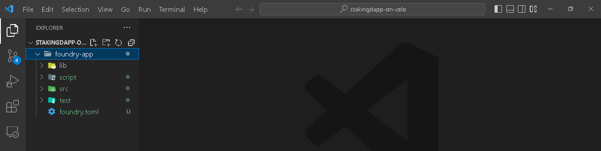

- lib 
This folder houses all of the dependencies/external library you need or ones preinstalled for you by foundry. Usually, the preinstalled libraries are needed for testing purpose.

- script
It contains deployment scripts.

- src
Your smart contract files are kept here. It comes with example smart contract and you're free to remove them if you have no need for them. 

- test
This is where your test files are kept.

- foundry.toml: Foundry configuration file.

Before you proceed, create a '.gitmodules' file in the project's root directory. Foundry needs it to keep track of updates to the libraries.

In our staking contracts, we will require a few modules from the Openzeppelin library. Installing the library is a bit different from other Javascript based tools. On the surface, Foundry does not use npm packages and their import paths will not work with Foundry. We will use the Openzeppelin's github repository named "OpenZeppelin" to grab the library.

```bash
forge install OpenZeppelin/openzeppelin-contracts
```

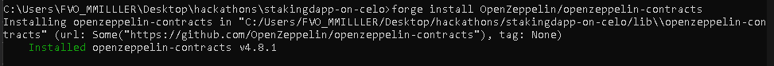

While using Foundry as at the time of writing this tutorial, importing files in VSCode does not give a smooth experience as you would using hardhat or other web3 tools. To fix that, we need make an adjustment in 'foundry.toml' file. Copy/paste the following code in the ".toml" file.

```bash
remappings = ['@openzeppelin-contracts/=lib/openzeppelin-contracts/contracts/', 'solmate/=lib/solmate/src/']
```
Here, we are simply telling foundry to create a mapping rule with reference to 'lib' folder, so that we can access the contents inside '@openzeppelin-contracts'.

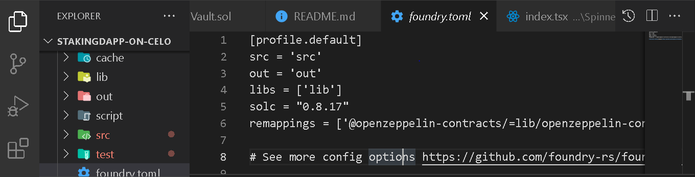

## What the Staking contracts does!

We will write a vault contract where $Celo holders can support the platform by committing their quotas in our staking machine. In turn, they earn our native token - '$RTK'as reward for keeping the platform running.

<!-- Check and copy the full code **[here](https://github.com/bobeu/stakingdapp-on-celo/f)**. -->

Under the source folder, create three folders and a file.
Your file structure should be in the following order:

- src
  - account
  - interfaces
  - reward
    - Vault.sol


I have already written the code to make this tutorial as less wordy. Let's populate the files with their respective code. 

```bash src/account/Account.sol
// SPDX-License-Identifier: MIT
pragma solidity 0.8.17;

import "../reward/IERC20.sol";
import "../interfaces/IAccount.sol";

contract Account is IAccount {
  error UnAuthorizedCaller(address);
  event CeloReceived(uint);

  // Owner address
  address private owner;

  // Reward token
  IERC20 private rewardToken;

  // To accept Celo at contract creation, we need to make the constructor payable.

  constructor(IERC20 _rewardToken) payable {
    owner = msg.sender;
    rewardToken = _rewardToken;
  }
  
  //Fallback
  receive() external payable {
    emit CeloReceived(msg.value);
  }

  // Only owner can call when this is invoked
  modifier onlyOwner() {
    if(msg.sender != owner) revert UnAuthorizedCaller(msg.sender);
    _;
  }

  ///@dev Withdraw Celo of @param amount : amount to withdraw from contract 
  function withdrawCelo(address to) external onlyOwner {
    uint balance = address(this).balance;
    (bool success,) = to.call{value: balance}("");
    require(success, "withdrawal failed");
  }

  ///@dev Withdraw reward token 
  function withdrawERC20(address to) external onlyOwner {
    uint balance = IERC20(rewardToken).balanceOf(address(this));
    if(balance >  0) require(IERC20(rewardToken).transfer(to, balance), "Failed");
  } 
}
```

```bash src/interfaces/IAccount.sol
// SPDX-License-Identifier: MIT
pragma solidity 0.8.17;

interface IAccount {
  function withdrawCelo(address to) external;
  function withdrawERC20(address to) external;
}
```

```bash src/interfaces/IVault.sol
// SPDX-License-Identifier: MIT
pragma solidity 0.8.17;

interface IVault {
  // Stakers profile data
  struct Staker {
      uint depositTime;
      uint celoAmount;
      address account;
  }

  function stake() external payable returns(bool);
  function unstake() external returns(bool);
}
```

> Note: The next three files may not need to be explicitly written out in separate files since we could simply import them directly from the Openzeppelin library. But for the sake of this tutorial, it is relevant to specify which of the OZ modules we are working with. I made a few twist to the imported contract files to achieve optimum compatibility. You should always avoid direct alteration of such as the OZ library except you know what you're doing.

```bash ERC20.sol
// SPDX-License-Identifier: MIT
// OpenZeppelin Contracts (last updated v4.8.0) (token/ERC20/ERC20.sol)

pragma solidity 0.8.17;

import "./IERC20Metadata.sol";
import "@openzeppelin-contracts/utils/Context.sol";

/**
 * @dev Implementation of the {IERC20} interface.
 *
 * This implementation is agnostic to the way tokens are created. This means
 * that a supply mechanism has to be added in a derived contract using {_mint}.
 * For a generic mechanism see {ERC20PresetMinterPauser}.
 *
 * TIP: For a detailed writeup see our guide
 * https://forum.openzeppelin.com/t/how-to-implement-erc20-supply-mechanisms/226[How
 * to implement supply mechanisms].
 *
 * We have followed general OpenZeppelin Contracts guidelines: functions revert
 * instead returning `false` on failure. This behavior is nonetheless
 * conventional and does not conflict with the expectations of ERC20
 * applications.
 *
 * Additionally, an {Approval} event is emitted on calls to {transferFrom}.
 * This allows applications to reconstruct the allowance for all accounts just
 * by listening to said events. Other implementations of the EIP may not emit
 * these events, as it isnt required by the specification.
 *
 * Finally, the non-standard {decreaseAllowance} and {increaseAllowance}
 * functions have been added to mitigate the well-known issues around setting
 * allowances. See {IERC20-approve}.
 */
abstract contract ERC20 is Context, IERC20Metadata {
    mapping(address => uint256) private _balances;

    mapping(address => mapping(address => uint256)) private _allowances;

    uint256 private _totalSupply;

    string private _name;
    string private _symbol;

    /**
     * @dev Sets the values for {name} and {symbol}.
     *
     * The default value of {decimals} is 18. To select a different value for
     * {decimals} you should overload it.
     *
     * All two of these values are immutable: they can only be set once during
     * construction.
     */
    constructor(string memory name_, string memory symbol_) {
        _name = name_;
        _symbol = symbol_;
    }

    /**
     * @dev Returns the name of the token.
     */
    function name() public view virtual override returns (string memory) {
        return _name;
    }

    /**
     * @dev Returns the symbol of the token, usually a shorter version of the
     * name.
     */
    function symbol() public view virtual override returns (string memory) {
        return _symbol;
    }

    /**
     * @dev Returns the number of decimals used to get its user representation.
     * For example, if `decimals` equals `2`, a balance of `505` tokens should
     * be displayed to a user as `5.05` (`505 / 10 ** 2`).
     *
     * Tokens usually opt for a value of 18, imitating the relationship between
     * Ether and Wei. This is the value {ERC20} uses, unless this function is
     * overridden;
     *
     * NOTE: This information is only used for _display_ purposes: it in
     * no way affects any of the arithmetic of the contract, including
     * {IERC20-balanceOf} and {IERC20-transfer}.
     */
    function decimals() public view virtual override returns (uint8) {
        return 18;
    }

    /**
     * @dev See {IERC20-totalSupply}.
     */
    function totalSupply() public view virtual override returns (uint256) {
        return _totalSupply;
    }

    /**
     * @dev See {IERC20-balanceOf}.
     */
    function balanceOf(address account) public view virtual override returns (uint256) {
        return _balances[account];
    }

    /**
     * @dev See {IERC20-transfer}.
     *
     * Requirements:
     *
     * - `to` cannot be the zero address.
     * - the caller must have a balance of at least `amount`.
     */
    function transfer(address to, uint256 amount) public virtual override returns (bool) {
        address owner = _msgSender();
        _transfer(owner, to, amount);
        return true;
    }

    /**
     * @dev See {IERC20-allowance}.
     */
    function allowance(address owner, address spender) public view virtual override returns (uint256) {
        return _allowances[owner][spender];
    }

    /**
     * @dev See {IERC20-approve}.
     *
     * NOTE: If `amount` is the maximum `uint256`, the allowance is not updated on
     * `transferFrom`. This is semantically equivalent to an infinite approval.
     *
     * Requirements:
     *
     * - `spender` cannot be the zero address.
     */
    function approve(address spender, uint256 amount) public virtual override returns (bool) {
        address owner = _msgSender();
        _approve(owner, spender, amount);
        return true;
    }

    /**
     * @dev See {IERC20-transferFrom}.
     *
     * Emits an {Approval} event indicating the updated allowance. This is not
     * required by the EIP. See the note at the beginning of {ERC20}.
     *
     * NOTE: Does not update the allowance if the current allowance
     * is the maximum `uint256`.
     *
     * Requirements:
     *
     * - `from` and `to` cannot be the zero address.
     * - `from` must have a balance of at least `amount`.
     * - the caller must have allowance for ``from``s tokens of at least
     * `amount`.
     */
    function transferFrom(
        address from,
        address to,
        uint256 amount
    ) public virtual override returns (bool) {
        address spender = _msgSender();
        _spendAllowance(from, spender, amount);
        _transfer(from, to, amount);
        return true;
    }

    /**
     * @dev Atomically increases the allowance granted to `spender` by the caller.
     *
     * This is an alternative to {approve} that can be used as a mitigation for
     * problems described in {IERC20-approve}.
     *
     * Emits an {Approval} event indicating the updated allowance.
     *
     * Requirements:
     *
     * - `spender` cannot be the zero address.
     */
    function increaseAllowance(address spender, uint256 addedValue) public virtual returns (bool) {
        address owner = _msgSender();
        _approve(owner, spender, allowance(owner, spender) + addedValue);
        return true;
    }

    /**
     * @dev Atomically decreases the allowance granted to `spender` by the caller.
     *
     * This is an alternative to {approve} that can be used as a mitigation for
     * problems described in {IERC20-approve}.
     *
     * Emits an {Approval} event indicating the updated allowance.
     *
     * Requirements:
     *
     * - `spender` cannot be the zero address.
     * - `spender` must have allowance for the caller of at least
     * `subtractedValue`.
     */
    function decreaseAllowance(address spender, uint256 subtractedValue) public virtual returns (bool) {
        address owner = _msgSender();
        uint256 currentAllowance = allowance(owner, spender);
        require(currentAllowance >= subtractedValue, "ERC20: decreased allowance below zero");
        unchecked {
            _approve(owner, spender, currentAllowance - subtractedValue);
        }

        return true;
    }

    /**
     * @dev Moves `amount` of tokens from `from` to `to`.
     *
     * This internal function is equivalent to {transfer}, and can be used to
     * e.g. implement automatic token fees, slashing mechanisms, etc.
     *
     * Emits a {Transfer} event.
     *
     * Requirements:
     *
     * - `from` cannot be the zero address.
     * - `to` cannot be the zero address.
     * - `from` must have a balance of at least `amount`.
     */
    function _transfer(
        address from,
        address to,
        uint256 amount
    ) internal virtual {
        require(from != address(0), "ERC20: transfer from the zero address");
        require(to != address(0), "ERC20: transfer to the zero address");

        _beforeTokenTransfer(from, to, amount);

        uint256 fromBalance = _balances[from];
        require(fromBalance >= amount, "ERC20: transfer amount exceeds balance");
        unchecked {
            _balances[from] = fromBalance - amount;
            // Overflow not possible: the sum of all balances is capped by totalSupply, and the sum is preserved by
            // decrementing then incrementing.
            _balances[to] += amount;
        }

        emit Transfer(from, to, amount);

        _afterTokenTransfer(from, to, amount);
    }

    /** @dev Creates `amount` tokens and assigns them to `account`, increasing
     * the total supply.
     *
     * Emits a {Transfer} event with `from` set to the zero address.
     *
     * Requirements:
     *
     * - `account` cannot be the zero address.
     */
    function _mint(address account, uint256 amount) internal virtual {
        require(account != address(0), "ERC20: mint to the zero address");

        _beforeTokenTransfer(address(0), account, amount);

        _totalSupply += amount;
        unchecked {
            // Overflow not possible: balance + amount is at most totalSupply + amount, which is checked above.
            _balances[account] += amount;
        }
        emit Transfer(address(0), account, amount);

        _afterTokenTransfer(address(0), account, amount);
    }

    /**
     * @dev Destroys `amount` tokens from `account`, reducing the
     * total supply.
     *
     * Emits a {Transfer} event with `to` set to the zero address.
     *
     * Requirements:
     *
     * - `account` cannot be the zero address.
     * - `account` must have at least `amount` tokens.
     */
    function _burn(address account, uint256 amount) internal virtual {
        require(account != address(0), "ERC20: burn from the zero address");

        _beforeTokenTransfer(account, address(0), amount);

        uint256 accountBalance = _balances[account];
        require(accountBalance >= amount, "ERC20: burn amount exceeds balance");
        unchecked {
            _balances[account] = accountBalance - amount;
            // Overflow not possible: amount <= accountBalance <= totalSupply.
            _totalSupply -= amount;
        }

        emit Transfer(account, address(0), amount);

        _afterTokenTransfer(account, address(0), amount);
    }

    /**
     * @dev Sets `amount` as the allowance of `spender` over the `owner` s tokens.
     *
     * This internal function is equivalent to `approve`, and can be used to
     * e.g. set automatic allowances for certain subsystems, etc.
     *
     * Emits an {Approval} event.
     *
     * Requirements:
     *
     * - `owner` cannot be the zero address.
     * - `spender` cannot be the zero address.
     */
    function _approve(
        address owner,
        address spender,
        uint256 amount
    ) internal virtual {
        require(owner != address(0), "ERC20: approve from the zero address");
        require(spender != address(0), "ERC20: approve to the zero address");

        _allowances[owner][spender] = amount;
        emit Approval(owner, spender, amount);
    }

    /**
     * @dev Updates `owner` s allowance for `spender` based on spent `amount`.
     *
     * Does not update the allowance amount in case of infinite allowance.
     * Revert if not enough allowance is available.
     *
     * Might emit an {Approval} event.
     */
    function _spendAllowance(
        address owner,
        address spender,
        uint256 amount
    ) internal virtual {
        uint256 currentAllowance = allowance(owner, spender);
        if (currentAllowance != type(uint256).max) {
            require(currentAllowance >= amount, "ERC20: insufficient allowance");
            unchecked {
                _approve(owner, spender, currentAllowance - amount);
            }
        }
    }

    /**
     * @dev Hook that is called before any transfer of tokens. This includes
     * minting and burning.
     *
     * Calling conditions:
     *
     * - when `from` and `to` are both non-zero, `amount` of ``from``s tokens
     * will be transferred to `to`.
     * - when `from` is zero, `amount` tokens will be minted for `to`.
     * - when `to` is zero, `amount` of ``from``s tokens will be burned.
     * - `from` and `to` are never both zero.
     *
     * To learn more about hooks, head to xref:ROOT:extending-contracts.adoc#using-hooks[Using Hooks].
     */
    function _beforeTokenTransfer(
        address from,
        address to,
        uint256 amount
    ) internal virtual {}

    /**
     * @dev Hook that is called after any transfer of tokens. This includes
     * minting and burning.
     *
     * Calling conditions:
     *
     * - when `from` and `to` are both non-zero, `amount` of ``from``s tokens
     * has been transferred to `to`.
     * - when `from` is zero, `amount` tokens have been minted for `to`.
     * - when `to` is zero, `amount` of ``from``s tokens have been burned.
     * - `from` and `to` are never both zero.
     *
     * To learn more about hooks, head to xref:ROOT:extending-contracts.adoc#using-hooks[Using Hooks].
     */
    function _afterTokenTransfer(
        address from,
        address to,
        uint256 amount
    ) internal virtual {}
}
```

```bash src/reward/IERC20.sol
// SPDX-License-Identifier: MIT

pragma solidity 0.8.17;

/**
 * @dev Interface of the ERC20 standard as defined in the EIP.
 */
interface IERC20 {
    /**
     * @dev Emitted when `value` tokens are moved from one account (`from`) to
     * another (`to`).
     *
     * Note that `value` may be zero.
     */
    event Transfer(address indexed from, address indexed to, uint256 value);

    /**
     * @dev Emitted when the allowance of a `spender` for an `owner` is set by
     * a call to {approve}. `value` is the new allowance.
     */
    event Approval(address indexed owner, address indexed spender, uint256 value);

    /**
     * @dev Returns the amount of tokens in existence.
     */
    function totalSupply() external view returns (uint256);

    /**
     * @dev Returns the amount of tokens owned by `account`.
     */
    function balanceOf(address account) external view returns (uint256);

    /**
     * @dev Moves `amount` tokens from the caller s account to `to`.
     *
     * Returns a boolean value indicating whether the operation succeeded.
     *
     * Emits a {Transfer} event.
     */
    function transfer(address to, uint256 amount) external returns (bool);

    /**
     * @dev Returns the remaining number of tokens that `spender` will be
     * allowed to spend on behalf of `owner` through {transferFrom}. This is
     * zero by default.
     *
     * This value changes when {approve} or {transferFrom} are called.
     */
    function allowance(address owner, address spender) external view returns (uint256);

    /**
     * @dev Sets `amount` as the allowance of `spender` over the caller s tokens.
     *
     * Returns a boolean value indicating whether the operation succeeded.
     *
     * IMPORTANT: Beware that changing an allowance with this method brings the risk
     * that someone may use both the old and the new allowance by unfortunate
     * transaction ordering. One possible solution to mitigate this race
     * condition is to first reduce the spender s allowance to 0 and set the
     * desired value afterwards:
     * https://github.com/ethereum/EIPs/issues/20#issuecomment-263524729
     *
     * Emits an {Approval} event.
     */
    function approve(address spender, uint256 amount) external returns (bool);

    /**
     * @dev Moves `amount` tokens from `from` to `to` using the
     * allowance mechanism. `amount` is then deducted from the caller s
     * allowance.
     *
     * Returns a boolean value indicating whether the operation succeeded.
     *
     * Emits a {Transfer} event.
     */
    function transferFrom(
        address from,
        address to,
        uint256 amount
    ) external returns (bool);

    function mint(address to, uint amount) external returns(bool);

}
```

```bash src/reward/IERC20Metadata.sol
// SPDX-License-Identifier: MIT

pragma solidity 0.8.17;

import "./IERC20.sol";

/**
 * @dev Interface for the optional metadata functions from the ERC20 standard.
 *
 */
interface IERC20Metadata is IERC20 {
    /**
     * @dev Returns the name of the token.
     */
    function name() external view returns (string memory);

    /**
     * @dev Returns the symbol of the token.
     */
    function symbol() external view returns (string memory);

    /**
     * @dev Returns the decimals places of the token.
     */
    function decimals() external view returns (uint8);
}
```

```bash src/reward/RewardToken.sol
// SPDX-License-Identifier: UNLICENSED
pragma solidity 0.8.17;

import "../account/Account.sol";
import "./ERC20.sol";

contract RewardToken is ERC20 {
  uint public maxSupply;

  address public owner;

  constructor (address _owner, uint _maxSupply) ERC20("RewardToken", "RTK") {
    require(_maxSupply > 0, "Zero supply");
    maxSupply = _maxSupply * (10**18);
    owner = _owner;
  }

  function mint(address to, uint amount) external returns(bool) {
    require(msg.sender == owner, "Not Authorized");
    _mint(to, amount);
    return true;
  }
  
}
```

```bash src/Vault.sol
// SPDX-License-Identifier: UNLICENSED
pragma solidity 0.8.17;

import "@openzeppelin-contracts/utils/math/SafeMath.sol";
import "@openzeppelin-contracts/access/Ownable.sol";
import "../src/interfaces/IVault.sol";
import "../src/interfaces/IAccount.sol";
import "./account/Account.sol";

contract Vault is IVault, Ownable{
    using SafeMath for uint;

    error NoStakingDetected(uint);
    error InvalidStakeId(uint);
    error NothingToUnstake();
    error NotAuthorized();
    error ZeroValue(uint);

    event Staked(uint);
    event Unstaked(uint);

    // Minimum amount that can be staked
    uint public minimumStaking;

    // Total stakers
    uint public stakers;

    // Reward token
    IERC20 public token;

    ///@dev Mapping of rounds to stake vault
    mapping (address => Staker) private vault;

    constructor (uint _minimumStaking) {
        require(_minimumStaking > 0, "Minimum staking too low");
        minimumStaking = _minimumStaking;
    }

    receive() external payable {
        require(msg.value > 0, "");
    }

    function setToken(IERC20 _token) public onlyOwner {
        token = _token;
    }

    /**@dev Stake Celo for token reward.
     * - The amount of Celo sent along the call must be greater 
     *      than the minimum staking amount.
     * - We check if caller has existing account otherwise we 
     *      create a new account for them.
     * - We can make a dynamic staking i.e stakers can stake any amount
     *      Celo, anytime. Each stake is unique to another in timing and
     *      identity.
     */
    function stake() public payable override returns(bool){
        address alc;
        Staker memory stk = _getStakeProfile(msg.sender);
        if(msg.value < minimumStaking) revert ZeroValue(msg.value);
        alc = stk.account;
        if(alc == address(0)) {
            alc = address(new Account(token));
        }

        if(stk.celoAmount > 0) {
            _unstake(alc, stk.celoAmount, stk.depositTime);
        }
        vault[msg.sender] = Staker(_now(), msg.value, alc);
        stakers ++;
        emit Staked(msg.value);

        return true;
    }

    function _unstake(address alc, uint value, uint depositTime) private {
        stakers --;
        vault[msg.sender].celoAmount = 0;
        (bool sent,) = alc.call{value: value}("");
        require(sent, "Transfer rejected");
        uint reward = _calculateReward(value, depositTime);
        if(reward > 0) _mintRewardToken(alc, reward);

        emit Unstaked(value);
    }

    /**@dev Unstake Celo from the vault.
     */
    function unstake() public override returns(bool) {
        Staker memory stk = vault[msg.sender];
        if(stk.celoAmount == 0) revert NoStakingDetected(stk.celoAmount);
        require(stk.account != address(0), "Account anomally detected");
        _unstake(stk.account, stk.celoAmount, stk.depositTime);

        return true;
    }

    ///@dev Returns current unix time stamp
    function _now() internal view returns(uint) {
        return block.timestamp;
    }

    /**@dev Calculate reward due on staking.
     * @param stakedAmt - Exact amount staked.
     * @param depositTime - Time stake was made.
     * 
     * To get the reward, we compare the current unixtime to the time staking
     * was performed to get the time difference. If time difference is greater 
     * than 1 minute, multiplier will increase otherwise it defaults to 1.
     */
    function _calculateReward(uint stakedAmt, uint depositTime) internal view returns(uint reward) {
        uint divisor = 60;
        uint curTime = _now();
        if(curTime == depositTime) {
            reward = 10 ** 15;
            return reward;
        }

        if(curTime > depositTime) {
            uint timeDiff = curTime.sub(depositTime);
            if(timeDiff > 0){
                reward = timeDiff.mul(stakedAmt).div(divisor); // Weighted reward
            } else {
                reward = 1e15;
            }

        }
        return reward;
    }

    /// Mint rewardToken to staker on staking receipt
    function _mintRewardToken(address to, uint amount) private {
        require(IERC20(token).mint(to, amount), "");
    }

    function _getStakeProfile(address who) internal view returns(Staker memory) {
        return vault[who];
    } 

    function getStakeProfile() public view returns(Staker memory stk) {
        return _getStakeProfile(msg.sender);
    }

    ///@dev returns account of @param who : any valid address
    function withdraw() public {
        address alc = _getStakeProfile(msg.sender).account;
        IAccount(alc).withdrawCelo(msg.sender);
        IAccount(alc).withdrawERC20(msg.sender);
    }
}
```

## Compilation
To compile the contracts, run:

```bash
forge build
```
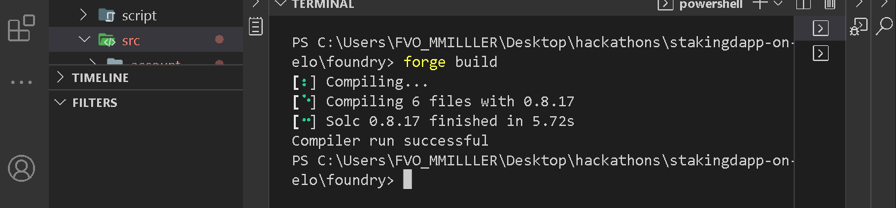

## Testing
With Foundry, testing contracts is much easier. You write tests using solidity which eliminates Javascript code and their dependencies. You onl need to focus on imporving your solidity skills. In Hardhat, often, externally owned accounts are used to interact with contracts but in 
foundry, you can easily do that with contracts. 

Under the test folder, I have written some tests to confirm that our staking dApp function as expected.

**Things you should know when tesing using foundry**
- Foundry looks for contracts with 'test' included as part of the name. Use the word 'test' as an affix.

_Example_

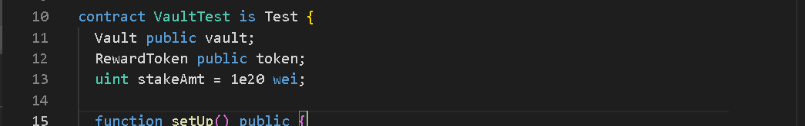

In the image, we inherit from the "forge-std/Test.sol" which gives us access to the utility functions such as the 'assertEq()'.

- Test file name should be in '.t.sol' extension. 

_Example_

```bash
Vault.t.sol, Token.t.sol, ContractName.t.sol, AnyValidName.t.sol etc.
```

Create a file names 'Vault.t.sol' under the test folder, then paste the following code.

```bash foundry/test/Vault.t.sol
// SPDX-License-Identifier: UNLICENSED
pragma solidity 0.8.17;

import "forge-std/Test.sol";
import "../src/Vault.sol";
import "../src/reward/RewardToken.sol";
import "../src/interfaces/IVault.sol";
import "../src/reward/IERC20.sol";

contract VaultTest is Test {
  Vault public vault;
  RewardToken public token;
  uint stakeAmt = 1e20 wei;

  function setUp() public {
    uint minimumStaking = 1e19 wei;
    // uint roundInterval = 1 seconds;
    uint maxSupply = 1_000_000_000 * (10**18);
    vault = new Vault(minimumStaking);
    token = new RewardToken(address(vault), maxSupply);
    vault.setToken(IERC20(token));
  }
  
  receive() external payable {}

  function testStake() public {
    uint depositTime = block.timestamp;
    (bool doneStaking) = vault.stake{value: stakeAmt}();
    assertEq(doneStaking, true);

    IVault.Staker memory stk = vault.getStakeProfile();
    assertEq(stk.depositTime, depositTime);
    assertEq(stk.celoAmount, stakeAmt);
    if(stk.account == address(0)) revert ("Zero address");
    assertEq(token.balanceOf(stk.account), 0);
  }

  function testUnstake() public {
    uint initbal = address(this).balance;
    require(vault.stake{value: stakeAmt}(), "Staking failed");
    assertEq(address(this).balance, initbal - stakeAmt);
    require(vault.unstake(), "Failed");
    IVault.Staker memory stk = vault.getStakeProfile();
    require(stk.account != address(0), "Zero alc");
    require(token.balanceOf(stk.account) == 1e15, "Zero token reward");
    assertEq(stk.celoAmount, 0);
  }

  function testWithdrawal() public {
    uint initBalance = address(this).balance;
    require(vault.stake{value: stakeAmt}(), "Staking failed");
    require(address(this).balance < initBalance, "Error");
    require(vault.unstake(), "Failed");
    vault.withdraw();
    assertEq(address(this).balance, initBalance);
    require(token.balanceOf(address(this)) > 0, "Zero token reward");
  }
}
```

Run:
```bash
forge test
```

Output:
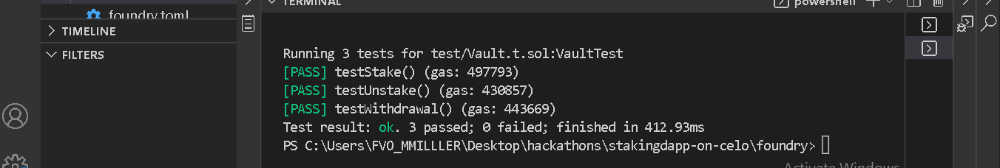

## Deployment
Foundry uses a set of command to deploy contracts to designated EVM network (s). I have used the basic command in the following format:

```bash
forge create <rpc url flag> <paste url here> <--constructor arguments flag> <place arguments here separated by a space> <private key flag> <follow by the private key> <path to the solidity file>
```

```bash Deploying Vault contract
forge create --rpc-url https://alfajores-forno.celo-testnet.org --constructor-args 10000000000000000000 2 --private-key <paste private key here> src/Vault.sol:Vault
```

_Output_
```bash
[⠢] Compiling 2 files with 0.8.17
[⠰] Solc 0.8.17 finished in 3.04s
Compiler run successful
Deployer: 0x85AbBd0605F9C725a1af6CA4Fb1fD4dC14dBD669
Vault Deployed to: 0x61FF31ec3bfbB8963B8180C845BAf57e5808deCF
Transaction hash: 0xe4dd50d71f47ec7c6dd5bf51163b57cb69b90aedb103ac891f18b19153175d9f
```


```bash Deploying Token
forge create --rpc-url https://alfajores-forno.celo-testnet.org --constructor-args vaultaddress 500000000 --private-key <paste private key here> src/RewardToken.sol:RewardTokenVault
```

_Output_
```bash
[⠔] Compiling 1 files with 0.8.17
[⠃] Solc 0.8.17 finished in 4.67s
Compiler run successful
Deployer: 0x85AbBd0605F9C725a1af6CA4Fb1fD4dC14dBD669
Deployed to: 0xb8e492D15471214Ba021bB53D07f4bCB40DCD235
Transaction hash: 0x6491f086afc4218d0e65080cf17b49f1cd0713281bd8174e1046234a770f54ba
```

# Frontend/Backend
This section focuses on building an user interface to interact with the contracts we deployed to the Alafajores network in the last section.

In the same project's root directory, start a new React/NextJs project.

- Create new folder.
```bash
mkdir frontend
```
- Navigate into the folder.
```bash
cd frontend
```

- Using Yarn, initialize a NextJs project that uses Typescript.

```bash
yarn create next-app --typescript
```

Follow the instructions provided in the terminal to complete the set up. We are going to leverage MUI (a component-based react library) to speed up the UI development. A huge thanks to the MUI team for making the library open to the public. Visit the **[documentation](https://mui.com)** to learn more.

Run the command to install MUI with its peer dependencies.

```bash
yarn add @mui/material @emotion/react @emotion/styled
```

In the same directory, install the rest of the dependencies.

```bash
yarn add "bignumber" "ethers" "web3" "antd" "react-blockies"
```

```bash
yarn add --dev "@types/react-blockies"
```

Since we are using Typescript, its a good practice to have custom types defined in a separate file. Create a new '.ts' file in the frontend directory.

> Note: Typescript helps us write better, clean, efficient and less buggy code.

```bash /frontend
mkdir intefaces.ts
```

Paste the following code.

```bash /frontend/interfaces
import BigNumber from "bignumber.js";
import { ethers } from "ethers";
import React, { CSSProperties } from "react";

export interface NotificationProps {
  message: string | JSX.Element;
  description: string | JSX.Element;
}

export interface PageProps {
  isUserAuthenticated: boolean;
  setAuthenticating: () => void;
  isAuthenticating: boolean;
  setauthentication: (x:boolean) => void;
  setAccount: (x:string) => void;
}

export interface AddressProp {
  account?: string;
  isAuthenticated?: boolean;
  styleAvatarLeft?: CSSProperties;
  styleAvatarRight?: CSSProperties;
  style?: CSSProperties;
  copyable?: boolean;
  styleCopy?: CSSProperties;
  avatar?: 'right' | 'left';
  display?: boolean;
  textStyle?: CSSProperties;
  size?: number;
  chainId?: SVGStringList;
}

export interface Explorer {
  address: string | null | undefined;
  chainId: any;
} 

export interface Profile {
  0: BigNumber;
  1: BigNumber;
  2: string;
  celoAmount: BigNumber;
  depositTime: BigNumber;
  account: string;
}

export const MockProfile = {
  0: BigNumber(0),
  1: BigNumber(0),
  2: "",
  3: "",
  depositTime: BigNumber(0),
  celoAmount: BigNumber(0),
  account: ""
}

export interface AppProps {
  account: string;
}

export interface TransactionResultProps {
  view: boolean; 
  receipt: ethers.ContractReceipt;
  readResult: BigNumber | Profile | string | number | Profile
}

export const transactionResult :TransactionResultProps = {
  view: false,
  receipt: {
    blockHash: '',
    blockNumber: 0,
    byzantium: false,
    confirmations: 0,
    contractAddress: '',
    cumulativeGasUsed: ethers.BigNumber.from(0),
    effectiveGasPrice: ethers.BigNumber.from(0),
    from: '',
    gasUsed: ethers.BigNumber.from(0),
    logs: [],
    logsBloom: '',
    to: '',
    transactionHash: '',
    transactionIndex: 0,
    type: 0,
    events: [],
    root: '',
    status: 0
  },
  readResult: MockProfile
}

export interface SpinnerProps {
  color: string;
  rest?: React.CSSProperties
}
```

Create a folder named 'components' with the following contents.

- components
    - App.tsx
    - Footer.tsx
    - LandingPage.tsx
    - useApp.js
  - Address
    - Blockie.tsx
    - index.tsx
  - apis
    - contractdata.ts
    - index.js
  - Spinner
    - index.tsx

The entry code to our dApp is in **/frontend/pages/index.tsx**. If user is authenticated, we allow them to interact with the dApp otherwise we show them the landing page. Our focus is on the 'App.tsx' file.

```bash /frontend/pages/index.tsx
import React from 'react';
import App from '../components/App'
import LandingPage from "../components/LandingPage"

export default function Home() {
  const [isUserAuthenticated, setAuthentication] = React.useState<boolean>(false);
  const setauthentication = (x:boolean) => setAuthentication(x);
  const [account, setAccount] = React.useState<string>("");
  const [isAuthenticating, setAuthenticating] = React.useState<boolean>(false);

  const setaccount = (x:string) => setAccount(x);
  const toggleAuthenticating = () => setAuthenticating(!isAuthenticating);

  return (
    <div >
      {
        !isUserAuthenticated ? <LandingPage
          isAuthenticating={isAuthenticating}
          setAuthenticating={toggleAuthenticating}
          isUserAuthenticated={isUserAuthenticated} 
          setauthentication={setauthentication}
          setAccount={setaccount}
        /> : <App account={account} />
      }
    </div>
  )
}
```

- useApp.js

It returns three functions: 
1. connectWallet: For authenticating users to our dApp.
2. switchNetwork: To relay users to Alfajores network.
3. addToken: Auto add '$RTK' token to metamask if it does not already exist.

```bash
import React from "react";
import { ethers } from "ethers";
import getContractData from "./apis/contractdata";

const alfajores = {
  chainId: "0xAEF3",
  chainName: "Alfajores",
  rpcUrls: ["https://alfajores-forno.celo-testnet.org"]
};

async function addToken() {
  const { tokenAddr } = getContractData();
  console.log("TokenAddr", tokenAddr);

  try {
    await window.ethereum
    .request({
      method: "wallet_watchAsset",
      params: {
        type: "ERC20",
        address: tokenAddr,
        symbol: "RTK",
        decimals: 18,
        image: ""
      }
    })
    .then(success => {
      if (success) {
        console.log(`${symbol} was added`);
      }
    })
  } catch (error) {
    console.log("Error", error);
  }
}

async function switchNetwork() {
  let done = false;
  try {
    await ethereum.request({
      method: "wallet_switchEthereumChain",
      params: [{ chainId: alfajores.chainId }]
    });
    done = true;
  } catch (switchError) {
    // This error code indicates that the chain has not been added to MetaMask.
    if (switchError) {
      console.log(`SwitchError: ${switchError}`);
      try {
        await ethereum.request({
          method: "wallet_addEthereumChain",
          params: [alfajores.chainId]
        });
        done = true;
      } catch (addError) {
        console.log("Could not add network");
      }
    }
  }
  return done;
}

const useApp = () => {
  async function getAccount() {
    let account = "";
    let rejectedRequestError = "";
    try {
      await window.ethereum
        .request({ method: "eth_requestAccounts" })
        .then(newAccounts => {
          if (newAccounts[0]) {
            account = newAccounts[0];
          }
        })
    } catch (error) {
      if (error.code === 4001) {
        // EIP-1193 userRejectedRequest error
        rejectedRequestError = error?.message;
      } else {
        console.error(error);
      }
    }
    return { account, rejectedRequestError };
  }

  async function requestWalletConnectPermissions() {
    let done = false;
    let address = "";

    try {
      await window.ethereum
        .request({
          method: "wallet_requestPermissions",
          params: [{ eth_accounts: {} }]
        })
        .then(async permissions => {
          const accountsPermission = permissions.find(permission => permission.parentCapability === "eth_accounts");
          if (accountsPermission) {
            done = true;
            const { account } = await getAccount();
            address = account;
            // await window.ethereum._metamask.isUnlocked().then((isUnlocked) => { done = isUnlocked; } );
          }
        })
    } catch (error) {
      // if (error.code === 4001) {
      // EIP-1193 userRejectedRequest error
      console.log("Permissions needed to continue.");
      console.error(error);
    }
    return { done, address };
  }

  return {
    connectWallet: requestWalletConnectPermissions,
    switchNetwork: switchNetwork,
    addNativeToken: addToken,
  };
};

export default useApp;
```


- App.tsx
```bash /frontend/components/App.tsx
import React, { useMemo, Key } from "react";
import Avatar from "@mui/material/Avatar";
import Button from "@mui/material/Button";
import TextField from "@mui/material/TextField";
import Box from "@mui/material/Box";
import AppBar from "@mui/material/AppBar";
import Toolbar from "@mui/material/Toolbar";
import Typography from "@mui/material/Typography";
import Container from "@mui/material/Container";
import { createTheme } from "@mui/material/styles";
import Footer from "../components/Footer";
import { notification } from "antd";
import getContractData from "../components/apis/contractdata";
import { Address } from "./Address";
import { AppProps, MockProfile, NotificationProps, TransactionResultProps } from "../interfaces";
import { blue, purple } from "@mui/material/colors";
import sendtransaction from "./apis";
import { ethers } from "ethers";
import BigNumber from "bignumber.js";
import { Spinner } from "./Spinner";
import Web3 from "web3";
import Image from "next/image";

const theme = createTheme();

const boxStyle = {
  profile_style: {
    display: 'flex',
    justifyContent: 'space-between',
    alignItems: 'center'
  },
  span_style: {
    background: "rgba(0, 10, 10, 0.5)",
    border: "0.1em solid gray",
    flexGrow: 1
  },
  topButton: {
    color: 'whitesmoke',
  }
}

function getTimeFromEpoch(onchainUnixTime:BigNumber) {
  const toNumber = onchainUnixTime? onchainUnixTime.toNumber() : 0;
  var newDate = new Date(toNumber * 1000);
  return `${newDate.toLocaleDateString("en-GB")} ${newDate.toLocaleTimeString("en-US")}`;
}

export default function App(props: AppProps) {
  const [functionName, setFunctionName] = React.useState<string>("stake");
  const [amountToStake, setAmountToStake] = React.useState<number>(0);
  const [tokenRewardBalance, setReward] = React.useState<any>(BigNumber('0.00'));
  const [response, setResponse] = React.useState<any>(MockProfile);
  const [loading, setLoading] = React.useState<boolean>(false);

  const { vaultAbi } = getContractData();
  const { account } = props;

  const handleAmountChange = (e: React.ChangeEvent<HTMLTextAreaElement | HTMLInputElement>) => {
    e.preventDefault();
    setAmountToStake(Number(e.target.value));
  };

  const cancelLoading = () => setLoading(false);

  React.useEffect(() => {
    const abortProcess = new AbortController();
    async function getTokenBalance() {
      if(account) {
        const res = await sendtransaction({account: account, functionName: "balance", cancelLoading: cancelLoading});
        setReward(res?.readResult);
      }
    }

    getTokenBalance();
    return () => abortProcess.abort();
  }, [response])

  const handleContractFunction = (x: string) => setFunctionName(x);

  const displayContractFunctions = useMemo(() => {
    let filt: any;
    if (!vaultAbi) return [];
    filt = vaultAbi.filter(method => method["type"] === "function");
    return filt.filter((method: { name: string }) => method.name === "stake" || method.name === "unstake");
  }, [vaultAbi]);

  const displayedViewFunctions = useMemo(() => {
    let filt: any;
    if (!vaultAbi) return [];
    filt = vaultAbi.filter(method => method["type"] === "function");
    return filt.filter((method: { name: string }) => method.name === "getStakeProfile" || method.name === "withdraw");
  }, [vaultAbi]);

  const openNotification = (props: NotificationProps) => {
    const { message, description } = props;

    notification.open({
      placement: "bottomRight",
      message,
      description,
      onClick: () => {
        console.log("Notification Clicked!");
      }
    });
  };

  const handleSubmit = async (event: React.FormEvent<HTMLFormElement>) => {
    event.preventDefault();
    let result: TransactionResultProps | null;
    setLoading(true);

    switch (functionName) {
      case 'stake':
        if (amountToStake === 0) {
          cancelLoading();
          return alert("Please enter amount of Celo to stake in wei");
        }
        const amtInBigNumber = BigNumber(amountToStake);
        const value = ethers.utils.hexValue(ethers.utils.parseUnits(amtInBigNumber.toString()));
        result = await sendtransaction({ value: value, functionName: functionName, cancelLoading: cancelLoading });
        break;

      case "unstake":
        result = await sendtransaction({
          functionName: functionName,
          cancelLoading: cancelLoading
        });
        break;

      case 'getStakeProfile':
        result = await sendtransaction({
          functionName: functionName,
          cancelLoading: cancelLoading
        });
        break;

      default:
        result = await sendtransaction({
          functionName: "withdraw",
          cancelLoading: cancelLoading
        });
        break;
    }
    if(result?.view === false) {
      openNotification({message: "Transaction completed with hash:", description: result?.receipt.transactionHash});
    } else {
      setResponse(result?.readResult);
    }
  };

  return (
    <React.Fragment>
      <Container maxWidth='md' component='main'>
        <AppBar position="static" sx={{background:'none'}}>
          <Toolbar sx={boxStyle.profile_style}>
            <Box sx={boxStyle.profile_style}>
              <Button variant="outlined" style={boxStyle.topButton} startIcon='Vault Balance:' endIcon=`${response?.account ? Web3.utils.fromWei(response?.celoAmount?.toString()) : 0} ${' $Celo'}` />
              <Button variant="outlined" style={boxStyle.topButton} startIcon='Staked time:' endIcon={getTimeFromEpoch(response?.depositTime)} />
              <Button variant="outlined" style={boxStyle.topButton} startIcon='RTK Reward:' endIcon={Web3.utils.fromWei(tokenRewardBalance.toString())} />
            </Box>
          </Toolbar>
        </AppBar>
      </Container>
      <Container maxWidth='md' component='main'>
        <Typography variant="h6" component="div" sx={{ flexGrow: 1, display: 'flex', justifyContent: 'center', alignItems:'center', gap:2}}>
          <span style={{color: 'green'}}>Connected!:</span> <Address account={account} size={6} copyable display />
        </Typography>
        <Box
          sx={{
            marginTop: 8,
            display: "flex",
            flexDirection: "column",
            alignItems: "center"
          }}
        >
          <Avatar sx={{ m: 1,  }}>
            <Image src='/celologopng.png' width={100} height={40} alt='celoLogo'/>
          </Avatar>
          <Typography component="h1" variant="h5">
            Stake <span style={{color: 'blue'}}>$</span>Celo - Earn <span style={{color: 'green'}}>$</span>RTK
          </Typography>
          <Box component="form" onSubmit={handleSubmit} noValidate sx={{ mt: 1 }}>
            <Box
              sx={{
                marginTop: 2,
                display: "flex",
                justifyContent: "space-between",
                alignItems: "center"
              }}
            >
              <div className="funcDiv">
                <Typography variant="h5">Transact</Typography>
                {displayContractFunctions.map((item: any, id: Key) => (
                  <Button
                    sx={{
                      "&:hover": {
                        color: "whitesmoke",
                        width: "fit-content",
                        border: `0.1em solid ${purple[900]}`
                      }
                    }}
                    onClick={() => handleContractFunction(item.name)}
                    key={id}
                    variant={"text"}
                  >
                    {item?.name}
                  </Button>
                ))}
              </div>
              <div className="funcDiv">
                <Typography variant="h5">Read</Typography>
                {displayedViewFunctions.map((item: any, id: Key) => (
                  <Button
                    sx={{
                      "&:hover": {
                        color: "whitesmoke",
                        width: "fit-content",
                        border: `0.1em solid ${purple[900]}`
                      }
                    }}
                    onClick={() => handleContractFunction(item?.name)}
                    key={id}
                    variant={"text"}
                  >
                    {item?.name}
                  </Button>
                ))}
              </div>
            </Box>
            {functionName === "stake" && <TextField margin="normal" required fullWidth id="text" label="Amount to stake" name="amount" autoComplete="amount" type={"number"} autoFocus sx={{ border: `0.1em solid ${blue[900]}`, borderRadius: "5px" }} style={{ color: "whitesmoke" }} onChange={(e) => handleAmountChange(e)} />}
            <Button
              type="submit"
              fullWidth
              variant="contained"
              sx={{
                mt: 3,
                mb: 2,
                height: '100px',
                fontWeight: "bold",
                display: 'flex',
                justifyContent: 'center',
                alignItems: 'center'
              }}
            >
              { loading? <span>Trxn in Progress ... <Spinner color={"white"} /></span> : functionName }
            </Button>
          </Box>
        </Box>
      </Container>
      <Footer sx={{ mt: 8, mb: 4 }} />
    </React.Fragment>
  );
}
```
- components/App.tsx contains the frontend logic that users interact with.
  - **getTimeFromEpoch()** : Since blockchains store time in unix format, this utility helps to convert unix time to human readable format.

  - **handleAmountChange()** takes the extracted amount user wishes to stake and store in state.

  - The component has one 'useEffect()' that pulls the token balance whenever the variable 'response' changes.

  - **handleContractFunction()** notices and tracks which function an user intends to call.

  - **displayContractFunctions()** filters the abi for functions that modifies the blockchain state.

  - **displayedViewFunctions()** filters the abi for readOnly functions.

  - **openNotification()** displays transactions hashes.

  - **handleSubmit()** sends user's composed transaction to the backend.

- It displays three components at the topbar:
  - Vault balance
    - i.e total amount user has staked in the vault.
  - Staked Time
    - Exact time that the staking was done.
  - RTK Reward
    - Total reward (in RewardToken) user has earned so far.

- We want to display to users an input field only if they have selected to stake.

## Backend interaction

This is an important part of the dApp that interacts with the blockchain using the 'etherJs' library and the injected global ethereum object.

- contractdata.ts
In this file, we pulled the application binary interface - ABI generated by Foundry during compilation from the 'out' folder under 'foundry' directory. Whenever the content in the 'out' folder changes, we will get the updated abi.

```bash /frontend/components/apis/contractdata.ts
import vault from "../../../foundry/out/Vault.sol/Vault.json";
import token from "../../../foundry/out/RewardToken.sol/RewardToken.json";

export default function getContractData() {
  return {
    vaultAbi: vault.abi,
    tokenAbi: token.abi,
    vaultAddr: "0x61FF31ec3bfbB8963B8180C845BAf57e5808deCF",
    tokenAddr: "0xb8e492D15471214Ba021bB53D07f4bCB40DCD235"
  }
}
```

> Note : I hardcoded the contract addresses since Foundry does not yet have a way to auto save the deployed network information. If you have a better way to do that, please share with me [on twitter](https://twitter.com/bobman7000).

- index.ts
```bash /frontend/components/apis/index.js
import { ethers } from "ethers";
import getContractData from "./contractdata";
import { transactionResult } from "@/interfaces";

async function sendtransaction(options) {
  const { vaultAbi, tokenAbi, vaultAddr, tokenAddr } = getContractData();

  const provider = new ethers.providers.Web3Provider(window.ethereum);
  if (!provider) return null;
  let result = transactionResult;
  const isUnlocked = await window.ethereum._metamask.isUnlocked();
  if (!isUnlocked) return null;
  
  try {
    // Vault contract instance
    const v_contractInstance = new ethers.Contract(vaultAddr, vaultAbi, provider);
    
    // token contract instance
    const t_contractInstance = new ethers.Contract(tokenAddr, tokenAbi, provider);
    
    const signer = provider.getSigner();
    const connectedSigner = v_contractInstance.connect(signer);
    
    switch (options?.functionName) {
      case 'stake':
        const txn = await connectedSigner.stake({value: options?.value });
        // const txn = await connectedSigner.setToken(tokenAddr);
        await txn?.wait(3).then((rec) => {
          result.receipt = rec;
          result.view = false;
          options?.cancelLoading();
        });
        break;
      
      case 'unstake':
        const txn2 = await connectedSigner.unstake();
        await txn2?.wait(3).then((rec) => {
          result.receipt = rec;
          result.view = false;
          options?.cancelLoading();
        });
        break;

      case 'withdraw':
        const txn3 = await connectedSigner.withdraw();
        await txn3?.wait(3).then((rec) => {
          result.receipt = rec;
          result.view = false;
          options?.cancelLoading();
        });
        break;

      case 'getStakeProfile':
        await connectedSigner.getStakeProfile().then((res) => {
          result.readResult = res;
          result.view = true;
          options?.cancelLoading();
        });
        break;

      default:
        await t_contractInstance.balanceOf(options?.account).then((res) => {
          result.readResult = res;
          result.view = true;
          options?.cancelLoading();
        });
        break;
      }
      
    } catch (error) {
      console.log(error);
      options?.cancelLoading();
    }
  return result;
};

export default sendtransaction;
```

This is the part that interacts with the blockchain using etherJs library.

- We constructed a Web3 provider using ethers "Web3Provider constructor" that accepts an external or JSONRPCProvider provider and return to us a new provider with signer.

- We check that the provider is ready for use and also if metamask is unlocked otherwise interaction is prevented from going further.

- Inside the 'try' block, the two contract instances are created and a switch statement that determines which function to send to the blockchain based on user's selection.

Navigate to the frontend folder if you're not, then run:

```bash
yarn run dev
```

Please visit **[this link](https://stakingdapp2.vercel.app/)** to interact with the dApp.

> Note Not optmimized for mobile view. Use desktop to get the best result.

A demo video **[here](https://youtu.be/8H-tctoES3Q)** explains how to interact it.

**[You can find the complete source code on the github](https://github.com/bobeu/stakingdapp-on-celo/)**. 

# Conclusion​

Congratulations on completing this tutorial. What we have learned so far:

- Foundry
  - What foundry is.
  - Why you should use it and how it works.
  - How to set it up.
  - How to use it to compile, test and deploy contracts to Celo networks.

- Frontend
  - Creating a React-based frontend to interact with Celo's testnet.
  - How to connect to Alfajores using bare etherjs and metamask.

# What next?​

Go over this tutorial as many times as you can to fully understand all of the concepts we have discussed so far. Practice will significantly improve your skills. Try creating something on your own and deploy to Celo testnet. Share with us on **[discord](https://discord.gg/celo)**. You can tag me if you wish. My discord username is '@bobelr#8524'. Happy reading!

# About the Author​

**Isaac Jesse** , aka _Bobelr_ is a smart contract/Web3 developer. He has been in the field since 2018, worked as an ambassador with several projects like Algorand and so on as content producer. He has also contributed to Web3 projects as a developer.

# References​

- [Celo developers resources](https://docs.celo.org/developer/)
- [Foundry](https://book.getfoundry.sh/)
- [MUI](https://mui.com)
- [Source code](https://github.com/bobeu/stakingdapp-on-celo/)