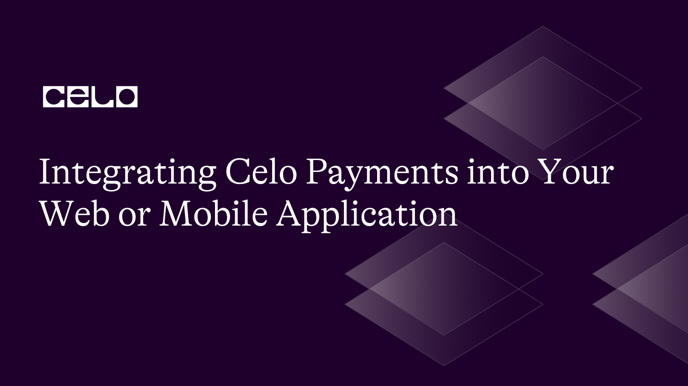
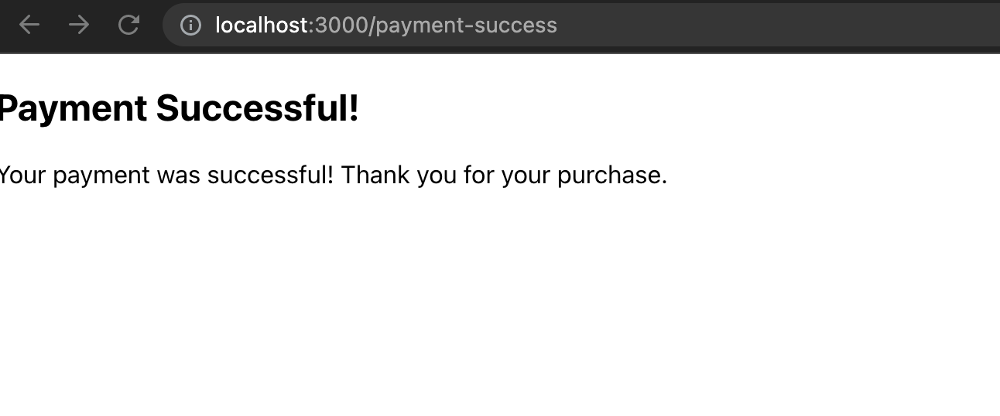
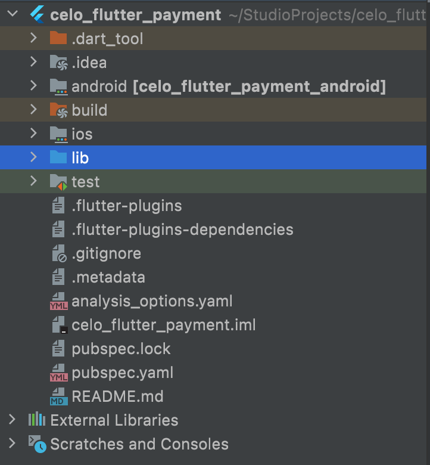
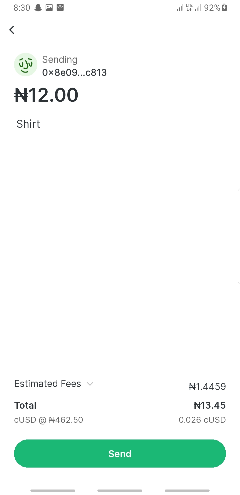

## Introduction​

Celo is a blockchain network with a mobile-first approach, making cryptocurrency user-friendly and simplifying access to global financial services. Using just a phone number to participate, Celo is compatible with Ethereum, offering a secure and decentralized payment option for users.

In this tutorial, developers will learn how to integrate the Celo payments network into their web or mobile applications. The tutorial covers the basic steps required to receive payments using the Celo network, including setting up a Celo account, creating a payment request, requesting payment from the user, and handling payment confirmation.

## Prerequisites​

Before we continue this tutorial, make sure you have an understanding of building web applications using React, and Mobile applications using Flutter. You should also have a basic understanding of blockchain technology and knowledge of a programming language such as JavaScript or TypeScript, dart.

## Requirements​

For this tutorial, you will need the following tools:

- Metamask (install from [here](https://metamask.io/download.html)).
- Node.js and NPM: To install, follow the instructions at [Node.js](https://nodejs.org/en/).
- Flutter - A mobile application framework built on the Dart programming language. You can install it from [here](https://flutter.dev/docs/get-started/install).
- Install the [Celo Alfajores Wallet](https://play.google.com/store/apps/details?id=org.celo.mobile.alfajores) on your mobile device.

## Setting Up a Celo Wallet

To interact with a Celo network for the web, we’ll need to create and configure a Celo wallet using Metamask. Follow these steps to create a new Celo wallet:

1. Install the Metamask browser extension and create a new wallet.
2. Click on the network dropdown in the Metamask window and select “Add network”.
3. Click on “Add network manually” at the bottom of your screen
4. Enter the following details for the Celo testnet:
   - Network Name: Celo Alfajores Testnet
   - New RPC URL: https://alfajores-forno.celo-testnet.org
   - Chain ID: 44787
   - Symbol: cUSD
   - Block Explorer URL: https://alfajores-blockscout.celo-testnet.org/
5. Click “Save” to add the Celo testnet to your Metamask network list.

Make sure to fund your account with some testnet CELO and cUSD tokens from the [Celo Testnet Faucet](https://celo.org/developers/faucet).

Your mobile wallet should also be funded with some Celo testnet funds as it would be needed when we integrate payments in our mobile application.

## Integrating Celo Payments in a React Web Application

Setting Up a React Project

Install the `create-react-app` CLI tool:

```bash
npm install -g create-react-app
```

Create a new React project:

```bash
create-react-app celo-payments-app
```

Open the project in your preferred IDE and navigate to the project directory:

```bash
cd celo-payments-web
```

### Building the project

Open the src/App.js file and replace its content with the following:

```js
import React from "react";
import { BrowserRouter as Router, Routes, Route } from "react-router-dom";
import ProductList from "./ProductList";
import PaymentSuccess from "./PaymentSuccess";

const App = () => {
  return (
    <Router>
      <Routes>
        <Route path="/" element={<ProductList />} />
        <Route path="/payment-success" element={<PaymentSuccess />} />
      </Routes>
    </Router>
  );
};

export default App;
```

The `ProductList` element will display a list of products with a Pay button for each product. The `PaymentSuccess` element will be shown when a payment is successful.

Next, we need to install the web3 package. This package provides the necessary functions to interact with Ethereum, and by extension, Celo. With the help of this package, we would be able to interact directly with our meta mask wallet

In your terminal, navigate to your project directory and run:

```bash
npm install web3
```

Now let's create the ProductList and PaymentSuccess components in the src directory:

```js
// ProductList.js

import React from "react";
import Web3 from "web3";
import { useNavigate } from "react-router-dom";

const ProductList = () => {
  const products = [
    {
      name: "Product 1",
      price: "1",
      imageUrl: "https://via.placeholder.com/150",
    },
    {
      name: "Product 2",
      price: "2",
      imageUrl: "https://via.placeholder.com/150",
    },
    {
      name: "Product 3",
      price: "3",
      imageUrl: "https://via.placeholder.com/150",
    },
  ];
  const navigate = useNavigate();

  const handlePayment = async (product) => {
    const web3 = new Web3(window.ethereum);
    const accounts = await window.ethereum.request({
      method: "eth_requestAccounts",
    });
    const account = accounts[0];

    const transactionParameters = {
      to: "0x7b7aeb7e1a298e5829144fc89e985a06f1b14059", // Replace with the recipient's address
      from: account,
      value: web3.utils.toHex(web3.utils.toWei(product.price, "ether")), // Replace with the payment amount
      chainId: "0xAF", // Alfajores Chain ID
    };

    web3.eth.sendTransaction(transactionParameters, (err, transactionHash) => {
      if (!err) {
        console.log(transactionHash);
        navigate("/payment-success"); // Redirects to the success page
      }
    });
  };

  return (
    <div>
      {products.map((product, index) => (
        <div key={index}>
          <h2>{product.name}</h2>
          
          <p>Price: {product.price} Celo</p>
          <button onClick={() => handlePayment(product)}>Pay</button>
        </div>
      ))}
    </div>
  );
};

export default ProductList;
```

```js
// PaymentSuccess.js

import React from "react";

const PaymentSuccess = () => {
  return (
    <div>
      <h2>Payment Successful!</h2>
      <p>Your payment was successful! Thank you for your purchase.</p>
    </div>
  );
};

export default PaymentSuccess;
```

In the `ProductList.js` file, when you click on the pay button, it calls the `handlePayment` function.
This function `handlePayment` is an asynchronous function that handles the payment transaction using the Celo network. It takes a product as an argument which presumably has a price property. Here is the breakdown of each step:

`const web3 = new Web3(window.ethereum);` - This line initializes a new Web3 instance using the Ethereum provider injected into the browser (e.gMetaMask).

`const accounts = await window.ethereum.request({ method: "eth_requestAccounts", });` - This line requests access to the user's Ethereum accounts. It's an asynchronous operation and will wait until the user has approved the request.

`const account = accounts[0];` - The first account in the array of accounts is used for the transaction.

The `transactionParameters` object is constructed with the following properties:

`to`: The recipient's address. This should be replaced with the actual recipient's address.
`from`: The sender's address, taken from the user's Ethereum accounts.
`value`: The amount of ether to send, converted from the product's price to wei (the smallest unit of ether) and then to a hexadecimal representation. This is done using the web3.utils.toWei and web3.utils.toHex methods.
`chainId`: The ID of the Celo Alfajores testnet. This should be replaced with the appropriate chain ID for the network you are using.
`web3.eth.sendTransaction(transactionParameters, (err, transactionHash) => { ... })` - This line sends the transaction to the Ethereum network. It's an asynchronous operation that takes a callback function which will be called when the transaction has been processed. The callback function takes two arguments: err and transactionHash. If err is not null, it means there was an error processing the transaction.
If err is null, it means the transaction was processed successfully, and transactionHash is the hash of the transaction. In this case, the user is redirected to the `/payment-success` route where they will see a success message.

This is a simple example and doesn't include any error handling or state management. In a real-world application, you would want to add more robust error handling and use a state management library like Redux to manage the application state.

### Testing the project

To start the development server, navigate to your project directory in your terminal and run the command below:

```bash
npm start
```

You would be redirected to your default browser and you should have the screen below:


When you click on any of the pay buttons, You would be directed to your MetaMask wallet where you can confirm or reject the transaction:


On confirmation, if the transaction is successful you should have this:



Congratulations! You’ve successfully integrated celo payments into your web application

## Integrating Celo Payments in a Flutter Mobile Application

### Initializing the project

Open your terminal and run the following command to create a new Flutter project:

```bash
flutter create celo_flutter_payment
```

Navigate to the project directory and open your project in your preferred IDE (Visual Studio Code or Android Studio)

```bash
cd celo_flutter_payment
```

You should have a directory structure of this format:



### Installing dependencies

Install the package required for this project by running the code below in your terminal:

```bash
flutter pub add url_launcher
```

Make sure you run this command at the root of your project.

### Building a Simple Interface

We would be building a simple user interface where the user clicks on a product's pay button, it opens the Celo wallet for the payment, and then the user makes the payment for that particular product.

Open your `main.dart` file and replace it with the code below:

```dart
import 'package:flutter/material.dart';

void main() {
 runApp(const MyApp());
}

class MyApp extends StatelessWidget {
 const MyApp({super.key});

 @override
 Widget build(BuildContext context) {
   return MaterialApp(
     home: Scaffold(
       appBar: AppBar(
         title: const Text('Celo Payment Demo'),
       ),
       body: ProductScreen(),
     ),
   );
 }
}
```

Create a `product_model.dart` file in your lib directory and add the following code to it:

```dart
class Product {
 final String name;
 final double price;
 final String imageUrl;

 Product({
   required this.name,
   required this.price,
   required this.imageUrl,
 });
}
```

Create a product_screen.dart file in your lib directory and add the following code to it:

```dart
import 'package:celo_flutter_payment/product_model.dart';
import 'package:flutter/material.dart';
import 'package:url_launcher/url_launcher.dart';

class ProductScreen extends StatelessWidget {
 ProductScreen({super.key});

 // Sample list of products
 final List<Product> _products = [
   Product(
     name: 'Sneakers',
     price: 0.001,
     imageUrl:
         'https://www-konga-com-res.cloudinary.com/w_auto,f_auto,fl_lossy,dpr_auto,q_auto/media/catalog/product/I/E/203218_1662079565.jpg',
   ),
   Product(
     name: 'Shirt',
     price: 12,
     imageUrl:
         'https://static.fibre2fashion.com/MemberResources/LeadResources/1/2021/5/Seller/21194119/Images/21194119_0_men-s-shirts.jpg',
   ),
   Product(
     name: 'Jean trouser',
     price: 8,
     imageUrl:
         'https://zuba.com.ng/wp-content/uploads/2020/06/13197251460_1820160955.460x460xz.jpg',
   ),
   Product(
     name: 'Nike Slide',
     price: 15,
     imageUrl:
         'https://cdn.shopify.com/s/files/1/0055/5502/8083/products/IMG-5706646f5eecd68151b6d61e1df56ca9-V_1024x1024@2x.jpg?v=1618572604',
   ),
 ];

 void _launchURL(String url) async {
   if (await canLaunchUrl(Uri.parse(url))) {
     await launchUrl(Uri.parse(url));
   } else {
     throw 'Could not launch $url';
   }
 }

 final String recipientAddress =
     '0x8e09955862A3Ae65bDfBAf82e55edA90E12fC813'; // replace with the receiver address

 @override
 Widget build(BuildContext context) {
   return Padding(
     padding: const EdgeInsets.all(12),
     child: GridView.builder(
       shrinkWrap: true,
       physics: const NeverScrollableScrollPhysics(),
       itemCount: _products.length,
       gridDelegate: const SliverGridDelegateWithFixedCrossAxisCount(
         childAspectRatio: 1 / 1.5,
         crossAxisCount: 2,
         crossAxisSpacing: 15,
         mainAxisSpacing: 15,
       ),
       itemBuilder: ((context, i) {
         return Container(
           // padding: const EdgeInsets.symmetric(horizontal: 20, vertical: 20),
           decoration: BoxDecoration(
             borderRadius: BorderRadius.circular(10),
             color: Colors.white,
             boxShadow: const [
               BoxShadow(
                 blurRadius: 2,
                 color: Colors.black12,
                 spreadRadius: 0.5,
               ),
             ],
           ),
           child: Column(
             children: [
               Image.network(_products[i].imageUrl),
               Text(_products[i].name),
               ElevatedButton(
                 child: Text('Pay ${_products[i].price} Celo'),
                 onPressed: () {
                   // Replace 'celo-payment-url' with the actual Celo payment URL
                   _launchURL(
                       'celo://wallet/pay?address=$recipientAddress&amount=${_products[i].price}&comment=${_products[i].name}');
                 },
               ),
             ],
           ),
         );
       }),
     ),
   );
 }
}
```

The product screen displays a list of product cards in a grid view pattern and each product has a button that you can click on to pay for the product.

The \_launchUrl function takes in a deep link variable that is used to open the Celo Wallet app and initiate a payment using the url_launcher package we installed earlier. Here's a breakdown of the different components:

- `celo://wallet/pay`: This is the base URL that the Celo Wallet app is registered to handle. When this URL is opened on a device where the Celo Wallet app is installed, the app will open and navigate to the payment screen.
- `address=$recipientAddress`: This is a query parameter that specifies the recipient's Celo address, where $recipientAddress should be replaced with the actual address. The Celo Wallet app will pre-fill this address in the "To" field of the payment screen.
- `amount=${_products[i].price}`: This is another query parameter that specifies the amount of Celo to send. ${\_products[i].price} should be replaced with the actual amount. The Celo Wallet app will pre-fill this amount in the "Amount" field of the payment screen.
- `comment=${_products[i].name}`: This is a query parameter that specifies an optional comment for the transaction. ${\_products[i].name} should be replaced with the actual comment. The Celo Wallet app will pre-fill this comment in the "Comment" field of the payment screen.

When the user clicks on the elevated button, the `_lauchUrl` function is called, and they will be taken to the Celo Wallet app with the "To", "Amount", and "Comment" fields pre-filled according to the values provided in the URL. The user can then review the transaction details and tap "Send" to initiate the transaction.

When you debug the app to your emulator or your Android device you should have this:


When you click on any of the pay buttons you would be prompted to select a celo wallet and then redirected to the celo wallet installed on your device. You should have the interface shown below



By following these steps above, you should have a basic Flutter application that can create celo payment requests.
While this application is very basic, it serves as a starting point for integrating Celo payments into your own applications. From here, you could add more features, such as support for different tokens on the Celo network, improved error handling, and a more user-friendly interface.

To check the status of a transaction directly from your Flutter app, you need to interact with the Celo network or a Celo node.

Here's a typical way you could handle it:

Backend Server:

1. Create a backend service (Node.js, Python, or any backend language you are comfortable with).
2. The backend service would interact with the Celo network using a library like @celo/contractkit in Node.js.
3. After the user initiates a transaction from the Flutter app, the backend service would continuously monitor the status of the transaction on the Celo network.
4. Once the transaction is successful, the backend service would update the status in your application database.

Flutter App:

1. The Flutter app would send a request to initiate the transaction and then periodically send requests to the backend service to check the status of the transaction. Or you can make it such that the user clicks on a button called `confirm transaction` after making a payment.
2. Once the backend service responds that the transaction is successful, the Flutter app would update the UI to reflect the transaction's success.

## Conclusion​

In this tutorial, we've taken a journey through the process of integrating Celo payments into both Flutter mobile and React web applications. We started from scratch, setting up the necessary environments, installing the required dependencies, and understanding how to connect to the Celo network. We then moved on to implement payment request forms, handle payment confirmations, and create user-friendly interfaces to interact with the payment systems.

In the mobile application development using Flutter, we learned about deep linking, a technique that allows applications to communicate with each other, facilitating the payment process. On the other hand, in the React web application, we made use of the Web3 library to interface directly with a Celo wallet like MetaMask, allowing for seamless payment transactions on the web.

Furthermore, we delved into understanding the structure and flow of transactions in the Celo network, from the request to the confirmation. This knowledge is crucial in building robust and reliable payment systems.

Lastly, it's important to test thoroughly and ensure the security of your applications, particularly when dealing with financial transactions. Always stay up-to-date with best practices and updates from Celo and other relevant technology providers.

By integrating Celo payments into your applications, you're not only providing a valuable service to your users, but also contributing to a more inclusive and accessible global financial system. Happy coding!

## Next Steps​

To continue learning and building on this foundation, consider exploring the following topics:

- Implementing user authentication and securely storing user wallet addresses in a database.
- Adding more features to your applications, such as payment history, transaction details, and account balance display.
- Deepening your understanding of the Celo ecosystem and exploring its various tools, libraries, and resources.
- Experimenting with other Celo use cases, such as lending platforms, remittance services, or decentralized finance (DeFi) applications.

## About the Author​

Qudus Olanrewaju is a developer and technical writer who has a strong interest in blockchain technology and web3. He enjoys building web3 projects and leveraging his distinctive viewpoint to create engaging and insightful content.

## References​

- [Celo Platform](https://celo.org/)
- [Celo SDK](https://docs.celo.org/developer-guide/overview/introduction)
- [React Documentation](https://reactjs.org/docs/getting-started.html)
- [Flutter Documentation](https://flutter.dev/docs/get-started/install)
- [React](https://reactjs.org/)
- [Web3.js](https://web3js.readthedocs.io/)
- [Url Launcher](https://pub.dev/packages/url_launcher)
