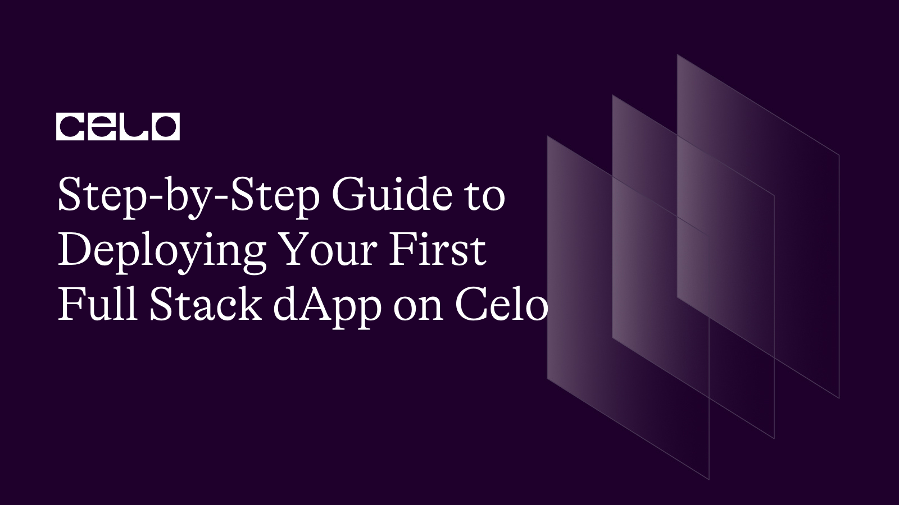
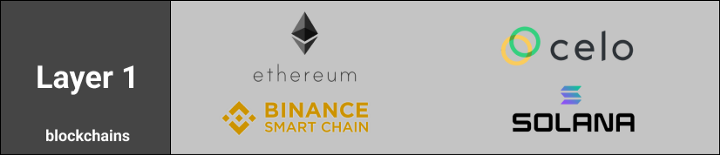
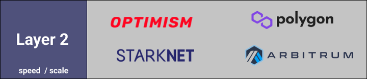

## Introduction

We can't talk of blockchain solutions without mentioning Layer 1 and Layer 2 protocols and how they uniquely contribute to blockchain scalability. It is essential to know that Layer 1 primarily serves as the framework for Layer 2 and its solutions. Without Layer 1 scaling solutions, the consensus protocol, sharding, and the lightning network would not be possible.

## What are Layer 1 Blockchains?

By definition, a protocol is Layer 1 when it completes transactions on its own blockchain. It's the term used for describing the underlying principal blockchain architecture. An example of a Layer 1 blockchain is the Celo blockchain which was branched from Go Ethereum (Geth) in 2017. It has, however, made some substantial adjustments, such as putting PoS and a distinctive address system in place.
The Celo ecosystem, which comprises NFTs, payment methods, and DeFi, has over 100 million confirmed transactions. Also, anyone can create a public key using a phone number or email address. There is no need for specialist hardware since standard PCs can operate the blockchain with ease.

## What are Layer 2 Blockchains?

Alternatively, a Layer 2 protocol built on top of an existing blockchain. The primary goal of this protocol is to address the major cryptocurrency networks' transaction speed and scaling issues.
Without a doubt, Layer 1 and Layer 2 protocols uniquely determine blockchain scalability, which seems to improve as you progress from base structure Layer 1 to Layer 2. But why is scalability a complex blockchain problem that needs immediate solutions?

## Why is Blockchain Scalability Important?

Scalability refers to a blockchain network's ability to expand due to a high influx of transactional throughput and future growth. It is crucial because it allows blockchain networks to compete against legacy centralized platforms which have rapid-fire transactional rates.
Scalability trumps many of the inconsequential business needs as it is one of the top three qualities any promising tech start-up or business must present. Interestingly, scalability is one of the vital problems most blockchain technologies are geared to solve.

## Blockchain Layer 1 vs. Layer 2 Scaling Solutions

Layers 1 and 2 are the primary means of achieving blockchain scalability. To compete with traditional payment processing systems, blockchain is consistently raising the bar. Blockchain requires a dependable and highly scalable product to have a chance.
This network should be able to handle an increasing number of transactions, users, and data. Without this scalability, it would be nearly impossible to compete with or serve as many people as are willing to join the blockchain network. Incorporating scalability into the structure allows blockchain networks to outperform other well-known traditional payment systems and trademarks.

## How Do Layer 1 Scaling Solutions Work?

Most Layer 1 protocols, as you might expect, have scaling issues. All transactions, in general, require validation by multiple nodes. This results in the formation of an ecosystem in which mining nodes compete to solve complex computational puzzles. Miners who succeed are rewarded in the network's native cryptocurrency. However, this consensus mechanism consumes a large amount of energy and creates a lag in transaction speed.

### The Layer 1 solutions as we know them are

#### Consensus Protocol Changes

Layer 1 projects such as Ethereum have transitioned from consensus protocols such as Proof-of-Work (PoW) in favor of faster and less demanding consensus protocols such as Proof-of-Stake (PoS). Although Bitcoin continues to use the PoW, Ethereum has successfully migrated to a PoS.

#### Sharding

Sharding is a Layer-1 scalability method that most protocols use. Instead of having a network work on each and every transaction in sequence, sharding divides these transaction sets into small data sets known as "shards." These shards can then be processed in parallel by the network.

### How do Layer 2 Scaling Solutions Work?

We've established that the Layer 2 protocols use Layer 1 as a foundational base. The Layer 2 solutions include:

#### State Channels

A state channel is a two-way communication channel between participants that allows them to conduct interactions that would normally take place on the blockchain off the blockchain. This reduces waiting time because users no longer depend on third parties, such as a miner.
A portion of the blockchain is sealed off via multi-signature or some sort of smart contract that the participants have pre-agreed upon. Participants can then communicate with one another without submitting anything to the miners. When the entire transaction set is completed, the channel's final state is added to the blockchain.
State channel solutions include Bitcoin's Lightning Network and Ethereum's Raiden Network. They use Hashed Timelock Contracts (HTLCs) for state channel execution. They utilize the Hashed Timelock Contracts (HTLCs) for state channel execution.

#### Nested Blockchains

The Nested Blockchain offers multiple levels of blockchains on top of the main chain. These levels are connected to create a parent-child chain connection. The parent-child chain connection allows the parent chain to delegate tasks to individual child chains. Each child chain tirelessly executes these actions and provides results to its parent chain. This solution is quite efficient because it significantly reduces the load on the root chain and exponentially increases scalability.

#### Sidechains

Sidechains implement an independent consensus mechanism that is separate from the original chain. And they can be appropriately optimized for their speed and scalability. Its architecture is primarily maintaining overall security, confirms transaction collections and records, and resolves disputes.
They are different from the state channels in some integral ways. First, sidechain transactions aren't exclusively private between participants as they are publicly recorded in the ledger. More interestingly, sidechain security breaches do not necessarily impact or affect the mainchain or other sidechains.

## Limitations of Layer 1 and Layer 2 Scaling Solutions

Layer 1 provides an active and effective solution for wide-scale protocol improvements. But, it also comes with limitations like convincing validators before effecting a large-scale hard fork change with scalability being the "problem to solve," it is no easier with Layer 1.
While scalability can be easily improved with Layer 2, making it somewhat better than Layer 1. However, Layer 2 isn't without its limitations, such as the security of the original blockchain being lost depending on the protocol.
Lastly, the scalability trilemma coined by Ethereum creator Vitalik Buterin describes another challenge that blockchains face. He believes that protocols must balance scalability, security, and decentralization. These are somewhat contradictory because by focusing too much on two of the properties, the third will suffer.

## What's Next after Layer 1 and Layer 2?

The future of Layer 1 and Layer 2 holds countless possibilities. There's quite the possibility that large chains like Celo and Ethereum continue to dominate due to their massive developer community and numerous user influence.

## Closing Thoughts

The search for improved scalability is an unending one, and it has taken precedence since the inception of cryptocurrency. This search has created a central two-way tackle approach with Layer 1 and 2 solutions. Now we've provided you with the distinction that sets them apart and you can at least know what to expect from scalability.

## About the Author

Joshua Obafemi

A web3 content writer. You can connect with me on [Linkedin](https://www.linkedin.com/in/joshua-obafemi-ba2014199/).

## References

- <https://blog.celo.org/why-build-on-the-celo-blockchain-9ceab3d11b70>
- <https://academy.binance.com/en/articles/blockchain-scalability-sidechains-and-payment-channels>
- <https://medium.com/the-capital/layer-1-vs-layer-2-what-you-need-to-know-about-different-blockchain-layer-solutions-69f91904ce40>
- <https://academy.binance.com/en/articles/blockchain-layer-1-vs-layer-2-scaling-solutions>
