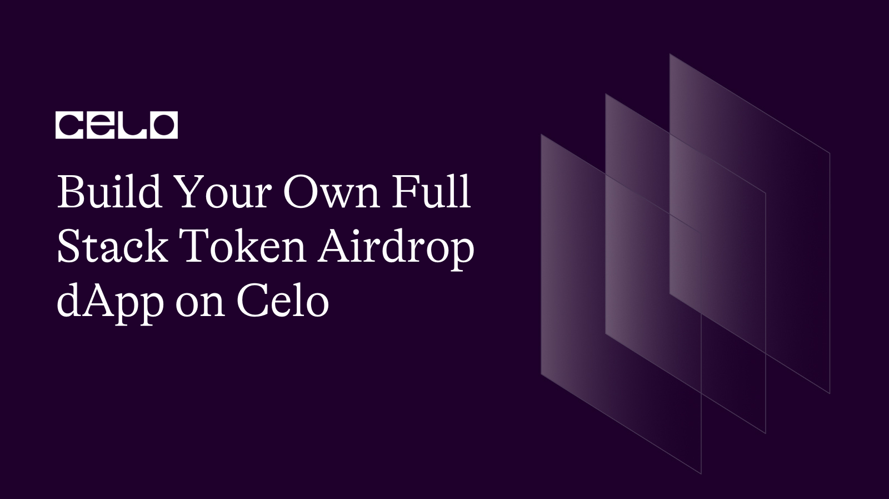

## Introduction​

Decentralized applications (dApps) are becoming increasingly popular as blockchain technology gains momentum. One of the most exciting use cases for dApps is the ability to facilitate token airdrops, where users can receive free tokens simply by signing up. In this tutorial, we'll explore how to build a full stack token airdrop dApp on the Celo blockchain. By following along with our step-by-step guide, you'll gain a solid understanding of how to create and deploy a smart contract, integrate with a web3 wallet, and build a user-friendly front-end interface. Let's get started!

## Prerequisites​

Here are some potential prerequisites and tools you may need to set up your development environment:

- A basic understanding of Solidity, Ethereum, and blockchain concepts
- Familiarity with the Celo blockchain and its features
- Knowledge of JavaScript and the React framework
- A code editor such as VS Code or Sublime Text
- Node.js and npm installed on your system
- A MetaMask wallet and some test Celo tokens for testing on the Celo testnet

## Requirements​

- Node.js version 12.13.0 or higher installed on your system
- NPM version 6.12.0 or higher installed on your system
- A code editor such as VS Code or Sublime Text
- Hardhat Ethereum development environment version 2.0.11 or higher installed on your system
- React version 17.0.1 or higher installed on your system
- EthersJS version 5.0.32 or higher installed on your system

## Setting up the project

1 . Install Node.js and NPM on your system if you haven't already. You can download them from the official Node.js [here](https://nodejs.org/en/)

2. Install Hardhat globally by running the following command in your terminal:

```bash
npm install -g hardhat
```

3. Create a new directory for your project and navigate into it:

```bash
mkdir token-airdrop && cd token-airdrop
```

4. Initialize a new Hardhat project by running the following command:

```bash
npm init -y
npm install --save-dev hardhat
npx hardhat
```

5. Choose `Create a Javascript project` from the menu and accept all defaults. To ensure everything is installed correctly, run the following command in your terminal:

```bash
npx hardhat test
```

We'll be using OpenZeppelin because it's a popular and tested library of smart contract building blocks that help us save time and ensure security. We'll use it to implement the widely recognized ERC20 token standard, which ensures compatibility with other wallets, exchanges, and dApps that support ERC20. Overall, using OpenZeppelin is a best practice in blockchain development that helps us build more secure and reliable smart contracts.

To install OpenZeppelin:

```bash
npm install @openzeppelin/contracts
```

## Writing the smart contract

Inside the `/contracts` folder of the project, create a new file and name it `AirToken.sol`.
This is where we'll write the smart contract code.

In the smart contract code, we've created a new contract called AirToken that inherits from ERC20 and Ownable. The ERC20 contract provides us with the basic implementation of a fungible token, while Ownable gives us ownership control over the contract.

```solidity

// SPDX-License-Identifier: UNLICENSED
pragma solidity ^0.8.9;

import '@openzeppelin/contracts/token/ERC20/ERC20.sol';
import '@openzeppelin/contracts/access/Ownable.sol';

contract AirToken is ERC20, Ownable {

}
```

Inside `AirToken`, we've created an array called candidates that stores all the eligible addresses.

This will whitelist all the eligible addresses that will be registered to get the airdrop.

```solidity

    mapping(address => bool) private isCandidate;

    address[] private candidates;
```

We've defined an `isCandidate` mapping which will help us verify whether an address is eligible for an airdrop or not.

Both of these variables have corresponding getter functions defined at the end of the contract which will be called to retrieve their information as shown below:

```solidity

    function checkCandidate(address userWallet) public view returns (bool) {
        return isCandidate[userWallet];
    }

    function getAllCandidates() public view returns (address[] memory) {
        return candidates;
    }
```

The constructor function is called when the contract is deployed and it mints 500 AirDropper tokens to the contract deployer's address.

```solidity

    constructor() ERC20('AirDropper', 'ADP') {
        _mint(msg.sender, 500 * 10 ** decimals());
    }
```

We've defined an `addWallet` function that adds an address to the list of eligible candidates for the airdrop.

```solidity

    function addWallet(address userAddress) public {
        require(
            !isCandidate[userAddress],
            'You are already a candidate for the airdrop'
        );

        isCandidate[userAddress] = true;
        candidates.push(userAddress);
    }

```

The `addWallet` function takes one parameter, `userAddress`, which is the address that we want to add to the list of eligible candidates for the airdrop.

We first check if the address is not already a candidate for the airdrop by verifying that the `isCandidate[userAddress]` mapping returns false. If the address is already a candidate, then the function will revert with an error message.

If the address is not already a candidate, we set the corresponding mapping value in `isCandidate` to true to mark the address as eligible for the airdrop. We also push the `userAddress` onto the candidates' array to keep track of all eligible candidates.

This function is useful for allowing users to opt-in to the airdrop by adding their address to the eligible candidates' list. It ensures that users cannot be added multiple times to the list by checking if their address is already a candidate.

Finally, we have the `airdrop` function that sends a specified amount of tokens to each eligible address in the recipients' array.

```solidity

    function airdrop(
        address[] calldata recipients,
        uint256 amount
    ) public onlyOwner {
        for (uint256 i = 0; i < recipients.length; i++) {
            if (isCandidate[recipients[i]]) {
                _transfer(msg.sender, recipients[i], amount);
            }
        }
    }
```

The airdrop function takes two parameters, `recipients` and `amount`. `recipients` is an array of addresses representing the eligible candidates that we want to airdrop tokens to, and `amount` is the number of tokens we want to distribute to each recipient.

First, the function checks that the caller of the function is the contract owner (the `onlyOwner` modifier). If the caller is not the owner, the function will revert with an error message.

Next, the function iterates over each address in the recipients' array. For each address, it checks if the address is an eligible candidate by verifying that the `isCandidate[recipients[i]]` mapping returns true. If the address is not an eligible candidate, the function skips over it and moves on to the next address.

If the address is an eligible candidate, the function transfers `amount` tokens from the contract owner's address to the `recipient` address using the `_transfer` function inherited from `ERC20`. This sends the tokens to the eligible candidate's wallet address.

This function is useful for actually distributing the tokens to the eligible candidates in the airdrop. It ensures that only the contract owner can distribute tokens and that tokens are only distributed to eligible candidates.

Here's our full contract code:

```solidity

// SPDX-License-Identifier: UNLICENSED
pragma solidity ^0.8.9;

import '@openzeppelin/contracts/token/ERC20/ERC20.sol';
import '@openzeppelin/contracts/access/Ownable.sol';

contract AirToken is ERC20, Ownable {
    mapping(address => bool) private isCandidate;

    address[] private candidates;

    constructor() ERC20('AirDropper', 'ADP') {
        _mint(msg.sender, 500 * 10 ** decimals());
    }

    function mint(address to, uint256 amount) public onlyOwner {
        _mint(to, amount);
    }

    function addWallet(address userAddress) public {
        require(
            !isCandidate[userAddress],
            'You are already a candidate for the airdrop'
        );

        isCandidate[userAddress] = true;
        candidates.push(userAddress);
    }

    function airdrop(
        address[] calldata recipients,
        uint256 amount
    ) public onlyOwner {
        for (uint256 i = 0; i < recipients.length; i++) {
            if (isCandidate[recipients[i]]) {
                _transfer(msg.sender, recipients[i], amount);
            }
        }
    }

    function checkCandidate(address userWallet) public view returns (bool) {
        return isCandidate[userWallet];
    }

    function getAllCandidates() public view returns (address[] memory) {
        return candidates;
    }
}

```

## Compiling the smart contract

The contract code is done, let's compile it:

In your terminal:

```bash
npx hardhat compile
```

Output:

```bash
> npx hardhat compile
Compiled 1 Solidity file successfully
```

## Create the deploy script

Next, we need to write a script that allows us to deploy the contract to the alfajores network.

We need to first set up the configuration of the alfajores network in `hardhat.config.js`.

Inside the `module.exports` add the following alfajores configuration:

```js

  networks: {
    hardhat: {
      chainId: 31337,
    },
    localhost: {
      url: 'http://127.0.0.1:8545',
      chainId: 31337,
    },
    alfajores: {
      url: ALFAJORES_URL,
      accounts: [PRIVATE_KEY],
      chainId: 44787,
    },
  },
```

Get the `ALFAJORES_URL` from a celo node provider like [infura](https://app.infura.io/), and the `PRIVATE_KEY` from your metamask wallet.

Now that the network configuration for the alfajores network is done, we can now write the deployment script. We can do this inside the `/scripts` folder.

Create a new file called `deploy.js` in the scripts folder, then add the following code:

```js
const { ethers } = require("hardhat");
const hre = require("hardhat");

async function main() {
  const factory = await hre.ethers.getContractFactory("AirToken");
  const [owner] = await hre.ethers.getSigners();
  const contract = await factory.deploy();

  await contract.deployed();
  console.log("Contract deployed to: ", contract.address);
  console.log("Contract deployed by (Owner): ", owner.address, "\n");
}

main()
  .then(() => process.exit(0))
  .catch((error) => {
    console.error(error);
    process.exit(1);
  });
```

First, we import the hardhat run-time (`hre`) library. A module that provides a set of Hardhat-specific APIs.

Next, we define an asynchronous function called `main`. In this function, we first create an instance of the `AirToken` contract factory using the `getContractFactory` method from `hre.ethers`. We then get the contract owner's address by calling `hre.ethers.getSigners()` and using the first signer in the resulting array.

After that, we deploy the contract to the blockchain using `factory.deploy()`, which returns a contract instance. We then wait for the contract deployment to complete using `await contract.deployed()`.

Finally, we log the address of the deployed contract and the address of the contract owner to the console using `console.log`.

To deploy the contract, run the script using the following command:

```bash
npx hardhat run --network alfajores scripts/deploy.js
```

Output:

```bash
 > npx hardhat run --network alfajores scripts/deploy.js
Contract deployed to 0x5FbDB2315678afecb367f032d93F642f64180aa3
Contract deployed by (Owner):  0xf39Fd6e51aad88F6F4ce6aB8827279cffFb92266
```

Great! Our AirToken was successfully deployed to the alfajores network, at the address `0x0F7dF2AEfF22d30949F997323F5fC4fd474DA544`

Now we can connect the front end to interact with the contract.

## Connecting the frontend

Create a new folder inside your project and call it `/frontend` and inside, clone the frontend starter template below:

```bash
git clone https://github.com/JovanMwesigwa/airdrop-token-client-ui-starter-template.git
```

Install all the necessary libraries with, run:

```bash
npm install
```

Start the project with:

```bash
npm run dev
```

This is what the initial UI should look like:


The UI consists of a connect button that when pressed, launches a browser wallet extension, and also displays a list of all eligible wallet addresses.
In this case, we have none, because the contract is still empty.

Inside `App.jsx`, we have a few imports to some important libraries as shown below:

```js

import { useMoralis, useWeb3Contract } from 'react-moralis'
import { Avatar, ConnectButton } from 'web3uikit'
import { ethers } from 'ethers'
import { ADMIN_ADDRESS, ABI, CONTRACT_ADDRESS } from '../constants'
import { useEffect, useState } from 'react'

export default function Home() {
  const { isWeb3Enabled, Moralis, account } = useMoralis()
  const [candidates, setCandidates] = useState()

  useEffect(() => {
    if (isWeb3Enabled) {
      populateData()
    }
  }, [isWeb3Enabled, account])

  const populateData = async () => {
    try {
      const result = await getAllCandidates()
      setCandidates(result)
    } catch (error) {
      console.log(error.response)
    }
  }

  const addUser = async () => {
    try {
      const res = await addWallet()
      console.log(res)
    } catch (error) {
      console.log(error.response)
    }
  }

  const airDropTokens = async () => {
    const res = await airdrop()
    console.log(res)
    // try {
    // } catch (error) {
    //   console.log(error.response)
    // }
  }

  const { runContractFunction: getAllCandidates } = useWeb3Contract({
    abi: ABI,
    contractAddress: CONTRACT_ADDRESS,
    functionName: 'getAllCandidates',
    params: {},
  })

  const { runContractFunction: airdrop } = useWeb3Contract({
    abi: ABI,
    contractAddress: CONTRACT_ADDRESS,
    functionName: 'airdrop',
    params: {
      recipients: candidates,
      amount: ethers.utils.parseEther('10'),
    },
  })

  const { runContractFunction: addWallet } = useWeb3Contract({
    abi: ABI,
    contractAddress: CONTRACT_ADDRESS,
    functionName: 'addWallet',
    params: { userAddress: account },
  })

```

In `App.jsx` of the frontend code, we are using the `useMoralis` and `useWeb3Contract` hooks from the `react-moralis` library to interact with our deployed smart contract on the blockchain.

The `useWeb3Contract` allows us to define and call specific methods on the specified contract by passing in the contract ABI, the contract address, the name of the function to be called, and the specific parameters that are needed by the required contract function.

We are using the `useEffect` hook to execute the `populateData` function when the component is first loaded and when there is a change in the `isWeb3Enabled` and `account` state. This function is responsible for fetching the candidate list from the smart contract and storing it in the `candidates` state.

We also have three functions, `addUser`, `airDropTokens`, and `populateData`, that will execute specific smart contract functions when invoked by the user. These functions will use the `useWeb3Contract` hook to call the respective smart contract functions.

`addUser` is called when the user presses the `Connect` button in the UI, passing in the `account` which is the address on the connected user wallet.

`airDropTokens` is responsible for distributing tokens among the candidates and is only called by the `owner` address. It's only enabled when the owner is connected to the dapp.

Finally, we are setting up three `useWeb3Contract` hooks to call the smart contract functions `getAllCandidates`, `airdrop`, and `addWallet`. These hooks provide an easy way to call smart contract functions by abstracting away the complexity of creating and signing transactions.

We changed the default artifacts path in the `hardhat.config.js` file so that we can automatically update and populate them in the frontend `/backend` folder along with the contract's address.

In your `hardhat.config.js` file add :

```js

  paths: {
    artifacts: './frontend/backend',
  },
```

## Testing the app

To visualize how the app will work, we first need to add the deployed `AirToken` to the wallet so that we easily see the current user's balance.

To add the `AirDrop` token to the user's MetaMask wallet, press the `Import tokens` word at the bottom of your metamask wallet as shown below:


Next, enter the token address which in our case is the address of the deployed smart contract and its symbol `ADP`.

As shown below:


After a successful token import, you can verify that the user currently has 0 ADP tokens in their wallet. After the airdrop, the user should have more ADP tokens in their wallet.


Head over to [Celo Faucet](https://faucet.celo.org/) and add some test funds to your wallet.

To the user to the airdrop candidates, connect their wallet to the dApp and press the `Add Wallet` button and confirm the transaction in the wallet.

Using your configured deployer account with enough test funds in it, connect to the dapp and press the add Wallet button to add the user to the active addresses.

You can do this for several accounts and add them to the candidates' list.

This should display all the added addresses as shown below:


To distribute the airdrop, change the currently connected account in your wallet to the deployer/owner, press the red `Air Drop` button, and confirm the transaction in MetaMask.

When we check all the candidates' ADP token balances, we see that they now have 10 more ADP tokens after the airdrop.


## Conclusion​

We have created a basic smart contract that allows candidates to register for an airdrop and then an administrator airdrops tokens to those candidates. We also built a simple front end using React to interact with the smart contract. Through this tutorial, we have learned the basics of Solidity smart contract development and how to use React to interact with the Celo network.

## Next Steps

After this tutorial, feel free to widen your knowledge by expanding it in various ways.

1. Improve User Interface: You can enhance the user interface to provide a better experience for users interacting with the AirToken contract. You can add more features like real-time notifications for successful transactions or errors, loading spinners, and a better layout.

2. Upgrade Contract Functionality: You can add more functionalities to the contract to make it more versatile. For example, you can add a function to burn tokens or enable users to vote for proposals using their tokens.

3. Integrate with other dApps: You can integrate your AirToken contract with other dApps like wallets or exchanges, making it more accessible to other users. You can use dAppBridge or any other bridging technology to achieve this.

## About the Author​

Created by Jovan Mwesigwa B, Blockchain, Solidity developer

Reach out:
Github: [JovanMwesigwa](https://github.com/JovanMwesigwa)
Linkedin: [JovanMwesigwa](https://www.linkedin.com/in/jovan-mwesigwa/)

## References​

[Hardhat docs](https://hardhat.org/hardhat-runner/docs/getting-started#quick-start) | For hardhat set-up
[Celo Faucet](https://faucet.celo.org/) | For Celo faucet
[Project code](https://github.com/JovanMwesigwa/token-airdrop-dapp) | Github
