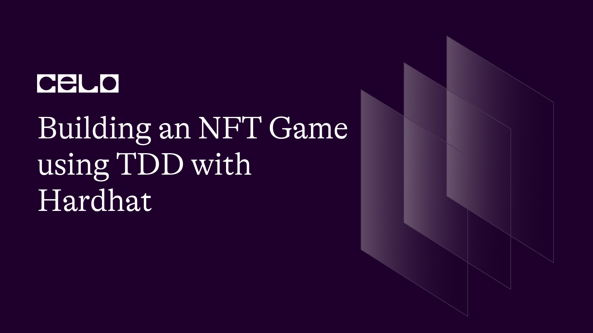

## 1. Introduction

Security is critical when building blockchain applications, a simple mistake could lead to the loss of millions of dollars. TDD (Test Driven Development) is an approach that can help us catch errors early. We'll explore the wonderful world of TDD by building an NFT game using Hardhat's development environment, deploying it on the Celo blockchain and finally creating a frontend to interact with it. Let's go!

You can check out the repository for the completed tutorial code [here](https://github.com/RinwaOwuogba/avatar-arena-tutorial-part-1).

## 2. Prerequisites

To follow along with this tutorial, you need to have an understanding of:

- [JavaScript](https://developer.mozilla.org/en-US/docs/Learn/Getting_started_with_the_web/JavaScript_basics)
- [React](https://react.dev/)
- [EVM Smart contracts](https://ethereum.org/en/developers/docs/smart-contracts/)

## 3. Requirements

Make sure to have the following installed:

- [Metamask](https://metamask.io/download/)
- [Node js v16.20.0](https://nodejs.org/en/download/package-manager)
- [yarn 1.22.19+](https://classic.yarnpkg.com/lang/en/docs/install/#debian-stable)

## 4. Diving in

### 4.1. Project setup

Let's create a folder for the project, we'll call it `avatar-arena`.

```bash
mkdir avatar-arena
cd avatar-arena
yarn init -y
yarn add --dev hardhat
yarn add dotenv
```

Next, we set up the hardhat project by running `npx hardhat`. This brings up a menu that configures the hardhat boilerplate, we'll choose the default option for all the questions ie

```bash
✔ What do you want to do? · Create a JavaScript project
✔ Hardhat project root: · [your current directory by default]
✔ Do you want to add a .gitignore? (Y/n) · y
✔ Help us improve Hardhat with anonymous crash reports & basic usage data? (Y/n) · y
✔ Do you want to install this sample project's dependencies with yarn (@nomicfoundation/hardhat-toolbox @nomicfoundation/hardhat-network-helpers @nomicfoundation/hardhat-chai-matchers @nomiclabs/hardhat-ethers @nomiclabs/hardhat-etherscan chai ethers hardhat-gas-reporter solidity-coverage @typechain/hardhat typechain @typechain/ethers-v5 @ethersproject/abi @ethersproject/providers)? (Y/n) · y
```

Great!

The last configuration we need is in `package.json`. We need to add a handy script:

```json
// package.json

"scripts": {
    "test": "hardhat test"
},
```

### 4.2. Bootstrapping the smart contract

Remove the boilerplate contract files and add the new contract files

```bash
rm contracts/* test/*
touch contracts/AvatarArena.sol test/AvatarArena.js
```

We'll use the openzepplin [contract wizard](https://docs.openzeppelin.com/contracts/4.x/wizard) to bootstrap our `AvatarArena` contract.

Our contract needs to do a few things:

- mint tokens
- list tokens
- ownable tokens
- URI storage

We will choose ERC 721 as our token type (the standard for smart contracts that mint NFT tokens) template with the following configurations:

- Settings:
  - name: AvatarArena
  - symbol: AVR
  - base URI: (blank)
- Features: mintable (with auto-increment ID), enumerable, URI storage
- Access Control: ownable
- Upgradability: (use default)
- Info (optional):
  - security contact (optional)
  - license: MIT (optional)

This config gives us the basic template for the smart contract we'll be building. It includes features such as enumerating the NFTs minted by the contract as well as storing URIs associated with each token.

When you're done, you'll have this block of code on the editor to your right, we'll copy and paste it into `contracts/AvatarArena.sol`:

```solidity
// contracts/AvatarArena.sol

// SPDX-License-Identifier: MIT
pragma solidity ^0.8.9;

import "@openzeppelin/contracts/token/ERC721/ERC721.sol";
import "@openzeppelin/contracts/token/ERC721/extensions/ERC721Enumerable.sol";
import "@openzeppelin/contracts/token/ERC721/extensions/ERC721URIStorage.sol";
import "@openzeppelin/contracts/access/Ownable.sol";
import "@openzeppelin/contracts/utils/Counters.sol";

contract AvatarArena is ERC721, ERC721Enumerable, ERC721URIStorage, Ownable {
	using Counters for Counters.Counter;

	Counters.Counter private _tokenIdCounter;

	constructor() ERC721("AvatarArena", "AVR") {}

	function safeMint(address to, string memory uri) public onlyOwner {
    	uint256 tokenId = _tokenIdCounter.current();
    	_tokenIdCounter.increment();
    	_safeMint(to, tokenId);
    	_setTokenURI(tokenId, uri);
	}

	// The following functions are overrides required by Solidity.

	function _beforeTokenTransfer(address from, address to, uint256 tokenId, uint256 batchSize)
    	internal
    	override(ERC721, ERC721Enumerable)
	{
    	super._beforeTokenTransfer(from, to, tokenId, batchSize);
	}

	function _burn(uint256 tokenId) internal override(ERC721, ERC721URIStorage) {
    	super._burn(tokenId);
	}

	function tokenURI(uint256 tokenId)
    	public
    	view
    	override(ERC721, ERC721URIStorage)
    	returns (string memory)
	{
    	return super.tokenURI(tokenId);
	}

	function supportsInterface(bytes4 interfaceId)
    	public
    	view
    	override(ERC721, ERC721Enumerable)
    	returns (bool)
	{
    	return super.supportsInterface(interfaceId);
	}
}
```

We'll update the code to remove the `onlyOwner` modifier. It prevents anybody who's not the owner of the contract mint tokens but we don't want that restriction in our game. In our game, any user can mint a token. The updated snippet becomes:

```solidity
...
	constructor() ERC721("AvatarArena", "AVR") {}

	function safeMint(address to, string memory uri) public {
    	uint256 tokenId = _tokenIdCounter.current();
...
```

Next, we install the OpenZeppelin packages which our contract code depends on:

```bash
yarn add @openzeppelin/contracts
```

You'll notice that our `AvatarArena` contract code inherits from several other contracts: `ERC721, ERC721Enumerable, ERC721URIStorage, Ownable`. These contracts have methods and attributes which provide some functionality we need. We'll follow that same pattern to add our set of functionality. We'll create an `Arena` contract which the `AvatarArena` contract will inherit.

```solidity
// AvatarArena.sol
...
import "@openzeppelin/contracts/utils/Counters.sol";

abstract contract Arena is ERC721 {}

contract AvatarArena is ERC721Enumerable, ERC721URIStorage, Ownable, Arena {
	using Counters for Counters.Counter;
...
```

The Arena contract has to allow us to do a few things:

- start battles between avatars (nft): `startBattle`
- get the result of a user's most recent battle: `getLatestBattle`
- get the number of wins an avatar has: `getAvatarWins`
- simulate battle between avatars to get a winner: `_simulateBattle`

_Note: Subsequently, when we use `avatar`, we're referring to a minted NFT._

### 4.3. TDD

The TDD approach simplified = _Write failing test for expected behaviour -> Run the test (which fails) -> Fix the failing test -> Repeat_

Let's setup the test file `test/AvatarArena.js`:

```js
// test/AvatarArena.js
const { expect } = require("chai");
const { ethers } = require("hardhat");

describe("AvatarArena", function () {
  this.timeout(50000);

  let avatarArena;
  let owner;
  let acc1;
  let acc2;

  this.beforeEach(async function () {
    const AvatarArena = await ethers.getContractFactory("AvatarArena");
    [owner, acc1, acc2] = await ethers.getSigners();

    avatarArena = await AvatarArena.deploy();
  });
});
```

What's happening here?

1. We use the `describe` keyword from hardhat test environment to group our contract test cases.
2. We set the default timeout for each test case to 50 secs.
3. Before each test case runs, we re-deploy the contract and get signers which represent users ie owner, acc1, acc2. As the name implies, the "owner" signer represents the signer who was used to deploy the contract on the local test network.

To the tests!

Although, we'll only be writing tests for `startBattle`, it'll cover all of our tests since the tests will be more integration-focused due to the difficulty in mocking solidity contract code from JavaScript. Sadly we're restricted to using JavaScript when testing with Hardhat, a friend suggested I check out [Foundry](https://github.com/foundry-rs/foundry) as a test environment, I'll try that out at a later date and drop an update on how it goes.

_Note: Throughout the TDD process for the contract code, there will be code snippets which have "..." starting or ending them. I use that to indicate that some code has been omitted to keep the snippets short. Where necessary, I'll start and end the snippets with already existing lines in the specified file so you know where the snippet fits in, Thank you._

Now, let's think a bit before writing code, users might not want to battle at the same time, therefore we need a way to link users who want to battle together. The answer? A "pending" place for battles, this way, one user can start a battle and when another user tries to battle, we can match them up and "simulate" the result.

Starting with the tests:

### 4.3.1 - Test 1: should start a pending battle if no pending battle is available

```js
// test/AvatarArena.js
...
const { ethers } = require("hardhat");

const DEFAULT_TOKEN_URI = "https://example.com/1.png";

describe("AvatarArena", function () {
...

...
  this.beforeEach(async function () {
	const AvatarArena = await ethers.getContractFactory("AvatarArena");
	[owner, acc1, acc2] = await ethers.getSigners();

	avatarArena = await AvatarArena.deploy();
  });

  describe("startBattle", function () {
	it("should start a pending battle if no pending battle is available", async function () {
  	// mint NFT to battle with
  	const trx1 = await avatarArena
    	.connect(owner)
    	.safeMint(owner.address, DEFAULT_TOKEN_URI);
  	trx1.wait();

  	// start battle
  	const tokenID = 0;
  	const trx = await avatarArena.connect(owner).startBattle(tokenID);
  	await trx.wait();
	});
  });
});
```

We mint a token as the `owner` signer and try starting a battle with it.

Let's run this test:

```bash
$ yarn test
yarn run v1.22.19
$ hardhat test


    AvatarArena
   	 startBattle
   		 1) should start a pending battle if no pending battle is available


    0 passing (1s)
    1 failing

    1) AvatarArena
   		 startBattle
   			 should start a pending battle if no pending battle is available:
   	 TypeError: avatarArena.connect(...).startBattle is not a function
   		 at Context.<anonymous> (test/AvatarArena.js:31:52)
   		 at processTicksAndRejections (node:internal/process/task_queues:96:5)
   		 at runNextTicks (node:internal/process/task_queues:65:3)
   		 at listOnTimeout (node:internal/timers:528:9)
   		 at processTimers (node:internal/timers:502:7)
```

Of course, it fails, the line most important to us here is:

```bash
TypeError: avatarArena.connect(...).startBattle is not a function
```

Let's fix the problem by defining the missing function:

```solidity
// contracts/AvatarArena.sol

...solidity
abstract contract Arena is ERC721 {

    /**
    Creates a new battle for the sender or adds sender
    to a pending battle
    */
    function startBattle(uint256 tokenId) external {}
}
...
```

You might be wondering [why we choose the `external`](://ethereum.stackexchange.com/a/19391) keyword here, rather than `public`.

Re-run the tests, they should pass now.

We need to make sure a battle is in fact created so we test the data stored on a battle. This is a good time to think about what our data structure would look like. we'll start with this and explain as we make the test more useful.

```js
// test/AvatarArena.js

const { expect } = require("chai");
const { ethers } = require("hardhat");
const { BigNumber } = require("ethers");
...

...
  	// start battle
  	const tokenID = 0;
  	const trx = await avatarArena.connect(owner).startBattle(tokenID);
  	await trx.wait();

  	const battle = await avatarArena.connect(owner).getLatestBattle();
  	expect(battle.players[0].player).to.eql(owner.address);
  	expect(battle.players[0].nft).to.eq(BigNumber.from(tokenID));

  	// no winner should exist until game is completed
  	expect(battle.winner).to.eq(-1);
	});
  });
});
```

From the updated test above, you can tell that:

- a battle should be a kind of object which has a `players` property which holds an array of player objects which in turn contain details of a player
- a battle should also have a `winner` property which we expect to be -1 by default unless a winner is picked

Re-run test

```bash
$ yarn test
yarn run v1.22.19
$ hardhat test


    AvatarArena
   	 startBattle
   		 1) should start a pending battle if no pending battle is available


    0 passing (1s)
    1 failing

    1) AvatarArena
   		 startBattle
   			 should start a pending battle if no pending battle is available:
   	 TypeError: avatarArena.connect(...).getLatestBattle is not a function
   		 at Context.<anonymous> (test/AvatarArena.js:35:55)
   		 at processTicksAndRejections (node:internal/process/task_queues:96:5)
   		 at runNextTicks (node:internal/process/task_queues:65:3)
   		 at listOnTimeout (node:internal/timers:528:9)
   		 at processTimers (node:internal/timers:502:7)
```

Yep! it failed as expected. Our point of focus here is:

```bash
TypeError: avatarArena.connect(...).getLatestBattle is not a function
```

That function does not exist in our `Arena` contract. Let's fix this error:

```solidity
// contracts/AvatarArena.sol

...solidity
	function startBattle(uint256 tokenId) external {}

	/**
	Get sender's current battle
	*/
	function getLatestBattle() external view {}
}

contract AvatarArena is ERC721Enumerable, ERC721URIStorage, Ownable, Arena {
...
```

Re-run the tests:

```bash
$ yarn test
yarn run v1.22.19
$ hardhat test
Compiled 1 Solidity file successfully


    AvatarArena
   	 startBattle
   		 1) should start a pending battle if no pending battle is available


    0 passing (1s)
    1 failing

    1) AvatarArena
   		 startBattle
   			 should start a pending battle if no pending battle is available:
   	 TypeError: Cannot read properties of undefined (reading '0')
   		 at Context.<anonymous> (test/AvatarArena.js:36:28)
  	at processTicksAndRejections (node:internal/process/task_queues:95:5)
  	at runNextTicks (node:internal/process/task_queues:64:3)
  	at listOnTimeout (node:internal/timers:533:9)
  	at processTimers (node:internal/timers:507:7)
```

New error, progress?

```bash
TypeError: Cannot read properties of undefined (reading '0')
    at Context.<anonymous> (test/AvatarArena.js:36:24)
```

If we trace the test code, we see this error is due to trying to access players in a battle and of course, it errors out since `getLatestBattle` doesn't return anything yet. Let's fix it:

```solidity
// contracts/AvatarArena.sol

...
abstract contract Arena is ERC721 {
	struct Player {
        	address player;
        	uint256 nft;
	}
	struct Battle {
        	Player[] players;
        	uint256 createdAt;
        	int256 winner;
	}
	Battle[] private _battles;
	mapping(address => uint256) private _userBattles;

	/**
	Creates a new battle for the sender or adds sender
	to a pending battle
	*/
	function  startBattle(uint256  tokenId) external {}
...
```

Note the subtle difference in data types between nft index - `uint256` in `Player` and `winner` index - `int256` in `Battle`. Winner has to be int256 since it needs to contain negative values on initialization which is only possible with signed integers. We also need to return something from `getLatestBattle`:

```solidity
// contracts/AvatarArena.sol

...
	/**
	Get sender's current battle
	*/
	function getLatestBattle() external view returns (Battle memory) {
    	uint256 battleIndex = _userBattles[msg.sender];

    	return (_battles[battleIndex]);
	}
...
```

Re-run the tests:

```bash
$ yarn test
yarn run v1.22.19
$ hardhat test
Compiled 1 Solidity file successfully


    AvatarArena
   	 startBattle
   		 1) should start a pending battle if no pending battle is available


    0 passing (1s)
    1 failing

    1) AvatarArena
   		 startBattle
   			 should start a pending battle if no pending battle is available:
   	 Error: call revert exception; VM Exception while processing transaction: reverted with panic code 50 [ See: https://links.ethers.org/v5-errors-CALL_EXCEPTION ] (method="getLatestBattle()", data="0x4e487b710000000000000000000000000000000000000000000000000000000000000032", errorArgs=[{"type":"BigNumber","hex":"0x32"}], errorName="Panic", errorSignature="Panic(uint256)", reason=null, code=CALL_EXCEPTION, version=abi/5.7.0)
  	at Logger.makeError (node_modules/@ethersproject/logger/src.ts/index.ts:269:28)
  	at Logger.throwError (node_modules/@ethersproject/logger/src.ts/index.ts:281:20)
  	at Interface.decodeFunctionResult (node_modules/@ethersproject/abi/src.ts/interface.ts:427:23)
  	at Contract.<anonymous> (node_modules/@ethersproject/contracts/src.ts/index.ts:400:44)
  	at step (node_modules/@ethersproject/contracts/lib/index.js:48:23)
  	at Object.next (node_modules/@ethersproject/contracts/lib/index.js:29:53)
  	at fulfilled (node_modules/@ethersproject/contracts/lib/index.js:20:58)
  	at processTicksAndRejections (node:internal/process/task_queues:95:5)
  	at runNextTicks (node:internal/process/task_queues:64:3)
  	at listOnTimeout (node:internal/timers:533:9)
```

This is a tricky one, the most we have to go on is this line here:

```bash
Error: call revert exception; VM Exception while processing transaction: reverted with panic code 50 [ See: https://links.ethers.org/v5-errors-CALL_EXCEPTION ] (method="getLatestBattle()", data="0x4e487b710000000000000000000000000000000000000000000000000000000000000032", errorArgs=[{"type":"BigNumber","hex":"0x32"}], errorName="Panic", errorSignature="Panic(uint256)", reason=null, code=CALL_EXCEPTION, version=abi/5.7.0)
```

There's this snippet `(method="getLatestBattle()"`. On closer analysis of the `getLatestBattle` method, we notice there is infact something there that could lead to a panic:

```js
return _battles[battleIndex];
```

The `_battles` array is initially empty, also the `_userBattles` mapping does not return `null` when it can't find an entry for a key ie `msg.sender`, instead of returns the default value for the data type of the value in the mapping which is `uint256` here which is `0` by default.

This means by default our function will try to return the battle at position 0 if a user hasn't participated in a battle yet. There're several ways we could handle this, we could revert with an appropriate error message when the battle index is 0; the problem with approach is I haven't been able to find a good way to access the `reason` message from a revert on a frontend. This means it'd be difficult to handle the error appropriately on the frontend, so if you do find a way to extract the `reason`, feel free to drop a comment or send me a message about it.

What we'll do instead is push a placeholder battle in the `_battles` array that way we always return a battle from that function call and by examining the players in the battle we can determine if it's _the_ placeholder battle or an actual battle.

```solidity
// contracts/AvatarArena.sol

...
	Battle[] private _battles;
	mapping(address => uint256) private _userBattles;

	constructor() {
    	// initialize battles list with placeholder battle
    	_battles.push();
	}

	/**
	Creates a new battle for the sender or adds sender
	to a pending battle
 	*/
	function startBattle(uint256 tokenId) external {}
...
```

Re-run the test

```bash
$ yarn test
yarn run v1.22.19
$ hardhat test
Compiled 1 Solidity file successfully


    AvatarArena
   	 startBattle
   		 1) should start a pending battle if no pending battle is available


    0 passing (1s)
    1 failing

    1) AvatarArena
   	startBattle
     	should start a pending battle if no pending battle is available:
 	TypeError: Cannot read properties of undefined (reading 'player')
  	at Context.<anonymous> (test/AvatarArena.js:36:32)
  	at processTicksAndRejections (node:internal/process/task_queues:95:5)
  	at runNextTicks (node:internal/process/task_queues:64:3)
  	at listOnTimeout (node:internal/timers:533:9)
  	at processTimers (node:internal/timers:507:7)
```

Alright!

We're not out of the woods yet, we have a placeholder battle the method keeps erroring out because there're no players in the placeholder battle. Let's address that:

```solidity
// contracts/AvatarArena.sol

...
	function startBattle(uint256 tokenId) external {
    	Battle storage newBattle = _battles.push();

    	newBattle.players.push(Player(msg.sender, tokenId));
    	newBattle.createdAt = block.timestamp;
    	newBattle.winner = -1;

    	_userBattles[msg.sender] = _battles.length - 1;
	}
...
```

We now make sure to initialize a battle by adding a player when it is started. We could try putting a dummy player to make the test pass as fast as possible but it would be trivial at the point.

Re-run the test, it should pass now.

### 4.3.2 - Test 2: should put user in pending battle if available

```js
// test/AvatarArena.js

...
  	// no winner should exist until game is completed
  	expect(battle.winner).to.eq(-1);
	});

	it("should put user in pending battle if available", async function () {
  	// mint battle nfts for both users
  	const nft1Trx = await avatarArena
    	.connect(owner)
    	.safeMint(owner.address, DEFAULT_TOKEN_URI);
  	await nft1Trx.wait();
  	const nft2Trx = await avatarArena
    	.connect(acc1)
    	.safeMint(acc1.address, DEFAULT_TOKEN_URI);
  	await nft2Trx.wait();

  	const tokenID_1 = 0;
  	const tokenID_2 = 1;

  	// start battles
  	const ownerBattleTrx = await avatarArena
    	.connect(owner)
    	.startBattle(tokenID_1);
  	const acc1BattleTrx = await avatarArena
    	.connect(acc1)
    	.startBattle(tokenID_2);
  	await Promise.all([ownerBattleTrx, acc1BattleTrx]);
  	const battle = await avatarArena.connect(acc1).getLatestBattle();

  	expect(battle.players[0].player).to.eql(owner.address);
  	expect(battle.players[1].player).to.eql(acc1.address);
	});
  });
});
```

Run the tests

```bash
$ yarn test
yarn run v1.22.19
$ hardhat test


  AvatarArena
	startBattle
  	✔ should start a pending battle if no pending battle is available (104ms)
  	1) should put user in pending battle if available


  1 passing (1s)
  1 failing

  1) AvatarArena
  	startBattle
    	should put user in pending battle if available:

  	AssertionError: expected '0x70997970C51812dc3A010C7d01b50e0d17d…' to deeply equal '0xf39Fd6e51aad88F6F4ce6aB8827279cffFb…'
  	+ expected - actual

  	-0x70997970C51812dc3A010C7d01b50e0d17dc79C8
  	+0xf39Fd6e51aad88F6F4ce6aB8827279cffFb92266

  	at Context.<anonymous> (test/AvatarArena.js:67:43)
  	at processTicksAndRejections (node:internal/process/task_queues:95:5)
  	at runNextTicks (node:internal/process/task_queues:64:3)
  	at listOnTimeout (node:internal/timers:533:9)
  	at processTimers (node:internal/timers:507:7)
```

Errors again? Getting kind of annoying right? Well better here than when the contract is handling tokens with real value.

You already know how this goes, we follow the error message and the line error the error happened in our test code.

In the test, we expect the first player in the battle that `acc1` is involved in to be the signer - `owner` that first started a battle but that isn't the case, we haven't added any logic to put players together in battles so the first player when `acc1` fetches its latest battle is `acc1` because it was added to a new battle. To to fix:

```solidity
// contract/AvatarArena.sol

...
	function startBattle(uint256 tokenId) external {
    	// skip placeholder battle
    	if (_battles.length > 1) {
        	uint256 currentBattleIndex = _battles.length - 1;
        	Battle storage currentBattle = _battles[currentBattleIndex];

        	// try to join an existing battle
        	if (currentBattle.players.length == 1) {
            	currentBattle.players.push(Player(msg.sender, tokenId));
            	_userBattles[msg.sender] = currentBattleIndex;

            	return;
        	}
    	}

    	Battle storage newBattle = _battles.push();
...
```

Re-run your tests, they should pass now

### _Brief intermission_

A significant part of the TDD process is refactoring, your code isn't all that useful if it is difficult to maintain/understand. We need to examine what we've written and see if there's an opportunity to abstract or extract repetitive logic into some reusable component.

The most obvious thing here is minting and starting battles, we're repeating the same logic over and over, and we should probably move that into a reusable component:

```js
// test/AvatarArena.js

...
  	expect(battle.players[1].player).to.eql(acc1.address);
	});
  });
});

const newAvatarArenaUtils = (contractInstance) => {
  return {
	mintNFT: (as, to, tokenURI = DEFAULT_TOKEN_URI) =>
  	contractInstance
    	.connect(as)
    	.safeMint(to, tokenURI)
    	.then((trx) => trx.wait()),
	startBattle: (as, tokenID) =>
  	contractInstance
    	.connect(as)
    	.startBattle(tokenID)
    	.then((trx) => trx.wait()),
  };
};
```

The goal here is to reduce the overhead when calling these methods so we can focus on the logic of what we're testing. this removes the verbosity of waiting for these transactions and specifying the contract instance every time we're using either of these methods.

Now to use the reusable component, update the test setup:

```js
// test/AvatarArena.js

...
  let acc2;
  let aaUtils;

  this.beforeEach(async function () {
	const AvatarArena = await ethers.getContractFactory("AvatarArena");
	[owner, acc1, acc2] = await ethers.getSigners();

	avatarArena = await AvatarArena.deploy();
	aaUtils = newAvatarArenaUtils(avatarArena);
  });
...
```

Update the test cases:

```js
// test/AvatarArena.js

...
   	 it("should start a pending battle if no pending battle is available", async function () {
    	await aaUtils.mintNFT(owner, owner.address);

    	const tokenID = 0;
    	await aaUtils.startBattle(owner, tokenID);

    	const battle = await avatarArena.connect(owner).getLatestBattle();
...

...
	it("should put user in pending battle if available", async function () {
  	await aaUtils.mintNFT(owner, owner.address);
  	await aaUtils.mintNFT(acc1, acc1.address);

  	const tokenID_1 = 0;
  	const tokenID_2 = 1;

  	await aaUtils.startBattle(owner, tokenID_1);
  	await aaUtils.startBattle(acc1, tokenID_2);

  	const battle = await avatarArena.connect(acc1).getLatestBattle();
...
```

Re-run tests just to make sure everything still works. They should work as normal, if an error comes up then something broke while substituting the code snippets, try to figure out what's out of place and resolve it before continuing.

### 4.3.3 - Test 3: should simulate battle results once two users join a battle

Simulating the result of a battle involves:

- Updating the number of wins the winning NFT has.
- Determining the winner among the players in the battle and optionally raising a notification that a battle is complete. The notification could be used for example for listening to the result of a battle and using that to update the user interface in real time when a battle is completed.

Let's write a test which expresses the behaviour we wish to see.

```js
// test/AvatarArena.js

...
  	expect(battle.players[1].player).to.eql(acc1.address);
	});

	it("should simulate battle results once two users join a battle", async function () {
  	await aaUtils.mintNFT(owner, owner.address);
  	await aaUtils.mintNFT(acc1, acc1.address);

  	const tokenID_1 = 0;
  	const tokenID_2 = 1;
  	const firstBattleID = 1;

  	// both avatar NFTs start with a default number of 0 wins
  	expect(await avatarArena.connect(owner).getAvatarWins(0)).to.eq(0);
  	expect(await avatarArena.connect(owner).getAvatarWins(1)).to.eq(0);

  	await aaUtils.startBattle(owner, tokenID_1);
  	const trx = avatarArena.connect(acc1).startBattle(tokenID_2);
  	await expect(trx)
    	.to.emit(avatarArena, "BattleComplete")
    	.withArgs(firstBattleID);

  	const battle = await avatarArena.connect(acc1).getLatestBattle();
  	const winningNftId = battle.players[battle.winner].nft;

  	expect(BigNumber.from(battle.winner).toNumber()).to.be.oneOf([0, 1]);
  	expect(
    	await avatarArena.connect(owner).getAvatarWins(winningNftId)
  	).to.eq(1);
	});
  });
});

const newAvatarArenaUtils = (contractInstance) => {
...
```

Run the tests:

```bash
$ yarn test
yarn run v1.22.19
$ hardhat test
Compiled 1 Solidity file successfully


  AvatarArena
	startBattle
  	✔ should start a pending battle if no pending battle is available (74ms)
  	✔ should put user in pending battle if available (91ms)
  	1) should simulate battle results once two users join a battle


  2 passing (2s)
  1 failing

  1) AvatarArena
  	startBattle
    	should simulate battle results once two users join a battle:
	TypeError: avatarArena.connect(...).getAvatarWins is not a function
  	at Context.<anonymous> (test/AvatarArena.js:64:47)
  	at processTicksAndRejections (node:internal/process/task_queues:96:5)
  	at runNextTicks (node:internal/process/task_queues:65:3)
  	at listOnTimeout (node:internal/timers:528:9)
  	at processTimers (node:internal/timers:502:7)
```

You know the drill, let's add the missing `getAvatarWins` function and get our test to pass as fast as possible:

```solidity
// contract/AvatarArena.sol

...
    	return (_battles[battleIndex]);
	}

	/**
	Returns no of wins an avatar has
	*/
	function getAvatarWins(uint256 tokenId) external view returns (uint256) {}
}

contract AvatarArena is ERC721Enumerable, ERC721URIStorage, Ownable, Arena {
...
```

Re-run the tests

```bash
$ yarn test
yarn run v1.22.19
$ hardhat test


  AvatarArena
	startBattle
  	✔ should start a pending battle if no pending battle is available (73ms)
  	✔ should put user in pending battle if available (104ms)
  	1) should simulate battle results once two users join a battle


  2 passing (2s)
  1 failing

  1) AvatarArena
  	startBattle
    	should simulate battle results once two users join a battle:
	AssertionError: Event "BattleComplete" doesn't exist in the contract
  	at onSuccess (node_modules/@nomicfoundation/hardhat-chai-matchers/src/internal/emit.ts:61:17)
  	at processTicksAndRejections (node:internal/process/task_queues:96:5)
  	at runNextTicks (node:internal/process/task_queues:65:3)
  	at listOnTimeout (node:internal/timers:528:9)
  	at processTimers (node:internal/timers:502:7)
  	at Context.<anonymous> (test/AvatarArena.js:69:7)
```

Add the missing event and fix the test:

```solidity
...
	mapping(address => uint256) private _userBattles;

	event BattleComplete(uint256 battleIndex);
...
```

Re-run the tests:

```bash
$ yarn test
yarn run v1.22.19
$ hardhat test
Compiled 1 Solidity file successfully


  AvatarArena
	startBattle
  	✔ should start a pending battle if no pending battle is available (73ms)
  	✔ should put user in pending battle if available (84ms)
  	1) should simulate battle results once two users join a battle


  2 passing (1s)
  1 failing

  1) AvatarArena
  	startBattle
    	should simulate battle results once two users join a battle:
	AssertionError: Expected event "BattleComplete" to be emitted, but it wasn't
  	at processTicksAndRejections (node:internal/process/task_queues:96:5)
  	at runNextTicks (node:internal/process/task_queues:65:3)
  	at listOnTimeout (node:internal/timers:528:9)
  	at processTimers (node:internal/timers:502:7)
  	at Context.<anonymous> (test/AvatarArena.js:69:7)
```

Make sure the event is emitted:

```solidity
//contracts/AvatarArena.sol
...
        	// try to join an existing battle
        	if (currentBattle.players.length == 1) {
          	currentBattle.players.push(Player(msg.sender, tokenId));
          	_userBattles[msg.sender] = currentBattleIndex;

          	emit BattleComplete(currentBattleIndex);
          	return;
        	}
...
```

Re-run the tests:

```bash
$ yarn test
yarn run v1.22.19
$ hardhat test
Compiled 1 Solidity file successfully


  AvatarArena
	startBattle
  	✔ should start a pending battle if no pending battle is available (76ms)
  	✔ should put user in pending battle if available (115ms)
  	1) should simulate battle results once two users join a battle


  2 passing (2s)
  1 failing

  1) AvatarArena
  	startBattle
    	should simulate battle results once two users join a battle:
	TypeError: Cannot read properties of undefined (reading 'nft')
  	at Context.<anonymous> (test/AvatarArena.js:74:58)
  	at processTicksAndRejections (node:internal/process/task_queues:96:5)
  	at runNextTicks (node:internal/process/task_queues:65:3)
  	at listOnTimeout (node:internal/timers:528:9)
  	at processTimers (node:internal/timers:502:7)
```

Following the error back to our test code, `nft` is undefined, and that makes sense because we're indexing the players array with the winner index but our contract code doesn't do anything to determine the winner at the moment so the winner index is still the default `-1`. Let's fix it:

```solidity
// contracts/AvatarArena.sol
...
        	// try to join an existing battle
        	if (currentBattle.players.length == 1) {
          	currentBattle.players.push(Player(msg.sender, tokenId));
          	_userBattles[msg.sender] = currentBattleIndex;

          	_simulateBattle(currentBattleIndex);
          	return;
        	}
...

...
	function getAvatarWins(uint256 tokenId) external view returns (uint256) {}

	/**
	Get the winner of a battle
	*/
	function _simulateBattle(uint256 _battleIndex) internal {
  	int256 winnerIndex = 1;

  	Battle storage battle = _battles[_battleIndex];
  	battle.winner = winnerIndex;

  	emit BattleComplete(_battleIndex);
  }
}

contract AvatarArena is ERC721Enumerable, ERC721URIStorage, Ownable, Arena {
...
```

We've moved the event emission to a dedicated `_simulateBattle` method and set the winner index to a static value that the `players` array can be indexed by. This will do for now, we just want our test to pass.

Re-run the tests:

```bash
$ yarn test
yarn run v1.22.19
$ hardhat test


  AvatarArena
	startBattle
  	✔ should start a pending battle if no pending battle is available (76ms)
  	✔ should put user in pending battle if available (89ms)
  	1) should simulate battle results once two users join a battle


  2 passing (2s)
  1 failing

  1) AvatarArena
  	startBattle
    	should simulate battle results once two users join a battle:

  	AssertionError: expected 0 to equal 1. The numerical values of the given "ethers.BigNumber" and "number" inputs were compared, and they differed.
  	+ expected - actual

  	-0
  	+1

  	at Context.<anonymous> (test/AvatarArena.js:79:12)
  	at processTicksAndRejections (node:internal/process/task_queues:96:5)
  	at runNextTicks (node:internal/process/task_queues:65:3)
  	at listOnTimeout (node:internal/timers:528:9)
  	at processTimers (node:internal/timers:502:7)
```

Following the error, we see that the `getAvatarWins` function has nothing in the function body so the test code gets the default reurn value for the `uint256` data type. Let's fix that:

```solidity
// contracts/AvatarArena.sol
...
   function getAvatarWins(uint256 tokenId) external view returns (uint256) {
   	return 1;
   }
...
```

Let's re-run the tests:

```bash
$ yarn test
yarn run v1.22.19
$ hardhat test
Warning: Unused function parameter. Remove or comment out the variable name to silence this warning.
  --> contracts/AvatarArena.sol:74:28:
   |
74 | 	function getAvatarWins(uint256 tokenId) external view returns (uint256) {
   |                        	^^^^^^^^^^^^^^^


Warning: Function state mutability can be restricted to pure
  --> contracts/AvatarArena.sol:74:5:
   |
74 | 	function getAvatarWins(uint256 tokenId) external view returns (uint256) {
   | 	^ (Relevant source part starts here and spans across multiple lines).


Compiled 1 Solidity file successfully


  AvatarArena
	startBattle
  	✔ should start a pending battle if no pending battle is available (108ms)
  	✔ should put user in pending battle if available (138ms)
  	1) should simulate battle results once two users join a battle


  2 passing (2s)
  1 failing

  1) AvatarArena
   	startBattle
     	should simulate battle results once two users join a battle:

  	AssertionError: expected 1 to equal 0. The numerical values of the given "ethers.BigNumber" and "number" inputs were compared, and they differed.
  	+ expected - actual

  	-1
  	+0

  	at Context.<anonymous> (test/AvatarArena.js:64:68)
  	at processTicksAndRejections (node:internal/process/task_queues:95:5)
  	at runNextTicks (node:internal/process/task_queues:64:3)
  	at listOnTimeout (node:internal/timers:533:9)
  	at processTimers (node:internal/timers:507:7)
```

Okay, we're seeing a similar error but on a different line in the test condition. This could be a pointer that we need to think through the condition required to make the test pass, the test code expects the `getAvatarWins` function to return `0` when an avatar hasn't won a battle and expects that value to be incremented whenever an avatar wins a battle.

Let's address the problem:

```solidity
// contracts/AvatarArena.sol
...
	mapping(address => uint256) private _userBattles;
	mapping(uint256 => uint256) private _avatarWins;

	event BattleComplete(uint256 battleIndex);
...

...
	function getAvatarWins(uint256 tokenId) external view returns (uint256) {
    	return _avatarWins[tokenId];
	}

	function _simulateBattle(uint256 _battleIndex) internal {
    	uint256 winnerIndex = 1;

    	Battle storage battle = _battles[_battleIndex];
    	battle.winner = int256(winnerIndex);
    	uint256 winningNft = battle.players[winnerIndex].nft;

    	_avatarWins[winningNft] += 1;

    	emit BattleComplete(_battleIndex);
	}
}

contract AvatarArena is ERC721Enumerable, ERC721URIStorage, Ownable, Arena {
...
```

We create a mapping to track the number of wins for each avatar. Now, when a battle is simulated, we get the nft attached to the player object at the winning index, and increment its wins.

Re-run the tests, they should pass now.

The test passes now and we get a winner but it's the same every time, that's not very useful. A good game should present all parties involved with a reasonable chance of success. There are some ways we could do that but I choose the easy path, choosing winners randomly! That brings us to the new test case.

### 4.3.4 - Test 4: should simulate battle results randomly

```js
// test/AvatarArena.js

...
    	await avatarArena.connect(owner).getAvatarWins(winningNftId)
  	).to.eq(1);
	});

	it("should simulate battle results randomly", async function () {
  	await aaUtils.mintNFT(owner, owner.address);
  	await aaUtils.mintNFT(acc1, acc1.address);

  	const tokenID_1 = 0;
  	const tokenID_2 = 1;

  	let winnerIndexOld;
  	let winnerIndexNew;
  	let runs = 0;
  	const maxRuns = 10;

  	while (
    	(!winnerIndexOld && !winnerIndexNew) ||
    	winnerIndexOld.eq(winnerIndexNew)
  	) {
    	await aaUtils.startBattle(owner, tokenID_1);
    	await aaUtils.startBattle(acc1, tokenID_2);

    	const battle = await avatarArena.connect(acc1).getLatestBattle();

    	if (runs === 0) {
      	winnerIndexOld = battle.winner;
      	winnerIndexNew = battle.winner;
    	} else {
      	winnerIndexOld = winnerIndexNew;
      	winnerIndexNew = battle.winner;
    	}

    	++runs;

    	expect(runs).lt(
      	maxRuns,
      	`Contract failed to generate different results within ${maxRuns} calls`
    	);
  	}
	});
  });
});

const newAvatarArenaUtils = (contractInstance) => {
...
```

Testing randomness here is tricky, you want to be sure that within a range of runs, the value being generated changes. The problem is, that range could also change, how? well, it might produce a different value every two calls sometimes every single call, point is - _it's a fragile test_.

The way around it now is to keep simulating battles till we get a different winner, the downside to this is tests could go on for a long time (thankfully, all the times I've run this test, it's taken around the same time as a normal one test case). If it does take too long we have a maximum number of runs after which we forcibly fail the test.

I wouldn't be very comfortable putting this in production, but for the purpose of this tutorial, it'll do. Run the test

```bash
$ yarn test
yarn run v1.22.19
$ hardhat test
Compiled 1 Solidity file successfully


 AvatarArena
   startBattle
 	✔ should start a pending battle if no pending battle is available (73ms)
 	✔ should put user in pending battle if available (90ms)
 	✔ should simulate battle results once two users join a battle (86ms)
 	1) should simulate battle results randomly


 3 passing (2s)
 1 failing

 1) AvatarArena
 	startBattle
   	should simulate battle results randomly:

 	Contract failed to generate different results within 10 calls
 	+ expected - actual


 	at Context.<anonymous> (test/AvatarArena.js:113:22)
 	at processTicksAndRejections (node:internal/process/task_queues:96:5)
 	at runNextTicks (node:internal/process/task_queues:65:3)
 	at listOnTimeout (node:internal/timers:528:9)
 	at processTimers (node:internal/timers:502:7)
```

Let's add the logic for randomness in battle simulation:

```solidity
// contracts/AvatarArena.sol
...
	function _simulateBattle(uint256 _battleIndex) internal {
    	uint256 random = uint256(
        	keccak256(abi.encodePacked(block.timestamp, msg.sender))
    	);
    	uint256 winnerIndex = random % 2;

    	Battle storage battle = _battles[_battleIndex];
...
```

What's happening? five things:

1. `uint256()`: here we cast the data to uint256 because that's the data type used in indexing the array of battle players.
2. `keccak256`: used for computing the Keccak-256 hash of the data input
3. `abi.encodePacked`: generates bytes which is the acceptable argument to keccak256, from `block.timestamp` and `msg.sender`. [Why are we doing it?](https://github.com/owanhunte/ethereum-solidity-course-updated-code/issues/1#issuecomment-569996795)
4. `block.timestamp` and `msg.sender` provide the randomness.
5. Finally, we use `%` to make sure the winner's index is within the bound of 0 or 1, since there are only two players in a battle.

_Note: this is a method of generating pseudo-random numbers. It isn't full-proof and shouldn't
be used in a live contract, see: https://stackoverflow.com/a/67332959/11990762_

Re-run the tests, they should pass now.

Now that the happy scenarios have been tested, let's look at some undesirable scenarios:

### 4.3.5 - Test 5: should fail to start a battle with a token sender does not own

We want to make sure that whoever starts a battle with an avatar owns that avatar.

```js
// test/AvatarArena.js
...
      	`Contract failed to generate different results within ${maxRuns} calls`
    	);
  	}
	});

	it("should fail to start a battle with a token sender does not own", async function () {
  	await aaUtils.mintNFT(acc1, acc1.address);

  	const tokenID_1 = 0;

  	await expect(aaUtils.startBattle(owner, tokenID_1)).to.be.revertedWith(
    	"Arena: Cannot start battle with non-owned token"
  	);
	});
  });
});

const newAvatarArenaUtils = (contractInstance) => {
...
```

Run the test

```bash
$ yarn test
yarn run v1.22.19
$ hardhat test


  AvatarArena
	startBattle
  	✔ should start a pending battle if no pending battle is available (86ms)
  	✔ should put user in pending battle if available (89ms)
  	✔ should simulate battle results once two users join a battle (86ms)
  	✔ should simulate battle results randomly (126ms)
  	1) should fail to start a battle with a token sender does not own


  4 passing (2s)
  1 failing

  1) AvatarArena
  	startBattle
    	should fail to start a battle with a token sender does not own:
	AssertionError: Expected transaction to be reverted with reason 'Arena: Cannot start battle with non-owned token', but it didn't revert
  	at processTicksAndRejections (node:internal/process/task_queues:96:5)
  	at runNextTicks (node:internal/process/task_queues:65:3)
  	at listOnTimeout (node:internal/timers:528:9)
  	at processTimers (node:internal/timers:502:7)
  	at Context.<anonymous> (test/AvatarArena.js:125:7)
```

Let's make sure the contract reverts as expected:

```solidity
// contracts/AvatarArena.sol
...
	function startBattle(uint256 tokenId) external {
    	require(
        	this.ownerOf(tokenId) == msg.sender,
        	"Arena: Cannot start battle with non-owned token"
    	);

    	// skip placeholder battle
    	if (_battles.length > 1) {
        	uint256 currentBattleIndex = _battles.length - 1;
...
```

Re-run the tests, they should pass now.

### 4.3.6 - Test 6: should fail to start another battle while in a pending battle

Only one battle can happen at a time so if a user can start another battle while in the middle of a pending battle, we run the risk of a user battling themselves.

```js
// test/AvatarArena.js
...
    	"Arena: Cannot start battle with non-owned token"
  	);
	});

	it("should fail to start another battle while in a pending battle", async function () {
  	await aaUtils.mintNFT(owner, owner.address);

  	const tokenID = 0;
  	await aaUtils.startBattle(owner, tokenID);

  	await expect(aaUtils.startBattle(owner, tokenID)).to.be.revertedWith(
    	"Arena: Cannot start another battle while in a pending battle"
  	);
	});
  });
});

const newAvatarArenaUtils = (contractInstance) => {
...
```

Run the tests:

```bash
$ yarn test
yarn run v1.22.19
$ hardhat test


  AvatarArena
	startBattle
  	✔ should start a pending battle if no pending battle is available (99ms)
  	✔ should put user in pending battle if available (93ms)
  	✔ should simulate battle results once two users join a battle (100ms)
  	✔ should simulate battle results randomly (184ms)
  	✔ should fail to start a battle with a token sender does not own (93ms)
  	1) should fail to start another battle while in a pending battle


  5 passing (2s)
  1 failing

  1) AvatarArena
  	startBattle
    	should fail to start another battle while in a pending battle:
	AssertionError: Expected transaction to be reverted with reason 'Arena: Cannot start another battle while in a pending battle', but it didn't revert
  	at processTicksAndRejections (node:internal/process/task_queues:96:5)
  	at runNextTicks (node:internal/process/task_queues:65:3)
  	at listOnTimeout (node:internal/timers:528:9)
  	at processTimers (node:internal/timers:502:7)
  	at Context.<anonymous> (test/AvatarArena.js:136:7)
```

Failing test... let's make sure the contract reverts correctly:

```solidity
// contracts/AvatarArena.sol
...
    	// skip placeholder battle
    	if (_battles.length > 1) {
        	uint256 currentBattleIndex = _battles.length - 1;
        	Battle storage currentBattle = _battles[currentBattleIndex];

        	if (
            	currentBattle.players.length == 1 &&
            	currentBattle.players[0].player == msg.sender
        	) {
            	revert("Arena: Cannot start another battle while in a pending battle");
        	}

        	// try to join an existing battle
        	if (currentBattle.players.length == 1) {
...
```

Re-run the tests, they should pass now.

And with that our `Arena` contract is complete!

One final thing before we close the curtains here, the `startBattle` function is looking bulky, we can break up the logic into smaller function, effectively reducing the cognitive load when us/someone else has to read the contract code:

```solidity
// contracts/AvatarArena.sol

...
	function startBattle(uint256 tokenId) external {
    	require(
        	this.ownerOf(tokenId) == msg.sender,
        	"Arena: Cannot start battle with non-owned token"
    	);

    	// skip placeholder battle
    	if (_battles.length > 1) {
        	uint256 currentBattleIndex = _battles.length - 1;

        	if (
            	_battles[currentBattleIndex].players.length == 1 &&
            	_battles[currentBattleIndex].players[0].player == msg.sender
        	) {
            	revert("Arena: Cannot start another battle while in a pending battle");
        	}

        	if (_battles[currentBattleIndex].players.length == 1) {
            	_joinExistingBattle(tokenId, currentBattleIndex);

            	return;
        	}
    	}

    	_createNewBattle(tokenId);
	}
...

...
    	_avatarWins[winningNft] += 1;

    	emit BattleComplete(_battleIndex);
	}

	function _createNewBattle(uint256 tokenId) internal {
    	Battle storage newBattle = _battles.push();

    	newBattle.players.push(Player(msg.sender, tokenId));
    	newBattle.createdAt = block.timestamp;
    	newBattle.winner = -1;

    	_userBattles[msg.sender] = _battles.length - 1;
	}

	function _joinExistingBattle(uint256 tokenId, uint256 battleIndex) internal {
    	_battles[battleIndex].players.push(Player(msg.sender, tokenId));
    	_userBattles[msg.sender] = battleIndex;

    	_simulateBattle(battleIndex);
	}
}

contract AvatarArena is ERC721Enumerable, ERC721URIStorage, Ownable, Arena {
...
```

The tests should still pass, re-run them to be sure.

### 4.4. Contract deployment

We're almost there, to deploy our smart contract to the Celo blockchain programmatically, we need to get the secret recovery phrase for our account from Metamask. This is used in generating our private key which is in turn used in signing transactions on the blockchain. (Therefore it goes without saying that you should keep the recovery phrase hidden and _not_ push it to GitHub)

We need to add the Celo Alfajores test network to our Metamask wallet, [here's a simple guide on that](https://docs.celo.org/blog/tutorials/3-simple-steps-to-connect-your-metamask-wallet-to-celo).

Once that's done, we need to get some testnet tokens which we'll be needing to make transactions, go to [this faucet](https://faucet.celo.org/) to get some.

Now that we've added the Alfajores test network and gotten some testnet tokens, to get the phrase from Metamask, we follow the path `settings -> security & privacy -> Reveal Secret Recovery Phrase -> copy phrase`.

Next, we create a `.env` file in the root of the repo and put the phrase in it just like this:

```bash
MNEMONIC="YOUR_SECRET_RECOVERY_PHRASE"
```

By default, the .env file is added to the `.gitignore` file so worry not.

We need to configure a few more files and we're done. First, `hardhat.config.js`.

```js
require("@nomicfoundation/hardhat-toolbox");
require("dotenv").config({ path: ".env" });

/** @type import('hardhat/config').HardhatUserConfig */
module.exports = {
  solidity: "0.8.17",
  networks: {
    alfajores: {
      url: "https://alfajores-forno.celo-testnet.org",
      accounts: {
        mnemonic: process.env.MNEMONIC,
        path: "m/44'/60'/0'/0",
      },
      chainId: 44787,
    },
  },
};
```

Two main things are happening here:

1. We use `dotenv` to load the contents of our `.env` file as environmental variables.
2. We configure the `alfajores` network (a Celo testnet) in our hardhat config, the `accounts.path` value is unique to Metamask, each wallet application has its own derivation path, for example, if you were using the CeloExtensionWallet the path would be: "m/44'/52752'/0'/0", etc

Next, overwrite `scripts/deploy.js`

```js
// scripts/deploy.js

// We require the Hardhat Runtime Environment explicitly here. This is optional
// but useful for running the script in a standalone fashion through `node <script>`.
//
// When running the script with `npx hardhat run <script>` you'll find the Hardhat
// Runtime Environment's members available in the global scope.
const hre = require("hardhat");

async function main() {
  const avatarArena = await deployContract();
  console.log("AvatarArena deployed to:", avatarArena.address);

  storeContractData(avatarArena);
}

async function deployContract() {
  const AvatarArena = await hre.ethers.getContractFactory("AvatarArena");
  const avatarArena = await AvatarArena.deploy();

  await avatarArena.deployed();

  return avatarArena;
}

function storeContractData(contract) {
  const fs = require("fs");
  const contractsDir = __dirname + "/../frontend/src/contracts";

  if (!fs.existsSync(contractsDir)) {
    fs.mkdirSync(contractsDir, { recursive: true });
  }

  fs.writeFileSync(
    contractsDir + "/AvatarArena-address.json",
    JSON.stringify({ AvatarArena: contract.address }, undefined, 2)
  );

  const AvatarArenaArtifact = artifacts.readArtifactSync("AvatarArena");

  fs.writeFileSync(
    contractsDir + "/AvatarArena.json",
    JSON.stringify(AvatarArenaArtifact, null, 2)
  );
}

main()
  .then(() => process.exit(0))
  .catch((error) => {
    console.error(error);
    process.exit(1);
  });
```

What sorcery is this? Not a lot it turns out, the main function does two things:

1. Deploy the smart contract - `AvatarArena`
2. Store the contract abi and address in a designated directory, we're storing it in a _frontend_ directory. We'll be building our front end in that directory.

Finally, in `package.json`. We need to add some scripts:

```json
// package.json

"scripts": {
    "compile": "hardhat compile",
    "test": "hardhat test",
    "deploy": "hardhat run --network alfajores scripts/deploy.js"
},
```

Run `yarn deploy`

```bash
$ yarn deploy
yarn run v1.22.19
$ hardhat run --network alfajores scripts/deploy.js
Compiled 1 Solidity file successfully
AvatarArena deployed to: 0xA28858B06EB2747909D257D01BffbE53C6B4f521
Done in 14.93s.
```

And we have lift-off!!

## 5. Conclusion

That was great, in this tutorial, we covered:

- the TDD process, and applied it to building an NFT smart contract.
- using the hardhat development environment to test smart contracts
- deploying our smart contract on the Alfajores test network

## 6. Next Steps

This was nice, in another article we'll build a user interface for the contract we created here. That'll be great. In the meantime, there's so much you can do; you could add more functionality to the smart contract following the TDD process, deploy your own version to the CELO mainnet, explore other testing environments, you could even try adding test to some public contract code to beef up your understanding of both the contracts and the TDD process.

## 7. About the author

Bolarinwa Owuogba is a software engineer and a student of the University of Lagos, Nigeria. You'll find him [here on twitter](https://www.twitter.com/__rinwa), feel free to say hi.

## 8. References

- This article was inspired by [this dacade tutorial](https://dacade.org/communities/celo/courses/celo-201/)
- [Solidity cheatsheet](https://docs.soliditylang.org/en/v0.8.9/cheatsheet.html)

Thank you and goodbye!
