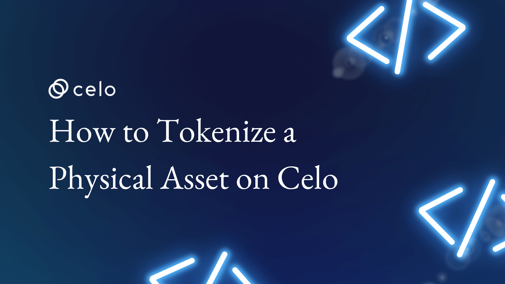

## What is tokenization?

Tokenization is the process of creating a digital token that represents a real-world asset. This token can be traded on a blockchain, which is a distributed ledger that allows for the secure and transparent transfer of ownership of the asset.

Tokenization has the **potential to revolutionize** the way we own and trade assets by making it easier to buy, sell, and transfer ownership of a wide range of assets, including real estate, precious metals, and even fine art. It can also help to increase liquidity and reduce the costs associated with trading assets, as the use of smart contracts and blockchain technology can streamline the transaction process.

On July 14, 2022, Itaú, a big bank in Brazil, launched its cryptocurrency unit, which aims to tokenize fixed-income securities and shares traded in the market to make alternatives that are currently restricted to high-net-worth investors more accessible.

In addition, in the second half of July, the educational platform Pravaler became the first company in the sector to issue tokenized debentures in the local market, raising around U$ 12 million in the operation.

In the Brazil market, there are already companies that have been operating in the area of tokenization of real assets for some years, converting them into NFTs, which stands for Non-Fungible Token, such as MB Tokens, a subsidiary of Mercado Bitcoin focused on the segment and Hurst Capital.

These companies tokenize and offer investors in small fractions anything that can be imagined, as long as it has some real asset behind it that serves as collateral - from consortium quotas to energy marketing contracts, passing through works of art, music royalties, and even the sale of soccer stars like Neymar and Gabriel Barbosa.

These contracts of various kinds are registered on the blockchain network and fractionated, and then offered at affordable prices on cryptocurrency trading platforms to investors.

The **[Celo hackathon to tokenize government assets in Brazil](https://patrimoniodauniaonaweb3.hackerearth.com/)** was an exciting initiative that aims to leverage the power of blockchain technology to promote transparency and efficiency in the management of public assets.

The tokenization of government assets has the potential to transform the way public assets are managed around the world, by enabling greater transparency and accountability in the ownership, transfer, and management of these assets. By creating digital tokens that represent these assets, it becomes possible to track their ownership and transaction history securely and transparently.

To get started with **tokenizing physical assets on Celo**, you'll need to do some research and planning to determine what kind of asset you want to tokenize, how you want to structure your tokens, and what kind of smart contracts and other infrastructure you'll need to create. Once you have a plan in place, you can use tools like OpenZeppelin to help you execute your vision and bring your tokenized asset to life on the blockchain.

## Mechanics of on-chain asset tokenization

**Build the ecosystem:** Service providers ensure that technology integration is seamlessly done with a large ecosystem of vendors so that issuers can create an end-to-end customized solution (e.g., custody, KYC/AML provider, legal, marketing, advisory, tax, etc.).

**Register the underlying asset and set up the token:** The asset is registered and made available for tokenization on the blockchain network. Once the raise is structured and the ecosystem is mapped, service providers enable issuers to configure their tokens simply and intuitively, regardless of the type of asset. The number of assets to be registered on the platform is a decision made in alignment between the issuer and the platform provider.

**Define compliance rules:** These compliance rules are encoded in the smart contract, allowing for faster processing and lower protocol fees that can scale as demand and regulatory complexity grow. It provides flexibility for issuers to set rules on who can hold the token, how many investors can hold the token, and how it can be transferred.

**Store, manage, and distribute the token:** Tokens are stored in a software "vault" and supported by a custody service to manage digital twins (i.e., to maintain the link between an existing asset and its digital token representative). Tokenization service providers offer issuers an automated and reportable way to manage token distribution as well as future distribution events.

**Execute corporate acts:** Allows the issuer to input some details and create a corporate action, for which the mechanism determines rights, schedules communications, distributes capital (if necessary), and updates records. Tokenization significantly reduces the costs of these corporate actions.

## The life cycle of an asset

The life cycle of an asset that has been tokenized on the blockchain typically includes the following stages:

**Creation:** The asset is tokenized by creating a smart contract on the blockchain that represents the asset and defines its ownership and transfer rules. A unique token is issued for the asset and stored in the smart contract.

**Verification:** The ownership and authenticity of the asset are verified through the use of documents, certificates, or other forms of evidence.

**Trading:** The asset is listed for sale on a marketplace or exchange that supports the trading of tokenized assets. Potential buyers can purchase the asset using the token that represents it.

**Transfer:** When the asset is sold, the token representing the asset is transferred from the seller's wallet to the buyer's wallet. This transfer is recorded on the blockchain and is secured by the smart contract that was created during the creation stage.

**Settlement:** After the transfer is complete, the asset is considered to be in the possession of the buyer. The settlement process may involve the transfer of physical ownership of the asset, or it may simply involve the transfer of ownership rights as represented by the token.

**Redeemed:** In some cases, an asset may be redeemed by the original owner or by a third party. This process typically involves the transfer of the token back to the original owner or the third party and may be accompanied by the transfer of physical ownership or ownership rights.

It is important to note that the specific details of the life cycle of a tokenized asset will depend on the type of asset being tokenized and the terms of the smart contract that represents it.

## Tokenize a physical asset on Celo

To tokenize a physical asset on the Celo blockchain, you will need to follow these steps:

*Determine the type of asset* you want to tokenize and ensure that it is allowed on the Celo platform. Some examples of assets that can be tokenized on Celo include real estate, precious metals, and works of art.

*Choose the appropriate Ethereum Request for Comment (ERC) standard* for representing your asset on the blockchain. Several different ERC standards can be used for tokenizing assets, including ERC-721 and ERC-20.

*Create a smart contract on the Celo blockchain* that represents the asset and defines its ownership and transfer rules. This smart contract should specify the conditions under which the asset can be bought, sold, or transferred, as well as any restrictions or limitations on these actions.

## Different types of ERC can be used to represent different types of assets on Celo

Ethereum Request for Comment (ERC) standards are technical specifications that define how tokens can be created and used on the Celo blockchain. Several different ERC standards can be used for tokenization, including ERC-20, ERC-721, ERC-1400, ERC-3643, and ERC-1404.

**ERC-20** is a widely used standard for creating tokens that represent interchangeable assets, such as commodities or currencies. ERC-20 tokens are created using smart contracts and are stored in Celo wallets. They can be traded on exchanges and used in a variety of applications, such as fundraising through initial coin offerings or representing ownership in a company or project.

OpenZeppelin provides a powerful set of tools to help you create your token on Ethereum, including the popular ERC20 standard. You can see it on [https://docs.openzeppelin.com/contracts/4.x/wizard](https://docs.openzeppelin.com/contracts/4.x/wizard)
Contributor

Here is an example of ERC20

```solidity
// SPDX-License-Identifier: MIT
pragma solidity ^0.8.9;
import "@openzeppelin/contracts/token/ERC20/ERC20.sol";
import "@openzeppelin/contracts/token/ERC20/extensions/ERC20Burnable.sol";
import "@openzeppelin/contracts/security/Pausable.sol";
import "@openzeppelin/contracts/access/Ownable.sol";
  
contract TokenizationOfPhysicalAsset is ERC20, ERC20Burnable, Pausable, Ownable {
 constructor() ERC20("Tokenization of Physical Asset", "Tokenize") {
 _mint(msg.sender, 100 * 10 ** decimals());
}
function pause() public onlyOwner {
 _pause();
}
function unpause() public onlyOwner {
 _unpause();
}
  
function mint(address to, uint256 amount) public onlyOwner {
 _mint(to, amount);
}
function _beforeTokenTransfer(address from, address to, uint256 amount) internal whenNotPaused override {
 super._beforeTokenTransfer(from, to, amount);
}
}
```

Let's go over each item in the code to help you if you are a new Solidity developer:

*1.  // SPDX-License-Identifier:* MIT: This is a comment that specifies the license that the code is released under. In this case, it is the MIT license.

*2.  pragma solidity ^0.8.9;:* This is a Solidity compiler directive that specifies the version of the Solidity compiler to use. The ^ character means to use any version greater than or equal to 0.8.9, but less than 0.9.0.

*3.  import "@openzeppelin/contracts/token/ERC20/ERC20.sol";:* This is an import statement that brings in the ERC20 contract from the OpenZeppelin library. This contract provides the functionality to create an ERC20 token.

*4.  import "@openzeppelin/contracts/token/ERC20/extensions/ERC20Burnable.sol";:* This is an import statement that brings in the ERC20Burnable contract from the OpenZeppelin library. This contract provides the functionality to burn ERC20 tokens.

*5.  import "@openzeppelin/contracts/security/Pausable.sol";:* This is an import statement that brings in the Pausable contract from the OpenZeppelin library. This contract provides the functionality to pause and unpause the token contract.

*6.  import "@openzeppelin/contracts/access/Ownable.sol";:* This is an import statement that brings in the Ownable contract from the OpenZeppelin library. This contract provides the functionality to set an owner for the token contract.

*7.  contract TokenizationOfPhysicalAsset is ERC20, ERC20Burnable, Pausable, Ownable {:* This is the start of the main contract, which is named TokenizationOfPhysicalAsset. It inherits from the ERC20, ERC20Burnable, Pausable, and Ownable contracts that were imported earlier.

*8.  constructor() ERC20("Tokenization of Physical Asset", "Tokenize") {:* This is the constructor for the contract, which is called when the contract is first deployed. It initializes the token with the name "Tokenization of Physical Asset" and a symbol of "Tokenize". The ERC20 contract's constructor is also called, which sets up some initial variables.

*9.  _mint(msg.sender, 100* 10 ** decimals());:* This function call mints 100 tokens to the address that deployed the contract, which is represented by msg.sender. The number is multiplied by 10 ** decimals(), which sets the number of decimal places for the token. By default, the ERC20 standard has 18 decimal places, so this call will mint 100 tokens with 18 decimal places.

*10.  function pause() public onlyOwner {:* This function is used to pause the token contract. It can only be called by the contract owner.

*11.  _pause();:* This is the function call that pauses the token contract. It is provided by the Pausable contract.

*12.  function unpause() public onlyOwner {:* This function is used to unpause the token contract. It can only be called by the contract owner.

*13.  _unpause();:* This is the function call that unpauses the token contract. It is provided by the Pausable contract.

*14.  function mint(address to, uint256 amount) public onlyOwner {:* This function is used to mint new tokens to a specific address. It can only be called by the contract owner.

*15.  function _beforeTokenTransfer(address from, address to, uint256 amount) internal whenNotPaused override {* This is a function that is defined in the TokenizationOfPhysicalAsset contract. It overrides the _beforeTokenTransfer function inherited from the ERC20 contract, which is called before every transfer of tokens.

**ERC-721** is a standard for creating non-fungible tokens, which are unique tokens that represent one-of-a-kind assets. ERC-721 tokens are also created using smart contracts and are stored in Ethereum wallets. They can be traded on exchanges and used to represent ownership of unique assets.

To tokenize physical assets on Celo, you can use a standard called ERC-721. You can also start your contract with Openzeppelin and then customize it for your needs.

```solidity
// SPDX-License-Identifier: MIT
pragma solidity ^ 0.8 .9;
import "@openzeppelin/contracts/token/ERC721/ERC721.sol";
import "@openzeppelin/contracts/token/ERC721/extensions/ERC721URIStorage.sol";
import "@openzeppelin/contracts/security/Pausable.sol";
import "@openzeppelin/contracts/access/Ownable.sol";
import "@openzeppelin/contracts/token/ERC721/extensions/ERC721Burnable.sol";
import "@openzeppelin/contracts/utils/Counters.sol";
contract TokenizationNFT is ERC721, ERC721URIStorage, Pausable, Ownable, ERC721Burnable {
    using Counters
    for Counters.Counter;
    Counters.Counter private _tokenIdCounter;
    constructor() ERC721("Tokenization NFT", "NFT") {}

    function _baseURI() internal pure override returns(string memory) {
        return "ipfs://sdsdsdfdfdfdfdfcx2323sds";
    }

    function pause() public onlyOwner {
        _pause();
    }

    function unpause() public onlyOwner {
        _unpause();
    }

    function safeMint(address to, string memory uri) public onlyOwner {
        uint256 tokenId = _tokenIdCounter.current();
        _tokenIdCounter.increment();
        _safeMint(to, tokenId);
        _setTokenURI(tokenId, uri);
    }

    function _beforeTokenTransfer(address from, address to, uint256 tokenId, uint256 batchSize) internal whenNotPaused override {
        super._beforeTokenTransfer(from, to, tokenId, batchSize);
    }
    // The following functions are overrides required by Solidity.
    function _burn(uint256 tokenId) internal override(ERC721, ERC721URIStorage) {
        super._burn(tokenId);
    }

    function tokenURI(uint256 tokenId) public view override(ERC721, ERC721URIStorage) returns(string memory) {
        return super.tokenURI(tokenId);
    }
}
 ```

Let's go over each item in the code to help you if you are a new Solidity developer:

*-   // SPDX-License-Identifier: MIT:* This is a comment that specifies the license under which the code is released.

*-   pragma solidity ^0.8.9;:* This line specifies the version of Solidity being used.

*-   import "@openzeppelin/contracts/token/ERC721/ERC721.sol";:* This is an import statement that brings in the ERC721 contract from the OpenZeppelin library. ERC721 is the standard for NFTs on Ethereum.

*-   import "@openzeppelin/contracts/token/ERC721/extensions/ERC721URIStorage.sol";:* This is another import statement that brings in the ERC721URIStorage contract from OpenZeppelin. This extension allows for the storing and retrieving of metadata associated with the token.

*-   import "@openzeppelin/contracts/security/Pausable.sol";:* This import statement brings in the Pausable contract from OpenZeppelin. This allows the contract owner to pause and unpause token transfers in case of emergencies.

*-   import "@openzeppelin/contracts/access/Ownable.sol";:* This import statement brings in the Ownable contract from OpenZeppelin. This contract implements a basic access control mechanism that restricts access to certain functions to the contract owner.

*-   import "@openzeppelin/contracts/token/ERC721/extensions/ERC721Burnable.sol";:* This is another import statement that brings in the ERC721Burnable contract from OpenZeppelin. This extension adds the ability to burn or destroy tokens.

*-   import "@openzeppelin/contracts/utils/Counters.sol";:* This import statement brings in the Counters library from OpenZeppelin. Counters are used to keep track of the token IDs.

The contract itself is called TokenizationNFT and inherits from several of the imported contracts, including ERC721, ERC721URIStorage, Pausable, Ownable, and ERC721Burnable.

The using Counters for Counters.Counter; statement is used to create a Counters. The counter variable will keep track of the token IDs.

The constructor function sets the name and symbol of the token.

The _baseURI function returns the base URI for the metadata associated with the token.

The pause and unpause functions allow the contract owner to pause and unpause token transfers.

The safeMint function is used to mint a new token and associate it with the specified uri. The address specifies to who the token will be sent.

The _beforeTokenTransfer function is a hook that is called before a token transfer is executed. It checks to make sure that the contract is not paused before the transfer is executed.

The _burn function overrides the_burn function from ERC721URIStorage and ERC721. This function is called to burn or destroy a token.

The tokenURI function is another override that returns the URI associated with the specified token ID.

**ERC-1400** is a standard for creating security tokens, which are tokens that represent ownership in a company or other type of investment. ERC-1400 tokens are designed to comply with securities regulations and can be used to represent ownership in a wide range of assets, including equity, debt, and real estate.

- Treatment and notification of documents

- Security token controls and permissions, including delegation and forced token transfers

- Partial fungibility - improving transparency for investors regarding their ownership rights

**ERC-3643** is a standard for creating utility tokens, which are tokens that can be used to access products or services. It manages compliance by leveraging blockchain security with an automatic validation system. This system applies transfer rules related to users (identities) and those related to the offering. The issuer of the securities, or their agent, always maintains control over the tokens and transfers.

- Block and unblock tokens

- Token recovery process

- Permission for multiple agents

- Management of involved identities

**ERC-1404** is a standard for creating restricted tokens, which are tokens that have limitations on their transferability. ERC-1404 tokens can be used to represent assets that have restrictions on their ownership or transfer, such as assets that are subject to regulatory restrictions or assets that are owned by a specific individual or group. Gives token issuers more control over circulation, as well as visibility of holders. The ability to freeze supply and identify token holders sets it apart from the typical ERC-20 standard, which is often used for altcoins.

Tokenization using these ERC standards allows for the creation and trade of a wide range of assets on the Celo blockchain. By using smart contracts to define the ownership and transfer rules for tokens, tokenization can increase the liquidity and accessibility of assets, making it easier to buy, sell, and transfer ownership.

## Conclusion

In conclusion, the tokenization of assets on the **Celo blockchain is a powerful tool** that enables the creation of digital representations of real-world assets. This process involves breaking down an asset into smaller units or tokens that can be traded and transferred on the blockchain. The mechanics of on-chain asset tokenization involve the creation of a smart contract that defines the rules for the issuance, management, and transfer of the tokens.

The **life cycle of an asset** on the Celo blockchain starts with the creation of the asset token and its issuance to the owner of the underlying asset. The tokens can then be traded and transferred among users, with each transaction being recorded on the blockchain. When the underlying asset is sold or otherwise disposed of, the tokens are burned and removed from circulation.

Various types of assets can be tokenized on the Celo blockchain, including traditional assets such as real estate, stocks, and bonds, as well as non-traditional assets such as intellectual property and carbon credits. Tokenization makes these assets more accessible to a wider range of investors, as they can be bought and sold in smaller units and traded more easily than traditional assets.

Overall, **on-chain asset tokenization** on the Celo blockchain provides a secure, transparent, and efficient way to digitize assets and create new opportunities for investment and innovation.

## About Author

I am a serial entrepreneur, founder of Guizo Studios, and always available to help the Celo ecosystem.

[LinkedIn](https://www.linkedin.com/in/ewertonlopes/)
