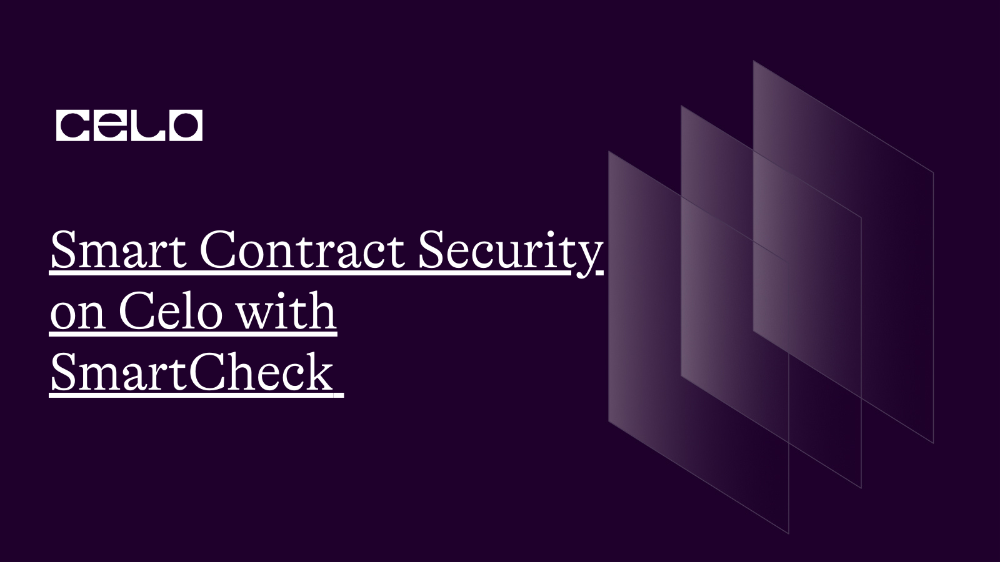
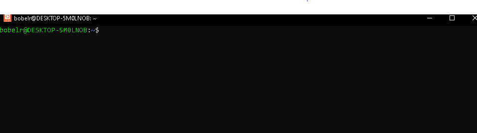
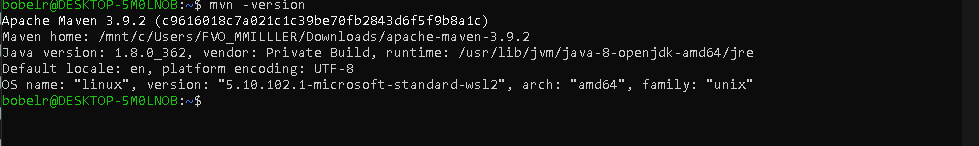
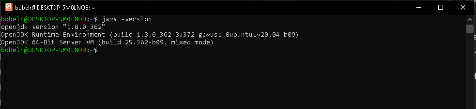
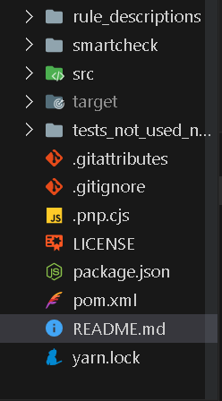
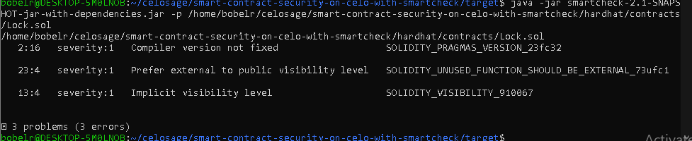

## Introduction

Smart contracts are self-executing pieces of code deployed on a blockchain. Ethereum-compatible blockchains such as Celo are free from censorship,  downtime, and third-party interference. Since the invention of smart contracts, there has been tremendous growth in how software is perceived. Mistakes in smart contracts can be costly. Undetected bugs and risks ranging from low to critical in severity can cause devastating effects on the network participants technically and financially hence, it is crucial for developers to thoroughly scrutinize contracts code before deploying it onto live networks.

## Prerequisites​
This piece guides you through working with smart contracts analytical tool called Smartcheck. The context of this write-up requires that you are at least an intermediate in smart contracts development. If you're a newbie, I recommend starting from **[here](https://docs.celo.org/blog/tutorials/building-a-solidity-smart-contract-for-nft-royalty-fees-a-step-by-step-guide)** and **[here](https://docs.celo.org/blog/tutorials/best-practices-for-writing-smart-contracts-with-real-world-examples)**.

## Requirements​

Beforee you proceed, I assume you run a computer with linus-based operating system. If you run window OS, please follow **[this guide]()** to set up linux distribution on your device.
The following tools are recommended and should be installed prior to this stage.

- [Maven](https://maven.apache.org/)
- [ Java 8](https://www.java.com/download/ie_manual.jsp)
- An IDE. VSCode preferably

> Note: To properly set up things, I recommend using Ubuntu 20.04.06 or later. I had trouble getting it right using Windows OS. This might not be your case, but research shows Linux OS is better.

**What is Smartcheck?**
Smartcheck is an extensible static analysis tool for detecting bugs, vulnerabilities, and other issues in smart contract code written in solidity language. _It is described in the academic paper titled
["SmartCheck: Static Analysis of Ethereum Smart Contracts"](https://hdl.handle.net/10993/35862)_ as released on May 27, 2018.

**Installing**

> Note: Tutorials on Smartcheck installation is very limited, hence the installation guide specified **[here](https://snyk.io/advisor/npm-package/@smartdec/smartcheck)** may not work as at today.

Carefully adhere to the following steps to get Smartcheck working for you.

**Steps**

1. Assume you have installed Ubuntu, launch the command line.



2. Check that `Apache Maven is installed`.

```bash
mvn -version
```

You should see a response as shown in the image, otherwise, follow this **[guide](https://maven.apache.org/)** to download Maven.



3. Check that Java SDK is installed.

```bash
java -version
```



If otherwise, run the following command from the Ubuntu terminal.

```bash
sudo apt install openjdk-8-jdk
```
Check again to ensure Java is installed.

4. There is a **[zip file for Smartcheck](https://drive.google.com/drive/folders/1TNnnteMfD-0yi9ApXEMUshRyjF47xZAj?usp=sharing)** that contains all the files and dependencies you need to get the tool running. Download and extract the file to the desired location.

5. From the Ubuntu terminal, navigate into the folder, then open in VSCode using the command.

```bash
code .
```
Your file structure should be like this.



6. In the current directory, run `yarn` to install the dependencies.

At this point, we have the Smartcheck tool fully set up. The tool is targeted at smart contract codes written in solidity. Good enough, Smartcheck allows us to invoke its command on code using their paths.

In the same project directory, make a new folder for the hardhat project or simply create a `.sol` file anywhere. I prefer the former method. Be sure to have yarn or NPM installed.

**Hardhat Installation**

- Install Hardhat

```bash
yarn add hardhat
```

- Create Hardhat project

```bash
npx hardhat
```

Follow the instructions to create a javascript project. What we basically need for this tutorial is the `Lock.sol` file under `contracts`. When all is set, it's time to run the analysis. 

- In the terminal, move into the `target` folder, inside it is a couple of files and folders. We need the `smartcheck-2.1-SNAPSHOT-jar-with-dependencies.jar` to make the invocation. Run the following command and specify the path to the contract file.

For me, the path reads: `/home/bobelr/celosage/smart-contract-security-on-celo-with-smartcheck/hardhat/contracts/Lock.sol`

```bash
java -jar smartcheck-2.1-SNAPSHOT-jar-with-dependencies.jar -p /home/bobelr/celosage/smart-contract-security-on-celo-with-smartcheck/hardhat/contracts/Lock.sol
```

After running the command, the analysis is performed, and you can see the following issues detected.



**Three issues were found**.

All vulnerabilities found are warnings marked as 1 in the severity region.

- Compiler issue not fixed.

This is a warning about floating pragma. A quick check on the `Lock.sol`, we can see that a specific version of the compiler was not specified. This was marked `1` in severity level.

-  Prefer external to public visibility level
External functions are often cheaper to call than their public counterparts hence the warning.

- Implicit visibility level
You should always endeavor to explicitly provide visibility for functions, variables in the state, and mappings.

Smartcheck as its name implies performs thoughtful analysis better than a few tools I previously mentioned **[here]()** and **[here]()**.

## Conclusion​
So far, we have learned how to :

- Install and set up Smartcheck.
- Analyze smart contracts and catch vulnerabilities using the same tool.

## What next?

Analyze more solidity code. Did you notice any change? Try to explore more vulnerabilities in the contract, and share with us on **[Discord](https://discord.gg/celo)**.

To learn how to deploy your dream project on the Celo blockchain, visit the **[Celo documentation](https://docs.celo.org/tutorials)**

## About the Author​

**Isaac Jesse** , aka _Bobelr_ is a smart contract/Web3 developer. He has been in the field since 2018, worked as an ambassador with several projects like Algorand and so on as a content producer. He has also contributed to Web3 projects as a developer.

## References​

- [Celo developers resources](https://docs.celo.org/developer/)
- [Source code](https://github.com/bobeu/smart-contract-security-on-celo-with-smartcheck)
- [Link](https://blockchain.oodles.io/dev-blog/smart-contract-code-review-using-smartcheck/)
