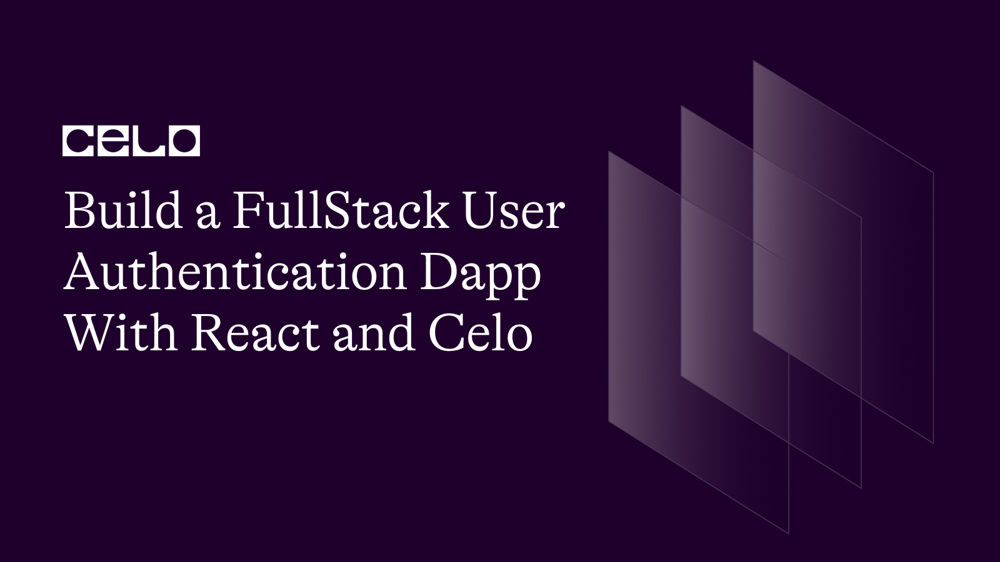

## Introduction

In today's digital age, user authentication is an essential component of any web application. The Celo blockchain network provides a secure and decentralized way to authenticate users, and with React, building a full-stack authentication Dapp has never been easier. In this tutorial, we'll walk you through the process of building a React Dapp that leverages the power of the Celo network to authenticate users and restrict access to pages. With the help of react-celo and ethersJS, you'll learn how to create a secure and seamless user experience that is built on top of the decentralized infrastructure of the Celo network.

## Prerequisites

Before diving into building the React Dapp with Celo authentication, there are a few prerequisites that you should know of:

1. A Basic understanding of React: This tutorial assumes that you have a basic understanding of React and have worked on React projects before.

2. Familiarity with JavaScript: JavaScript is the primary language used for building React apps. You should be comfortable with JavaScript and its syntax.

3. A Basic understanding of Web3: This tutorial uses the Web3 library and Celo blockchain network to interact with the blockchain. It is recommended to have a basic understanding of Web3 before starting this tutorial.

4. Development Environment: You should have a development environment set up for React and Node.js, including Node.js and npm installed on your machine.

By having these prerequisites in place, you'll be able to follow along with the tutorial and build your own React Dapp with Celo authentication.

## Requirements

1. Node.js and npm installed on your machine: [node](https://nodejs.org/en/download/)
2. Code editor (e.g., Visual Studio Code, Sublime Text, Atom)
3. Meta Mask Wallet: [here](https://metamask.io/)
4. Next JS and ethers

## Setting up the tutorial

To begin this tutorial, you can clone the styled starter template project from GitHub.

In your terminal:

```bash
git clone https://github.com/JovanMwesigwa/web3-authentication-dapp/tree/starter-template
```

Once cloning is done, install all the project's dependencies from your terminal:

```bash
yarn
```

or

```bash
npm install
```

This will install specific libraries like `@web3-react/core` and `@web3-react/injected-connector` which provide us with access to the browser-injected window hooks from the Meta Mask wallet.

These hooks will simplify the process of connecting to the wallet and reading information off the wallet, as we'll see later.

In your terminal, enter `yarn run dev` to run your project.

This is what your project looks like:


The `Connect to login` links to the main store inventory page below:


Currently, the inventory page is open and freely accessible by any user.

We want to change this and restrict the inventory page to only be accessible to users who are authenticated with Meta Mask and Celo.

### Creating the connect button

To do this, we need to add a context provider to the root of the app so that we get access to all the necessary hooks.

And we'll do this in the `_app.jsx` file of the projects.

```js
import "@/styles/globals.css";
import { Web3Provider } from "@ethersproject/providers";
import { Web3ReactProvider } from "@web3-react/core";

function getLibrary(provider) {
  return new Web3Provider(provider);
}

export default function App({ Component, pageProps }) {
  return (
    <Web3ReactProvider getLibrary={getLibrary}>
      <Component {...pageProps} />
    </Web3ReactProvider>
  );
}
```

Inside `_app.jsx`, we are importing, `Web3Provider` and `Web3ReactProvider` from the `@ethersproject/providers` and `@web3-react/core` packages, respectively.

The `getLibrary` function is defined to return a new instance of the `Web3Provider` using the provider parameter. This function is passed to the `Web3ReactProvider` as a prop, which allows the provider to connect to the Celo network.

Finally, in the `App` component, we wrap it with the `Web3ReactProvider`, passing in the `getLibrary` function as a prop.

This sets up the necessary context provider at the root of the application, which provides access to various hooks like the `useWeb3React` hook that we'll use to create the connect button.

The `index.jsx` is the main page where a user will be required to authenticate by pressing the `Connect` button

Inside `components/ConnectWallet.jsx` we have a basic connect button defined. Let's modify it and have the connect access logic in it.

```js
import { useWeb3React } from "@web3-react/core";
import styles from "@/styles/Home.module.css";
import { InjectedConnector } from "@web3-react/injected-connector";
import { useEffect } from "react";

const ConnectWallet = ({ isConnected, setIsConnected }) => {
  // White list the Injected connecter to only connect to the Celo Alfajores network with a chain id of 44787
  const injectedConnector = new InjectedConnector({
    supportedChainIds: [44787],
  });

  // Extract the current chains info from the useWeb3React hook
  const { activate, active } = useWeb3React();

  const onClick = () => {
    activate(injectedConnector);
  };

  useEffect(() => {
    setIsConnected(active);
  }, [active]);

  return (
    <>
      {isConnected ? (
        <button className={styles.center}>
          <div className={styles.thirteen}>
            <h1 className="text-lg font-medium">Connected</h1>
          </div>
        </button>
      ) : (
        <button onClick={onClick} className={styles.center}>
          <div className={styles.thirteen}>
            <h1 className="text-lg font-medium">Login with wallet</h1>
          </div>
        </button>
      )}
    </>
  );
};

export default ConnectWallet;
```

In the `ConnectWallet.jsx` file, we first import the necessary modules including the `useWeb3React` hook, which provides access to the current connection status, and the `InjectedConnector` which we'll use to connect to the Meta Mask wallet.

Next, we define the `ConnectWallet` component that receives two state props, `isConnected` and `setIsConnected`. The `isConnected` prop indicates whether the user is currently connected to their Web3 wallet, while `setIsConnected` is a state setter function that updates the `isConnected` prop.

Inside the `ConnectWallet` component, we create a new instance of the `InjectedConnector`, passing in the only supported chain ID as a parameter. In our case, we only want to whitelist one network which is Celo Afajores with a chain id of 44787.

The `useWeb3React` hook gives us access to extract the `activate` and `active` functions.

The `activate` function is used to `activate` the Meta Mask wallet and initiate the connection, while the `active` variable tells us if there is currently an active connection.

An `onClick` function calls the `activate` function, which `activates` the Meta Mask when the user clicks the `Login with wallet` button. When the user clicks the button, the `onClick` function is triggered, which activates the Meta Mask using the `InjectedConnector`.

We use the `useEffect` hook to update the `isConnected` prop when the active variable changes. If the user is connected, we render a `Connected` button, and if not, we render the `Login with wallet` button.

### Updating the Login page

The `ConnectWallet` button is then imported into the `index.jsx` page.

At the top of `index.jsx`, we import the `ConnectWallet` component from the components directory.

```js
import ConnectWallet from "./components/ConnectWallet";
```

This has all the necessary logic to connect the user to Meta Mask as we've seen before.

We then set up the connection state using the useState hook:

```js
const [isConnected, setIsConnected] = useState(false);
```

This state keeps track of whether the user is connected to a wallet or not.

We then use the `useWeb3React` hook to get the chainId of the current network the user is connected to:

```js
const { chainId } = useWeb3React();
```

We also import the `useRouter` hook from `next/navigation`:

We use the `useRouter` hook to programmatically navigate the user to another page once they are connected:

```js
const { push } = useRouter();

if (isConnected) {
  push("/store");
}
```

If `isConnected` is true, meaning the user has successfully connected their wallet, then we navigate the user to the `/store` protected page.

Finally, we render the `ConnectWallet` component:

```js
<ConnectWallet isConnected={isConnected} setIsConnected={setIsConnected} />
```

We pass in the `isConnected` state and the `setIsConnected` function to update the state as props to the `ConnectWallet` component.

Here's the full `index.jsx` code:

```js
import Head from "next/head";
import { Inter } from "next/font/google";
import styles from "@/styles/Home.module.css";
import ConnectWallet from "./components/ConnectWallet";
import { useState } from "react";
import { useRouter } from "next/navigation";
import { useWeb3React } from "@web3-react/core";

const inter = Inter({ subsets: ["latin"] });

export default function Home() {
  const [isConnected, setIsConnected] = useState(false);

  const { chainId } = useWeb3React();

  const { push } = useRouter();

  if (isConnected) {
    push("/store");
  }

  return (
    <>
      <Head>
        <title>Web3 Auth</title>
        <meta name="description" content="Created for Celo Sage tutorials" />
        <meta name="viewport" content="width=device-width, initial-scale=1" />
        <link rel="icon" href="/favicon.ico" />
      </Head>
      <main className={styles.main}>
        {/* Sure error log when a user is not connected to Alfajores network */}
        {chainId && chainId != 44787 && (
          <div className="absolute px-4 py-2 text-red-500 bg-red-100 border-2 border-red-500 rounded-md top-10">
            <h1>Connect to Alfajores network only!</h1>
          </div>
        )}

        <div className={styles.description}>
          <p>Connect on Celo Alajores </p>
          <div>
            <a
              href="https://celo.org/"
              target="_blank"
              rel="noopener noreferrer"
            >
              By <h1 className="text-2xl font-semibold">CELO</h1>
            </a>
          </div>
        </div>

        <ConnectWallet
          isConnected={isConnected}
          setIsConnected={setIsConnected}
        />

        <div className={styles.grid}>
          <a
            href="https://docs.celo.org/"
            className={styles.card}
            target="_blank"
            rel="noopener noreferrer"
          >
            <h2 className={inter.className}>
              Celo Docs <span>-&gt;</span>
            </h2>
            <p className={inter.className}>
              Learn more about celo from the documentation
            </p>
          </a>

          <a
            href="https://docs.celo.org/tutorials"
            className={styles.card}
            target="_blank"
            rel="noopener noreferrer"
          >
            <h2 className={inter.className}>
              Tutorials <span>-&gt;</span>
            </h2>
            <p className={inter.className}>
              Get started with the Celo tutorials
            </p>
          </a>

          <a
            href="https://docs.celo.org/showcase"
            className={styles.card}
            target="_blank"
            rel="noopener noreferrer"
          >
            <h2 className={inter.className}>
              Projects <span>-&gt;</span>
            </h2>
            <p className={inter.className}>
              Scaffold and show off your new projects everywhere 😀
            </p>
          </a>

          <a
            href="https://discord.com/invite/atBpDfqQqX"
            className={styles.card}
            target="_blank"
            rel="noopener noreferrer"
          >
            <h2 className={inter.className}>
              Connect <span>-&gt;</span>
            </h2>
            <p className={inter.className}>
              Join the amazing Celo community on Discord
            </p>
          </a>
        </div>
      </main>
    </>
  );
}
```

### Updating the Store page

When the user has successfully authenticated their wallet, we can then automatically grant them access to the protected store page.

The Store page renders an inventory of items, represented by the `Card` component. The page uses the `useWeb3React` hook from `@web3-react/core` package to check if the user is connected to a web3 provider and retrieve their account address.

The `useEffect` hook is used to check if the user is currently connected to a web3 provider. If they are not, the hook will redirect them back to the home page using the push method from `useRouter`.

```js
import { useWeb3React } from "@web3-react/core";
import { useRouter } from "next/router";
import { useEffect } from "react";
import Card from "./components/Card";

const Store = () => {
  const { account, active } = useWeb3React();

  const { push } = useRouter();

  useEffect(() => {
    if (!active) {
      push("/");
    }
  }, [active]);

  return (
    <div className="flex flex-col flex-1 px-16">
      <div className="flex flex-row items-center justify-between w-full">
        <h1 className="my-8 text-3xl font-bold">Inventory</h1>

        {/* Trancate the address / account */}
        {account && (
          <h5>{`${account.substring(0, 4)}....${account.substring(
            account.length - 4
          )}`}</h5>
        )}
      </div>

      <div className="flex flex-row flex-wrap flex-1 gap-6">
        <Card />
        <Card />
        <Card />
        <Card />
        <Card />
        <Card />
        <Card />
        <Card />
        <Card />
        <Card />
      </div>
    </div>
  );
};

export default Store;
```

### Testing out the application

Now that the logic is done, we can test it out.

In your terminal, start the application by:

```bash
yarn run dev
```

or

```bash
npm run dev
```

When you press on the `Login button`, a new Meta Mask window will pop up asking you to connect the application as shown below.


On confirmation, the dapp will be connected and automatically will redirect the user to an inventory page as shown below.


The current user account address is displayed in the top right corner of the application too.

Trying to disconnect the Dapp will simulate a logout functionality

To do this, open the Meta Mask wallet and click on the green `connected` button to disconnect the dApp as shown below.


This automatically redirects the user back to the login page.

The dapp has several more verification checks that we included. For example, we whitelisted only the Alfajores network. This means that we only allow the user to connect the dApp to a Celo Alfajores network.

## Conclusion

You have now completed a basic tutorial on how to build a web3 authentication system with Celo and Next.js. By following this tutorial, you have learned how to set up a project with Next.js, integrate the web3-react connect SDK, and use the Web3React library to manage user authentication. You also learned how to restrict access to a protected page until the user is authenticated and how to fetch user data from the blockchain. With this knowledge, you can now build more advanced blockchain applications that require user authentication.

## Next Steps

Here are some suggested next steps continue your learning and exploration of Web3 development on Celo:

1. Dive deeper into the Celo ecosystem by checking out the official documentation, tutorials, and developer resources at [here](https://docs.celo.org/)
2. Experiment with building your dApps on Celo by using the available tools and frameworks such as Solidity, Remix, and Truffle.
3. Learn more about how to use Celo's mobile wallets, such as Valora, to interact with dApps and conduct transactions on the Celo network.
4. Join the Celo community on Discord to connect with other developers and enthusiasts, ask questions, and share your projects.
5. Remember, Web3 development is a rapidly evolving field, so it's important to stay up-to-date with the latest trends, tools, and best practices. Keep learning, experimenting, and building, and you'll be on your way to becoming a proficient Web3 developer in no time!

## About the Author

Created by Jovan Mwesigwa B, Blockchain, Solidity developer
Reach out:
Twitter: [@unreal_joova](http://twitter.com/unreal_joova)
Github: [JovanMwesigwa](https://github.com/JovanMwesigwa)
Linkedin: [JovanMwesigwa](https://www.linkedin.com/in/jovan-mwesigwa/)

## References

[Developers Celo](https://celo.org/developers) For Celo dev setup
[Web3 React Docs](https://github.com/Uniswap/web3-react/tree/v6/docs#overview) | Installion and configuration of Web3 React library
[Project code](https://github.com/JovanMwesigwa/web3-authentication-dapp) Github
