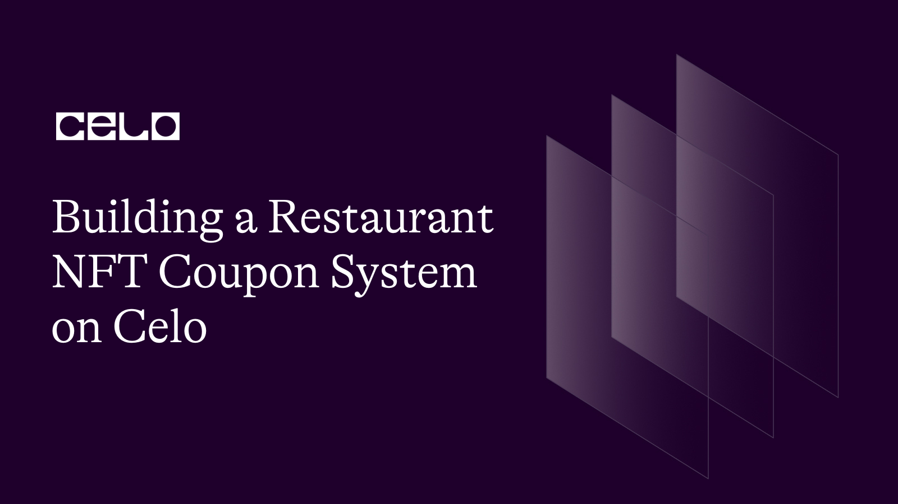

## Introduction

We are back people! In this tutorial, we would be doing a little something different! We would be building a restaurant NFT system. Restaurants are the most active industry in the world and have the most vibrant community and coupons which have become digital has become an ever rapid space. Bringing the NFT to the coupon space makes a coupon a collectible and the rarity of each coupon determines how valuable it should be.

In this tutorial, we would be using a top-bottom approach and not the usual bottom-top I use in my previous tutorials. Top-down in the sense that I would be explaining an already finished project to which I would be dropping the link 😉

## What is an NFT

An NFT, or Non-Fungible Token, is a unique digital asset that represents ownership or proof of authenticity of a specific piece of digital content such as art, music, videos, or other forms of creative work. Unlike regular cryptocurrencies like Bitcoin, each NFT is one-of-a-kind and cannot be exchanged for an identical asset, hence the term "non-fungible". NFTs are typically bought and sold using blockchain technology, which allows for secure ownership tracking and proof of authenticity.

## Prerequisites

- Familiarity with the command line
- Basic understanding of blockchain concepts
- Have some knowledge of solidity and its concepts
- Basic understanding of NFT contracts.

## Requirements

- **[NodeJS](https://nodejs.org/en/download)** from V12.or higher
- A code editor or text editor. **[VSCode](https://code.visualstudio.com/download)** is recommended
- A terminal. **[Git Bash](https://git-scm.com/downloads)** is recommended
- An Internet Browser and a good internet connection
- Metamask

For this particular project, we would be using [this](https://github.com/dahnny/Restaurant-Community-Coupon) as a reference.

## Smart Contract Development

In this contracts folder of this project, you have a file named `RestaurantCoupon.sol` which would be used to go through the code.

The following lines would be used to implement a smart contract that implements the ERC721 token standard

```solidity
// SPDX-License-Identifier: MIT
pragma solidity ^0.8.2;

import "@openzeppelin/contracts/token/ERC721/ERC721.sol";
import "@openzeppelin/contracts/token/ERC721/extensions/ERC721Enumerable.sol";
import "@openzeppelin/contracts/token/ERC721/extensions/ERC721URIStorage.sol";
import "@openzeppelin/contracts/access/Ownable.sol";
import "@openzeppelin/contracts/utils/Counters.sol";
```

This is a smart contract written in the version 0.8.2 of the Solidity programming language.

The contract is importing various modules from the OpenZeppelin library. OpenZeppelin is a popular library of reusable smart contract code that provides many useful features and tools to simplify the development of secure and efficient decentralized applications on the Ethereum blockchain. Additionally, the contract uses an access control mechanism provided by the Ownable module to ensure that only the contract owner can execute certain functions.

After this, You would then create the smartcontract and name it `RestaurantNFT` which inherits from several other contracts, namely ERC721, ERC721Enumerable, ERC721URIStorage, and Ownable, which are imported from the OpenZeppelin library.

```solidity
contract RestaurantNFT is ERC721, ERC721Enumerable, ERC721URIStorage, Ownable {
    using Counters for Counters.Counter;

    Counters.Counter private _tokenIdCounter;

    constructor() ERC721("MR BIGGS", "BIGGS") {}

    uint256 owners = 0;

    struct Restaurant {
        uint256 tokenId;
        string name;
        string description;
        address payable seller;
        address payable owner;
        uint256 price;
        bool sold;
    }

    mapping(uint256 => Restaurant) private restaurants;
```

The `using` statement is used to import the `Counters` module from OpenZeppelin and create a private `_tokenIdCounter` variable to keep track of unique token IDs.

The constructor function initializes the ERC721 token with the name `MR BIGGS` and the symbol `BIGGS`.

The contract defines a struct named Restaurant that contains information about a restaurant NFT, including the token ID, name, description, seller address, owner address, price, and whether the NFT has been sold.

The contract also defines a private restaurants mapping that maps token IDs to the corresponding Restaurant struct. This allows the contract to store and retrieve information about each restaurant NFT.

Up next, you would define a function that mints a new restaurant NFT and assigns it to the caller.

```solidity
    function safeMint(string memory uri, string memory _name, string memory _description, uint256 price)
        public
        payable
        returns (uint256)
    {
        uint256 tokenId = _tokenIdCounter.current();
        _tokenIdCounter.increment();
        _mint(msg.sender, tokenId);

        _setTokenURI(tokenId, uri);
        addRestaurantCoupon(tokenId, _name, _description, price);
        return tokenId;
    }
```

The function takes four parameters: uri, which is a string representing the URI of the NFT's metadata; \_name and \_description, which are strings representing the name and description of the restaurant; and price, which is a uint256 representing the price of the NFT and returns a `uint256`.

The function first gets the current token ID from the `_tokenIdCounter` variable and increments it by one. Then, it calls the `_mint` function inherited from ERC721 to mint a new NFT with the given token ID and assign ownership to the caller.

Next, the function calls the `_setTokenURI` function inherited from `ERC721URIStorage` to set the metadata URI for the new NFT.
The function then calls the `addRestaurantCoupon` function to add information about the new restaurant NFT, including its name, description, and price, to a private mapping of restaurants.

Following this, we define the `addRestaurantCoupon` which we used in the `safeMint` function. It adds information about a new restaurant NFT to a private mapping of restaurants.

```solidity
    function addRestaurantCoupon(uint256 tokenId, string memory _name, string memory _description, uint256 price) private {
        require(price > 0, "Price must be at least 1 wei");
        restaurants[tokenId] = Restaurant(
            tokenId,
            _name,
            _description,
            payable(msg.sender),
            payable(address(this)),
            price,
            false
        );

        _transfer(msg.sender, address(this), tokenId);
    }
```

The function takes four parameters: `tokenId`, which is the ID of the NFT; `_name` and `_description`, which are strings representing the name and description of the restaurant; and `price`, which is a uint256 representing the price of the NFT.

You then check if the price parameter is greater than zero to ensure that the NFT is being sold for a valid price.

Next, the function creates a new `Restaurant` struct and stores it in the `restaurants` mapping using the `tokenId` as the key. The `struct` contains information about the NFT, including its name, description, seller address, owner address (which is set to the contract's address), price, and whether the NFT has been sold.

You then call the `_transfer` function inherited from `ERC721` to transfer ownership of the NFT from the caller to the contract address. This is done so that the contract can hold onto the NFT until it is sold, at which point ownership can be transferred to the buyer.

The next function you are going to write is the `buyCoupon` function which allows a user to purchase a restaurant NFT. The function takes one parameter: tokenId, which is the ID of the NFT being purchased.

```solidity
    function buyCoupon(uint256 tokenId) public payable {
        uint256 price = restaurants[tokenId].price;
        address seller = restaurants[tokenId].seller;
        require(
            msg.value >= price,
            "Please submit the asking price in order to complete the purchase"
        );
        restaurants[tokenId].owner = payable(msg.sender);
        restaurants[tokenId].sold = true;
        restaurants[tokenId].seller = payable(address(0));
        _transfer(address(this), msg.sender, tokenId);

        payable(seller).transfer(msg.value);
    }
```

The function first gets the price of the NFT and the address of the seller from the restaurants mapping.

Next, the function checks that the value sent with the transaction is greater than or equal to the price of the NFT. If the value is less than the price, the transaction reverts with an error message.

If the transaction value is sufficient, the function updates the ownership information for the NFT in the restaurants mapping. The buyer becomes the new owner, and the sold flag is set to true. The seller's address is set to address(0) to indicate that the NFT is no longer owned by the seller.

Then, the function calls the \_transfer function inherited from ERC721 to transfer ownership of the NFT from the contract address to the buyer's address.

The function then transfers the payment from the buyer to the seller using the transfer function. The payment amount is equal to the value sent with the transaction.

After this, you would create the next function called `sellCoupon` which allows a user who owns a restaurant NFT to put it up for sale. The function takes one parameter: `tokenId`, which is the ID of the NFT being sold.

```solidity
    function sellCoupon(uint256 tokenId) public payable {
        require(
            restaurants[tokenId].owner == msg.sender,
            "Only item owner can perform this operation"
        );
        restaurants[tokenId].sold = false;
        restaurants[tokenId].seller = payable(msg.sender);
        restaurants[tokenId].owner = payable(address(this));

        _transfer(msg.sender, address(this), tokenId);
    }
```

The function first checks that the caller is the current owner of the NFT. If the caller is not the owner, the function reverts with an error message.

If the caller is the owner, the function updates the ownership information for the NFT in the restaurants mapping. The sold flag is set to false, indicating that the NFT is no longer sold. The seller's address is set to the caller's address, and the owner's address is set to the contract address.

Then, the function calls the \_transfer function inherited from ERC721 to transfer ownership of the NFT from the caller's address to the contract address.

Note that the function also takes an optional payable value, which indicates that the caller can include additional funds with the transaction. This might be used to charge a fee for listing the NFT for sale, for example.

Up next, we would define a few functions `getCoupons()`, `getCouponsLength()` and `getOwners()`

```solidity
    function getCoupons(uint256 tokenId) public view returns (Restaurant memory) {
        return restaurants[tokenId];
    }

    function getCouponsLength() public view returns (uint256) {
        return _tokenIdCounter.current();
    }

    function getOwners() public view returns (uint256) {
        return owners;
    }
```

`getCoupons(uint256 tokenId) public view returns (Restaurant memory)`: This function takes a tokenId as an argument and returns the Restaurant struct associated with that token ID. The Restaurant struct contains information about the restaurant NFT, such as its name, description, and price.

`getCouponsLength() public view returns (uint256)`: This function returns the current value of the \_tokenIdCounter variable, which is used to keep track of the total number of restaurant NFTs that have been minted. This can be useful for determining the total number of NFTs that exist in the contract.

`getOwners() public view returns (uint256)`: This function returns the value of the owners variable, which appears to be a count of the total number of owners of restaurant NFTs in the contract. However, the owners variable is not updated anywhere else in the contract, so it may not provide an accurate count of the total number of owners.

Up next, we would define two internal functions that are used for handling the transfer and burning of tokens.

```solidity
    function _beforeTokenTransfer(
        address from,
        address to,
        uint256 tokenId
    ) internal override(ERC721, ERC721Enumerable) {
        super._beforeTokenTransfer(from, to, tokenId);
    }

    function _burn(uint256 tokenId)
        internal
        override(ERC721, ERC721URIStorage)
    {
        super._burn(tokenId);
    }
```

The `_beforeTokenTransfer` function is called internally by the `ERC721` and `ERC721Enumerable` contracts before a token is transferred from one address to another. This function ensures that the transfer is allowed and performs any necessary bookkeeping.

The `_burn` function is called internally by the `ERC721` and `ERC721URIStorage` contracts when a token is burned, i.e., permanently destroyed. This function ensures that the token exists and can be burned, and performs any necessary bookkeeping.

Following this, you would then define two functions. The `tokenURI` and the `supportsInterface`.

```solidity
function tokenURI(uint256 tokenId)
        public
        view
        override(ERC721, ERC721URIStorage)
        returns (string memory)
    {
        return super.tokenURI(tokenId);
    }

    function supportsInterface(bytes4 interfaceId)
        public
        view
        override(ERC721, ERC721Enumerable)
        returns (bool)
    {
        return super.supportsInterface(interfaceId);
    }
```

The `tokenURI(uint256 tokenId)` is used to get the URI (Uniform Resource Identifier) associated with a given token ID. In this contract, it overrides the tokenURI function from both the `ERC721` and `ERC721URIStorage` contracts. The `ERC721URIStorage` contract provides functionality for storing and retrieving URIs for each token ID, while ERC721 provides basic functionality for managing non-fungible tokens. By calling `super.tokenURI(tokenId)` inside this function, it is able to get the URI associated with the given token ID, which was previously set using the `_setTokenURI` function when the token was minted.
Then the `supportsInterface(bytes4 interfaceId)` function checks whether the contract implements a particular interface, specified by the given interfaceId. In this contract, it overrides the supportsInterface function from both the `ERC721` and `ERC721Enumerable` contracts. The `ERC721` contract defines a set of standard interfaces for non-fungible tokens, while `ERC721Enumerable` extends `ERC721` with functionality for querying a set of all token IDs. By calling `super.supportsInterface(interfaceId)` inside this function, it checks whether the contract implements the specified interface by delegating to the supportsInterface functions in both `ERC721` and `ERC721Enumerable`. If either of these functions returns true, then this function also returns true.

This is the full smart contract:

```solidity
// SPDX-License-Identifier: MIT
pragma solidity ^0.8.2;

import "@openzeppelin/contracts/token/ERC721/ERC721.sol";
import "@openzeppelin/contracts/token/ERC721/extensions/ERC721Enumerable.sol";
import "@openzeppelin/contracts/token/ERC721/extensions/ERC721URIStorage.sol";
import "@openzeppelin/contracts/access/Ownable.sol";
import "@openzeppelin/contracts/utils/Counters.sol";

contract RestaurantNFT is ERC721, ERC721Enumerable, ERC721URIStorage, Ownable {
    using Counters for Counters.Counter;

    Counters.Counter private _tokenIdCounter;

    constructor() ERC721("MR BIGGS", "BIGGS") {}

    uint256 owners = 0;

    struct Restaurant {
        uint256 tokenId;
        string name;
        string description;
        address payable seller;
        address payable owner;
        uint256 price;
        bool sold;
    }

    mapping(uint256 => Restaurant) private restaurants;

    function safeMint(string memory uri, string memory _name, string memory _description, uint256 price)
        public
        payable
        returns (uint256)
    {
        uint256 tokenId = _tokenIdCounter.current();
        _tokenIdCounter.increment();
        _mint(msg.sender, tokenId);

        _setTokenURI(tokenId, uri);
        addRestaurantCoupon(tokenId, _name, _description, price);
        return tokenId;
    }


    function addRestaurantCoupon(uint256 tokenId, string memory _name, string memory _description, uint256 price) private {
        require(price > 0, "Price must be at least 1 wei");
        restaurants[tokenId] = Restaurant(
            tokenId,
            _name,
            _description,
            payable(msg.sender),
            payable(address(this)),
            price,
            false
        );

        _transfer(msg.sender, address(this), tokenId);
    }

    function buyCoupon(uint256 tokenId) public payable {
        uint256 price = restaurants[tokenId].price;
        address seller = restaurants[tokenId].seller;
        require(
            msg.value >= price,
            "Please submit the asking price in order to complete the purchase"
        );
        restaurants[tokenId].owner = payable(msg.sender);
        restaurants[tokenId].sold = true;
        restaurants[tokenId].seller = payable(address(0));
        _transfer(address(this), msg.sender, tokenId);

        payable(seller).transfer(msg.value);
    }

    function sellCoupon(uint256 tokenId) public payable {
        require(
            restaurants[tokenId].owner == msg.sender,
            "Only item owner can perform this operation"
        );
        restaurants[tokenId].sold = false;
        restaurants[tokenId].seller = payable(msg.sender);
        restaurants[tokenId].owner = payable(address(this));

        _transfer(msg.sender, address(this), tokenId);
    }

    function getCoupons(uint256 tokenId) public view returns (Restaurant memory) {
        return restaurants[tokenId];
    }

    function getCouponsLength() public view returns (uint256) {
        return _tokenIdCounter.current();
    }

    function getOwners() public view returns (uint256) {
        return owners;
    }

    function _beforeTokenTransfer(
        address from,
        address to,
        uint256 tokenId
    ) internal override(ERC721, ERC721Enumerable) {
        super._beforeTokenTransfer(from, to, tokenId);
    }

    function _burn(uint256 tokenId)
        internal
        override(ERC721, ERC721URIStorage)
    {
        super._burn(tokenId);
    }

    function tokenURI(uint256 tokenId)
        public
        view
        override(ERC721, ERC721URIStorage)
        returns (string memory)
    {
        return super.tokenURI(tokenId);
    }

    function supportsInterface(bytes4 interfaceId)
        public
        view
        override(ERC721, ERC721Enumerable)
        returns (bool)
    {
        return super.supportsInterface(interfaceId);
    }
}
```

## Deploy.js

In the scripts folder, there is a file named `deploy.js`which contains a script. This script would be used to deploy our smart contract to the blockchain using hardhat. In this section, I would be explaining the code in the file.

First you start by importing the Hardhat Runtime Environment(HDE) module.

```js
const hre = require("hardhat");

async function main() {
  // Hardhat always runs the compile task when running scripts with its command
  // line interface.
  //
  // If this script is run directly using `node` you may want to call compile
  // manually to make sure everything is compiled
  // await hre.run('compile');

  const RestaurantNFT = await hre.ethers.getContractFactory("RestaurantNFT");
  const restaurantNft = await RestaurantNFT.deploy();

  await restaurantNft.deployed();

  console.log("RestaurantNFT deployed to:", restaurantNft.address);
  storeContractData(restaurantNft);
}
```

The script defines an async function called `main()`, which first creates an instance of the smart contract factory RestaurantNFT using `ethers.getContractFactory()`, and then deploys the contract using `RestaurantNFT.deploy()`.

Once the contract is successfully deployed, the function logs the contract's address to the console using `console.log()`. The function calls `storeContractData()`, which is presumably a custom function that stores the contract's data somewhere.

Note that some parts of the script, such as `await hre.run('compile')`, are commented out. These lines are optional and only need to be uncommented if you need to manually compile your Solidity code before deploying it.

Up next we have the `storeContractData` function that writes the contract address and its artifact to JSON files for later use.

```js
function storeContractData(contract) {
  const fs = require("fs");
  const contractsDir = __dirname + "/../src/contracts";

  if (!fs.existsSync(contractsDir)) {
    fs.mkdirSync(contractsDir);
  }

  fs.writeFileSync(
    contractsDir + "/RestaurantNFTContractAddress.json",
    JSON.stringify({ RestaurantNFT: contract.address }, undefined, 2)
  );

  const RestaurantNFTArtifact = artifacts.readArtifactSync("RestaurantNFT");

  fs.writeFileSync(
    contractsDir + "/RestaurantNFT.json",
    JSON.stringify(RestaurantNFTArtifact, null, 2)
  );
}
```

You use the built-in fs module in Node.js to create a directory called `contracts` in the parent directory of the current file (which is assumed to be in a scripts directory). If the directory already exists, it skips this step.

Then write the contract address to a JSON file called `RestaurantNFTContractAddress.json` in the `contracts` directory. The JSON file contains an object with a single key-value pair, where the key is `RestaurantNFT` and the value is the address of the deployed contract.

You then retrieve the contract's artifact using the artifacts module and writes it to a separate JSON file called `RestaurantNFT.json` in the `contracts` directory. The JSON file contains the full JSON representation of the contract's artifact, which includes its ABI, bytecode, and other metadata.

Finally we call the `main()`function and exits the process with code 0 if main() returns successfully.

```js
// We recommend this pattern to be able to use async/await everywhere
// and properly handle errors.
main()
  .then(() => process.exit(0))
  .catch((error) => {
    console.error(error);
    process.exit(1);
  });
```

If main() throws an error, the error is logged to the console and the process exits with code 1. The purpose of this pattern is to ensure that any unhandled errors are caught and logged to the console, preventing the process from silently failing without providing any feedback to the user.

## Running the dapp

To run this dapp, clone the repo linked earlier, with all the files intact, then open your terminal prefarably git bash and run

```bash
npm install
```

then run

```bash
npm start
```

## Conclusion

For this tutorial, we went through writing a smart contract for a collectible. This project assumes that the reader has a strong grasp of react and knows the basics of metamask.

## Next steps

As a challenge, I would implore you to write your own frontend code and attach the smart contract as well as the deploy.js script to give it a different feel.

## About the Author

Daniel Ogbuti is a web3 developer with a passion for teaching as well as learning. I would love to connect on Twitter @daniel_ogbuti

See you soon!😉
