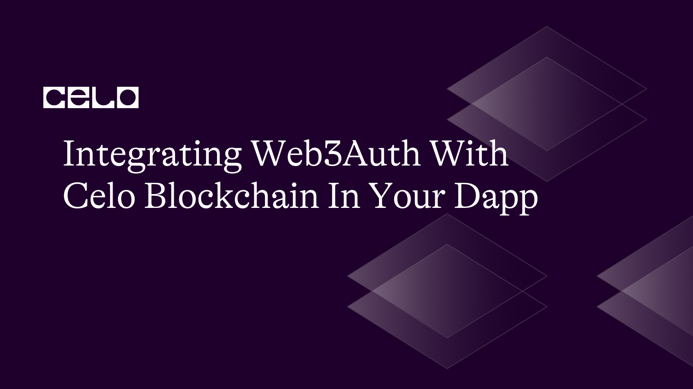

## Introduction

In today's rapidly evolving technological landscape, blockchain technology has become increasingly important in various industries. As a result, there is a growing demand for secure and easy-to-use authentication methods for blockchain-based applications. Web3Auth provides a solution to this challenge by enabling users to authenticate themselves using their blockchain wallets. In this tutorial, we will guide you through the process of integrating Web3Auth with the Celo blockchain in your dApp, allowing for a secure and seamless authentication experience for your users.

## Prerequisite

For the purpose of this tutorial, you will need to have some level of knowledge of the following:

- Solidity
- Hardhat
- Javascript
- Nextjs
- TailwindCSS

## Requirements

For this tutorial, you will need

- A code editor. VScode is preferable.
- A chrome browser.
- A crypto wallet: either [celo-wallet-extension](https://chrome.google.com/webstore/detail/celoextensionwallet/kkilomkmpmkbdnfelcpgckmpcaemjcdh?hl=en) or [Celo wallet](https://celowallet.app) or [MetaMask](https://metamask.io/)
- Fund your wallet using the Celo Faucet. To do this, copy the wallet address and visit the [Celo Faucet](https://faucet.celo.org/) . Paste your wallet address into the designated field and confirm.
- Nodejs is installed on your computer. If not, download from [here](https://nodejs.org/en/download/)

Check out this video on how to install and set up the [celo-wallet-extension](https://youtu.be/KD_0kKxtl8c).

## Project Initialization

Before going ahead to build the smart contract, you’ll need to setup a hardhat Ethereum development environment using yarn or any preferred package manager of your choice.

Create a workspace directory in your preferred code editor.

Go to the terminal of your work environment and run the command

```bash
yarn init -y
```

The command above will initialize the package manager and create a `package.json` file in preparation for installing hardhat and other dependencies.

Next, run this commands

```bash
yarn add --dev hardhat @nomiclabs/hardhat-waffle hardhat-deploy @nomicfoundation/hardhat-toolbox
```

also, run the command.

```bash
yarn add dotenv
```

on your terminal to install all the required dependencies you'll need for this tutorial.

Next, run the command `npx hardhat` to fire up your hardhat development environment. You will be prompted to choose the language you'll be working with.

Click enter three times to select the language you will be working with `Create a JavaScript Project` (for the purpose of this tutorial, we will be working with JavaScript) and  verify the project location. After the setup has been completed, you will notice a new folder structure in your code editor’s file explorer.

## The Smart Contract

Rename the file in your contract folder to `Vote.sol`, and delete the code inside the file.

Replace the code you deleted with the code below

```solidity
// SPDX-License-Identifier: GPL-3.0

pragma solidity ^0.8.0;

contract VotingSystem {
    mapping (string => uint) public votes;
    mapping (address => bool) public voted;
    
    function vote(string memory candidate) public {
        require(!voted[msg.sender], "You have already voted!");
        votes[candidate] += 1;
        voted[msg.sender] = true;
    }
    
    function getVotes(string memory candidate) public view returns (uint) {
        return votes[candidate];
    }
}
```

In this contract, we define a mapping called **`votes`** to keep track of the total number of votes for each candidate. We also define a mapping called **`voted`** to prevent voters from voting multiple times.

The **`vote`** function takes a string **`candidate`** as an argument, representing the candidate the voter wants to vote for. The function first checks if the voter has already voted by checking the **`voted`** mapping. If the voter has already voted, the function throws an error. Otherwise, the function adds one vote to the **`votes`** mapping for the candidate the voter has chosen and sets the **`voted`** mapping to true for the voter's address.

The **`getVotes`** function takes a string **`candidate`** as an argument and returns the total number of votes for that candidate.

## Compiling/Deploying The Smart Contract

Replace the code in the `hardhat.config.js` file with the code below

```jsx
require("@nomiclabs/hardhat-waffle");
require("dotenv").config({ path: ".env" });
require("hardhat-deploy");

// You need to export an object to set up your config
// Go to https://hardhat.org/config/ to learn more

/**
 * @type import('hardhat/config').HardhatUserConfig
 */
module.exports = {
  defaultNetwork: "alfajores",
  networks: {
    localhost: {
      url: "http://127.0.0.1:7545",
    },
    alfajores: {
      gasPrice: 200000000000,
      gas: 41000000000,
      url: "https://alfajores-forno.celo-testnet.org",
      accounts: {
        mnemonic: process.env.MNEMONIC,
        path: "m/44'/52752'/0'/0",
      },
      //chainId: 44787
    },
    celo: {
      url: "https://forno.celo.org",
      accounts: {
        mnemonic: process.env.MNEMONIC,
        path: "m/44'/52752'/0'/0",
      },
      chainId: 42220,
    },
  },
  solidity: "0.8.10",
};
```

Next, you will be using Hardhat’s built-in CLI to deploy your smart contract. 

First, create a `.env` file in your project root folder and in it create a variable name `MNEMONIC`

Now login to your preferred wallet extension on your browser to get your wallet's `MNEMONIC`, and copy the entire phrase.

**NB**: ***Your wallet's MNEMONICS is the same as the key phrase given to you when you initially signed up for an account on your wallet.***

Paste the `MNEMONIC` phrase as the value for the variable `MNEMONIC` inside your `.env` file.

**NB**: ***Your `MNEMONICS` should be kept secret and secure (Not public) at all points.***

Next, head over to the `deploy.js` script in your `scripts` folder and copy the deploy script below to replace the existing code in the `deploy` script.

```jsx
const hre = require("hardhat");

const main = async () => {
	const VotingSystem = await hre.ethers.getContractFactory("VotingSystem");	
	const Voting = await VotingSystem.deploy();

	await Voting.deployed();

	console.log("The VotingSystem contract was deployed to: ", Voting.address);
}

const deploy = async () => {
  try {
    await main();
    process.exit(0);
  } catch (error) {
    console.error(error);
    process.exit(1);
  }
};

deploy();
```

Now run the command `npx hardhat compile` in your terminal, and your contract should be compiled without any errors, with the result like the image below:


Now you might come across this error below while trying to compile your contract. 


Don’t fret, just run this command in your terminal.

```bash
yarn add "@nomicfoundation/hardhat-network-helpers@^1.0.0" "@nomicfoundation/hardhat-chai-matchers@^1.0.0" "@nomiclabs/hardhat-ethers@^2.0.0" "@nomiclabs/hardhat-etherscan@^3.0.0" "@types/chai@^4.2.0" "@types/mocha@>=9.1.0" "@typechain/ethers-v5@^10.1.0" "@typechain/hardhat@^6.1.2" "chai@^4.2.0" "hardhat-gas-reporter@^1.0.8" "solidity-coverage@^0.8.1" "ts-node@>=8.0.0" "typechain@^8.1.0" "typescript@>=4.5.0" --dev
```

Then run the `npx hardhat compile` in your terminal again. This time, your contract should compile successfully.

Finally, run the command `npx hardhat run scripts/deploy.js --network alfajores` to deploy your smart contract to the Celo blockchain on the Alfajores test network. A successful deployment should return a result similar to the image below:


***NB: Copy the contract address returned and save it, you will need it to interact with your deployed contract later***

## The Frontend

To build the Dapp, we will be using Nextjs as our frontend framework, tailwindcss for styling the dapp, and then you will integrate web3auth to authenticate users when they visit your dapp.

To setup your dapp, first in your root project folder create a new folder named `dapp`. Then in your terminal, change the directory to the new folder you created and run this command.

```bash
yarn create next-app .
```

The command above setups a Nextjs project with all the necessary boilerplate and folders installed in the dapp folder you created.

Next, you will install the necessary dependencies. In your terminal pointing to the dapp folder you had created, run

```bash
yarn add @web3auth/modal web3 @walletconnect/client
```

In the dapp folder, create a file named `voting.abi.js` , then copy and paste this code in the file.

```jsx
const abi = [
  {
    inputs: [
      {
        internalType: "string",
        name: "candidate",
        type: "string",
      },
    ],
    name: "getVotes",
    outputs: [
      {
        internalType: "uint256",
        name: "",
        type: "uint256",
      },
    ],
    stateMutability: "view",
    type: "function",
  },
  {
    inputs: [
      {
        internalType: "string",
        name: "candidate",
        type: "string",
      },
    ],
    name: "vote",
    outputs: [],
    stateMutability: "nonpayable",
    type: "function",
  },
  {
    inputs: [
      {
        internalType: "address",
        name: "",
        type: "address",
      },
    ],
    name: "voted",
    outputs: [
      {
        internalType: "bool",
        name: "",
        type: "bool",
      },
    ],
    stateMutability: "view",
    type: "function",
  },
  {
    inputs: [
      {
        internalType: "string",
        name: "",
        type: "string",
      },
    ],
    name: "votes",
    outputs: [
      {
        internalType: "uint256",
        name: "",
        type: "uint256",
      },
    ],
    stateMutability: "view",
    type: "function",
  },
];

export default abi;
```

The above code is the ABI (Application Binary Interface) for the smart contract we deployed.

Next, in the dapp folder, replace the content of the `index.js` file located in the pages folder with the code below.

```jsx
import { Inter } from "next/font/google";
import { useState, useEffect } from "react";
import { Web3Auth } from "@web3auth/modal";
import Web3 from "web3";

import Votes from "@/components/votes";
import abi from "@/voting.abi";

const inter = Inter({ subsets: ["latin"] });

export default function Home() {
  const [candidateName, setCandidateName] = useState("");
  const [votes, showVotes] = useState(false);
  const [address, setAddress] = useState("");
  const [provider, setProvider] = useState();

  return (
    <>
      {address ? (
        <div className="relative">
          <div className="text-end px-4 py-2">
            <button
              className="bg-green-500 p-2 rounded-md"
              onClick={() => showVotes(true)}
            >
              See votes
            </button>
          </div>
          <main className="flex flex-col justify-center items-center py-2 h-[555px]">
            <h2 className="text-xl font-semibold">
              Vote For Your Preferred Candidate
            </h2>
            <div className="mt-4">
              <form onSubmit={vote}>
                <div className="w-[300px] rounded-md">
                  <input
                    type="text"
                    className="outline-none rounded-md p-2 text-black w-full"
                    placeholder="Enter candidate name"
                    onChange={(e) => setCandidateName(e.target.value)}
                  />
                </div>
                <div className="text-center mt-5">
                  <button className="bg-blue-500 rounded-md py-2 px-4">
                    Vote Candidate
                  </button>
                </div>
              </form>
            </div>
          </main>
          {votes ? <Votes onClose={() => showVotes(false)} provider={provider} /> : null}
        </div>
      ) : (
        null
      )}
    </>
  );
}
```

The above code is for the UI of our voting dapp. The UI gets rendered when a user gets authenticated. We will come back to the index.js file when it is time to integrate Web3auth.

In the dapp folder, create a components folder, and inside the components folder, create a `votes.jsx` file, and paste the code below in the `votes.jsx` file.

```jsx
import { useState } from "react";
import Web3 from "web3";

import abi from "@/voting.abi";

const Votes = (props) => {
  const [candidateName, setCandidateName] = useState("");
	const [votes, setVotes] = useState();

  return (
    <div className="fixed inset-0 bg-[rgba(0,0,0,0.2)] backdrop-blur-lg">
      <div
        className="text-end p-3 text-3xl font-thin cursor-pointer"
        onClick={props.onClose}
      >
        x
      </div>
      <div className="flex flex-col justify-center items-center h-[555px]">
        <form onSubmit={viewVotes}>
          <div className="w-[300px] rounded-md">
            <input
              type="text"
              className="outline-none rounded-md p-2 text-black w-full"
              placeholder="Enter candidate name"
              onChange={(e) => setCandidateName(e.target.value)}
            />
          </div>
          <div className="text-center mt-5">
            <button className="bg-blue-500 rounded-md py-2 px-4">
              View Votes
            </button>
          </div>
          {votes ? (
            <div className="text-center mt-3">
              {candidateName}: {votes} votes
            </div>
          ) : null}
        </form>
      </div>
    </div>
  );
};

export default Votes;
```

The code above is for a modal that opens when the “see votes” button created in the `index.js` file is clicked. In this modal, we can view the number of votes garnered by a particular candidate.

**NB**: ***You might come across this error: “Cannot find module ‘next/babel’” from the import statements. To solve this error, replace the content of the `.eslintrc.json` file with this: `{"extends": [”next/babel”, “next/core-web-vitals”]}` .***

Next, you will integrate Web3auth into your dapp. Before you integrate Web3auth, you will have to set up your Web3auth dashboard. The Web3Auth dashboard provides a summary of various aspects related to Web3Auth, including information about projects, verifiers, billings, and team setup. Follow the guide in this documentation to [create your Web3auth dashboard](https://web3auth.io/docs/dashboard-setup/).

After you have successfully created your Web3auth dashboard, create a new project. Follow the video to [create a project on your Web3auth dashboard](https://drive.google.com/file/d/1Y5CLfBytyCmwfOEiXkzE5MgUz2EJBuWg/viewsp=share_link).

Next, copy and paste this code above the return statement in the `index.js` file.

```jsx
useEffect(() => {
    const web3auth = new Web3Auth({
      clientId:"YOUR_WEB3AUTH_CLIENT_ID", // get it from Web3Auth Dashboard
      web3AuthNetwork: "cyan",
      chainConfig: {
        chainNamespace: "eip155",
        chainId: "0xaef3", // hex of 42220, Celo Alfajores testnet
        rpcTarget: "https://rpc.ankr.com/celo",
        // Avoid using public rpcTarget in production.
        // Use services like Infura, Quicknode etc
        displayName: "Celo Testnet",
        blockExplorer: "https://alfajores-blockscout.celo-testnet.org",
        ticker: "CELO",
        tickerName: "CELO",
      },
    });

    const authenticateUser = async () => {
      await web3auth.initModal();

      const provider = await web3auth.connect();

      setProvider(provider)

      const web3 = new Web3(provider);

      const address = await web3.eth.getAccounts();
      setAddress(address[0]);
    };

    authenticateUser();
  });

  const vote = async (e) => {
    e.preventDefault();
    const web3 = new Web3(provider);

    const contract = new web3.eth.Contract(abi, "0xE7bE545189aa2EA3aE887a9b90AE05AD6D496596");
    console.log(contract);
    const result = await contract.methods.vote(candidateName).send({from: address});
    console.log(result);
  }
```

Follow the demo video below to get your [Web3auth clientId](https://drive.google.com/file/d/1nOcNbLKwjrwq_SoY_y8qRadye9PzwpIL/view?usp=share_link).

Congratulations, You’ve successfully integrated Web3auth into your dapp. To start the development server to view your dapp on `localhost`, run this command in your terminal

```bash
yarn run dev
```

This is a demo of [how your dapp should look and work](https://drive.google.com/file/d/1kDEzzxExp-PL13Rt0XM59dLHIbtX6sbV/view?usp=share_link).

## Conclusion

So far, we’ve been able to create a simple voting smart contract, followed by a simple UI for the smart contract and lastly, we integrated Web3auth into the dapp inorder to authenticate users using their wallet or social accounts. You can access the code for this tutorial [here](https://github.com/J0shcodes/web3-auth-integration)  

## Next Steps

You can explore authenticating users through other methods like their socials, unlike this tutorial where we explored authenticating users using their wallets. For more guide on how to go about this checkout this doc on [integrating Web3auth with the Celo Blockchain](https://web3auth.io/docs/connect-blockchain/celo)

## About the Author

I am a React frontend developer with over 3 years of experience building for the web, a web3 developer, and a technical writer. Visit my [GitHub profile](https://github.com/J0shcodes) to see some of the projects I have worked on and currently working on.

## References

[Web3auth docs](https://web3auth.io/docs/)
