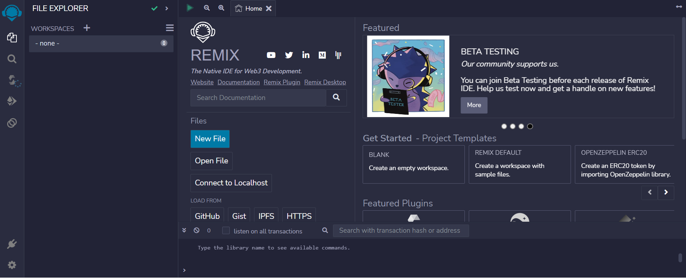

## Introduction

Welcome my people! (Insert some phrase meant to be funny but really isn't😅). In this tutorial, we would be going through how to build a decentralized tipping system on the celo blockchain. First, lets get acquainted with celo

### What is Celo

Celo is a blockchain platform that focuses on enabling mobile-first financial services. It is built using the Ethereum codebase and employs a proof-of-stake consensus mechanism for transaction validation. One unique aspect of Celo is its focus on usability and accessibility, aiming to create a more inclusive and decentralized financial system.

## Prerequisites

- Prior knowledge of javascript
- Familiarity with the command line
- Basic understanding of blockchain concepts
- Have some knowledge of solidity and its concepts
- Have a basic understanding of **[React](https://react.org)**. Knowledge of JSX, props, state, and hooks.

## Requirements

- **[NodeJS](https://nodejs.org/en/download)** from V12.or higher
- A code editor or text editor. **[VSCode](https://code.visualstudio.com/download)** is recommended
- A terminal. **[Git Bash](https://git-scm.com/downloads)** is recommended
- An Internet Browser and a good internet connection
- **[Remix](https://remix.ethereum.org)**
- **[Celo Extension Wallet](https://chrome.google.com/webstore/detail/celoextensionwallet/kkilomkmpmkbdnfelcpgckmpcaemjcdh?hl=en)**.

## Smart Contract Development

If you have seen any of my previous tutorials, you would realize I am fan of remix for writing smart contracts. Remix is a web-based IDE that allows developers to write, test and deploy smart contracts on the Celo blockchain.

Here is a preview of the Remix IDE:


On Remix, We would create a new workspace and then a new file which we would name `invest.sol`

Starting in the first line, you include a statement that specifies the license under which the code is being released.

```js
// SPDX-License-Identifier: MIT
pragma solidity >=0.7.0 <0.9.0;
```

The first line is a SPDX license identifier and a Solidity version pragma.

SPDX (Software Package Data Exchange) is a specification that provides a standard way to declare the license of open source software packages. The SPDX-License-Identifier is a header that specifies the license of a given source code file.
The Solidity version pragma specifies the version of the Solidity programming language used to write the smart contract code. The version range specified is greater than or equal to 0.7.0 and less than 0.9.0, meaning that the code should be compiled with a Solidity compiler version between 0.7.0 and 0.8.x.

Following that, we define an `IERC20Token` interface which enables us to interact with the celo stablecoin (cUSD).

```solidity
// SPDX-License-Identifier: MIT

pragma solidity >=0.7.0 <0.9.0;

interface IERC20Token {
  function transfer(address, uint256) external returns (bool);
  function approve(address, uint256) external returns (bool);
  function transferFrom(address, address, uint256) external returns (bool);
  function totalSupply() external view returns (uint256);
  function balanceOf(address) external view returns (uint256);
  function allowance(address, address) external view returns (uint256);

  event Transfer(address indexed from, address indexed to, uint256 value);
  event Approval(address indexed owner, address indexed spender, uint256 value);
}
```

ERC-20 tokens are a widely-used standard for creating digital assets on the Ethereum blockchain, and cUSD is one of them.

These tokens have pre-defined functions and events that can be easily used in contracts and do not require any additional implementation. For example, you will be using the ERC-20 token's interface to interact with it, so that your contract can communicate with the token.

You can find more information on how to use these functions and events in the Celo **[documentation](https://docs.celo.org/developer-guide/celo-for-eth-devs)**. The documentation also provides more details on how to interact with ERC-20 tokens and how to use them with the Celo network.

Next up, you would define a contract named `Tipper`. Within this contract, there is a definition for a struct called `Staff`. A struct is a user-defined data type that groups together related data elements of different types which can be used to create instances of staff members, which can then be managed and tracked within the smart contract

```solidity
contract Tipper{
    struct Staff{
        address payable owner;
        string name;
        string image;
        string bio;
        string age;
        string jobDescription;
        uint totalAmount;
    }
```

In this case, the `Staff` struct has several properties:

"`owner`": an address variable that can receive and send cUSD and is marked as `payable`.
"`name`": a string variable that represents the name of the staff member.
"`image`": a string variable that represents an image of the staff member.
"`bio`": a string variable that represents the biography of the staff member.
"`age`": a string variable that represents the age of the staff member.
"`jobDescription`": a string variable that represents the job description of the staff member.
"`totalAmount`": an unsigned integer variable that represents the total amount of cUSD that has been tipped to the staff member.

Next, we would initialize some internal variables and data structures.

```solidity
    address internal companyAddress = msg.sender;
    address internal cUsdTokenAddress =
        0x874069Fa1Eb16D44d622F2e0Ca25eeA172369bC1;
    mapping(uint256 => Staff) internal staffs;
    uint staffLength = 0;
```

The first line creates an internal address variable named `companyAddress` and assigns it the value of the address that deployed the smart contract, which is obtained through the `msg.sender` keyword.

The second line creates another internal address variable named `cUsdTokenAddress` and assigns it a specific address (0x874069Fa1Eb16D44d622F2e0Ca25eeA172369bC1), which represents the address of a particular token on the Celo network.

The third line creates an internal mapping called `staffs` which maps unsigned integers (uint256) to instances of a custom data type called `Staff`. This mapping will be used to store the staff members' data.

The fourth line initializes a variable named `staffLength` to 0, which will be used to keep track of the number of staff members added to the `staffs` mapping.

Up next, you would define an `isAdmin` modifier that will restrict access to certain functions within the smart contract, ensuring that only the admin (i.e., the address that deployed the contract) can execute them.

```solidity
    modifier isAdmin() {
        require(msg.sender == companyAddress, "Accessible only to the admin");
        _;
    }
```

A modifier is a way to change the behavior of a function by adding some conditions to it. In this case, the `isAdmin` modifier checks if the address that is calling the function (msg.sender) is equal to the `companyAddress` variable that was set when the contract was deployed. If the condition is true, the code inside the function will be executed. Otherwise, an error message will be thrown and the function will not execute.

The `require` statement is used to specify the condition that must be met in order for the function to be executed. If the condition is not met, the error message specified in the second argument of the `require` statement will be returned and the function will not execute.

The "\_" symbol in the modifier indicates where the code of the function that uses the modifier will be inserted. When a function is marked with this modifier, the code inside the function is only executed if the condition in the modifier is true.

Moving on, you would define a function called `addStaff` that allows the admin to add new staff members to the smart contract by initializing a new instance of the `Staff` struct and storing it in the `staffs` mapping. This function can only be called by the admin due to the `isAdmin` modifier, which ensures that only the admin has the authority to add new staff members.

```solidity
    function addStaff(
        string memory _name,
        string memory _image,
        string memory _bio,
        string memory _age,
        string memory _jobDescription
    )public isAdmin(){
        staffs[staffLength] = Staff(
            payable(msg.sender),
            _name,
            _image,
            _bio,
            _age,
            _jobDescription,
            0
        );
        staffLength++;
    }
```

The function takes five input parameters, which are all strings: `_name`, `_image`, `_bio`, `_age`, and `_jobDescription`.

The function is marked as `public`, meaning it can be called from outside the smart contract. Additionally, it is restricted by the "isAdmin" modifier, which means that only the admin (i.e., the address that deployed the smart contract) can call this function.

Inside the function, a new instance of the `Staff` struct is created and stored in the `staffs` mapping. The `staffLength` variable is used to determine the index where the new staff member will be added in the mapping. The `payable` keyword is used to specify that the owner attribute of the Staff struct should be a `payable` address.

The input parameters are used to initialize the different attributes of the `Staff` struct. Once the new staff member has been added, the `staffLength` variable is incremented to reflect the new length of the `staffs` mapping.

After this, create a function named `getStaff` which allows anyone to retrieve the details of a staff member from the smart contract by specifying the index of the staff member in the staffs mapping. Since the function is marked as view, it does not modify the state of the smart contract and can be called without incurring gas costs.

```solidity
    function getStaff(uint _index)public view returns(
        address payable,
        string memory,
        string memory,
        string memory,
        string memory,
        string memory,
        uint
    ){
       Staff storage _staff = staffs[_index];
       return (
           _staff.owner,
           _staff.name,
           _staff.image,
           _staff.bio,
           _staff.age,
           _staff.jobDescription,
           _staff.totalAmount
       );
    }
```

The function takes one input parameter, which is an unsigned integer `_index` representing the index of the staff member in the `staffs` mapping.

The function is marked as `public`, meaning it can be called from outside the smart contract. It is also marked as `view`, which means it does not modify the state of the smart contract and only returns information.

Inside the function, the staff member at the specified index is retrieved from the staffs mapping using the `_index` parameter. The Staff struct instance is assigned to a local variable named `_staff`, which is marked as `storage`. The `storage` keyword indicates that the local variable is a reference to the actual data stored on the blockchain, rather than a copy of the data.

The attributes of the `Staff` struct instance are then returned as a tuple containing:

- the payable address of the staff member's owner
- the name of the staff member
- the image of the staff member
- the biography of the staff member
- the age of the staff member
- the job description of the staff member
- the total amount of tips received by the staff member

Moving on, you would define the next function named `tipStaff` which allows anyone to tip a staff member from the smart contract by specifying the index of the staff member in the staffs mapping and the amount of the tip. The function ensures that the caller has approved the transfer of the specified amount of tokens, and adds the amount to the total amount of tips received by the staff member.

```solidity
    function tipStaff(uint _index, uint256 amount) public payable {
        require(
            IERC20Token(cUsdTokenAddress).transferFrom(
                msg.sender,
                staffs[_index].owner,
                amount
            ),
            "Could not tip"
        );
        staffs[_index].totalAmount += amount;
    }
```

The function takes two input parameters:

- an unsigned integer `_index` representing the index of the staff member in the `staffs` mapping
- a uint256 `amount` representing the amount of the tip in the smallest unit of the token being used (for example, if the token has 18 decimal places, the amount would represent the value in wei)
  The function is marked as public, meaning it can be called from outside the smart contract.

Inside the function, the `require` statement checks whether the caller has approved the smart contract to transfer the amount of tokens on their behalf. This is done using the transferFrom function of the `IERC20Token` interface, which represents a standard ERC20 token contract. The `cUsdTokenAddress` is the address of the `ERC20` token contract being used for tipping.

If the transfer of tokens is successful, the amount is added to the `totalAmount` attribute of the staff member at the specified index in the staffs mapping. This indicates the total amount of tips received by the staff member.

If the transfer of tokens fails, an error message is returned, indicating that the tip could not be processed.

For access control, you would define a function called `isUserAdmin` which is a simple function that can be used to check whether a specified address is the same as the `companyAddress` variable, which is the address of the administrator or owner of the smart contract. This function can be useful for implementing access control mechanisms in the smart contract, where certain functions can only be executed by the administrator or owner.

```solidity
    function isUserAdmin(address _address) public view returns (bool) {
        if (_address == companyAddress) {
            return true;
        }
        return false;
    }
```

The function takes one input parameter, which is an Celo address named `_address`. It is marked as a public function, meaning it can be called from outside the smart contract and is visible on the blockchain.

The function first checks whether the `_address` parameter is equal to the `companyAddress` variable. If the two addresses are equal, the function returns true. If the two addresses are not equal, the function returns false.

Finally, you would define two new functions, these two functions can be useful for managing the ownership and control of the smart contract, as well as getting information about the number of staff members currently stored in the smart contract.

```solidity
    function changeAdminAddress(address _address)public{
        companyAddress = _address;
    }

    function getStaffLength() public view returns(uint){
        return staffLength;
    }

```

The `changeAdminAddress` function allows the current administrator to change the `companyAddress` to a new address. The new address is passed as a parameter named `_address`. This function is marked as `public`, which means it can be called from outside the contract.

The function simply assigns the new address passed as a parameter to the companyAddress variable. This allows the current administrator to transfer ownership or control of the smart contract to another Ethereum address.

The `getStaffLength` function returns the current length of the `staffs` mapping. The length of `staffs` represents the number of staff members currently stored in the smart contract. This function is marked as `public`, which means it can be called from outside the contract.

The function simply returns the value of the `staffLength` variable, which is an internal counter that keeps track of the number of staff members currently stored in the smart contract.

And Voila!!! 🚀

Here is the full code:

```solidity
// SPDX-License-Identifier: MIT

pragma solidity >=0.7.0 <0.9.0;

interface IERC20Token {
    function transfer(address, uint256) external returns (bool);

    function approve(address, uint256) external returns (bool);

    function transferFrom(
        address,
        address,
        uint256
    ) external returns (bool);

    function totalSupply() external view returns (uint256);

    function balanceOf(address) external view returns (uint256);

    function allowance(address, address) external view returns (uint256);

    event Transfer(address indexed from, address indexed to, uint256 value);
    event Approval(
        address indexed owner,
        address indexed spender,
        uint256 value
    );
}

contract Tipper{
    struct Staff{
        address payable owner;
        string name;
        string image;
        string bio;
        string age;
        string jobDescription;
        uint totalAmount;
    }
    address internal companyAddress = msg.sender;
    address internal cUsdTokenAddress =
        0x874069Fa1Eb16D44d622F2e0Ca25eeA172369bC1;
    mapping(uint256 => Staff) internal staffs;
    uint staffLength = 0;


    modifier isAdmin() {
        require(msg.sender == companyAddress, "Accessible only to the admin");
        _;
    }

    function addStaff(
        string memory _name,
        string memory _image,
        string memory _bio,
        string memory _age,
        string memory _jobDescription
    )public isAdmin(){
        staffs[staffLength] = Staff(
            payable(msg.sender),
            _name,
            _image,
            _bio,
            _age,
            _jobDescription,
            0
        );
        staffLength++;
    }

    function getStaff(uint _index)public view returns(
        address payable,
        string memory,
        string memory,
        string memory,
        string memory,
        string memory,
        uint
    ){
       Staff storage _staff = staffs[_index];
       return (
           _staff.owner,
           _staff.name,
           _staff.image,
           _staff.bio,
           _staff.age,
           _staff.jobDescription,
           _staff.totalAmount
       );
    }
    function tipStaff(uint _index, uint256 amount) public payable {
        require(
            IERC20Token(cUsdTokenAddress).transferFrom(
                msg.sender,
                staffs[_index].owner,
                amount
            ),
            "Could not tip"
        );
        staffs[_index].totalAmount += amount;
    }

    function isUserAdmin(address _address) public view returns (bool) {
        if (_address == companyAddress) {
            return true;
        }
        return false;
    }

    function changeAdminAddress(address _address)public{
        companyAddress = _address;
    }

    function getStaffLength() public view returns(uint){
        return staffLength;
    }

}
```

## Contract Deployment

To deploy the contract, we would need:

1. [CeloExtensionWallet](<(https://chrome.google.com/webstore/detail/celoextensionwallet/kkilomkmpmkbdnfelcpgckmpcaemjcdh?hl=en)>)
2. [ Celo Faucet](https://celo.org/developers/faucet)
3. Celo Remix Plugin

Download the Celo Extension Wallet from the Google chrome store using the link above. After doing that, create a wallet, and store your key phrase in a very safe place to avoid permanently losing your funds.

After downloading and creating your wallet, you will need to fund it using the Celo Faucet. Copy the address to your wallet, click the link to the faucet above and paste the address into the text field, and confirm.

Next up, on remix, download and activate the celo plugin from the plugin manager. Connect your wallet and deploy your contract.

## Conclusion

Congratulations 🎉, you now know what you need to build a decentralized tipping system for staffs on the celo blockchain. Great JOB!!

## Next steps

You can challenge yourself by implementing a frontend, I would be making a whole tutorial on that but if you are confident in your react skills then I implore you to go ahead 😉
You can use this [link](https://github.com/dahnny/Tipper) for reference

## About the Author

Daniel Ogbuti is a web3 developer with a passion for teaching as well as learning. I would love to connect on Twitter @daniel_ogbuti and linkedin @ Daniel Ogbuti

See you soon!
