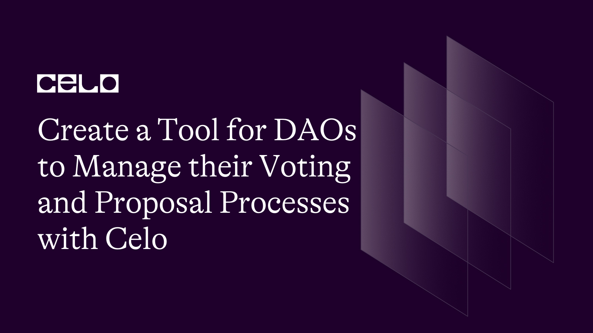

## Introduction

We know that DAOs have gained popularity in recent years due to their potential to offer this new model of organization that can operate in a decentralized, autonomous, and transparent manner. Though thrilling to see that organizations have the ability to thrive without central authorities, it's very complex building and managing a DAO. There has to be a way to control the decision-making process, consideration and execution of proposals to ensure the progress of the DAO.

## Background Knowledge

Platforms like snapshot.org and tally.xyz help on-chain decentralized organizations such as Investment DAO or DEX that use DAO proposals to make significant decisions, to manage their DAO process.

## Requirements

Before we begin, make sure to have a package manager installed on your machine. yarn and npm are perfect managers.

## Github Code

If you would like to see the implementation of this tutorial, check this github repo [here](https://github.com/alofeoluwafemi/demodao)

## Project Flow

Let us look this flow that explains a typical DAO operates


The first step to consider when trying to manage a DAO is the **Membership**.
To become a member of most DAOs, you need to hold a certain number of tokens and be a participant or contribute to the DAO projects As a member, you have the power to vote on proposals and be a part of general decision making.

The next thing we should consider is the **Governance**. Governance facilitate the decision process. There are several models used for governance. One is **token-weighted voting** and it allows members vote on proposals based on the amount of tokens they hold. There is also the **conviction voting** which allows members to vote on proposals based on their level of conviction in a proposal.

A crucial aspect for managing a DAO is the **Proposal Submission**. Submissions can be of any kind such as requests for funding or a request for a change in policies. This can be done by creating and uploading proposal files that can be stored on decentralized storage platforms like IPFS. The files can be retrieved and all members of the DAO have access to them.

Another important step is **Voting**. Depending on the model the DAO chooses to use as discussed earlier, members can submit their vote on the proposals submitted. All proposals that have the required number of votes necessary for execution will be approved. Voting can be done on or off-chain.

**Smart contract execution** is usually the final step. As soon as a proposal is approved, the governance smart contract will execute the proposal automatically. The smart contract has access to all the necessary files stored on IPFS that is used to complete it's execution.

Now that we have a good overview of DAO processes. Let's build a tool to simulate this process.

## Project Demo

https://user-images.githubusercontent.com/7295729/232341000-e1d120d7-4de7-4ff0-b4a4-a0c7c4fdc9bd.MP4

## Set-up

- **Package Manager**: A package manager is a tool that simplifies the process of managing dependencies for software projects and ensures that the project can function properly with all required dependencies installed and configured correctly. Examples include `npm` or `yarn`.

- **Celo Composer**: Celo Composer is a tool built by the Celo Devrel team which you can use to quickly build, deploy, and iterate on decentralized applications. To start up a project with Celo Composer check out https://github.com/celo-org/celo-composer

## Smart Contract development

Start by setting up your project using Celo Composer. In this tutorial, we are using `React` for our front-end framework, `Rainbowkit-celo` for our web3 library and `Hardhat` for the smart-contract framework.


We continue by writing the governance contract. Navigate in this order on your IDE packages/hardhat/contracts. Create a new file called `Governance.sol`. Your smart contract can look like this

```solidity
pragma solidity ^0.8.0;

contract Governance {
    struct Proposal {
        uint256 id;
        address creator;
        string title;
        string description;
        uint256 amount;
        uint256 deadline;
        bytes32 ipfsHash;
        uint256 yesVotes;
        uint256 noVotes;
        bool executed;
        bool disputed;
    }

    Proposal[] public proposals;

    mapping(address => uint256) public tokens;

    uint256 public totalTokens;

    constructor() {
        totalTokens = 1000;
        tokens[msg.sender] = totalTokens;
    }

    function submitProposal(string memory _title, string memory _description, uint256 _amount, uint256 _deadline, bytes32 _ipfsHash) public {
        require(tokens[msg.sender] > 0, "Must have tokens to submit a proposal");
        require(_amount <= address(this).balance, "Not enough funds in DAO to fulfill request");
        uint256 proposalId = proposals.length;
        proposals.push(Proposal(proposalId, msg.sender, _title, _description, _amount, _deadline, _ipfsHash, 0, 0, false, false));
        tokens[msg.sender] -= 1;
    }

    function vote(uint256 _proposalId, bool _inSupport) public {
        require(tokens[msg.sender] > 0, "Must have tokens to vote");
        require(proposals[_proposalId].deadline > block.timestamp, "Voting period has ended");
        require(!proposals[_proposalId].executed, "Proposal has already been executed");
        require(!proposals[_proposalId].disputed, "Proposal is currently in dispute");
        if (_inSupport) {
            proposals[_proposalId].yesVotes += tokens[msg.sender];
        } else {
            proposals[_proposalId].noVotes += tokens[msg.sender];
        }
        tokens[msg.sender] = 0;
    }

    function executeProposal(uint256 _proposalId) public {
        require(proposals[_proposalId].yesVotes > proposals[_proposalId].noVotes, "Proposal did not receive enough support");
        require(proposals[_proposalId].deadline < block.timestamp, "Voting period has not ended");
        require(!proposals[_proposalId].executed, "Proposal has already been executed");
        proposals[_proposalId].executed = true;
        payable(proposals[_proposalId].creator).transfer(proposals[_proposalId].amount);
    }

    function disputeProposal(uint256 _proposalId) public {
        require(!proposals[_proposalId].disputed, "Proposal is already in dispute");
        proposals[_proposalId].disputed = true;
        // Trigger dispute resolution process
    }

    function getProposal(uint256 _proposalId) public view returns (Proposal memory) {
        return proposals[_proposalId];
    }

    function getProposalFileHash(
        uint256 proposalId
    ) public view returns (bytes32) {
        return proposals[proposalId].ipfsHash;
    }
}
```

> Note: Feel free to customize this smart contract. Some functions might have to be payable. For example, yours might only have `executeProposal` function if you wish to do submission and voting off-chain

From this smart contract, a member of the DAO can submit a proposal by creating a new proposal object that contains the following: title, description, proposal type, proposal amount (assuming they are requesting for funds), proposal deadline and the IPFS Hash. Members can vote for or against within the deadline. Proposal receives enough votes in favor and the proposal is executed automatically i.e funds are sent out to the recipient. If there is a dispute, a dispute resolution process is triggered.

## Front-end

To have a feel of Celo Composer, you can run the react-app. Navigate to packages >> react-app. Run the following command

```bash
yarn
yarn dev
```

Here is what you will see


Let's start by writing out the components. You can create a `SideBar.tsx` component. This can be called from our `Layout.tsx` component. In here , your code can look like this

```typescript
import Link from "next/link";
import { useRouter } from "next/router";
import React, { useEffect, useRef } from "react";
import AboutIcon from "../icons/AboutIcon";
import ExploreIcon from "../icons/ExploreIcon";
import SpacesIcon from "../icons/SpacesIcon";
import MobileSidebar from "./MobileSidebar";

const Sidebar: React.FC = ({}) => {
  const router = useRouter();
  const ref = useRef<HTMLDivElement>(null);

  return (
    <>
      <div className="h-screen flex justify-between shadow-sm scrollbar-change flex-col overflow-y-auto w-60 border-r border-r-[#545252] ml-0">
        <div className="h-full flex flex-col justify-between">
          <div>
            <div className="flex items-center justify-center mx-auto py-4">
              <Link
                href="/"
                className="flex items-center justify-between px-6 py-3 gap-5 bg-[#3F3F3F] rounded-full text-sm text-white mx-auto"
              >
                Create DAO
              </Link>
            </div>

            <div className="nav__inner mt-5">
              <div className="flex flex-col justify-between ">
                <Link
                  href="/explore"
                  className={`nav__link hover:bg-[#3F3F3F] transition-all ease-in duration-200 ${
                    router.asPath === "/explore" ? "bg-[#3F3F3F] active" : ""
                  } `}
                >
                  <div className="flex items-center gap-3 py-4 px-6 mx-auto border-b border-[#545252] text-sm relative">
                    <span>
                      <ExploreIcon />
                    </span>

                    <span className="nav_item">Explore</span>
                    <span className="right_border"></span>
                  </div>
                </Link>
                <Link
                  href="/spaces"
                  className={`nav__link hover:bg-[#3F3F3F] transition-all ease-in duration-200 border-b border-[#545252] ${
                    router.asPath === "/spaces" ||
                    router.pathname.startsWith("/spaces")
                      ? "bg-[#3F3F3F] active"
                      : ""
                  }`}
                >
                  <div className="flex items-center gap-3 py-4 px-6 mx-auto text-sm relative">
                    <span>
                      <SpacesIcon />
                    </span>

                    <span className="nav_item">DAOs</span>

                    <span className="right_border"></span>
                  </div>
                </Link>
              </div>
            </div>
          </div>

          <div className="about_btn hover:bg-[#3F3F3F] transition-all ease-in duration-200 ">
            <Link href="/spaces">
              <div className="flex items-center gap-3 py-4 px-6 mx-auto text-sm">
                <span>
                  <AboutIcon />
                </span>

                <span className="nav_item">About</span>
              </div>
            </Link>
          </div>
        </div>
      </div>
    </>
  );
};

export default Sidebar;
```

We need to write 3 forms as components that we will be referencing shortly. Taking the first one as the benchmark, create a `FormComponents` folder in the `components` folder. Inside the `FormComponents` folder, you can also create another folder called `formsteps` folder. Then create a file `StepOne.js`. Here is how your `StepOne.js` file could look like.

```javascript
import React, { useState } from "react";

const StepOne = ({ handleClick, currentStep, steps, data, setData }) => {
  const addTag = (tag) => {
    let tags = data?.categories ? data?.categories.split(", ") : [];
    tags.push(tag);

    if (tag == "clear_all") {
      tags = [];
      setData({ ...data, categories: "" });
    }

    setData({ ...data, categories: tags.join(", ") });

    return false;
  };

  const upload = (e) => {
    const file = e.target.files[0];
    const reader = new FileReader();
    reader.readAsDataURL(file);

    const CLOUDINARY_URL = YOUR_URL;
    const CLOUDINARY_UPLOAD_PRESET = YOUR_PRESET;

    const formData = new FormData();
    formData.append("file", file);
    formData.append("upload_preset", CLOUDINARY_UPLOAD_PRESET);

    fetch(CLOUDINARY_URL, {
      method: "POST",
      body: formData,
    })
      .then((response) => response.json())
      .then((res) => {
        if (res.secure_url !== "") {
          console.log(res);
          setData({
            ...data,
            logo: res.secure_url,
          });
        }
      })
      .catch((err) => {
        console.error(err);
        setData({
          ...data,
          logo: YOUR_LOGO,
        });
      });
  };

  return (
    <>
      <div className="fade-in">
        {/* 1 0f 3 Create a DAO */}

        <form onSubmit={() => handleClick("next", data)}>
          <div className="space-y-7">
            <div className="w-full">
              <label className="text-sm text-gray-300">Name of DAO</label>
              <input
                type="text"
                required
                placeholder="Lets go on"
                onChange={(e) => setData({ ...data, name: e.target.value })}
                value={data?.name}
                className="bg-transparent border w-full text-sm h-12 border-[#545252] focus:outline-none  rounded-3xl p-3 text-[#000000]"
              />
            </div>

            <div className="w-full">
              <label className="text-sm text-gray-300 ">
                Description of DAO
              </label>
              <input
                onChange={(e) =>
                  setData({ ...data, description: e.target.value })
                }
                type="text"
                required
                value={data?.description}
                placeholder="Talk about your DAO. What is it about?"
                className="bg-transparent border w-full h-12 border-[#545252] text-sm rounded-3xl px-4 py-3 text-[#000000] focus:outline-none "
              />
            </div>

            <div>
              <div className="w-full mb-3">
                <label className="text-sm text-gray-300">Select category</label>
                <input
                  type="text"
                  onChange={(e) =>
                    setData({ ...data, category: e.target.value })
                  }
                  value={data?.categories ? data?.categories : "General"}
                  readOnly
                  placeholder="You can type in what category is your DAO?"
                  className="bg-transparent border w-full h-12 border-[#545252] text-sm rounded-3xl p-3 mb-1 focus:outline-none  "
                />
              </div>

              <div className="flex flex-wrap gap-2">
                <button
                  onClick={(e) => {
                    e.preventDefault();
                    addTag("Art");
                  }}
                  className="bg-lyt  py-3 px-6 text-xs rounded-full"
                >
                  Art
                </button>
                <button
                  onClick={(e) => {
                    e.preventDefault();
                    addTag("Protocol");
                  }}
                  className="bg-lyt  py-3 px-6 text-xs rounded-full"
                >
                  Protocol
                </button>
                <button
                  onClick={(e) => {
                    e.preventDefault();
                    addTag("Social");
                  }}
                  className="bg-lyt  py-3 px-6 text-xs rounded-full"
                >
                  Social
                </button>
                <button
                  onClick={(e) => {
                    e.preventDefault();
                    addTag("Investment");
                  }}
                  className="bg-lyt  py-3 px-6 text-xs rounded-full"
                >
                  Investment
                </button>
                <button
                  onClick={(e) => {
                    e.preventDefault();
                    addTag("Services");
                  }}
                  className="bg-lyt  py-3 px-6 text-xs rounded-full"
                >
                  Services
                </button>
                <button
                  onClick={(e) => {
                    e.preventDefault();
                    addTag("clear_all");
                  }}
                  className="bg text-red-700  py-3 px-6 text-xs rounded-full"
                >
                  Clear all x
                </button>
              </div>
            </div>

            <div>
              <h4 className="text-sm ">Your Logo (png,jpg,jpeg)</h4>
              <p className="text-sm text-gray-300 mb-4">
                This will be displayed on your profile.
              </p>
              <div className="flex mb-6">
                <div className="rounded-full mr-6 bg-lyt w-12 h-12 flex items-center justify-center">
                  
                </div>
                <div className="flex gap-3 items-center">
                  <input
                    type="file"
                    accept=".png, .jpg, .jpeg"
                    className="hidden"
                    id="logo"
                    onChange={upload}
                  />
                  <button
                    className="text-purple-800 text-sm py-1 px-4 bg-[#ffffff] rounded-full"
                    onClick={(e) => {
                      e.preventDefault();
                      document.getElementById("logo").click();
                    }}
                  >
                    Upload Logo
                  </button>
                </div>
              </div>
            </div>

            <div className="w-full">
              <label className="text-sm text-gray-300">Website</label>
              <input
                type="text"
                onChange={(e) => setData({ ...data, website: e.target.value })}
                value={data?.website ? data?.website : ""}
                required
                // placeholder="Paste URL of your website if any"
                className="bg-transparent border w-full h-12 border-[#545252]  rounded-3xl px-4 py-3 text-[#000000] text-sm focus:outline-none"
              />
            </div>

            <div className="w-full">
              <label className="text-sm text-gray-300">Terms of service</label>
              <input
                type="text"
                onChange={(e) => setData({ ...data, terms: e.target.value })}
                value={data?.terms ? data?.terms : ""}
                required
                placeholder="Paste URL of your terms of service if any"
                className="bg-transparent border w-full h-12 border-[#545252]  rounded-3xl px-4 py-3 text-[#000000] text-sm focus:outline-none "
              />
            </div>
          </div>

          <div className="border my-7 px-7 py-8 border-[#545252] rounded-md">
            <h4 className="mb-5">Add Socials</h4>
            <div className="space-y-6">
              <div>
                <label className="text-sm text-gray-300">Github</label>
                <br />
                <div className="mt-1 relative rounded-full flex-1 bg-transparent items-center grow flex h-14 w-full  ">
                  <div className="absolute inset-y-0 left-0 px-3 flex items-center pointer-events-none h-full">
                    <span className="text-gray-500 px-3 w-22 h-22">
                      
                    </span>
                  </div>
                  <input
                    placeholder="Paste URL"
                    onChange={(e) =>
                      setData({
                        ...data,
                        socials: { ...data.socials, github: e.target.value },
                      })
                    }
                    value={data?.socials ? data?.socials?.github : ""}
                    type="text"
                    name="github_address"
                    id="github_address"
                    className="  py-2 block w-full pl-16 pr-7  sm:text-sm rounded-full h-full focus:outline-none bg-transparent border border-[#545252] transition ease-in duration-200 text-[#000000]"
                  />
                </div>
              </div>

              <div>
                <label className="text-sm text-gray-300">Twitter</label>
                <br />
                <div className="mt-1 relative rounded-full flex-1 bg-transparent items-center grow flex h-14 w-full  ">
                  <div className="absolute inset-y-0 left-0 px-3 flex items-center pointer-events-none h-full">
                    <span className="text-gray-500 px-3 w-22 h-22">
                      
                    </span>
                  </div>
                  <input
                    placeholder="Paste URL"
                    type="text"
                    onChange={(e) =>
                      setData({
                        ...data,
                        socials: { ...data.socials, twitter: e.target.value },
                      })
                    }
                    value={data?.socials ? data?.socials?.twitter : ""}
                    name="twitter_address"
                    id="twitter_address"
                    className="  py-2 block w-full pl-16 pr-7  text-sm rounded-full h-full focus:outline-none bg-transparent border border-[#545252] transition ease-in duration-200 text-[#000000]"
                  />
                </div>
              </div>

              <div>
                <label className="text-sm text-gray-300">Discord</label>
                <div className="mt-1 relative rounded-full flex-1 bg-transparent items-center grow flex h-14 w-full  ">
                  <div className="absolute inset-y-0 left-0 px-3 flex items-center pointer-events-none h-full">
                    <span className="text-gray-500 px-3 w-22 h-22">
                      
                    </span>
                  </div>
                  <input
                    placeholder="Paste URL"
                    type="text"
                    name="discord_address"
                    onChange={(e) =>
                      setData({
                        ...data,
                        socials: { ...data.socials, discord: e.target.value },
                      })
                    }
                    value={data?.socials ? data?.socials?.discord : ""}
                    id="discord_address"
                    className="  py-2 block w-full pl-16 pr-7  text-sm rounded-full h-full focus:outline-none bg-transparent border border-[#545252] transition ease-in duration-200 text-[#000000]"
                  />
                </div>
              </div>
            </div>
          </div>
          <button
            type="submit"
            className="button1 h-12 w-full m-auto rounded-3xl bg-black text-white"
          >
            {currentStep === steps.length - 1 ? "Confirm" : "Next"}
          </button>
        </form>
      </div>
    </>
  );
};

export default StepOne;
```

You can decide to tweak it to suit your preferences and other steps (StepTwo, StepThree) can follow this format as well.

Let's also proceed to edit our `index.tsx` file. This can be found in the pages folder.

In here, we define several functions and state variables

```typescript
const [data, setData] = useState<{
  admins: any[];
  authors: any[];
  socials: {
    twitter: string;
    discord: string;
    github: string;
  };
  settings: {
    erc20Balance: {
      symbol: string;
      address: string;
      decimals: number;
    };
  };
}>({
  admins: [],
  authors: [],
  socials: { twitter: "", discord: "", github: "" },
  settings: {
    erc20Balance: {
      symbol: "",
      address: "",
      decimals: 2,
    },
  },
});
const [currentStep, setCurrentStep] = useState(1);
const [user, signer, provider, setUser, login] = useSigner();
const [step, setStep] = useState(1);
const createDAO = async (): Promise<void> => {
  let user: any;
  try {
    user = await signer.login();
  } catch (error: any) {
    alert(error.message);
    return;
  }
  setUser(user);
  setData({
    ...data,
    controller: user?.address,
    admins: [],
    authors: [],
    public_key: user?.publicKey,
    socials: { twitter: "", discord: "", github: "" },
    settings: {
      erc20Balance: {
        symbol: "",
        address: "",
        decimals: 2,
      },
    },
  });

  setStartForm(true);
};

const [startForm, setStartForm] = useState(false);
const steps = [1, 2, 3];

const displayStep = (step: any) => {
  switch (step) {
    case 1:
      return (
        <StepOne
          key={1}
          handleClick={handleClick}
          currentStep={currentStep}
          steps={steps}
          data={data}
          setData={setData}
        />
      );
    case 2:
      return (
        <StepTwo
          key={2}
          handleClick={handleClick}
          currentStep={currentStep}
          steps={steps}
          data={data}
          setData={setData}
        />
      );
    case 3:
      return (
        <StepThree
          key={3}
          handleClick={handleClick}
          currentStep={currentStep}
          steps={steps}
          data={data}
          setData={setData}
          signer={signer}
        />
      );
    default:
  }
};

const [formData, setFormData] = useState({
  title: "",
  description: "",
  budget: "",
});

const handleClick = (direction: any, formData = {}) => {
  console.log("handle click: passed", formData);
  console.log("handle click: before", data);
  let newStep = currentStep;

  setData({ ...data, ...formData });

  console.log("handle click: after", data);

  direction === "next" ? newStep++ : newStep--;
  // check if steps are within bounds
  newStep > 0 && newStep <= steps.length && setCurrentStep(newStep);
};
```

The `useState` hook is used to define these state variables : `data`, `currentStep`, `user`, `signer`, `provider`, `startForm`, and `formData`.

The `data` state variable holds information about the DAO, such as the `admins`, `authors`, `socials`, and `settings`.

The `currentStep` state variable holds the current step of the form. There are 3 steps in the form.

The `user`, `signer`, and `provider` state variables are used to interact with the Ethereum blockchain.

The `startForm` state variable is used to determine whether the form should be displayed.

The `formData` state variable holds the values of the form fields.

The `createDAO` function is called when the user clicks a button to create the DAO. The function logs the user in using signer, sets the user state variable, updates the data state variable with the user's address

The `handleClick` function is called when the user clicks a button to move to the next or previous step of the form.

The `displayStep` function returns a specific step of the form based on the currentStep state variable. The `StepOne`, `StepTwo`, and `StepThree` components are rendered depending on the value of currentStep.

Your div can now look similar to this

```typescript
return (
  <>
    {!startForm && (
      <div className="mx-auto max-w-screen-lg mt-10">
        <div className=" pl-0 lg:pl-10">
          <h2 className="text-2xl font-bold my-4">Create a DAO</h2>
          <p className="text-sm font-thin text-black mb-4">
            Create your own DAO right away and begin making choices!
          </p>
          <div className="m-auto text-centers">
            <button
              className="button1 h-12 w-4/5 m-autos rounded-3xl bg-black text-white"
              onClick={createDAO}
            >
              Create DAO
            </button>
          </div>
        </div>
      </div>
    )}

    {startForm && (
      <div>
        <div className=" px-3 lg:px-10 py-6">
          <h2 className="text-2xl font-bold my-4">Create a DAO</h2>

          <UseContextProvider>{displayStep(currentStep)}</UseContextProvider>
        </div>
      </div>
    )}

    {startForm && (
      <div className="flex items-center justify-between my-5 py-3 transition duration-200 ease-in-out">
        <div>
          {currentStep === 1 ? (
            ""
          ) : (
            <button
              className="flex items-center bg-[#3F3F3F] gap-2 px-6 py-4 rounded-full"
              onClick={() => handleClick("back", {})}
            >
              <ReturnIcon /> Back
            </button>
          )}
        </div>
        <div className="w-4/12 transition duration-200 ease-in-out mr-5">
          <FormStepper steps={steps} currentStep={currentStep} />
        </div>
      </div>
    )}
  </>
);
```

Run your code to see what you have so far. In the react-app, open your integrated terminal and run the following command

`npm run dev`

For this tutorial, this is what we get


Click on next


Click on next


After a successful submission, you can display a success modal


You can now add an explore page that will display all the DAOs that has been created by the address connected.


When you click on any of them, you can display a form that has the description of the dao, category and other information and also a button to create a new proposal.


Let's look at the proposals page.

You can create a create-proposals.js file and have this div and form that carries details about proposals

```typescript
return (
  <div>
    {space && (
      <form onSubmit={createProposal}>
        <div className="ml-20">
          <div className="flex items-center justify-between mb-6">
            <div>
              <button
                className="flex items-center bg-[#3F3F3F] gap-2 px-6 py-4 rounded-full"
                onClick={goBack}
              >
                <ReturnIcon /> Back
              </button>
            </div>
            <div className="flex items-center flex-row gap-3">
              <div className="h-14 w-14">
                
              </div>

              <div>
                <h4 className="mb-1">{space.name}</h4>
              </div>
            </div>
          </div>

          <div className=" w-full mt-3 md:mt-0  relative h-full px-2 lg:px-5 ">
            <div className="flex-1 w-full mb-5">
              <h3 className="section__header">Create Proposals</h3>
            </div>

            <div className="mt-5 w-full lg:w-8/12">
              <div className="space-y-5 py-6 ">
                <div className="flex flex-col gap-2">
                  <label className="text-sm text-black">
                    Title of Proposal
                  </label>
                  <div className="space-x-4">
                    <input
                      type="text"
                      required
                      onChange={(e) =>
                        setProposal({ ...proposal, title: e.target.value })
                      }
                      value={proposal?.title}
                      className="w-full h-12 rounded-full bg-transparent text-[#8F8F8F] border border-[#3F3F3F] px-4 focus:border-[#8F8F8F] active:border-[#8F8F8F] focus:outline-none transition duration-150 ease-in-out"
                    />
                  </div>
                </div>

                <div>
                  <div className="flex items-center justify-between mb-3">
                    <label className="flex flex-col gap-3 text-sm text-black">
                      Description of space
                    </label>

                    <span className="text-sm text-black">
                      0/2000 characters
                    </span>
                  </div>

                  <textarea
                    className="w-full border border-[#545252] focus:outline-none active:outline-none p-3  placeholder-text-primary bg-transparent rounded-lg textarea placeholder-text-sm text-[#8F8F8F] scrollbar-change"
                    aria-placeholder="Leave a note for your client"
                    rows="6"
                    required
                    onChange={(e) =>
                      setProposal({ ...proposal, body: e.target.value })
                    }
                    value={proposal?.body}
                    id="body"
                    defaultValue=""
                  ></textarea>
                </div>

                <div className="flex flex-col gap-2">
                  <label className="text-sm text-black">
                    Input Discussion URL (Optional)
                  </label>
                  <div className="space-x-4">
                    <input
                      type="text"
                      required
                      onChange={(e) =>
                        setProposal({
                          ...proposal,
                          discussion: e.target.value,
                        })
                      }
                      value={proposal?.discussion}
                      className="w-full h-12 rounded-full bg-transparent text-[#8F8F8F] border border-[#545252] px-4 focus:border-[#8F8F8F] active:border-[#8F8F8F] focus:outline-none transition duration-150 ease-in-out"
                    />
                  </div>
                </div>

                <div className="flex flex-col gap-2 py-4">
                  <h3 className="mb-5 text-sm text-black">Voting Strategy</h3>

                  <div className="space-y-8  w-full gap-5">
                    <div>
                      <h4 className="mb-4 text-sm  text-black">Type</h4>
                      <div className="lg:space-x-4 flex flex-col md:flex-row w-full gap-5">
                        <div className="w-full lg:w-1/2">
                          <div className="">
                            <label className="px-4 py-6 border border-[#545252] text-white text-sm font-medium rounded-md flex items-start justify-start form-check gap-2 cursor-pointer">
                              <input
                                type="radio"
                                name="Weighted"
                                onChange={(e) =>
                                  setProposal({
                                    ...proposal,
                                    type: e.target.value,
                                  })
                                }
                                checked={true}
                                className="w-8 h-8 text-red-600 checked:bg-blue-600 checked:border-blue-600 focus:outline-none transition duration-200"
                              />

                              <span className="flex items-start justify-start flex-col space-y-2">
                                <h5 className=" text-black text-sm">
                                  Weighted voting
                                </h5>
                                <p className="text-xs text-[#8F8F8F]">
                                  Each voter has the ability to cast their votes
                                  across any number of options.
                                </p>
                              </span>
                            </label>
                          </div>
                        </div>
                      </div>
                    </div>

                    <div>
                      <h4 className="mb-4 text-sm text-black">Set Options</h4>
                      <div className="space-y-4">
                        <div className="flex flex-row items-center gap-2">
                          <label className="w-4/12 lg:w-2/12 text-sm text-[#8F8F8F]">
                            Option 1
                          </label>
                          <div className="space-x-4 w-full lg:w-7/12 ">
                            <input
                              type="text"
                              required
                              onChange={(e) =>
                                setProposal({
                                  ...proposal,
                                  choices: [
                                    e.target.value,
                                    proposal.choices[1],
                                    proposal.choices[2],
                                  ],
                                })
                              }
                              value={proposal?.choices[0] || "Yes"}
                              className="w-full h-12 rounded-full bg-transparent text-[#8F8F8F] border border-[#545252] px-4 focus:border-[#8F8F8F] active:border-[#8F8F8F] focus:outline-none transition duration-150 ease-in-out"
                            />
                          </div>
                        </div>
                        <div className="flex flex-row items-center gap-2">
                          <label className="w-4/12 lg:w-2/12 text-sm text-[#8F8F8F]">
                            Option 2
                          </label>
                          <div className="space-x-4 w-full lg:w-7/12">
                            <input
                              type="text"
                              required
                              onChange={(e) =>
                                setProposal({
                                  ...proposal,
                                  choices: [
                                    proposal.choices[0],
                                    e.target.value,
                                    proposal.choices[2],
                                  ],
                                })
                              }
                              value={proposal?.choices[1] || "No"}
                              className="w-full h-12 rounded-full bg-transparent text-[#8F8F8F] border border-[#545252] px-4 focus:border-[#8F8F8F] active:border-[#8F8F8F] focus:outline-none transition duration-150 ease-in-out"
                            />
                          </div>
                        </div>
                        <div className="flex flex-row items-center gap-2">
                          <label className="w-4/12 lg:w-2/12 text-sm text-[#8F8F8F]">
                            Option 3
                          </label>
                          <div className="space-x-4  w-full lg:w-7/12">
                            <input
                              type="text"
                              required
                              onChange={(e) =>
                                setProposal({
                                  ...proposal,
                                  choices: [
                                    proposal.choices[0],
                                    proposal.choices[2],
                                    e.target.value,
                                  ],
                                })
                              }
                              value={proposal?.choices[2] || "Abstain"}
                              className="w-full h-12 rounded-full bg-transparent text-[#8F8F8F] border border-[#545252] px-4 focus:border-[#8F8F8F] active:border-[#8F8F8F] focus:outline-none transition duration-150 ease-in-out"
                            />
                          </div>
                        </div>
                      </div>
                    </div>
                    <div>
                      <h4 className="mb-4 text-sm  text-black">
                        Voting Duration
                      </h4>
                      <div className="grid grid-cols-1 sm:grid-cols-2 md:grid-cols-2 gap-5">
                        <div className="flex flex-row items-center gap-2">
                          <label className="w-3/12 text-sm text-[#8F8F8F]">
                            Begins
                          </label>
                          <div className="space-x-4  w-full lg:w-7/12">
                            <input
                              type="date"
                              required
                              onChange={(e) =>
                                setProposal({
                                  ...proposal,
                                  start: e.target.value,
                                })
                              }
                              value={proposal?.start}
                              className="w-full h-12 rounded-full bg-transparent text-[#8F8F8F] border border-[#545252] px-4 focus:border-[#8F8F8F] active:border-[#8F8F8F] focus:outline-none transition duration-150 ease-in-out"
                            />
                          </div>
                        </div>
                        <div className="flex flex-row items-center gap-4">
                          <label className="w-3/12 text-sm lg:text-right text-[#8F8F8F]">
                            Time
                          </label>
                          <div className="space-x-4  w-full lg:w-7/12">
                            <input
                              type="date"
                              required
                              onChange={(e) =>
                                setProposal({
                                  ...proposal,
                                  end: e.target.value,
                                })
                              }
                              value={proposal?.end}
                              className="w-full h-12 rounded-full bg-transparent text-[#8F8F8F] border border-[#545252] px-4 focus:border-[#8F8F8F] active:border-[#8F8F8F] focus:outline-none transition duration-150 ease-in-out"
                            />
                          </div>
                        </div>
                      </div>
                    </div>
                  </div>
                </div>
              </div>

              <div className="w-full my-5 py-7">
                <button
                  // type="submit"
                  onClick={SignMessage}
                  className="button1 px-7 py-3 flex justify-center items-center text-center gap-5 rounded-full w-full bg-black text-white"
                >
                  Create Proposal
                </button>
              </div>
            </div>
          </div>
        </div>
      </form>
    )}
  </div>
);
```

Updating our front-end will give a UI that looks like this


## Upload docs to IPFS

You can create an adapter to handle this. But we first need to create a data transfer object folder where you define objects. In the dto folder, you can create objects that will later be saved to IPFS

```javascript
type DbDAOData = {
  name: string
  slug: string
  description?: string
  categories: string
  controller: string
  logo?: string
  website?: string
  terms: string
  socials?: {[keys: string]: string}
  admins: string[]
  authors: string[]
}

export type DbDAO = {
  data: DbDAOData
  proposals: { [key: string]: DbProposal }
  settings: {
    voting_period: string,
    voting_delay: string,
    quorum: string,
    threshold: string,
    voting_token: string,
    erc20Balance: {
      network: Chains
      symbol: string
      address: string
      decimals: number
    }
  }
  members: string[]
  signature: SignatureVerifierOptions
  metadata: {
    ipfsHash: string
    updatedAt: number
  }
}

export type DAO = DbDAOData & {
  proposals: Proposal[]
  members: string[]
}

export type DAOListItem = {
  name: string
  slug: string
  controller: string
  logo: string
  membersCount: number
  categories: string
  description: string
}

export function dbDAOToDAO(space: DbDAO): DAO {
  const proposals = Object.values<DbProposal>(dao.proposals).map((proposal) => dbProposalToProposal(proposal))
  return { …dao.data, proposals, members: dao.members }
}
```

You can create an adapter folder and have an adapter file that will handle the upload.

```javascript
export class PinatadaoAdapter implements daoWriterDb, daoReaderDb {
    private readonly pinata;

    constructor(pinata: PinataClient) {
      this.pinata = pinata;
    }

    async list(): Promise<Dbdao[]> {
      const response = await this.pinata.pinList({
        status: "pinned",
        metadata: {
          keyvalues: {
            kind: {
              value: "dao",
              op: "eq",
            },
          },
        },
      });

      const fetchPromises = response.rows.map((row) =>
        loadFilesByHash(row.ipfs_pin_hash)
      );
      return Promise.all(fetchPromises);
    }

    async find(slug: string): Promise<Dbdao | null> {
      const response = await this.findBySlug(slug);

      if (response.rows.length === 0) {
        return null;
      }

      const pin = response.rows[0];
      const dao: Dbdao | null = await loadFilesByHash(pin.ipfs_pin_hash);
      if (!dao) return null;

      dao.metadata = {
        ipfsHash: pin.ipfs_pin_hash,
        // @ts-ignore
        updatedAt: pin.metadata?.keyvalues?.updatedAt,
      };

      return dao;
    }

    private findBySlug(slug: string) {
      return this.pinata.pinList({
        status: "pinned",
        metadata: {
          keyvalues: {
            slug: {
              value: slug,
              op: "eq",
            },
            kind: {
              value: "dao",
              op: "eq",
            },
          },
        },
      });
    }

    async update(dao: Dbdao): Promise<Dbdao> {
      const hash = dao.metadata.ipfsHash;
      await this.save(dao);
      await this.pinata.unpin(hash);

      return dao;
    }

    async save(dao: Dbdao): Promise<Dbdao> {
      const response = await this.pinata.pinJSONToIPFS(dao, {
        pinataMetadata: {
          name: dao.data.slug as string,
        },
      });

      const updatedAt = Date.now();
      const metadata = {
        name: dao.data.slug,
        keyvalues: {
          slug: dao.data.slug,
          kind: "dao",
          updatedAt: updatedAt,
        },
      };

      // @ts-ignore
      await this.pinata.hashMetadata(response.IpfsHash, metadata);

      return {
        ...dao,
        metadata: {
          ipfsHash: response.IpfsHash,
          updatedAt: updatedAt,
        },
      };
    }

    async generateSlug(name: string) {
      let text = name
        .toString()
        .normalize("NFD")
        .replace(/[\u0300-\u036f]/g, "")
        .toLowerCase()
        .trim()
        .replace(/\s+/g, "-")
        .replace(/[^\w-]+/g, "")
        .replace(/--+/g, "-");

      const listResponse = await this.pinata.pinList({
        metadata: { name: text, keyvalues: {} },
      });
      const length = listResponse?.rows?.length;
      if (length > 0) {
        text += length;
      }

      return text;
    }

    static makeFromPinataSdk(): PinatadaoAdapter {
      return new this(new pinataSDK(PINATA_API_KEY, PINATA_API_SECRET_KEY))
    }
  }
```

After creating a proposal and uploading to IPFS, you will see your proposal in the list of proposals.


Clicking on this proposal, you can create a form that will give you more details about it.


## Conclusion

Managing a DAO can be a complex task. The tool we built in this tutorial will handle things such as decision-making, governance, treasury management, and community engagement.

## About Author

Oluwafemi Alofe is a Blockchain developer with 3 years of applicable knowledge and 8 years of total experience as a Software engineer. He has written and deployed vulnerability-free smart contracts as a blockchain developer on a variety of blockchains, including but not limited to Ethereum, BCS, and Celo. Oluwafemi has a strong interest in developing distributed systems, and continues to learn new things every day to stay current with technological advancements.

He is has two [Udemy courses](https://www.udemy.com/user/alofeoluwafemi) on solidity development with over 6,300 student enrolled and also a book on [Amazon KDP](https://www.amazon.com/Beginning-PHP-Laravel-approach-Inventory-ebook/dp/B086434XWV) for PHP and Laravel Developers.

He's currently a platform owner at [myco.io](https://myco.io), first world, watch to earn platform with over 1 Million users.

Connect with Oluwafemi on [Twitter](https://twitter.com/alofeoluwafemi_) or [Linkedin](https://www.linkedin.com/in/oluwafemialofe).
