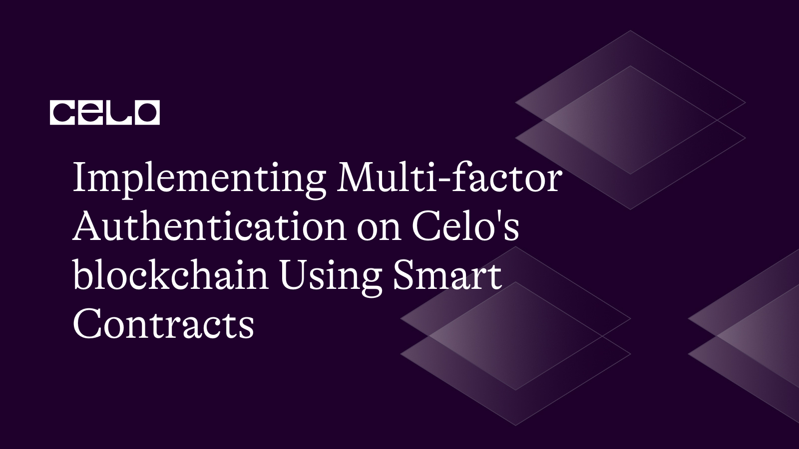
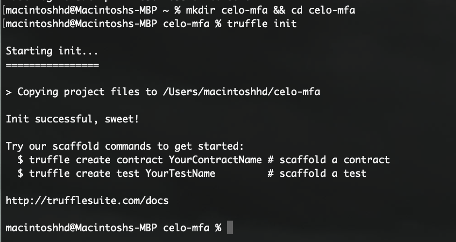
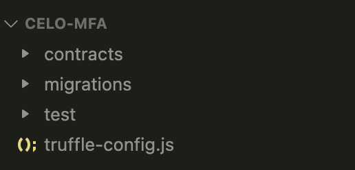
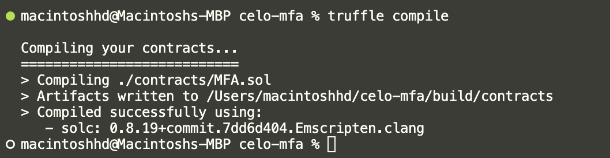
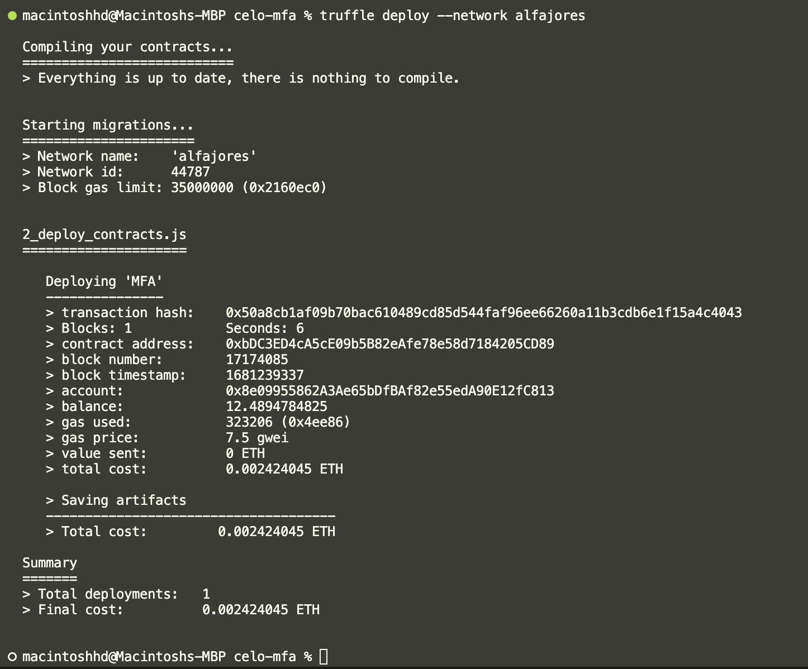

## Introduction

In this tutorial, we will implement a multi-factor authentication (MFA) on Celo's blockchain using smart contracts. Multi-factor authentication is a security mechanism that requires users to provide two or more forms of authentication before gaining access to their accounts. It helps prevent unauthorized access and protects against cyber attacks. We will use Celo's smart contract platform, which provides a secure and transparent way to implement MFA on the blockchain. By the end of this tutorial, you will have a solid understanding of how to implement MFA on Celo's blockchain using smart contracts.

## Prerequisites

Before proceeding with this tutorial, you should have a basic understanding of blockchain technology, and smart contracts, and knowledge of a programming language such as JavaScript, Solidity, or TypeScript. It is also recommended that you have some familiarity with using the command line interface

## Requirements​

For this tutorial, you would need to have the following tools installed on your computer:

- Node.js and NPM: To install, follow the instructions at [Node.js](https://nodejs.org/en/).
- Truffle: This is a popular development framework for building Ethereum-based applications. It allows you to test and deploy on celo. You can install it using npm by running `npm install -g truffle`.
- Celo SDK: This is a set of tools for building and deploying smart contracts on the Celo network. You can install it using npm by running `npm install -g @celo/celocli`.
- A text editor of your choice (e.g., Visual Studio Code).
- A Celo wallet with some testnet CELO and cUSD tokens. You can follow the `Setting Up a Celo Wallet` section [here](https://docs.celo.org/blog/tutorials/building-decentralized-applications-on-the-celo-platform-using-the-celo-sdk-and-celo-smart-contract).

## Getting started

Let's start by creating a new project directory and initializing it as a Truffle project:

```bash
mkdir celo-mfa && cd celo-mfa
truffle init
```

The command above would create a new truffle project. The output should be something of this form:



Next, let's install truffle/hdwallet-provider. This allows you to sign transactions for addresses derived from a mnemonic. You’ll use this to connect to Celo in your truffle configuration file.
Run the command below in your terminal.

```bash
npm install @truffle/hdwallet-provider --save
```

Ensure you run the command above in the root directory of your project.

Open your project in [Visual Studio code](https://code.visualstudio.com/) or your preferred IDE. It should have the following directories/files in it:



## Writing the Smart Contract

Next, we will create a new Solidity contract that will implement the MFA logic. Create a new file called `MFA.sol` in the contracts directory and add the following code:

```solidity
//SPDX-License-Identifier: MIT
pragma solidity ^0.8.0;

contract MFA {
   mapping(address => bytes32) public secrets;

   function setSecret(address account, string memory secret) public {
       bytes32 hashedSecret = keccak256(abi.encodePacked(secret));
       secrets[account] = hashedSecret;
   }

   function getSecret(address account) public view returns (bytes32) {
       return secrets[account];
   }

   function checkCode(address account, string memory code) public view returns (bool) {
       bytes32 secret = secrets[account];
       bytes32 hashedSecret = keccak256(abi.encodePacked(code));
       return hashedSecret == secret;
   }

}
```

The contract provides three functions:

`setSecret`: This function takes two parameters - the account address and the secret. It computes the hash of the secret and sets the secret for the given account address by storing the secret value in the "accounts" mapping.

`getSecret`: This function takes one parameter - the account address - and returns the secret associated with the given account address.

`checkCode`: This function takes two parameters - the account address and the code. It computes the hash of the given secret and code and compares it with the hash of the secret stored in the "accounts" mapping for the given account address. If the two hashes match, the function returns true, indicating that the code is valid for the given account address.

We will also create a migration script that deploys this contract. Create a new file called `2_deploy_contracts.js` in the migrations directory and add the following code:

```javascript
var MFA = artifacts.require("MFA");

module.exports = function (deployer) {
  deployer.deploy(MFA);
};
```

The code defines a deployment script for the MFA contract using the Truffle framework's deployer function. The script specifies that the MFA contract will be deployed, and then calls the deploy function with MFA as its argument to deploy the contract.

## Deploying the Smart Contract

To deploy the smart contract, we need to compile it first. In your terminal, run the following command in the root directory of the project:

```bash
truffle compile
```

This will compile the smart contract and generate the artifacts in the /build/contracts directory. You should get an output similar to this:



Next, let's configure Truffle to deploy the smart contract to the Celo network. In the `truffle-config.js` file, add the following code:

```javascript
const HDWalletProvider = require("@truffle/hdwallet-provider");
const mnemonic = "client great south good cement bucket rank free legend green"; // replace with your MNEMONIC

module.exports = {
  networks: {
    local: {
      host: "127.0.0.1",
      port: 7545,
      network_id: "*",
    },
    alfajores: {
      provider: function () {
        return new HDWalletProvider(
          mnemonic,
          "https://alfajores-forno.celo-testnet.org"
        );
      },
      network_id: 44787,
      gas: 20000000,
      deployTimeout: 300000,
      networkCheckTimeout: 300000,
    },
    // Configure your compilers
    compilers: {
      solc: {
        version: "0.8.19", // Fetch exact version from solc-bin (default: truffle's version)
      },
    },
  },
};
```

Replace the mnemonic in the code above with your own Celo account's mnemonic. You can find your mnemonic in your Celo account's settings.

Finally, run the following command in your terminal to deploy the smart contract to the Alfajores Celo network:

```bash
truffle deploy --network alfajores
```

This will deploy your smart contract to the Celo network and output the contract address once the deployment is complete. The terminal output should be similar to this:



Note down the contract address as it would be needed when we want to interact with the smart contract.

## Implementing MFA

Now, let's implement the MFA logic. We will create a simple command-line interface (CLI) that will allow users to set, get and verify their MFA secret.

First, let's install the `web3` and `readline-sync` packages:

```bash
npm install web3
npm install readline-sync
```

Next, we will create a new file called `mfa-cli.js` in the project directory and add the following code:

```javascript
const Web3 = require("web3");

const MFA = require("./build/contracts/MFA.json");
const readlineSync = require("readline-sync");
const web3 = new Web3("https://alfajores-forno.celo-testnet.org");

async function setSecret(contract) {
  const account = readlineSync.question("Enter the account address: ");
  const secret = readlineSync.question("Enter the secret: ");
  const privateKey =
    "880931cd6c3757ff3f57ab3f2c08e1d32868e34043a061c290d470d401b2a7b4"; // replace with the private key of your celo account
  const celoAccount = web3.eth.accounts.privateKeyToAccount(privateKey);
  web3.eth.accounts.wallet.add(celoAccount);
  await contract.methods
    .setSecret(account, secret)
    .send({
      from: celoAccount.address,
      gas: 3000000,
      gasPrice: "10000000000",
    })
    .then((result) => {
      console.log(`Secret set for address ${account}`);
    })
    .catch((error) => {
      console.error(error);
    });
}

async function getSecret(contract) {
  const account = readlineSync.question("Enter the account address: ");
  await contract.methods
    .getSecret(account)
    .call()
    .then((result) => {
      console.log(result);
      console.log(`Secret set for address ${account} is ${result}`);
    })
    .catch((error) => {
      console.error(error);
    });
}

async function checkCode(contract) {
  const account = readlineSync.question("Enter the account address: ");
  const code = readlineSync.question("Enter the code: ");
  await contract.methods
    .checkCode(account, code)
    .call()
    .then((result) => {
      console.log(result);
      console.log(
        `Code is ${result ? "valid" : "invalid"} for address ${account}`
      );
    })
    .catch((error) => {
      console.error(error);
    });
}

async function main() {
  const contractAddress = "0x31cdbaA451e1e799a88E138a0F8Fc4971E02AeB9"; // Change to you your contract address

  // Create an instance of the contract
  const contract = new web3.eth.Contract(MFA.abi, contractAddress);

  const action = readlineSync.question(
    "Enter action (setSecret/getSecret/checkCode): "
  );
  switch (action) {
    case "setSecret":
      await setSecret(contract);
      break;
    case "getSecret":
      await getSecret(contract);
      break;
    case "checkCode":
      await checkCode(contract);
      break;
    default:
      console.log("Invalid action");
  }
}

main();
```

In this code, we imported the `web3` and `readline-sync` libraries. We also create a new instance of `web3` and point it to the Celo network node hosted at [https://alfajores-forno.celo-testnet.org](https://alfajores-forno.celo-testnet.org).

The code above exposes three main functions:

`setSecret`: This function prompts the user to enter the account address and secret. The setSecret function modifies the state of the contract, which requires a transaction to be sent and validated on the blockchain. This means a transaction fee needs to be paid to execute the setSecret function. We used the web3 provider that allows you to send transactions. In addition to the provider URL, you also need to provide a private key or your Celo account that you want to use to make the payment, which will be used to sign and send the transaction. The "setSecret" function is called on the MFA contract with the given parameters. It logs a message indicating whether the secret was successfully set for the given account address.

`getSecret`: This function prompts the user to enter the account address, and then calls the "getSecret" function on the MFA contract with the given parameter. It logs the secret associated with the given account address.

`checkCode`: This function prompts the user to enter the account address and code, and then calls the "checkCode" function on the MFA contract with the given parameters. It logs a message indicating whether the code is valid for the given account address.

All three functions use the web3 library to interact with the MFA contract deployed on the Celo network. The Web3 library is initialized with a URL for a Celo network node, which is used to connect to the network and send transactions.

In the `main` function, we prompt the user for the action they want to perform and call the corresponding function. If an invalid action is entered, we display an error message.

Finally, we can run the mfa-cli.js file in the terminal using the following command:

```bash
node mfa-cli.js
```

This will prompt the user for an action to perform and then perform the corresponding action based on the user's input.

Congratulations! You have successfully created a simple MFA system using Celo and Node.js. With this basic system in place, you can now build on it to add more functionality, such as allowing users to enable and disable MFA for their accounts or setting up backup codes for users to use if they lose access to their primary MFA device.

## Conclusion​

In this tutorial, we've shown how to create a simple MFA system using the Celo blockchain and javascript. We started by creating a smart contract to store MFA secrets and validate codes; then we used the web3 library to interact with the contract from a javascript application. Finally, we built a simple command-line interface to allow users to set, retrieve, and validate MFA secrets.

This is just a starting point, and there are many ways to extend and improve this system.

We hope this tutorial has helped get you started with building MFA systems on the Celo blockchain.

## Next Steps​

There are many ways to improve the MFA contract and the CLI tool, such as adding more authentication factors and making the contract more secure. Here are some suggestions for the next steps:

- Add error handling and validation for user input to make the CLI tool more robust.

- Create a web-based interface for the MFA tool using a framework like React or Angular.

- Explore the Celo documentation and learn more about the Celo SDK, smart contracts, and other tools available for developers.

## About the Author​

Qudus Olanrewaju is a developer and technical writer who has a strong interest in blockchain technology and web3. He enjoys building web3 projects and leveraging his distinctive viewpoint to create engaging and insightful content.

## References​

- [Source Code](https://github.com/Qtech11/Implementing-Multi-factor-Authentication-on-Celo-s-Blockchain-using-Smart-Contracts)
- [Deploy on Celo using Truffle](https://docs.celo.org/developer/deploy/truffle)
- [Truffle | Overview - Truffle Suite](https://trufflesuite.com/docs/truffle/)
- [Celo Docs](https://docs.celo.org/)
- [Web3.js Documentation](https://web3js.readthedocs.io/en/v1.5.2/)
