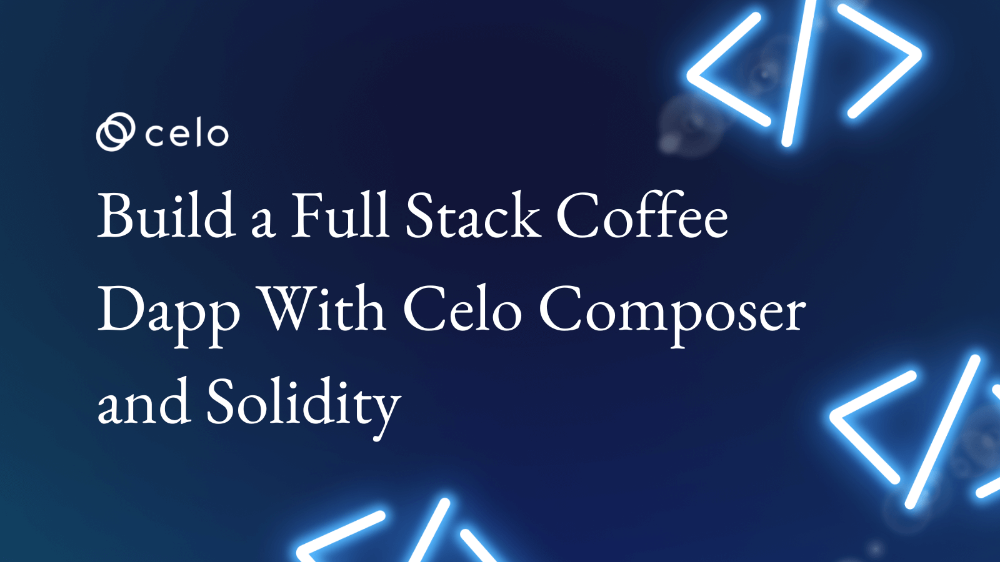

## Introduction​

This tutorial will take you through a step-by-step guide on how to create a frontend and backend (Smart Contract) dApp explaining how to create a decentralized version of Buy Me A Coffee. Buy Me A Coffee is a platform that will enable individuals to support the creative works of creators. The dApp will be built using Celo composer, react, solidity, hardhat, Pinta IPFS, and deployment to Fleek. This will enable payment to be made using CELO native token.

## Prerequisites​

To successfully follow along in this tutorial you need basic knowledge of:

- HTML, CSS, React and Next.js
- Blockchain, solidity and hardhat

## Requirements​

- [Vscode](https://code.visualstudio.com/) - But you can use any code editor of your choice
- [Hardhat](https://hardhat.org/) - used to deploy the smart contract
- [Alfajores Testnet Account](https://play.google.com/store/apps/details?id=org.celo.mobile.alfajores&hl=en&gl=US&pli=1) - required to connect to the dApp and make test transactions.
- [Node](https://nodejs.org/en/) - an open-source, cross-platform JavaScript runtime environment.

## Let’s Get Started

The goal of this tutorial is to build the web3 version of Buy Me A Coffee. Buy Me A Coffee is a dApp that allows individuals to support the creative works of creators.

In this tutorial, we will be creating a smart contract we will use to interact with the dApp on the frontend using Celo Composer.

With Celo Composer  gives us access to React, Next.js, Tailwind CSS and Hardhat options out of the box to interact with our smart contract.

The frontend comprises of the following pages;

- The landing page that displays the list of creators
- Creator’s dashboard  Page
- Support Page
- Withdraw Tip Page
- Create Account Page

## Wallet/Account Setup, Funding and Block Explorer

Before performing any transaction on the Celo Blockchain, you will need to have an account setup. For this tutorial we will be making use of our Celo Testnet account which is the Alfajores network. You can either configure [Celo on Metamask](https://docs.celo.org/blog/tutorials/3-simple-steps-to-connect-your-metamask-wallet-to-celo) or download the [Celo Wallet Extension](https://chrome.google.com/webstore/detail/celoextensionwallet/kkilomkmpmkbdnfelcpgckmpcaemjcdh?hl=en). For further testing of your dApp on mobile you can also install the [Alfajores mobile wallet](https://play.google.com/store/apps/details?id=org.celo.mobile.alfajores&hl=en&gl=US).

Once your account has been created the next thing to do is to fund the account. You can fund your account with test tokens from the [Alfajores Token Faucet Site](https://faucet.celo.org/).

***Fig 0-1** Alfajores Token Faucet


And you can use the [Celo Alfajores Block Explorer](https://explorer.celo.org/alfajores) to view the details of a transaction.

**Fig 0-2** Alfajores Block Explorer


## Celo Composer

 [Celo Composer](https://github.com/celo-org/celo-composer) a tool built by the Celo team that allows you to quickly build, deploy, and iterate on decentralized applications using Celo. It provides a number of frameworks, examples, and Celo specific functionality to help you get started with your next dApp.
To get started using Celo Composer run the below command.

`npx @celo/celo-composer create`

This will prompt you to select the framework and the template you want to use. For this tutorial we will be making use of React.

**Fig 3-1** Celo Composer Prompt


Once you have finished following the prompt you will then give your project a name and your project will be created with some boilerplate code. You will see a package folder inside the package folder you will see hardhat folder and react-app folder.  

The hardhat folder is where the contract and the deployment code lives. And the react-app handles the next.js frontend code.

**Note**

Before any else after the project has been created. Run  `npm install` or `yarn add` this will install all required dependencies that came with the boilerplate code in your newly created project. Also follow the Celo Composer guide  for more comprehensive setup details.

To deploy your contract you can simply navigate within the hardhat folder. To run the frontend code you can navigate to the react-app folder and do `npm run dev`

## File Structure

**Fig 3-2** File Structure

  


## Smart Contract Creation

The smart contract will be written using Solidity. [Solidity](https://docs.soliditylang.org/en/v0.8.18/) is an object-oriented, high-level language for implementing smart contracts. The smart contract comprises of the following functions;

- **setCreatorDetails:** This function handles creation of the creator's account.
- **getCreatorList:** This function returns the entire list of creators
- **sendTip:** This function sends a CELO tip to the creator
- **creatorWithdrawTip:** This function is called by the creator to withdraw tips received.

```js
// SPDX-License-Identifier: MIT

pragma solidity ^0.8.7;
import "hardhat/console.sol";
import "@openzeppelin/contracts/utils/Counters.sol";


contract Coffee {

    using Counters for Counters.Counter;
   Counters.Counter private _creatorIds;
   uint public creatorCounter;
  
   struct CreatorInfo {
      uint id;
      string username;
      string ipfsHash;
      address payable walletAddress;
      string userbio;
      uint donationsReceived;
      uint supporters;
   }

   event CreatorEvent (
      uint id,
      string username,
      address payable walletAddress,
      string ipfsHash,
      string userbio,
      uint donationsReceived,
      uint supporters
   );

   // Event to emit when a SupporterEvent is created.
   event SupporterEvent(
       address indexed from,
       uint256 timestamp,
       string message
   );

   // payable address can receive ether
   address payable public owner;

   // payable constructor can receive ether. Assigning the contract deployer as the owner
   constructor() payable {
       owner = payable(msg.sender);
   }

   mapping(address => bool) isAddressExist;
   mapping(string => bool) isUsernameExist;
   CreatorInfo[] creatorList;

    // function to create new creator account
   function setCreatorDetail(
       string memory _username,
       string memory _ipfsHash,
       string memory _userbio) public {

       // Validation
       require(bytes(_username).length > 0);
       require(bytes(_ipfsHash).length > 0);
       require(bytes(_userbio).length > 0);
      
       uint _donationsReceived;
       uint _supporters;
       /**
       *@dev require statement to block multiple entry
       */
       require(isAddressExist[msg.sender] == false, "Address already exist");
       require(isUsernameExist[_username] == false, "Username already exist");

        /* Increment the counter */
       // _creatorIds.increment();

       creatorList.push(CreatorInfo(_creatorIds.current(),_username, _ipfsHash, payable(msg.sender), _userbio, _donationsReceived, _supporters));
       isAddressExist[msg.sender] = true;
       isUsernameExist[_username] = true;

       // emit a Creator event
       emit CreatorEvent (
       _creatorIds.current(),
       _username,
       payable(msg.sender),
       _ipfsHash,
       _userbio,
      _donationsReceived,
      _supporters
   );
       _creatorIds.increment();
   }

     // Return the entire list of creators
   function getCreatorList() public view returns (CreatorInfo[] memory) {
       return creatorList;
   }

   /**
    * @dev send tip to a creator (sends an CELO tip)
    * @param _message a nice message from the supporter
    */
   function sendTip(string memory _message, uint _index) public payable {
       creatorList[_index].donationsReceived += msg.value;
       creatorList[_index].supporters +=1;
      
       // Must accept more than 0 ETH for a coffee.
       require(msg.value > 0, "Insufficient balance!");

       // Emit a Supporter event with details about the support.
       emit SupporterEvent(
           msg.sender,
           block.timestamp,
           _message
       );
   }

   // Creator withdraw function. This function can be called by the creator
   function creatorWithdrawTip(uint index, uint amount) public returns (address payable _creatorAddress){
       CreatorInfo storage creatorDetail  =  creatorList[index];
       uint creatorBal = creatorDetail.donationsReceived;   
       address payable creatorAddress = creatorDetail.walletAddress;
       creatorList[index].donationsReceived -= amount;
       // check to ensure the amount to be withdrawn is not more than the creator balance
       require(amount <= creatorBal, "Insufficient bal");

       // Check to ensure the caller of the function is the creator
       require(msg.sender == creatorAddress, "You are not the creator");

       // // send input ether amount to creator
       // Note that "recipient" is declared as payable
       (bool success, ) = creatorAddress.call{value: amount}("");
       require(success, "Failed to send Ether"); 
       return creatorAddress;
   }
}
```

## Deploy the Smart Contract

Your deployment code inside packages/hardhat/scripts/deploy.ts should look like this 👇

```js
// We require the Hardhat Runtime Environment explicitly here. This is optional
// but useful for running the script in a standalone fashion through `node <script>`.
//
// When running the script with `npx hardhat run <script>` you'll find the Hardhat
// Runtime Environment's members available in the global scope.
const hre = require("hardhat");

async function main() {
 // Hardhat always runs the compile task when running scripts with its command
 // line interface.
 //
 // If this script is run directly using `node` you may want to call compile
 // manually to make sure everything is compiled
 // await hre.run('compile');

 // We get the contract to deploy
 const Coffee = await hre.ethers.getContractFactory("Coffee");
 const coffee = await Coffee.deploy();

 // await coffee.deployed();

 // console.log("Coffee deployed to:", coffee.address);

 const contractAddress = await (await coffee.deployed()).address;
 console.log(`Contract was deployed to ${contractAddress}`)
}

// We recommend this pattern to be able to use async/await everywhere
// and properly handle errors.
main()
 .then(() => process.exit(0))
 .catch((error) => {
   console.error(error);
   process.exit(1);
 });
```

And your hardhat.config.tsx file should look like this 👇

**Fig 1-0** Hardhat Config File


**Note:**

Your Private key should be in your .env file at the root of the hardhat folder.

To deploy the smart contract navigate to your project directory and run this command on your terminal

`npx hardhat run scripts/deploy.ts --network alfajores`

Once this is done. You will get an output that shows you the contract address and the contract ABI will also be created. The contract address and ABI ( Application Binary Interface) will be used later on the frontend to interact with the contract.

**Fig 1-1** Contract Deployment Output


**Fig 1-2** Generated ABI or JSON (JavaScript Object Notation) file


## Setting up and Uploading Creators Photos to Pinata

[Pinata](https://www.pinata.cloud/) is a decentralized storage platform for builders and creators of all kinds in web3.

If you are new to Pinata click on the signup button to create an account.

**Fig 2-1** Pinata Sign-up


If you already have an account click on the login button to get started uploading to Pinata.

**Fig 2-2** Pinata Login


Once logged in click on the developer tab and then click on the new key button to create a new key where your creators photos will be uploaded to

**Fig 2-2** Pinata User Dashboard


Environment Variable
You will need to create a .env file at the root of your react-app directory. Also don’t forget to add your .env file to .gitignore. This will prevent exposing your PINATA JWT TOKEN and any other private key you might want to use in your app.

Your .env file should look like this 👇

NEXT_PUBLIC_PINATA_JWT = YOUR PINTA JWT TOKEN

Note:
In order for your next.js app to publicly access the values of your .env variables you will need to start the naming with NEXT_PUBLIC

## Pinata Image Upload Code

Here is the code snippet required to upload photos to Pinata

```js
import axios from "axios"
const FormData = require("form-data");
const JWT = `Bearer ${process.env.NEXT_PUBLIC_PINATA_JWT}`

export const pinFileToPinata = async (selectedFile : string | File | number | readonly string[] | undefined) => {
 const formData = new FormData();
  
   formData.append('file', selectedFile)

   const metadata = JSON.stringify({
     name: 'Coffee Dapp',
   });
   formData.append('pinataMetadata', metadata);
  
   const options = JSON.stringify({
     cidVersion: 0,
   })
   formData.append('pinataOptions', options);
   try{
     const res = await axios.post("https://api.pinata.cloud/pinning/pinFileToIPFS", formData, {
       maxBodyLength: Infinity,
       headers: {
         'Content-Type': `multipart/form-data; boundary=${formData._boundary}`,
         Authorization: JWT
       }
     });
     console.log(res.data.IpfsHash);
     return res.data.IpfsHash
   } catch (error) {
     console.log(error);
   }
};
```

## Frontend Interaction with React Using Celo Composer

All files in the component folder were auto generated by the Celo Composer. You can take a look at the Header, Footer and Layout file. For this tutorial we will make some modifications to the **Header.tsx** file.

Here is what the **Header.tsx** file looks like.

```js
import { Disclosure } from "@headlessui/react";
import { Bars3Icon, XMarkIcon } from "@heroicons/react/24/outline";
import {
   useCelo,
 } from '@celo/react-celo';
import Image from "next/image";
import { useEffect, useState } from "react";
import Link from 'next/link'
import { getCreators } from "@/interact";

interface ICreator {
 donationsReceived: string;
 id: number;
 ipfsHash: string;
 supporters: number;
 userbio: string;
 username: string;
 walletAddress: string
}

export default function Header() {
 const [data, setData] = useState<any>({})

   let [componentInitialized, setComponentInitialized] = useState(false);
   let {
       initialised,
       address,
       kit,
       connect,
       disconnect
   } = useCelo();

   useEffect(() => {
     if (initialised) {
       setComponentInitialized(true);
     }
     const creatorData = async () => {
       const creators = await getCreators(kit)
       return setData(!address ? null : creators.find((item: any) => item.walletAddress === address))
   }
   creatorData()
   }, [initialised, kit]);
   console.log("data", data)
   console.log(address)
   return (
     <Disclosure as="nav" className="bg-prosperity border-b border-black">
       {({ open }) => (
         <>
           <div className="mx-auto max-w-7xl px-2 sm:px-6 lg:px-8">
             <div className="relative flex h-16 justify-between">
               <div className="absolute inset-y-0 left-0 flex items-center sm:hidden">
                 {/* Mobile menu button */}
                 <Disclosure.Button className="inline-flex items-center justify-center rounded-md p-2 text-black focus:outline-none focus:ring-1 focus:ring-inset focus:rounded-none focus:ring-black">
                   <span className="sr-only">Open main menu</span>
                   {open ? (
                     <XMarkIcon className="block h-6 w-6" aria-hidden="true" />
                   ) : (
                     <Bars3Icon className="block h-6 w-6" aria-hidden="true" />
                   )}
                 </Disclosure.Button>
               </div>
               <div className="flex flex-1 items-center justify-center sm:items-stretch sm:justify-start">
                 <div className="flex flex-shrink-0 items-center">
                   <Image className="block h-8 w-auto lg:block" src="/logo.svg" width="24" height="24" alt="Celo Logo" />
                 </div>
                 <div className="hidden sm:ml-6 sm:flex sm:space-x-8">
                   <Link href="/"
                     className="inline-flex items-center border-b-2 border-black px-1 pt-1 text-sm font-medium text-gray-900"
                   >
                     Home
                   </Link>                   
                 </div>
                 { data === undefined || address === null ? null :
                   <div className="hidden sm:ml-6 sm:flex sm:space-x-8">
                       <Link className="inline-flex items-center border-b-2 border-black px-1 pt-1 text-sm font-medium text-gray-900"
                         href={{
                           pathname: `/Dashboard/`,
                           // query: { username: address === null ? null : data.username}// the data
                         }}
                     >
                     Dashboard                
                       </Link>
                                 
                 </div>
                 }
                
               </div>
               <div className="absolute inset-y-0 right-0 flex items-center pr-2 sm:static sm:inset-auto sm:ml-6 sm:pr-0">
                 {componentInitialized && address ? (
                   <div>
                     <button className="border-2 border-black rounded-md mr-2 p-2">{`${address.substring(0,15)}...`}</button>
                      <button
                     type="button"
                     className="inline-flex content-center place-items-center rounded-full border border-wood bg-black py-2 px-5 text-md font-medium text-snow hover:bg-forest"
                     onClick={disconnect}
                   >Disconnect</button>
                   </div>

                 
                 ) : (
                   <button
                     type="button"
                     className="inline-flex content-center place-items-center rounded-full border border-wood bg-forest py-2 px-5 text-md font-medium text-snow hover:bg-black"
                     onClick={() =>
                       connect().catch((e) => console.log((e as Error).message))
                     }
                   >Connect</button>
                 )}
               </div>
             </div>
           </div>
            <Disclosure.Panel className="sm:hidden">
             <div className="space-y-1 pt-2 pb-4">
               <Disclosure.Button
                 as="a"
                 href="#"
                 className="block border-l-4 border-black py-2 pl-3 pr-4 text-base font-medium text-black"
               >
                 Home
               </Disclosure.Button>
               {/* Add here your custom menu elements */}
             </div>
           </Disclosure.Panel>
         </>
       )}
     </Disclosure>
   )
 }
```

## Contract Interaction Code

**Interact.tsx**

```js
import { BigNumber } from "ethers";
import contractABI from "./Coffee.json"
import Router from "next/router";

const contractAddress = "0xc43072beD839F27C42a898167C56Ef271871FF07";

export function donationContract(kit: any) {
 return new kit.connection.web3.eth.Contract(contractABI.abi, contractAddress)
}
/*
   * Save the new feed to the blockchain
   */
export const createCreator = async (address: string | null | undefined, username: string,
 profilePixUrl: string, userBio: string, kit: any) => {
 try {
   const txHash = await donationContract(kit).methods.setCreatorDetail(
   username, profilePixUrl, userBio
   ).send({
     from: address,
   })
   console.log(txHash)
   Router.push("/")
 } catch (e) {
  console.log(e)
 }
}

export const sendTip = async (address: string | null | undefined, message: string, index: string | string[] | undefined, amount: BigNumber, kit: any) => {
 try {
   const txHash = await donationContract(kit).methods.sendTip(message, index).send({
   from: address,
   value: amount,
   })
   console.log(txHash)
   Router.push("/")
 } catch (e) {
   console.log(e)
 }
}

export const getCreators = async (kit: any) => {
 try {
   const creatorCount = await donationContract(kit).methods.getCreatorList().call()
   console.log(creatorCount)
   return creatorCount;
 } catch (e) {
   console.log(e)
 }
}

export const creatorWithdrawTip = async (address: string | null | undefined, index: string | string[] | undefined, amount: BigNumber, kit: any) => {
 try {
   const txHash = await donationContract(kit).methods.creatorWithdrawTip(index, amount).send({
     from: address,
 })
   console.log(txHash)
   Router.push("/Dashboard")
 } catch (e) {
   console.log(e)
 }
}
```

## Code Snippet for the different Pages of the dApp

**_app.tsx** file

```js
import "../styles/globals.css";
import React, {useState, useEffect} from "react";
import type { AppProps } from "next/app";
import { CeloProvider, Alfajores, NetworkNames} from '@celo/react-celo';
import '@celo/react-celo/lib/styles.css';

import Layout from "../components/Layout";

function App({ Component, pageProps }: AppProps) {
 const [showChild, setShowChild] = useState(false);
 useEffect(() => {
   setShowChild(true);
 }, []);

 if (!showChild) {
   return null;
 }

 if (typeof window === 'undefined') {
   return <></>;
 } else {
   return (
     <CeloProvider
       dapp={{
         name: 'celo-composer dapp',
         description: 'My awesome celo-composer description',
         url: 'https://example.com',
         icon: 'https://example.com/favicon.ico',
       }}
       // defaultNetwork={Alfajores.name}
       networks={[Alfajores]}
       network={{
         name: NetworkNames.Alfajores,
         rpcUrl: 'https://alfajores-forno.celo-testnet.org',
         graphQl: 'https://alfajores-blockscout.celo-testnet.org/graphiql',
         explorer: 'https://alfajores-blockscout.celo-testnet.org',
         chainId: 44787,
       }}
       connectModal={{
         providersOptions: { searchable: true },
       }}
     >
       <Layout>
         <Component {...pageProps} />
       </Layout>
     </CeloProvider>
   )
 }
}

export default App;
```

**CreateAccount.tsx**

This page handles creation of account by creators. And a creator can only create one account as specified in the contract.

```js
import React, { useState } from 'react'
import { pinFileToPinata } from '@/pinata/pinProfilePix'
import { useCelo } from '@celo/react-celo';
import { createCreator } from '@/interact';

export default function CreateAccount() {
 const [username, setUsername] = useState<string>("")
 const [userBio, setUserBio] = useState<string>("")
 const [profilePix, setProfilePix] = useState<string | File | number | readonly string[] | undefined>(undefined)
 const { address, kit } = useCelo()
  const handleUsername = (e: React.FormEvent<HTMLInputElement>) => {
   setUsername(e.currentTarget.value)
     console.log(e.currentTarget.value)

 }

 const handleUserBio = (e: React.FormEvent<HTMLTextAreaElement>) => {
   setUserBio(e.currentTarget.value)

 }

  const handleprofilePix = (e: React.ChangeEvent<HTMLInputElement>) => {
    if (e.target.files != null) {
     setProfilePix(e.target.files[0]);
     console.log(e.target.files[0])
   }
  }
  const createAccount = async () => {
   if (!address) {
     alert("Please connect your wallet")
     return
   }

   if (username === "") {
     alert("Username required!")
     return
   }

   if (userBio === "") {
     alert("Brief bio required")
     return
   }
   if (username.indexOf(' ') >= 0) {
     // setErrorMessage("Space not allowed here")
     alert("Space not allowed here")
     return
   }

   if (!profilePix) {
     alert("Please upload your profile photo")
     return
   }

   const pinataHash = await pinFileToPinata(profilePix)
   await createCreator(address, username, pinataHash, userBio, kit) 
 }

 return (
   <div>
     <h1 className='mb-4 text-lg font-bold'>Are you a Creator? Create Account here </h1>
     <div className='w-full'>
       <input className='w-full border-2 rounded-md mb-2 p-2' type="text" placeholder='username' value={username} onChange={handleUsername} />
     </div>
     <div>
       <textarea className='w-full border-2 rounded-md p-2' placeholder='Brief bio' value={userBio} onChange={handleUserBio} />
     </div>
     <label>Upload your profile pix</label>
     <div>
       <input className='w-full' type="file" id="formFile" onChange={handleprofilePix} />
     </div>
     <button className=' w-full bg-yellow-300 mt-4 p-4 rounded-md' onClick={createAccount}>Create Account</button>
   </div>
 )
}
```

The UI looks like this 👇

**Fig 3-3** Create Account


**Index.tsx**

This page displays the list of creators and a button to access the create account page.

```js
import React, { useState, useEffect } from 'react'
import Image from "next/image"
import Link from "next/link"
import { getCreators } from '@/interact'
import { useCelo } from '@celo/react-celo';
import Router from 'next/router';

export default function Home() {
 const [creators, setCreators] = useState<any[]>([])
 const { kit, address } = useCelo()

 useEffect(() => {
   const allCreators = async () => {
     try {
       const creatorList = await getCreators(kit)
       setCreators(creatorList)
     } catch (e) {
       console.log(e)
     }
 
   }
   allCreators()
 }, [kit])

 return (
   <div>
     <div>
       <h1>Are you a creator? click the button below to create account!</h1>
       <button className="bg-yellow-300 rounded-md p-4 mt-4" onClick={() => window.open("CreateAccount")}> Create Creator Account</button>
     </div>

       <div className="flex justify-around">
       {!address ? <div className='text-center mt-2'>Please connect your wallet to view listed creators </div>
         : creators && creators.map((item, index) => <div key={index} className="w-3/4 mt-2 mx-2 border-2 border-yellow-300 p-4 rounded-md">
       <Image src={`https://ipfs.io/ipfs/${item.ipfsHash}`} alt="profile-pix" width={300} height={200} />
       <p>{item.username}</p>
       <p>{item.userbio}</p>
       <label>Donation received:</label>
       <span className="font-bold">{`${item.donationsReceived/1e18 } CELO`}</span>
         <p className="">{`Supporters: ${item.supporters}`}</p>
         <Link
           href={{
             pathname: `/Support/`,
             query: { id: item.id, walletAddress: item.walletAddress }// the data
           }}
         >
           <button className="w-full bg-yellow-300 rounded-md p-2 my-2">{` Support ${item.walletAddress.substring(0,7)}...`}</button>
         </Link>
       </div>     
     )}      
     </div>    
   </div>
 )
}
```

The UI looks like this 👇

**Fig 3-4** Creators List Page


**Support.tsx**

This page handles the support form that individuals can use to send in their support to creators.

```js
import React, { useState } from 'react'
import { sendTip } from '@/interact'
import { useCelo } from '@celo/react-celo'
import { ethers } from 'ethers'
import { useRouter } from 'next/router'

export default function Support() {
 const [amount, setAmount] = useState<string>("")
 const [comment, setComment] = useState<string>("")
 const { address, kit } = useCelo()
 const router = useRouter()

 const {
   query: { id, walletAddress}
 } = router

 const props = {
   id,
   walletAddress
 }

 const handleAmount = (e: React.FormEvent<HTMLInputElement>) => {
   setAmount(e.currentTarget.value)
     console.log(e.currentTarget.value)
 }

 const handleComment = (e: React.FormEvent<HTMLTextAreaElement>) => {
   setComment(e.currentTarget.value)
         console.log(e.currentTarget.value)
 }
  const sendSupport = async () => {
   if (amount === "") {
     alert("amount required!")
     return
   }
   await sendTip(address, comment, props.id, ethers.utils.parseUnits(amount, "ether"), kit)   
 }

 return (
   <div>
     <h1 className='mb-4 text-lg font-bold'>Support Creator </h1>
     <div className='w-full'>
       <input className='w-full border-2 rounded-md mb-2 p-2' type="number" placeholder='amount' value={amount} onChange={handleAmount} />
     </div>
     <div>
       <textarea className='w-full border-2 rounded-md p-2' placeholder='Say something nice' value={comment} onChange={handleComment} />
     </div>
     <div>
       <input className='w-full border-2 rounded-md p-2' type="text" placeholder='wallet Address' disabled value={props.walletAddress} />
     </div>
     <button className=' w-full bg-yellow-300 mt-4 p-4 rounded-md' onClick={sendSupport}>Send Support</button>
   </div>
)}
```

The UI looks like this 👇

**Fig 3-5** Support Page


**Dashboard.tsx**

This page handles information about the creator. And it's only made visible when a connected user has a creator account.

```js
import React, {useState, useEffect} from 'react'
import Image from 'next/image'
import { getCreators } from '@/interact'
import { useCelo } from '@celo/react-celo'
import Link from 'next/link'

export default function Dashboard() {
  const [data, setData] = useState<any>({})
  const { address, kit } = useCelo()
 useEffect(() => {
   const creatorData = async () => {
     const creators = await getCreators(kit)
     if (!address) {
       return null
     } else {
       return setData(creators.find((item: any) => item.walletAddress === address))
     }
   }
   creatorData()
 }, [address, kit])
 console.log("creator id", data.id)
 return (
   <div>
     { !address ?  <div>Please connect your wallet</div> :
       <div className="w-full mt-2 mx-2 border-2 border-yellow-300 p-4 rounded-md">
       <Image src={`https://ipfs.io/ipfs/${data.ipfsHash}`}  alt="profile-pix" width={200} height={200} />
       <p>{data.username}</p>
       <p>{data.userBio}</p>
       <label> Donation received: </label>
       <span className="font-bold">{data.donationsReceived === undefined ? null : `${data.donationsReceived/1e18} CUSD`}</span>
       <p className="mb-4">{`Supporters: ${data.supporters}`}</p>
         {/* <a className='className="w-full bg-yellow-300 rounded-md p-2 my-4"' href="Withdraw">Withdraw Tip</a> */}
       <Link
           href={{
             pathname: `/Withdraw`,
             query: { id: data.id, walletAddress: data.walletAddress }// the data
           }}
         >
           <button className="w-full bg-yellow-300 rounded-md p-2 my-2">{`Withdraw Tip`}</button>
         </Link> 
     </div>
     }
   </div>
 )
}
```

The UI looks like this 👇

**Fig 3-6** Dashboard Page


**Withdraw.tsx**

This page handles withdrawal by the creator.

```js
import React, { useState } from 'react'
import { creatorWithdrawTip } from '@/interact'
import { useCelo } from '@celo/react-celo'
import { ethers } from 'ethers'
import {useRouter} from 'next/router'

export default function Withdraw() {
  const [amount, setAmount] = useState<string>("")
  const { address, kit } = useCelo()
   const router = useRouter()
   const {
     query: { id, walletAddress}
   } = router

   const props = {
     id,
     walletAddress
   }
 const handleAmount = (e: React.FormEvent<HTMLInputElement>) => {
   setAmount(e.currentTarget.value)
     console.log(e.currentTarget.value)

 }
  console.log("id is", props.id)
 const withdrawTip = async () => {
   if (amount === "") {
     alert("amount required!")
     return
   }
   await creatorWithdrawTip(address, props.id, ethers.utils.parseUnits(amount, "ether"), kit) 
 }

 return (
   <div>
     <h1 className='mb-4 text-lg font-bold'>Withdraw Tip</h1>
     <div className='w-full'>
       <input className='w-full border-2 rounded-md mb-2 p-2' type="number" placeholder='amount' value={amount} onChange={handleAmount} />
     </div>
     <div>
       <input className='w-full border-2 rounded-md p-2' type="text" placeholder='wallet Address' disabled value={props.walletAddress} />
     </div>
     <button className=' w-full bg-yellow-300 mt-4 p-4 rounded-md' onClick={withdrawTip}>Withdraw Tip</button>
   </div>
)}
```

The UI looks like this 👇

**Fig 3-7** Withdraw Page


## Deployment on Fleek 🌠

Fleek is an IPFS decentralized deployment platform. To get started using Fleek you first need to create an account. You can create an account with your github account. This will connect your github account to fleek for easy access to your repositories and hence faster deployment.

Once logged in, click on the add new site button. This will load the projects on your github account and you can select the project you want to add using the search field.

In my own case I have already added this project so it’s not going to show on the list.

**Fig 4-1** Fleek Landing Page


**Fig 4-2** Sign in with Git Provider


**Fig 4-3** Add New Site


You might run into some few errors when uploading a next.js app to Fleek. So it will be useful to follow this next.js deployment [guide](https://blog.fleek.co/posts/fleek-nextJS).

**Note**
Don’t forget to add your Pinata JWT TOKEN and any other environment variable used on the react-app to your fleek environment variable deployment setup.

On your fleek dashboard click on the settings tab -> Build and Deploy -> Advanced build Settings. You will see Environment Variables. You can click on the edit settings button to add variables.

**Fig 4-4** Add Environment Variables


You can also change the generated domain url under Domain Management to your own custom domain. If you don’t have a custom domain you can change the generated site url to something more readable as long as the name is available. To do this click on Site Details  then click on the Change Site Button. That’s all you need to do!

## Conclusion​

Congratulations 🎉 on finishing this tutorial! Thank you for taking the time to complete it. In this tutorial, you have learned how to create a full stack dApp using Celo Composer and Solidity.

To have access to the full codebase, here is the link to the project repo on [github](https://github.com/gconnect/Sage-buymeacoffee).

## About the Author​

Glory Agatevure is a blockchain engineer, technical writer, and co-founder of Africinnovate. You can connect with me on [Linkedin](https://www.linkedin.com/in/glory-agatevure-47a222ab/), [Twitter](https://twitter.com/agatevureglory) and [Github](https://github.com/gconnect/).

## References​

- [celo-composer](https://github.com/celo-org/celo-composer)
- [fleek-nextJS](https://blog.fleek.co/posts/fleek-nextJS)
