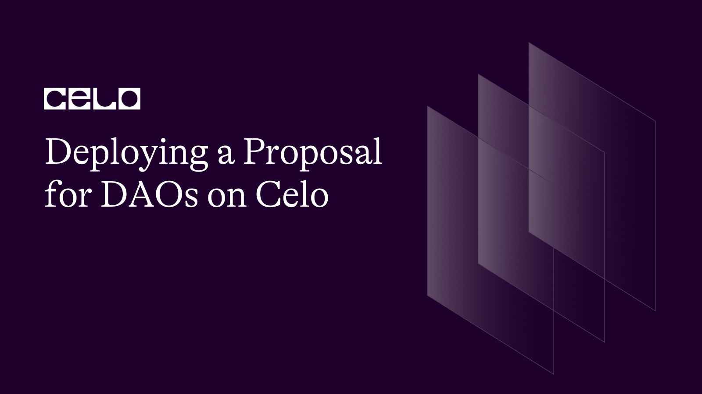
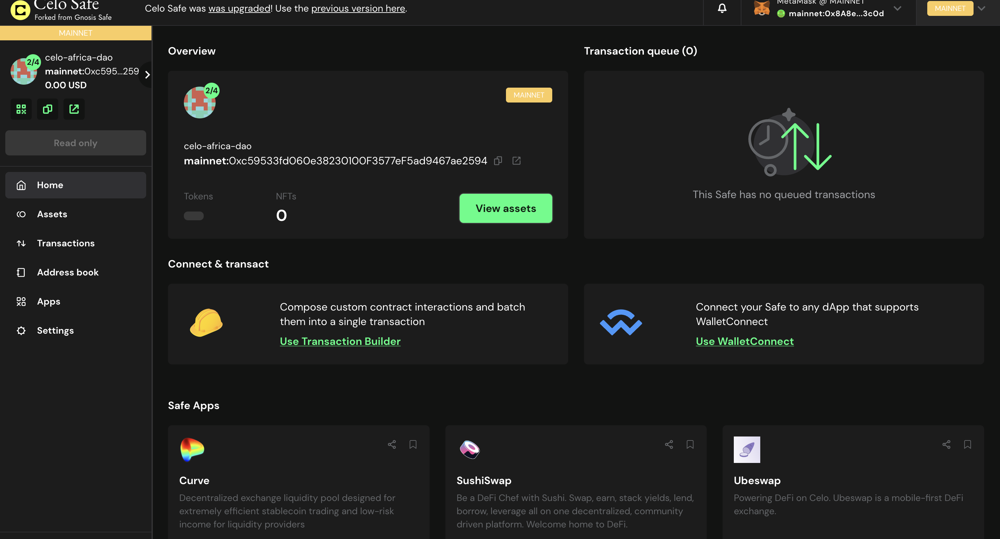
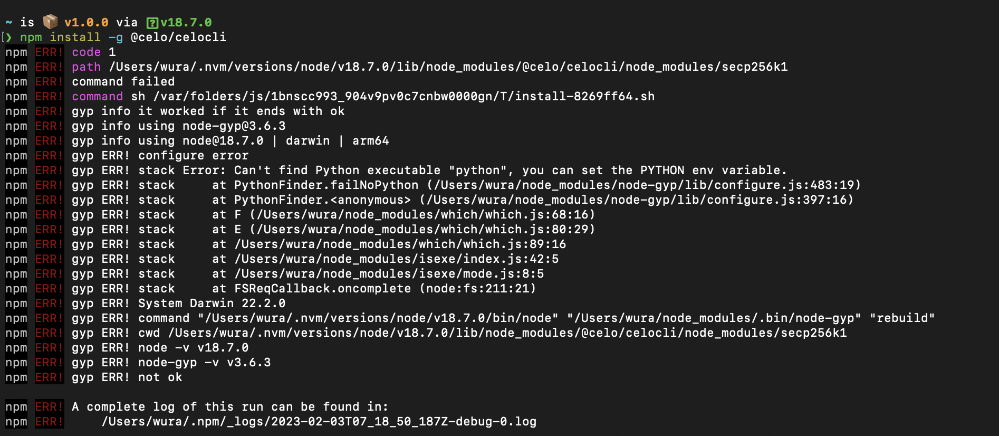
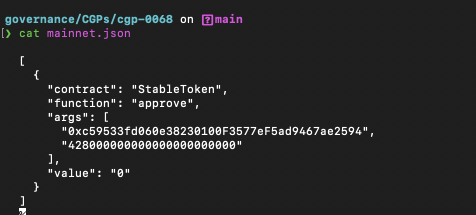
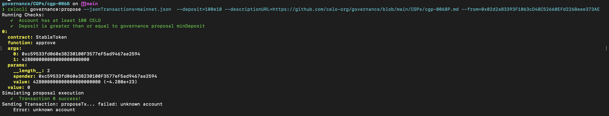
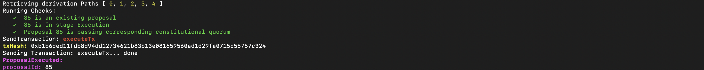

## Introduction

This comprehensive tutorial will walk you through the process of deploying a proposal for DAOs on the Celo Mainnet. By the end of this tutorial, you will be able to interact with the celocli command, create a multisig wallet, connect your ledger to your celocli, and much more.

## Prerequisites

To start building, you’ll need a basic understanding of Git and Github.

Your computer has Node.js installed. If not download from [here](https://nodejs.org/en/download/)

Writing in Markdown

## Requirements

For this tutorial, we would need the following :

- A written proposal (preferably merged) to the celo governance repository on Github. You can use this proposal as a refrencence or read more on how to draft a proposal your proposal and here
- A ledger Hardware Wallet, i personally recommend the ledger nano x and here is a tutorial on how to set it up
- A multisig wallet preferably on Celo Safe

## Getting Started

We need to create a multisig wallet before we can start with anything, and this is because for a governance proposal, we need four multisig holders and preferably two signers to approve any transaction on the governance. To begin this process:

- Head over to [Celo Safe](https://old-safe.celo.org/#/welcome)

- Connect your wallet and click on create a new safe

- Add a name for your wallet and add all the address of the other signers and pick at least two signers

- Once its successful you should see your dashboard, similar image below



## Create proposal (json)

In your proposal file that is either merged or waiting to be merged, create a folder with your proposal number inside the [CGPs](https://github.com/Khadeeejah/governance/tree/main/CGPs) folder and create a file called `mainnet.json` Inside the file, paste the following :

```json
[
  {
    "contract": "GoldToken", (or StableToken)
    "function": "approve",
    "args": [
      "MULTISIG-ADDRESS",
      "AMOUNT + 18 zeros at the end"
    ],
    "value": "0"
  }
]
```

Save this file and add it to your repository on Github.

## Submit the proposal on-chain

Once your Pr is merged, head over to your terminal and run the celocli command. We will be following the instructions in this [docs](https://docs.celo.org/cli)

### Step 1

In your terminal run

```bash
 npm install -g @celo/celocli
```

You might get this error below,



and here is how i solved it. I ran

```bash
nvm install 12 && nvm use 12
then
npm install -g @celo/celocli
```

### Step 2

We need to target the json file, which is what is going to submit the proposal. In your terminal,

```bash
cd governance
cd CGPs
cd cgp-(your proposal number)
cat mainnet.json
```

you should see this output below, if executed successfully



then you run this command

```bash
celocli governance:propose --deposit=10e18 --descriptionURL=github file of the proposal --from=address of your ledger wallet  --useLedger --ledgerAddresses=5
```

NOTE The ledger address must have at least 100 CELO in it. Connect your ledger to your computer before running this and switch to your celo. Run the command and wait for the prompts on your ledger.
for example,

```bash
celocli governance:propose --jsonTransactions=mainnet.json  --deposit=100e18 --descriptionURL=https://github.com/celo-org/governance/blob/main/CGPs/cgp-0068P.md --from=0x48853EB3D2d69232BF28Ab3cFE535d0351ed62c6 --useLedger --ledgerAddresses=5
```

Approve the transaction and your output should look like this


Congratulations !!! You have now successfully deployed a DAO Proposal on Celo Mainnet. You can head over to [Celo stake](https://celo.stake.id/#/proposal/85) to view your proposal, which is ready for voting. You can use the [Celo Africa Dao Proposal](https://celo.stake.id/#/proposal/85) for your reference.

## Executing Proposal

After a series of votes, the proposal has finally passed, You will also need to execute your proposal, which is very important.

Connect your ledger to your computer and run this command in your terminal:

```bash
celocli governance:execute --proposalID <number>  --from=<ledger address> --useLedger --ledgerAddresses=5
```

Your output should look like this



## Conclusion

Congratulations! You have successfully deployed and executed a proposal on the Celo mainnet; if you have any blockers while following this tutorial, do not hesitate to reach out to me.

Here is a quick recap of everything we covered.

-✅: Create a multisig wallet.
-✅: Create proposal (json).
-✅: Submit the proposal on-chain.
-✅: Executing Proposal.

## About the Author
Khadijah is a software engineer and a Devrel. You can reach out to me via
[Twitter](https://twitter.com/_khadeeejah) and [Github](https://github.com/Khadeeejah)
