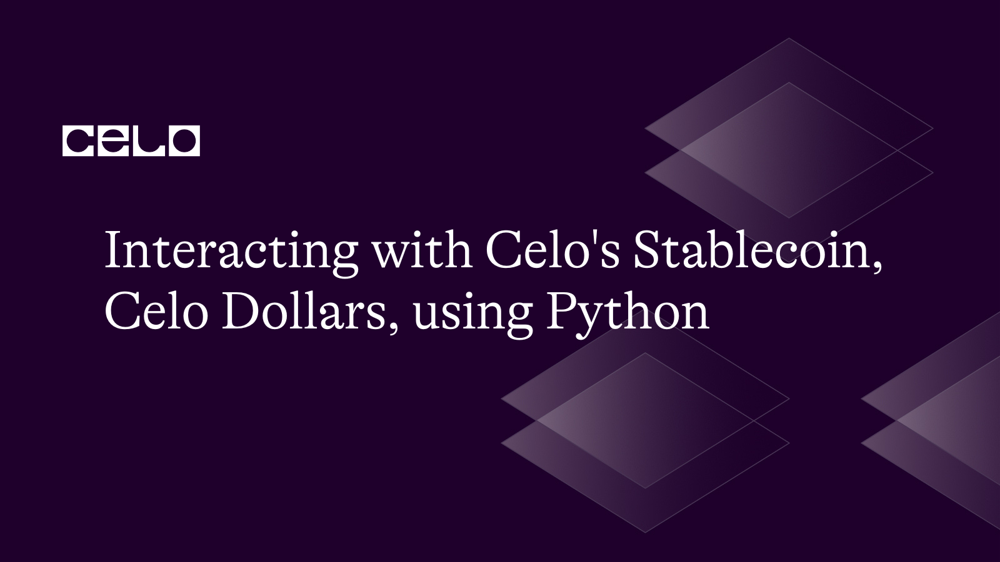

## Introduction

With Celo, anyone with a mobile phone would have access to financial tools. It is a mobile-first, open-source blockchain platform. One of Celo's distinguishing qualities is its stablecoin, Celo Dollars (cUSD). A digital asset called cUSD is linked to the US Dollar, ensuring price stability and lowering the likelihood of volatility. In this tutorial, we'll demonstrate how to use Python and the Web3.py framework to communicate with the Celo blockchain and Celo Dollars.

## Prerequisites

In order to fully understand this tutorial, you should have:

- Fundamental knowledge of blockchain technology and smart contracts.
- knowledge in Python programming.
- Although not necessary, understanding the Celo environment is helpful.

## Requirements

You'll need the following before you can begin this tutorial:

- Python 3.6 and above.
- Installed library for [Web3.py.](https://web3py.readthedocs.io/en/stable/#)
- A Testnet wallet for the cryptocurrency Celo (you can get them from the [Celo Faucet](https://faucet.celo.org/alfajores)).

### Step **1: Setting up the environment**

Setting up a development environment is necessary before we can start interacting with the Celo tokens using web3.py in Python.

On your terminal, use the following commands to create a new folder for your project:

```bash
mkdir celo-interaction-python
cd celo-interaction-python
```

In your new directory, create a Python virtual environment and activate it with the following commands:

```bash
python3 -m venv env
source env/bin/activate
```

Next, Install the following libraries using pip, the Python package manager:

```bash
pip install web3 python-dotenv
```

Next, let’s import the installed libraries, and connect to the Celo Testnet network. Create a file called “main.py” in the root directory of your project and paste the following code:

main.py

```python
import os
from web3 import Web3
from dotenv import load_dotenv

load_dotenv()

# Celo network parameters
CELO_ALFAJORES_RPC_URL = "https://alfajores-forno.celo-testnet.org"

# Connect to the Celo Alfajores testnet
w3 = Web3(Web3.HTTPProvider(CELO_ALFAJORES_RPC_URL))

# Load private key and initialize account
private_key = os.environ.get("CELO_DEPLOYER_PRIVATE_KEY")
deployer = w3.eth.account.from_key(private_key)

ERC20_ABI = [
    {
        "constant": True,
        "inputs": [],
        "name": "totalSupply",
        "outputs": [{"name": "", "type": "uint256"}],
        "payable": False,
        "stateMutability": "view",
        "type": "function"
    },
    {
        "constant": True,
        "inputs": [{"name": "owner", "type": "address"}],
        "name": "balanceOf",
        "outputs": [{"name": "", "type": "uint256"}],
        "payable": False,
        "stateMutability": "view",
        "type": "function"
    },
    {
        "constant": False,
        "inputs": [
            {"name": "to", "type": "address"},
            {"name": "value", "type": "uint256"}
        ],
        "name": "transfer",
        "outputs": [{"name": "", "type": "bool"}],
        "payable": False,
        "stateMutability": "nonpayable",
        "type": "function"
    },
    {
        "constant": True,
        "inputs": [
            {"name": "owner", "type": "address"},
            {"name": "spender", "type": "address"}
        ],
        "name": "allowance",
        "outputs": [{"name": "", "type": "uint256"}],
        "payable": False,
        "stateMutability": "view",
        "type": "function"
    },
    {
        "constant": False,
        "inputs": [
            {"name": "spender", "type": "address"},
            {"name": "value", "type": "uint256"}
        ],
        "name": "approve",
        "outputs": [{"name": "", "type": "bool"}],
        "payable": False,
        "stateMutability": "nonpayable",
        "type": "function"
    },
    {
        "constant": False,
        "inputs": [
            {"name": "from", "type": "address"},
            {"name": "to", "type": "address"},
            {"name": "value", "type": "uint256"}
        ],
        "name": "transferFrom",
        "outputs": [{"name": "", "type": "bool"}],
        "payable": False,
        "stateMutability": "nonpayable",
        "type": "function"
    }
]
```

Your private key should be substituted for `CELO_DEPLOYER_PRIVATE_KEY` in the `.env` file and the deployer object which contains the contract address of a user is gotten from the private key. The `ERC20_ABI` is the ABI of the Celo network and can be used to interact with it.

### Step 2: Checking the cUSD balance

You'll need the cUSD token contract address to check your balance in cUSD. It's located [here](https://faucet.celo.org/alfajores). To achieve the balance, we shall develop a function.

```python
# Get cUSD balance
def get_cusd_balance(account_address, contract_address):
    # Get cUSD contract
    cusd_contract = w3.eth.contract(address=contract_address, abi=ERC20_ABI)

    # Get cUSD balance
    balance = cusd_contract.functions.balanceOf(account_address).call()
    balance = w3.from_wei(balance, "ether")

    return balance
```

The balance of a Celo Dollar (cUSD) token for a particular account can be obtained using this function. The account address and the cUSD contract address are the two inputs it accepts.

By providing the contract address and its ABI to the `w3.eth.contract()` function, it first obtains the cUSD contract. Following that, it uses the contract's `balanceOf()` function to retrieve the balance while giving the account address.

The sum is then returned after being divided by 1018 and converted from wei (the smallest unit of ether) to cUSD.

### Step **3: Sending cUSD**

Let's now write a function to transfer cUSD between accounts:

```python
# Send cUSD
def send_cusd(account, to, amount, contract_address):
    # Get cUSD contract
    cusd_contract = w3.eth.contract(address=contract_address, abi=ERC20_ABI)

    # Estimate gas required
    gas_estimate = cusd_contract.functions.transfer(to, w3.to_wei(amount, "ether")).estimate_gas(
        {"from": account.address}
    )

    # Create a transaction
    transaction = cusd_contract.functions.transfer(to, w3.to_wei(amount, "ether")).build_transaction(
        {
            "from": account.address,
            "gas": gas_estimate,
            "gasPrice": w3.eth.gas_price,
            "nonce": w3.eth.get_transaction_count(account.address),
        }
    )

    # Sign and send the transaction
    signed_transaction = account.sign_transaction(transaction)
    transaction_hash = w3.eth.send_raw_transaction(
        signed_transaction.rawTransaction)

    return transaction_hash
```

To send cUSD tokens from one account to another, use this function. It requires four arguments: the cUSD contract address, the amount to transfer, the account sending the tokens, and the account receiving the tokens.

By providing the contract address and its ABI to the `w3.eth.contract()` function, it first obtains the cUSD contract. It then uses the `estimate_gas()` function on the `transfer()` method of the contract to calculate the amount of gas needed for the transaction while passing the to address and the amount of cUSD to send in wei.

The `build_transaction()` function on the contract's `transfer()` method is then used to generate a transaction object, passing the address, the amount of cUSD to send in wei, and other transaction parameters like the gas limit, gas price, and nonce.

The method uses the `sign_transaction()` function on the account object to sign the transaction after it has been formed. The function then uses the `send_raw_transaction()` function on the `w3.eth` object to send the signed transaction to the Celo network. It then gives back the transaction hash.

Essentially, this feature makes it possible to move cUSD tokens easily across accounts on the Celo network.

### Step 4**: Test the Functions**

Next, let’s write a script that would call the functions that get a user cUSD balance and send cUSD from one account to another.

```python
# Get CUSD balance
CUSD_ALFAJORES_CONTRACT_ADDRESS = "0x874069Fa1Eb16D44d622F2e0Ca25eeA172369bC1"
print(
    f"cUSD Balance: {get_cusd_balance(deployer.address, CUSD_ALFAJORES_CONTRACT_ADDRESS)} cUSD")

# Send CUSD
recipient_address = "0xcdd1151b2bC256103FA2565475e686346CeFd813"
amount_to_send = 1  # cUSD
transaction_hash = send_cusd(
    deployer, recipient_address, amount_to_send, CUSD_ALFAJORES_CONTRACT_ADDRESS)
print(f"Sent {amount_to_send} cUSD to {recipient_address}. Transaction hash: {transaction_hash.hex()}")
```

This code serves as an illustration of how to communicate with the Celo network using the `get_cusd_balance()` and `send_cusd()` functions.

The `get_cusd_balance()` function is used to print the deployer account's cUSD balance before defining the cUSD contract address. The deployer account address and the cUSD contract address are passed to the function, which prints the outcome.

The `send_cusd()` method is then used to transfer the requested amount of cUSD from the deployer account to the recipient account. Next, the code specifies the recipient address and the amount of cUSD to send. It provides the `send_cusd()` method with the deployer account, receiver address, amount to send, and cUSD contract address.

The code ends by printing a message along with the transaction hash confirming the successful transfer of cUSD.

Ultimately, this code provides a basis for more intricate smart contract interactions in Python by showing how to use the two functions to communicate with cUSD tokens on the Celo network.

Finally, run the following code on your terminal to see how well the functions interacts with the Celo network:

```bash
python main.py
```


## Conclusion

In this tutorial, we've demonstrated how to use Python and the Web3.py module to communicate with the Celo blockchain and Celo Dollars (cUSD). Connecting to the Celo network, examining the cUSD balance, and sending cUSD between accounts have all been covered.

## Next Steps

You can research the following subjects as a foundation for this tutorial:

- Acquire more information regarding the [Celo platform](https://celo.org/).
- To connect with additional smart contracts, delve deeper into the [Web3.py documentation](https://web3py.readthedocs.io/en/stable/).
- Examine and interact with the other stablecoins of Celo.

## About the Author

I am a React frontend developer with over 3 years of experience building for the web, a web3 developer, and a technical writer. Visit my [GitHub profile](https://github.com/J0shcodes) to see some of the projects I have worked on and currently working on.

## References

- [Celo Platform](https://celo.org/)
- [Web3.py Library](https://web3py.readthedocs.io/en/stable/)
- [Celo Faucet](https://celo.org/developers/faucet)
- [Github repo](https://github.com/Divine572/celo-interaction-python)
