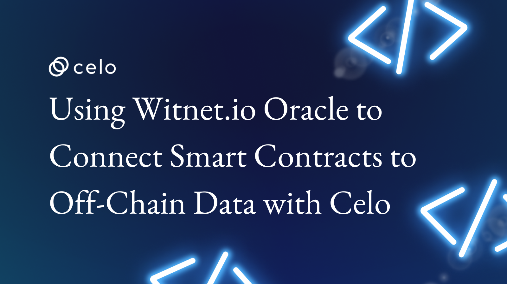

## 🌱 Introduction

Welcome to our tutorial on Using Witnet.io Oracle to Connect Smart Contracts to Off-Chain Data with Celo! In this tutorial, we'll explore how Witnet.io can be used to connect smart contracts to off-chain data, enabling real-time and accurate data to be utilized within Celo blockchain applications. We'll guide you through the process of deploying a smart contract that can receive data from Oracle, and we'll demonstrate how this can be used to create highly customizable and visually appealing NFTs using SVG. NFTs have become increasingly popular for their use in art, collectibles, and proving ownership or authenticity.

Whether you're a developer interested in using Witnet.io Oracle to connect smart contracts to off-chain data on the Celo platform, or simply looking to learn more about dynamic NFT creation, this tutorial will provide valuable insights and guidance. Follow our step-by-step guide and you'll have all the tools you need to deploy your own dynamic NFT smart contract that leverages the power of Witnet.io and Celo.

Celo is a decentralized platform that enables fast, secure, and scalable transactions on a global scale. It is built on top of the Ethereum blockchain and is designed to be easily accessible to developers and users alike.

Let's get started!

## 🗈 Prerequisites

- A computer with an internet connection. You will need a computer with a stable internet connection to follow along with this guide.

- Basic knowledge of programming. While we will provide step-by-step instructions, it will be helpful to have some basic knowledge of programming languages such as JavaScript and Solidity.

- Node.js and npm installed. You will need to have Node.js and npm (the package manager for Node.js) installed on your computer. You can check if you have them installed by running the following commands in your terminal:

```bash
node -v
npm -v
```

- A code editor. You will need a code editor to write and edit your code. Some popular options include Visual Studio Code and Atom.
- A Metamask account. You will need a Metamask account to interact with the Celo blockchain from your web browser. If you don't already have one, you can create one by installing the Metamask extension for Chrome or Firefox.

## ⚠️ Requirements

- Truffle: a development environment, testing framework, and asset pipeline for Ethereum
- Node.js: a JavaScript runtime that allows you to run JavaScript on the command line
- Yarn: a package manager for JavaScript
- next: Next.js is a framework for building server-rendered or statically-exported React applications.
- CeloCli - The celocli lets you interact with the Celo Protocol smart contracts.

## What is Witnet.io?

Witnet.io is a decentralized oracle network that enables smart contracts on various blockchain platforms to securely and accurately receive off-chain data. By using a decentralized network of nodes to source, validate, and deliver external data to smart contracts, Witnet.io helps to mitigate the risk of manipulation or censorship that can occur with centralized data providers. The platform utilizes its own native token, WIT, as an incentive for node operators to provide accurate and timely data, and for smart contract developers to request and receive data. Witnet.io has gained attention for its ability to enable blockchain applications to interact with real-world data in a secure, trustless, and decentralized manner.

## What are Dynamic NFTs?

Dynamic NFTs, also known as Non-Fungible Tokens, are unique digital assets that are stored on a blockchain. Unlike traditional NFTs, which are static and unchanging, dynamic NFTs can be updated and modified after they have been created. These updates can include changes to the NFT's visual appearance or underlying data, and can be triggered by events on the blockchain or by interactions with the NFT's smart contract. Dynamic NFTs can be used for a variety of purposes, such as digital art, collectibles, or even as proof of ownership or authenticity for physical assets. They offer more flexibility and functionality than traditional NFTs and open up new possibilities for creators and users alike.

**_ Let's start building the future together! _**

:::tip
To learn more about setting up the environment to create NFTs using Witnet.io and Celo, check out the **[step-by-step guide to deploying your first full-stack dApp on Celo](https://docs.celo.org/blog/tutorials/step-by-step-guide-to-deploying-your-first-full-stack-dapp-on-celo#steps-to-set-up-the-truffle-project-and-its-configs)**, which provides detailed instructions on getting started.
:::

## Smart Contract to Create Dynamic Price Feed NFT using Witnet.io Off-chain data on Celo Blockchain

```solidity
// SPDX-License-Identifier: MIT
pragma solidity ^0.8.9;

import "witnet-solidity-bridge/contracts/interfaces/IWitnetPriceRouter.sol";
import "@openzeppelin/contracts/token/ERC721/ERC721.sol";
import "@openzeppelin/contracts/token/ERC721/extensions/ERC721URIStorage.sol";
import "@openzeppelin/contracts/access/Ownable.sol";
import "@openzeppelin/contracts/utils/Counters.sol";

enum Currency {
    CELOUSD,
    BTCUSD,
    CELOEUR,
    ETHUSD,
    NCTCELO,
    NCTUSD
}

contract NFT2 is ERC721, ERC721URIStorage, Ownable {
    using Counters for Counters.Counter;

    IWitnetPriceRouter public immutable witnetPriceRouter;
    Counters.Counter private _tokenIdCounter;

    constructor() ERC721("DYNAMICNFT", "CELO") {
        witnetPriceRouter = IWitnetPriceRouter(
            0x6f8A7E2bBc1eDb8782145cD1089251f6e2C738AE
        );
    }

    function getCeloUsdPrice() internal view returns (int256 _lastPrice) {
        (_lastPrice, , ) = witnetPriceRouter.valueFor(bytes4(0x9ed884be));
    }

    function getBTCUsdPrice() internal view returns (int256 _lastPrice) {
        (_lastPrice, , ) = witnetPriceRouter.valueFor(bytes4(0x24beead4));
    }

    function getCELOEurPrice() internal view returns (int256 _lastPrice) {
        (_lastPrice, , ) = witnetPriceRouter.valueFor(bytes4(0x21a79821));
    }

    function getETHUsdPrice() internal view returns (int256 _lastPrice) {
        (_lastPrice, , ) = witnetPriceRouter.valueFor(bytes4(0x3d15f701));
    }

    function getNCTCeloPrice() internal view returns (int256 _lastPrice) {
        (_lastPrice, , ) = witnetPriceRouter.valueFor(bytes4(0x4d50c3a6));
    }

    function getNCTUsdPrice() internal view returns (int256 _lastPrice) {
        (_lastPrice, , ) = witnetPriceRouter.valueFor(bytes4(0x31077f15));
    }

    function safeMint() public {
        uint256 tokenId = _tokenIdCounter.current();
        uint8 selectedCurrency = uint8(
            uint256(keccak256(abi.encodePacked(block.timestamp))) % 6
        );
        string memory selectedCurrencyString;

        // Convert selected currency to string
        if (selectedCurrency == 0) {
            selectedCurrencyString = "CELOUSD";
        } else if (selectedCurrency == 1) {
            selectedCurrencyString = "BTCUSD";
        } else if (selectedCurrency == 2) {
            selectedCurrencyString = "CELOEUR";
        } else if (selectedCurrency == 3) {
            selectedCurrencyString = "ETHUSD";
        } else if (selectedCurrency == 4) {
            selectedCurrencyString = "NCTCELO";
        } else if (selectedCurrency == 5) {
            selectedCurrencyString = "NCTUSD";
        } else {
            selectedCurrencyString = "CELOUSD";
        }
        _tokenIdCounter.increment();
        _safeMint(msg.sender, tokenId);
        _setTokenURI(tokenId, selectedCurrencyString);
    }

    // The following functions are overrides required by Solidity.

    function _burn(uint256 tokenId)
        internal
        override(ERC721, ERC721URIStorage)
    {
        super._burn(tokenId);
    }

    function getPrice(uint256 _tokenId)
        public
        view
        returns (int256 _lastPrice)
    {
        // Retrieve the selected currency from the token URI
        string memory selectedCurrency = super.tokenURI(_tokenId);
        // Use a switch statement to return data based on the selected currency
        if (
            keccak256(abi.encodePacked(selectedCurrency)) ==
            keccak256(abi.encodePacked("CELOUSD"))
        ) {
            return getCeloUsdPrice();
        } else if (
            keccak256(abi.encodePacked(selectedCurrency)) ==
            keccak256(abi.encodePacked("BTCUSD"))
        ) {
            return getBTCUsdPrice();
        } else if (
            keccak256(abi.encodePacked(selectedCurrency)) ==
            keccak256(abi.encodePacked("CELOEUR"))
        ) {
            return getCELOEurPrice();
        } else if (
            keccak256(abi.encodePacked(selectedCurrency)) ==
            keccak256(abi.encodePacked("ETHUSD"))
        ) {
            return getETHUsdPrice();
        } else if (
            keccak256(abi.encodePacked(selectedCurrency)) ==
            keccak256(abi.encodePacked("NCTCELO"))
        ) {
            return getNCTCeloPrice();
        } else if (
            keccak256(abi.encodePacked(selectedCurrency)) ==
            keccak256(abi.encodePacked("NCTUSD"))
        ) {
            return getNCTUsdPrice();
        }
    }

    function tokenURI(uint256 tokenId)
        public
        view
        override(ERC721, ERC721URIStorage)
        returns (string memory)
    {
        int256 lastPrice = getPrice(tokenId);
        int256 storedLastPrice = lastPrice;
        string memory selectedCurrency = super.tokenURI(tokenId);

        return NFTgenerate(tokenId, selectedCurrency, storedLastPrice);
    }

    function NFTgenerate(
        uint256 tokenId,
        string memory selectedCurrency,
        int256 storedLastPrice
    ) internal view returns (string memory) {
        uint256 _temp;
        _temp = uint256(storedLastPrice);

        string[5] memory parts;
        parts[
            0
        ] = '<svg xmlns="http://www.w3.org/2000/svg" preserveAspectRatio="xMinYMin meet" viewBox="0 0 350 350"><style>.base { fill: white; font-family: serif; font-size: 14px; }</style><rect width="100%" height="100%" fill="black" /><text x="10" y="20" class="base">';

        parts[1] = selectedCurrency;

        parts[2] = '</text><text x="10" y="40" class="base">';

        parts[3] = string(abi.encodePacked("Price :", toString(_temp)));

        parts[4] = '</text><text x="10" y="60" class="base"></text></svg>';

        string memory output = string(
            abi.encodePacked(parts[0], parts[1], parts[2], parts[3], parts[4])
        );
        string memory json = Base64.encode(
            bytes(
                string(
                    abi.encodePacked(
                        '{"name": "',
                        selectedCurrency,
                        " #",
                        toString(tokenId),
                        '", "description": "This is Live Price Feed Smart Contract This NFT Updates the Price Dynamically. The Price is in uint256 not Fixed Point Numbers", "image": "data:image/svg+xml;base64,',
                        Base64.encode(bytes(output)),
                        '"}'
                    )
                )
            )
        );

        output = string(
            abi.encodePacked("data:application/json;base64,", json)
        );

        return output;
    }

    function toString(uint256 value) internal pure returns (string memory) {
        // Inspired by OraclizeAPI's implementation - MIT license
        // https://github.com/oraclize/ethereum-api/blob/b42146b063c7d6ee1358846c198246239e9360e8/oraclizeAPI_0.4.25.sol

        if (value == 0) {
            return "0";
        }
        uint256 temp = value;
        uint256 digits;
        while (temp != 0) {
            digits++;
            temp /= 10;
        }
        bytes memory buffer = new bytes(digits);
        while (value != 0) {
            digits -= 1;
            buffer[digits] = bytes1(uint8(48 + uint256(value % 10)));
            value /= 10;
        }
        return string(buffer);
    }
}

/// [MIT License]
/// @title Base64
/// @notice Provides a function for encoding some bytes in base64
/// @author Brecht Devos <brecht@loopring.org>
library Base64 {
    bytes internal constant TABLE =
        "ABCDEFGHIJKLMNOPQRSTUVWXYZabcdefghijklmnopqrstuvwxyz0123456789+/";

    /// @notice Encodes some bytes to the base64 representation
    function encode(bytes memory data) internal pure returns (string memory) {
        uint256 len = data.length;
        if (len == 0) return "";

        // multiply by 4/3 rounded up
        uint256 encodedLen = 4 * ((len + 2) / 3);

        // Add some extra buffer at the end
        bytes memory result = new bytes(encodedLen + 32);

        bytes memory table = TABLE;

        assembly {
            let tablePtr := add(table, 1)
            let resultPtr := add(result, 32)

            for {
                let i := 0
            } lt(i, len) {

            } {
                i := add(i, 3)
                let input := and(mload(add(data, i)), 0xffffff)

                let out := mload(add(tablePtr, and(shr(18, input), 0x3F)))
                out := shl(8, out)
                out := add(
                    out,
                    and(mload(add(tablePtr, and(shr(12, input), 0x3F))), 0xFF)
                )
                out := shl(8, out)
                out := add(
                    out,
                    and(mload(add(tablePtr, and(shr(6, input), 0x3F))), 0xFF)
                )
                out := shl(8, out)
                out := add(
                    out,
                    and(mload(add(tablePtr, and(input, 0x3F))), 0xFF)
                )
                out := shl(224, out)

                mstore(resultPtr, out)

                resultPtr := add(resultPtr, 4)
            }

            switch mod(len, 3)
            case 1 {
                mstore(sub(resultPtr, 2), shl(240, 0x3d3d))
            }
            case 2 {
                mstore(sub(resultPtr, 1), shl(248, 0x3d))
            }

            mstore(result, encodedLen)
        }

        return string(result);
    }
}
```

**The smart contract defines several functions that are used to create dynamic NFTs using Witnet.io Coins Price Data. Here is a breakdown of the functions and their purpose:**

- The Functions getCeloUsdPrice(), getBTCUsdPrice(), getCELOEurPrice(), getETHUsdPrice(), getNCTCeloPrice(), getNCTUsdPrice() are internal views that retrieve price data from the Witnet.io Oracle network using the WitnetPriceRouter contract. The functions each correspond to a specific data feed for various tokens, including CELO, BTC, ETH, and NCT, and their respective values are returned as 256-bit signed integers. The functions utilize bytes4 identifiers to reference the specific data feeds on the Oracle network. By calling these functions, a smart contract on the Celo platform can securely and accurately receive off-chain price data, which can be used to inform various operations within the contract, such as setting prices or triggering events.

- The safeMint() function is a public function that mints a new token and assigns it to the caller's address. It generates a random number between 0 and 5, which is used to select a currency type for the NFT. The selected currency is then converted to a string and used as the metadata for the NFT. After minting the new token, the token ID is incremented, the caller's address is set as the owner of the token, and the metadata URI is set for the token. This function is an example of how to generate a dynamic NFT with different properties that are assigned randomly. The NFT can be used for various purposes, such as collectibles or art, and can have varying values depending on the properties assigned to it.

- The getPrice() function is a view function that takes a parameter of _tokenId, representing the ID of an NFT. It returns the last price of a specified currency used for the creation of that NFT. The function starts by retrieving the selected currency used in creating the NFT from its token URI. A switch statement is then used to determine which currency was used to create the NFT, and returns the last price of that currency by calling the corresponding internal functions such as getCeloUsdPrice(), getBTCUsdPrice(), getCELOEurPrice(), getETHUsdPrice(), getNCTCeloPrice(), or getNCTUsdPrice(). The function does not modify any data in the smart contract since it is a view function.

- The tokenURI function overrides the default implementation in both the ERC721 and ERC721URIStorage contracts. It returns the URI for a given token ID, which can be used to retrieve metadata for the token. In this implementation, the function first retrieves the last price for the token from the getPrice function, which returns the last price for a selected currency based on the token's URI. It then stores the last price in a variable called storedLastPrice, and also retrieves the token's selected currency using super.tokenURI(tokenId). Finally, the function returns the result of calling the NFTgenerate function with the tokenId, selectedCurrency, and storedLastPrice parameters, which generates a JSON string with metadata for the token.

- The NFTgenerate function is an internal view function that generates an SVG image and JSON metadata for an NFT based on the tokenId, selectedCurrency, and storedLastPrice parameters. The function creates an array of strings to represent the different components of the SVG image, including the currency symbol and the current price. The toString function is used to convert the storedLastPrice parameter to a string value, which is then appended to the appropriate part of the SVG image. The Base64.encode function is used to encode the SVG image as a base64 string, which is then included in the JSON metadata for the NFT. The final output of the function is a URI that includes the encoded JSON metadata.

- The function toString(uint256 value) is an internal pure function that converts an unsigned integer value to its string representation. It does this by first checking if the input value is zero, and if so, it returns the string "0". If the input value is not zero, it initializes a variable called digits to zero, and then iterates through the input value, incrementing the digits variable by one for each digit in the input value. It then creates a new byte array called buffer with the number of elements equal to the number of digits in the input value. It then iterates through the input value again, this time converting each digit to its corresponding ASCII character and storing it in the buffer array, starting from the least significant digit. Finally, it converts the buffer array to a string and returns it.

- The library Base64 contains one function named encode which takes a byte array data as input and returns a string containing the Base64 encoded version of the input data. The function first calculates the length of the input data, and exits early if the data is empty. Next, it calculates the length of the encoded data by multiplying the length of the input data by 4/3 and rounding up. Then it creates a new byte array result with extra buffer space at the end.It uses assembly code to loop through the input data array and encode 3 bytes at a time into 4 bytes of base64 encoded data by accessing the TABLE constant, which contains the Base64 encoding table. Finally it handles the padding for the last byte or two, if the input data length is not divisible by 3, and returns the encoded data as a string.

:::tip
Use the [OpenZeppelin Wizard](https://wizard.openzeppelin.com/) to easily create, deploy, and interact with smart contracts using the OpenZeppelin library.
:::

**_ The Smart Contract creates dynamic NFT with currency name and price using off-chain data from witnet.io! _**

:::tip
Access Deployed Project on [Github](https://github.com/developerkunal/Celo-frontend) to easily understand, how it works.
:::

## Why should we use Off-Chain Data?

One example of a use case for Witnet.io on the Celo platform is in the creation of a decentralized exchange (DEX). A DEX requires real-time pricing data to enable the trading of assets on-chain. Witnet.io can be used to provide real-time pricing data from off-chain sources, ensuring that the DEX operates accurately and securely.

## Conclusion

In conclusion, this tutorial has showcased the powerful capabilities of using Witnet.io oracles to connect smart contracts to off-chain data on the Celo platform. By leveraging this technology, we were able to create dynamic NFTs using SVG that update in real-time with live price feeds. This opens up new possibilities for NFT creation, enabling developers to create unique and visually stunning NFTs that can serve various purposes, such as art, collectibles, or proof of ownership. Whether you are a seasoned developer or simply interested in exploring the potential of NFTs on Celo, this tutorial has provided valuable insights and practical guidance. With the step-by-step guide provided, you now have the knowledge and tools to deploy your own dynamic NFT smart contract on the Celo platform, opening up a world of possibilities for NFT creation and innovation.

## About Author

Hi! My name is Kunal Dawar and I am a Full Stack web2/web3 Developer. I have participated in numerous hackathons and have been fortunate enough to win many of them.

One thing that I am truly passionate about is creating things that are reliable and don't break easily. I believe that creating high-quality products is important not only for the users but also for the overall growth and success of a business.

In my free time, I enjoy learning about new technologies and staying up-to-date with the latest trends in the field. I also love to share my knowledge with others and mentor those who are interested in pursuing a career in web development.
