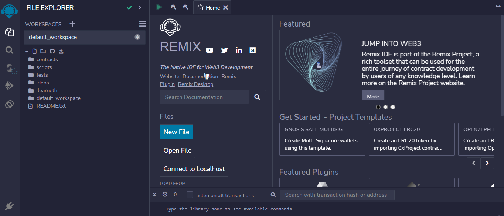

## Introduction

Over the years, event invitation systems have moved from just normal paper to digital cards which can be used in web2 web applications. In this era of web3 development, why not build a decentralized system that will invite people to an event on the blockchain? Celo is one of the fast leading blockchains and in our tutorial, we will be building our dApp on Celo.

### Celo

Celo is a blockchain project focused on making crypto payments as easy as possible. Instead of having to manage complex crypto addresses, users can send cryptocurrencies using mobile phone numbers.

Sending the platform’s stablecoin, Celo Dollars (cUSD) is even possible for users who do not have the Valora app. Users can send value via WhatsApp too. To access this value, however, recipients would eventually need to download the application.

### Learning Objectives

1. You will learn how to write smart contracts using Solidity.
2. Deploy the smart contract on the Celo blockchain using the Remix IDE.
3. Build a user interface using `HTML` and `JavaScript` to interact with our smart contract.

## Prerequisites

Before proceeding with this tutorial, you need to have the following basic knowledge:

- Blockchain.
- Smart contract development.
- Solidity.
- Remix IDE.
- How to use the Git CLI (Command Line Interface).
- HTML and JavaScript.

## Requirements

- A good web browser and an internet connection.
- **[Node.js](https://nodejs.org/en/download)**.
- A code editor. **[VSCode](https://code.visualstudio.com/download)** is recommended.
- A terminal. **[Git Bash](https://git-scm.com/downloads)** is recommended.
- **[Remix](https://remix.ethereum.org)**
- **[Celo Extension Wallet](https://chrome.google.com/webstore/detail/celoextensionwallet/kkilomkmpmkbdnfelcpgckmpcaemjcdh?hl=en)**.

## Getting Started

Here is a demo of what we are about to build:

[Demo Link](https://chigozie0706.github.io/ceAffairs/)

## Section One: Building Our Smart Contract Using Solidity

In this section, we will build our smart contract for the blockchain using Solidity. Before going into details we need to be on the Remix IDE. Click [here](http://remix.ethereum.org/) to navigate to Remix.

This is a preview of the Remix IDE:



On the Remix IDE, click on the `contracts` folder. That is the place we will write all our smart contracts.

Next, inside the `contracts` folder, let's create our smart contract file called `CeAffairs` with the Solidity extension `.sol`.

Our first line of code for the smart contract is:

```solidity
// SPDX-License-Identifier: MIT
pragma solidity >=0.7.0 <0.9.0;
```

The [SPDX](https://spdx.dev/) (Software Package Data Exchange) is a simple way to state the license that applies to a source code or documentation file, in our case `MIT`.

The `pragma` specify the Solidity version we want the compiler to use. We would want the version to be equal to or greater than version`0.7.0` but less than version `0.9.0`.

Next, let's create our contract by using the keyword `contract` followed by the contract name, in our case `CeAffairs`.

```solidity
contract CeAffairs{
// Declaring variables.
    uint internal eventLength = 0;
```

In the above code, we are going to declare a variable called `eventLength` of data type `uint` with visibility set to `internal` because we want the variable to be accessed only in our smart contract.

The variable is going to keep track of the number of events that are hosted on the smart contract.

Up next, we are going to create a `struct` called `Event`. Structs are a collection of variables that can consist of different data types.

```solidity
// Ceating a struct to store event details.
  struct Event {
      address  owner;
      string eventName;
      string eventCardImgUrl;
      string eventDetails;
      uint   eventDate;
      string eventTime;
      string eventLocation;
      }
```

In our code above, our struct consists of the following variables:

1. `owner`: it stores the address of an event owner of data type `address`.
2. `eventName`: it stores the name of the event of data type `string`.
3. `eventCardImgUrl`: it stores the event card image of data type `string`.
4. `eventDetails`: it stores the details of the event of data type `string`.
5. `eventDate`: it stores the event date of data type `uint`.
6. `eventTime`: it stores the event time of data type `string`.
7. `eventLocation`: it stores the event location of data type `string`.

After creating our `Event` struct, we need to create three `mappings` to store data in the key-value pairs format. A `mapping` is essentially a hash table that stores data in key-value pairs where the key can be any of the built-in data types supported by Solidity.

To create a `mapping`, you use the keyword `mapping` and assign a key type to a value type.

```solidity
    //map for storing events.
    mapping(uint => Event) internal events;

    //map for storing list of attendees
    mapping(uint256 => address[]) internal eventAttendees;

    // map for attendance check
    mapping(uint => mapping(address => bool)) public attendanceCheck;
```

- The first `mapping` stores multiple events listed on the blockchain. Your key would be a `uint` and the value would be the struct `Event` and the variable name would be `events`.

- The second `mapping` stores the addresses of users that are going to attend a particular event. The key is a `uint256`, while the value is an array that stores only the addresses of the users.

- The third `mapping` stores the addresses of users that have confirmed their attendance at an event. The key is of type `uint` while the value is a nested `mapping` with a key type of `address` and value of type `bool`.

Next, we are going to create a function called `createEvent` which allow a user to create and list an event on the blockchain.

```solidity
   // Function to create  an event.
    function createEvent(string memory _eventName, string memory _eventCardImgUrl,
    string memory _eventDetails, uint  _eventDate,
    string memory _eventTime, string memory _eventLocation) public {
        events[eventLength] = Event({owner : msg.sender, eventName: _eventName, eventCardImgUrl : _eventCardImgUrl,
     eventDetails: _eventDetails, eventDate : _eventDate,
     eventTime : _eventTime, eventLocation : _eventLocation});
     eventLength++;
}
```

The function above takes six parameters which are `_eventName`, `_eventCardImgUrl`, `_eventDetails`, `_eventDate`, `_eventTime`, and `_eventLocation`. The parameter has a prefix `_` which is used to differentiate it from its struct value. The function has its visibility type set to public.

A new event is then added to the events `mapping` by using the initial length of the event which we created above called `eventLength` as a key to store a new Event struct with the specified information. The owner of the event is stored using the `msg.sender` keyword, then we increment the `eventLength` by 1 for the next event to be created.

Up next, we are going to create a function that will return the information of a particular event when the `_index` of that event is being passed. The function will be declared `public view` meaning that it is going to be public and we not modifying anything rather we are only to return some values.

```solidity
    // Function to get a event through its id.
    function getEventById(uint _index) public view returns (
        address,
        string memory,
        string memory,
        string memory,
        uint,
        string memory,
        string memory

    ) {

        return (
            events[_index].owner,
            events[_index].eventName,
            events[_index].eventCardImgUrl,
            events[_index].eventDetails,
            events[_index].eventDate,
            events[_index].eventTime,
            events[_index].eventLocation
        );
    }

```

The function will return the address of the `owner`, `eventName`, `eventCardImgUrl`, `eventDetails`, `eventDate`, `eventTime` and the `eventLocation`.

Up next, we are going to create a function called `deleteEventById` that will allow an event owner deletes his or her event.

```solidity

    //Function in which only an event owner can delete an event.
function deleteEventById(uint _index) public {
        require(msg.sender == events[_index].owner, "you are not the owner");
        delete events[_index];
    }

```

The function takes a parameter `_index` and it's set to public. The body of the function uses the `require` method which is used to ensure that a particular condition is being met before moving on the next line of code.

In our `require` method, we are going to ensure that the address of the user calling the function is the owner of that event. If the condition is false, it will throw an error with the message `"you are not the owner"`. If the condition is _true_, it will delete the `Event` struct stored at `_index`.

Up next we are going to create a function called `addEventAttendees` which will enable a user to attend an event without spamming it.

```solidity

//Function to attend an event without spamming it.
    function addEventAttendees(uint256 _index) public {
        require(events[_index].eventDate > block.timestamp,"sorry entry date has expired...");
        require(!attendanceCheck[_index][msg.sender], "you are already an attendee");
        attendanceCheck[_index][msg.sender] = true;
        eventAttendees[_index].push(msg.sender);

    }
}

```

The function takes a parameter `_index` and its `visibility` is set to `public`.

It uses two `require` methods. The first `require` method ensures that the entry date of that particular event has not expired by making a comparison with the current timestamp.

The second `require` method is to ensure the attendance check of a user is `false`.

If the two `require` conditions are being met, it sets the `attendanceCheck` of that user to be true and stores the user `address` in an array that is stored in a `mapping`.

Up next we are going to create a function called `getAttendees` to fetch the list of all attendees of a particular event.

```solidity

//function to get list of event attendees by event id.
    function getAttendees(uint256 _index) public view returns (address[] memory) {
        return eventAttendees[_index];
    }

```

The function takes a parameter of `_index` and its visibility is set to `public` and `view` since we are not modifying anything and it returns an array of type `address`.

The body of the function returns an array of addresses by using the `_index` as a key.

Up next, we are going to create a public function called `getEventLength` that will return the number of `events` created.

```solidity

//function to get length of event.
    function getEventLength() public view returns (uint) {
        return (eventLength);
    }
}

```

Here is the full code:

```solidity

// SPDX-License-Identifier: MIT
pragma solidity ^0.8.3;

contract CeAffairs{
// Declaring variables.
    uint internal eventLength = 0;

    // Ceating a struct to store event details.
    struct Event {
        address  owner;
        string eventName;
        string eventCardImgUrl;
        string eventDetails;
        uint   eventDate;
        string eventTime;
        string eventLocation;

    }

    //map for storing events.
    mapping (uint => Event) internal events;

    //map for storing list of attendees
    mapping(uint256 => address[]) internal eventAttendees;

    // map for attendance check
    mapping(uint => mapping(address => bool)) public attendanceCheck;


    // Function to create  an event.
    function createEvent(string memory _eventName, string memory _eventCardImgUrl,
    string memory _eventDetails, uint  _eventDate,
    string memory _eventTime, string memory _eventLocation) public {
        events[eventLength] = Event({owner : msg.sender, eventName: _eventName, eventCardImgUrl : _eventCardImgUrl,
     eventDetails: _eventDetails, eventDate : _eventDate,
     eventTime : _eventTime, eventLocation : _eventLocation});
     eventLength++;
}


// Function to get a event through its id.
    function getEventById(uint _index) public view returns (
        address,
        string memory,
        string memory,
        string memory,
        uint,
        string memory,
        string memory

    ) {

        return (
            events[_index].owner,
            events[_index].eventName,
            events[_index].eventCardImgUrl,
            events[_index].eventDetails,
            events[_index].eventDate,
            events[_index].eventTime,
            events[_index].eventLocation
        );
    }

//Function only a event owner can delete an event.
function deleteEventById(uint _index) public {
        require(msg.sender == events[_index].owner, "you are not the owner");
        delete events[_index];
    }

//Function to attend an event without spamming it.
    function addEventAttendees(uint256 _index) public {
        require(events[_index].eventDate > block.timestamp,"sorry entry date has expired...");
        require(!attendanceCheck[_index][msg.sender], "you are already an attendee");
        attendanceCheck[_index][msg.sender] = true;
        eventAttendees[_index].push(msg.sender);

    }

//function to get list of event attendees by event id.
    function getAttendees(uint256 _index) public view returns (address[] memory) {
        return eventAttendees[_index];
    }


//function to get length of event.
    function getEventLength() public view returns (uint) {
        return (eventLength);
    }

}

```

Congrats! you just created an event invitation smart contract.

Up next is to deploy that smart contract on the Celo blockchain.

## Contract Deployment

To deploy the contract, we would need to:

1. Download the Celo Extension Wallet [here](https://chrome.google.com/webstore/detail/celoextensionwallet/kkilomkmpmkbdnfelcpgckmpcaemjcdh?hl=en) and create an account.
2. Switch to the Alfajores testnet and fund your wallet [here](https://celo.org/developers/faucet)
3. Download and activate the Celo plugin from the Remix plugin manager.
4. Save and compile your `CeAffairs.sol` file and take note of the ABI at the bottom of the compiler section.
5. Click on the Celo plugin, connect your wallet and deploy the smart contract.

> **_Note_**: ensure you save the _address_ the smart contract is deployed to for future reference.

## Section Two: Building Our Front-End for the DApp

Up next, we are going to build a user interface (UI) to interact with our smart contract. You need to make sure you have installed Node.js 10 or higher version.

To make our work easier let's clone a boilerplate

Open a directory where you want the boilerplate to be cloned and run the code below using your command line interface in that directory.

```bash
git clone https://github.com/Chigozie0706/celo-event-boilerplate.git
```

This will create a folder called `celo-event-boilerplate`.

> **_Note_**: The reference to this `boilerplate` is from **[https://github.com/dacadeorg/celo-boilerplate-web-dapp](https://github.com/dacadeorg/celo-boilerplate-web-dapp)**, feel free to take a look at it.

The project folder contains three folders which are `contract`, `public`, and `src`. Inside the `contract` folder, we have two files `event.sol` which holds our contract code, and `event.abi.json` which holds the `ABI bytecode` of our smart contract.

Up next, we are going to install all the dependencies in the `package.json` of our boilerplate by opening the command line interface in our root directory, we write the command below:

```bash
npm install
```

Installing all dependencies might take a while. After the dependencies have been installed, we can start up the local server by running the command:

```bash
npm run dev
```

Your project should be running here **http://localhost:3000/** and a browser window should pop up showing "hello world".

After starting the server we need to open the `celo-event-boilerplate` folder which is the root folder in an IDE, `VS Code` or `Atom` is recommended.

Up next, we need to copy our `CeAffairs.sol` from Remix and paste it into the `event.sol` file in our boilerplate, copy the ABI also from Remix, and paste it into our `event.abi.json` file.

> **_Note_**: the _address_ to which the smart contract is being deployed to will be used later.

### The HTML Part of the DApp (index.HTML)

Up next, in our boilerplate, let's open the public folder and the `index.html` file. This is where we are going to build our user interface (UI) so that the user can see a way of interacting with our smart contract.

Firstly we need to write the following lines of code below:

```html
<!DOCTYPE html>
<html lang="en">
  <head>
    <!-- Required meta tags -->
    <meta charset="utf-8" />
    <meta name="viewport" content="width=device-width, initial-scale=1" />
  </head>
</html>
```

The code above declares the _document type_, adds an HTML tag, creates a head element, and adds some important `meta` tags.

The first `meta` tag defines the `character-set` (encoding) we will be using.

The second `meta` tag defines the responsiveness of the web page.

Next, we will be importing some external files using the `link` tag.

```html
<!-- CSS -->
<link
  href="https://cdn.jsdelivr.net/npm/bootstrap@5.0.0-beta2/dist/css/bootstrap.min.css"
  rel="stylesheet"
  integrity="sha384-BmbxuPwQa2lc/FVzBcNJ7UAyJxM6wuqIj61tLrc4wSX0szH/Ev+nYRRuWlolflfl"
  crossorigin="anonymous"
/>

<link rel="preconnect" href="https://fonts.gstatic.com" />

<link
  href="https://fonts.googleapis.com/css2?family=DM+Sans:wght@400;500;700&display=swap"
  rel="stylesheet"
/>

<link
  rel="stylesheet"
  href="https://cdn.jsdelivr.net/npm/bootstrap-icons@1.4.0/font/bootstrap-icons.css"
/>
```

The first `link` tag is used to import the Bootstrap library which helps in creating a more easier and responsive user interface (UI).

The second `link` is used to import the **Google Font** for our text.

The third `link` is used to import Bootstrap icons.

Up next, we would be using the `style` tag to import our main font. The style tag also contains some CSS styles that can be used globally.

```html
<style>
      :root {
        --bs-font-sans-serif: "DM Sans", sans-serif;
      }

      @media (min-width: 576px) {
        .card {
          border: 3px solid rgb(255,218,185);
          border-radius: 10px;
        }

        .card-img-top {
          width: 100%;
          height: 15vw;
          object-fit: cover;
        }
      }
    </style>

    <title>CeAffairs</title>
  </head>

```

We are also setting the _title_ of the page with the title tag. In our case, the title of our page will be `CeAffairs`, then we close the tag.

Next, let's define our `body` tag. Inside the body tag, the first component we will be creating is the navbar.

```html
<body>
  <!-- Navbar starts here -->
  <nav class="navbar bg-dark navbar-dark">
    <div class="container">
      <span class="navbar-brand m-0 h4 fw-bold">ceAffairs</span>
      <span class="nav-link border rounded-pill bg-light">
        <span id="balance">0</span>
        cUSD
      </span>
    </div>
  </nav>
  <!-- Navbar ends here -->
</body>
```

The navbar is created with a Bootstrap component of `nav`. It has some Bootstrap `class` for styling the navbar and it contains two `span` for displaying the name of the dApp and also the cUSD balance of the connected wallet.

For now, the default amount is **zero**. Later on, we are going to import the actual amount of a user through the `id` of the `span` tag using our JavaScript code.

Next, we are going to create a hero that will tell the users what the dApp is all about and the users can also post an event by clicking a button that will pop up a modal that will contain a form for creating an event.

```html
<!-- section starts here -->
<div
  style="text-align: center; background-color: light-grey;"
  class="shadow p-5"
>
  <p>
    Welcome to ceAffairs a blockchain event hosting site where you host an event
    and also join be a guest to other people event on the celo blockchain
  </p>

  <button
    class="btn btn-success rounded-pill"
    data-bs-toggle="modal"
    data-bs-target="#addModal"
  >
    Post an Event
  </button>
</div>
<!--section ends here -->
```

Up next we are going to create a `div` that shows notifications to the users and a `main` tag that will show the list of events that is already created by the user.

```html
<!-- Start of container holding list of events -->
<div class="container mt-3">
  <div class="alert alert-warning sticky-top mt-2" role="alert">
    <span id="notification">⌛ Loading...</span>
  </div>

  <h5 class="my-5 text-center" id="eventPage">Event Lists</h5>

  <main id="eventplace" class="row">
    <p class="text-center mt-5">loading please wait...</p>
  </main>
</div>
<!-- End of container holding list of events -->
```

In the div for the notification we are going to set an id `notification`. This _id_ will be used to render dynamic notification text to the user. Also, for the `main` tag we are going to set an id of `eventPage` which will be used in our `main.js` file to render events created by users.

Next, we will be creating a `div` element that will pop up a modal which will be used to view the details of an event created, and also a user can use it to attend that event.

```html
<!-- start of modal that view an event -->
<div
  class="modal fade"
  id="showEventDetails"
  tabindex="-1"
  aria-labelledby="newProductModalLabel"
  aria-hidden="true"
  data-bs-backdrop="static"
  data-bs-keyboard="false"
>
  <div class="modal-dialog">
    <div class="modal-content">
      <div class="modal-header">
        <h5 class="modal-title" id="newProductModalLabel">Event Details</h5>

        <button
          type="button"
          class="btn-close"
          data-bs-dismiss="modal"
          aria-label="Close"
        ></button>
      </div>
      <div class="modal-body" id="modalBody"></div>
    </div>
  </div>
</div>

<!-- end of modal that view an event -->
```

The div contains a class of _modal_ and other Bootstrap classes and it has two ids which are `showEventDetails` which is used to pop the modal in our `main.js` file and `modalBody` which renders the details of an event.

Next, we are going to create a modal that will pop up a form that the users will use to create an event.

```html
<!-- start of modal to add a new event -->
<div
  class="modal fade"
  id="addModal"
  tabindex="-1"
  aria-labelledby="newProductModalLabel1"
  aria-hidden="true"
>
  <div class="modal-dialog">
    <div class="modal-content">
      <div class="modal-header">
        <h5 class="modal-title" id="newProductModalLabel1">New</h5>
        <button
          type="button"
          class="btn-close"
          data-bs-dismiss="modal"
          aria-label="Close"
        ></button>
      </div>
      <div class="modal-body">
        <form>
          <div class="form-row">
            <div class="col">
              <input
                type="text"
                id="eventName"
                class="form-control mb-2"
                placeholder="Enter event name"
              />
            </div>

            <div class="col">
              <input
                type="text"
                id="eventCardImgUrl"
                class="form-control mb-2"
                placeholder="Enter event card image url"
              />
            </div>

            <div class="col">
              <input
                type="textarea"
                id="eventDetails"
                class="form-control mb-2"
                placeholder="Enter event details"
              />
            </div>

            <div class="col">
              <input
                type="date"
                id="eventDate"
                class="form-control mb-2"
                placeholder="Enter event date"
              />
            </div>

            <div class="col">
              <input
                type="time"
                id="eventTime"
                class="form-control mb-2"
                placeholder="Enter event time"
              />
            </div>

            <div class="col">
              <input
                type="text"
                id="eventLocation"
                class="form-control mb-2"
                placeholder="Enter event location"
              />
            </div>
          </div>
        </form>
      </div>
      <div class="modal-footer">
        <button
          type="button"
          class="btn btn-light border"
          data-bs-dismiss="modal"
        >
          Close
        </button>
        <button
          type="button"
          class="btn btn-dark"
          data-bs-dismiss="modal"
          id="postEventBtn"
        >
          Add Event
        </button>
      </div>
    </div>
  </div>
</div>
<!-- end of modal to add a new event -->
```

Finally, we add the Bootstrap JS library and a library called `blockies`, which you are going to use to visualize blockchain addresses and close the `body` and `html` tag.

```html
<script
    src="https://cdn.jsdelivr.net/npm/bootstrap@5.0.0-beta2/dist/js/bootstrap.bundle.min.js"
    integrity="sha384-b5kHyXgcpbZJO/tY9Ul7kGkf1S0CWuKcCD38l8YkeH8z8QjE0GmW1gYU5S9FOnJ0"
    crossorigin="anonymous"
    ></script>
    <script src="https://unpkg.com/ethereum-blockies@0.1.1/blockies.min.js"></script>
  </body>
</html>
```

Below is the full source code for the index.html file:

```html
<!DOCTYPE html>
<html lang="en">
  <head>
    <!-- Required meta tags -->
    <meta charset="utf-8" />
    <meta name="viewport" content="width=device-width, initial-scale=1" />

    <!-- CSS -->
    <link
      href="https://cdn.jsdelivr.net/npm/bootstrap@5.0.0-beta2/dist/css/bootstrap.min.css"
      rel="stylesheet"
      integrity="sha384-BmbxuPwQa2lc/FVzBcNJ7UAyJxM6wuqIj61tLrc4wSX0szH/Ev+nYRRuWlolflfl"
      crossorigin="anonymous"
    />
    <link rel="preconnect" href="https://fonts.gstatic.com" />
    <link
      href="https://fonts.googleapis.com/css2?family=DM+Sans:wght@400;500;700&display=swap"
      rel="stylesheet"
    />
    <link
      rel="stylesheet"
      href="https://cdn.jsdelivr.net/npm/bootstrap-icons@1.4.0/font/bootstrap-icons.css"
    />

    <style>
      :root {
        --bs-font-sans-serif: "DM Sans", sans-serif;
      }

      @media (min-width: 576px) {
        .card {
          border: 3px solid rgb(255, 218, 185);
          border-radius: 10px;
        }

        .card-img-top {
          width: 100%;
          height: 15vw;
          object-fit: cover;
        }
      }
    </style>

    <title>CeAffairs</title>
  </head>

  <body>
    <!-- Navbar starts here -->
    <nav class="navbar bg-dark navbar-dark">
      <div class="container">
        <span class="navbar-brand m-0 h4 fw-bold">ceAffairs</span>
        <span class="nav-link border rounded-pill bg-light">
          <span id="balance">0</span>
          cUSD
        </span>
      </div>
    </nav>
    <!-- Navbar ends here -->

    <!-- section1 starts here -->
    <div
      style="text-align: center; background-color: light-grey;"
      class="shadow p-5"
    >
      <p>
        Welcome to ceAffairs a blockchain event hosting site where you host an
        event and also join be a guest to other people event on the celo
        blockchain
      </p>

      <button
        class="btn btn-success rounded-pill"
        data-bs-toggle="modal"
        data-bs-target="#addModal"
      >
        Post an Event
      </button>
    </div>
    <!--section1 ends here -->

    <!-- Start of container holding list of events -->
    <div class="container mt-3">
      <div class="alert alert-warning sticky-top mt-2" role="alert">
        <span id="notification">⌛ Loading...</span>
      </div>

      <h5 class="my-5 text-center" id="eventPage">Event Lists</h5>

      <main id="eventplace" class="row">
        <p class="text-center mt-5">loading please wait...</p>
      </main>
    </div>
    <!-- End of container holding list of events -->

    <!-- start of modal that view an event -->
    <div
      class="modal fade"
      id="showEventDetails"
      tabindex="-1"
      aria-labelledby="newProductModalLabel"
      aria-hidden="true"
      data-bs-backdrop="static"
      data-bs-keyboard="false"
    >
      <div class="modal-dialog">
        <div class="modal-content">
          <div class="modal-header">
            <h5 class="modal-title" id="newProductModalLabel">Event Details</h5>

            <button
              type="button"
              class="btn-close"
              data-bs-dismiss="modal"
              aria-label="Close"
            ></button>
          </div>
          <div class="modal-body" id="modalBody"></div>
        </div>
      </div>
    </div>

    <!-- end of modal that view an event -->

    <!-- start of modal to add a new event -->
    <div
      class="modal fade"
      id="addModal"
      tabindex="-1"
      aria-labelledby="newProductModalLabel1"
      aria-hidden="true"
    >
      <div class="modal-dialog">
        <div class="modal-content">
          <div class="modal-header">
            <h5 class="modal-title" id="newProductModalLabel1">New</h5>
            <button
              type="button"
              class="btn-close"
              data-bs-dismiss="modal"
              aria-label="Close"
            ></button>
          </div>
          <div class="modal-body">
            <form>
              <div class="form-row">
                <div class="col">
                  <input
                    type="text"
                    id="eventName"
                    class="form-control mb-2"
                    placeholder="Enter event name"
                  />
                </div>

                <div class="col">
                  <input
                    type="text"
                    id="eventCardImgUrl"
                    class="form-control mb-2"
                    placeholder="Enter event card image url"
                  />
                </div>

                <div class="col">
                  <input
                    type="textarea"
                    id="eventDetails"
                    class="form-control mb-2"
                    placeholder="Enter event details"
                  />
                </div>

                <div class="col">
                  <input
                    type="date"
                    id="eventDate"
                    class="form-control mb-2"
                    placeholder="Enter event date"
                  />
                </div>

                <div class="col">
                  <input
                    type="time"
                    id="eventTime"
                    class="form-control mb-2"
                    placeholder="Enter event time"
                  />
                </div>

                <div class="col">
                  <input
                    type="text"
                    id="eventLocation"
                    class="form-control mb-2"
                    placeholder="Enter event location"
                  />
                </div>
              </div>
            </form>
          </div>
          <div class="modal-footer">
            <button
              type="button"
              class="btn btn-light border"
              data-bs-dismiss="modal"
            >
              Close
            </button>
            <button
              type="button"
              class="btn btn-dark"
              data-bs-dismiss="modal"
              id="postEventBtn"
            >
              Add Event
            </button>
          </div>
        </div>
      </div>
    </div>
    <!-- end of modal to add a new event -->

    <script
      src="https://cdn.jsdelivr.net/npm/bootstrap@5.0.0-beta2/dist/js/bootstrap.bundle.min.js"
      integrity="sha384-b5kHyXgcpbZJO/tY9Ul7kGkf1S0CWuKcCD38l8YkeH8z8QjE0GmW1gYU5S9FOnJ0"
      crossorigin="anonymous"
    ></script>
    <script src="https://unpkg.com/ethereum-blockies@0.1.1/blockies.min.js"></script>
  </body>
</html>
```

### The Javascript of the DApp (main.js) file

Up next, we are going to write our Javascript code in the `main.js` file to connect the HTML file to the smart contract. You can locate the `main.js` file in the `src` folder of our boilerplate.

Next, in our `main.js` file, let’s import some useful libraries.

```js
import Web3 from "web3";
import { newKitFromWeb3 } from "@celo/contractkit";
import eventPlaceAbi from "../contract/event.abi.json";
```

In the first import, we are going to import Web from `web3`. `web3.js` is a popular collection of libraries also used for Ethereum that allows you to get access to a `web3` object and interact with the node's JSON RPC API.

Next, we are going to import `newKitFromWeb3` from the "@celo/contractkit". The `contractkit` library enables us to interact with the Celo blockchain.

Next, we are going to import our `eventPlaceAbi` code from the contract folder. The ABI (Application Binary Interface) provides an interface to enable us to interact with our smart contract that is being deployed in bytecode.

To get the ABI bytecode from Remix, you need to go to the compile section, compile the code and click on the ABI `icon` to copy the ABI code, then you paste the byte code in the `event.abi.json` file in our contract folder.

We also need to copy the smart contract and paste it into the `event.sol` file of our contract folder.

Up next, we are going to create three global variables below:

```js
const ERC20_DECIMALS = 18;
const MPContractAddress = "0xfE0C8243D8F04411752154B9421A2bc8a9b63962"; //Event Contract Address

let kit; //contractkit
let contract; // contract variable
let eventLists = []; // array of event lists
```

The constant variable `ERC20_DECIMALS` is set to `18` to follow the decimals used by the cUSD token which is the Celo currency that you are going to use here, so we are going to use the `ERC20_DECIMALS` variable to convert values.

The `MPContractAddress` holds the address where your smart contract is being deployed.

The `kit` stores the `address` of a user that is connected with his/her Celo wallet.

The contract stores an instance of the `CeAffairs` smart contract once a user connects their Celo wallet, so you can interact with it.

The `eventLists` will store `events` that have already been created.

Up next we are going to create a function that will connect the user to the Celo blockchain and read the account of the user.

```js
//Connects the wallet gets the account and initializes the contract
const connectCeloWallet = async function () {
  //checks if wallet is avaliable and gets the account.
  if (window.celo) {
    notification("⚠️ Please approve this DApp to use it.");
    try {
      await window.celo.enable();
      notificationOff();

      const web3 = new Web3(window.celo);
      kit = newKitFromWeb3(web3);

      const accounts = await kit.web3.eth.getAccounts();
      kit.defaultAccount = accounts[0];

      contract = new kit.web3.eth.Contract(eventPlaceAbi, MPContractAddress);
    } catch (error) {
      notification(`⚠️ ${error}.`);
    }
    notificationOff();
  }
  // if wallet is not avaliable excute enable the notification
  else {
    notification("⚠️ Please install the CeloExtensionWallet.");
  }
};
```

In the code above we use the `if` condition to check if the user has installed the Celo Extension Wallet by checking if the `window.celo` object exists. If it does not exist, the function will use the console to inform the user that they need to install the wallet.

If the `window.celo` object does exist, a notification will be sent to the user to approve the DApp.

Next, we use a `try` block to call the `window.celo.enable()` function. This function, will open a pop-up dialogue in the UI and ask for the user's permission to connect the DApp to the CeloExtensionWallet and then turn off the notification.

Next, after the user approves the dApp, we are going to create a `web3` object using the `window.celo` object as the provider. This `web3` object can then be used to create a new kit instance, which will be saved to the kit state. This kit instance will have the functionality to interact with the smart contract.

After creating the new kit instance, use the method `kit.web3.eth.getAccounts()` to get an array of the connected user's `addresses`. Use the first address from this array and set it as the default user address by using `kit.defaultAccount`. This will allow the address to be used globally in the dApp.

Next, we are going to store an instance of our deployed smart contract in the `contract` variable by calling the `kit.web3.eth.Contract` and passing the `eventPlaceAbi` and `MPContractAddress` as parameters.

Up next we are going to create a function called `getBalance` which we use in getting the cUSD balance of a user that has connected his or her Celo wallet.

```js
// gets the balance of the connected account
const getBalance = async function () {
  const totalBalance = await kit.getTotalBalance(kit.defaultAccount);
  // gets the balance in cUSD
  const cUSDBalance = totalBalance.cUSD.shiftedBy(-ERC20_DECIMALS).toFixed(2);
  document.querySelector("#balance").textContent = cUSDBalance;
};
```

In the above code, a constant variable is being created which stores the cUSD amount a user has by calling the method `kit.getTotalBalance` and passing the `kit.defaultAccount` which is the user's address as a parameter.

To convert it to a readable format, we use the `totalBalance.cUSD` to get the cUSD balance and shift it to 18 decimal places using the `ERC20_DECIMALS`. The `toFixed(2)` method ensures that only 2 numbers are displayed after the decimal point. After that, we store the value in a constant variable `cUSDBalance`.

Next, we display that `cUSDBalance` in the front end by using a query selector to target the id of our navbar and display the text.

Up next, we are going to create a function that will get all events created and display them on the front end.

```js
// gets the lists of all events created
const getEventLists = async function () {
  // calls the getEventLength function on SmartContract to get the total number of event created.
  const eventLength = await contract.methods.getEventLength().call();

  //initializing an event array for call function
  const _eventLists = [];

  //  loops through all the products
  for (let i = 0; i < eventLength; i++) {
    let event = new Promise(async (resolve, reject) => {
      // calls the getEventById function on the SmartContract
      let p = await contract.methods.getEventById(i).call();
      resolve({
        index: i,
        owner: p[0],
        eventName: p[1],
        eventCardImgUrl: p[2],
        eventDetails: p[3],
        eventDate: p[4],
        eventTime: p[5],
        eventLocation: p[6],
      });
    });

    // push the items on the _eventList array
    _eventLists.push(event);
  }

  // resolves all promise
  eventLists = await Promise.all(_eventLists);
  renderEvents();
};
```

In the function above, we need to know the number of events that have been created by calling the `getEventLength` function in our smart contract using the `contract.methods.getEventLength().call()` to call the function the length in a variable called `eventLength`.

Next, we are going to create an empty local array variable called `_eventLists` that will store all resolved promises of events created.

Next, we are going to create a for loop that will execute according to the `eventLength`. In the loop, for each item `i` we are going to create a promise that will call the `getEventById` function in our smart contract, resolve that promise and store the value in our local array `_eventLists`.

After the loop has finished executing, we are going to resolve all promises in the `_eventLists` array and store the value in the global `eventLists` array, then we call the `renderEvents()` function to render the events on the web.

Next, we are going to create the `renderEvents` function.

```js
// function to render a html template after the list of event is being fetched.
function renderEvents() {
  document.getElementById("eventplace").innerHTML = "";
  if (eventLists) {
    eventLists.forEach((event) => {
      if (event.owner != "0x0000000000000000000000000000000000000000") {
        const newDiv = document.createElement("div");
        newDiv.className = "col-md-3";
        newDiv.innerHTML = eventTemplate(event);
        document.getElementById("eventplace").appendChild(newDiv);
      }
    });
  } else {
    console.log("array is empty");
  }
}
```

In the function, we are going to get the id where we need to render our HTML template which we are going to create later and make empty to avoid duplicate rendering of events.

Next, we use an if condition to check if the `eventLists` is not empty, then we use a `forEach` loop to check if the owner of an event exists. If _true_, we are going to create a new div, give that div some class style, insert the `eventTemplate` which we will be creating later, and then append the `div` to an id `eventplace`.

Up next we are going to create the `eventTemplate` function which will receive a parameter `event`.

```js
// function that create a html template
function eventTemplate(event) {
  return `
 <div class="card mb-4 shadow">
      
      <div class="position-absolute  top-0 end-0 bg-danger mt-4 px-2 py-1 rounded" style="cursor : pointer;">
      <i class="bi bi-trash-fill deleteBtn" style="color : white;" id="${
        event.index
      }"></i>
      </div> 
  <div class="card-body text-left p-3 position-relative"
   style="background-color : rgb(255,218,185)">
        <div class="translate-middle-y position-absolute top-0"  id="${
          event.index
        }">
        ${identiconTemplate(event.owner)}
        </div>
        <h6 class="card-title  fw-bold mt-2">${event.eventName}</h6>
        <p class="card-text mb-2" style="
  width: 250px;
  white-space: nowrap;
  overflow: hidden;
  text-overflow: ellipsis">
          ${event.eventDetails}             
        </p>
<div style="display: flex;
  justify-content: space-between;">
      

           <div> <a class="btn btn-sm btn-success rounded-pill attendee"
           id="${event.index}">Join</a></div>
           

           <div> <a class="btn btn-sm btn-dark rounded-pill view"
           id="${event.index}">View</a></div>
          </div>

    
      </div>
    </div>
    `;
}
```

The function consists of a div with a class of `card` and some Bootstrap classes. The data that will be rendered will be coming from the event which is an object that we can access the value by using the `event.` followed by the name of the value.

The template also has a function called `identiconTemplate` which receives a parameter `event.owner`. The function converts the addresses of owners into icons.

The template also consists of three buttons:

1. `Delete` button: This allows an event owner to delete his/her event.
2. `Join` button: This allows users to join an event.
3. `View` button: This allows users to view more details about a particular event.

The buttons all have an id of `event.index`. Later on, we are going to take a look at how to implement the functions associated with each button but before that, let’s take a look at how to build the `identiconTemplate` function.

```js
// function  that creates an icon using the contract address of the owner
function identiconTemplate(_address) {
  const icon = blockies
    .create({
      seed: _address,
      size: 5,
      scale: 10,
    })
    .toDataURL();

  return `
  <div class="rounded-circle overflow-hidden d-inline-block border border-white border-2 shadow-sm m-0">
    <a href="https://alfajores-blockscout.celo-testnet.org/address/${_address}/transactions"
        target="_blank">
        
    </a>
  </div>
  `;
}
```

The function has a constant variable `icon` which is an object that contains the user address and some values. The function also returns a `div` that has an `image` tag with its `src` set to the variable icon declared at the top of the function.

Up next, we are going to create two functions that will display notifications to the user and also remove these notifications.

```js
// function to create a notification bar
function notification(_text) {
  document.querySelector(".alert").style.display = "block";
  document.querySelector("#notification").textContent = _text;
}

// function to turn off notification bar based on some conditions
function notificationOff() {
  document.querySelector(".alert").style.display = "none";
}
```

The first function `notification` displays a notification to the user by accepting a parameter and using the class `.alert` and id `notification` to display text on the web page.

The second function `notificationOff` removes the notification from the screen.

Up next we are going to create an event listener that checks when the page loads and it will call some certain functions we created.

```js
// initialization of functions when the window is loaded.
window.addEventListener("load", async () => {
  notification("⌛ Loading...");
  await connectCeloWallet();
  await getBalance();
  await getListedSeeds();
  notificationOff();
});
```

The event listener calls the `notification`, `connectCeloWallet`, `getBalance`, `getListedSeeds`, and the `notificationOff` function.

Up next, let’s create a function that will receive the input values of our form and submit it to the blockchain.

```js
// function to add an event on the blockchain.
document.querySelector("#postEventBtn").addEventListener("click", async (e) => {
  // gets the event date value from the form
  let eventDate = document.getElementById("eventDate").value;

  // stores the eventDate in the date variable.
  const date = new Date(eventDate);

  // converts date to timestamp in seconds.
  const timestamp = Math.floor(date.getTime() / 1000);

  const params = [
    document.getElementById("eventName").value,
    document.getElementById("eventCardImgUrl").value,
    document.getElementById("eventDetails").value,
    parseInt(timestamp),
    document.getElementById("eventTime").value,
    document.getElementById("eventLocation").value,
  ];
  notification(`⌛ Posting your event to the blockchain please wait...`);
  try {
    const result = await contract.methods
      .createEvent(...params)
      .send({ from: kit.defaultAccount });
  } catch (error) {
    notification(`⚠️ ${error}.`);
  }
  notification(`🎉 Congrats event successfully added`);
  notificationOff();
  getEventLists();
});
```

In the code above is a query selector that checks for the id `postEventBtn` and adds an event listener to check if an `onClick` event has happened.

In the next line, we get the `eventDate` value from the form and convert it to a timestamp in seconds, then we create an array that will hold all values in the form.

Next, we notify the user that their request is processing and then we use the try block to call our smart contract method `createEvent`, and we pass the params as a parameter to it, then we use the `send` method with the user address as a parameter because we want to write to the smart contract.

The catch block is used to catch any error that might occur during the transaction.

After all is successful, we notify the user, turn off the notification and call the `getEventLists` method.

Next, we are going to create a query selector that will target the `eventplace` id and listen for on-click events.

```js

// implements various functionalities
document.querySelector("#eventplace").addEventListener("click", async (e) => {
  //checks if there is a class name called deleteBtn
  if (e.target.className.includes("deleteBtn")) {
    const index = e.target.id

    notification("⌛ Please wait, your action is being processed...")

    // calls the delete fucntion on the smart contract
    try {
      const result = await contract.methods
        .deleteEventById(index)
        .send({ from: kit.defaultAccount })
      notification(`You have deleted an event successfully`)
      getEventLists()
      getBalance()
    } catch (error) {
      notification(`⚠️ you are not the owner of this event`)
    }
    notificationOff()
  }

```

In the query selector, we have an `if` statement that checks if a button clicked has a class name of `deleteBtn`. If _true_, it will get the id of that button and assign it to a local variable called `index`. Next, we display a notification to the user for them to know that their request is processing.

Still on the `if` statement, we are going to use a `try-catch` block to call our smart contract function `deleteEventById` in the function, we are going to pass a parameter `index` which is the local variable that stores the id of the button.

If the action is successful, it will notify the user and call the `getEventLists` and `getBalance` functions. If it is not successful, it will notify the user as well using the catch block for it.

Finally, we are going to turn off the notification.

After the `if` statement we are going to implement two `else if` statement. The first `else if` will enable the user to get more details on a particular event while the second `else if` statement will enable the user to attend an event.

Let's get started with first `else if`.

```js
 else if(e.target.className.includes("view")){
      const _id = e.target.id;
      let eventData;
      let attendees = [];

      // function to get list of attendess on the smart contract.
      try {
          eventData = await contract.methods.getEventById(_id).call();
          attendees = await contract.methods.getAttendees(_id).call();
          let myModal = new bootstrap.Modal(document.getElementById('addModal1'), {backdrop: 'static', keyboard: false});
          myModal.show();


// stores the timestamp of the event date.
var eventTimeStamp= parseInt(eventData[4])

// converts timestamp to milliseconds.
var convertToMilliseconds = eventTimeStamp * 1000;

// create an object for it.
var dateFormat= new Date(convertToMilliseconds);


// displays events details on the modal
document.getElementById("modalHeader").innerHTML = `
<div class="card mb-4">
      

  <div class="card-body text-left p-4 position-relative">
        <div class="translate-middle-y position-absolute top-0">
        ${identiconTemplate(eventData[0])}
        </div>
        <h5 class="card-title  fw-bold mt-2">${eventData[1]}</h5>
        <p class="card-text mb-3">
          ${eventData[3]}
        </p>


        <div class="d-flex p-2" style="border : 1px solid grey; border-radius : 2px;" >
        <p class="card-text mt-1 ">
          <i class="bi bi-calendar-event-fill"></i>
           <span>${dateFormat.getDate()+
           "/"+(dateFormat.getMonth()+1)+
           "/"+dateFormat.getFullYear()}</span>
        </p>

        <p class="card-text mt-1 mx-3">
          <i class="bi bi-clock-fill"></i>
           <span>${eventData[5]}</span>
        </p>
        </div>

        <p class="card-text mt-2 p-2" style="border : 1px solid grey; border-radius : 2px;">
          <i class="bi bi-geo-alt-fill"></i>
          <span>${eventData[6]}</span>
        </p>
        <hr />
      <p class="card-text">Attendees:</p>
      <div id="att"></div>
      </div>
    </div>

  `
  if (attendees.length) {
    attendees.forEach((item) => {
            document.getElementById(`att`).innerHTML += `${identiconTemplate(item)}`;
          })
  } else{
    document.getElementById(`att`).innerHTML += `<p class="text-center">no attendee yet...</p>`;
  };

    }
    catch (error) {
      notification(`⚠️ ${error}.`)
    }
    notificationOff()
  }

```

In the code, we are going to check if the button clicked has a class name of `view`. If it is _true_, we will create three variables. The first is to store the id of the button, the second is to store the promise data we will be receiving later and the third is to store the list of all users that will attend that event.

Next, we are going to use a `try-catch` block to call two functions `getEventById` and `getAttendees` from our smart contract and store them, then we create a variable that will get the id of our modal in the index.html file and set it to show.

The `getEventById` returns the data the way they are arranged in the smart contract. Before displaying the data to the user, we need to convert the timestamp gotten to a readable date format.

Next, we are going to display the data of the result gotten in a modal. The modal contains a `div` with Bootstrap classes, and each result is mapped to a particular HTML element.

Further, we will check if the `attendees` array is not empty. If _true_ it will append the addresses of the attendees as icons in the modal. else it will display a text saying `"no attendee yet..."`.

After the `try` block, we will use our `catch` block to handle any errors and notify the users.

Up next is the second `else if` statement:

```js

else if(e.target.className.includes("attendee")){
    const _id = e.target.id;

    notification(`⌛ Processing your request please wait ...`)

    try {
      const result = await contract.methods
        .addEventAttendees(_id)
        .send({ from: kit.defaultAccount })
        notification(`🎉 You are now one of the attendee .`)
    } catch (error) {
      notification(`⚠️ ${error}.`)
    }
    notificationOff()

    getEventLists()
  }

})

```

The first line checks if the button clicked by the users has a class name of `attendee`, if _true_, it notifies the users that their transaction is processing.

Next, we use the `try` block to interact with our smart contract method `addEventAttendees` which adds the address of a user to an array. If the transaction is successful it will also notify the user. Errors are caught by the catch block and displayed to the user by notification.

After everything is processed, the notification is turned off and the `getEventLists` function is called.

Below is the full code to the `main.js` file:

```js
import Web3 from "web3";
import { newKitFromWeb3 } from "@celo/contractkit";
import eventPlaceAbi from "../contract/event.abi.json";

const ERC20_DECIMALS = 18;
const MPContractAddress = "0xfE0C8243D8F04411752154B9421A2bc8a9b63962"; //Event Contract Address

let kit; //contractkit
let contract; // contract variable
let eventLists = []; // array of event lists

//Connects the wallet gets the account and initializes the contract
const connectCeloWallet = async function () {
  //checks if wallet is avaliable and gets the account.
  if (window.celo) {
    notification("⚠️ Please approve this DApp to use it.");
    try {
      await window.celo.enable();
      notificationOff();

      const web3 = new Web3(window.celo);
      kit = newKitFromWeb3(web3);

      const accounts = await kit.web3.eth.getAccounts();
      kit.defaultAccount = accounts[0];

      contract = new kit.web3.eth.Contract(eventPlaceAbi, MPContractAddress);
    } catch (error) {
      notification(`⚠️ ${error}.`);
    }
    notificationOff();
  }
  // if wallet is not avaliable excute enable the notification
  else {
    notification("⚠️ Please install the CeloExtensionWallet.");
  }
};

// gets the balance of the connected account
const getBalance = async function () {
  const totalBalance = await kit.getTotalBalance(kit.defaultAccount);
  // gets the balance in cUSD
  const cUSDBalance = totalBalance.cUSD.shiftedBy(-ERC20_DECIMALS).toFixed(2);
  document.querySelector("#balance").textContent = cUSDBalance;
};

// gets the lists of all events created
const getEventLists = async function () {
  // calls the getEventLength function on SmartContract to get the total number of event created.
  const eventLength = await contract.methods.getEventLength().call();

  //initializing an event array for call function
  const _eventLists = [];

  //  loops through all the products
  for (let i = 0; i < eventLength; i++) {
    let event = new Promise(async (resolve, reject) => {
      // calls the getEventById function on the SmartContract
      let p = await contract.methods.getEventById(i).call();
      resolve({
        index: i,
        owner: p[0],
        eventName: p[1],
        eventCardImgUrl: p[2],
        eventDetails: p[3],
        eventDate: p[4],
        eventTime: p[5],
        eventLocation: p[6],
      });
    });

    // push the items on the _eventList array
    _eventLists.push(event);
  }

  // resolves all promise
  eventLists = await Promise.all(_eventLists);
  renderEvents();
};

// function to render a html template after the list of event is being fetched.
function renderEvents() {
  document.getElementById("eventplace").innerHTML = "";
  if (eventLists) {
    eventLists.forEach((event) => {
      if (event.owner != "0x0000000000000000000000000000000000000000") {
        const newDiv = document.createElement("div");
        newDiv.className = "col-md-3";
        newDiv.innerHTML = eventTemplate(event);
        document.getElementById("eventplace").appendChild(newDiv);
      }
    });
  } else {
    console.log("array is empty");
  }
}

// function that create a html template
function eventTemplate(event) {
  return `
 <div class="card mb-4 shadow">
      
      <div class="position-absolute  top-0 end-0 bg-danger mt-4 px-2 py-1 rounded" style="cursor : pointer;">
      <i class="bi bi-trash-fill deleteBtn" style="color : white;" id="${
        event.index
      }"></i>
      </div> 
  <div class="card-body text-left p-3 position-relative"
   style="background-color : rgb(255,218,185)">
        <div class="translate-middle-y position-absolute top-0"  id="${
          event.index
        }">
        ${identiconTemplate(event.owner)}
        </div>
        <h6 class="card-title  fw-bold mt-2">${event.eventName}</h6>
        <p class="card-text mb-2" style="
  width: 250px;
  white-space: nowrap;
  overflow: hidden;
  text-overflow: ellipsis">
          ${event.eventDetails}             
        </p>
<div style="display: flex;
  justify-content: space-between;">
      

           <div> <a class="btn btn-sm btn-success rounded-pill attendee"
           id="${event.index}">Join</a></div>
           

           <div> <a class="btn btn-sm btn-dark rounded-pill view"
           id="${event.index}">View</a></div>
          </div>

    
      </div>
    </div>
    `;
}

// function  that creates an icon using the contract address of the owner
function identiconTemplate(_address) {
  const icon = blockies
    .create({
      seed: _address,
      size: 5,
      scale: 5,
    })
    .toDataURL();

  return `
  <div class="rounded-circle overflow-hidden d-inline-block border border-white border-2 shadow-sm m-0">
    <a href="https://alfajores-blockscout.celo-testnet.org/address/${_address}/transactions"
        target="_blank">
        
    </a>
  </div>
  `;
}

// function to create a notification bar
function notification(_text) {
  document.querySelector(".alert").style.display = "block";
  document.querySelector("#notification").textContent = _text;
}

// function to turn off notification bar based on some conditions
function notificationOff() {
  document.querySelector(".alert").style.display = "none";
}

// initialization of functions when the window is loaded.
window.addEventListener("load", async () => {
  notification("⌛ Loading...");
  await connectCeloWallet();
  await getBalance();
  await getEventLists();
  notificationOff();
});

// function to add an event on the blockchain.
document.querySelector("#postEventBtn").addEventListener("click", async (e) => {
  // gets the event date value from the form
  let eventDate = document.getElementById("eventDate").value;

  // stores the eventDate in the date variable.
  const date = new Date(eventDate);

  // converts date to timestamp in seconds.
  const timestamp = Math.floor(date.getTime() / 1000);

  const params = [
    document.getElementById("eventName").value,
    document.getElementById("eventCardImgUrl").value,
    document.getElementById("eventDetails").value,
    parseInt(timestamp),
    document.getElementById("eventTime").value,
    document.getElementById("eventLocation").value,
  ];
  notification(`⌛ Posting your event to the blockchain please wait...`);
  try {
    const result = await contract.methods
      .createEvent(...params)
      .send({ from: kit.defaultAccount });
  } catch (error) {
    notification(`⚠️ ${error}.`);
  }
  notification(`🎉 Congrats event successfully added`);
  notificationOff();
  getEventLists();
});

// implements various functionalities
document.querySelector("#eventplace").addEventListener("click", async (e) => {
  //checks if there is a class name called deleteBtn
  if (e.target.className.includes("deleteBtn")) {
    const index = e.target.id;

    notification("⌛ Please wait, your action is being processed...");

    // calls the delete fucntion on the smart contract
    try {
      const result = await contract.methods
        .deleteEventById(index)
        .send({ from: kit.defaultAccount });
      notification(`You have deleted an event successfully`);
      getEventLists();
      getBalance();
    } catch (error) {
      notification(`⚠️ you are not the owner of this event`);
    }
    notificationOff();
  } else if (e.target.className.includes("view")) {
    const _id = e.target.id;
    let eventData;
    let attendees = [];

    // function to get list of attendess on the smart contract.
    try {
      eventData = await contract.methods.getEventById(_id).call();
      attendees = await contract.methods.getAttendees(_id).call();
      let myModal = new bootstrap.Modal(
        document.getElementById("showEventDetails"),
        { backdrop: "static", keyboard: false }
      );
      myModal.show();

      // stores the timestamp of the event date.
      var eventTimeStamp = parseInt(eventData[4]);

      // converts timestamp to milliseconds.
      var convertToMilliseconds = eventTimeStamp * 1000;

      // create an object for it.
      var dateFormat = new Date(convertToMilliseconds);

      // displays events details on the modal
      document.getElementById("modalBody").innerHTML = `
<div class="card mb-4">
      
      
  <div class="card-body text-left p-4 position-relative">
        <div class="translate-middle-y position-absolute top-0">
        ${identiconTemplate(eventData[0])}
        </div>
        <h5 class="card-title  fw-bold mt-2">${eventData[1]}</h5>
        <p class="card-text mb-3">
          ${eventData[3]}             
        </p>


        <div class="d-flex p-2" style="border : 1px solid grey; border-radius : 2px;" > 
        <p class="card-text mt-1 ">
          <i class="bi bi-calendar-event-fill"></i>
           <span>${
             dateFormat.getDate() +
             "/" +
             (dateFormat.getMonth() + 1) +
             "/" +
             dateFormat.getFullYear()
           }</span>
        </p>

        <p class="card-text mt-1 mx-3">
          <i class="bi bi-clock-fill"></i>
           <span>${eventData[5]}</span>
        </p>
        </div>

        <p class="card-text mt-2 p-2" style="border : 1px solid grey; border-radius : 2px;">
          <i class="bi bi-geo-alt-fill"></i>
          <span>${eventData[6]}</span>
        </p>
        <hr />
      <p class="card-text">Attendees:</p>
      <div id="att"></div>
      </div>
    </div>


  `;

      if (attendees.length) {
        attendees.forEach((item) => {
          document.getElementById(`att`).innerHTML += `${identiconTemplate(
            item
          )}`;
        });
      } else {
        document.getElementById(
          `att`
        ).innerHTML += `<p class="text-center">no attendee yet...</p>`;
      }
    } catch (error) {
      notification(`⚠️ ${error}.`);
    }
    notificationOff();
  } else if (e.target.className.includes("attendee")) {
    const _id = e.target.id;

    notification(`⌛ Processing your request please wait ...`);

    try {
      const result = await contract.methods
        .addEventAttendees(_id)
        .send({ from: kit.defaultAccount });
      notification(`🎉 You are now one of the attendee .`);
    } catch (error) {
      notification(`⚠️ ${error}.`);
    }
    notificationOff();

    getEventLists();
  }
});
```

## Conclusion

Congratulations on building your event invitation system on the Celo blockchain.

## Next step

Building and deploying smart contracts on the Celo blockchain is very easy and robust. You can add more functionalities to the smart contract and user interface we just built.

You can get the source code for this tutorial [here](https://github.com/Chigozie0706/ceAffairs)

## About the Author

Chigozie Jacob is a full-stack developer who loves a building global solutions and writting technical content. You can reach me on Twitter [here](https://twitter.com/chigoziejacob1)

Let's go!
