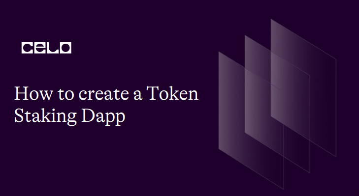

## 🌱 Introduction

Token staking Dapps are decentralized applications that allow users to stake their cryptocurrency tokens in exchange for rewards. Staking is a process by which users hold their tokens in a wallet and lock them up for a certain period of time to support the network and receive rewards.Examples of popular token staking Dapps include Uniswap, Aave, and Compound, which allow users to stake their tokens in decentralized liquidity pools and earn a share of the transaction fees generated by the platform


## 🗈 Prerequisites

To fully follow up with these tutorial, you should atleast have a basic understanding of the following.

- Solidity.
- Basic web Development.


## ⚠️ Requirements

- Solidity -language used to write smart contracts.
- Truffle - a development framework for building decentralized applications (dApps) on the Ethereum blockchain. 
- hdwallet-provider
- Chai-javascript testing framework.
- React 
- Node JS 12 or higher.
- Npm
```bash
node -v
npm -v
```
- A code editor. You will need a code editor to write and edit your code. Some popular options include Visual Studio Code and Atom.
- A Metamask account. You will need a Metamask account to interact with the Celo blockchain from your web browser. If you don't already have one, you can create one by installing the Metamask extension for Chrome or Firefox or brave.

## Installation

Click on **[this](https://github.com/Tevin-Isaac/celo-token-staking-dapp)** repo from github and:

1. Clone the repo to your computer.
2. Open the project from vscode.
3. Run `npm install` or `yarn install` command to install all the dependencies required to run the app locally.

### Folder structure

```bash
celo-token-staking-dapp/
migrations/
┣ .gitkeep
┣ 1_initial_migration.js
┗ 2_deploy_contracts.js
scripts/
┣ changeAPY.js
┗ redistribute.js
public/
┣ favicon.ico
┣ index.html
┗ manifest.json
src/
┣ abis/
┃ ┣ Migrations.json
┃ ┣ TestToken.json
┃ ┗ TokenStaking.json
┣ assets/
┃ ┣ icon.png
┃ ┣ stake.png
┃ ┗ unstake.png
┣ components/
┃ ┣ AdminTesting.js
┃ ┣ AdminTesting.module.css
┃ ┣ Navigation.js
┃ ┣ Navigation.module.css
┃ ┣ Staking.js
┃ ┗ Staking.module.css
┣ contracts/
┃ ┣ Migrations.sol
┃ ┣ TestToken.sol
┃ ┗ TokenStaking.sol
┣ App.js
┣ App.module.css
┣ index.css
┗ index.js
test/
┣ .gitkeep
┗ TokenStaking.js
```
## Setup
Incase you want to do the project from scratch and not clone the repository above  then the  first step is to generate a default react application that we are going to use for the front end.To do so you should run:

```
npx create-react-app my-app
 Or  
yarn create react-app my-app
```
After you run this  command on the terminal you will see a folder sructure that looks like this:

```
my-app
├── README.md
├── node_modules
├── package.json
├── .gitignore
├── public
│   ├── favicon.ico
│   ├── index.html
│   ├── logo192.png
│   ├── logo512.png
│   ├── manifest.json
│   └── robots.txt
└── src
    ├── App.css
    ├── App.js
    ├── App.test.js
    ├── index.css
    ├── index.js
    ├── logo.svg
    ├── serviceWorker.js
    └── setupTests.js
```

:::tip
To learn more about react here is a  **[guide that explains how to generate a react app](https://create-react-app.dev/docs/getting-started/)** and how its generated with templates.
:::

## Install Truffle
After that install truffle in your project using this command:

```
npm install -g truffle
```
After running this on to our react up we will now initialize it with the following command:

```
truffle init

```
When you run truffle init, it creates a basic directory structure and files for your new project, including:
- A 'contracts' directory for your Solidity smart contracts
- A 'migrations' directory for managing the deployment of your contracts
- A 'test' directory for writing automated tests for your contracts
- A 'truffle-config.js' file, which contains configuration options for Truffle
-  'README.md' file with basic information about your project
The 'truffle init' command is typically one of the first commands you would run when starting a new project with Truffle. It provides a basic starting point for your project, which you can then customize and expand  as needed.

## SmartContract

On the Contracts folder that truffle generated we will  create 3 smart contracts and for  these we will use Solidity as our language.

:::tip
To learn more about Solidity smart contracts, check out this **[step-by-step guide to learn solidity smart contract basics](https://docs.soliditylang.org/en/v0.8.19/introduction-to-smart-contracts.html)**  which provides detailed instructions on getting started.
:::

- **`Migrations.sol`**

First on your contracts folder create a new file named "Migrations.sol".This is the code:

```solidity
// SPDX-License-Identifier: MIT
pragma solidity >=0.4.21 <0.9.0;
contract Migrations {
  address public owner;
  uint public last_completed_migration;

  constructor(){
    owner = msg.sender;
  }

  modifier restricted() {
    if (msg.sender == owner) _;
  }

  function setCompleted(uint completed) public restricted {
    last_completed_migration = completed;
  }

  function upgrade(address new_address) public restricted {
    Migrations upgraded = Migrations(new_address);
    upgraded.setCompleted(last_completed_migration);
  }
}
```

- Breakdown

```solidity
// SPDX-License-Identifier: MIT

```

This line specifies the license under which the code is released. In this case, it's the MIT License.

```solidity
pragma solidity >=0.4.21 <0.9.0;

```
This line specifies the version of Solidity that the code is compatible with. In this case, it's any version between 0.4.21 and 0.9.0.
```solidity
contract Migrations {
  address public owner;
  uint public last_completed_migration;
```
This is the start of the Migrations contract. It declares two state variables: owner, which stores the address of the contract owner, and last_completed_migration, which stores the ID of the last completed migration.
```solidity
  constructor(){
    owner = msg.sender;
  }
  ```
  This is the constructor function of the contract. It sets the owner variable to the address of the contract deployer.

```solidity
  modifier restricted() {
    if (msg.sender == owner) _;
  }

```
This is a modifier function that restricts access to certain functions of the contract to the owner only.

```solidity
  function setCompleted(uint completed) public restricted {
    last_completed_migration = completed;
  }

```
This function sets the value of last_completed_migration to the provided completed parameter. It can only be called by the owner of the contract.

```solidity
  function upgrade(address new_address) public restricted {
    Migrations upgraded = Migrations(new_address);
    upgraded.setCompleted(last_completed_migration);
  }

```
This function upgrades the 'Migrations' contract to a new address. It creates a new instance of the 'Migrations' contract at the new_address provided, and sets its last_completed_migration variable to the same value as the current contract.

Overall, the Migrations contract is a simple contract used by Truffle to manage the deployment and upgrade of smart contracts in your project. 


- **`TestToken.sol`**

Now create another  new file on the contracts folder and let us name this contract TestToken.sol.The contract will look like this:

```solidity
// SPDX-License-Identifier: MIT
pragma solidity >=0.4.21 <0.9.0;
//Erc 20 test token

contract TestToken {
    string  public name = "TestToken";
    string  public symbol = "Tst";
    uint256 public totalSupply = 1000000000000000000000000; // 1 million tokens
    uint8   public decimals = 18;
    address internal cUsdTokenAddress = 0x874069Fa1Eb16D44d622F2e0Ca25eeA172369bC1;
    event Transfer(
        address indexed _from,
        address indexed _to,
        uint256 _value
    );

    event Approval(
        address indexed _owner,
        address indexed _spender,
        uint256 _value
    );

    mapping(address => uint256) public balanceOf;
    mapping(address => mapping(address => uint256)) public allowance;

    constructor(){
        balanceOf[msg.sender] = totalSupply;
    }

    function transfer(address _to, uint256 _value) public returns (bool success) {
        require(balanceOf[msg.sender] >= _value);
        balanceOf[msg.sender] -= _value;
        balanceOf[_to] += _value;
        emit Transfer(msg.sender, _to, _value);
        return true;
    }

    function approve(address _spender, uint256 _value) public returns (bool success) {
        allowance[msg.sender][_spender] = _value;
        emit Approval(msg.sender, _spender, _value);
        return true;
    }

    function transferFrom(address _from, address _to, uint256 _value) public returns (bool success) {
        require(_value <= balanceOf[_from]);
        require(_value <= allowance[_from][msg.sender]);
        balanceOf[_from] -= _value;
        balanceOf[_to] += _value;
        allowance[_from][msg.sender] -= _value;
        emit Transfer(_from, _to, _value);
        return true;
    }
}
```

- Breakdown

```solidity
contract TestToken {

```
This is the start of the TestToken contract.

```solidity
    string  public name = "TestToken";
    string  public symbol = "Tst";
    uint256 public totalSupply = 1000000000000000000000000; // 1 million tokens
    uint8   public decimals = 18;
```
These lines define some basic properties of the token, such as its name, symbol, total supply, and number of decimals.

```solidity
     event Transfer(
        address indexed _from,
        address indexed _to,
        uint256 _value
    );

    event Approval(
        address indexed _owner,
        address indexed _spender,
        uint256 _value
    );

```
These lines define two events that will be emitted when a transfer or approval occurs.

```solidity
    mapping(address => uint256) public balanceOf;
    mapping(address => mapping(address => uint256)) public allowance;

```
These lines define two mappings that keep track of the token balances and allowances of each address.


```solidity
    constructor(){
        balanceOf[msg.sender] = totalSupply;
    }


```
This is the constructor function of the contract. It sets the balance of the contract deployer to the total supply of the token.

```solidity
    function transfer(address _to, uint256 _value) public returns (bool success) {
        require(balanceOf[msg.sender] >= _value);
        balanceOf[msg.sender] -= _value;
        balanceOf[_to] += _value;
        emit Transfer(msg.sender, _to, _value);
        return true;
    }
```
This function transfers _value amount of tokens from the caller's address to the _to address. It checks if the caller has enough tokens to transfer and emits a Transfer event upon success.

```solidity
    function approve(address _spender, uint256 _value) public returns (bool success) {
        allowance[msg.sender][_spender] = _value;
        emit Approval(msg.sender, _spender, _value);
        return true;
    }
```
This function allows _spender to spend _value amount of tokens on behalf of the caller. It emits an Approval event upon success.

```solidity
    function transferFrom(address _from, address _to, uint256 _value) public returns (bool success) {
        require(_value <= balanceOf[_from]);
        require(_value <= allowance[_from][msg.sender]);
        balanceOf[_from] -= _value;
        balanceOf[_to] += _value;
        allowance[_from][msg.sender] -= _value;
        emit Transfer(_from, _to, _value);
        return true;
    }
```
This function allows _spender to transfer _value amount of tokens from _from address to _to address, provided that _spender has been granted sufficient allowance by _from. It checks if _from has enough tokens to transfer and emits a Transfer event upon success.
Overall, this contract defines a basic ERC-20 token with transfer and approval functionalities.


- **`TokenStaking.sol`**
For our final contract in the contract folder create a file named 'TokenStaking.sol'.This will be our Token Staking contract that will allow us to stake our tokens.it will look like this:

```solidity
// SPDX-License-Identifier: MIT
pragma solidity >=0.4.21 <0.9.0;

import "./TestToken.sol";

contract TokenStaking {
    string public name = "Yield Farming / Token dApp";
    TestToken public testToken;

    //declaring owner state variable
    address public owner;

    //declaring default APY (default 0.1% daily or 36.5% APY yearly)
    uint256 public defaultAPY = 100;

    //declaring APY for custom staking ( default 0.137% daily or 50% APY yearly)
    uint256 public customAPY = 137;

    //declaring total staked
    uint256 public totalStaked;
    uint256 public customTotalStaked;

    //users staking balance
    mapping(address => uint256) public stakingBalance;
    mapping(address => uint256) public customStakingBalance;

    //mapping list of users who ever staked
    mapping(address => bool) public hasStaked;
    mapping(address => bool) public customHasStaked;

    //mapping list of users who are staking at the moment
    mapping(address => bool) public isStakingAtm;
    mapping(address => bool) public customIsStakingAtm;

    //array of all stakers
    address[] public stakers;
    address[] public customStakers;

    constructor(TestToken _testToken)  payable {
        testToken = _testToken;

        //assigning owner on deployment
        owner = msg.sender;
    }

    //stake tokens function

    function stakeTokens(uint256 _amount) public {
        //must be more than 0
        require(_amount > 0, "amount cannot be 0");

        //User adding test tokens
        testToken.transferFrom(msg.sender, address(this), _amount);
        totalStaked = totalStaked + _amount;

        //updating staking balance for user by mapping
        stakingBalance[msg.sender] = stakingBalance[msg.sender] + _amount;

        //checking if user staked before or not, if NOT staked adding to array of stakers
        if (!hasStaked[msg.sender]) {
            stakers.push(msg.sender);
        }

        //updating staking status
        hasStaked[msg.sender] = true;
        isStakingAtm[msg.sender] = true;
    }

    //unstake tokens function

    function unstakeTokens() public {
        //get staking balance for user

        uint256 balance = stakingBalance[msg.sender];

        //amount should be more than 0
        require(balance > 0, "amount has to be more than 0");

        //transfer staked tokens back to user
        testToken.transfer(msg.sender, balance);
        totalStaked = totalStaked - balance;

        //reseting users staking balance
        stakingBalance[msg.sender] = 0;

        //updating staking status
        isStakingAtm[msg.sender] = false;
    }

    // different APY Pool
    function customStaking(uint256 _amount) public {
        require(_amount > 0, "amount cannot be 0");
        testToken.transferFrom(msg.sender, address(this), _amount);
        customTotalStaked = customTotalStaked + _amount;
        customStakingBalance[msg.sender] =
            customStakingBalance[msg.sender] +
            _amount;

        if (!customHasStaked[msg.sender]) {
            customStakers.push(msg.sender);
        }
        customHasStaked[msg.sender] = true;
        customIsStakingAtm[msg.sender] = true;
    }

    function customUnstake() public {
        uint256 balance = customStakingBalance[msg.sender];
        require(balance > 0, "amount has to be more than 0");
        testToken.transfer(msg.sender, balance);
        customTotalStaked = customTotalStaked - balance;
        customStakingBalance[msg.sender] = 0;
        customIsStakingAtm[msg.sender] = false;
    }

    //airdropp tokens
    function redistributeRewards() public {
        //only owner can issue airdrop
        require(msg.sender == owner, "Only contract creator can redistribute");

        //doing drop for all addresses
        for (uint256 i = 0; i < stakers.length; i++) {
            address recipient = stakers[i];

            //calculating daily apy for user
            uint256 balance = stakingBalance[recipient] * defaultAPY;
            balance = balance / 100000;

            if (balance > 0) {
                testToken.transfer(recipient, balance);
            }
        }
    }

    //customAPY airdrop
    function customRewards() public {
        require(msg.sender == owner, "Only contract creator can redistribute");
        for (uint256 i = 0; i < customStakers.length; i++) {
            address recipient = customStakers[i];
            uint256 balance = customStakingBalance[recipient] * customAPY;
            balance = balance / 100000;

            if (balance > 0) {
                testToken.transfer(recipient, balance);
            }
        }
    }

    //change APY value for custom staking
    function changeAPY(uint256 _value) public {
        //only owner can issue airdrop
        require(msg.sender == owner, "Only contract creator can change APY");
        require(
            _value > 0,
            "APY value has to be more than 0, try 100 for (0.100% daily) instead"
        );
        customAPY = _value;
    }

    //cliam test 1000 Tst (for testing purpose only !!)
    function claimTst() public {
        address recipient = msg.sender;
        uint256 tst = 1000000000000000000000;
        uint256 balance = tst;
        testToken.transfer(recipient, balance);
    }
}
```

- Breakdown

```
import "./TestToken.sol";
```
This is an import statement that imports the TestToken.sol contract into the current contract.

```solidity
contract TokenStaking {

```
This is the start of the TokenStaking contract definition

```solidity
string public name = "Yield Farming / Token dApp";

```
This line declares a public string variable called name and initializes it to the value "Yield Farming / Token dApp".

```solidity
TestToken public testToken;

```
This line declares a public variable called testToken of type TestToken. This variable will be used to hold an instance of the TestToken contract.


```solidity
address public owner;

```
This line declares a public variable called owner of type address. This variable will be used to store the address of the owner of the contract.

```solidity
uint256 public defaultAPY = 100;

```
This line declares a public variable called defaultAPY of type uint256 and initializes it to the value 100.
```solidity
uint256 public customAPY = 137;

```
This line declares a public variable called customAPY of type uint256 and initializes it to the value 137.

```solidity
uint256 public totalStaked;
uint256 public customTotalStaked;
```
These lines declare public variables totalStaked and customTotalStaked, both of type uint256. These variables will be used to store the total amount of tokens staked in the contract and the custom staking pool.

```solidity
mapping(address => uint256) public stakingBalance;
mapping(address => uint256) public customStakingBalance;
```
These lines declare public mapping variables stakingBalance and customStakingBalance, both of type mapping(address => uint256). These mappings will be used to keep track of the staking balances of each user.
```solidity
mapping(address => bool) public hasStaked;
mapping(address => bool) public customHasStaked;
```
These lines declare public mapping variables hasStaked and customHasStaked, both of type mapping(address => bool). These mappings will be used to keep track of whether each user has staked tokens or not.

```solidity
mapping(address => bool) public isStakingAtm;
mapping(address => bool) public customIsStakingAtm;
```
These lines declare public mapping variables isStakingAtm and customIsStakingAtm, both of type mapping(address => bool). These mappings will be used to keep track of whether each user is currently staking tokens or not.

```solidity
address[] public stakers;
address[] public customStakers;
```
These lines declare public arrays to keep track of the addresses of all users who have staked in each pool.


```solidity
constructor(TestToken _testToken)  payable {
        testToken = _testToken;
        owner = msg.sender;
    }
```
This is the constructor for the TokenStaking contract. It takes a parameter of type TestToken and initializes the testToken variable with it. It also sets the owner variable to the address of the person deploying the contract.

```solidity
    function stakeTokens(uint256 _amount) public {
        //must be more than 0
        require(_amount > 0, "amount cannot be 0");

        //User adding test tokens
        testToken.transferFrom(msg.sender, address(this), _amount);
        totalStaked = totalStaked + _amount;

        //updating staking balance for user by mapping
        stakingBalance[msg.sender] = stakingBalance[msg.sender] + _amount;

        //checking if user staked before or not, if NOT staked adding to array of stakers
        if (!hasStaked[msg.sender]) {
            stakers.push(msg.sender);
        }

        //updating staking status
        hasStaked[msg.sender] = true;
        isStakingAtm[msg.sender] = true;
    }      
```
This is the constructor for the TokenStaking contract. It takes a parameter of type TestToken and initializes the testToken variable with it. It also sets the owner variable to the address of the person deploying the contract.

```solidity
   function unstakeTokens() public {
        //get staking balance for user

        uint256 balance = stakingBalance[msg.sender];

        //amount should be more than 0
        require(balance > 0, "amount has to be more than 0");

        //transfer staked tokens back to user
        testToken.transfer(msg.sender, balance);
        totalStaked = totalStaked - balance;

        //reseting users staking balance
        stakingBalance[msg.sender] = 0;

        //updating staking status
        isStakingAtm[msg.sender] = false;
    }

```
This function allows users to withdraw their staked tokens from the staking contract. It checks the user's staking balance, transfers the tokens back to the user's wallet, updates the total staked amount, resets the user's staking balance, and sets the user's staking status to false

```solidity
 function customStaking(uint256 _amount) public {
        require(_amount > 0, "amount cannot be 0");
        testToken.transferFrom(msg.sender, address(this), _amount);
        customTotalStaked = customTotalStaked + _amount;
        customStakingBalance[msg.sender] =
            customStakingBalance[msg.sender] +
            _amount;

        if (!customHasStaked[msg.sender]) {
            customStakers.push(msg.sender);
        }
        customHasStaked[msg.sender] = true;
        customIsStakingAtm[msg.sender] = true;
    }
```
This function allows users to stake their tokens into a custom APY pool. It transfers the specified amount of tokens from the user's wallet to the staking contract, updates the user's custom staking balance and custom total staked amount, adds the user to the custom stakers array if they haven't staked before, and sets the user's custom staking status to true.

```solidity
    function customUnstake() public {
        uint256 balance = customStakingBalance[msg.sender];
        require(balance > 0, "amount has to be more than 0");
        testToken.transfer(msg.sender, balance);
        customTotalStaked = customTotalStaked - balance;
        customStakingBalance[msg.sender] = 0;
        customIsStakingAtm[msg.sender] = false;
    }

```
 This function allows users to withdraw their staked tokens from the custom APY pool. It checks the user's custom staking balance, transfers the tokens back to the user's wallet, updates the custom total staked amount, resets the user's custom staking balance, and sets the user's custom staking status to false.

```solidity
   function redistributeRewards() public {
        //only owner can issue airdrop
        require(msg.sender == owner, "Only contract creator can redistribute");

        //doing drop for all addresses
        for (uint256 i = 0; i < stakers.length; i++) {
            address recipient = stakers[i];

            //calculating daily apy for user
            uint256 balance = stakingBalance[recipient] * defaultAPY;
            balance = balance / 100000;

            if (balance > 0) {
                testToken.transfer(recipient, balance);
            }
        }
    }

```
This function allows the contract owner to distribute rewards to all stakers in the default APY pool. It loops through all stakers, calculates their daily rewards based on their staking balance and the default APY, and transfers the calculated amount of tokens to each staker.

```solidity
    function customRewards() public {
        require(msg.sender == owner, "Only contract creator can redistribute");
        for (uint256 i = 0; i < customStakers.length; i++) {
            address recipient = customStakers[i];
            uint256 balance = customStakingBalance[recipient] * customAPY;
            balance = balance / 100000;

            if (balance > 0) {
                testToken.transfer(recipient, balance);
            }
        }
    }
```
This function allows the contract owner to distribute rewards to all stakers in the custom APY pool. It loops through all custom stakers, calculates their daily rewards based on their custom staking balance and the custom APY, and transfers the calculated amount of tokens to each staker.

```solidity
    function changeAPY(uint256 _value) public {
        //only owner can issue airdrop
        require(msg.sender == owner, "Only contract creator can change APY");
        require(
            _value > 0,
            "APY value has to be more than 0, try 100 for (0.100% daily) instead"
        );
        customAPY = _value;
    }
```
This function allows the contract owner to change the custom APY value.

```solidity
    function claimTst() public {
        address recipient = msg.sender;
        uint256 tst = 1000000000000000000000;
        uint256 balance = tst;
        testToken.transfer(recipient, balance);
    }
}
```
This function is for testing purposes only. It transfers 1000 TST tokens to the caller's wallet.

Overall this  smart contract  implements a token staking mechanism. Users can stake ERC20 tokens, and receive rewards in the same token based on an Annual Percentage Yield (APY) that can be customized by the contract owner.
The contract has two different pools: a default pool with a default APY of 0.1% daily or 36.5% APY yearly, and a custom pool with a custom APY of 0.137% daily or 50% APY yearly.
The contract also includes airdrop functions for each pool, where the contract owner can redistribute rewards to stakers based on the current APY. The airdrop function for the default pool uses the default APY, while the airdrop function for the custom pool uses the custom APY.It also includes mappings to keep track of staking balances, staking status, and a list of stakers for each pool.It uses the ERC20 standard transfer and transferFrom functions to handle token transfers.
Finally the contract has a changeAPY function, which can only be called by the contract owner, to change the APY of the custom pool.The owner can set the APY to any value greater than 0.

*We have wrapped up doing our basic smart contracts However, it is important to note that this contracts do not include any security measures, such as access control or input validation, which should be added to ensure the safety and integrity of the contract.*

## Truffle configuration
An important file that we will have to customize its code is the truffle-config.js file.The truffle-config.js file is the configuration file for the Truffle development framework. It specifies the settings for how Truffle should interact with the Ethereum network and deploy contracts

- **`truffle-config.js`**
Inside our file we will update our code to this:
```javascript
const HDWalletProvider = require('@truffle/hdwallet-provider');
const mnemonic = 'awesome pear drive venture sign toast tide much hundred floor adapt attend';

module.exports = {
  networks: {
    development: {
      host: '127.0.0.1',
      port: 7545,
      network_id: '*', // Match any network id
    },
    alfajores: {
      provider: function() {
        return new HDWalletProvider(mnemonic,'https://alfajores-forno.celo-testnet.org');
      },
      network_id: 44787, // The network ID for Alfajores testnet
      gas: 4500000, // Gas limit used for deployments
      gasPrice: 10000000000, // Gas price used for transactions
      skipDryRun: true // Skip the dry run before migrations? (default: false for public nets )
    }
  },

  contracts_directory: './src/contracts/',
  contracts_build_directory: './src/abis/',

  // Configure your compilers
  compilers: {
    solc: {
      version: "0.8.19", // Fetch exact version from solc-bin (default: truffle's version)
    },
  },

  // plugin for verification
  plugins: ['truffle-plugin-verify'],

  api_keys: {
    alfajores: process.env.CELO_ALFAJORES_API_KEY // Celo Alfaajores testnet API key
    
  }
};
```
This is a Truffle configuration file (truffle-config.js) for a project using the Celo Alfajores testnet. It includes the following configurations:
* mnemonic: A 12-word mnemonic phrase used for generating the HDWalletProvider instance, which is used to sign transactions.(use your own seedphrase generated from your metamask wallet)
* networks: Defines the network configurations for the project, including the development network and the Alfajores testnet. The Alfajores network is configured to use the HDWalletProvider with the specified mnemonic and to skip the dry run before migrations. The gas and gasPrice are also specified for the network.
* contracts_directory: The directory where the Solidity contracts are located.
contracts_build_directory: The directory where the compiled contract artifacts (ABIs and bytecode) are stored.
* compilers: The Solidity compiler configuration, specifying the version of the compiler to use.
plugins: The plugins used by Truffle, including the truffle-plugin-verify plugin for contract verification.
* api_keys: An object containing the API key for the Alfajores network, which is used for contract verification.

:::tip
To learn more about this celo network here is a   **[guide that explains about the Alfajores Testnet](https://docs.celo.org/network/alfajores)**
:::

Now that our truffle file  is set to deploy to the alfajores testnet lets take a look at our 'Migrations' Folder that was generated earlier.

On your terminal run this:
```
truffle migrate 
```
That command will create two files named '1_initial_migration.js' and  '2_deploy_contracts.js`.Now we will update the code in those two files.

- **`1_initial_migration.js`**
In this file we will update to this  this code:
```javascript
const Migrations = artifacts.require("Migrations");

module.exports = function(deployer) {
  deployer.deploy(Migrations);
};
```
The script exports a function that takes a deployer argument. The deployer is a helper object provided by Truffle that enables deploying smart contracts to the blockchain.
In this case, the script deploys the Migrations contract by calling deployer.deploy(Migrations).This creates a new instance of the Migrations contract and deploys it to the blockchain.

- **`2_deploy_contracts.js`**
In our second file we will update our code to this:
```javascript
const TestToken = artifacts.require('TestToken');
const TokenStaking = artifacts.require('TokenStaking');

module.exports = async function(deployer, network, accounts) {
  //deploying TesToken
  await deployer.deploy(TestToken);
  //fetching back TestToken address
  const testToken = await TestToken.deployed();

  //deploying staking contract, passing token address
  await deployer.deploy(TokenStaking, testToken.address);
  const tokenStaking = await TokenStaking.deployed();

  //transfer 500k TestToken to smart contract for rewards
  await testToken.transfer(tokenStaking.address, '500000000000000000000000');

  //   sending 1000 TestTokens to User and Creator for test , investor is second address
  await testToken.transfer(accounts[1], '1000000000000000000000');
};
```
This is a migration script written in JavaScript for the Truffle framework. It deploys two smart contracts, TestToken and TokenStaking.
The script first imports the two contract artifacts using artifacts.require() function from Truffle then it exports an asynchronous function that receives three arguments: deployer, network, and accounts.
Inside the function, the script deploys the TestToken contract using deployer.deploy(TestToken) and then fetches the deployed contract instance using await TestToken.deployed().
Next, it deploys the TokenStaking contract, passing the TestToken address as a parameter using deployer.deploy(TokenStaking, testToken.address) and fetches the deployed contract instance using await TokenStaking.deployed().
After that, it transfers 500,000 TestTokens to the TokenStaking contract address for rewards using await testToken.transfer(tokenStaking.address, '500000000000000000000000').
Finally, the script transfers 1,000 TestTokens to the second address in the accounts array for testing purposes using await testToken.transfer(accounts[1], '1000000000000000000000').

- - **`Scripts`**

We also added a truffle scripts folder that allows us to change the percentage yield(APY) of ur token staking smart contract.
On our scripts folder i will create two files namely 'changeAPY.js file and redistribute.js file"

- **`changeAPY.js`**
 ```javascript
 const TokenStaking = artifacts.require('TokenStaking');

module.exports = async function(callback) {

  let yearly = process.argv[4] * 365;
  let APY = process.argv[4] * 1000;
  let tokenStaking = await TokenStaking.deployed();
  await tokenStaking.changeAPY(APY);

  console.log(
    `--- APY have been changed to ${process.argv[4]}% Daily. (${yearly}% Yearly) ---`
  );

  callback();
};
// for 0.1% Daily APY pass 0.1 as an argument
// to run script  -  truffle exec scripts/changeAPY.js 0.1
```
This is a Truffle script for changing the annual percentage yield (APY) of a token staking smart contract.
First, it requires the TokenStaking contract using artifacts.require.
Then, the script retrieves the value of the desired daily APY from the command-line arguments passed to the script, and converts it to a yearly APY.
Next, it deploys the TokenStaking contract and uses the changeAPY function of the contract to change the APY. The new APY value is passed as an argument to the changeAPY function.
Finally, the script logs a message to the console indicating that the APY has been changed.To run this script, you need to execute the following command in the terminal:

```
truffle exec scripts/changeAPY.js 0.1
```

- **`redistribute.js`**
```javascript
const TokenStaking = artifacts.require('TokenStaking');

module.exports = async function(callback) {
  if (process.argv[4] === 'custom') {
    let tokenStaking = await TokenStaking.deployed();
    await tokenStaking.customRewards();
    console.log('--- Daily [custom] rewards have been redistributed ---');
    callback();
  } else if (!process.argv[4]) {
    let tokenStaking = await TokenStaking.deployed();
    await tokenStaking.redistributeRewards();
    console.log('--- Daily rewards have been redistributed ---');
    callback();
  } else {
    console.log(
      'Error: Invalid argument provided, for custom reward redistribution use: truffle exec scripts/redistribute.js custom'
    );
  }
};
//to run script  -  truffle exec scripts/redistribute.js
//to run custom redistribution   -  truffle exec scripts/redistribute.js custom
```
This script is used to redistribute daily rewards for a staking contract. If the script is run without any arguments, it will call the redistributeRewards() function on the deployed TokenStaking contract to distribute rewards to all stakers. If the argument 'custom' is provided, it will call the customRewards() function on the deployed contract to redistribute rewards according to a custom algorithm.

Here is an overview of what the script does if the argument 'custom' is provided:
- Get the deployed TokenStaking contract instance.
- Call the customRewards() function on the contract instance to redistribute rewards according to a custom algorithm.
- Print a message indicating that the rewards have been redistributed.
- Call the callback function to exit the script.
If no argument is provided:

- Get the deployed TokenStaking contract instance.
- Call the redistributeRewards()

To run this script use the following commands:
```
 truffle exec scripts/redistribute.js
 truffle exec scripts/redistribute.js custom
```
- **Test**
Our final truffle configuration folder is the 'Test' folder.The test folder in Truffle is used to write and run automated tests for your smart contracts. Tests are an important part of smart contract development as they allow you to verify the correctness and security of your code, as well as ensure that it behaves as expected under different conditions.Inside it lets name our test file 'TokenStaking.js'.

- **`TokenStaking.js`**
```javascript
const { assert, use } = require('chai');
const { default: Web3 } = require('web3');

const TestToken = artifacts.require('TestToken');
const TokenStaking = artifacts.require('TokenStaking');

require('chai')
  .use(require('chai-as-promised'))
  .should();

//helper function to convert tokens to ether
function tokenCorvert(n) {
  return web3.utils.toWei(n, 'ether');
}

contract('TokenStaking', ([creator, user]) => {
  let testToken, tokenStaking;

  before(async () => {
    //Load contracts
    testToken = await TestToken.new();
    tokenStaking = await TokenStaking.new(testToken.address);

    //transfer 500k to TokenStaking
    await testToken.transfer(tokenStaking.address, tokenCorvert('500000'));

    //sending some test tokens to User at address[1] { explaining where it comes from}
    await testToken.transfer(user, tokenCorvert('2234'), {
      from: creator,
    });
  });

  // Test 1
  // 1.1 Checking if Token contract has a same name as expected
  describe('TestToken deployment', async () => {
    it('token deployed and has a name', async () => {
      const name = await testToken.name();
      assert.equal(name, 'TestToken');
    });
  });

  // Test 2
  // 2.1 Checking if TokenStaking contract has a same name as expected
  describe('TokenStaking deployment', async () => {
    it('staking contract deployed and has a name', async () => {
      const name = await tokenStaking.name();
      assert.equal(name, 'Yield Farming / Token dApp');
    });

    //2.2 checking default apy value
    it('checking default APY value', async () => {
      const value = await tokenStaking.defaultAPY();
      assert.equal(value, '100', 'default APY set to 100');
    });

    //2.3 checking custom apy value
    it('checking custom APY value', async () => {
      const value = await tokenStaking.customAPY();
      assert.equal(value, '137', 'custom APY set to 137');
    });

    // 2.4 Checking if TokenStaking contract has 500k of TestTokens
    it('staking contract has 500k TestTokens tokens inside', async () => {
      let balance = await testToken.balanceOf(tokenStaking.address);
      assert.equal(balance.toString(), tokenCorvert('500000'));
    });
  });

  // Test 3
  // 3.1 Testing stakeTokens function
  describe('TokenStaking stakeTokens function', async () => {
    let result;
    it('users balance is correct before staking', async () => {
      result = await testToken.balanceOf(user);
      assert.equal(
        result.toString(),
        tokenCorvert('2234'),
        'users balance is correct before staking'
      );
    });

    // 3.2 checking TokenStaking total banalce
    it('checking total staked before any stakes', async () => {
      result = await tokenStaking.totalStaked();
      assert.equal(
        result.toString(),
        tokenCorvert('0'),
        'total staked should be 0'
      );
    });

    // 3.3 Testing stakeTokens function
    it('approving tokens, staking tokens, checking balance', async () => {
      // first approve tokens to be staked
      await testToken.approve(tokenStaking.address, tokenCorvert('1000'), {
        from: user,
      });
      // stake tokens
      await tokenStaking.stakeTokens(tokenCorvert('1000'), { from: user });

      // check balance of user if they have 0 after staking
      result = await testToken.balanceOf(user);
      assert.equal(
        result.toString(),
        tokenCorvert('1234'),
        'User balance after staking 1234'
      );
    });

    // 3.4 checking balance of TokenStaking contract should be 500k +1000
    it('checking contract balance after staking', async () => {
      result = await testToken.balanceOf(tokenStaking.address);
      assert.equal(
        result.toString(),
        tokenCorvert('501000'),
        'Smart contract total balance after staking 1000'
      );
    });

    // 3.5 checking TokenStaking contract users balance
    it('checking user balance inside contract', async () => {
      result = await tokenStaking.stakingBalance(user);
      assert.equal(
        result.toString(),
        tokenCorvert('1000'),
        'Smart contract balance for user'
      );
    });

    // 3.6 checking TokenStaking totalstaked balance
    it('checking total staked', async () => {
      result = await tokenStaking.totalStaked();
      assert.equal(
        result.toString(),
        tokenCorvert('1000'),
        'total staked should be 1000'
      );
    });

    // 3.7 checking isStaking function to see if user is staking
    it('testing if user is staking at the moment', async () => {
      result = await tokenStaking.isStakingAtm(user);
      assert.equal(result.toString(), 'true', 'user is currently staking');
    });

    // 3.8 checking hasStaked function to see if user ever staked
    it('testing if user has staked', async () => {
      result = await tokenStaking.hasStaked(user);
      assert.equal(result.toString(), 'true', 'user has staked');
    });
  });

  // Test 4
  describe('TokenStaking redistributeRewards function', async () => {
    let result;
    // 4.1 checking who can issue tokens
    it('checking who can do redistribution', async () => {
      //issue tokens function from creator
      await tokenStaking.redistributeRewards({ from: creator });

      //issue tokens function from user, should not be able
      await tokenStaking.redistributeRewards({ from: user }).should.be.rejected;
    });

    // 4.2 checking balance of TokenStaking contract after redistribution
    it('checking TokenStaking balance', async () => {
      result = await testToken.balanceOf(tokenStaking.address);
      assert.equal(
        result.toString(),
        tokenCorvert('500999'),
        'Smart contract total balance after staking 1000'
      );
    });

    // 4.3 check balance of user after redistribution should be X / 1000
    it('checking user balance', async () => {
      result = await testToken.balanceOf(user);
      assert.equal(
        result.toString(),
        tokenCorvert('1235'),
        'User total balance after redistribution 1 + 1234'
      );
    });
  });

  // Test 5
  describe('TokenStaking unstakeTokens function', async () => {
    let result;
    // 5.1 Testing unstaking function
    it('unstaking and checking users balance after unstake', async () => {
      await tokenStaking.unstakeTokens({ from: user });
      result = await testToken.balanceOf(user);
      assert.equal(
        result.toString(),
        tokenCorvert('2235'),
        'User balance after unstaking 1000 + 1235'
      );
    });

    // 5.2 checking TokenStaking total staked balance
    it('checking total staked', async () => {
      result = await tokenStaking.totalStaked();
      assert.equal(
        result.toString(),
        tokenCorvert('0'),
        'total staked should be 0'
      );
    });
  });

  // Test 6
  describe('TokenStaking [custom] staking/unstaking functions', async () => {
    let result;
    // 6.1 checking TokenStaking total custom staking banalce
    it('checking total custom staked before any stakes', async () => {
      result = await tokenStaking.customTotalStaked();
      assert.equal(
        result.toString(),
        tokenCorvert('0'),
        'total staked should be 0'
      );
    });

    // 6.2 checking Users Balance before staking
    it('checking users balance before staking', async () => {
      result = await testToken.balanceOf(user);
      assert.equal(
        result.toString(),
        tokenCorvert('2235'),
        'User balance after staking 2235'
      );
    });

    // 6.3 testing if user able to stake in custom staking
    it('approving tokens, staking tokens, checking balance', async () => {
      // first approve tokens to be staked
      await testToken.approve(tokenStaking.address, tokenCorvert('1234'), {
        from: user,
      });
      // stake tokens
      await tokenStaking.customStaking(tokenCorvert('1234'), { from: user });

      // check balance of user if they have 1001 after staking
      result = await testToken.balanceOf(user);
      assert.equal(
        result.toString(),
        tokenCorvert('1001'),
        'User balance after staking 1001'
      );
    });

    // 6.4 check custom total staking balance
    it('checking custom total staked', async () => {
      result = await tokenStaking.customTotalStaked();
      assert.equal(
        result.toString(),
        tokenCorvert('1234'),
        'total staked should be 1234'
      );
    });

    // 6.5 checking customIsStakingAtm function to see if user is staking
    it('testing if user is staking at custom staking at the moment', async () => {
      result = await tokenStaking.customIsStakingAtm(user);
      assert.equal(result.toString(), 'true', 'user is currently staking');
    });

    // 6.6 checking customHasStaked function to see if user ever staked
    it('testing if user has staked at custom staking', async () => {
      result = await tokenStaking.customHasStaked(user);
      assert.equal(result.toString(), 'true', 'user has staked');
    });

    // 6.7 unstaking from custom staking and checking balance
    it('unstaking from custom staking and checking users balance ', async () => {
      await tokenStaking.customUnstake({ from: user });
      result = await testToken.balanceOf(user);
      assert.equal(
        result.toString(),
        tokenCorvert('2235'),
        'User balance after unstaking 1000 + 1235'
      );
    });
  });

  // Test 7
  describe('Claim Tst', async () => {
    let result;
    // 7.1 testing claim test token function
    it('trying to obtain 1000 test token', async () => {
      await tokenStaking.claimTst({ from: user });

      result = await testToken.balanceOf(user);
      assert.equal(result.toString(), tokenCorvert('3235'), '2235 + 1000');
    });
  });

  // Test 8
  describe('Change custom APY value', async () => {
    let result;

    // 8.1 testing who can change custom APY
    it('checking who can change APY', async () => {
      await tokenStaking.changeAPY('200', { from: creator });
      // testing with invalid arguments
      await tokenStaking.changeAPY({ from: creator }).should.be.rejected;
      await tokenStaking.changeAPY(tokenCorvert('0'), { from: creator }).should
        .be.rejected;
      await tokenStaking.changeAPY(tokenCorvert('200'), { from: user }).should
        .be.rejected;
    });

    // 8.2 checking New custom APY value
    it('checking new custom APY value', async () => {
      const value = await tokenStaking.customAPY();
      assert.equal(value, '200', 'custom APY set to 200 (0.2% Daily)');
    });
  });

  // Test 9
  describe('Testing custom APY reward redistribution', async () => {
    let result;
    // 9.1 redistributing custom APY rewards
    it('staking at customStaking', async () => {
      await testToken.approve(tokenStaking.address, tokenCorvert('1000'), {
        from: user,
      });
      // stake tokens
      await tokenStaking.customStaking(tokenCorvert('1000'), { from: user });
      // checking user balance after staking
      result = await testToken.balanceOf(user);
      assert.equal(
        result.toString(),
        tokenCorvert('2235'),
        'User balance after unstaking 3235 - 1000'
      );
    });
    // 9.2 issuing custom rewards
    it('redistributing rewards, checking who can redistribute', async () => {
      // issue customRewards function from creator
      await tokenStaking.customRewards({ from: creator });

      // issue customRewards function from user, should not be able
      await tokenStaking.customRewards({ from: user }).should.be.rejected;
    });
    // 9.2 checking new user balance after custom rewards
    it('checking user balance after custom APY rewards ', async () => {
      result = await testToken.balanceOf(user);
      assert.equal(
        result.toString(),
        tokenCorvert('2237'),
        'User balance after unstaking 2235 + 2'
      );
    });
  });
});
//to run test - truffle test
```
This is a unit test file for a smart contract written in Solidity, and the testing is done using the Truffle testing framework. The contract being tested is called TokenStaking, and it allows users to stake TestTokens and receive rewards based on the Annual Percentage Yield (APY) set by the contract.
The test file is checking various functionalities of the TokenStaking contract, including:
- The name of the TestToken contract deployed matches the expected name
- The name of the TokenStaking contract deployed matches the expected name
- The default APY and custom APY values are set correctly
- The TokenStaking contract has the correct number of TestTokens transferred to it during deployment
- The stakeTokens() function works correctly, and the user's balance and TokenStaking contract's balance are updated accordingly
The isStakingAtm() and hasStaked() functions return the expected values
The file begins by importing necessary modules and contracts, setting up the Chai assertion library, and defining a helper function to convert token amounts to wei.
Next, the contract() function is called to start defining the tests. The first test checks the name of the TestToken contract. The second test checks the name of the TokenStaking contract and its default/custom APY values. The third test checks various functionalities related to the stakeTokens() function, including user and contract balances and total staked amounts, as well as the isStakingAtm() and hasStaked() functions.
Each test is defined within a describe() function and contains multiple it() functions that define specific assertions to test.

## Front end 
Now that our backend is set we will now update the react code in our 'src' folder.
Inside it we have a 'components' folder with the following javascript files:

- **`AdminTesting.js`**
```javascript
import React from 'react';
import classes from './AdminTesting.module.css';

const AdminTesting = (props) => {
  return (
    <div className={classes.for_testing}>
      <p>FOR TESTING PURPOSE</p>
      <button onClick={props.claimTst}>Claim for 1000 Tst (User)</button>
      &nbsp; &nbsp;
      <button onClick={props.redistributeRewards}>
        {props.page === 1
          ? `Redistribute rewards (Admin)`
          : `Custom redistribution (Admin)`}
      </button>
      <div className={classes.network}>
        <p>
          Selected Network: <b>{props.network.name}</b>
          &nbsp; id: <b>{props.network.id}</b>
        </p>
        <p>Contract Balance: {props.contractBalance} TestToken (Tst) </p>
        <p>Staking Contract address: {props.tokenStakingContract._address}</p>
      </div>
    </div>
  );
};

export default AdminTesting;
```
This is a React functional component named AdminTesting that returns a JSX element. The component takes in props as an argument and renders a div with class for_testing. Inside the div, there is a paragraph with the text "FOR TESTING PURPOSE", followed by two buttons. The first button has an onClick event listener that executes the function props.claimTst when clicked. The second button also has an onClick event listener that executes either the function props.redistributeRewards or a custom redistribution function based on the value of the props.page variable.
Below the buttons, there is another div with class network. Inside this div, there are three paragraphs that display information about the selected network, contract balance, and staking contract address. The information is obtained from the props object passed to the component. The props.network object contains information about the selected network, including the name and ID. The props.contractBalance variable contains the balance of the contract in TestToken (Tst), and props.tokenStakingContract._address contains the address of the staking contract. The className attribute of the divs is set using the classes object imported from the AdminTesting.module.css file. This allows for modular CSS styling of the component. Finally, the component is exported as the default export using export default AdminTesting;.

- **`Navigation.js`**
```javascript


import React, { useState } from 'react';
import classes from './Navigation.module.css';

const Navigation = (props) => {
  const [poolStatus, setPoolStatus] = useState('default');

  const changePool = (val) => {
    if (val === poolStatus) {
    } else {
      setPoolStatus(val);
      props.changePage();
    }
  };

  return (
    <div className={classes.navigation}>
      <button
        className={
          poolStatus === 'default'
            ? classes.buttonActive
            : classes.buttonNonActive
        }
        onClick={() => {
          changePool('default');
        }}
      >
        {props.apy[0]}% (APY)
      </button>
      <button
        className={
          poolStatus === 'custom'
            ? classes.buttonActive
            : classes.buttonNonActive
        }
        onClick={() => {
          changePool('custom');
        }}
      >
        {props.apy[1]}% (APY)
      </button>
    </div>
  );
};
export default Navigation;
```
This is a React functional component named Navigation that returns a JSX element. The component takes in props as an argument and renders a div with class navigation. Inside the div, there are two buttons that display information about the APY (annual percentage yield) for two different pool statuses.
The component also declares a state variable called poolStatus and sets its initial value to 'default' using the useState hook. This state variable is used to keep track of which button is currently active.
The changePool function is also declared within the component. This function takes in a val argument and updates the poolStatus state variable and calls the changePage function that is passed in as a prop, but only if the val argument is different from the current poolStatus value.
Each button has an onClick event listener that calls the changePool function with a different val argument based on the button clicked. The text displayed on the buttons includes the APY values obtained from the props.apy array, which is also passed in as a prop. The className attribute of the buttons is set using the classes object imported from the Navigation.module.css file, allowing for modular CSS styling of the component.

Finally, the component is exported as the default export using export default Navigation;.
- **`Staking.js`**
```javascript
import React, { useState } from 'react';
import classes from './Staking.module.css';
import stakeIcon from '../assets/stake.png';
import unstakeIcon from '../assets/unstake.png';
import icon from '../assets/icon.png';

const Staking = (props) => {
  const [inputValue, setInputValue] = useState('');

  const inputChangeHandler = (event) => {
    event.preventDefault();
    setInputValue(event.target.value);
    props.inputHandler(event.target.value);
  };

  const goMax = () => {
    setInputValue(props.userBalance);
    props.inputHandler(props.userBalance);
  };

  return (
    <div className={classes.Staking}>
      
      <h1> Token Staker</h1>
      <p>{props.account}</p>
      <h3>
        {props.apy}% (APY) - {props.apy / 365}% Daily Earnings
      </h3>
      <div className={classes.inputDiv}>
        <input
          className={classes.input}
          type="number"
          min="0"
          step="1"
          onChange={inputChangeHandler}
          value={inputValue}
        ></input>
      </div>
      <button
        className={classes.stakeButton}
        onClick={() => {
          props.stakeHandler();
          setInputValue('');
        }}
      >
        
        <p>Stake</p>
      </button>
      &nbsp; &nbsp;
      <button className={classes.unstakeButton} onClick={props.unStakeHandler}>
        
        <p>Unstake All</p>
      </button>
      <div className={classes.totals}>
        <h4>
          Total Staked (by all users): {props.totalStaked} TestToken (Tst)
        </h4>
        <div>&nbsp;</div>
        <h5>My Stake: {props.myStake} TestToken (Tst) </h5>
        <h5>
          My Estimated Reward:{' '}
          {((props.myStake * props.apy) / 36500).toFixed(3)} TestToken (Tst)
        </h5>
        <h5 onClick={goMax} className={classes.goMax}>
          My balance: {props.userBalance} TestToken (Tst)
        </h5>
      </div>
    </div>
  );
};

export default Staking;
```
 This is a React functional component called Staking.
It takes in several props such as account, apy, totalStaked, myStake, userBalance, stakeHandler, unStakeHandler, inputHandler which are used to render the UI and handle various events.
The component renders a stake/unstake interface that includes an input field for the user to enter the amount they want to stake or unstake. The goMax function sets the input value to the user's balance when called.
There are also buttons for staking and unstaking, which call the props.stakeHandler() and props.unStakeHandler() functions respectively when clicked.
The component also displays information about the staking pool, including the APY, total amount staked by all users, the user's stake, and the user's estimated reward.It has a div element with a class name totals, which contains all the information related to staking and rewards.
Finally, the component has a logo image and a header that reads 'Token Staker'.


The javascript  component files above have some styling in them and the files that show that are 'AdminTesting.module.css','Navigation.module.css' and 'Staking.module.css'.I wont focus on them because you can customize based on your choosing.
CSS in React is used to style and visually design web pages. It allows developers to create beautiful and responsive user interfaces by defining styles and rules that apply to specific HTML elements. In React, styles are defined using CSS modules which help to keep styles scoped to individual components and prevent clashes with other styles in the application. CSS modules also allow for better maintainability and organization of styles, making it easier to update and modify styles in the future.

- **`App.js`**
Our final file to customize is the 'App.js' file.'The App.js' file is the main entry point of a React application. It defines the root component of the application and is responsible for rendering the initial view of the app.It is the main file that sets up the structure of the application and serves as a starting point for building a React application.
Here is our code below:
```javascript
import React, { useState, useEffect } from 'react';
import Web3 from 'web3';
import classes from './App.module.css';
import TestToken from '../src/abis/TestToken.json';
import TokenStaking from '../src/abis/TokenStaking.json';
import Staking from './components/Staking';
import AdminTesting from './components/AdminTesting';
import Navigation from './components/Navigation';

const App = () => {
  const [account, setAccount] = useState('Connecting to Metamask..');
  const [network, setNetwork] = useState({ id: '0', name: 'none' });
  const [testTokenContract, setTestTokenContract] = useState('');
  const [tokenStakingContract, setTokenStakingContract] = useState('');
  const [inputValue, setInputValue] = useState('');
  const [contractBalance, setContractBalance] = useState('0');
  const [totalStaked, setTotalStaked] = useState([0, 0]);
  const [myStake, setMyStake] = useState([0, 0]);
  const [appStatus, setAppStatus] = useState(true);
  const [loader, setLoader] = useState(false);
  const [userBalance, setUserBalance] = useState('0');
  const [apy, setApy] = useState([0, 0]);
  const [page, setPage] = useState(1);
  

  useEffect(() => {
    //connecting to ethereum blockchain
    const ethEnabled = async () => {
      fetchDataFromBlockchain();
    };

    ethEnabled();
  }, []);

  const fetchDataFromBlockchain = async () => {
    if (window.ethereum) {
      // await window.ethereum.send('eth_requestAccounts');
      await window.ethereum.request({ method: 'eth_requestAccounts' });
      window.web3 = new Web3(window.ethereum);

      //connecting to metamask
      let web3 = window.web3;
      const accounts = await web3.eth.getAccounts();
      setAccount(accounts[0]);

      //loading users network ID and name
      const networkId = await web3.eth.net.getId();
      const networkType = await web3.eth.net.getNetworkType();
      setNetwork({ ...network, id: networkId, name: networkType });

      //loading TestToken contract data
      const testTokenData = TestToken.networks[networkId];
      if (testTokenData) {
        let web3 = window.web3;
        const testToken = new web3.eth.Contract(
          TestToken.abi,
          testTokenData.address
        );
        setTestTokenContract(testToken);
        //  fetching balance of Testtoken and storing in state
        let testTokenBalance = await testToken.methods
          .balanceOf(accounts[0])
          .call();
        let convertedBalance = window.web3.utils.fromWei(
          testTokenBalance.toString(),
          'Ether'
        );
        setUserBalance(convertedBalance);

        //fetching contract balance
        //updating total staked balance
        const tempBalance = TokenStaking.networks[networkId];
        let totalStaked = await testToken.methods
          .balanceOf(tempBalance.address)
          .call();

        convertedBalance = window.web3.utils.fromWei(
          totalStaked.toString(),
          'Ether'
        );
        //removing initial balance
        setContractBalance(convertedBalance);
      } else {
        setAppStatus(false);
        window.alert(
          'TestToken contract is not deployed on this network, please change to testnet'
        );
      }

      //loading TokenStaking contract data
      const tokenStakingData = TokenStaking.networks[networkId];

      if (tokenStakingData) {
        let web3 = window.web3;
        const tokenStaking = new web3.eth.Contract(
          TokenStaking.abi,
          tokenStakingData.address
        );
        setTokenStakingContract(tokenStaking);
        //  fetching total staked TokenStaking  and storing in state
        let myStake = await tokenStaking.methods
          .stakingBalance(accounts[0])
          .call();

        let convertedBalance = window.web3.utils.fromWei(
          myStake.toString(),
          'Ether'
        );

        let myCustomStake = await tokenStaking.methods
          .customStakingBalance(accounts[0])
          .call();

        let tempCustomdBalance = window.web3.utils.fromWei(
          myCustomStake.toString(),
          'Ether'
        );

        setMyStake([convertedBalance, tempCustomdBalance]);

        //checking totalStaked
        let tempTotalStaked = await tokenStaking.methods.totalStaked().call();
        convertedBalance = window.web3.utils.fromWei(
          tempTotalStaked.toString(),
          'Ether'
        );
        let tempcustomTotalStaked = await tokenStaking.methods
          .customTotalStaked()
          .call();
        let tempconvertedBalance = window.web3.utils.fromWei(
          tempcustomTotalStaked.toString(),
          'Ether'
        );
        setTotalStaked([convertedBalance, tempconvertedBalance]);

        //fetching APY values from contract
        let tempApy =
          ((await tokenStaking.methods.defaultAPY().call()) / 1000) * 365;
        let tempcustomApy =
          ((await tokenStaking.methods.customAPY().call()) / 1000) * 365;
        setApy([tempApy, tempcustomApy]);
      } else {
        setAppStatus(false);
        window.alert(
          'TokenStaking contract is not deployed on this network, please change to testnet'
        );
      }

      //removing loader
      setLoader(false);
    } else if (!window.web3) {
      setAppStatus(false);
      setAccount('Metamask is not detected');
      setLoader(false);
    }
  };

  const inputHandler = (received) => {
    setInputValue(received);
  };

  const changePage = () => {
    if (page === 1) {
      setPage(2);
    } else if (page === 2) {
      setPage(1);
    }
  };

  const stakeHandler = () => {
    if (!appStatus) {
    } else {
      if (!inputValue || inputValue === '0' || inputValue < 0) {
        setInputValue('');
      } else {
        setLoader(true);
        let convertToWei = window.web3.utils.toWei(inputValue, 'Ether');

        //aproving tokens for spending
        testTokenContract.methods
          .approve(tokenStakingContract._address, convertToWei)
          .send({ from: account })
          .on('transactionHash', (hash) => {
            if (page === 1) {
              tokenStakingContract.methods
                .stakeTokens(convertToWei)
                .send({ from: account })
                .on('transactionHash', (hash) => {
                  setLoader(false);
                  fetchDataFromBlockchain();
                })
                .on('receipt', (receipt) => {
                  setLoader(false);
                  fetchDataFromBlockchain();
                })
                .on('confirmation', (confirmationNumber, receipt) => {
                  setLoader(false);
                  fetchDataFromBlockchain();
                });
            } else if (page === 2) {
              tokenStakingContract.methods
                .customStaking(convertToWei)
                .send({ from: account })
                .on('transactionHash', (hash) => {
                  setLoader(false);
                  fetchDataFromBlockchain();
                })
                .on('receipt', (receipt) => {
                  setLoader(false);
                  fetchDataFromBlockchain();
                })
                .on('confirmation', (confirmationNumber, receipt) => {
                  setLoader(false);
                  fetchDataFromBlockchain();
                });
            }
          })
          .on('error', function(error) {
            setLoader(false);
            console.log('Error Code:', error.code);
            console.log(error.message);
          });
        setInputValue('');
      }
    }
  };

  const unStakeHandler = () => {
    if (!appStatus) {
    } else {
      setLoader(true);

      // let convertToWei = window.web3.utils.toWei(inputValue, 'Ether')
      if (page === 1) {
        tokenStakingContract.methods
          .unstakeTokens()
          .send({ from: account })
          .on('transactionHash', (hash) => {
            setLoader(false);
            fetchDataFromBlockchain();
          })
          .on('receipt', (receipt) => {
            setLoader(false);
            fetchDataFromBlockchain();
          })
          .on('confirmation', (confirmationNumber, receipt) => {
            setLoader(false);
            fetchDataFromBlockchain();
          })
          .on('error', function(error) {
            console.log('Error Code:', error.code);
            console.log(error.message);
            setLoader(false);
          });

        setInputValue('');
      } else if (page === 2) {
        tokenStakingContract.methods
          .customUnstake()
          .send({ from: account })
          .on('transactionHash', (hash) => {
            setLoader(false);
            fetchDataFromBlockchain();
          })
          .on('receipt', (receipt) => {
            setLoader(false);
            fetchDataFromBlockchain();
          })
          .on('confirmation', (confirmationNumber, receipt) => {
            setLoader(false);
            fetchDataFromBlockchain();
          })

          .on('error', function(error) {
            console.log('Error Code:', error.code);
            console.log(error.message);
            setLoader(false);
          });
        setInputValue('');
      }
    }
  };

  const redistributeRewards = async () => {
    if (!appStatus) {
    } else {
      setLoader(true);
      tokenStakingContract.methods
        .redistributeRewards()
        .send({ from: account })
        .on('transactionHash', (hash) => {
          setLoader(false);
          fetchDataFromBlockchain();
        })
        .on('receipt', (receipt) => {
          setLoader(false);
          fetchDataFromBlockchain();
        })
        .on('confirmation', (confirmationNumber, receipt) => {
          setLoader(false);
          fetchDataFromBlockchain();
        })
        .on('error', function(error) {
          console.log('Error Code:', error.code);
          console.log(error.code);
          setLoader(false);
        });
    }
  };

  const redistributeCustomRewards = async () => {
    if (!appStatus) {
    } else {
      setLoader(true);
      tokenStakingContract.methods
        .customRewards()
        .send({ from: account })
        .on('transactionHash', (hash) => {
          setLoader(false);
          fetchDataFromBlockchain();
        })
        .on('receipt', (receipt) => {
          setLoader(false);
          fetchDataFromBlockchain();
        })
        .on('confirmation', (confirmationNumber, receipt) => {
          setLoader(false);
          fetchDataFromBlockchain();
        })
        .on('error', function(error) {
          console.log('Error Code:', error.code);
          console.log(error.code);
          setLoader(false);
        });
    }
  };

  const claimTst = async () => {
    if (!appStatus) {
    } else {
      setLoader(true);
      tokenStakingContract.methods
        .claimTst()
        .send({ from: account })
        .on('transactionHash', (hash) => {
          setLoader(false);
          fetchDataFromBlockchain();
        })
        .on('receipt', (receipt) => {
          setLoader(false);
          fetchDataFromBlockchain();
        })
        .on('confirmation', (confirmationNumber, receipt) => {
          setLoader(false);
          fetchDataFromBlockchain();
        })
        .on('error', function(error) {
          console.log('Error Code:', error.code);
          console.log(error.code);
          setLoader(false);
        });
    }
  };

  return (
    <div className={classes.Grid}>
      {loader ? <div className={classes.curtain}></div> : null}
      <div className={classes.loader}></div>
      <div className={classes.Child}>
        <Navigation apy={apy} changePage={changePage} />
        <div>
          <Staking
            account={account}
            totalStaked={page === 1 ? totalStaked[0] : totalStaked[1]}
            myStake={page === 1 ? myStake[0] : myStake[1]}
            userBalance={userBalance}
            unStakeHandler={unStakeHandler}
            stakeHandler={stakeHandler}
            inputHandler={inputHandler}
            apy={page === 1 ? apy[0] : apy[1]}
            page={page}
          />
        </div>
        <div className={classes.for_testing}>
          <AdminTesting
            network={network}
            tokenStakingContract={tokenStakingContract}
            contractBalance={contractBalance}
            redistributeRewards={
              page === 1 ? redistributeRewards : redistributeCustomRewards
            }
            claimTst={claimTst}
            page={page}
          />
        </div>
      </div>
    </div>
  );
};

export default App;
```
This is a JavaScript file for our  React application. It imports several modules, including React, Web3, and some JSON files.
The file defines a functional component called App that uses the React useState and useEffect hooks to manage state and lifecycle methods, respectively.
The component initializes several state variables using the useState hook, including account, network, testTokenContract, tokenStakingContract, inputValue, contractBalance, totalStaked, myStake, appStatus, loader, userBalance, apy, and page.
The useEffect hook is used to fetch data from the Ethereum blockchain when the component mounts. The 'fetchDataFromBlockchain' function is called and it checks if the window.ethereum object exists. If it does, the function sets the web3 object, gets the user's account and network ID and name, and loads the TestToken and TokenStaking contract data. The balance of the user's TestToken account and the contract balance are fetched and converted to human-readable values.
The component also renders several child components, including Staking, AdminTesting, and Navigation.
There is also the 'App.module.css' and 'index.css' file that are responsible for the styling of our web application.We won't focus on them because like i said earlier you can customize however you want based on your choice.

## Compile and Deploy
Now that we are set with our project files we will now use Truffle to compile and deploy our smart contract for it to be able to work in the front end when we run our project locally.
To do so lets first run this command:
```
truffle compile
```
When i run that command this is my output:
```
Compiling your contracts...
===========================
> Compiling ./src/contracts/Migrations.sol
> Compiling ./src/contracts/TestToken.sol
> Compiling ./src/contracts/TokenStaking.sol
> Artifacts written to /home/tevin/celo-token-stake/src/abis
> Compiled successfully using:
   - solc: 0.8.19+commit.7dd6d404.Emscripten.clang

```
This shows that it has compiled successfully.Incase there was an error compiling then it would indicate the error.This means that if your smart contract has an error it will show you the output and not compile successfully.
Now  that we want to deploy our contract on the alfajores test net this is  what our command will be:

```
 truffle migrate --network alfajores  OR truffle deploy --network alfajores
```
When you run this command this will be the output:

```

Compiling your contracts...
===========================
> Everything is up to date, there is nothing to compile.


Starting migrations...
======================
> Network name:    'alfajores'
> Network id:      44787
> Block gas limit: 35000000 (0x2160ec0)


1_initial_migration.js
======================

   Deploying 'Migrations'
   ----------------------
   > transaction hash:    0x2b6c214a0c8091d666f9547e06df7a1b899ee77f0b0849d1f184599012e94a25
   > Blocks: 4            Seconds: 23
   > contract address:    0xE4e18d7AED75FCB48ee20822B5880086DcA0724a
   > block number:        17548517
   > block timestamp:     1683113256
   > account:             0xC065666d3108f877BeF3E94345aF2591d13F78ED
   > balance:             30.4446119875
   > gas used:            272788 (0x42994)
   > gas price:           10 gwei
   > value sent:          0 ETH
   > total cost:          0.00272788 ETH

   > Saving migration to chain.
   > Saving artifacts
   -------------------------------------
   > Total cost:          0.00272788 ETH


2_deploy_contracts.js
=====================

   Deploying 'TestToken'
   ---------------------
   > transaction hash:    0xe5b9a0a481ed008127996640f27953f112a951c289b66de4ce3082649ee74001
   > Blocks: 3            Seconds: 15
   > contract address:    0x6752d3AC87Aa88AaA441F656565477cDb390beA0
   > block number:        17548528
   > block timestamp:     1683113311
   > account:             0xC065666d3108f877BeF3E94345aF2591d13F78ED
   > balance:             30.4355825075
   > gas used:            859613 (0xd1ddd)
   > gas price:           10 gwei
   > value sent:          0 ETH
   > total cost:          0.00859613 ETH


   Deploying 'TokenStaking'
   ------------------------
   > transaction hash:    0x2a041e2df78c5f4030a75e08b69bf20f915a45504d4218d7a089d782ea71e384
   > Blocks: 2            Seconds: 12
   > contract address:    0x179D53E1D7553A66326a01870ba44456a6a8Da40
   > block number:        17548534
   > block timestamp:     1683113341
   > account:             0xC065666d3108f877BeF3E94345aF2591d13F78ED
   > balance:             30.4173385275
   > gas used:            1824398 (0x1bd68e)
   > gas price:           10 gwei
   > value sent:          0 ETH
   > total cost:          0.01824398 ETH

   > Saving migration to chain.
   > Saving artifacts
   -------------------------------------
   > Total cost:          0.02684011 ETH

Summary
=======
> Total deployments:   3
> Final cost:          0.02956799 ETH

```
Now our migration files and our contracts have been deployed successfully and the transaction has been excecuted  you can even view it on the Celo Testnet block explorer.

:::tip
Incase you need to confirm the transaction hash   **[Celo Testnet Block Explorer](https://alfajores.celoscan.io)** you can view it here.
:::

For testing purposes of our smart contracts run this command below:
```
truffle test --network alfajores
```
It should output something like this:

```
Using network 'alfajores'.


Compiling your contracts...
===========================
> Everything is up to date, there is nothing to compile.


  Contract: TokenStaking
    TestToken deployment
      ✔ token deployed and has a name (954ms)
    TokenStaking deployment
      ✔ staking contract deployed and has a name (889ms)
      ✔ checking default APY value (837ms)
      ✔ checking custom APY value (1023ms)
      ✔ staking contract has 500k TestTokens tokens inside (891ms)
    TokenStaking stakeTokens function
      ✔ users balance is correct before staking (1308ms)
      ✔ checking total staked before any stakes (844ms)

  7 passing (1m)

```
This is the output when you test it and incase you get an error then it will also show you on the terminal.Most times the  error can come due to   insufficient funds for gas * price + value + gatewayFee but this may also be as a result  on the argument you set on the TokenStaking smart contract.Sometimes when you run 'truffle test' the test  might pass successfully but when you test on a different network it might not test successfully.Usually this is because of gas fees but it will show you the argument error to fix.

## Conclusion
Feel free to style the application however you feel.This is just a basic react  web app with no major features.With the knowledge you gained you can also now create your own staking Dapp.

## About the author
I am Tevin Isaac a blockchain developer based in Nairobi,Kenya and a dacade evangelist.
You can always Reach me here:

Linked In:https://www.linkedin.com/in/tevin-isaac-67894520a/
Twitter:https://twitter.com/isaactevin
Github: [Link](https://github.com/Tevin-Isaac)


## References

- [Truffle](https://docs.celo.org/developer/deploy/truffle)

- [Celo Docs](https://docs.celo.org/developer)

- [Source Code](https://github.com/Tevin-Isaac/celo-token-staking-dapp)

Thank You!! for staying onboard.
