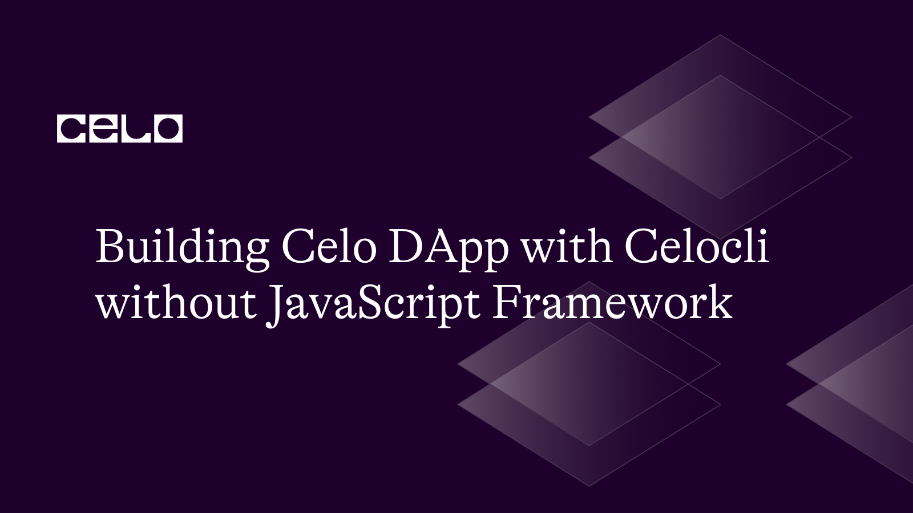
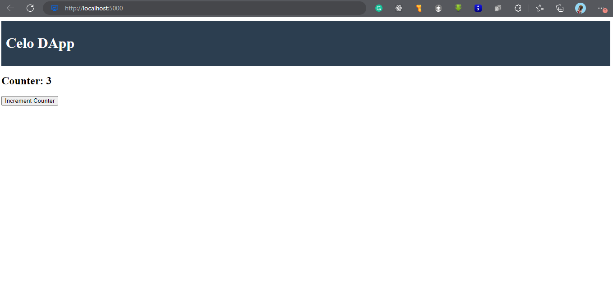

## Introduction

When building web applications, the use of frameworks can make development easier by abstracting technical details. However, this can leave developers with a limited understanding of the underlying technology. In this tutorial, we will take a different approach by building a Celo DApp entirely on our local machine without using a JavaScript framework or an online IDE. This will allow beginners and intermediate developers to gain a deeper understanding of web development and blockchain technology.
We will be using Celocli, a command-line interface tool that allows us to interact with the Celo network and build DApps on the Celo blockchain. With Celocli, we can create and manage Celo accounts, deploy smart contracts, and interact with our DApp directly from our local machine.
Throughout the tutorial, we will explain the necessary concepts and steps needed to build a functional Celo DApp using HTML, CSS, JavaScript, and Solidity. By the end of this tutorial, you will have a comprehensive understanding of the development process and be able to create your own DApps on the Celo blockchain.

## Prerequisite

- Basic knowledge of HTML, CSS, JavaScript, and Solidity (Not compulsory)
- Node.js and NPM installed on your local machine
- A Celo wallet and account set up
- Celocli installed on your local machine

Note that, the installation of NodeJS comes with NPM installed. It is important to pay attention to that to avoid confusion on how to install NPM. Also, those are prerequisites but are not requirements to follow along. I will try my best to ensure clear explanations are made at every stage to ensure understanding for beginners and experts.

## Let’s get started

“Where shall I begin, please your Majesty?" he asked.
"Begin at the beginning," the King said gravely, "and go on till you come to the end: then stop.”

## The Beginning - Setup project.

Since the whole development process will be on our local machine, it is important to organise the projects to make the development faster and easier. We will create a folder where everything about this project will live and we will call it `no-js-dapp` using the below command on our terminal or bash for Windows users and move to it on the same terminal.

```bash
mkdir no-js-framework-dapp
cd no-js-framework-dapp
```

## Setup for JavaScript Development

This is simple as running a command below, the command will only work and will not produce an error only in a Nodejs installed environment. At this point, if get an error, try checking your NodeJS installation. By testing out the version of the Nodejs currently running.

```bash
npm init -y
```

Another to confirm the successful running of the above command is by checking the folder just created if there exists a file with the name `package.json` as the command will automatically create one if successfully ran.

## Dependencies Time.

It is a crucial point to note that software development can not be done in isolation and it requires a lot of things depending on one another. The same thing goes for our DApp development. There are existing developed programs and codes that we can reuse to improve our efficiency and make life easier for us. They are dependencies. At this point, I will be installing the dependencies required for this project here by running the command below.

```bash
npm install web3 @celo/contractkit dotenv
```

1. web3.js: A JavaScript library for interacting with the Celo blockchain
1. @celo/contractkit: A JavaScript library for interacting with the Celo blockchain using Celocli
1. dotenv: A package for loading environment variables from a .env file

## Keeping Secrets secret - Setting up environment variables

Create a `.env` file in the root directory of your project (directly inside the no-js-dapp folder) and add the following environment variables:

```bash
CELO_ALFAJORES_URL=https://alfajores-forno.celo-testnet.org
CELO_ALFAJORES_PK=<YOUR_PRIVATE_KEY>
```

It is important to remember to replace `YOUR_PRIVATE_KEY` with the private key of your Celo account.

## How do I get the private key?

In the Celo network, the private key associated with an account is usually stored securely in the device or application that created the account. However, if you need to access your private key for some reason, there are a few ways to do so but because we have Celocli installed we will be using it.
This is for users who do not have Celocli currently installed

- Install the Celocli tool

```bash
npm install -g @celo/celocli
```

- Create a Celo account

```bash
celocli account:create
```

It is important to note that if this command is successfully executed, it will produce some necessary output of keys which are the private key to sign transactions with our personal address.

If you have the Celocli tool installed on your machine and have set up your account using it, you can use the following command to view your private key:

```bash
celocli account:show <YOUR_ACCOUNT_ADDRESS> --privateKey
```

Replace `<YOUR_ACCOUNT_ADDRESS>` with the address of your Celo account. You will be prompted to enter your account password to view the private key.

It's important to keep your private key secure and never share it with anyone. If someone has access to your private key, they can access and control your account and all the funds associated with it.

## Connecting to the network

While running initialize Nodejs for our project. The default entry point created was `index.js` for this reason we will be creating a file with the same name and putting our code inside.

```javascript
const { ContractKit } = require("@celo/contractkit");
require("dotenv").config();

const kit = ContractKit.newKit(process.env.CELO_ALFAJORES_URL);
kit.connection.addAccount(process.env.CELO_ALFAJORES_PK);
```

This is a direct importing of the dependencies installed before and the activation of the environment variables in the `.env` file using the dotenv package installed before.

## Smart contract

It is time to create the Solidity smart contract to create the interaction required. Create a new Solidity file called `MyContract.sol` and add your smart contract code. Here's an example contract that increments a counter:

```solidity
pragma solidity ^0.8.0;

contract MyContract {
    uint256 public counter;

    function incrementCounter() public {
        counter++;
    }
}
```

## Compiling the smart contract

To put the contract created in action, it is needed to be compiled and to do this we will be leveraging on hardhat with the help of npx. Compiling smart contract with the command below. What it does is to create a build folder for the compiled contracts to live in.

```bash
npx hardhat compile
```

## Deploying the smart contract

After successful compilation, the next step is deployment. This will be done with an update to the `index.js` file with the following code.

```javascript
const MyContract = require("./build/contracts/MyContract.json");

async function deployContract() {
  const accounts = await kit.web3.eth.getAccounts();
  const from = accounts[0];

  const contract = new kit.web3.eth.Contract(MyContract.abi, {
    data: MyContract.bytecode,
  });

  const deployTx = contract.deploy().send({ from });
  const contractInstance = await deployTx;

  console.log(
    `Contract deployed at address: ${contractInstance.options.address}`
  );
}

deployContract();
```

Note: this is an update to the file, not a replacement.
This will deploy your contract to the Celo network and log the contract address in the console.

## Let’s build the interface

- Step 1: Create `index.html` and add the code below to it

```html
<!DOCTYPE html>
<html>
  <head>
    <title>Celo DApp</title>
    <script src="./index.js"></script>
  </head>
  <body>
    <Repace me later>
</body>
```

- Step 2: Create a new CSS file called style.css and add your styles. Here's an example style for the header:

```css
header {
  background-color: #2c3e50;
  color: white;
  padding: 10px;
}
```

- Step 3: Create a new JavaScript file called app.js and add the following code to interact with your smart contract:

```javascript
const MyContract = require("./build/contracts/MyContract.json");

async function incrementCounter() {
  const accounts = await kit.web3.eth.getAccounts();
  const from = accounts[0];

  const contract = new kit.web3.eth.Contract(
    MyContract.abi,
    "<YOUR_CONTRACT_ADDRESS>"
  );

  await contract.methods.incrementCounter().send({ from });
}

document.getElementById("increment").addEventListener("click", async () => {
  await incrementCounter();
  location.reload();
});
```

Replace <YOUR_CONTRACT_ADDRESS> with the address of your deployed smart contract.

- Step 4: Update the `index.html` with the below code

```html
<header>
  <h1>Celo DApp</h1>
</header>
<main>
  <h2>Counter: <span id="counter"></span></h2>
  <button id="increment">Increment Counter</button>
</main>
```

This will create a header with the title of your DApp and a button to increment the counter. The counter value will be displayed in the span element.

## Test your DApp

Start a local server by running the following command:

This will start a server at `http://localhost:5000`.

Open your browser and navigate to `http://localhost:5000`. You should see your Celo DApp with the counter value displayed as 0.

Click the "Increment Counter" button. You will be prompted to sign the transaction using your Celo wallet. After signing, the counter value will be incremented and the page will be reloaded with the updated value.



## Conclusion

Congratulations! You have successfully built a Celo DApp without using a JavaScript framework. With this foundation, you can continue to build more complex DApps and explore the full potential of the Celo blockchain. See the GitHub repository [here](https://github.com/Taiwrash/no-js-framework).

## About the Author

Hey, I am Rasheed Mudasiru. A software developer who is passionate about community, open source and developer relations: I write about DevOps, automation, deployments and cloud computing.
