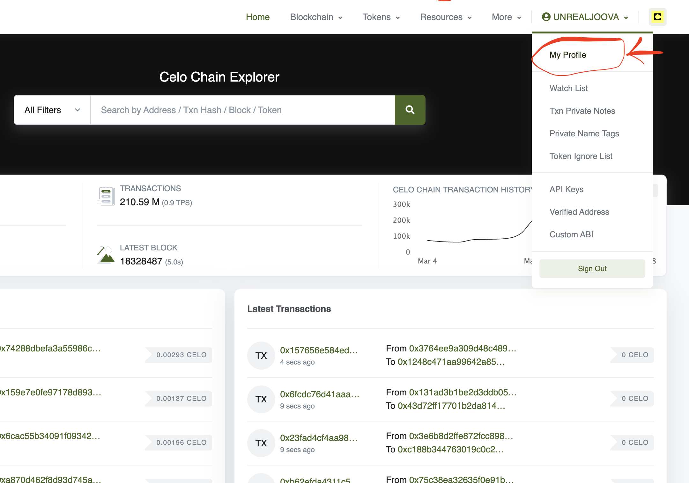
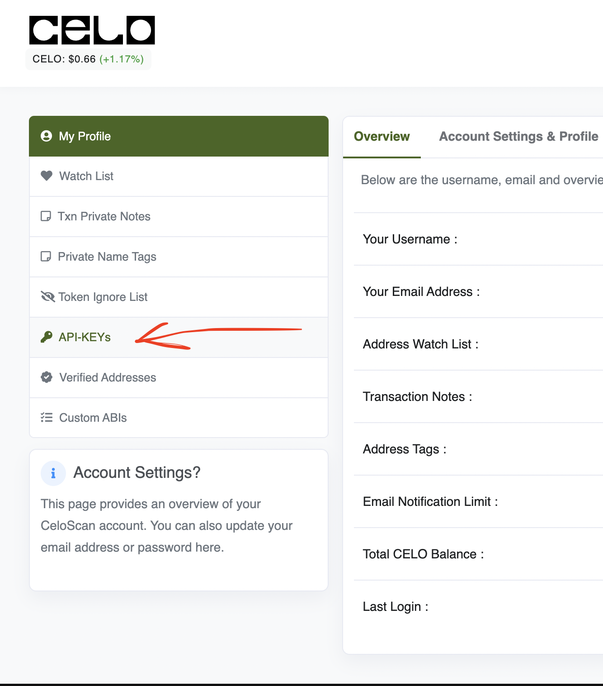
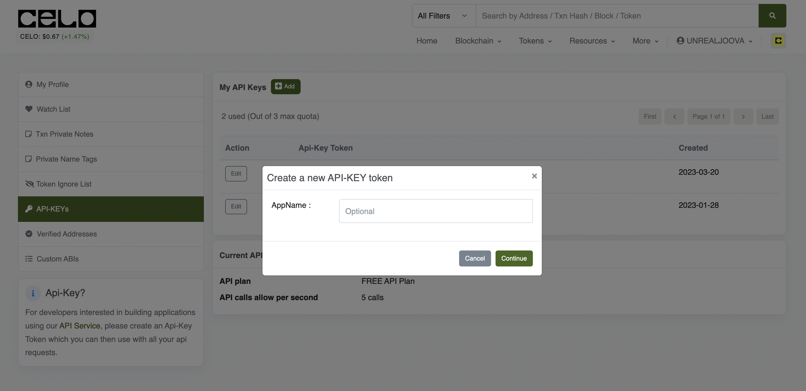
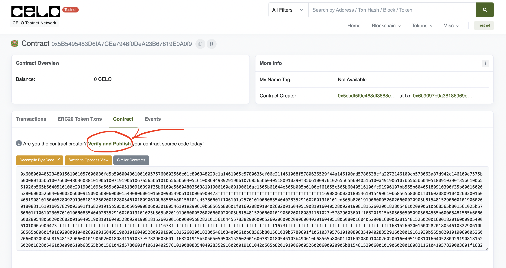
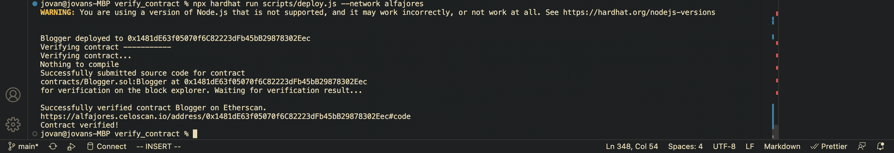
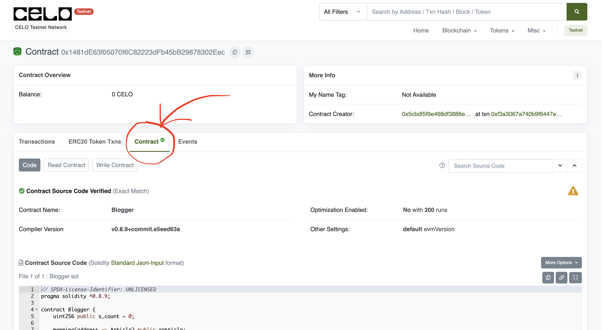

## Introduction

This tutorial covers automating smart contract verification using Hardhat on Celoscan. It includes setting up Hardhat, creating a simple smart contract, and automating the verification process on Celoscan without leaving your development environment. We explore the best practices for smart contract development and writing a deploy script. Any upgrade to the contract will be automatically verified on the chain.

## Prerequisites

1. Basic knowledge of Solidity: You should have a basic understanding of Solidity, the programming language used for Ethereum smart contracts.

2. Hardhat: We will be using Hardhat as our development environment, so you should be familiar with its basic features and commands.

3. Celo's Alfajores testnet: You will need access to the Alfajores testnet to deploy and verify your smart contract. You can obtain testnet funds by following the instructions on [Celo faucet](https://faucet.celo.org/).

4. An account on Celoscan: You'll need to create an account to celoscan to obtain the API keys that will allow us to verify the deployed contracts programmatically.

## Requirements​

1. Node.js and npm: You'll need Node.js and npm installed on your system to install and run Hardhat. You can download Node.js from the official website and npm will be installed automatically along with Node.js [here](https://nodejs.org/en/download).

2. Hardhat: You'll need to install Hardhat globally on your system using npm. You can do this by running the command `npm install -g hardhat`.

3. An IDE: You'll need an IDE (Integrated Development Environment) to write and test your smart contract code. You can use any text editor or IDE of your choice, but we recommend using Visual Studio Code as it has many useful extensions for Solidity development.

## Setting up the project

To create this project, we're going to set up a simple hardhat project with a smart contract and we'll deploy it to celoscan for verification.

Create a new hardhat project in your terminal by typing;

```bash
npm install --save-dev hardhat
```

or

```bash
yarn add --dev hardhat
```

Next run `npx hardhat`

Output;

```bash
$ npx hardhat
888    888                      888 888               888
888    888                      888 888               888
888    888                      888 888               888
8888888888  8888b.  888d888 .d88888 88888b.   8888b.  888888
888    888     "88b 888P"  d88" 888 888 "88b     "88b 888
888    888 .d888888 888    888  888 888  888 .d888888 888
888    888 888  888 888    Y88b 888 888  888 888  888 Y88b.
888    888 "Y888888 888     "Y88888 888  888 "Y888888  "Y888

Welcome to Hardhat v2.10.0

? What do you want to do? …
▸ Create a JavaScript project
  Create a TypeScript project
  Create an empty hardhat.config.js
  Quit
```

Select a `Create JavaScript project` to scaffold a new hardhat configured project.

### Creating the contract

Under the `/contracts` folder create a new contract `Blogger.sol`. This is where we've created a simply create and read the contract, as shown below,

```js
// SPDX-License-Identifier: UNLICENSED
pragma solidity ^0.8.9;

contract Blogger {
    uint256 public s_count = 0;

    struct Article {
        uint256 id;
        address owner;
        string title;
        string content;
    }

    Article[] s_articles;

    function createArticle(string memory title, string memory content) public {
        s_articles.push(Article(s_count, msg.sender, title, content));

        s_count += 1;
    }

    function getArticles() public view returns (Article[] memory) {
        return s_articles;
    }

    function getCount() public view returns (uint256) {
        return s_count;
    }
}
```

The contract has a state variable called "s_count" which is used to keep track of the number of articles created. Initially, it starts at 0.

The `Article` struct is defined with four properties: `id`, `owner`, `title`, and `content`. `id` is a unique identifier for each article, `owner` is the address of the user who created the article, `title` is the title of the article, and `content` is the main content of the article.

The `s_articles` array is used to store all the articles that are created.

The `create article` function allows a user to create a new article with a unique id, the address of the user who created it.

It takes two parameters, `title` and `content` the provided title and content. The function then increments the `s_count` variable by 1.

The `getArticles` and `getCount` are the contract's getter functions that return an array of all the articles and the current value of `s_count` respectively.

Overall, this smart contract is a basic example of how to create and retrieve data on the Celo blockchain using Solidity.

Now that the contract code is done, we can successfully compile the code.

In your terminal;

```bash
npx hardhat compile
```

### Writing the deploy script

The deploy script uses the Hardhat framework to interact with the Celo network and in this case, we'll use the built-in ethers js library that comes with hardhat.

```js
const { ethers } = require('hardhat')

async function main() {
  const Contract = await ethers.getContractFactory('Blogger')
  const blogger = await Contract.deploy()

  await blogger.deployed()

  console.log(`Blogger deployed to ${blogger.address}`)
}

main().catch((error) => {
  console.error(error)
  process.exitCode = 1
})

```

Inside the `main` function, we first get the contract factory for our smart contract using the `ethers.getContractFactory` method with the contract's name which is "Blogger". Then, we deploy the contract with the `.deploy()` method which is an instance of the created Contract.

`blogger.deployed()` helps us to wait until the contract is successfully deployed before we carry out any other tasks on it.

The last few lines of the code use a recommended pattern for handling errors when using async/await.

Note that this code does not automate the verification process on Celoscan. To automate the verification process, we need to add additional code to the deploy script which we will cover in the next section.

### Configuring network paths and variables in hardhat config

The `hardhat.config.js` file is where we configure our project's network paths and variables for deployment. In this code, we have defined the default network as 'hardhat', which is a local network for testing. We have also defined two other networks, localhost, and alfajores.

As shown in the code below;

```js
require("@nomicfoundation/hardhat-toolbox");
require("dotenv").config();

const { ALFAJORES_API_KEY, ALFAJORES_URL, PRIVATE_KEY } = process.env;

/** @type import('hardhat/config').HardhatUserConfig */
module.exports = {
  defaultNetwork: "hardhat",
  networks: {
    hardhat: {
      chainId: 31337,
    },
    localhost: {
      url: "http://127.0.0.1:8545",
      chainId: 31337,
    },
    alfajores: {
      url: ALFAJORES_URL,
      accounts: [PRIVATE_KEY],
      chainId: 44787,
    },
  },
  solidity: {
    compilers: [
      {
        version: "0.8.9",
      },
      {
        version: "0.8.7",
      },
      {
        version: "0.6.6",
      },
    ],
  },
  namedAccounts: {
    deployer: {
      default: 0,
    },
  },
  etherscan: {
    apiKey: {
      alfajores: ALFAJORES_API_KEY,
    },
    customChains: [
      {
        network: "alfajores",
        chainId: 44787,
        urls: {
          apiURL: "https://api-alfajores.celoscan.io/api",
          browserURL: "https://alfajores.celoscan.io/",
        },
      },
    ],
  },
};
```

The `ALFAJORES_API_KEY`, `ALFAJORES_URL`, and `PRIVATE_KEY` are environment variables that contain sensitive information that should not be hard-coded into your code. This is why we use the `.env` package to separate them from the main codebase.

The `ALFAJORES_API_KEY` will help us call the Celoscan to verify API to verify the contract programmatically. Therefore you need to obtain this before you can proceed with the tutorial.

### Obtain API key from Celoscan

To get `ALFAJORES_API_KEY`, you need to create an account on Celoscan Explorer [here](https://celoscan.io/) and create an API key from your profile settings. This key will give you access to the Celo blockchain and enable you to interact with it programmatically.

Create an account on Celoscan and go to your profile as shown in the image.



Click on the API tab on the left.



Create an AppName and celoscan will automatically generate an API key for your app.



Now that all our variables are successfully populated, we can now deploy the contract to the alfajores network.

Make sure your deployer account has some test funds to pay for the deployment gas fees. You can get test funds on the cel faucet [here](https://faucet.celo.org/)

### Deploying the contract

In your terminal, to deploy your contract, type,

```bash
npx hardhat run scripts/deploy.js --network alfajores
```

Output:

```bash
Compiled 1 Solidity file successfully
Blogger deployed to 0x5B5495483D6fA7CEa7948f0DeA23B67819E0A0f9
```

The contract was successfully deployed to Celo Alfajores at the address: [0x5B5495483D6fA7CEa7948f0DeA23B67819E0A0f9](https://alfajores.celoscan.io/address/0x5B5495483D6fA7CEa7948f0DeA23B67819E0A0f9#code)

By inspecting the address on-chain, we can see that the contract was deployed, but not yet verified.



There are two options we can take to verify the contract.

1. Using the manual process on the celoscan website directly. But this is not suitable especially when you're constantly updating the contract and redeploying it on the chain, it'll mean that you have to redo it over and over again.
2. We can create a separate verify function in the deploy script that automatically verifies the contract when it gets deployed to the network.
   By doing this, we won't even have to worry about opening the verify contract form every time we update the contract to a new address.

### Creating the verified contact script

As we explained in the previous bulletin, we'll create a separate verify script that will be automatically triggered when a new contract has been deployed to the network to verify it.

In the parent root of the project, create a new folder `/utils` and inside it, create a file called `verifyContract.js`.

Fill in the code as shown below:

```js
const { run } = require("hardhat");

const verifyContract = async (contractAddress) => {
  console.log("Verifying contract...");
  try {
    await run("verify:verify", {
      address: contractAddress,
    });

    console.log("Contract verified!");
  } catch (err) {
    console.log(err);
  }
};

module.exports = { verifyContract };
```

The `verifyContract.js` will be responsible for automatically verifying the smart contract once it has been deployed to the network. This script uses Hardhat's built-in verify task to verify the contract's bytecode on the blockchain.

Import the run function from Hardhat, which allows us to execute tasks from the command line.

We also create an async function called `verifyContract` that takes in the `contractAddress` parameter, which is the address of the smart contract we want to verify once deployed.

We call the run function with the `verify:verify` command, which tells Hardhat to run the contract verification task. We pass in the `contractAddress` as an argument to the command. If the verification is successful, we log a message saying that the contract has been verified. If there's an error, we log the error to the console.

Finally, we export the `verifyContract` function so we can use it in our deploy script.

### Updating the deploy script

Now that the `verfyContract` functionality is complete, we can call it in the deploy script exactly after when the contract has been deployed.

Update the `deploy.js` script by defining the `verifyContract` function as shown below.

```js
const { ethers } = require("hardhat");
const { verifyContract } = require("../utils/verifyContract");

async function main() {
  const Contract = await ethers.getContractFactory("Blogger");
  const blogger = await Contract.deploy();

  await blogger.deployed();

  const contractAddress = blogger.address;

  console.log(`Blogger deployed to ${blogger.address}`);

  console.log("Verifying contract -----------");

  await verifyContract(blogger.address);
}

main().catch((error) => {
  console.error(error);
  process.exitCode = 1;
});
```

Now we're calling the `verifyContract` function and passing in the deployed contract address to verify it on celoscan.

By running the deploy script every time, the deployed contract will be automatically verified all the time.

To run the deploy script in your terminal type:

```bash
npx hardhat run scripts/deploy.js --network alfajores
```

Output:



The contract was automatically verified on celoscan, and we can confirm that at this out on celoscan [here](https://alfajores.celoscan.io/address/0x1481dE63f05070f6C82223dFb45bB29878302Eec#code)

This time, the contract has a nice tick to show that it's verified and the code is readable.



## Conclusion​

In this tutorial, we've learned how to create, compile, deploy, and verify automatically a smart contract using Hardhat. We've also explored how to configure network paths and variables in the Hardhat config file. Hardhat is a powerful development environment that makes it easy to build, test, and deploy smart contracts, and we hope this tutorial has provided a helpful introduction to its capabilities.

## Next Steps​

1. Explore the different features and plugins available in the Hardhat framework, such as testing and debugging tools, deployment scripts, and network management tools.

2. Learn more about Solidity and smart contract development by building more complex applications and exploring advanced topics like security, optimization, and gas fees.

3. Join the vibrant community of developers building on Hardhat and Celo, participate in hackathons and developer challenges, and connect with other like-minded individuals through social media, forums, and online communities.

4. Continue to improve your skills and knowledge by reading the celo documentation, attending workshops and conferences, and following the latest trends and best practices in celo blockchain.

## About the Author​

Created by Jovan Mwesigwa B, Blockchain, Solidity developer

Reach out:
Twitter: [@unreal_joova](http://twitter.com/unreal_joova)
Github: [JovanMwesigwa](https://github.com/JovanMwesigwa)
Linkedin: [JovanMwesigwa](https://www.linkedin.com/in/jovan-mwesigwa/)

## References​

- [Developers Celo](https://celo.org/developers) For Celo dev setup
- [Hardhat docs](https://hardhat.org/hardhat-runner/docs/guides/project-setup) Installion configuration and verification
- [Project code](https://github.com/JovanMwesigwa/automate-smartcontract-verification-on-celoscan) Github
