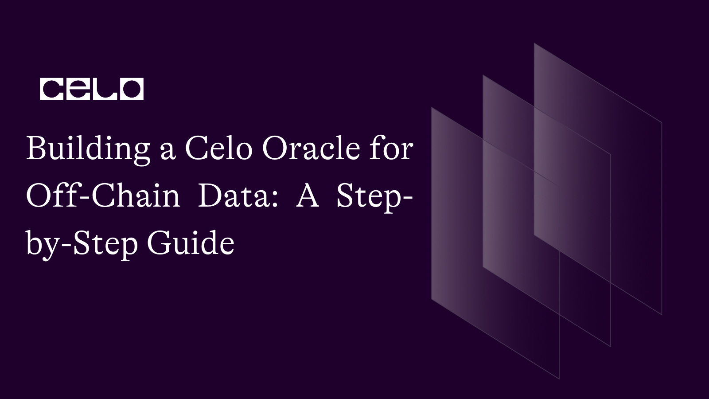

## Introduction

Have you ever wondered how blockchain applications get information from the real world? In this tutorial, we'll learn how to build a Celo oracle that connects off-chain data to the Celo blockchain. We'll create a smart contract using Solidity, fetch data with JavaScript, set up a server using Node.js, and finally use the Celo SDK to submit data to the Celo blockchain. Let's get started!

Oracles are essential components of blockchain applications, as they provide a secure bridge between on-chain and off-chain data. They are responsible for fetching and verifying real-world information before submitting it to smart contracts. Oracles play a crucial role in ensuring the accuracy and reliability of data used in decentralized applications (dApps).

## Prerequisites

Before we dive into building our Celo Oracle, make sure you're familiar with basic blockchain concepts and have a basic understanding of Solidity, JavaScript, and Node.js. It's also helpful if you have experience working with the Celo SDK.

## Requirements

Before starting, ensure you have the necessary tools and libraries installed:

- Node.js: Download and install the latest LTS version from [here](https://nodejs.org/en/download).
- Celo SDK: Install the Celo SDK by running `npm install -g @celo/celocli.`
- Truffle: Install Truffle by running `npm install -g truffle.`

## Setting Up the Development Environment

Installing the Required Tools and Libraries
First, let's ensure that you have all the required tools and libraries installed on your system:

1. Install Node.js by following the instructions on the official Node.js website.
2. Install Truffle globally by running the following command in your terminal:
   ```bash
   npm install -g truffle
   ```

3. Install the Celo SDK by running the following command:
   ```bash
   npm install -g @celo/celocli
   ```

### Creating a New Project Folder and Initializing It

1. Create a new directory for your project and navigate to it in your terminal:

   ```bash
   mkdir celo-oracle
   cd celo-oracle
   ```

2. Initialize a new Truffle project by running the following command:
   ```bash
   truffle init
   ```

This will create a new Truffle project with the following directory structure:

    celo-oracle/
    ├── contracts/
    ├── migrations/
    ├── test/
    └── truffle-config.js

## Writing the Smart Contract

1. In your project directory, create a new file in the `contracts` folder called `Oracle.sol`.
2. Open the `Oracle.sol` file in your code editor and write the following Solidity code:


  ```solidity
    //SPDX-License-Identifier: MIT
    pragma solidity ^0.8.0;

    import "@openzeppelin/contracts/access/Ownable.sol";
    import "@openzeppelin/contracts/utils/Counters.sol";

    contract Oracle is Ownable {
        using Counters for Counters.Counter;

        struct Request {
            address requester;
            string url;
            string path;
            uint256 timestamp;
            bool isCompleted;
            uint256 result;
        }

        Counters.Counter private requestIdCounter;
        mapping(uint256 => Request) private requests;

        event RequestCreated(uint256 indexed requestId, address indexed requester, string url, string path, uint256 timestamp);
        event RequestFulfilled(uint256 indexed requestId, uint256 result);

        function createRequest(string memory url, string memory path) external {
            requestIdCounter.increment();
            uint256 requestId = requestIdCounter.current();

            requests[requestId] = Request({
                requester: msg.sender,
                url: url,
                path: path,
                timestamp: block.timestamp,
                isCompleted: false,
                result: 0
            });

            emit RequestCreated(requestId, msg.sender, url, path, block.timestamp);
        }

        function fulfillRequest(uint256 requestId, uint256 result) external onlyOwner {
            require(!requests[requestId].isCompleted, "Request has already been fulfilled");

            requests[requestId].isCompleted = true;
            requests[requestId].result = result;

            emit RequestFulfilled(requestId, result);
        }

        function getRequest(uint256 requestId) external view returns (Request memory) {
            return requests[requestId];
        }

        function getData() public view returns (uint256) {
            Request memory request = requests[requestIdCounter.current()];
            require(request.isCompleted, "Request is not yet fulfilled");
            return request.result;
        }
    }
  ```

This Oracle smart contract uses OpenZeppelin's `Ownable` contract to restrict certain functions to the contract owner (i.e., the Oracle provider) and the `Counters` library to manage request IDs. The contract has the following features:

- Users can create requests for off-chain data by providing a URL and a path (e.g., a JSON path to extract the desired data from the API response).
- The contract owner (oracle provider) can fulfill requests by submitting the fetched data.
- Users can retrieve their request details, including the result, if the request has been fulfilled.
- The contract emits events when requests are created and fulfilled.

The contract includes the `createRequest` function for users to submit requests, the `fulfillRequest` function for the contract owner to submit fetched data, and the `getRequest` function for users to retrieve request details.

## Compiling and Deploying the Smart Contract to the Celo Test Network

1. In the `migrations` directory, create a new file named `2_deploy_oracle.js` and add the following code to deploy the Oracle contract:


      ```javascript
      const Oracle = artifacts.require("Oracle");

      module.exports = function (deployer) {
        deployer.deploy(Oracle);
      };
      ```

2. Update the `truffle-config.js` file to include the Celo network configuration:

    ```javascript
    const ContractKit = require("@celo/contractkit");
    const Web3 = require("web3");

    const web3 = new Web3("https://alfajores-forno.celo-testnet.org");
    const kit = ContractKit.newKitFromWeb3(web3);

    // Add your private key and account address
    const privateKey = "your_private_key";
    const accountAddress = "your_account_address";

    kit.addAccount(privateKey);

    module.exports = {
      networks: {
        development: { host: "127.0.0.1", port: 7545, network_id: "*" },
        alfajores: {
          provider: kit.connection.web3.currentProvider,
          network_id: 44787,
          from: accountAddress,
          gas: 6721975,
          gasPrice: 20000000000,
        },
      },
      compilers: {
        solc: {
          version: "0.8.0",
        },
      },
    };

   ```

3. Replace `your_private_key` and `your_account_address` with your private key and account address, respectively.
4. Now, compile the smart contract and deploy it to the Celo Alfajores test network:


      ```bash
      truffle compile
      truffle migrate --network alfajores
      ```

You should see something like this:


Take note of the deployed Oracle contract address for later use.

## Setting Up the Off-Chain Server

1. Create a new file called `index.js` in the `server` folder and write the following JavaScript code to set up the off-chain server:


      ```javascript
      const express = require("express");
      const axios = require("axios");
      const Web3 = require("web3");
      const ContractKit = require("@celo/contractkit");
      const { response } = require("express");

      const privateKey = "your_private_key";
      const accountAddress = "your_account_address";
      const oracleAddress = "deployed_oracle_contract_address";
      const alfajoresRPC = "https://alfajores-forno.celo-testnet.org";
      const web3 = new Web3(alfajoresRPC);
      const kit = ContractKit.newKitFromWeb3(web3);
      kit.addAccount(privateKey);

      const Oracle = require("../build/contracts/Oracle.json");
      const oracleContract = new kit.web3.eth.Contract(Oracle.abi, oracleAddress);

      const app = express();
      app.use(express.json());

      app.post("/submit-data", async (req, res) => {
        const { requestId, url, path } = req.body;

        try {
          const response = await axios.get(url);
          const result = response.data[path];

          const tx = await oracleContract.methods
            .fulfillRequest(requestId, result)
            .send({ from: accountAddress });

          res.send({ status: "success", message: "Data submitted successfully", tx });
        } catch (error) {
          res.status(500).send({ status: "error", message: "Error submitting data", error });
        }
      });

      const PORT = process.env.PORT || 3000;
      app.listen(PORT, () => {
        console.log(`Server is listening on port ${PORT}`);
      });
      ```

3. Make sure to replace `your_private_key`, `your_account_address`, and `deployed_oracle_contract_address` with your own private key, account address, and the deployed Oracle contract address, respectively.

The off-chain server is set up with an Express.js application, which listens for incoming requests to submit data to the Oracle smart contract. The `/submit-data` endpoint expects a request with the request ID, the URL of the off-chain data source, and the path to the desired data. The server fetches the data using Axios and submits it to the Oracle contract using the `fulfillRequest` method.

## Fetching Off-Chain Data Using a RESTful API

In your `index.js` file, add a new function to fetch data from a RESTful API, such as the OpenWeatherMap API. You will need an API key to access the OpenWeatherMap API; you can sign up for a free API key at https://openweathermap.org/appid.

- Add the OpenWeatherMap API key to your `index.js` file:


      ```javascript
      const OPEN_WEATHER_API_KEY = "your_openweathermap_api_key";
      ```

- Replace `your_openweathermap_api_key` with your own API key.
- Create a new function called `fetchWeatherData` to fetch weather data for a given city:


      ```javascript
      async function fetchWeatherData(city) {
        const url = `http://api.openweathermap.org/data/2.5/weather?q=${city}&appid=${OPEN_WEATHER_API_KEY}`;
        const response = await axios.get(url);
        const weatherData = response.data;

        return weatherData;
      }
      ```

- In the `/submit-data` endpoint, call the `fetchWeatherData` function and process the fetched data before submitting it to the Oracle contract. For example, you can submit the temperature in Celsius:


      ```javascript
      app.post("/submit-data", async (req, res) => {
        const { requestId, city, path } = req.body;

        try {
          const weatherData = await fetchWeatherData(city);
          const kelvinTemperature = weatherData.main.temp;
          const celsiusTemperature = kelvinTemperature - 273.15;
          const result = Math.round(celsiusTemperature * 100) / 100; // Round to 2 decimal places

          const tx = await oracleContract.methods
            .fulfillRequest(requestId, result)
            .send({ from: accountAddress });

          res.send({ status: "success", message: "Data submitted successfully", tx });
        } catch (error) {
          res.status(500).send({ status: "error", message: "Error submitting data", error });
        }
      });
      ```

With these changes, the off-chain server now fetches weather data for a given city using the OpenWeatherMap API, processes the data to extract the temperature in Celsius, and submits the temperature to the Oracle smart contract. The `/submit-data` endpoint expects a request with the request ID, the city name, and the path to the desired data.

## Submitting the Fetched Data to the Celo Blockchain Using the Celo SDK

In the previous section, we already connected to the Celo test network using the Celo SDK and instantiated a new instance of the Oracle smart contract. Now, we can add a new function to submit the fetched data to the Celo blockchain using the Celo SDK. The function and code should be added to the `index.js` file within the `server` folder.

1. Create a new function called `submitDataToOracle` to submit the fetched data to the Oracle smart contract:

   ```javascript
   async function submitDataToOracle(requestId, result) {
     const tx = await oracleContract.methods
       .fulfillRequest(requestId, result)
       .send({ from: accountAddress });

     return tx;
   }
   ```

2. Update the `/submit-data` endpoint to call the `submitDataToOracle` function:

   ```javascript
   app.post("/submit-data", async (req, res) => {
     const { requestId, city, path } = req.body;

     try {
       const weatherData = await fetchWeatherData(city);
       const kelvinTemperature = weatherData.main.temp;
       const celsiusTemperature = kelvinTemperature - 273.15;
       const result = Math.round(celsiusTemperature * 100) / 100; // Round to 2 decimal places

       const tx = await submitDataToOracle(requestId, result);

       res.send({
         status: "success",
         message: "Data submitted successfully",
         tx,
       });
     } catch (error) {
       res
         .status(500)
         .send({ status: "error", message: "Error submitting data", error });
     }
   });
   ```

With these changes, the off-chain server fetches the off-chain data, processes it, and then submits it to the Celo blockchain using the Celo SDK. The `/submit-data` endpoint expects a request with the request ID, the city name, and the path to the desired data. The server then calls the `submitDataToOracle` function to interact with the Oracle smart contract and submit the fetched data to the Celo blockchain.

Here's the updated `index.js` file with the new function `submitDataToOracle`:

```javascript
const express = require("express");
const axios = require("axios");
const Web3 = require("web3");
const ContractKit = require("@celo/contractkit");
const { response } = require("express");
const path = require("path");
const privateKey = "your_private_key";
const accountAddress = "your_account_address";
const oracleAddress = "deployed_oracle_contract_address";
const alfajoresRPC = "https://alfajores-forno.celo-testnet.org";
const chainId = 44787; // The chainId for the Celo Alfajores testnet
const web3 = new Web3(alfajoresRPC);
const kit = ContractKit.newKitFromWeb3(web3);
kit.addAccount(privateKey);
const Oracle = require("../build/contracts/Oracle.json");
const oracleContract = new kit.web3.eth.Contract(Oracle.abi, oracleAddress);
const OPEN_WEATHER_API_KEY = "your_openweathermap_api_key";
async function fetchWeatherData(city) {
  const url = `http://api.openweathermap.org/data/2.5/weather?q=${city}&appid=${OPEN_WEATHER_API_KEY}`;
  const response = await axios.get(url);
  const weatherData = response.data;
  return weatherData;
}
async function submitDataToOracle(requestId, result) {
  const txObject = oracleContract.methods.fulfillRequest(requestId, result);
  const gas = await txObject.estimateGas({ from: accountAddress });

  const tx = await txObject.send({ from: accountAddress, gas, chainId });

  return tx;
}

const app = express();
app.use(express.json());
app.post("/submit-data", async (req, res) => {
  const { requestId, city, path } = req.body;
  try {
    const weatherData = await fetchWeatherData(city);
    const kelvinTemperature = weatherData.main.temp;
    const celsiusTemperature = kelvinTemperature - 273.15;
    // Convert the floating-point temperature to an integer
    const temperatureInt = Math.round(celsiusTemperature * 100);
    // Submit the integer temperature value to the Oracle smart contract
    const tx = await submitDataToOracle(requestId, temperatureInt);
    res.send({ status: "success", message: "Data submitted successfully", tx });
  } catch (error) {
    res.status(500).send({
      status: "error",
      message: "Error submitting data",
      error: error.message ? error.message : error,
    });
  }
});
app.use(express.static(path.join(__dirname, "../client/build")));
app.get("*", (req, res) => {
  res.sendFile(path.join(__dirname, "../client/build", "index.html"));
});
const PORT = process.env.PORT || 3000;
app.listen(PORT, () => {
  console.log(`Server is listening on port ${PORT}`);
});
```

In this updated `index.js` file, we've added the `submitDataToOracle` function and replaced the previous contract method call with the new function. The `submitDataToOracle` function takes the request ID and the result (the fetched weather data), and it submits the data to the Oracle smart contract on the Celo blockchain.

## Testing the Oracle Service

Now that you've implemented the Oracle smart contract, and off-chain server, and updated the `index.js` file, it's time to test the Oracle service.

1. Start the off-chain server by running the following command in the terminal:
   ```bash
   node server/index.js
   ```

You should see this:


2. In a separate terminal window, use `curl` or a tool like Postman to test the `/submit-data` endpoint. Send a POST request with the request ID, city name, and path to the desired data in the request body:

For this tutorial, we will be using Postman, here are the steps;

1. Download and install Postman from here.
2. Open Postman.
3. Click on the "+" button to create a new request.
4. In the request's dropdown menu, select "POST".
5. Enter the URL `http://localhost:3000/submit-data` in the address bar.
6. Click on the "Body" tab, then select "raw" and choose "JSON" from the dropdown menu.
7. Copy and paste the following JSON content into the text area:


      ```json
      {
        "requestId": 1,
        "city": "San Francisco",
        "path": "main.temp"
      }
      ```

8. Click the "Send" button to send the POST request to the `/submit-data` endpoint.

If the request is successful, you should receive a response similar to this:

  ```json
  {
    "requestId": 1,
    "city": "San Francisco",
    "path": "main.temp"
  }
  ```

This means that the off-chain server has fetched the weather data for San Francisco and submitted it to the Oracle smart contract on the Celo blockchain.

Clicking send, we encountered this error:


The error we encountered is related to the handling of numeric values in the Oracle smart contract or server code. The "underflow" error occurs when a numeric operation produces a value that is too small to be represented within the limits of the BigNumber type used in Ethereum-based smart contracts.

To resolve this error, we need to review the Oracle smart contract and server code to identify the point at which the underflow occurs. It might be related to the handling of the temperature data received from the OpenWeatherMap API.

Based on our smart contract and server code, it appears that we are already rounding the temperature value to two decimal places before submitting it to the Oracle smart contract. However, you're still submitting a floating-point number, which could lead to the underflow error experienced.

To resolve this issue, we are going to convert the floating-point temperature value to an integer by multiplying it by a factor (e.g., 100) before submitting it to the Oracle smart contract. Then, store and manage the submitted temperature values as integers in the smart contract.

Here's how to do it:

- In your server code (index.js), update the `submitDataToOracle` function call:

```javascript
// Convert the floating-point temperature to an integer
const temperatureInt = Math.round(celsiusTemperature * 100);

// Submit the integer temperature value to the Oracle smart contract
const tx = await submitDataToOracle(requestId, temperatureInt);
```

- In your Oracle smart contract (Oracle.sol), update the `fulfillRequest` function's `result` parameter type to `uint256`:

```solidity
function fulfillRequest(uint256 requestId, uint256 result) external onlyOwner {
    // ...
}
```

Now, the submitted temperature values will be stored as integers in the smart contract. When you need to retrieve the original floating-point value, divide the integer by the same factor you used when submitting the data (e.g., 100). You can do this in your frontend code or create a new function in your Oracle smart contract to return the floating-point value.

Clicking the "Send" button to send the POST request to the `/submit-data` endpoint.
If the request is successful, you should receive a response similar to this:

```json
{
  "status": "success",
  "message": "Data submitted successfully",
  "tx": {
    "blockHash": "0x199b76ca7dd692fb4c8b8f1e475f5d1d8875c13613bb7c749f1948e077ff346d",
    "blockNumber": 17309238,
    "contractAddress": null,
    "cumulativeGasUsed": 66645,
    "effectiveGasPrice": 25000000000,
    "from": "0x76ff85179a333d057d855ce6a3b6690cf28effc2",
    "gasUsed": 66645,
    "logsBloom": "0x00000000000000000000000000000000000000000000000000000000000000000000000000001000000000000004000000000000000000000000000000040000000008000000000000000000000000000000000000040000000000000000000000000000000000000000000000000000000000000000000000000000000000000000000000000000000000000000000000000000000000000000000000000000020000000000000000000000000000000000000000000200000000000000000000000000000000000000000000000000000000010000000000000000000040000000000000000000000000000000000000000000000000000000000000000000",
    "status": true,
    "to": "0x25f726f284de4fe1a134a7d012dc72de8e301b05",
    "transactionHash": "0x318ee919b64b66bb20ca2fe783dc56985c560ac40afc85934280d94a38558992",
    "transactionIndex": 0,
    "type": "0x0",
    "events": {
      "RequestFulfilled": {
        "address": "0x25F726F284de4FE1a134a7d012dC72dE8E301B05",
        "blockNumber": 17309238,
        "transactionHash": "0x318ee919b64b66bb20ca2fe783dc56985c560ac40afc85934280d94a38558992",
        "transactionIndex": 0,
        "blockHash": "0x199b76ca7dd692fb4c8b8f1e475f5d1d8875c13613bb7c749f1948e077ff346d",
        "logIndex": 0,
        "removed": false,
        "id": "log_ae314c99",
        "returnValues": {
          "0": "1",
          "1": "822",
          "requestId": "1",
          "result": "822"
        },
        "event": "RequestFulfilled",
        "signature": "0x5c69e7026b653d8606b5613bb00fd8c4b0504b1cbe8db600c406faac180924d5",
        "raw": {
          "data": "0x0000000000000000000000000000000000000000000000000000000000000336",
          "topics": [
            "0x5c69e7026b653d8606b5613bb00fd8c4b0504b1cbe8db600c406faac180924d5",
            "0x0000000000000000000000000000000000000000000000000000000000000001"
          ]
        }
      }
    }
  }
}
```


The response contains the transaction details, including the `transactionHash`, `blockNumber`, and other relevant information.
You can now use this setup to make more requests with different city names, and the server will fetch the weather data and submit it to the Oracle smart contract. Just make sure to increment the `requestId` for each new request you make.
Additionally, you can interact with the Oracle smart contract to retrieve the data that was submitted or to make new requests.

4. Finally, you can interact with the Oracle smart contract on the Celo test network to verify that the data has been submitted successfully. Use a tool like Remix, Truffle, or the Celo SDK to call the `getRequest` function with the request ID, and you should see the submitted data in the

## Interacting with the Oracle Service

To interact with the Oracle smart contract and call the `getRequest` function using the Celo SDK, you can follow these steps:

1. First, make sure you have `@celo/contractkit` installed:

```bash
npm install @celo/contractkit
```

2. Create a new JavaScript file called `interact.js`:

```bash
touch interact.js
```

3. Open `interact.js` and paste the following code:

```javascript
const Web3 = require("web3");
const ContractKit = require("@celo/contractkit");
const Oracle = require("./build/contracts/Oracle.json");

const alfajoresRPC = "https://alfajores-forno.celo-testnet.org";
const web3 = new Web3(alfajoresRPC);
const kit = ContractKit.newKitFromWeb3(web3);

const oracleAddress = "0x25F726F284de4FE1a134a7d012dC72dE8E301B05";
const oracleContract = new kit.web3.eth.Contract(Oracle.abi, oracleAddress);

async function getRequest(requestId) {
  const request = await oracleContract.methods.getRequest(requestId).call();
  console.log(request);
}

const requestId = 1; // Replace this with the requestId you want to query
getRequest(requestId);
```

Make sure to replace the `oracleAddress` with the address of your deployed Oracle contract.

4. Run the script:

```bash
node interact.js
```

The script will call the `getRequest` function on your Oracle smart contract with the provided `requestId` and print the result to the console.
You should see the submitted data and other request details, such as `requester`, `url`, `path`, `timestamp`, `isCompleted`, and `result`. If `isCompleted` is `true`, the data has been successfully submitted to the Oracle.


As you can see, the output includes the details of the request, such as requester, url, path, timestamp, isCompleted, and result. In this case, the `result` value is '822'. You might be wondering why the temperature in San Francisco is 822, well this has to do with the change we made to our code to avoid the underscore error.

The temperature 822 was fetched from the OpenWeatherMap API, converted to Celsius, and rounded to two decimal places. The result was then multiplied by 100 to avoid using decimals in the smart contract. So, to get the actual temperature in Celsius, you would need to divide the value by 100. In this case, the temperature would be 8.22°C.

To display the output as "8.22°C", you can modify the `interact.js` file to format the output. Update the `console.log` line in the `displayRequest` function like this:

```javascript
console.log(`${request.result / 100}°C`);
```

This line divides the result by 100 to get the actual temperature value and appends the "°C" symbol to it. Now, when you run the script, the output will be displayed as "8.22°C":

```bash
node interact.js
```


## Conclusion

In this tutorial, we have delved into the process of building a Celo Oracle for off-chain data. We have covered crucial aspects, such as setting up the Oracle, interacting with external data sources, and creating smart contracts that seamlessly work with off-chain data. By following the steps in this guide, you have successfully created a functional Celo Oracle that can access off-chain data and integrate it into your Celo-based applications.
Celo Oracles play a vital role in extending the capabilities of blockchain applications by providing access to real-world data. With this knowledge, you can now develop more sophisticated and data-driven solutions on the Celo platform, further expanding its potential use cases and broadening the scope of blockchain technology.

## What's Next?

Off-chain data integration is a crucial aspect of blockchain technology, and Celo provides a robust and accessible platform for building solutions that require access to external data. To further explore off-chain data integration and Celo Oracles, consider these follow-up resources:

- Dive into the Celo Developer Documentation to learn more about the platform and its features.
- Experiment with integrating various data sources and APIs with your Celo Oracle and explore ways to use them in your applications.
- Join the Celo community on Discord and collaborate with other developers to build innovative solutions that leverage off-chain data in Celo-based applications.

## About the Author

Oluwalana is a blockchain developer and technical writer with expertise in building decentralized applications on various platforms, including Ethereum and Celo. With a passion for sharing knowledge, Oluwalana has written numerous technical tutorials and articles on blockchain and other emerging technologies.
As an analog-by-birth and digital-by-nature individual, Oluwalana leverages a unique perspective to craft compelling stories and thought-provoking content that engages readers and inspires action. When not coding or writing, Oluwalana enjoys playing video games and exploring new technologies.
Follow Oluwalana on [Twitter](https://twitter.com/lanacreates) for more insights and updates on the latest in blockchain and emerging technologies.

## References

Here are some helpful resources and references used in creating this tutorial:

- [Source Code](https://github.com/lanacreates/Building-a-Celo-Oracle-for-Off-Chain-Data-A-Step-by-Step-Guide)
- [Celo Developer Documentation](https://docs.celo.org/)
- [Solidity](https://docs.soliditylang.org/en/v0.8.19/)
- [Node.js](https://nodejs.org/en)
- [Truffle](https://trufflesuite.com/)
- [Celo SDK](https://github.com/celo-org/celo-monorepo/tree/master/packages/sdk)
- [JavaScript](https://developer.mozilla.org/en-US/docs/Web/JavaScript)
- [Web3.js](https://web3js.readthedocs.io/en/v1.8.2/)
- [OpenWeather API](https://openweathermap.org/api)
- [Axios](https://github.com/axios/axios)
- [Postman](https://www.postman.com/)
