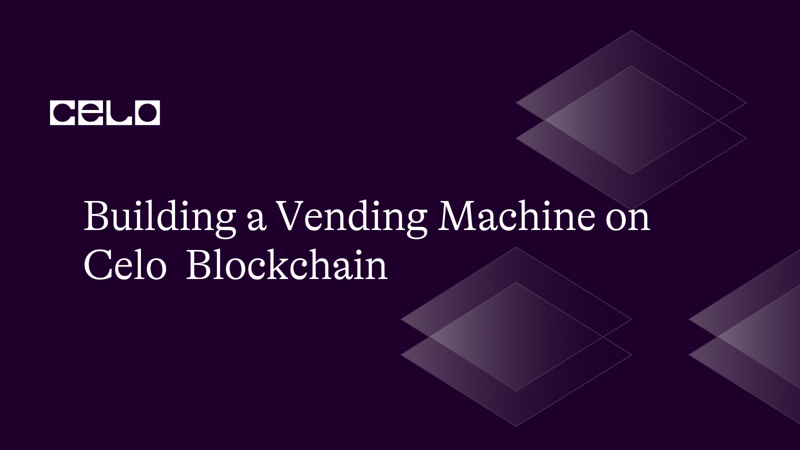

## Introduction​

A vending machine is a type of automated machine that dispenses various products to customers after they insert money or a payment card into the machine. In recent times, blockchain technology has been applied to vending machines to offer even more convenient and secure payment options.
In this tutorial, we will be creating a Celo-powered vending machine using smart contracts. We will walk through the process of setting up a Celo account, deploying a smart contract, and creating functions for purchasing and restocking the vending machine. By the end of this tutorial, you will have a working Celo-powered vending machine that can accept payments and dispense products.

## Prerequisites

- Node.js should be installed along with a node package manager(npm)
- A basic understanding of Celo and smart contracts
- A Celo Wallet address:
- To create Alfajores wallet, go to [Alfajores wallet](https://celo.org/developers/faucet)
- To get testnest funds, go to [Celo faucet ](https://faucet.celo.org/)
- A text editor such as Visual Studio Code installed on your computer
- A terminal to test our code syntax
- Remix IDE

You can clone the codes used in this tutorial by running

```bash
git clone https://github.com/emiridbest/vending_machine.git
```

## Now, let's get started;

- Step 1: Write your Voting Smart Contract and Deploy on Remix IDE
  Now, go to [Remix IDE](https://remix.ethereum.org/) and write the smart contract logic for our vending machine.

```solidity
// SPDX-License-Identifier: MIT
pragma solidity ^0.8.0;


contract VendingMachine {


    // Declare state variables of the contract

    address public owner;
    mapping (address => uint) public coffeeBalances;

    // When 'VendingMachine' contract is deployed:
    // 1. set the deploying address as the owner of the contract
    // 2. set the deployed smart contract's coffee balance to 100
    constructor() {
        owner = msg.sender;
        coffeeBalances[address(this)] = 100;

    }


    // Allow the owner to increase the smart contract's cupcake balance
    function refill(uint amount) public {
        require(msg.sender == owner, "Only the owner can refill.");
        coffeeBalances[address(this)] += amount;
    }


    // Allow anyone to purchase coffee
    function purchase(uint amount) public payable {
        require(msg.value >= amount * 1 ether, "You must pay at least 1 Celo per coffee");
        require(coffeeBalances[address(this)] >= amount, "Not enough coffee in stock to complete this purchase");
        coffeeBalances[address(this)] -= amount;
        coffeeBalances[msg.sender] += amount;
    }

    // Get balance of coffee
    function getMachineBalance() public view returns (uint) {
       return coffeeBalances[address(this)];
    }

}
```

- `address public owner` declares a state variable owner of type address that can be accessed publicly.
- `mapping (address => uint) public coffeeBalances` declares a mapping of `address` to `uint`, representing the amount of coffee owned by each address that can be accessed publicly.
- `constructor` initializes the contract by setting the owner and initial `coffeeBalances`.
- The `refill` function allows the `owner` to add more `amount` of coffee to the machine.
- The `purchase()` function allows anyone to buy `amount` of coffee using the `msg.value` sent along with the function call. It also checks if there is enough coffee in stock and if the payment sent is sufficient.
- The `getMachineBalance` function returns the balance of the vending machine (i.e., the amount of coffee it has) when called.

Afterwards, compile the contract and then deploy using injected web3 as service provider. Make sure your test wallet has funds to enable us deploy the contract and to also test out our contract much later.
Two very vital parameters to take note of on compiling and deploying our contract are;

- The contract ABI
- The Contract Address

Copy out these variables and save them somewhere as it would be used to interact with the already deployed contract.

- Step 2: Navigate to our project directory and create a new App.js file
  We shall be using the codes to be written in this file to interact with our already deployed smart contract. Make use of your favourite text editor.

- Step3: Install dependencies
  Go to a command line terminal and make sure you are in your projects root directory and run the following lines of code.

```bash
$ npm install @celo/contractkit web3
```

The `CeloContractKit` library is designed to make it easy for developers to build decentralized applications (DApps) on the Celo blockchain. It abstracts away many of the low-level details of interacting with smart contracts on the blockchain. It is a prerequisite for web3.js interaction with Celo Blockchain in specific transaction types.

- Step 4: Start Interacting with our contract
  Import all dependencies into our Voting.js file The dependencies we’re working with are web3 and contract kit;

```js
const Web3 = require("web3");
const ContractKit = require("@celo/contractkit");
```

- Step 5: Define Web3 and ContractKit
  Using Web3 allows you to connect to a Celo node by providing the node’s endpoint. In this case, you’re connected to a remote Celo Test Network Alfajores using a hosted node service named Forno. This step will also help us instantiate the network using contractKit.

```js
const web3 = new Web3("https://alfajores-forno.celo-testnet.org");
const kit = ContractKit.newKitFromWeb3(web3);
```

- Step 6: Create a contract Instance
  This is the step that links us to the contract we have already deployed on Remix. Here, we will be needing two variables - ABI and Contract address. I hope you copied them out earlier.

```js
const ContractAbi = [{...}];
const ContractAddress = "0x1468CfdFBB92a03540B0ea812f2AFfc496A1bbDb";
const contracts = new kit.web3.eth.Contract(ContractAbi, ContractAddress);
```

Make sure you parse in the appropriate values for the `ContractAddress` and `ContractAbi`.

- Step 6: Set up your account variables

```js
const PRIVATE_KEY =
  "0xa27790f81bc74d9159bb5f8c71261b8aaec6f6b0c26bed5b4fabe281cea38964"; //this is a bad practise, i only did this for simplicity
const account = web3.eth.accounts.privateKeyToAccount(PRIVATE_KEY);
```

We just parsed two important variables.
For every transaction requiring gas fees, you need a `private key` which serves as a signatory to your account funds. The account variable is your account address which serves as your identity and also your wallet.

NOTE: Never publicly share the private keys to your wallets containing your funds as this could lead to loss of funds.

- Step 7: Enable contractKit to sign your transactions using your private keys

```js
kit.connection.addAccount(account.privateKey);
kit.defaultAccount = account.address;
```

Now we begging to call our functions;

- Step 8: Call Function for purchasing a cup of coffee

```js
async function purchase(amount) {
  console.log("Preparing your coffee...");
  const gasPrice = await kit.web3.eth.getGasPrice();
  const celoInWei = amount && kit.web3.utils.toWei(amount.toString(), "ether");

  if (!amount || !celoInWei) {
    console.error("Invalid amount:", amount);
    return;
  }

  try {
    const tx = await contracts.methods.purchase(amount.toString()).send({
      from: account.address,
      value: celoInWei,
      gas: 200000,
      gasPrice: gasPrice,
    });
    console.log("Transaction hash:", tx.transactionHash);
    console.log("Here is your cup of Coffee.");
    console.log("Thanks for patronising us.");
  } catch (error) {
    console.error(`Error purchasing coffee with celo value ${amount}:`, error);
  }
}
(async function () {
  await purchase(1);
})().catch((error) => {
  console.error(error);
  process.exit(1);
});
```

This code defines an asynchronous function `purchase` that takes an argument `amount` representing the number of coffees to be purchased.

Firstly, our function retrieves the current gas price from the Celo blockchain network using the `kit.web3.eth.getGasPrice()` method.

We then convert the amount value to Celo-wei units by calling `kit.web3.utils.toWei(amount.toString(), "ether")` and assigns the resulting value to the variable `celoInWei`.
This conversion is necessary because Celo, like many other blockchain networks, stores values in the smallest unit of the currency, which is wei for Ethereum and Celo-wei for Celo.

The function checks if both the `amount` and `celoInWei` variables are truthy. If either of them is falsy, the function logs an error message to the console and returns early.

If both variables are truthy, the function tries to execute a transaction by calling the `purchase` method of the `contracts` object, passing in the `amount` value as a string and the `celoInWei` value as the transaction value.

The code then calls the `purchase` function with an argument of `1` which is the actual value of the `amount`.

If the transaction is successful, the function logs the transaction hash to the console, along with success messages. But if it fails, an error message is returned.

To test out our code function, we run this in the terminal;

```bash
node {fileName}
```

The expected output is;


This function call can also be confirmed on [Alfajore Explore](https://explorer.celo.org/alfajores);


Here, we see the transaction hash, contract address, our customers’ address, the amount we received as payment for our coffee which is 1 Celo and also the gas fee charged for the transaction.

- Step 8: Call Function for restocking our coffee machine

```js
async function refill(amount) {
  console.log("Restocking machine...");
  const gasPrice = await kit.web3.eth.getGasPrice();
  const tx = await contracts.methods
    .refill(amount)
    .send({ from: account.address, gas: 3000000, gasPrice: gasPrice });
  console.log("Transaction hash:", tx.transactionHash);
  console.log(`Coffee machine restocked with ${amount} cups of coffee`);
}

(async function () {
  await refill(100);
})().catch((error) => {
  console.error(error);
  process.exit(1);
});
```

This `async` function takes `amount` as parameter which is how many cups of coffee to be added to the machine's balance.

Inside the function, we are to retrieve current gas price using `kit.web3.eth.getGasPrice()` and stores it in the `gasPrice` variable.

Then we call the `refill` function of the `contracts` object.

Finally, an immediately invoked function expression (IIFE) is defined that calls the `refill` function with an amount of 100.

After the transaction is sent, the function logs the transaction hash and a message indicating how many cups of coffee were added to the vending machine's balance.

The expected output on running `node {fileName}` is;


Just as the first function, this can also be monitored on [Alfajore Explore](https://explorer.celo.org/alfajores).

- Step 8: Call Function for getting our coffee machine balance

```js
async function getMachineBalance() {
  console.log("Getting Coffee balance from machine...");
  const coffeeBalances = await contracts.methods.getMachineBalance().call();
  console.log("Transaction hash:", coffeeBalances.transactionHash);
  console.log("Coffee machine balance is ", coffeeBalances);
  return coffeeBalances;
}

(async function () {
  await getMachineBalance();
})().catch((error) => {
  console.error(error);
  process.exit(1);
});
```

The function first logs a message to the console indicating that it is getting the coffee balance.

It then calls the `getMachineBalance` function of the `contracts` object, which is an instance of the smart contract deployed on the Celo network.

This function is a `view` function, meaning that it does not modify the state of the contract and does not require any transaction fees to be paid.

The `call()` method is used to execute the function and retrieve its return value. The return value is stored in the `coffeeBalances` variable.

Finally, the function logs the transaction hash and the current coffee machine balance to the console, and returns the coffee balance.

## Conclusion​

That's it! I Hope you followed through. We have come to the end of this tutorial. We have learned how to create a basic vending machine smart contract on the Celo blockchain. We explored the key concepts involved in building a smart contract such as state variables, restocking purchasing and getting balances. We also covered how to connect to the Celo blockchain and interact with the smart contract using web3js and contract kit.

## Next Steps​

- You may go ahead to develop a frontend for our vending machine.

## About the Author​

Emiri Udogwu, a licensed medical doctor with a burning passion for technology and gifted with the ability for spreading knowledge and propagating ideas. A web3 and frontend developer.

## References​

- [Web3.js Documentation](https://web3js.readthedocs.io/en/v1.8.2/web3-eth.html)
- [Solidity Documentation](https://docs.soliditylang.org/_/downloads/en/latest/pdf/)
- [Contract Kit](https://docs.celo.org/developer/contractkit)
