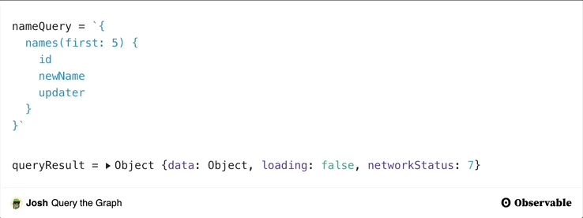

## What is Observable?

[Observable HQ](https://observablehq.com/) is a Javascript notebook tool that makes it easy to share executable Javascript code right in the browser. This greatly reduces the friction around introducing and educating people about tools or features. Observable is designed primarily as a data visualization tool, but I have found it to be helpful for explaining and demonstrating concepts and behaviors for web3 as well.

For the official introduction to Observable, [check out the 5 minute introduction.](https://observablehq.com/@observablehq/five-minute-introduction?collection=@observablehq/introduction)

## Why I like it

### Easy to setup

First of all, there is nothing to download! This is a huge benefit when introducing developers to new technology. I can show off features and techniques for using new tech without requiring developers to have to download anything or set up an environment. This makes it easier to spark curiosity and inspire people to continue on their learning journey.

<!--truncate-->

### Code + Visualizations + Text

Observable supports Javascript, Markdown and HTML in cells. This means I can write executable Javascript surrounded by markdown that helps explain the context in which this code can be used and may be useful. The notebooks are also easy to embed into other contexts (like this blog).

Here is an example from a post on Merkle Trees. You can [view the full notebook here.](https://observablehq.com/@critesjosh/merkle-trees)

<iframe width="100%" height="643" frameborder="0" className="observable-notebook"
  src="https://observablehq.com/embed/@critesjosh/merkle-trees?cells=chart%2Cp1%2Cvisualize_heading"></iframe>

### Executable Javascript

Observable allows anyone inspect the Javascript in the notebook and displays the results of the code execution. This is particularly useful to demo interactions with a connected web3 wallet or reviewing the structure of responses from API calls. Also, when code in one cell is updated, all other cells that use the code are referenced as well, kind of like hot reloading.

For example, in the [graph post](../2021-11-18-using-the-graph/index.md), I make a query to the Graph and the notebook shows a live response. Viewers can click through the notebook response to insepct the results.

### Remix + Share

Viewers can edit the Javascript in the notebook and execute their own code to see the results. They can fork their changes and save them in their own notebook to be worked on later or to share with others.

I can import common node packages into a notebook and run them as I would in an application. This allows me to quickly test things and share them.

## What I don't like

Using Observable isn't great for everything--it has its limitations.

### Limited packages

While many npm packages work with observable, not all of them do. You may need to build packages to work specifically for Observable or import minified versions from a CDN. [This tool](https://observablehq.com/@observablehq/module-require-debugger) can help you figure out how to import packages that you want to use.

### Simple, specific actions

Observable is great for showing simple interactions with packages or creating visualizations, but is not well suited for demonstrating how to design or build an application. It is a unique environment where Javascript syntax may be different than what developers are used to, so it is useful for specific things.

### Iframe limitations

Observable notebooks are easiest to embed in other pages using an [iframe](https://developer.mozilla.org/en-US/docs/Web/HTML/Element/iframe). This means the context of the notebook is limited by the same things as an iframe, which may or may not be a problem, depending on what you are trying to do. There are ways around this as well, you can link readers directly to your notebook or embed the notebook using a React component or vanilla Javascript. You can read more about embedding on the [Observable site here](https://observablehq.com/@observablehq/introduction-to-embedding).
