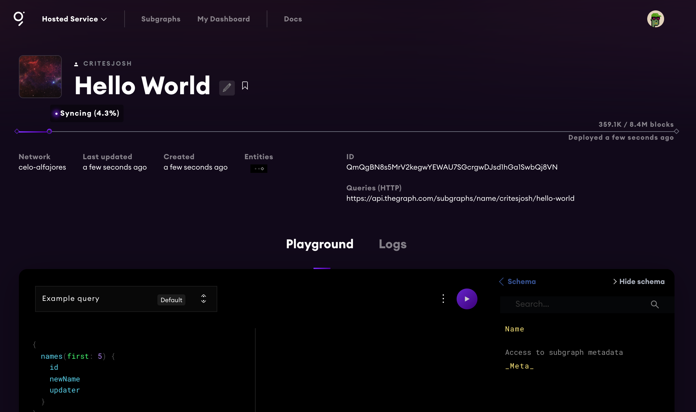

import styles from '../styles.css'

[The Graph protocol](https://thegraph.com/) makes it easy to get historical blockchain data. This can be useful when you want to check a users history of using a specific token or interacting with a specific contract. It may also be useful when collecting data about the activity around a specific contract, or set of contracts. The Graph also makes this data easy to transform, organize and share across applications.

In this post I explore

- [What the Graph is](index.md#what-is-the-graph)
- [How to get started using the Graph with Celo](index.md#using-the-graph)
- [What a subgraph is and how to create one](index.md#initialize-your-subgraph)
- [How to deploy a subgraph to the Graph's hosted service](index.md#deploy-subgraph)
- [How to query a subgraph](index.md#query-the-subgraph)

## What is the Graph?

From the Graph website:

*The Graph is a decentralized protocol for indexing and querying data from blockchains, starting with Ethereum. It makes it possible to query data that is difficult to query directly.*

The problem that the Graph solves is that indexing blockchain data is actually very difficult. Additionally, the Graph makes it easy to get historical blockchain data without having to run your own archive node or paying to access an archive node through a node service provider, like [Quicknode](https://www.quicknode.com/chains/celo).

<!--truncate-->

## Using the Graph

I will be using [this GitHub repository](https://github.com/critesjosh/the-graph-hello-world) as a reference throughout this post. This repo contains a simple [HelloWorld contract](https://github.com/critesjosh/the-graph-hello-world/blob/master/HelloWorld.sol) that stores a string that can be updated. 

`HelloWorld.sol`
```js
// HelloWorld.sol

// Learn more about Solidity here: https://solidity.readthedocs.io
pragma solidity >=0.5.0;

contract HelloWorld {
  
  event NameUpdated(string newName, address updater);
  
  // Define a string called name
  string name;

  // Declares a function called getName
  // The 'public' label means the function can be called internally, by transactions or other contracts
  // The 'view' label indicates that the function does not change the state of the contract
  // The function returns a string, from the memory data location  
  function getName() 
    public 
    view 
    returns (string memory) 
  {
    // Return the storage variable 'name'
    return name;
  }

  // Declare a function called setName
  // The function takes 1 parameter, a string, called newName, with the calldata data location in the Ethereum Virtual Machine  
  // The 'external' label means the function can only be called from an external source
  function setName(string calldata newName) 
    external 
  {
    emit NameUpdated(newName, msg.sender);
    // Set the storage variable, name, to the value passed in as newName
    name = newName;
  }
}
```

The contract emits an event every time the storage sting is updated. Event handlers in the subgraph are triggered by contract events, so setting up a contract with events is required.

It is easiest to get started using the Graph hosted service, which supports queries on the Celo network.

:::tip

You can [learn more about the Graph's hosted service here](https://thegraph.com/docs/hostedservice/what-is-hosted-service).

:::

### Install the Graph CLI

The first step is to install the graph command line tool.

```bash
npm install -g @graphprotocol/graph-cli
```

or

```bash
yarn global add @graphprotocol/graph-cli
```

:::tip

Learn more about the `graph-cli` package [here](https://www.npmjs.com/package/@graphprotocol/graph-cli).

:::

### Initialize your Subgraph

*A subgraph defines which data The Graph will index from Ethereum, and how it will store it. Once deployed, it will form a part of a global graph of blockchain data.*

:::tip

[Read more about subgraphs on the Graph website.](https://thegraph.com/docs/developer/define-subgraph-hosted)

:::

In a new, empty project directory, run the following command in the terminal:

```bash
graph init --product hosted-service --from-contract 0xd2dC7E59971E934bF479B8eA86B9Ec1627B0F3D6 --network celo-alfajores --abi <FILE> critesjosh/Hello-World
```

The CLI tool will prompt you for some additional information. Use the "Hosted Service" for creating subgraphs that query contracts on the Celo network.

For the subgraph name, enter your GitHub username followed by the name of your project. In my case this is `critesjosh/Hello-World`.

The tool will ask you to specify a directory, network and contract address that you would like to query. I chose the default directory (Hello-World), the `celo-alfajores` network, the address of my deployed Solidity contract and the path to my [contract ABI](https://docs.soliditylang.org/en/latest/abi-spec.html).

The tool sets up my subgraph in the specified directory. Open `subgraph.yml` in the new subgraph project folder to see how it is configured. You can find more information about the [Subgraph Manifest file here](https://thegraph.com/docs/developer/create-subgraph-hosted#the-subgraph-manifest).

### Define the schema

The next step is to define your graphql schema in `schema.graphql` in the new project directory.

A graphql schema is like a dictionary that defines the types of entities to map from the data and how the entities are related. This is an important step to spend some time thinking about because this will define how your data is structured and linked. Here is [sushiswap's subgraph repo](https://github.com/sushiswap/sushiswap-subgraph) as a complex project reference.

For the simple HelloWorld contract that we are querying with this subgraph, I defined the schema like this:

```graphql
type Name @entity {
  id: ID!
  newName: String
  updater: Bytes!
}
```

This will tell us the new name that is being stored in the contract, `newName`, and the account address that updated the name, `udpater`.

:::tip

[Read more about the Graph schemas here.](https://thegraph.com/docs/developer/create-subgraph-hosted#the-graphql-schema)

:::

### Define Mappings

Mappings are defined in `./src/mappings.ts` and transform the contract data (events) into the entities that are defined in `schema.graphql`. These mappings are written in a subset of Typescript. 

In this example, there is only one event being indexed, so there is only one mapping.

```ts
import { NameUpdated } from '../generated/HelloWorld/HelloWorld'
import { Name } from '../generated/schema'

export function handleNameUpdated(event: NameUpdated): void {
  let id = event.transaction.hash.toHex()
  let name = Name.load(id)
  if (name == null) {
    name = new Name(id)
  }
  name.newName = event.params.newName
  name.updater = event.params.updater
  name.save()
}
```

This mapping sets the entity `id` as the transaction hash, the entity `newName` as the newName from the event parameter and the entity `updater` as the updater from the event parameter. The mapping will update an entity if one with a known `id` already exists, but since transaction hashes are unique, each event emitted from the contract will create a new entity.

:::tip

You can find more information about mappings on [the Graph website here](https://thegraph.com/docs/developer/create-subgraph-hosted#writing-mappings).

:::

Once the mapping is defined, you can generate the Graph AssemblyScript by running

```bash
graph codegen
```

"This will generate an AssemblyScript class for every smart contract in the ABI files mentioned in subgraph.yaml, allowing you to bind these contracts to specific addresses in the mappings and call read-only contract methods against the block being processed. It will also generate a class for every contract event to provide easy access to event parameters as well as the block and transaction the event originated from."

*--[The Graph codegen docs](https://thegraph.com/docs/developer/create-subgraph-hosted#code-generation)* 

### Deploy Subgraph

To deploy the subgraph to the hosted service, you will need to create an account on [the Graph's hosted service site](https://thegraph.com/hosted-service).

From the [dashboard](https://thegraph.com/hosted-service/dashboard), you can find your Access Token for deploying the subgraph. Once you have that, you can authenticate with:

```bash
graph auth --product hosted-service <ACCESS_TOKEN>
```

Next, click the "Add Subgraph" button. Fill out the subgraph info with the appropriate information and deploy it with:

```bash
graph deploy --product hosted-service <GITHUB_USER>/<SUBGRAPH NAME>
```

Once your subgraph is deployed, you should be able to view it on the hosted service dashboard. You can view my [Hello World subgraph page here](https://thegraph.com/hosted-service/subgraph/critesjosh/hello-world).



Once the subgraph is deployed, the service will take some time to sync the events from the contract. Once it has been fully synced, you can run queries in the playground to test it out.

### Query the subgraph

You can learn more about [querying your subgraph from the hosted service here](https://thegraph.com/docs/hostedservice/query-hosted-service).

The following embedded code notebook from [Observable HQ](https://observablehq.com/) shows how to query the subgraph I deployed with basic Javascript. You can [view the notebook on Observable here](https://observablehq.com/@critesjosh/query-the-graph). I wrote a post that goes into more detail about Observable, you can [read it here](../2021-11-18-observable-intro/index.md).

You can inspect the JavaScript objects in the notebook by clicking on them. Try clicking on the `result` object. Click on the `names` array in the `data` object.

<iframe width="100%" height="500" frameborder="0" class="observable-notebook"
  src="https://observablehq.com/embed/@critesjosh/query-the-graph?cell=*"></iframe>

You can see the entities that were defined in the `schema.graphql`, populated with event information like the `newName` and `updater` from each transaction!
