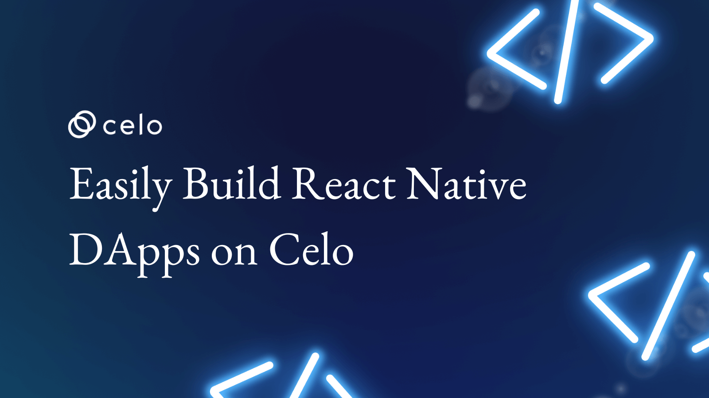

# React Native & Celo - Easily build React Native dApps on Celo

## Quickly develop Android and iOS apps on Celo using the Celo Composer for React Native.



[**Celo Composer**](https://github.com/celo-org/celo-composer) is a set of templates created by Celo to reduce time-to-first-output for developers building dApps in the Celo Ecosystem. The objective is to improve the developer experience. The template is set up to work right out of the box, but also make customization as easy as possible.

In this article, you will go through the React Native version of the template. You will learn how to interact with smart contracts deployed on Celo blockchain using a react native dApp. If you plan to build or are already building mobile dApps on Celo 😁 consider reading till the end.

Here’s a list of things will we cover 🗒

- ✅ [Prerequisites](#prerequisites)
- ✅ [Setting up the project](#setting-up-the-project)
- ✅ [Deploying smart contracts](#deploying-smart-contracts)
- ✅ [Downloading testnet Valora](#downloading-testnet-valora)
- ✅ [Funding Valora with testnet coins](#funding-wallet-with-testnet-coins)
- ✅ [Exploring the Mobile dApp](#exploring-the-mobile-dapp)
- ✅ [Customizing the dApp](#customizing-the-dapp)

---

### Prerequisites

Before we get started you will need some packages and dependencies to be installed beforehand, here is a list of them.

- Node v12+
- Yarn / NPM
- Python (node-gyp requires this)
- windows-build-tools (only for windows)

Once you have the dependencies installed, it’s time we start setting up the template.

---

### Setting up the project


- Access the repo [here](https://github.com/celo-org/celo-composer).
- Click the Use this template button to get it into your GitHub profile.

Once done, clone the repo to work on it on your local machine.


Once cloned we need to install `expo` and `expo-cli` globally since we are using Expo to build our app. Open up a terminal and use the below command or `yarn global expo expo-cli` to globally install `expo` and `expo-cli`.

```bash
npm i -g expo expo-cli
```

It’s time we install the package dependencies. In your terminal, navigate to `<your_repo_name>/packages/react-native-app` and use the below command in your terminal.

```bash
yarn install --ignore-engines
```

At this point, you are all set to start running the app on your local server use the command below.

```bash
expo start
```

Once the command is executed, you will see a QR code in the terminal like so.


Thanks to Expo, there are various ways you can access your app.


If you want to use Android Studio type A on the keyboard and it will start the Android Studio.

> Note:- If you want to access using Android Studio make sure you have a Virtual Device with play store support.

If you press **W** it will open it in your web browser. In this tutorial, you are going to access the app using a mobile device. Because that’s how the user of your app will access it right?

In order to do so, we need to install the **Expo Go App** on our device of choice. Before we start using the app, we also need to deploy the smart contracts that we plan to interact with, so let’s do that now.

---

### Deploying Smart Contracts

Smart contracts are like the backend to your dApp. Most of the logic resides in smart contracts. We are going to deploy contracts to the Alfajores testnet since I don’t expect you to use real funds in order to follow this tutorial.

You can see that in the file `hardhat.config.json` which is in the folder `/packages/hardhat`


Before we deploy our contracts let us see which account we are going to use to deploy the contracts. You can use the below command in your terminal to do so. Make sure you are in the `/packages/hardhat` folder.

```bash
npx hardhat accounts
```

You can add your own account if you want. Let’s deploy the smart contracts using the below command in your terminal.

```bash
npx hardhat deploy --network alfajores
```

We specify the network we want to deploy to in the command.


You can see the transaction hash of the transaction and the address where the contract lives on the Alfajores chain.


When you want to deploy fresh contracts you will need to delete the respective network folder.

You don’t need to worry about copying the contract addresses into the react-native-app project because we have wired it up in such a way that we pick up the address from the JSON files. 😃

Just to recap we are done with the following

🔳 Project Setup

🔳 App server On

🔳 Smart Contracts deployed

🔲 Get a Celo wallet (Valora for this tutorial)

🔲 Get some testnet funds.

🔲 Download the Expo Go App on your mobile device of choice

To interact with smart contracts on the blockchain we need a wallet specifically the Celo wallet in this case. For this tutorial, you will use the Valora wallet which is the preferred Celo wallet however you are free to use other wallets like Metamask but you won’t be able to use stablecoins as gas fees.

---

### Downloading Testnet Valora

In this post, you’ll use the Alfajores testnet with the Valora app. This allows you to create dApps using test funds which allows you to avoid spending real money during development.

- Download Celo Alfajores Wallet from the Play Store or App Store.


Once downloaded Create New Account (recommended) you can also recover if you have a test account on Testnet.


Next, set up your account.


If you created a new account your balance will be zero and we need to have some funds to start interacting with the contracts deployed on the testnet.


You can now get some funds from Celo Faucet so that we can interact with the deployed smart contracts. Even though you are using the app eventually you end up interacting with the smart contracts directly, the app is just an interface for user-friendliness.

---

### Funding wallet with testnet coins

Copy your address.


In the browser go to — https://faucet.celo.org


- Paste your address, complete the captcha, and tap Get Started.
- After a few seconds, if you go back to your app, you should see the token received from the faucet.


Keep in mind these are not real funds 😄 these are required to interact with the testnet. You’re finally ready to play around the starter app. 🥳

---

### Exploring the Mobile DApp

Scan the QR code shown in the terminal using the Expo App to open up the app on your device. The moment you see the Metro Bundler will start bundling the code and once that is done your device will start downloading it.

Once done you should have a screen like this.


> Note: At this point, if you get redirected to a browser and WalletConnect website, this means you are using Android 11 and above. There are steps to resolve this in the Github repo readme

Tap **Connect Wallet** to get a prompt to select the wallet of your choice. (For this tutorial Alfajores Wallet)


You will see a screen prompting you to Allow the Starter app to get your account details like account address. Tap Allow.


If successful you will see a notification like this.


If you switch back to the Expo App you will see now that our account is connected.


You can use the interface to interact with the standard Greeting Contract. The address underlined is the address of the Greeting Contract tapping will take you to the explorer.

Try tapping the Read Greeter Contract button and see if you get a greeting. Your output might be different since I have used it before.


You can update the **Greeting** by using the input field. Once you have your greeting entered in the field tap the **Update Greeter Contract**.


Since you are doing a write operation on the contract we need to sign this transaction and it will cost you funds, don’t worry we are on testnet so we won’t be using real money.


You should see a screen like this, Alfajores is asking if you want to proceed with the transaction.

- Click **Allow** to proceed this will perform an update on the Greeter Contract.
- Once done if you switch back to the Expo App we can tap the **Read Greeter Contract** to see our update Greeting.


Similarly, there is a screen for the Storage contract and an **Account Info** screen to view your account address and disconnect the wallet.


For now, these are all the screens we have but we are planning to add more. Expect more updates on this starter template. But wait there is more. 😲

---

### Customizing the DApp

We have tried to provide a fair amount of customizations that can be done on the starter template and we at Celo working hard to make it easier and easier, to customize and also have plans to have various components that can help with mobile dApp development.


For now, here is a list of things you can do:

- **Add a splash screen**: Add the splash screen image inside `/assets/images`
- **Change app colors**: Edit `Colors.ts` in `/constants`
- **Add touchable opacity to buttons**: Inside `/components` you will see I have added some modified `TouchableOpacitycomponent` to look like a button with color, feel free to edit it as you like.
- **Organize component styles**: There is also a `ThemeProvider.ts` in `/context` which uses React Native StyleSheet for organizing styles for components, play with it as you like.
- **Organize your styles**: It is not necessary to take the template as-is for design purposes, you can have your own way of code organization for colors and styles.
- **Add more screens**: To add more screens to your app, there is `/screens` folder to add more screen files this is for code organization purposes.
- **Add to the interface**: However, to add it to the interface check out the `LinkingConfiguration.ts` in `/navigation`
- **Add tabs**: index.tsx inside `/navigation` has the code to the `BottomTab` navigation where you can add more tabs to various screens.
- **Add drawer navigation**: After 3 to 4 screens `BottomTab` might not be the right choice to add more tabs so check out the docs to the Drawer Navigation.
- **Change app names**: Refer to edit it inside `index.js` line number 15.
- **Add contracts**: Add solidity files to in `/hardhat/contracts`

In the end, it is an Expo-based React Native project, so it can be customized as you want. Feel free to report any issues under the **Issues** tab in the [Github repo](https://github.com/celo-org/celo-composer) and if you plan to contribute we will welcome you with open hands. 🤝

---

### External References

Here are some links that can help if you wish to explore more.

- [**React Native**](https://reactnative.dev/docs/getting-started) — Library to build cross-platform apps.
- [**Expo**](https://docs.expo.dev/) — React Native Framework.
- [**React Navigation**](https://reactnavigation.org/docs/getting-started) — Library to help with navigation of screens.
- [**Hardhat**](https://reactnavigation.org/docs/getting-started) — Library to help with smart contract testing and deployment.
- [**Solidity**](https://reactnavigation.org/docs/getting-started) — Language used to write smart contracts.
- [**WalletConnect**](https://reactnavigation.org/docs/getting-started) — Library to access mobile install wallets in our dApps.

[View on Medium ↗️](https://medium.com/celodevelopers/celo-composer-react-native-easily-build-react-native-dapps-on-celo-bdc57080772f)

<!--truncate-->
