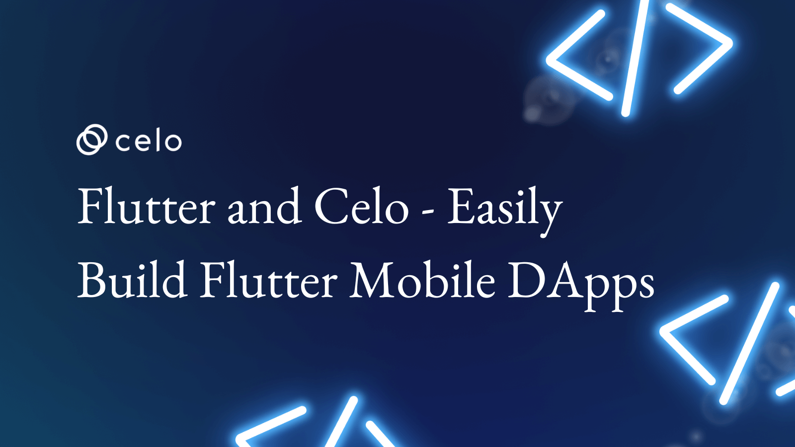
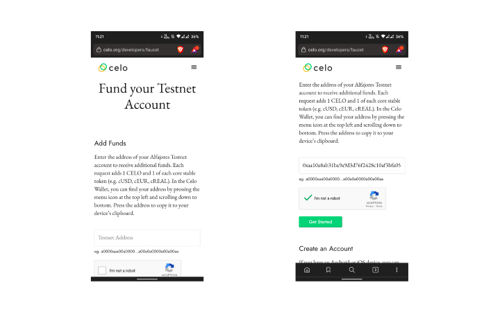
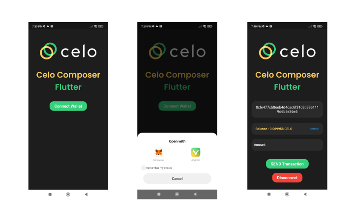

# Flutter & Celo: Easily build Flutter Mobile dApps

Celo Composer now supports Flutter 🎉. Quickly develop mobile apps on Celo



### Introduction

**Celo Composer** — Flutter is a kit where you can find all the code needed to kickstart and build the production-ready mobile dApp. It includes state management, wallet connect, great UI, and some standard UI widgets.

In this article, we will go through the Flutter version of Celo Composer, where we will learn how to connect your mobile app with crypto wallets and how to interact with Celo blockchain using Flutter.

<!--truncate-->

### Motivation

Building a mobile app with Flutter is easy, but making a mobile dApp with Flutter is way too tricky, primarily because of a lack of tools. However, building a production-ready app has a stylesheet, state-management, UI components, and API calls which are common in all the apps. Our idea was to write all the code required to create a mobile dApp that includes connecting to the mobile wallet, making transactions, requesting data from the wallet, and much more inside a starter kit to avoid rewrites.

### Prerequisites

To successfully follow this starter kit, you will need basic knowledge and understanding of Blockchain technology, the Solidity programming language for smart contracts, and the **Flutter framework**.

### Requirements

- [Flutter](https://docs.flutter.dev/get-started/install) — used to create an Android/iOS dApp.
- [Valora Account](https://valoraapp.com/) — to connect to the dApp and make transactions.
- [Android Studio](https://developer.android.com/studio#downloads) — required to build and run an android app in an emulator or a mobile phone.
- [xcode](https://developer.apple.com/xcode/) — required to build and run an ios app in a simulator or a mobile phone.
- A code editor or IDE — [VSCode](https://code.visualstudio.com/) is recommended for Flutter development.

### Packages

[flutter_walletconnect](https://pub.dev/packages/flutter_walletconnect) — Flutter WalletConnect is an open-source protocol for connecting decentralized applications to mobile wallets with QR code scanning or deep linking.

### Installation

Click on `Use this template` [this](https://github.com/celo-org/celo-composer/) repo from your Github.

- Clone the newly created repo to your computer.
- Navigate to the `flutter-app` inside of the packages.

```bash
cd packages/flutter-app
```

- Run the following command to install all the dependencies required to run the app locally.

```bash
flutter pub get
```

To run the flutter app, run the following command from the `flutter-app` directory. Ensure you have an emulator/simulator or a mobile phone connected to your computer.

```bash
flutter run
```

#### Get some testnet Celo tokens on Valora

Get your address from the Valora app and go to the [Celo faucet](https://faucet.celo.org) site.



Paste your Valora address and tap Get Started. After a few seconds, you will receive the Celo tokens in your Valora wallet.

### Folder structure

```text
├── README.md
├── analysis_options.yaml
├── android
├── assets
│   ├── fonts
│   │   └── Poppins
│   └── images
│       ├── celo-logo.jpeg
│       └── celo-logo.png
├── build
├── ios
├── lib
│   ├── common
│   │   └── primary_button.dart
│   ├── controllers
│   │   ├── theme_controller.dart
│   ├── generated_plugin_registrant.dart
│   ├── main.dart
│   ├── screens
│   │   └── home_screen.dart
│   └── utils
│       ├── constants.dart
│       ├── image_constants.dart
│       ├── simple_logger.dart
│       └── theme_config.dart
├── linux
├── macos
├── pubspec.lock
├── pubspec.yaml
├── test
├── web
└── windows
```

- The `lib` the directory contains all the flutter code.
- `controller` the directory contains all the notifiers created for `provider` state management.
- `models` have the data models used for managing and maintaining the data.
- `screens` has all the UI code used in the app.
- `utils` includes some helper functions and constants.
- `ios`, `android`, `linux`, `windows`, `mac` and `web` contains platform-specific code.

### Exploring the Mobile DApp



Once the app is opened, the user will see a **Connect Wallet** button. This can be used to connect to your desired wallet. Once you choose the wallet you will be redirected to the wallet app where you will be asked to allow the Celo Composer — Flutter app to access the public address. You can see the public address of the connected account in the app.

The dApp will automatically fetch the current balance of the account and update it in the app. To get the updated balance the user can click on the refresh button. Users can also send tokens to any address using the text fields available in the app.

Try entering the address and the amount you want to send and click ion SEND Transaction button to initiate the transaction. You will be redirected to the Valora wallet and asked to accept the transaction. Once the transaction is accepted, the balance of the user will automatically get updated.

### Styleguide

#### Add image assets

To add an image or assets, make a folder named `/assets` in the app folder at the root location:

```text
/flutter-app
  /assets
     /images
  /lib
```

You can create assets for each screen like this -

```text
/flutter-app
  /assets
     /images
       /home
       /profile
       /onboarding
  /lib
```

Now, add these assets to the `pubspec.yaml` file:

```text
assets:
    - assets/images/
    - assets/images/home/
    - assets/images/profile/
    - assets/images/onboarding/
```

Next, go to the main app and add the image constants in the file`/src/config/image_constants.dart`:

```dart
class AllImages {
  AllImages._();
  static AllImages _instance = AllImages._();
  factory AllImages() => _instance;
  String image = 'assets/image/image_ex.png';
}
```

Set the image asset path in the Image widget as shown below:

```dart
Image.asset(
  AllImages().image,
  fit: BoxFit.contain,
),
```

#### Add fonts assets

Make a folder inside `/assets` in the main app and then make another subfolder in assets named `fonts`:

```text
/assets
   /fonts
      /Schyler-Regular.ttf
      /Schyler-Italic.ttf
```

To register the fonts, open the `pubspec.yaml file and add the fonts info under the flutter section.

```yaml
fonts:
  - family: Schyler
    fonts:
      - asset: fonts/Schyler-Regular.ttf
      - asset: fonts/Schyler-Italic.ttf
        style: italic
```

Set the font using `fontFamily` inside the Text widget as shown below:

```dart
Text(
  'Hello world',
  style: TextStyle(
    fontFamily: 'Schyler',
  ),
)
```

#### Add theme data

Go to `lib/utils/theme_data.dart`. This will contain the code for configuring theme data:

[theme_config.dart](https://gist.github.com/viral-sangani/167b65bfddee2e9a80482263f49c9f85)

To use the theme, goto _app.dart_ and wrap the `Material` app with `Consumer`.

```dart
class App extends StatelessWidget {
  Widget build(BuildContext context) {
    return Consumer<AppStateNotifier>(builder: (context, appState, child) {
      return MaterialApp(
        title: 'Flutter starter kit!',
        theme: ThemeConfig.lightTheme,
        darkTheme: ThemeConfig.darkTheme,
        themeMode: appState.isDarkMode ? ThemeMode.dark : ThemeMode.light,
        onGenerateRoute: routes,
      );
    });
  }
}
```

To change the theme from light to dark, use the code shown below:

```dart
Switch(
    value: Provider.of<AppStateNotifier>(context).isDarkMode,
    onChanged: (value) {
        Provider.of<AppStateNotifier>(context,listen: false).updateTheme(value);
         },
     ),
```

#### Add new dependencies

To add dependencies, go to [pub.dev](https://pub.dev/) for that specific dependency. Copy the install version and paste it into the _pubspec.yaml_ file:

```yaml
dependencies:
  flutter:
  sdk: flutter
  # utils
  package_info: ^0.4.0+13
  shared_preferences: ^0.5.10
  walletconnect_secure_storage: ^1.0.0
```

### Conclusion

Congratulations on finishing the article! Thank you for taking the time to complete it. In this tutorial, you have learned how to create a Flutter dApp from scratch using `web3dart` and `walletconnect_dart`. Since Flutter is a multi-platform framework and the `web3dart` and `walletconnect` package supports all the platforms - Android, iOS, Linux, macOS, Web, and Windows you can use the same codebase to build multi-platform dApps very quickly. Soon **Celo Composer** — Flutter will have support for all the other platforms supported by Flutter.
