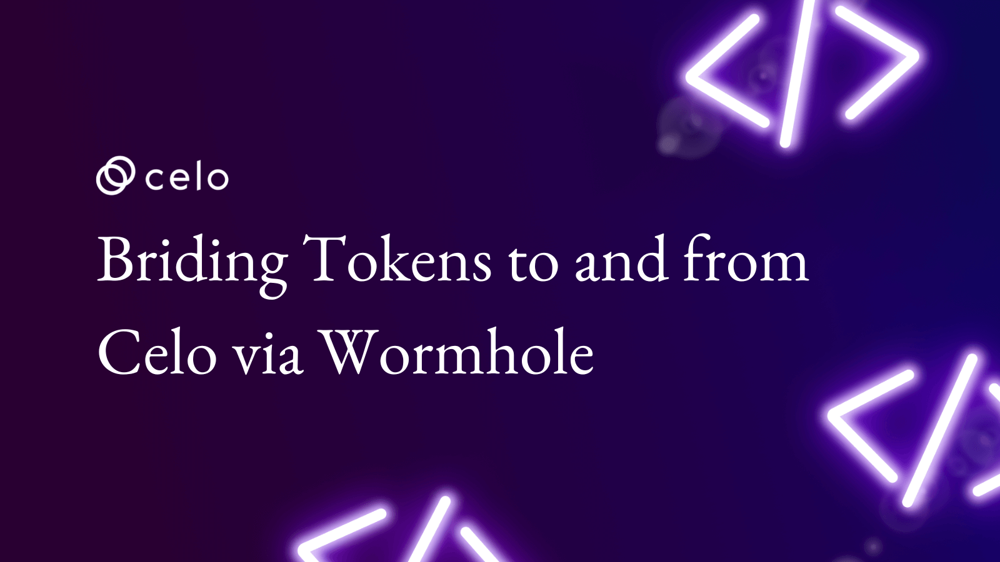

# Bridging tokens to and from Celo via Wormhole



## Wormhole has enabled the Celo chain.

Meaning now you can bridge tokens in and out of the Celo ecosystem 🥳.

**In this article, you will learn:**

- ✅ [How to bridge Wormhole supported tokens to the Celo blockchain](#how-to-bridge-wormhole-supported-tokens-to-the-celo-blockchain)
- ✅ [How to bridge Wormhole supported tokens out of the Celo blockchain](#how-to-bridge-wormhole-supported-tokens-from-the-celo-blockchain)
- ✅ [How to bridge your own custom tokens](#how-to-bridge-your-own-custom-tokens) 🥳

---

In this article I will be bridging [WETH](https://polygonscan.com/address/0x11cd37bb86f65419713f30673a480ea33c826872) (Wormhole supported) from Polygon to Celo and back. By saying Wormhole supported, I mean that these tokens are created by the Wormhole team themselves which the Wormhole Bridge natively recognises.

> Learn more: You can checkout the other supported tokens and their respective markets [here](https://docs.wormholenetwork.com/wormhole/overview-liquid-markets).

---

Before you start it is recommended to have some funds on both chains. Depending on which token you are willing to bridge you might have to redeem it on the destination chain manually.

Manually redeem means you will have to make a separate transaction by changing your network to the destination chain in order to redeem the tokens. (Wormhole will prompt you for that)

> Beware only use links either in this article or in the docs of Wormhole.


> If bridging for the first time, consider performing with a small test amount.

So, let’s not wait anymore and get to bridging.

The mainnet version is [here](https://www.portalbridge.com/#/transfer) and if you want to test [here](https://certusone.github.io/wormhole/#/transfer) is the testnet version.

---

### How to bridge Wormhole-supported tokens to the Celo blockchain.


From this interface select the Tokens tab if it is not already selected.


- Select the chains from which you wish to bridge. For this example, I will bridge from Polygon to Celo.
- Connect your wallet by clicking the Connect button.


I will be using `Metamask` for this tutorial but you can choose from additional wallets using Wallet Connect.


> Throughout this tutorial, you might be prompted to add/switch network in your wallet. For instance, if you are on **Ethereum Mainnet** and you select **Polygon** it will prompt for a network switch. This will be done several times in the tutorial so when asked choose **Switch Network**.


Once connected you will be prompted to select the token you want to bridge.


I have selected WETH, if you are not given the option to select it that could be because you don’t have it. The token you want to have is

```
0x11cd37bb86f65419713f30673a480ea33c826872 (Wrapped ETH Portal)
```

In this example, I am using **Wrapped ETH** Portal tokens, but you may wish to use another token. Enter the amount to bridge then click **Next**.


Depending on which token you are bridging you will be prompted for **Automatic Payment** or **Manual Payment**.

**Automatic payments** are achieved by using a relayer who takes a portion of the token you are bridging and uses that to pay fees for the transaction on the destination chain.

A **Manual payment** basically means that you will have to pay for gas for the transaction you make to bridge the tokens on both the chains manually, so you will have to make a separate transaction at the end to redeem the tokens on the destination chain as well.

You won’t get Automatic payment for every token because not every token has value. If you are prompted with an **Automatic Payment** for gas, then select that otherwise select **Manual Payment**, then click **Next**.


You will now be prompted to approve the amount of tokens you wish to bridge.


The prompt for approval looks like the image shown above.

- Review and confirm the requested bridging amount.
- If correct click **Confirm**.


Once approval is complete you select **Transfer** on the prompt provided.


You will be asked for confirmation with a visual guide on what you are about to do. Click **Confirm** if everything looks right.


Click **Confirm**.


At the time of this writing bridging from Polygon to Celo requires 512 confirmations on your transactions.


Once the required number of confirmations has been reached. You will be greeted with a success message. Select **Add to Metamask** button to add the bridged token to your wallet.


Select **Add Token** to add the new token to your wallet.

That is all there is to bridging your tokens to Celo ecosystem! If you wish to swap it, you can check if the Wormhole team has already created the liquidity pool [here](https://docs.wormholenetwork.com/wormhole/overview-liquid-markets#target-chain-celo).

> Depending on the origin chain and token some steps and estimated time might vary.


For anyone interested, you can see the fee is taken by the relayer and the amount being sent to the destination address.

---

### How to bridge Wormhole-supported tokens from the Celo blockchain

Let’s try bridging this WETH back to Polygon!


Connect your wallet, select the desired chains (Celo -> Polygon), the token you want to transfer, and the amount you want to transfer.


You’ll be prompted with **Automatic Payment** option like before. It’s recommended that you select this option. Check out the images below to view the Manual Payment process.


The **Approve** and **Transfer** steps are the same as before.


The confirmation screen is different than before and has Celo as Origin. Once confirmed, you will be asked to wait for confirmation on your transaction on the Celo chain. (This one is pretty fast 😎)


Once done, you will have your tokens on the destination chain!


At this point, you’re able to bridge tokens using Wormhole!


If you’re interested, you can view the fee that is taken by the relayer and the remaining that is sent to the destination address.

---

### How to bridge your own custom tokens

Next, let’s go over how can you can bridge your own custom tokens!

**Before getting started…**

Before jumping into bridging custom tokens it is important to understand how it works. When you create custom tokens no one knows about them and there are no markets for them to trade unless you add liquidity and create pool.

Nevertheless, bridging custom tokens doesn’t require you have to liquidity. Instead, you will need a wrapped version of your own token on the destination chain.

For example, I have a TestToken (TT) for this tutorial which will be deployed as TestToken (Wormhole) on the destination chain by Wormhole.

The assumption that bridged ETH on other chains is the same is wrong. Most are wrapped versions of ETH. You should check and verify addresses to ensure you are receiving the expected token.

You can check the addresses of the tokens you receive on the target chain when you bridge via Wormhole [here](https://docs.wormholenetwork.com/wormhole/overview-liquid-markets).

#### So how does it work?

It's pretty simple actually! When you create a new token you **Mint** yourself some tokens right? Or some address gets it on deployment or an address can mint as they wish depending on the implementation.

Similarly, there is **Burn** once you burn a token it ends up in an address to which no one holds the key eg: address(0)

That’s it when you bridge from X chain to Y chain your tokens are burned on X chain and minted on Y chain. But for that to happen you need to have a token on the destination chain.

This is the first step to bridging custom tokens and thankfully you don’t have to do it ourselves Wormhole has a process for that called Token Registration. There is no queue for it you can do it as many times as you want and for as many tokens as you want.

#### Time to bridge your custom token!

For this tutorial, I have a token named **TestToken** on the Celo blockchain that I want to bridge to Polygon blockchain.


First, you can go to **Token Origin Verifier** which is a tool where you can select the origin and destination chain. Using the address of the token you can check if there is already a wrapped version available.


The verifier should look like this.


Next, select the chains and paste the custom token address. If it says Register Now you need to register the token with the Wormhole contracts.

> This needs to be done once every pair of chains. For example, you only need to do it once for Celo and Polygon but for Celo and Ethereum you’ll need to do it again.


You will be asked to **Attest** your token. You can think of Attest as updating your token metadata. If you make changes to your token in the future, like updating the name in the token’s metadata, you can **Attest** again and update on the respective chains!

When you Attest you will be asked to perform a transaction.


Confirm it once the once Attestation is complete.


You will be then prompted to **Create** a wrapped version of your token on the destination chain.

Click **Create** and you will be asked to perform another transaction.


Once transaction completes you will have a wrapped version of your custom token on the destination chain!

> Caution: The wrapped version of your token **will not be the same** as the unwrapped version. [Here](https://github.com/certusone/wormhole/blob/dev.v2/ethereum/contracts/bridge/token/TokenImplementation.sol) is the link to the code that is deployed.

> The **new owner** of the wrapped version will be the **Wormhole Bridge** and only the bridge can **mint** new wrapped tokens. You will need to use the Wormhole interface to **administer** or **update** your token metadata.

Now you are set to bridge our custom tokens since it is now available on both the origin and the destination chain

---


You can head over to the Bridging section, select the chains, the token (in this case TT), enter the amount to bridge and click Next.


As expected, you won’t get the **Automatic Payment** option for paying fees this time the reason being the custom tokens maybe of no value for the relayers.

In this case, you will need funds to pay for gas on the destination chain when redeeming the tokens manually.

**In case you need funds on Celo side, this can be done in several ways.**

1. Purchase CELO on an exchange (e.g., Binance or Coinbase, depending on the user’s geographic location), and then transfer the CELO to the Celo wallet address.
2. Use the [Celo faucet](https://stakely.io/en/faucet/celo-platform) powered by Stakely. Please note that Stakely is not an official faucet offered by the Celo Foundation.

Once you are ready, click **Next**.


You will be asked to **Approve** and **Transfer** the custom tokens, please do so.

The confirmation screen will have the symbol of the custom token you want to bridge. If everything looks as expected click **Confirm** and **Confirm** the wallet prompt.


Once the transaction goes through you will be prompted to **Switch Network** to your **Destination Chain**, and then you can click **Redeem** to manually pay gas fees on the destination chain and redeem your tokens!


On successful redeem, you will get a button **Add to Metamask** click it to add the wrapped version of your token to your wallet and check balance.

---

#### Congratulations 💪

That is it! You now know how to bridge tokens including custom tokens! If you face any problems or have any questions don’t hesitate to reach out [me](https://twitter.com/harpaljadeja11) harpaljadeja.eth#2927 on Discord.

- [Celo Discord](https://discord.gg/6yWMkgM)
- [Celo Twitter](https://twitter.com/CeloOrg)
- [Wormhole Docs](https://docs.wormholenetwork.com/wormhole/)

[View on Medium ↗️](https://developers.celo.org/bridging-token-to-and-from-celo-via-wormhole-83cae48dfcff)

<!--truncate-->
