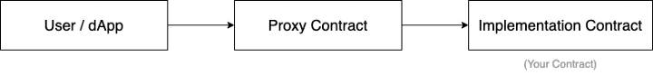
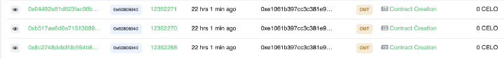
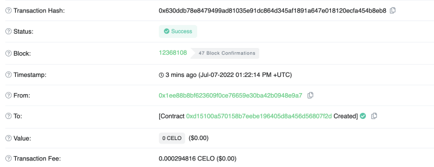
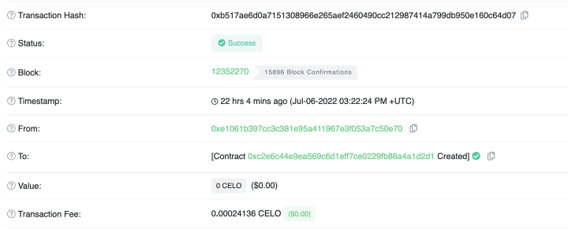
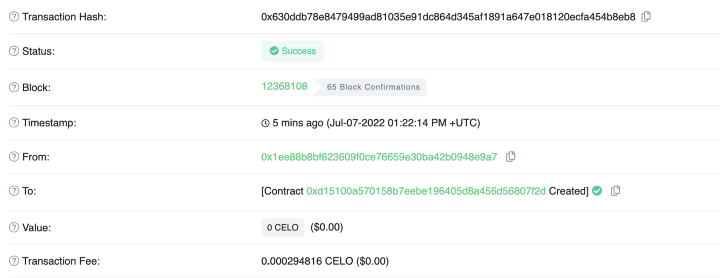
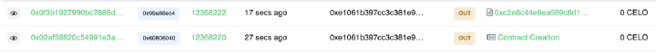
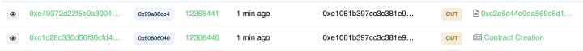

# Flutter & Celo: Easily build Flutter Mobile dApps

## What are upgradeable smart contracts?

Usually, when we deploy a smart contract, it’s impossible to update or change the code since it’s on-chain, and that’s how it should be. This increases the safety and trust of users who interact with that contact.


<!--truncate-->

But there might be cases where you want to upgrade your smart contract, like fixing severe bugs and adding some critical features for the users. Traditionally doing this is not possible. The best one can deploy is a new smart contract with bug fixes with all the information migrated. This does not end here; one must update the references where the old contract address was used and inform existing users to use the new contract.

This can be overwhelming, but there is a way to handle these cases by using Upgradeable contracts. An upgradeable smart contract can be updated and edited after the deployment. This can be achieved by a plugin/tool created by [OpenZeppelin](https://www.openzeppelin.com/).

### In a nutshell

The plugin is used to deploy the contracts on [Hardhat](https://hardhat.org/) or [truffle](https://trufflesuite.com/). Whenever in the future you wish to upgrade the smart contract, use the same address that you used to deploy the first contract via the plugin, and the plugin will handle the transferring of any state and data from the old contract while keeping the same contract address to interact with.



OpenZeppelin uses a proxy pattern where they deploy three smart contracts to manage the storage layer and implement smart contracts. Whenever a contract call is invoked, the user indirectly calls the proxy contract, and the proxy contract passes the parameters to the implemented smart contract before sending the output back to the user. Now since we have a proxy contract as a middle man, imagine how you want to change something in your implemented contract. All you have to do is deploy the new contract and tell your proxy contract to refer to the latest smart contract, and voila. All users are using the updated contract.

### How do upgradeable contracts work?

When we use OpenZeppelin’s upgradeable plugin to deploy the contract, three contracts are deployed —

- **Implemented Contract** — The contract the developers create which contains all the logic and functionalities.
- **Proxy Contract** — The contract that the end-user interacts with. All the data and state of the contract are stored in the context of the Proxy contract. This Proxy Contract is an implementation of the [EIP1967 standard](https://eips.ethereum.org/EIPS/eip-1967).
- **ProxyAdmin Contract** — This contract links the Proxy and Implementation contract.

> What is ProxyAdmin? (According to OpenZeppelin docs)
> A ProxyAdmin is a contract that acts as the owner of all your proxies. Only one per network gets deployed. When you start your project, the ProxyAdmin is owned by the deployer address, but you can transfer ownership of it by calling transferOwnership.

When a user calls the proxy contract, the call is [delegated](https://docs.soliditylang.org/en/v0.8.12/introduction-to-smart-contracts.html?highlight=delegatecall#delegatecall-callcode-and-libraries) to the implementation contract. Now to upgrade the contract, what we have to do is:

1. Deploy the updated Implementation Contract.
2. Updating the ProxyAdmin so that all the calls are redirected to the newly implemented contract.

OpenZeppelin has created a plugin for Hardhat and Truffle to handle these jobs for us. Let’s see step by step how to create and test the upgradeable contracts.

### Writing upgradeable smart contracts

We will be using Hardhat’s localhost to test the contract locally and Celo Alfajores test network.

Initialize project and install dependencies

```bash
mkdir upgradeable-contract && cd upgradeable-contract
yarn init -y
yarn add hardhat
yarn hardhat // choose typescript
```

Add plugin and update `hardhat.config.ts`

```text
yarn add @openzeppelin/hardhat-upgrades

// hardhat.config.ts
import '@openzeppelin/hardhat-upgrades';
```

To understand the flow, we will be using `Greeter.sol` a contract. We will create and deploy several versions of this contract.

- Greeter.sol
- GreeterV2.sol
- GreeterV3.sol

> NOTE — The big difference between a normal contract and an upgradeable smart contract is upgradeable smart contracts do not have a `constructor`.

```js
//contracts/Greeter.sol
//SPDX-License-Identifier: Unlicense
pragma solidity ^0.8.0;
contract Greeter {
    string public greeting;
    // Emitted when the stored value changes
    event ValueChanged(string newValue);
    function greet() public view returns (string memory) {
        return greeting;
    }
    function setGreeting(string memory _greeting) public {
        greeting = _greeting;
        emit ValueChanged(_greeting);
    }
}
```

This is a very simple Greeter contract that returns the value of `greeting` whenever we call `greet()` method.

Unit testing for `Greeter.sol`

Create a file called `1.Greeter.test.ts` and add the following content.

```ts
// test/1.Greeter.test.ts
import { expect } from "chai";
import { Contract } from "ethers";
import { ethers } from "hardhat";
describe("Greeter", function () {
  let greeter: Contract;
  beforeEach(async function () {
    const Greeter = await ethers.getContractFactory("Greeter");
    greeter = await Greeter.deploy();
    await greeter.deployed();
  });
  it("should greet correctly before and after changing value", async function () {
    await greeter.setGreeting("Celo to the Moon");
    expect(await greeter.greet()).to.equal("Celo to the Moon");
  });
});
```

Run the test:

```bash
yarn hardhat test test/1.Greeter.test.ts
```

Results:

```text
Greeter
    ✔ should greet correctly before and after changing value
1 passing (334ms)
✨  Done in 1.73s.
```

Let’s write a deploy script and deploy `Greeter.sol` it to Hardhat’s local node. Create a file named `Greeter.deploy.ts` in `scripts` directory and paste the following code.

```ts
// scripts/Greeter.deploy.ts
import { ethers, upgrades } from "hardhat";
async function main() {
  const Greeter = await ethers.getContractFactory("Greeter");
  console.log("Deploying Greeter...");
  const greeter = await upgrades.deployProxy(Greeter);
  console.log(greeter.address, " greeter(proxy) address");
  console.log(
    await upgrades.erc1967.getImplementationAddress(greeter.address),
    " getImplementationAddress"
  );
  console.log(
    await upgrades.erc1967.getAdminAddress(greeter.address),
    " getAdminAddress"
  );
}
main().catch((error) => {
  console.error(error);
  process.exitCode = 1;
});
```

Run the local node and deploy the `Greeter.sol` contract:

```bash
yarn hardhat node
yarn hardhat run scripts/Greeter.deploy.ts --network localhost
```

Results:

```text
Deploying Greeter...
0x9A676e781A523b5d0C0e43731313A708CB607508  greeter(proxy) address
0xA51c1fc2f0D1a1b8494Ed1FE312d7C3a78Ed91C0  getImplementationAddress
0x0DCd1Bf9A1b36cE34237eEaFef220932846BCD82  getAdminAddress
✨  Done in 2.74s.
```

> Note: If you run the deployment command several times you can notice that adminAddress does not change.

Now we need to implement the `increment` feature in the existing contract. Instead of replacing the current contract we will create a new contract and change the proxy to refer to the new contract.

#### Creating `GreeterV2.sol`

```js
// contracts/GreeterV2.sol
// SPDX-License-Identifier: MIT
pragma solidity ^0.8.0;
import "./Greeter.sol";
contract GreeterV2 is Greeter {
    uint256 public counter;
    // Increments the counter value by 1
    function increment() public {
        counter++;
    }
}
```

Writing unit tests for GreeterV2 before deploying.

```ts
import { expect } from "chai";
import { BigNumber, Contract } from "ethers";
import { ethers } from "hardhat";
describe("Greeter V2", function () {
  let greeterV2: Contract;
  beforeEach(async function () {
    const GreeterV2 = await ethers.getContractFactory("GreeterV2");
    greeterV2 = await GreeterV2.deploy();
    await greeterV2.deployed();
  });
  it("should retrieve value previously stored", async function () {
    await greeterV2.setGreeting("Celo to the Moon");
    expect(await greeterV2.greet()).to.equal("Celo to the Moon");
  });
  it("should increment value correctly", async function () {
    expect(await greeterV2.counter()).to.equal(BigNumber.from("0"));
    await greeterV2.increment();
    expect(await greeterV2.counter()).to.equal(BigNumber.from("1"));
  });
});
```

Run the test —

```bash
yarn hardhat test test/2.GreeterV2.test.ts
```

Results —

```text
Greeter V2
    ✔ should retrieve value previously stored
    ✔ should increment value correctly
2 passing (442ms)
✨  Done in 6.43s.
```

The above test was designed to only test `GreeterV2.sol` not the upgraded version of `Greeter.sol`. Let’s write and deploy the `GreeterV2` in proxy patter and test if `GreeterV2` works correctly.

```ts
// test/3.GreeterV2Proxy.test.ts
import { expect } from "chai";
import { Contract } from "ethers";
import { ethers, upgrades } from "hardhat";
describe("Greeter (proxy) V2", function () {
  let greeter: Contract;
  let greeterV2: Contract;
  beforeEach(async function () {
    const Greeter = await ethers.getContractFactory("Greeter");
    const GreeterV2 = await ethers.getContractFactory("GreeterV2");
    greeter = await upgrades.deployProxy(Greeter);
    // setting the greet value so that it can be checked after upgrade
    await greeter.setGreeting("WAGMI");
    greeterV2 = await upgrades.upgradeProxy(greeter.address, GreeterV2);
  });
  it("should retrieve value previously stored correctly", async function () {
    expect(await greeterV2.greet()).to.equal("WAGMI");
    await greeter.setGreeting("Celo to the Moon");
    expect(await greeterV2.greet()).to.equal("Celo to the Moon");
  });
});
```

Here we are setting the `greeting` value to WAGMI in `Greeter` (V1) and after upgrading, checking the `greeting` value in `GreeterV2`.

Run the test —

```bash
yarn hardhat test test/3.GreeterV2Proxy.test.ts
```

Results —

```text
Greeter (proxy) V2
    ✔ should retrieve value previously stored correctly
1 passing (521ms)
✨  Done in 6.45s.
```

#### Writing a script to update `Greeter` to `GreeterV2`

Note that the greeter proxy address is `0x9A676e781A523b5d0C0e43731313A708CB607508` that we got when we deployed `Greeter.sol`. We need a proxy address to deploy `GreeterV2.sol`

Create a file called `GreeterV2.deploy.ts` and add the following code.

```ts
// scripts/2.upgradeV2.ts
import { ethers, upgrades } from "hardhat";
const proxyAddress = "0x9A676e781A523b5d0C0e43731313A708CB607508";
async function main() {
  console.log(proxyAddress, " original Greeter(proxy) address");
  const GreeterV2 = await ethers.getContractFactory("GreeterV2");
  console.log("upgrade to GreeterV2...");
  const greeterV2 = await upgrades.upgradeProxy(proxyAddress, GreeterV2);
  console.log(greeterV2.address, " GreeterV2 address(should be the same)");
  console.log(
    await upgrades.erc1967.getImplementationAddress(greeterV2.address),
    " getImplementationAddress"
  );
  console.log(
    await upgrades.erc1967.getAdminAddress(greeterV2.address),
    " getAdminAddress"
  );
}
main().catch((error) => {
  console.error(error);
  process.exitCode = 1;
});
```

#### Running deployment script for `GreeterV2.sol`

We need to start from the beginning, i.e., deploy Greeter.sol first, get the proxy address, and use that to deploy `GreeterV2.sol`

```bash
yarn hardhat node
yarn hardhat run scripts/Greeter.deploy.ts --network localhost
```

Here we got `0x9A676e781A523b5d0C0e43731313A708CB607508` as a proxy address. (Update the proxy address in `scripts/GreeterV2.deploy.ts` ).

```bash
yarn hardhat run scripts/GreeterV2.deploy.ts --network localhost
```

Results —

```text
0x9A676e781A523b5d0C0e43731313A708CB607508  original Greeter(proxy) address
upgrade to GreeterV2...
0x9A676e781A523b5d0C0e43731313A708CB607508  GreeterV2 address(should be the same)
0x0B306BF915C4d645ff596e518fAf3F9669b97016  getImplementationAddress
0x0DCd1Bf9A1b36cE34237eEaFef220932846BCD82  getAdminAddress
✨  Done in 2.67s.
```

#### Overriding the existing methods

Now let’s say you want to add a custom name field in with the greeting such that when `greet()` is called, the name is added to the returned string.

Create a new file called `GreeterV3.sol` in `contracts` directory and add the following code —

```js
// contracts/GreeterV3.sol
// SPDX-License-Identifier: MIT
pragma solidity ^0.8.0;
import "./GreeterV2.sol";
contract GreeterV3 is GreeterV2 {
    string public name;
    function setName(string memory _name) public {
        name = _name;
    }
    function greet() public view override returns (string memory) {
        return string(abi.encodePacked(greeting, " ", name));
    }
}
```

Let’s write test cases to deploy and test `GreeterV3` . Create a file called `4.GreeterV3Proxy.test.ts` and add the following test cases.

```ts
// test/.GreeterV3Proxy.test.ts
import { expect } from "chai";
import { BigNumber, Contract } from "ethers";
import { ethers, upgrades } from "hardhat";
describe("Greeter (proxy) V3 with name", function () {
  let greeter: Contract;
  let greeterV2: Contract;
  let greeterV3: Contract;
  beforeEach(async function () {
    const Greeter = await ethers.getContractFactory("Greeter");
    const GreeterV2 = await ethers.getContractFactory("GreeterV2");
    const GreeterV3 = await ethers.getContractFactory("GreeterV3");
    greeter = await upgrades.deployProxy(Greeter);
    // setting the greet value so that it can be checked after upgrade
    await greeter.setGreeting("WAGMI");
    greeterV2 = await upgrades.upgradeProxy(greeter.address, GreeterV2);
    greeterV3 = await upgrades.upgradeProxy(greeter.address, GreeterV3);
  });
  it("should retrieve value previously stored and increment correctly", async function () {
    expect(await greeterV2.greet()).to.equal("WAGMI ");
    expect(await greeterV3.counter()).to.equal(BigNumber.from("0"));
    await greeterV2.increment();
    expect(await greeterV3.counter()).to.equal(BigNumber.from("1"));
  });
  it("should set name correctly in V3", async function () {
    expect(await greeterV3.name()).to.equal("");
    const name = "Viral";
    await greeterV3.setName(name);
    expect(await greeterV3.name()).to.equal(name);
    expect(await greeterV3.greet()).to.equal(`WAGMI ${name}`);
  });
});
```

> Note 1 — Since all the data and state is stored in Proxy contract you can see in the test cases that we are calling `increment()` method in `GreeterV2` and checking if the value is incremented or not in `GreeterV3` .
> Note 2 — Since in our `GreeterV3.sol` the contract, we have added space and name to the `greeting` If the name is null, then the `greet` the call will return the `greeting` with an extra space appended to it.

Run the tests —

```bash
yarn hardhat test test/4.GreeterV3Proxy.test.ts
```

Results —

```text
Greeter (proxy) V3 with name
    ✔ should retrieve value previously stored and increment correctly
    ✔ should set name correctly in V3
2 passing (675ms)
✨  Done in 2.38s.
```

#### Deployment script for `GreeterV3.sol`

Create a file called `GreeterV3.deploy.ts` in scripts and paste the following code —

```ts
// scripts/3.upgradeV3.ts
import { ethers, upgrades } from "hardhat";
const proxyAddress = "0x4ed7c70F96B99c776995fB64377f0d4aB3B0e1C1";
async function main() {
  console.log(proxyAddress, " original Greeter(proxy) address");
  const GreeterV3 = await ethers.getContractFactory("GreeterV3");
  console.log("upgrade to GreeterV3...");
  const greeterV3 = await upgrades.upgradeProxy(proxyAddress, GreeterV3);
  console.log(greeterV3.address, " GreeterV3 address(should be the same)");
  console.log(
    await upgrades.erc1967.getImplementationAddress(greeterV3.address),
    " getImplementationAddress"
  );
  console.log(
    await upgrades.erc1967.getAdminAddress(greeterV3.address),
    " getAdminAddress"
  );
}
main().catch((error) => {
  console.error(error);
  process.exitCode = 1;
});
```

#### Deploy the `GreeterV3`

```bash
yarn hardhat run scripts/GreeterV3.deploy.ts --network localhost
```

> Note — If you get “Error: Proxy admin is not the one registered in the network manifest” when you try to deploy `GreeterV3` , you need to run `Greeter.deploy.ts` and `GreeterV2.deploy.ts` again and copy the new proxy address to be used to deploy the upgraded contracts.

Results -

```text
0x4ed7c70F96B99c776995fB64377f0d4aB3B0e1C1  original Greeter(proxy) address
upgrade to GreeterV3...
0x4ed7c70F96B99c776995fB64377f0d4aB3B0e1C1  GreeterV3 address(should be the same)
0x3Aa5ebB10DC797CAC828524e59A333d0A371443c  getImplementationAddress
0x59b670e9fA9D0A427751Af201D676719a970857b  getAdminAddress
✨  Done in 2.63s.
```

#### Deploying the upgraded contract manually

Let’s write a new contract — `GreeterV4` where we need to —

- Change the state variable `name` from public to private.
- Add `getName` method to fetch `name` value.

Create a file called `GreeterV4.sol` in `contracts` directory and add the following code —

```js
// contracts/GreeterV4.sol
// SPDX-License-Identifier: MIT
pragma solidity ^0.8.0;
import "./GreeterV2.sol";
contract GreeterV4 is GreeterV2 {
    string private name;
event NameChanged(string name);
function setName(string memory _name) public {
        name = _name;
    }
function getName() public view returns (string memory) {
        return name;
    }
}
```

Here we need to inherit from `GreeterV2` instead of `GreeterV3` because `GreeterV3` already has a state variable called `name` and we cannot change the visibility but what we can do is inherit from `GreeterV3` which does not have `name` variable and set the visibility as we want.

Let’s write test cases for `GreeterV4.sol`

```ts
// test/5.GreeterV4Proxy.test.ts
/* eslint-disable no-unused-vars */
import { expect } from "chai";
import { Contract } from "ethers";
import { ethers, upgrades } from "hardhat";
describe("Greeter (proxy) V4 with getName", function () {
  let greeter: Contract;
  let greeterV2: Contract;
  let greeterV3: Contract;
  let greeterV4: Contract;
  beforeEach(async function () {
    const Greeter = await ethers.getContractFactory("Greeter");
    const GreeterV2 = await ethers.getContractFactory("GreeterV2");
    const GreeterV3 = await ethers.getContractFactory("GreeterV3");
    const GreeterV4 = await ethers.getContractFactory("GreeterV4");
    greeter = await upgrades.deployProxy(Greeter);
    greeterV2 = await upgrades.upgradeProxy(greeter.address, GreeterV2);
    greeterV3 = await upgrades.upgradeProxy(greeter.address, GreeterV3);
    greeterV4 = await upgrades.upgradeProxy(greeter.address, GreeterV4);
  });
  it("should setName and getName correctly in V4", async function () {
    expect(await greeterV4.getName()).to.equal("");
    const greetername = "Celo";
    await greeterV4.setName(greetername);
    expect(await greeterV4.getName()).to.equal(greetername);
  });
});
```

Run the test —

```bash
yarn hardhat test test/5.GreeterV4Proxy.test.ts
```

Results —

```text
Greeter (proxy) V4 with getName
    ✔ should setName and getName correctly in V4
1 passing (608ms)
✨  Done in 6.18s.
```

#### Preparing for the upgrade, but not really upgrading

When we call `upgrades.upgradeProxy()` there are a couple of things happening —

- Your contract is deployed first,
- ProxyAdmin called the `upgrade()` method and link the proxy to the newly implemented contract’s address.

To do these steps manually, we can call `upgrades.prepareUpgrade()` which only deploys your contract but does not link it with the proxy YET. This is left for the developers to link manually. This is useful when you want to test in production before wanting all the users to use the new contract.

Create a file called `GreeterV4Prepare.deploy.ts` in `scripts` directory and add the following code —

```ts
import { ethers, upgrades } from "hardhat";
const proxyAddress = "0xc5a5C42992dECbae36851359345FE25997F5C42d";
async function main() {
  console.log(proxyAddress, " original Greeter(proxy) address");
  const GreeterV4 = await ethers.getContractFactory("GreeterV4");
  console.log("Preparing upgrade to GreeterV4...");
  const greeterV4Address = await upgrades.prepareUpgrade(
    proxyAddress,
    GreeterV4
  );
  console.log(greeterV4Address, " GreeterV4 implementation contract address");
}
main().catch((error) => {
  console.error(error);
  process.exitCode = 1;
});
```

> Note — You might want to run all the deployment scripts again if you face any issues while running this script.

Run the script —

```bash
yarn hardhat run scripts/GreeterV4Prepare.deploy.ts --network localhost
```

Results —

```text
0xc5a5C42992dECbae36851359345FE25997F5C42d  original Greeter(proxy) address
Preparing upgrade to GreeterV4...
0x9E545E3C0baAB3E08CdfD552C960A1050f373042  GreeterV4 implementation contract address
✨  Done in 2.56s.
```

### Deploying all the contracts to Celo’s Alfajores Network

First, we need to add Alfajores RPC details in hardhat.config.ts. Refer to this site for the latest RPC details — [/blog/tutorials/3-simple-steps-to-connect-your-metamask-wallet-to-celo](/blog/tutorials/3-simple-steps-to-connect-your-metamask-wallet-to-celo)

```json
alfajores: {
      url: "https://alfajores-forno.celo-testnet.org",
      accounts:
        process.env.PRIVATE_KEY !== undefined ? [process.env.PRIVATE_KEY] : [],
    },
```

Run the script and deploy `Greeter.sol`









For your reference, here are the three deployed contracts —

`0xeE5Dc1234Cdb585F54cc51ec08d67f6f43d0183B` — Implementation Contract
`0xc2E6c44e9eA569C6D1EfF7Ce0229Fb86a4A1d2d1` — ProxyAdmin Contract
`0xd15100A570158b7EEbE196405D8a456d56807F2d` — Proxy Contract

#### Upgrade `Greeter` to `GreeterV2`

Run the following command to deploy the `GreeterV2`. Make sure before running update the `proxyAddress` in `GreeterV2.deploy.ts` with your deployed proxy contract address.

```bash
yarn hardhat run scripts/GreeterV2.deploy.ts --network alfajores
```

Since we called `upgrades.upgradeProxy` in the deploy script, it did two things, deployed the new implementation contact and called `proxyAdmin.upgrade()` the method to link proxy and new implementation contract.



#### Upgrading GreeterV2 to GreeterV3

Run the following command —

```bash
yarn hardhat run scripts/GreeterV3.deploy.ts --network alfajores
```



#### Upgrading `GreeterV3` to `GreeterV4`

In `GreeterV4Prepare.deploy.ts` we had only called `prepareUpgrade` which only deploys the implementation contract. We will use a hardhat console to manually call `update()` the method to link the proxy with the implementation contract. Run the following command to deploy the implementation contract.

```bash
yarn hardhat run scripts/GreeterV4Prepare.deploy.ts --network alfajores
```

Results —

```text
0xd15100A570158b7EEbE196405D8a456d56807F2d  original Greeter(proxy) address
Preparing upgrade to GreeterV4...
0x8843F73D7c761D29649d4AC15Ee9501de12981c3  GreeterV4 implementation contract address
✨  Done in 5.81s.
```

We will use a hardhat console to link the proxy with the implementation contract. Run the following command to start the console.

```bash
yarn hardhat console --network alfajores
```

For linking, we need two things —

- ProxyAdmin address
- `GreeterV4` contract factory instance

Run the following commands in the console —

```js
> const GreeterV4 = await ethers.getContractFactory("GreeterV4");
> await upgrades.upgradeProxy("0xd15100A570158b7EEbE196405D8a456d56807F2d", GreeterV4);
```

This will point the proxy contract to the latest `GreeterV4` .

### Conclusion

=
Congratulations 💪 on making it to the end. I know this article is a bit long, but now you know how upgradeable smart contracts work under the hood. You have built and deployed proxy contracts in the local testnet and Alfajores testnet. If you have doubts or just fancy saying Hi 👋🏻, you can reach out to me on [Twitter](https://twitter.com/viral_sangani_) or Discord[0xViral (Celo)#6692].

[Celo Discord](https://discord.gg/6yWMkgM)
[Celo Twitter](https://twitter.com/CeloOrg)
